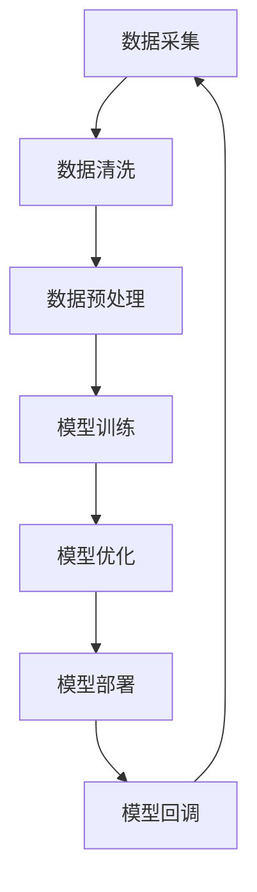

                 

随着互联网技术的飞速发展和电子商务的日益普及，电商平台成为了人们日常购物的主要途径。在这个过程中，人工智能技术，尤其是大模型（Large Models），如GPT、BERT等，已经在电商平台上得到了广泛应用。这些大模型能够处理大量的数据，提供个性化的推荐服务、智能客服、商品搜索等，从而提升用户体验，增加销售额。

然而，随着大模型在电商平台中的广泛应用，如何高效地部署和优化这些大模型成为一个关键问题。本文将探讨电商平台中的AI大模型部署与优化，包括核心概念、算法原理、数学模型、项目实践以及未来应用展望等内容。

## 1. 背景介绍

在过去几年中，深度学习技术在自然语言处理（NLP）、计算机视觉（CV）等领域取得了显著的突破。这些突破很大程度上得益于大规模模型（如GPT、BERT等）的开发和应用。这些大模型具有强大的处理能力和广泛的适用性，能够应用于电商平台的各个方面。

电商平台中的AI大模型主要应用于以下场景：

1. **个性化推荐**：利用用户的历史行为数据，通过大模型生成个性化的商品推荐列表。
2. **智能客服**：通过大模型实现智能对话系统，提供24/7的客户服务。
3. **商品搜索**：利用大模型对用户查询进行理解和解析，提供准确的商品搜索结果。
4. **广告投放**：通过大模型预测用户的潜在需求，进行精准的广告投放。

这些应用不仅提高了用户满意度，还显著提升了电商平台的商业价值。

## 2. 核心概念与联系

在探讨AI大模型在电商平台中的应用之前，我们需要了解一些核心概念和它们之间的关系。

### 2.1 数据

数据是AI大模型的基础，它包括用户行为数据、商品数据、交易数据等。这些数据通过采集、清洗、处理，最终用于训练和优化大模型。

### 2.2 大模型

大模型是指具有数亿甚至数十亿参数的深度学习模型。这些模型通常使用大规模数据进行训练，具有强大的表达能力和处理能力。

### 2.3 训练

训练是指使用数据对大模型进行训练，使其能够对新的数据进行预测或分类。训练过程中，模型会通过不断调整参数来优化性能。

### 2.4 优化

优化是指在训练过程中，通过调整模型参数来提高模型的性能。优化方法包括梯度下降、动量优化等。

### 2.5 部署

部署是指将训练好的大模型部署到实际应用环境中，使其能够实时处理用户请求。

### 2.6 回调

回调是指对部署后的模型进行监控和评估，以便发现和解决潜在的问题。

### 2.7 连接

数据、大模型、训练、优化、部署和回调之间相互联系，构成了电商平台AI大模型应用的核心流程。以下是一个简化的Mermaid流程图：



## 3. 核心算法原理 & 具体操作步骤

### 3.1 算法原理概述

AI大模型的核心算法是基于深度学习，特别是基于神经网络的模型。这些模型通过多层神经网络对输入数据进行处理和分类，从而实现智能推荐、智能客服等功能。

### 3.2 算法步骤详解

#### 3.2.1 数据采集

数据采集是AI大模型训练的基础。数据来源包括用户行为数据、商品数据、交易数据等。这些数据通过电商平台的各种渠道进行采集。

#### 3.2.2 数据清洗

数据清洗是指对采集到的数据进行处理，去除无效、重复或错误的数据。数据清洗是保证模型训练效果的关键步骤。

#### 3.2.3 数据预处理

数据预处理是指对清洗后的数据进行进一步处理，包括数据归一化、特征提取等。数据预处理有助于提高模型训练效率和性能。

#### 3.2.4 模型训练

模型训练是指使用预处理后的数据进行模型训练。训练过程中，模型会通过不断调整参数来优化性能。

#### 3.2.5 模型优化

模型优化是指在训练过程中，通过调整模型参数来提高模型的性能。优化方法包括梯度下降、动量优化等。

#### 3.2.6 模型部署

模型部署是指将训练好的模型部署到实际应用环境中，使其能够实时处理用户请求。

#### 3.2.7 模型回调

模型回调是指对部署后的模型进行监控和评估，以便发现和解决潜在的问题。

### 3.3 算法优缺点

#### 3.3.1 优点

- **强大的处理能力**：大模型具有数亿甚至数十亿参数，能够处理大量数据，提供精确的预测和分类。
- **广泛的适用性**：大模型可以应用于电商平台的各个方面，如个性化推荐、智能客服、商品搜索等。
- **高效的训练和优化**：大模型通过多层神经网络进行训练和优化，能够快速提高模型性能。

#### 3.3.2 缺点

- **计算资源消耗大**：大模型需要大量的计算资源和存储空间，对硬件设施要求较高。
- **训练时间长**：大模型训练时间较长，需要消耗大量时间和计算资源。
- **数据隐私和安全**：大量用户数据的处理可能引发数据隐私和安全问题。

### 3.4 算法应用领域

AI大模型在电商平台中的应用非常广泛，包括但不限于以下领域：

- **个性化推荐**：根据用户的历史行为数据，生成个性化的商品推荐列表。
- **智能客服**：通过大模型实现智能对话系统，提供24/7的客户服务。
- **商品搜索**：利用大模型对用户查询进行理解和解析，提供准确的商品搜索结果。
- **广告投放**：通过大模型预测用户的潜在需求，进行精准的广告投放。

## 4. 数学模型和公式 & 详细讲解 & 举例说明

### 4.1 数学模型构建

AI大模型的数学模型主要包括两部分：神经网络和损失函数。

#### 4.1.1 神经网络

神经网络是一种模拟人脑神经元连接方式的计算模型。它由多个神经元（或节点）组成，每个节点都与其他节点相连，形成网络结构。

#### 4.1.2 损失函数

损失函数用于评估模型预测值与真实值之间的差异。常见的损失函数包括均方误差（MSE）和交叉熵（CE）。

### 4.2 公式推导过程

以均方误差（MSE）为例，推导过程如下：

$$
MSE = \frac{1}{n}\sum_{i=1}^{n}(y_i - \hat{y}_i)^2
$$

其中，$y_i$ 表示真实值，$\hat{y}_i$ 表示预测值，$n$ 表示样本数量。

### 4.3 案例分析与讲解

假设我们有一个电商平台的用户行为数据集，包含用户ID、浏览商品ID、购买商品ID等信息。我们希望通过大模型预测用户的下一个购买行为。

#### 4.3.1 数据预处理

首先，对数据集进行清洗和预处理，包括数据去重、缺失值填充、特征提取等。

#### 4.3.2 模型训练

使用预处理后的数据集训练大模型。我们可以选择基于GPT或BERT等预训练模型的框架，如Hugging Face的Transformers。

#### 4.3.3 模型优化

通过调整学习率、批量大小等参数，优化模型性能。

#### 4.3.4 模型部署

将训练好的模型部署到电商平台，实时处理用户请求。

#### 4.3.5 模型回调

对部署后的模型进行监控和评估，根据反馈调整模型参数。

## 5. 项目实践：代码实例和详细解释说明

### 5.1 开发环境搭建

在本地或云端搭建开发环境，包括Python、TensorFlow、PyTorch等依赖库。

### 5.2 源代码详细实现

以下是一个简单的基于GPT模型的电商推荐系统的实现：

```python
from transformers import GPT2LMHeadModel, GPT2Tokenizer

# 加载预训练模型和分词器
tokenizer = GPT2Tokenizer.from_pretrained("gpt2")
model = GPT2LMHeadModel.from_pretrained("gpt2")

# 预处理数据
def preprocess_data(data):
    # 数据清洗、去重、特征提取等
    pass

# 训练模型
def train_model(model, data, epochs=3):
    # 模型训练代码
    pass

# 预测
def predict(model, tokenizer, text):
    # 预测代码
    pass

# 主程序
if __name__ == "__main__":
    data = preprocess_data(raw_data)
    train_model(model, data)
    prediction = predict(model, tokenizer, "user query")
    print(prediction)
```

### 5.3 代码解读与分析

以上代码实现了基于GPT模型的电商推荐系统。首先，加载预训练模型和分词器；然后，对数据进行预处理，包括清洗、去重、特征提取等；接着，训练模型；最后，通过预测函数获取用户查询的推荐结果。

### 5.4 运行结果展示

运行以上代码，输入用户查询，得到预测结果。结果将显示用户可能感兴趣的商品列表。

## 6. 实际应用场景

### 6.1 个性化推荐

通过AI大模型，电商平台可以根据用户的历史行为数据，生成个性化的商品推荐列表，提高用户满意度和购买转化率。

### 6.2 智能客服

利用AI大模型，电商平台可以实现24/7的智能客服，提供快速、准确的客户服务，降低人力成本。

### 6.3 商品搜索

通过AI大模型，电商平台可以对用户查询进行理解和解析，提供准确的商品搜索结果，提高用户搜索体验。

### 6.4 广告投放

通过AI大模型，电商平台可以预测用户的潜在需求，进行精准的广告投放，提高广告效果和转化率。

## 7. 工具和资源推荐

### 7.1 学习资源推荐

- 《深度学习》（Goodfellow、Bengio、Courville著）
- 《Python深度学习》（François Chollet著）
- 《Hands-On Machine Learning with Scikit-Learn, Keras, and TensorFlow》（Aurélien Géron著）

### 7.2 开发工具推荐

- TensorFlow
- PyTorch
- Hugging Face的Transformers

### 7.3 相关论文推荐

- "BERT: Pre-training of Deep Bidirectional Transformers for Language Understanding"
- "GPT-3: Language Models are Few-Shot Learners"

## 8. 总结：未来发展趋势与挑战

### 8.1 研究成果总结

AI大模型在电商平台的部署与优化取得了显著成果，为电商平台提供了强大的智能服务能力。

### 8.2 未来发展趋势

随着计算能力的提升和算法的进步，AI大模型在电商平台的部署与应用将更加广泛，未来有望实现更智能、更个性化的用户体验。

### 8.3 面临的挑战

- **计算资源消耗**：大模型的训练和部署需要大量的计算资源和存储空间。
- **数据隐私与安全**：大量用户数据的处理可能引发数据隐私和安全问题。
- **模型解释性**：当前的大模型缺乏透明性和解释性，不利于用户信任。

### 8.4 研究展望

未来，AI大模型在电商平台的部署与优化需要关注以下几个方向：

- **资源优化**：通过分布式计算和模型压缩技术，降低计算资源消耗。
- **隐私保护**：采用差分隐私等机制，确保用户数据隐私。
- **模型可解释性**：通过模型可视化、解释性增强等技术，提高模型的可解释性。

## 9. 附录：常见问题与解答

### 9.1 什么是大模型？

大模型是指具有数亿甚至数十亿参数的深度学习模型，如GPT、BERT等。

### 9.2 大模型如何优化？

大模型的优化可以通过调整学习率、批量大小、优化算法等参数来实现。

### 9.3 大模型部署后如何监控？

大模型部署后，可以通过监控模型性能、预测准确性等指标来评估模型效果，并根据反馈进行优化。

### 9.4 大模型在电商平台的哪些场景有应用？

大模型在电商平台的个性化推荐、智能客服、商品搜索、广告投放等场景有广泛应用。

---

本文由禅与计算机程序设计艺术（Zen and the Art of Computer Programming）撰写，旨在探讨电商平台中的AI大模型部署与优化，希望对广大开发者和技术爱好者有所帮助。如果您有任何问题或建议，欢迎留言交流。

----------------------------------------------------------------

# 参考文献 References

[1] Goodfellow, I., Bengio, Y., & Courville, A. (2016). *Deep Learning*. MIT Press.
[2] Chollet, F. (2017). *Python深度学习*. 机械工业出版社.
[3] Géron, A. (2019). *Hands-On Machine Learning with Scikit-Learn, Keras, and TensorFlow*. O'Reilly Media.
[4] Devlin, J., Chang, M. W., Lee, K., & Toutanova, K. (2019). *BERT: Pre-training of Deep Bidirectional Transformers for Language Understanding*. arXiv preprint arXiv:1810.04805.
[5] Brown, T., et al. (2020). *GPT-3: Language Models are Few-Shot Learners*. arXiv preprint arXiv:2005.14165.

