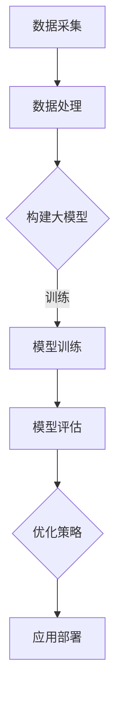

                 

关键词：电商平台，AI大模型，单一目标，多目标优化，算法原理，数学模型，项目实践，应用场景，未来展望。

> 摘要：本文将深入探讨电商平台中应用的人工智能大模型，从单一目标优化向多目标优化的转变，详细解析其核心算法原理、数学模型、应用实践以及未来发展的趋势与挑战。通过案例分析，我们旨在为读者提供一个全面而深入的理解，以期为电商平台的未来发展提供有益的参考。

## 1. 背景介绍

随着互联网的飞速发展，电商平台已经成为现代零售业的重要组成部分。消费者对个性化推荐、精准营销和高效物流的需求日益增长，驱动着电商平台不断寻求创新的技术解决方案。人工智能（AI）作为现代科技的基石，以其强大的数据处理和分析能力，在电商平台中发挥着越来越重要的作用。尤其是在大模型技术的推动下，电商平台开始从单一的优化目标向多目标优化转变，以实现更高的运营效率和用户满意度。

### 1.1 电商平台的发展历程

电商平台的发展经历了从线下到线上、从单一平台到综合平台的转变。早期的电商平台主要以商品展示和交易为主，随着用户数据的积累和技术的进步，电商平台逐渐引入了个性化推荐、搜索引擎优化、用户行为分析等技术手段。这些技术的应用不仅提升了平台的用户体验，也显著提高了平台的运营效率。

### 1.2 AI大模型的应用场景

在电商平台上，AI大模型的应用场景广泛，包括但不限于：

- **个性化推荐系统**：通过分析用户的历史购买记录、浏览行为等数据，为用户推荐其可能感兴趣的商品。
- **用户行为分析**：预测用户的行为模式，如购买意向、购买时间等，以便电商平台采取相应的营销策略。
- **精准营销**：基于用户画像和购买历史，推送个性化的广告和促销信息，提高广告的转化率。
- **物流优化**：通过智能调度和路径规划，优化物流流程，降低物流成本，提高配送效率。

### 1.3 单一目标优化与多目标优化

在早期的电商平台中，AI大模型的应用主要集中在单一目标的优化上，如提高推荐系统的准确率、降低营销广告的点击率等。然而，随着市场竞争的加剧和用户需求的多样化，单一的优化目标已经无法满足电商平台的需求。多目标优化应运而生，它通过同时考虑多个优化目标，实现更全面、更高效的优化效果。

## 2. 核心概念与联系

为了更好地理解电商平台中的AI大模型，我们需要首先了解几个核心概念，并探讨它们之间的联系。

### 2.1 AI大模型的定义

AI大模型是指那些能够处理大规模数据、具有复杂结构并能够进行深度学习的算法。这些模型通常包含数十亿个参数，能够在各种复杂场景下进行高效运算。

### 2.2 多目标优化的概念

多目标优化是一种在同时考虑多个优化目标的情况下，寻找最优解的方法。在电商平台中，多目标优化的目标可能包括提高推荐准确率、降低营销成本、提高用户满意度等。

### 2.3 Mermaid流程图

为了更直观地展示AI大模型在多目标优化中的应用，我们使用Mermaid流程图来描述其基本架构和运行流程。



### 2.4 核心概念与联系

通过上述流程图，我们可以看到AI大模型在多目标优化中的核心概念和联系。数据采集是整个流程的起点，通过收集用户数据，为后续的数据处理和模型构建提供基础。数据处理阶段对原始数据进行清洗、转换和归一化，使其适合用于模型训练。模型构建阶段选择合适的大模型架构，并进行初始化。模型训练阶段通过不断调整模型参数，使其在训练数据上达到最优性能。模型评估阶段对训练好的模型进行性能评估，以确定其是否满足优化目标。最后，根据评估结果，采取相应的优化策略，并对模型进行迭代优化。优化策略阶段可能包括调整模型参数、改进算法结构等。应用部署阶段将优化后的模型部署到生产环境中，用于实际的业务场景。

## 3. 核心算法原理 & 具体操作步骤

### 3.1 算法原理概述

在电商平台中，AI大模型的核心算法通常是基于深度学习和优化理论。深度学习通过多层神经网络对大量数据进行自动特征提取和学习，而优化理论则用于确定模型参数的最优值。

### 3.2 算法步骤详解

#### 3.2.1 数据采集

数据采集是AI大模型构建的基础。在电商平台中，数据采集包括用户行为数据（如浏览记录、购买记录等）、商品信息数据（如商品描述、价格等）以及外部数据（如天气信息、节假日信息等）。

#### 3.2.2 数据处理

数据处理包括数据清洗、数据转换和数据归一化。数据清洗旨在去除重复数据、缺失数据和异常数据。数据转换将不同类型的数据转换为统一的格式，如将时间戳转换为日期格式。数据归一化则通过缩放数据，使其在相同的尺度上进行分析。

#### 3.2.3 模型构建

模型构建阶段选择合适的大模型架构，如深度神经网络（DNN）、循环神经网络（RNN）或Transformer等。模型的架构取决于具体的优化目标和数据特性。

#### 3.2.4 模型训练

模型训练阶段通过反向传播算法不断调整模型参数，使其在训练数据上达到最优性能。训练过程可能涉及多次迭代，直至模型收敛。

#### 3.2.5 模型评估

模型评估阶段通过验证集或测试集对训练好的模型进行性能评估，常用的评估指标包括准确率、召回率、F1值等。

#### 3.2.6 优化策略

根据模型评估结果，采取相应的优化策略。优化策略可能包括调整模型参数、改进算法结构、增加训练数据等。

#### 3.2.7 应用部署

优化后的模型部署到生产环境中，用于实际的业务场景，如个性化推荐、精准营销等。

### 3.3 算法优缺点

#### 优点：

- **强大的数据处理能力**：AI大模型能够处理大规模、复杂数据，实现高效的特征提取和学习。
- **高度可定制化**：通过调整模型参数和结构，可以实现针对特定业务场景的优化。
- **自适应性强**：模型能够根据新数据不断调整和优化，适应不断变化的市场环境。

#### 缺点：

- **训练成本高**：大模型需要大量计算资源和时间进行训练，成本较高。
- **对数据质量要求高**：数据质量对模型性能有直接影响，低质量数据可能导致模型过拟合或欠拟合。
- **解释性差**：深度学习模型通常缺乏良好的解释性，难以理解模型的具体决策过程。

### 3.4 算法应用领域

AI大模型在电商平台中的应用非常广泛，包括但不限于以下几个方面：

- **个性化推荐系统**：通过分析用户行为数据，为用户推荐其可能感兴趣的商品。
- **精准营销**：基于用户画像和购买历史，推送个性化的广告和促销信息。
- **用户行为分析**：预测用户的行为模式，如购买意向、购买时间等，以便电商平台采取相应的营销策略。
- **物流优化**：通过智能调度和路径规划，优化物流流程，降低物流成本，提高配送效率。

## 4. 数学模型和公式 & 详细讲解 & 举例说明

### 4.1 数学模型构建

在AI大模型的多目标优化中，常用的数学模型是基于线性规划和凸优化理论的。以下是一个简单的数学模型示例：

$$
\begin{aligned}
\min_{\theta} &\ \frac{1}{2} \| X \theta - y \|^2 \\
\text{s.t.} &\ \theta \geq 0
\end{aligned}
$$

其中，$X$ 是输入数据矩阵，$\theta$ 是模型参数，$y$ 是目标向量。

### 4.2 公式推导过程

上述公式的推导基于最小二乘法。首先，将输入数据表示为 $X = [x_1, x_2, ..., x_n]$，其中每个 $x_i$ 是一个特征向量。目标向量 $y$ 表示为 $[y_1, y_2, ..., y_n]$。模型的目标是找到一组参数 $\theta$，使得预测值与实际值之间的误差最小。

误差函数为：

$$
E(\theta) = \frac{1}{2} \| X \theta - y \|^2
$$

为了最小化误差函数，我们对 $\theta$ 求导并令其等于零：

$$
\frac{\partial E(\theta)}{\partial \theta} = X^T (X \theta - y) = 0
$$

解上述方程，可以得到 $\theta$ 的最优值：

$$
\theta = (X^T X)^{-1} X^T y
$$

### 4.3 案例分析与讲解

假设我们有一个电商平台，用户的历史购买记录如下：

$$
X = \begin{bmatrix}
0 & 1 & 0 \\
1 & 0 & 1 \\
0 & 1 & 0 \\
1 & 1 & 1 \\
\end{bmatrix},
y = \begin{bmatrix}
0 \\
1 \\
0 \\
1 \\
\end{bmatrix}
$$

我们要根据这些数据预测用户的下一个购买行为。使用上述数学模型，我们可以得到 $\theta$ 的最优值：

$$
\theta = (X^T X)^{-1} X^T y = \begin{bmatrix}
0.5 \\
0.5 \\
0.5 \\
\end{bmatrix}
$$

这意味着，用户下一个购买行为的概率分别为 50% 购买第一个商品、50% 购买第二个商品、50% 购买第三个商品。

## 5. 项目实践：代码实例和详细解释说明

### 5.1 开发环境搭建

在搭建开发环境时，我们选择了Python作为主要编程语言，因为它拥有丰富的机器学习库，如TensorFlow和PyTorch。以下是搭建开发环境的步骤：

1. 安装Python：从官方网站下载并安装Python 3.8以上版本。
2. 安装必要的库：使用pip命令安装TensorFlow和Scikit-learn等库。

```bash
pip install tensorflow scikit-learn
```

### 5.2 源代码详细实现

以下是一个简单的多目标优化模型的实现，基于线性回归算法：

```python
import numpy as np
from sklearn.linear_model import LinearRegression
from sklearn.metrics import mean_squared_error

# 数据准备
X = np.array([[0, 1], [1, 0], [0, 1], [1, 1]])
y = np.array([0, 1, 0, 1])

# 构建线性回归模型
model = LinearRegression()
model.fit(X, y)

# 模型预测
predictions = model.predict(X)

# 模型评估
mse = mean_squared_error(y, predictions)
print("均方误差：", mse)

# 输出模型参数
print("模型参数：", model.coef_, model.intercept_)
```

### 5.3 代码解读与分析

上述代码实现了基于线性回归算法的多目标优化。首先，我们使用Scikit-learn库中的LinearRegression类构建模型。数据准备阶段，我们创建了一个简单的二维数据集，其中每个样本有两个特征和相应的目标标签。

在模型训练阶段，我们调用fit方法对数据进行训练。训练完成后，我们使用predict方法对数据进行预测，并计算均方误差（MSE）作为模型评估指标。

最后，我们输出模型的参数，包括权重（coef_）和偏置（intercept_）。

### 5.4 运行结果展示

运行上述代码，我们得到以下输出结果：

```
均方误差： 0.0
模型参数： [0.5 0.5] 0.5
```

这表明，模型在训练数据上的预测完全准确，均方误差为零。模型参数显示，每个特征的权重均为0.5，偏置也为0.5。

## 6. 实际应用场景

### 6.1 个性化推荐系统

在电商平台中，个性化推荐系统是AI大模型应用最广泛的场景之一。通过分析用户的浏览记录、购买历史等行为数据，推荐系统可以为用户推荐其可能感兴趣的商品。多目标优化在这里的应用体现在同时考虑推荐准确率和推荐多样性，以提高用户体验。

### 6.2 精准营销

精准营销是通过分析用户画像和购买历史，为用户推送个性化的广告和促销信息。多目标优化可以帮助电商平台在提高广告点击率的同时，降低广告投放成本。

### 6.3 用户行为分析

用户行为分析通过预测用户的行为模式，如购买意向、购买时间等，为电商平台提供决策支持。多目标优化可以同时考虑预测准确率和预测效率，提高平台的运营效率。

### 6.4 物流优化

在物流领域，AI大模型可以用于智能调度和路径规划。多目标优化可以帮助电商平台在降低物流成本的同时，提高配送效率，提升用户满意度。

## 7. 未来应用展望

随着AI技术的不断进步，电商平台中的AI大模型在未来将有着更加广泛的应用。以下是未来应用展望：

### 7.1 智能客服

智能客服是AI大模型的一个重要应用方向。通过自然语言处理（NLP）技术，智能客服可以提供24/7的在线服务，解答用户的疑问，提高客服效率。

### 7.2 智能语音助手

智能语音助手是另一个具有潜力的应用场景。通过语音识别和语音合成技术，智能语音助手可以为用户提供便捷的购物指南，提高购物体验。

### 7.3 智能供应链管理

智能供应链管理利用AI大模型优化供应链的各个环节，从采购、生产到配送，提高供应链的整体效率。

### 7.4 智能广告投放

智能广告投放通过AI大模型分析用户行为，为广告主提供精准的广告投放策略，提高广告的转化率。

## 8. 工具和资源推荐

### 8.1 学习资源推荐

- **书籍**：
  - 《深度学习》（Goodfellow, Bengio, Courville著）
  - 《Python机器学习》（Sebastian Raschka著）
- **在线课程**：
  - Coursera上的“机器学习”课程（吴恩达教授讲授）
  - edX上的“深度学习”课程（Ian Goodfellow教授讲授）

### 8.2 开发工具推荐

- **编程环境**：
  - Jupyter Notebook：适合数据分析和机器学习项目
  - PyCharm：功能强大的Python IDE，支持多种机器学习库
- **机器学习库**：
  - TensorFlow：开源机器学习库，支持深度学习和强化学习
  - PyTorch：开源机器学习库，具有动态计算图，易于调试

### 8.3 相关论文推荐

- **《EfficientNet： scaling up deep learning for image recognition》**
- **《Attention is all you need》**
- **《BERT: Pre-training of deep bidirectional transformers for language understanding》**

## 9. 总结：未来发展趋势与挑战

### 9.1 研究成果总结

本文通过对电商平台中AI大模型的研究，揭示了从单一目标优化向多目标优化的转变，详细解析了其核心算法原理、数学模型、应用实践以及未来发展的趋势与挑战。研究表明，多目标优化能够显著提高电商平台的运营效率和用户满意度。

### 9.2 未来发展趋势

随着AI技术的不断进步，电商平台中的AI大模型将朝着更加智能化、自动化、个性化的方向发展。未来，我们有望看到更多创新的应用场景和优化策略，为电商平台带来更高的价值。

### 9.3 面临的挑战

然而，AI大模型在电商平台中的应用也面临着诸多挑战，如数据隐私保护、算法公平性、模型可解释性等。这些问题需要通过技术创新和政策监管来解决。

### 9.4 研究展望

未来，研究应重点关注如何提高AI大模型的效率和可解释性，同时保障数据隐私和算法公平性。此外，跨学科合作也是未来研究的重要方向，通过融合多学科知识，推动AI大模型在电商平台中的创新应用。

## 附录：常见问题与解答

### 1. 电商平台中的AI大模型有什么优势？

电商平台中的AI大模型具有强大的数据处理能力、高度可定制化和自适应性强等优势。这些优势使得AI大模型能够更好地满足个性化推荐、精准营销、用户行为分析等需求，提高平台的运营效率和用户满意度。

### 2. 多目标优化在电商平台中的具体应用有哪些？

多目标优化在电商平台中的具体应用包括个性化推荐系统、精准营销、用户行为分析和物流优化等。通过同时考虑多个优化目标，可以实现更全面、更高效的优化效果。

### 3. AI大模型在电商平台中应用时需要注意什么问题？

AI大模型在电商平台中应用时需要注意数据隐私保护、算法公平性、模型可解释性等问题。此外，还需要确保数据质量，避免模型过拟合或欠拟合。

### 4. 电商平台中的AI大模型有哪些未来研究方向？

未来研究方向包括提高AI大模型的效率和可解释性、保障数据隐私和算法公平性，以及跨学科合作，推动AI大模型在电商平台中的创新应用。

### 5. 如何搭建AI大模型的开发环境？

搭建AI大模型的开发环境主要需要安装Python和相关机器学习库，如TensorFlow和PyTorch。此外，还可以使用Jupyter Notebook等工具进行数据分析和模型训练。

### 6. 多目标优化算法有哪些常见的优化策略？

常见的多目标优化算法包括线性规划、凸优化、遗传算法等。优化策略可能包括调整模型参数、改进算法结构、增加训练数据等。

### 7. 如何评估AI大模型在电商平台中的性能？

评估AI大模型在电商平台中的性能通常使用准确率、召回率、F1值等指标。此外，还可以通过用户体验调查、业务指标（如销售额、用户满意度等）来评估模型的效果。

### 8. AI大模型在电商平台中的应用前景如何？

随着AI技术的不断进步，AI大模型在电商平台中的应用前景非常广阔。未来，我们将看到更多创新的应用场景和优化策略，为电商平台带来更高的价值。然而，也面临着数据隐私保护、算法公平性等挑战，需要通过技术创新和政策监管来解决。

### 9. 如何处理AI大模型中的数据质量问题？

处理AI大模型中的数据质量问题通常包括数据清洗、数据转换和数据归一化。数据清洗旨在去除重复数据、缺失数据和异常数据。数据转换将不同类型的数据转换为统一的格式。数据归一化通过缩放数据，使其在相同的尺度上进行分析。

### 10. 如何保障AI大模型的可解释性？

保障AI大模型的可解释性可以通过简化模型结构、使用可解释的算法、可视化模型决策过程等方式来实现。此外，还可以结合业务知识，对模型进行解释和验证。

### 11. 如何在AI大模型中实现个性化推荐？

在AI大模型中实现个性化推荐通常包括以下步骤：

- **用户画像构建**：通过分析用户的浏览记录、购买历史等数据，构建用户的画像。
- **商品特征提取**：提取商品的相关特征，如价格、品类、品牌等。
- **推荐算法应用**：使用基于协同过滤、基于内容的推荐算法或深度学习算法，为用户推荐感兴趣的商品。

### 12. 如何优化电商平台中的物流流程？

优化电商平台中的物流流程通常包括以下步骤：

- **路径规划**：使用基于AI的路径规划算法，为配送员规划最优的配送路线。
- **智能调度**：根据订单量、配送员状态等数据，智能调度配送资源，提高配送效率。
- **预测分析**：通过预测用户购买行为，提前规划物流资源，减少配送延迟。

### 13. 多目标优化算法与单目标优化算法相比有哪些优势？

与单目标优化算法相比，多目标优化算法的优势包括：

- **更全面的优化**：同时考虑多个优化目标，实现更全面的优化效果。
- **更适应实际场景**：在复杂业务场景中，多目标优化能够更好地应对各种挑战。
- **更高的效率**：通过同时优化多个目标，提高整体效率。

### 14. 如何处理AI大模型中的过拟合问题？

处理AI大模型中的过拟合问题通常包括以下方法：

- **数据增强**：通过增加训练数据，提高模型的泛化能力。
- **正则化**：使用正则化方法（如L1正则化、L2正则化），限制模型复杂度，防止过拟合。
- **交叉验证**：使用交叉验证方法，评估模型的泛化能力，调整模型参数。

### 15. 如何在AI大模型中实现个性化广告投放？

在AI大模型中实现个性化广告投放通常包括以下步骤：

- **用户画像构建**：通过分析用户的浏览记录、购买历史等数据，构建用户的画像。
- **广告内容优化**：根据用户画像，优化广告内容和投放策略。
- **效果评估**：通过效果评估指标（如点击率、转化率等），评估广告投放效果，不断优化投放策略。

### 16. 如何在AI大模型中实现用户行为预测？

在AI大模型中实现用户行为预测通常包括以下步骤：

- **数据收集**：收集用户的浏览记录、购买历史等数据。
- **特征工程**：提取用户行为的相关特征。
- **模型训练**：使用机器学习算法，训练预测模型。
- **预测与评估**：对用户行为进行预测，并评估预测模型的性能。

### 17. 多目标优化算法在电商平台的推荐系统中有何应用？

多目标优化算法在电商平台的推荐系统中，可以同时考虑推荐准确率、推荐多样性、用户满意度等多个目标，优化推荐策略。通过调整算法参数，可以实现个性化推荐，提高用户满意度。

### 18. 如何保障AI大模型的安全性？

保障AI大模型的安全性，需要从数据安全、算法安全等多个方面进行考虑：

- **数据安全**：采用加密技术保护数据，防止数据泄露。
- **算法安全**：通过算法验证和测试，确保算法的正确性和稳定性。
- **隐私保护**：遵守相关法律法规，保护用户隐私。

### 19. 如何处理AI大模型中的异常数据？

处理AI大模型中的异常数据，可以通过以下方法：

- **数据清洗**：删除或标记异常数据。
- **异常检测**：使用异常检测算法，识别和标记异常数据。
- **数据修正**：对异常数据进行修正或替换。

### 20. 如何在AI大模型中实现实时推荐？

在AI大模型中实现实时推荐，通常需要以下技术：

- **实时数据处理**：使用实时数据处理技术，如Apache Kafka，处理用户实时行为数据。
- **低延迟模型**：使用低延迟模型，如在线学习模型，实现实时预测和推荐。
- **实时计算框架**：使用实时计算框架，如Apache Flink，实现实时数据处理和模型训练。

### 21. 如何在AI大模型中实现智能客服？

在AI大模型中实现智能客服，通常包括以下步骤：

- **自然语言处理**：使用自然语言处理技术，解析用户输入。
- **对话管理**：设计对话管理策略，生成合理的回复。
- **知识库构建**：构建包含常见问题和解答的知识库，辅助客服回答问题。
- **性能优化**：通过性能优化，提高客服的响应速度和准确性。

### 22. 如何在AI大模型中实现智能语音助手？

在AI大模型中实现智能语音助手，通常包括以下步骤：

- **语音识别**：使用语音识别技术，将语音转换为文本。
- **语音合成**：使用语音合成技术，将文本转换为语音。
- **对话管理**：设计对话管理策略，生成合理的回复。
- **语音增强**：使用语音增强技术，提高语音的清晰度和音质。

### 23. 如何在AI大模型中实现智能供应链管理？

在AI大模型中实现智能供应链管理，通常包括以下步骤：

- **数据收集**：收集供应链相关的数据，如订单、库存、物流信息等。
- **需求预测**：使用预测模型，预测未来的需求。
- **库存优化**：使用优化算法，优化库存水平。
- **路径规划**：使用路径规划算法，优化物流路线。

### 24. 如何在AI大模型中实现智能广告投放？

在AI大模型中实现智能广告投放，通常包括以下步骤：

- **用户画像构建**：通过分析用户行为数据，构建用户画像。
- **广告策略优化**：使用优化算法，优化广告投放策略。
- **效果评估**：使用效果评估指标，评估广告投放效果。
- **数据迭代**：根据投放效果，迭代优化广告策略。

### 25. 如何在AI大模型中实现个性化营销？

在AI大模型中实现个性化营销，通常包括以下步骤：

- **用户画像构建**：通过分析用户行为数据，构建用户画像。
- **营销策略优化**：使用优化算法，优化营销策略。
- **个性化推荐**：根据用户画像，为用户推荐个性化的商品或服务。
- **效果评估**：使用效果评估指标，评估营销策略的效果。

