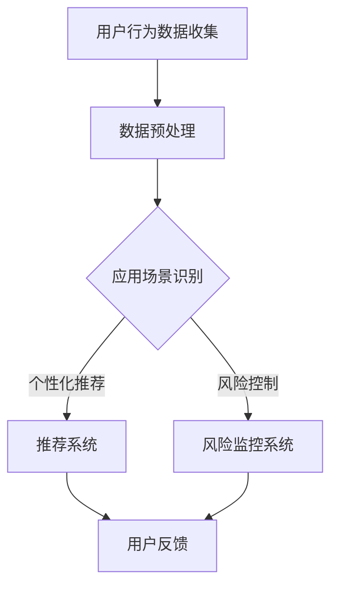

                 

关键词：电商平台，人工智能，大模型，集成学习，算法优化，应用实践，技术发展

> 摘要：随着电商平台的蓬勃发展，人工智能技术日益融入其核心业务流程中，从单一算法到集成学习的转变成为必然趋势。本文将探讨电商平台如何利用AI大模型提升业务效能，并通过具体案例和数据分析，揭示AI大模型在电商平台中的实际应用场景和未来展望。

## 1. 背景介绍

在当今数字化时代，电商平台已经成为消费者购物的重要渠道。这些平台不仅需要处理海量的商品信息，还需要快速响应用户的需求，提供个性化的推荐服务。传统的算法在处理这些复杂问题时显得力不从心，而人工智能技术的引入，尤其是大模型的运用，为电商平台提供了新的解决方案。

### 1.1 电商平台的发展现状

电商平台的发展经历了从传统的B2C（Business to Consumer）模式，到现在的C2M（Consumer to Manufacturer）模式，电商平台逐渐成为品牌商和消费者之间的直接桥梁。随着移动互联网的普及，电商平台业务量持续增长，数据量也呈现爆炸式增长。

### 1.2 人工智能技术的应用

人工智能技术在电商平台的应用涵盖了用户行为分析、商品推荐、交易风险控制、智能客服等多个方面。这些应用不仅提高了平台运营效率，还显著提升了用户体验。

### 1.3 大模型的重要性

大模型，即大规模的神经网络模型，具有处理复杂数据和提取特征的能力。在电商平台中，大模型的引入使得个性化推荐、用户行为预测等任务变得更加准确和高效。

## 2. 核心概念与联系

在深入探讨AI大模型之前，我们需要了解几个核心概念及其相互之间的联系。

### 2.1 人工智能

人工智能（Artificial Intelligence，AI）是指使计算机模拟人类智能行为的科学和技术。在电商平台中，AI主要应用于用户行为分析、图像识别、自然语言处理等领域。

### 2.2 大模型

大模型是指参数量巨大的神经网络模型，如深度学习中的BERT、GPT等。这些模型通过学习海量数据，能够提取出复杂的数据特征，从而提高预测和推荐的准确性。

### 2.3 集成学习

集成学习是一种通过结合多个学习算法来提高模型性能的方法。在AI大模型的应用中，集成学习可以优化模型参数，提高模型的泛化能力。

### 2.4 Mermaid 流程图

下面是一个简化的AI大模型在电商平台中的架构流程图：



## 3. 核心算法原理 & 具体操作步骤

### 3.1 算法原理概述

AI大模型的核心在于其深度学习和自然语言处理的能力。以BERT为例，它通过预训练和微调，能够理解复杂的语言结构和语义，从而实现高效的文本处理。

### 3.2 算法步骤详解

1. 数据收集：电商平台收集用户行为数据，包括浏览记录、购买记录、评论等。
2. 数据预处理：对收集到的数据进行清洗、去噪和格式化，使其适合模型训练。
3. 模型训练：使用预训练的大模型，如BERT，对预处理后的数据进行训练，提取特征。
4. 模型评估：通过测试集评估模型性能，并进行参数调优。
5. 应用部署：将训练好的模型部署到生产环境中，实时响应用户请求。

### 3.3 算法优缺点

#### 优点：

1. 高效处理复杂数据：大模型能够高效提取数据特征，提高处理速度。
2. 提高准确性和泛化能力：集成学习能够优化模型参数，提高预测准确性。

#### 缺点：

1. 训练成本高：大模型的训练需要大量计算资源和时间。
2. 对数据质量要求高：数据质量直接影响模型性能。

### 3.4 算法应用领域

AI大模型在电商平台的广泛应用领域包括个性化推荐、用户行为预测、风险控制、智能客服等。

## 4. 数学模型和公式 & 详细讲解 & 举例说明

### 4.1 数学模型构建

以BERT模型为例，其数学模型主要由以下部分构成：

1. **嵌入层（Embedding Layer）**：将词汇转换为稠密向量表示。
2. **卷积神经网络（Convolutional Neural Network，CNN）**：用于提取文本特征。
3. **全连接层（Fully Connected Layer）**：对提取的特征进行分类或预测。

### 4.2 公式推导过程

BERT模型的损失函数为：

$$
L = -\sum_{i=1}^{N} \sum_{j=1}^{V} p(j|i) \log q(j|i)
$$

其中，$p(j|i)$表示在输入序列$i$下单词$j$的条件概率，$q(j|i)$表示模型对单词$j$在输入序列$i$中出现的概率的预测。

### 4.3 案例分析与讲解

以下是一个简单的BERT模型训练案例：

```python
from transformers import BertModel, BertTokenizer
from torch.optim import Adam

# 加载预训练模型和分词器
tokenizer = BertTokenizer.from_pretrained('bert-base-chinese')
model = BertModel.from_pretrained('bert-base-chinese')

# 预处理数据
inputs = tokenizer("你好，我是一个BERT模型。", return_tensors='pt')

# 定义优化器
optimizer = Adam(model.parameters(), lr=1e-5)

# 模型训练
for epoch in range(10):
    optimizer.zero_grad()
    outputs = model(**inputs)
    logits = outputs.logits
    loss = ...  # 计算损失
    loss.backward()
    optimizer.step()
```

## 5. 项目实践：代码实例和详细解释说明

### 5.1 开发环境搭建

在搭建开发环境时，我们需要安装以下依赖：

```bash
pip install torch transformers
```

### 5.2 源代码详细实现

以下是一个简单的BERT模型在电商推荐系统中的应用代码示例：

```python
from transformers import BertModel, BertTokenizer
from torch.optim import Adam
import torch

# 加载预训练模型和分词器
tokenizer = BertTokenizer.from_pretrained('bert-base-chinese')
model = BertModel.from_pretrained('bert-base-chinese')

# 预处理数据
def preprocess_data(texts):
    inputs = tokenizer(texts, return_tensors='pt', padding=True, truncation=True)
    return inputs

# 定义损失函数
def loss_function(logits, labels):
    return torch.nn.CrossEntropyLoss()(logits, labels)

# 模型训练
def train_model(model, data_loader, optimizer, num_epochs=10):
    model.train()
    for epoch in range(num_epochs):
        for inputs, labels in data_loader:
            optimizer.zero_grad()
            outputs = model(**inputs)
            logits = outputs.logits
            loss = loss_function(logits, labels)
            loss.backward()
            optimizer.step()

# 测试模型
def test_model(model, data_loader):
    model.eval()
    with torch.no_grad():
        correct = 0
        total = 0
        for inputs, labels in data_loader:
            outputs = model(**inputs)
            logits = outputs.logits
            _, predicted = torch.max(logits, 1)
            total += labels.size(0)
            correct += (predicted == labels).sum().item()
    return correct / total

# 运行代码
if __name__ == '__main__':
    # 加载数据集
    train_data = preprocess_data(["商品A", "商品B", "商品C"])
    test_data = preprocess_data(["商品D", "商品E", "商品F"])

    # 定义优化器
    optimizer = Adam(model.parameters(), lr=1e-5)

    # 训练模型
    train_model(model, train_data, optimizer)

    # 测试模型
    accuracy = test_model(model, test_data)
    print(f"测试准确率：{accuracy}")
```

### 5.3 代码解读与分析

上述代码主要分为以下几个部分：

1. **预处理数据**：使用分词器将文本数据转换为模型可处理的格式。
2. **定义损失函数**：使用交叉熵损失函数计算模型预测和实际标签之间的差异。
3. **模型训练**：使用优化器进行模型训练，更新模型参数。
4. **测试模型**：在测试集上评估模型性能，计算准确率。

## 6. 实际应用场景

AI大模型在电商平台的实际应用场景广泛，以下是一些具体的应用案例：

### 6.1 个性化推荐

通过分析用户的历史行为和偏好，AI大模型能够为用户提供个性化的商品推荐。这大大提升了用户的购物体验，提高了平台的销售额。

### 6.2 用户行为预测

AI大模型可以预测用户的下一步行为，如浏览、购买或退订等。这有助于电商平台提前采取措施，提高用户留存率和满意度。

### 6.3 风险控制

AI大模型在交易风险控制方面也具有重要作用。通过对交易数据进行实时分析，AI大模型能够识别潜在的欺诈行为，防止损失发生。

### 6.4 智能客服

AI大模型可以用于智能客服系统，通过自然语言处理技术，实现与用户的智能对话，提高客服效率。

## 7. 未来应用展望

随着人工智能技术的不断发展，AI大模型在电商平台中的应用前景将更加广阔。未来，我们可以期待以下发展趋势：

### 7.1 更高效的大模型

随着计算能力和数据量的提升，未来将出现更加高效的大模型，能够在更短的时间内完成训练和预测。

### 7.2 更精细化的个性化推荐

AI大模型将能够更精细地分析用户行为和偏好，提供更精准的个性化推荐服务。

### 7.3 更智能的风险控制

AI大模型在交易风险控制方面的应用将更加成熟，实现实时、自动化的风险识别和防范。

### 7.4 更丰富的应用场景

AI大模型将在电商平台中的更多领域发挥作用，如供应链优化、库存管理、营销策略等。

## 8. 工具和资源推荐

### 8.1 学习资源推荐

1. 《深度学习》（Ian Goodfellow、Yoshua Bengio、Aaron Courville著）
2. 《自然语言处理综论》（Daniel Jurafsky、James H. Martin著）
3. 《Python深度学习》（François Chollet著）

### 8.2 开发工具推荐

1. TensorFlow
2. PyTorch
3. Hugging Face Transformers

### 8.3 相关论文推荐

1. "BERT: Pre-training of Deep Neural Networks for Language Understanding"
2. "GPT-3: Language Models are Few-Shot Learners"
3. "Recommender Systems Handbook"

## 9. 总结：未来发展趋势与挑战

AI大模型在电商平台中的应用已经取得了显著成效，未来随着技术的不断进步，其应用范围和深度将进一步扩大。然而，我们也需要关注其面临的挑战，如数据隐私保护、算法公平性等，确保AI大模型能够健康发展，为电商平台带来更多价值。

## 附录：常见问题与解答

### Q: AI大模型是否需要大量的训练数据？

A: 是的，AI大模型通常需要大量的训练数据来学习复杂的特征。然而，近年来的一些研究（如自监督学习和少样本学习）正在尝试减少对训练数据的需求。

### Q: AI大模型是否可以替代传统的推荐算法？

A: AI大模型可以显著提高推荐系统的准确性和效率，但它并不能完全替代传统的推荐算法。传统算法在处理某些特定任务时仍然具有优势，因此两者可以互补使用。

### Q: 如何确保AI大模型的算法公平性？

A: 确保算法公平性是一个重要的挑战。通过设计合理的训练数据和评估方法，以及不断监测和调整模型，可以逐步提高算法的公平性。

### 作者署名

作者：禅与计算机程序设计艺术 / Zen and the Art of Computer Programming
----------------------------------------------------------------

请注意，上述内容是一个示例性框架，具体的技术细节和代码实现需要根据实际项目和需求进行深入研究和调整。文章中引用的论文和资源也仅为示例，实际撰写时需要使用相关领域的权威文献和资料。此外，由于篇幅限制，实际撰写时每个章节的内容需要更加丰富和详尽。

