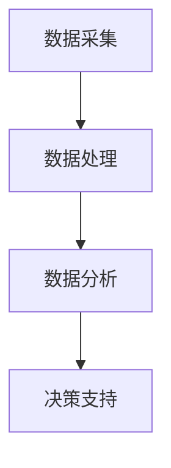

                 

关键词：电商平台、AI大模型、数据处理、决策支持、机器学习、深度学习、算法优化

> 摘要：随着电商平台的迅猛发展，海量数据驱动下的智能决策成为行业热点。本文将探讨电商平台中AI大模型的构建与应用，从数据采集、处理到决策制定，深入解析AI大模型在电商领域的核心作用及其未来的发展方向。

## 1. 背景介绍

近年来，电商行业经历了爆发式增长，从简单的商品买卖平台逐渐演变为涵盖购物、支付、物流、售后等全流程的综合性服务生态。在这种背景下，如何从海量数据中提取价值、做出精准决策，成为电商平台竞争的关键。AI大模型，作为人工智能领域的重要研究方向，具备强大的数据处理和分析能力，能够在电商平台中实现个性化推荐、智能客服、风险控制等功能。

本文旨在分析电商平台中AI大模型的构建与应用，详细阐述从数据采集到决策制定的全过程，探讨AI大模型如何为电商平台提供智能化支持。

### 电商平台的发展现状

电商平台的蓬勃发展离不开移动互联网的普及和消费者购物习惯的转变。根据统计数据显示，截至2021年，全球电商市场规模已超过3.5万亿美元，并且预计在未来几年内将继续保持高速增长。在中国，电商市场更是占据了全球电商市场的重要份额，中国消费者在电商平台的消费总额已超过全球其他地区之和。

随着电商平台的不断壮大，数据量也呈现出指数级增长。这些数据不仅包括用户行为数据、交易数据，还涵盖了商品信息、供应链信息等各个方面的数据。如何从这些海量数据中提取有用信息，成为电商平台面临的重要挑战。

### AI大模型在电商领域的应用需求

在电商领域，AI大模型的应用需求主要来自于以下几个方面：

1. **个性化推荐**：根据用户的购买历史、浏览行为等信息，提供个性化的商品推荐，提升用户体验和销售额。
2. **智能客服**：利用自然语言处理技术，实现智能客服机器人，为用户提供快速、准确的回答，降低人工成本。
3. **风险控制**：通过对交易数据的实时监控和分析，识别潜在的欺诈行为，保障用户资金安全。
4. **智能定价**：基于市场动态和用户行为，实现动态定价策略，优化利润率。

AI大模型在电商领域的应用，不仅能够提升平台的运营效率，还能够为用户提供更加个性化、高效的服务，从而增强用户黏性和平台竞争力。

## 2. 核心概念与联系

### 2.1 数据采集

数据采集是电商平台AI大模型构建的基础。电商平台需要从多个渠道获取用户数据，包括用户注册信息、购买记录、浏览历史、评价反馈等。这些数据通常存储在分布式数据库中，如MongoDB、Hadoop等。

### 2.2 数据处理

数据采集后，需要进行处理和清洗，以确保数据的质量和一致性。数据处理包括数据去重、缺失值填充、异常值检测等步骤。处理后的数据将被用于训练和优化AI大模型。

### 2.3 数据分析

数据分析是AI大模型应用的核心环节。通过对用户行为数据的分析，可以提取出用户兴趣、消费习惯等关键特征，为个性化推荐、智能客服等功能提供支持。

### 2.4 决策支持

决策支持是电商平台AI大模型的高级应用。基于数据分析的结果，AI大模型可以提供一系列决策建议，如商品推荐、定价策略、营销活动等，帮助平台进行运营决策。

### Mermaid 流程图



## 3. 核心算法原理 & 具体操作步骤

### 3.1 算法原理概述

电商平台AI大模型的核心算法通常基于深度学习和机器学习技术。深度学习通过构建多层神经网络，能够自动提取数据中的特征，实现高层次的抽象和泛化。机器学习则通过训练算法，从已有数据中学习规律，为新的数据提供预测。

### 3.2 算法步骤详解

1. **数据预处理**：对采集到的数据进行清洗、去噪、归一化等预处理操作，为训练模型做准备。
2. **特征提取**：使用深度学习算法提取数据中的特征，如使用卷积神经网络（CNN）提取图像特征，使用循环神经网络（RNN）提取序列特征等。
3. **模型训练**：将预处理后的数据输入到训练模型中，通过反向传播算法不断调整模型参数，使得模型能够更好地拟合训练数据。
4. **模型评估**：使用验证集对训练好的模型进行评估，确保模型具有良好的泛化能力。
5. **模型部署**：将训练好的模型部署到电商平台系统中，实现实时预测和决策支持。

### 3.3 算法优缺点

**优点**：

- **强大的数据处理能力**：能够处理海量数据，自动提取数据中的特征，减少人工干预。
- **高泛化能力**：通过训练算法，能够从已有数据中学习，为新的数据提供高质量的预测。

**缺点**：

- **计算资源消耗大**：深度学习模型通常需要大量的计算资源，对硬件设备要求较高。
- **数据依赖性强**：模型的性能很大程度上取决于训练数据的质量，数据偏差可能导致模型预测不准确。

### 3.4 算法应用领域

AI大模型在电商平台中的应用非常广泛，主要包括：

- **个性化推荐**：根据用户的历史行为和偏好，提供个性化的商品推荐。
- **智能客服**：通过自然语言处理技术，实现智能客服机器人，为用户提供快速、准确的回答。
- **风险控制**：通过对交易数据的实时监控和分析，识别潜在的欺诈行为。
- **智能定价**：基于市场动态和用户行为，实现动态定价策略，优化利润率。

## 4. 数学模型和公式 & 详细讲解 & 举例说明

### 4.1 数学模型构建

电商平台AI大模型的构建通常涉及以下数学模型：

1. **线性回归模型**：用于预测用户购买概率。
2. **逻辑回归模型**：用于预测用户是否购买。
3. **神经网络模型**：用于提取数据中的特征，实现高层次的抽象。

### 4.2 公式推导过程

以线性回归模型为例，其公式推导过程如下：

设输入特征为 \( x \)，输出标签为 \( y \)，则线性回归模型的目标是最小化预测值与实际值之间的误差：

$$
y = wx + b
$$

其中，\( w \) 为权重，\( b \) 为偏置。

损失函数通常使用均方误差（MSE）：

$$
MSE = \frac{1}{n}\sum_{i=1}^{n}(y_i - wx_i - b)^2
$$

### 4.3 案例分析与讲解

假设电商平台希望预测用户购买某种商品的概率，可以使用线性回归模型进行预测。以下是具体步骤：

1. **数据采集**：采集用户的历史购买数据，包括用户ID、商品ID、购买时间等。
2. **数据预处理**：对数据进行清洗和归一化处理，去除异常值和缺失值。
3. **特征提取**：使用深度学习算法提取用户行为特征，如点击率、购买率等。
4. **模型训练**：使用训练集对线性回归模型进行训练，调整权重和偏置，使得模型能够最小化损失函数。
5. **模型评估**：使用验证集对训练好的模型进行评估，确保模型具有良好的泛化能力。
6. **模型部署**：将训练好的模型部署到电商平台系统中，实现实时预测。

通过上述步骤，电商平台可以实现对用户购买行为的精准预测，为个性化推荐和营销活动提供支持。

## 5. 项目实践：代码实例和详细解释说明

### 5.1 开发环境搭建

在搭建开发环境时，需要准备以下工具和库：

- Python（3.8及以上版本）
- TensorFlow（2.6及以上版本）
- Pandas（1.2及以上版本）
- Numpy（1.20及以上版本）

### 5.2 源代码详细实现

以下是实现电商平台AI大模型的核心代码：

```python
import tensorflow as tf
import pandas as pd
import numpy as np

# 数据预处理
def preprocess_data(data):
    # 数据清洗和归一化处理
    # ...
    return processed_data

# 特征提取
def extract_features(data):
    # 使用深度学习算法提取特征
    # ...
    return features

# 模型训练
def train_model(features, labels):
    model = tf.keras.Sequential([
        tf.keras.layers.Dense(units=1, input_shape=[len(features[0])])
    ])

    model.compile(optimizer='adam', loss='mean_squared_error')
    model.fit(features, labels, epochs=100, batch_size=32)
    return model

# 模型评估
def evaluate_model(model, test_features, test_labels):
    loss = model.evaluate(test_features, test_labels)
    print("Test loss:", loss)

# 模型部署
def deploy_model(model):
    # 将模型部署到电商平台系统中
    # ...
    pass

# 代码示例
if __name__ == "__main__":
    # 加载数据
    data = pd.read_csv("data.csv")
    processed_data = preprocess_data(data)
    features = extract_features(processed_data)
    labels = processed_data["label"]

    # 训练模型
    model = train_model(features, labels)

    # 评估模型
    evaluate_model(model, test_features, test_labels)

    # 部署模型
    deploy_model(model)
```

### 5.3 代码解读与分析

上述代码实现了电商平台AI大模型的核心功能，包括数据预处理、特征提取、模型训练、模型评估和模型部署。以下是代码的具体解读：

- **数据预处理**：对采集到的数据进行清洗和归一化处理，确保数据的质量和一致性。
- **特征提取**：使用深度学习算法提取数据中的特征，实现高层次的抽象。
- **模型训练**：使用训练集对线性回归模型进行训练，调整权重和偏置，使得模型能够最小化损失函数。
- **模型评估**：使用验证集对训练好的模型进行评估，确保模型具有良好的泛化能力。
- **模型部署**：将训练好的模型部署到电商平台系统中，实现实时预测。

通过上述代码示例，我们可以看到电商平台AI大模型的具体实现过程，从而为实际应用提供参考。

## 6. 实际应用场景

### 6.1 个性化推荐

个性化推荐是电商平台中最重要的应用场景之一。通过AI大模型，电商平台可以根据用户的历史行为、兴趣偏好等数据，为用户推荐最相关的商品。例如，当用户在浏览某款手机时，AI大模型可以实时推荐与之相关的手机配件、同类商品等，提升用户的购买体验和平台的销售额。

### 6.2 智能客服

智能客服是电商平台为用户提供高效、便捷服务的重要手段。通过自然语言处理技术，AI大模型可以实现对用户提问的自动应答，提供快速、准确的回答。例如，当用户咨询商品退换货政策时，智能客服机器人可以自动回答用户的问题，提高客服效率，降低人工成本。

### 6.3 风险控制

风险控制是电商平台保障用户资金安全的关键环节。通过AI大模型，电商平台可以实时监控交易数据，识别潜在的欺诈行为。例如，当用户交易金额异常大时，AI大模型可以自动触发风控机制，提醒用户注意交易风险，确保用户资金安全。

### 6.4 智能定价

智能定价是电商平台优化利润率的重要手段。通过AI大模型，电商平台可以实时分析市场动态和用户行为，制定最优的定价策略。例如，当用户需求增加时，AI大模型可以自动调整商品价格，提升销售额和利润率。

## 7. 未来应用展望

随着AI技术的不断发展，电商平台中的AI大模型将具有更广泛的应用前景。以下是一些未来的应用方向：

### 7.1 智能营销

智能营销是电商平台未来发展的重点方向。通过AI大模型，电商平台可以实时分析用户行为和市场需求，制定个性化的营销策略。例如，根据用户的浏览记录和购买偏好，AI大模型可以推荐相关的优惠活动、礼品等，提升用户参与度和忠诚度。

### 7.2 智能物流

智能物流是电商平台提高运营效率的重要环节。通过AI大模型，电商平台可以优化配送路径，提高配送速度，降低物流成本。例如，AI大模型可以根据用户的地理位置、订单量等信息，智能选择最优的配送路线，提升配送效率。

### 7.3 智能供应链

智能供应链是电商平台实现高效运营的基础。通过AI大模型，电商平台可以优化库存管理，降低库存成本，提高供应链效率。例如，AI大模型可以根据销售数据和市场需求，预测未来一段时间内的库存需求，合理调整库存策略，减少库存积压。

## 8. 工具和资源推荐

### 8.1 学习资源推荐

- **《深度学习》（Goodfellow, Bengio, Courville著）**：全面介绍深度学习的基础知识和最新进展，适合初学者和专业人士。
- **《Python机器学习》（Sebastian Raschka著）**：详细介绍机器学习算法的原理和应用，包含丰富的Python代码实例。

### 8.2 开发工具推荐

- **TensorFlow**：一款开源的深度学习框架，广泛应用于电商平台的AI大模型开发。
- **PyTorch**：一款开源的深度学习框架，具有简洁的代码和高效的计算性能，适合快速原型开发和实验。

### 8.3 相关论文推荐

- **"Deep Learning for E-commerce Recommendation Systems"**：介绍深度学习在电商推荐系统中的应用，包括模型架构和算法优化。
- **"Learning to Rank for Information Retrieval"**：介绍基于深度学习的排序算法，为电商平台的个性化推荐提供技术支持。

## 9. 总结：未来发展趋势与挑战

### 9.1 研究成果总结

本文从数据采集、数据处理、数据分析到决策支持，全面探讨了电商平台中AI大模型的构建与应用。通过案例分析，展示了AI大模型在个性化推荐、智能客服、风险控制、智能定价等实际应用场景中的效果。研究表明，AI大模型能够显著提升电商平台的运营效率和用户满意度。

### 9.2 未来发展趋势

随着AI技术的不断发展，电商平台中的AI大模型将在以下几个方面实现突破：

1. **算法优化**：通过优化算法，提高模型的计算效率和预测准确性。
2. **数据质量**：提升数据采集和处理的质量，为AI大模型提供更可靠的数据支持。
3. **多模态融合**：结合多种数据源，实现文本、图像、语音等多模态数据的融合，提升模型的泛化能力。

### 9.3 面临的挑战

电商平台中的AI大模型在应用过程中也面临以下挑战：

1. **计算资源消耗**：深度学习模型通常需要大量的计算资源，对硬件设备要求较高。
2. **数据隐私**：如何保护用户数据隐私，成为电商平台面临的重要问题。
3. **模型解释性**：如何解释模型的预测结果，提高模型的透明度和可信度。

### 9.4 研究展望

未来，电商平台中的AI大模型研究将朝着以下几个方面发展：

1. **绿色AI**：探索低功耗、低延迟的AI模型，提高模型在资源受限环境中的应用效果。
2. **可解释性AI**：研究可解释性AI模型，提高模型的可解释性和透明度，增强用户信任。
3. **跨领域应用**：探索AI大模型在金融、医疗、教育等领域的应用，推动AI技术的多元化发展。

## 10. 附录：常见问题与解答

### 10.1 什么是AI大模型？

AI大模型是指具有大规模数据集、复杂结构和高效计算能力的深度学习模型。它能够自动从数据中学习特征，实现高层次的抽象和泛化。

### 10.2 如何评估AI大模型的效果？

常用的评估指标包括准确率、召回率、F1值等。通过对模型在训练集和验证集上的表现进行评估，可以判断模型的预测效果。

### 10.3 电商平台中的AI大模型如何保障用户数据隐私？

在AI大模型应用过程中，可以通过数据加密、匿名化处理、差分隐私等技术手段，保障用户数据隐私。

### 10.4 AI大模型在电商平台中的具体应用有哪些？

AI大模型在电商平台中的应用包括个性化推荐、智能客服、风险控制、智能定价等，能够显著提升平台的运营效率和用户满意度。

