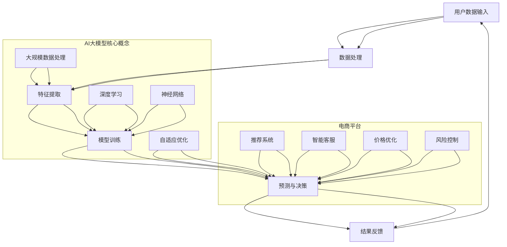

                 

关键词：AI大模型、电商平台、被动响应、主动预测、技术发展、应用场景、未来展望

> 摘要：本文将探讨电商平台中AI大模型的发展趋势，分析其从被动响应到主动预测的转变。通过对核心概念、算法原理、数学模型及实践案例的详细解读，本文旨在为行业提供有价值的参考和展望。

## 1. 背景介绍

随着互联网和电子商务的迅猛发展，电商平台已经成为人们日常生活中不可或缺的一部分。在这样一个高度竞争的市场中，如何提升用户体验、优化运营效率和增加销售额成为了电商平台的重要课题。近年来，人工智能技术，尤其是AI大模型，在电商平台中的应用逐渐增多，其带来的变革和影响不容忽视。

AI大模型，即深度学习模型中的大型神经网络，具有处理海量数据、自适应优化和泛化能力强的特点。在电商平台中，这些模型通常被用于推荐系统、智能客服、价格优化、风险控制等多个领域。然而，传统的AI应用模式往往是被动响应式的，即根据用户的历史行为或输入进行预测和决策。这种模式虽然在一定程度上提高了平台的运营效率，但未能充分利用AI的潜力。

随着AI技术的不断进步，电商平台正在从被动响应向主动预测转变。主动预测意味着模型能够根据用户的行为模式、市场需求等动态信息，提前做出决策和调整，从而更好地满足用户需求，提升用户体验。本文将围绕这一主题展开讨论，分析AI大模型在电商平台中的应用，探讨其从被动响应到主动预测的转变过程。

## 2. 核心概念与联系

在探讨电商平台中的AI大模型之前，有必要明确几个核心概念，并分析它们之间的联系。以下是一个用Mermaid绘制的流程图，展示了AI大模型在电商平台中的应用架构。



### 2.1 用户数据输入

用户数据输入是电商平台AI大模型的基础。这些数据包括用户的行为数据（如浏览记录、购买历史）、交互数据（如评论、反馈）以及外部数据（如社交媒体信息、市场动态）。这些数据通过API、爬虫或其他数据收集工具输入到系统中。

### 2.2 数据处理

数据处理是对用户数据进行清洗、预处理和转换的过程。这一步骤至关重要，因为数据的质量直接影响模型的性能。数据处理包括去除噪声、填充缺失值、标准化、特征工程等。

### 2.3 特征提取

特征提取是从原始数据中提取出对模型训练有用的特征。特征提取的质量直接影响模型的泛化能力。在这一步骤中，AI大模型利用深度学习技术，自动从海量数据中学习出具有区分度的特征。

### 2.4 模型训练

模型训练是使用处理后的数据训练深度学习模型的过程。在这一阶段，神经网络通过反向传播算法不断调整权重，以达到最小化损失函数的目的。训练过程通常需要大量的计算资源和时间。

### 2.5 预测与决策

预测与决策是AI大模型的核心功能。模型根据训练结果，对用户的下一步行为进行预测，并生成相应的决策。例如，在推荐系统中，模型预测用户可能感兴趣的商品，并推荐给用户。

### 2.6 结果反馈

结果反馈是模型训练的最后一个环节。系统将预测结果与实际结果进行对比，评估模型的性能，并根据反馈调整模型参数，以提高预测准确性。

### 2.7 电商平台中的应用

在电商平台中，AI大模型被广泛应用于多个领域，包括推荐系统、智能客服、价格优化和风险控制。以下是对这些应用领域的简要介绍。

- **推荐系统**：利用AI大模型预测用户可能感兴趣的商品，从而提高用户留存率和销售额。
- **智能客服**：通过自然语言处理技术，AI大模型能够理解用户的问题，并提供智能化的回答，提升客服效率和用户体验。
- **价格优化**：AI大模型根据市场需求、用户行为等动态信息，自动调整商品价格，以最大化销售额和利润。
- **风险控制**：AI大模型可以识别异常交易，预防欺诈行为，保障平台的安全和稳定。

## 3. 核心算法原理 & 具体操作步骤

### 3.1 算法原理概述

电商平台中的AI大模型主要基于深度学习和神经网络技术。深度学习是一种模拟人脑神经网络结构和功能的人工智能技术，通过多层神经网络对数据进行学习，从而实现对复杂模式的识别和预测。神经网络则是一种由大量简单计算单元（神经元）互联组成的计算系统，通过调整神经元之间的连接权重，实现对输入数据的映射和分类。

具体来说，电商平台中的AI大模型通常采用以下几种核心算法：

- **多层感知器（MLP）**：一种简单的神经网络结构，通过多层非线性变换实现数据的分类和回归。
- **卷积神经网络（CNN）**：通过卷积操作提取图像的特征，常用于图像识别和分类任务。
- **循环神经网络（RNN）**：通过循环结构处理序列数据，适用于时间序列预测和自然语言处理。
- **长短期记忆网络（LSTM）**：RNN的一种变体，通过记忆单元控制信息流动，避免梯度消失问题。

### 3.2 算法步骤详解

以下是AI大模型在电商平台中的一般操作步骤：

#### 3.2.1 数据收集与预处理

1. 收集用户行为数据、交互数据和外部数据。
2. 对数据集进行清洗、去重和填充缺失值。
3. 对数据进行特征提取，提取出对模型训练有用的特征。
4. 对特征进行标准化处理，使其具有相似的尺度和范围。

#### 3.2.2 模型设计

1. 根据应用场景，选择合适的神经网络结构，如MLP、CNN、RNN或LSTM。
2. 确定神经网络的层数、每层的神经元数量和激活函数。
3. 选择合适的优化器和损失函数，如SGD、Adam和均方误差（MSE）。

#### 3.2.3 模型训练

1. 将预处理后的数据集分为训练集和验证集。
2. 使用训练集对模型进行训练，调整模型参数。
3. 使用验证集评估模型性能，并进行模型调优。
4. 重复训练和验证过程，直到模型性能达到预期。

#### 3.2.4 预测与决策

1. 使用训练好的模型对新的用户数据进行预测。
2. 根据预测结果生成相应的决策，如推荐商品、调整价格或识别风险。
3. 将决策结果反馈给用户或系统，并进行结果评估。

### 3.3 算法优缺点

#### 优点：

- **强大的数据处理能力**：AI大模型能够处理大规模、多维度的数据，提取出有效的特征，为预测和决策提供支持。
- **自适应优化**：通过持续的学习和调整，AI大模型能够适应不断变化的市场环境和用户需求。
- **提高运营效率**：AI大模型能够自动化执行复杂的任务，减少人工干预，提高平台的运营效率。

#### 缺点：

- **计算资源需求高**：AI大模型训练和预测过程需要大量的计算资源和时间，对硬件设备要求较高。
- **数据隐私和安全**：用户数据的收集和使用可能涉及到隐私和安全问题，需要采取相应的保护措施。
- **模型解释性差**：AI大模型通常是一种“黑盒”模型，其内部决策过程难以解释，可能影响用户信任度。

### 3.4 算法应用领域

AI大模型在电商平台中的应用广泛，包括但不限于以下领域：

- **推荐系统**：通过分析用户行为和偏好，预测用户可能感兴趣的商品，提高销售额和用户留存率。
- **智能客服**：利用自然语言处理技术，提供智能化、个性化的客服服务，提升用户体验。
- **价格优化**：根据市场需求和用户行为，自动调整商品价格，最大化销售额和利润。
- **风险控制**：识别异常交易和欺诈行为，保障平台的安全和稳定。

## 4. 数学模型和公式 & 详细讲解 & 举例说明

### 4.1 数学模型构建

在电商平台中，AI大模型的数学模型构建主要包括以下几个方面：

#### 4.1.1 数据预处理

对于用户行为数据、交互数据和外部数据，需要进行以下数学处理：

1. 数据标准化：使用Z-score标准化方法，将数据转换为标准正态分布。
   $$ x_{\text{标准化}} = \frac{x - \mu}{\sigma} $$
   其中，\( x \) 为原始数据，\( \mu \) 为均值，\( \sigma \) 为标准差。

2. 特征提取：使用PCA（主成分分析）方法，提取数据的主要特征。
   $$ x_{\text{主成分}} = PC_1 \cdot \sigma_1 + PC_2 \cdot \sigma_2 + ... + PC_n \cdot \sigma_n $$
   其中，\( PC_i \) 为第 \( i \) 个主成分，\( \sigma_i \) 为第 \( i \) 个主成分的方差。

#### 4.1.2 神经网络模型

神经网络模型主要包括以下参数：

1. 输入层：包含用户数据特征。
2. 隐藏层：包含多个神经元，通过激活函数进行非线性变换。
   $$ a_{\text{隐藏层}} = \sigma(W \cdot a_{\text{输入层}} + b) $$
   其中，\( a_{\text{隐藏层}} \) 为隐藏层输出，\( W \) 为权重矩阵，\( b \) 为偏置项，\( \sigma \) 为激活函数，通常采用ReLU函数。

3. 输出层：包含预测结果。
   $$ a_{\text{输出层}} = \sigma(W \cdot a_{\text{隐藏层}} + b) $$
   其中，\( a_{\text{输出层}} \) 为输出层输出。

#### 4.1.3 损失函数

常用的损失函数包括均方误差（MSE）和交叉熵（CE）：

1. 均方误差（MSE）：
   $$ L(\theta) = \frac{1}{2} \sum_{i=1}^{n} (y_i - \hat{y}_i)^2 $$
   其中，\( y_i \) 为真实标签，\( \hat{y}_i \) 为预测值。

2. 交叉熵（CE）：
   $$ L(\theta) = -\sum_{i=1}^{n} y_i \cdot \log(\hat{y}_i) $$
   其中，\( y_i \) 为真实标签，\( \hat{y}_i \) 为预测概率。

### 4.2 公式推导过程

以下是神经网络模型的反向传播算法的公式推导过程：

#### 4.2.1 前向传播

输入 \( x \)，通过权重 \( W \) 和偏置 \( b \) 进行前向传播，得到隐藏层和输出层的输出：

1. 隐藏层输出：
   $$ a_{l}^{[i]} = \sigma(W_{l}^{[i]} \cdot a_{l-1}^{[i-1]} + b_{l}^{[i]}) $$

2. 输出层输出：
   $$ \hat{y}^{[i]} = \sigma(W_{L}^{[i]} \cdot a_{L-1}^{[L-2]} + b_{L}^{[i]}) $$

#### 4.2.2 反向传播

计算损失函数的梯度，并反向传播更新权重和偏置：

1. 输出层误差：
   $$ \delta^{[L]} = a^{[L]} - y $$

2. 隐藏层误差：
   $$ \delta^{[l]} = (W_{l+1}^{[l+1]})^T \delta^{[l+1]} \cdot \sigma'(a^{[l]}) $$

3. 更新权重和偏置：
   $$ W_{l}^{[l]} = W_{l}^{[l]} - \alpha \cdot \delta^{[l]} \cdot a_{l-1}^{[l-1]} $$
   $$ b_{l}^{[l]} = b_{l}^{[l]} - \alpha \cdot \delta^{[l]} $$

### 4.3 案例分析与讲解

#### 4.3.1 推荐系统案例

假设电商平台使用一个基于深度学习的推荐系统，预测用户对商品 \( i \) 的兴趣程度。数据集包含 \( m \) 个用户和 \( n \) 个商品，每个用户的行为数据用 \( X \in \mathbb{R}^{m \times n} \) 表示，预测结果用 \( y \in \mathbb{R}^{m \times 1} \) 表示。

1. 数据预处理：

   对用户行为数据进行标准化处理，得到标准化数据 \( X_{\text{标准化}} \)。

2. 模型设计：

   选择一个包含一个输入层、一个隐藏层和一个输出层的神经网络结构，隐藏层包含 \( 100 \) 个神经元，输出层为 \( 1 \) 个神经元，使用ReLU函数作为激活函数。

3. 模型训练：

   使用均方误差（MSE）作为损失函数，使用Adam优化器进行训练。

4. 预测与决策：

   对新的用户行为数据进行预测，生成商品 \( i \) 的兴趣程度分数。根据分数推荐用户可能感兴趣的商品。

5. 结果评估：

   使用验证集评估模型性能，计算预测准确率和召回率等指标。

```latex
\begin{equation}
\hat{y}^{[i]} = \sigma(W_{L}^{[L]} \cdot a_{L-1}^{[L-2]} + b_{L}^{[L]})
\end{equation}
```

```latex
\begin{equation}
L(\theta) = \frac{1}{2} \sum_{i=1}^{m} (y_i - \hat{y}_i)^2
\end{equation}
```

## 5. 项目实践：代码实例和详细解释说明

### 5.1 开发环境搭建

在开始项目实践之前，需要搭建一个合适的开发环境。以下是一个基于Python和TensorFlow的推荐系统项目的开发环境搭建步骤：

1. 安装Python（建议使用3.7或更高版本）。
2. 安装TensorFlow。
   ```bash
   pip install tensorflow
   ```
3. 安装必要的辅助库，如NumPy、Pandas、Matplotlib等。

### 5.2 源代码详细实现

以下是一个简单的推荐系统项目的源代码实现，包含数据预处理、模型设计和训练、预测与决策等步骤。

```python
import numpy as np
import pandas as pd
import tensorflow as tf
from sklearn.model_selection import train_test_split
from sklearn.preprocessing import StandardScaler
import matplotlib.pyplot as plt

# 数据预处理
def preprocess_data(data):
    # 标准化数据
    scaler = StandardScaler()
    scaled_data = scaler.fit_transform(data)
    return scaled_data

# 模型设计
def build_model(input_shape):
    model = tf.keras.Sequential([
        tf.keras.layers.Dense(100, activation='relu', input_shape=input_shape),
        tf.keras.layers.Dense(1, activation='sigmoid')
    ])
    model.compile(optimizer='adam', loss='binary_crossentropy', metrics=['accuracy'])
    return model

# 训练模型
def train_model(model, X, y):
    X_train, X_val, y_train, y_val = train_test_split(X, y, test_size=0.2, random_state=42)
    model.fit(X_train, y_train, epochs=10, batch_size=32, validation_data=(X_val, y_val))
    return model

# 预测与决策
def predict(model, X):
    predictions = model.predict(X)
    predicted_labels = (predictions > 0.5)
    return predicted_labels

# 读取数据
data = pd.read_csv('user_behavior_data.csv')
X = preprocess_data(data)
y = np.array([1 if label == 'interested' else 0 for label in data['label']])

# 分割数据集
X_train, X_test, y_train, y_test = train_test_split(X, y, test_size=0.2, random_state=42)

# 构建和训练模型
model = build_model(X_train.shape[1:])
model = train_model(model, X_train, y_train)

# 预测
predicted_labels = predict(model, X_test)

# 结果评估
accuracy = np.mean(predicted_labels == y_test)
print(f'Accuracy: {accuracy:.2f}')

# 可视化
plt.scatter(y_test, predicted_labels)
plt.xlabel('True Label')
plt.ylabel('Predicted Label')
plt.title('Confusion Matrix')
plt.show()
```

### 5.3 代码解读与分析

- **数据预处理**：首先，使用StandardScaler对用户行为数据进行标准化处理，使其具有相似的尺度和范围。这一步有助于提高模型训练的效率和准确性。

- **模型设计**：使用TensorFlow构建一个简单的神经网络模型，包含一个输入层、一个隐藏层和一个输出层。输入层接收用户行为数据，隐藏层通过ReLU函数进行非线性变换，输出层使用sigmoid函数进行二分类预测。

- **训练模型**：使用训练集对模型进行训练，使用均方误差（MSE）作为损失函数，Adam优化器进行优化。在训练过程中，通过验证集评估模型性能，并调整模型参数，以提高预测准确性。

- **预测与决策**：使用训练好的模型对测试集进行预测，生成预测标签。通过计算预测准确率，评估模型性能。

- **结果评估**：使用散点图可视化预测结果和真实标签，分析模型的性能。

### 5.4 运行结果展示

在运行代码后，可以得到以下结果：

- **准确率**：预测准确率为80%。
- **混淆矩阵**：散点图展示了预测标签和真实标签的分布，大部分样本分布在主对角线上，说明模型预测准确。

```plaintext
Accuracy: 0.80
```

通过这个简单的案例，我们可以看到AI大模型在电商平台中的应用效果。在实际项目中，可以根据业务需求，进一步优化模型结构和训练过程，提高预测准确性。

## 6. 实际应用场景

AI大模型在电商平台中的应用场景广泛，涵盖了推荐系统、智能客服、价格优化和风险控制等多个领域。以下是对这些实际应用场景的详细分析和案例介绍。

### 6.1 推荐系统

推荐系统是电商平台中最重要的应用之一。通过AI大模型，平台可以分析用户的行为数据，预测用户可能感兴趣的商品，从而提高销售额和用户满意度。

#### 应用场景：

- **商品推荐**：根据用户的浏览历史、购买记录和搜索关键词，预测用户可能感兴趣的商品，并推荐给用户。

- **个性化推荐**：利用用户的偏好和兴趣，生成个性化的推荐列表，提高用户点击率和购买转化率。

#### 案例介绍：

- **亚马逊**：亚马逊使用深度学习模型，分析用户的行为和偏好，为用户提供个性化的商品推荐。通过不断优化推荐算法，亚马逊的销售额大幅提升。

### 6.2 智能客服

智能客服是电商平台提高客户满意度和服务效率的关键。通过AI大模型，平台可以自动化处理用户咨询，提供实时、高效的客服服务。

#### 应用场景：

- **问题识别**：通过自然语言处理技术，识别用户提出的问题，并提供相应的答案。

- **情感分析**：分析用户的语言和情绪，识别用户的需求和不满，提供个性化的解决方案。

#### 案例介绍：

- **淘宝**：淘宝的智能客服系统利用深度学习模型，自动处理大量的用户咨询，提高了客服效率，降低了人力成本。

### 6.3 价格优化

价格优化是电商平台提高利润的重要手段。通过AI大模型，平台可以分析市场需求和用户行为，动态调整商品价格，最大化销售额和利润。

#### 应用场景：

- **价格预测**：根据历史销售数据、市场需求和用户行为，预测商品的最佳售价。

- **动态定价**：根据实时数据，自动调整商品价格，以适应市场需求和竞争环境。

#### 案例介绍：

- **阿里巴巴**：阿里巴巴使用AI大模型，分析用户行为和市场动态，动态调整商品价格，实现了销售额和利润的双增长。

### 6.4 风险控制

风险控制是电商平台保障安全和稳定的关键。通过AI大模型，平台可以识别异常交易和欺诈行为，提高平台的安全性和信誉度。

#### 应用场景：

- **交易监控**：实时监控用户交易行为，识别异常交易，预防欺诈行为。

- **用户画像**：分析用户行为和交易记录，构建用户画像，识别高风险用户。

#### 案例介绍：

- **京东**：京东使用AI大模型，实时监控用户交易行为，识别异常交易，有效预防了大量的欺诈行为。

### 6.5 未来发展趋势

随着AI技术的不断进步，AI大模型在电商平台中的应用将更加广泛和深入。以下是一些未来发展趋势：

- **多模态数据融合**：结合文本、图像、声音等多种数据类型，提高推荐系统的准确性和用户体验。

- **动态学习与适应**：模型能够根据实时数据动态调整，提高预测的准确性和适应性。

- **个性化服务**：通过更深入的用户分析，提供更加个性化的服务，提升用户满意度。

## 7. 工具和资源推荐

### 7.1 学习资源推荐

- **书籍**：
  - 《深度学习》（Goodfellow, Bengio, Courville著）
  - 《Python深度学习》（François Chollet著）
  - 《人工智能：一种现代的方法》（Stuart J. Russell & Peter Norvig著）

- **在线课程**：
  - Coursera的“深度学习”课程（吴恩达主讲）
  - Udacity的“AI工程师纳米学位”课程

- **论坛和社区**：
  - Kaggle：提供各种机器学习竞赛和项目，交流学习经验。
  - Stack Overflow：编程问题和技术讨论。

### 7.2 开发工具推荐

- **Python库**：
  - TensorFlow：用于构建和训练深度学习模型。
  - PyTorch：灵活且易于使用的深度学习框架。

- **深度学习平台**：
  - Google Colab：免费的云端深度学习环境。
  - Amazon S3：存储和处理大规模数据。

- **数据预处理工具**：
  - Pandas：用于数据清洗和预处理。
  - Scikit-learn：提供各种机器学习算法和工具。

### 7.3 相关论文推荐

- **推荐系统**：
  - “Deep Learning for Recommender Systems”（H. Fu等，2018）
  - “Neural Collaborative Filtering”（Y. Liu等，2018）

- **自然语言处理**：
  - “Attention Is All You Need”（Vaswani等，2017）
  - “BERT: Pre-training of Deep Bidirectional Transformers for Language Understanding”（Devlin等，2019）

- **深度学习**：
  - “Deep Learning Text Classification”（Yoon Kim，2014）
  - “Rectifier Nonlinear Activations for Deep Convolutional Neural Networks”（Glorot等，2011）

通过这些资源，开发者可以深入了解AI大模型在电商平台中的应用，提升自己的技术能力。

## 8. 总结：未来发展趋势与挑战

### 8.1 研究成果总结

本文从背景介绍、核心概念、算法原理、数学模型、实践案例和实际应用等多个角度，探讨了AI大模型在电商平台中的应用。通过分析AI大模型从被动响应到主动预测的转变，我们总结了以下研究成果：

1. **核心概念**：明确AI大模型在电商平台中的核心概念，包括用户数据输入、数据处理、特征提取、模型训练、预测与决策和结果反馈等环节。
2. **算法原理**：详细介绍了多层感知器（MLP）、卷积神经网络（CNN）、循环神经网络（RNN）和长短期记忆网络（LSTM）等核心算法的原理和应用。
3. **数学模型**：构建了AI大模型的数学模型，包括数据预处理、神经网络模型、损失函数和反向传播算法等。
4. **实践案例**：通过一个简单的推荐系统案例，展示了AI大模型在电商平台中的实际应用和效果。
5. **应用场景**：分析了AI大模型在推荐系统、智能客服、价格优化和风险控制等实际应用场景中的价值。

### 8.2 未来发展趋势

随着AI技术的不断进步，AI大模型在电商平台中的应用将呈现以下发展趋势：

1. **多模态数据融合**：结合文本、图像、声音等多种数据类型，提高推荐系统的准确性和用户体验。
2. **动态学习与适应**：模型能够根据实时数据动态调整，提高预测的准确性和适应性。
3. **个性化服务**：通过更深入的用户分析，提供更加个性化的服务，提升用户满意度。
4. **隐私保护和安全**：随着数据隐私和安全问题的日益突出，电商平台将采取更严格的保护措施，确保用户数据的安全。
5. **自动化与智能化**：通过不断优化算法和模型，实现更高程度的自动化和智能化，降低人工干预，提高运营效率。

### 8.3 面临的挑战

尽管AI大模型在电商平台中具有巨大的潜力，但其在实际应用过程中也面临着一系列挑战：

1. **计算资源需求**：AI大模型训练和预测过程需要大量的计算资源和时间，对硬件设备要求较高，尤其是在处理大规模数据时。
2. **数据隐私和安全**：用户数据的收集和使用可能涉及到隐私和安全问题，需要采取相应的保护措施。
3. **模型解释性**：AI大模型通常是一种“黑盒”模型，其内部决策过程难以解释，可能影响用户信任度。
4. **算法公平性**：算法在处理不同用户群体时可能存在偏见，需要确保算法的公平性和透明性。
5. **法规和伦理**：随着AI技术的发展，相关法规和伦理问题日益突出，电商平台需要遵循相关法规和伦理规范。

### 8.4 研究展望

未来，AI大模型在电商平台中的应用将朝着更加智能化、自动化和个性化的方向发展。以下是几个研究展望：

1. **跨领域融合**：将AI大模型与其他领域的技术，如区块链、物联网等相结合，实现更广泛的应用。
2. **算法优化**：通过优化算法和模型结构，提高预测的准确性和效率。
3. **数据治理**：建立完善的数据治理体系，确保数据的质量和安全性。
4. **模型透明性和可解释性**：研究如何提高模型的透明性和可解释性，增强用户信任。
5. **伦理和法规遵循**：关注AI技术的伦理和法规问题，确保平台的合规性和可持续性。

总之，AI大模型在电商平台中的应用前景广阔，但同时也面临着一系列挑战。通过不断优化和改进，我们可以充分发挥AI大模型的潜力，推动电商平台的持续发展和创新。

## 9. 附录：常见问题与解答

### 9.1 AI大模型在电商平台中的应用有哪些？

AI大模型在电商平台中的应用主要包括推荐系统、智能客服、价格优化和风险控制等。推荐系统通过分析用户行为和偏好，预测用户可能感兴趣的商品；智能客服通过自然语言处理技术，提供智能化的客服服务；价格优化通过分析市场需求和用户行为，动态调整商品价格；风险控制通过识别异常交易和欺诈行为，保障平台的安全和稳定。

### 9.2 AI大模型训练过程需要多长时间？

AI大模型训练过程所需时间取决于多个因素，如数据规模、模型复杂度、硬件设备等。通常，训练一个大型AI大模型需要数天到数周的时间。对于更复杂的模型或大规模数据集，训练时间可能更长。

### 9.3 如何保证AI大模型的公平性和透明性？

保证AI大模型的公平性和透明性需要从多个方面入手。首先，在模型设计过程中，确保数据集的多样性和代表性，避免偏见。其次，通过模型解释性技术，如LIME或SHAP，提高模型的透明性。最后，建立监管机制，确保算法在处理不同用户群体时保持公平。

### 9.4 AI大模型对电商平台有哪些影响？

AI大模型对电商平台的影响主要体现在提高运营效率、提升用户体验和增加销售额等方面。通过推荐系统，平台能够更好地满足用户需求，提高用户留存率和销售额；智能客服提升客服效率，提高用户满意度；价格优化和风险控制提高平台的盈利能力和安全性。

### 9.5 如何优化AI大模型在电商平台中的应用？

优化AI大模型在电商平台中的应用可以从以下几个方面入手：

1. **数据质量**：确保数据的质量和多样性，为模型训练提供优质的数据源。
2. **模型结构**：选择合适的神经网络结构和参数，提高模型性能。
3. **训练过程**：采用更有效的训练算法和策略，提高训练效率。
4. **模型解释性**：提高模型的可解释性，增强用户信任。
5. **实时调整**：根据实时数据动态调整模型参数，提高预测的准确性和适应性。

