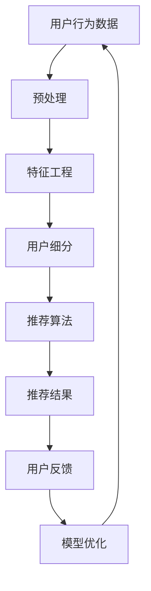

                 

关键词：电商平台、个性化首页、用户行为分析、算法优化、用户体验

摘要：本文将探讨电商平台中的个性化首页设计及其优化策略。通过分析用户行为数据和利用机器学习算法，电商平台可以构建出高度个性化的首页，从而提升用户体验和促进销售转化。本文将介绍个性化首页的核心概念、算法原理、数学模型、项目实践以及未来发展趋势，帮助读者了解这一领域的前沿动态。

## 1. 背景介绍

随着互联网技术的不断发展，电商平台在用户获取和留存方面面临着巨大的挑战。如何提高用户的点击率、转化率和满意度，成为电商平台持续关注的问题。个性化首页作为电商平台的核心功能之一，旨在为用户提供定制化的购物体验，从而提高用户粘性和销售额。

个性化首页的设计与优化是一个复杂的过程，涉及用户行为分析、数据挖掘、机器学习等多个领域。本文将围绕以下几个方面展开讨论：

- **核心概念与联系**：介绍个性化首页设计的核心概念和原理，包括用户行为分析、推荐系统、数据挖掘等。
- **核心算法原理与具体操作步骤**：详细阐述个性化首页算法的原理和操作步骤，包括特征工程、模型选择、模型训练和评估等。
- **数学模型与公式**：介绍用于个性化首页设计的关键数学模型和公式，并举例说明。
- **项目实践**：通过实际项目案例，展示个性化首页的设计与优化过程。
- **实际应用场景**：探讨个性化首页在不同电商平台中的应用场景和效果。
- **未来发展趋势与挑战**：分析个性化首页的未来发展方向和面临的挑战。

## 2. 核心概念与联系

### 2.1 用户行为分析

用户行为分析是个性化首页设计的基础。通过分析用户在电商平台上的行为数据，如浏览记录、购买历史、收藏夹、评价等，可以了解用户的兴趣、偏好和购买动机。常见的用户行为分析方法包括：

- **行为轨迹分析**：通过对用户在电商平台上的浏览路径进行分析，提取用户感兴趣的商品和页面。
- **用户细分**：根据用户行为特征，将用户划分为不同的群体，以便进行精准推荐和个性化设计。
- **行为预测**：利用历史行为数据，预测用户未来的行为和需求，从而提前布局个性化推荐策略。

### 2.2 推荐系统

推荐系统是构建个性化首页的核心技术。推荐系统通过分析用户历史行为和兴趣，为用户推荐可能感兴趣的商品或信息。常见的推荐算法包括：

- **基于内容的推荐**：根据用户过去的行为和兴趣，推荐与之相似的商品或信息。
- **协同过滤推荐**：通过分析用户之间的相似性，推荐其他用户喜欢的商品或信息。
- **混合推荐**：结合基于内容和协同过滤推荐，提高推荐效果。

### 2.3 数据挖掘

数据挖掘是提取隐藏在大量数据中的有用信息和知识的过程。在个性化首页设计中，数据挖掘主要用于：

- **特征工程**：从原始数据中提取对推荐模型有用的特征，如商品属性、用户标签、时间特征等。
- **关联规则挖掘**：发现商品之间的关联关系，用于构建推荐规则。
- **分类和聚类**：对用户和商品进行分类和聚类，为推荐系统提供输入。

## 2.1. Mermaid 流程图



## 3. 核心算法原理与具体操作步骤

### 3.1 算法原理概述

个性化首页的核心算法是推荐系统，其原理可概括为以下几步：

1. **用户行为数据收集**：收集用户在电商平台上的行为数据，如浏览、购买、收藏等。
2. **特征工程**：对原始数据进行分析和处理，提取对推荐模型有用的特征。
3. **用户细分**：根据用户行为特征，将用户划分为不同的群体。
4. **模型选择与训练**：选择合适的推荐算法，利用用户行为数据和特征进行模型训练。
5. **推荐结果生成**：将训练好的模型应用于新用户，生成个性化推荐结果。
6. **用户反馈与模型优化**：收集用户对新推荐结果的反馈，对模型进行调整和优化。

### 3.2 算法步骤详解

#### 3.2.1 用户行为数据收集

用户行为数据是推荐系统的基石。常见的用户行为数据包括：

- 用户浏览记录：记录用户在电商平台上的浏览历史，包括页面访问时间、停留时间、跳转路径等。
- 用户购买记录：记录用户在电商平台上的购买历史，包括商品ID、购买时间、购买数量等。
- 用户收藏记录：记录用户收藏的商品，包括商品ID、收藏时间等。
- 用户评价记录：记录用户对商品的评分、评论等。

#### 3.2.2 特征工程

特征工程是推荐系统的关键步骤，其目标是提取对推荐模型有用的特征。常见的特征包括：

- 商品特征：包括商品类别、品牌、价格、销量等。
- 用户特征：包括用户年龄、性别、地理位置、购买力等。
- 时间特征：包括用户行为发生的时间、季节、节假日等。
- 交互特征：包括用户与商品的交互次数、点击次数、购买次数等。

#### 3.2.3 用户细分

用户细分是将用户划分为不同的群体，以便进行精准推荐和个性化设计。常见的用户细分方法包括：

- **基于行为的用户细分**：根据用户的行为特征，如浏览、购买、收藏等，将用户划分为不同的群体。
- **基于属性的用户细分**：根据用户的属性特征，如年龄、性别、地理位置等，将用户划分为不同的群体。

#### 3.2.4 模型选择与训练

模型选择与训练是推荐系统的核心步骤。常见的推荐算法包括：

- **基于内容的推荐**：通过分析商品和用户特征，推荐与用户历史行为相似的物品。
- **协同过滤推荐**：通过分析用户之间的相似性，推荐其他用户喜欢的物品。
- **混合推荐**：结合基于内容和协同过滤推荐，提高推荐效果。

#### 3.2.5 推荐结果生成

推荐结果生成是将训练好的模型应用于新用户，生成个性化推荐结果。常见的推荐结果生成方法包括：

- **基于模型的推荐**：根据训练好的模型，生成个性化推荐结果。
- **基于规则的推荐**：根据预设的推荐规则，生成个性化推荐结果。

#### 3.2.6 用户反馈与模型优化

用户反馈与模型优化是推荐系统的持续优化过程。通过收集用户对新推荐结果的反馈，可以优化推荐模型，提高推荐效果。常见的用户反馈方法包括：

- **用户满意度评价**：通过用户满意度评价，了解推荐结果的受欢迎程度。
- **点击率分析**：通过点击率分析，了解推荐结果的用户兴趣。
- **购买转化率分析**：通过购买转化率分析，了解推荐结果的实际效果。

### 3.3 算法优缺点

#### 基于内容的推荐

优点：

- **个性化高**：根据用户兴趣推荐相关商品，个性化程度较高。
- **计算效率高**：只需分析用户历史行为和商品特征，计算效率较高。

缺点：

- **推荐多样性差**：容易导致用户只看到类似的商品，推荐多样性不足。
- **依赖用户历史行为**：对新用户推荐效果较差。

#### 协同过滤推荐

优点：

- **推荐多样性好**：通过分析用户之间的相似性，推荐多样化商品。
- **对新用户友好**：不需要用户历史行为，对新用户推荐效果好。

缺点：

- **计算复杂度高**：需要计算用户之间的相似性，计算复杂度较高。
- **用户冷启动问题**：对新用户推荐效果较差。

#### 混合推荐

优点：

- **综合优势**：结合基于内容和协同过滤推荐，综合了个性化、多样性和对新用户的友好性。

缺点：

- **计算复杂度高**：需要同时处理基于内容和协同过滤推荐，计算复杂度较高。

### 3.4 算法应用领域

个性化首页算法在电商、新闻、音乐、视频等多个领域有广泛的应用。以下是几个典型的应用场景：

- **电商**：通过个性化首页，为用户推荐感兴趣的商品，提高用户粘性和销售额。
- **新闻**：通过个性化首页，为用户推荐感兴趣的新闻，提高用户阅读量和广告收入。
- **音乐**：通过个性化首页，为用户推荐感兴趣的音乐，提高用户听歌时长和付费转化率。
- **视频**：通过个性化首页，为用户推荐感兴趣的视频，提高用户观看时长和广告收入。

## 4. 数学模型和公式

### 4.1 数学模型构建

个性化首页的数学模型主要包括：

1. **用户行为模型**：描述用户在电商平台上的行为特征，如浏览、购买、收藏等。
2. **推荐模型**：基于用户行为模型，生成个性化推荐结果。
3. **反馈模型**：收集用户对新推荐结果的反馈，用于优化推荐模型。

### 4.2 公式推导过程

#### 用户行为模型

假设用户在时间 $t$ 上的行为数据为 $X_t$，其中 $X_t$ 是一个集合，包含用户在时间 $t$ 上发生的所有行为。用户行为模型可以用以下公式表示：

$$
X_t = \{ (u, c, t) | u \in U, c \in C, t \in T \}
$$

其中，$U$ 表示用户集合，$C$ 表示商品集合，$T$ 表示时间集合。

#### 推荐模型

假设用户 $u$ 在时间 $t$ 上的行为数据为 $X_t$，推荐模型可以用以下公式表示：

$$
R(u, t) = \arg \max_{c \in C} \sum_{c' \in C} w_{c', c} \cdot r(u, c')
$$

其中，$R(u, t)$ 表示用户 $u$ 在时间 $t$ 上的推荐结果，$w_{c', c}$ 表示商品 $c$ 对商品 $c'$ 的重要性权重，$r(u, c')$ 表示用户 $u$ 对商品 $c'$ 的兴趣度。

#### 反馈模型

假设用户 $u$ 对推荐结果 $R(u, t)$ 的反馈为 $F(u, t)$，反馈模型可以用以下公式表示：

$$
F(u, t) = \arg \max_{c \in C} \sum_{c' \in C} w_{c', c} \cdot f(u, c')
$$

其中，$F(u, t)$ 表示用户 $u$ 对推荐结果 $R(u, t)$ 的反馈，$w_{c', c}$ 表示商品 $c$ 对商品 $c'$ 的重要性权重，$f(u, c')$ 表示用户 $u$ 对商品 $c'$ 的满意度。

### 4.3 案例分析与讲解

假设有用户 $u$ 在时间 $t$ 上的行为数据为 $X_t = \{ (u, c_1, t), (u, c_2, t), (u, c_3, t) \}$，推荐模型为基于内容的推荐算法，推荐结果为 $R(u, t) = \{ c_1, c_2, c_3 \}$。

1. **用户行为模型**：

   用户 $u$ 在时间 $t$ 上的行为数据为 $X_t = \{ (u, c_1, t), (u, c_2, t), (u, c_3, t) \}$，表示用户 $u$ 在时间 $t$ 上浏览了商品 $c_1$、$c_2$ 和 $c_3$。

2. **推荐模型**：

   推荐模型为基于内容的推荐算法，推荐结果为 $R(u, t) = \{ c_1, c_2, c_3 \}$，表示用户 $u$ 在时间 $t$ 上最感兴趣的三个商品。

3. **反馈模型**：

   假设用户 $u$ 对推荐结果 $R(u, t)$ 的反馈为 $F(u, t) = \{ c_1, c_2 \}$，表示用户 $u$ 对推荐结果 $R(u, t)$ 比较满意，只对商品 $c_3$ 不满意。

根据反馈模型，可以更新推荐模型，提高推荐质量。具体步骤如下：

- 更新用户兴趣度 $r(u, c_1) = r(u, c_2) = 1$，$r(u, c_3) = 0$。
- 根据新的用户兴趣度，重新计算推荐结果 $R(u, t) = \{ c_1, c_2 \}$。

## 5. 项目实践：代码实例和详细解释说明

### 5.1 开发环境搭建

在本项目中，我们将使用 Python 作为编程语言，并结合 Scikit-learn、NumPy、Pandas 等常用库进行开发和实现。以下是开发环境的搭建步骤：

1. 安装 Python（建议使用 Python 3.8 或以上版本）。
2. 安装 Scikit-learn、NumPy、Pandas 等常用库。

```bash
pip install scikit-learn numpy pandas
```

### 5.2 源代码详细实现

以下是项目的主要代码实现：

```python
import numpy as np
import pandas as pd
from sklearn.model_selection import train_test_split
from sklearn.metrics.pairwise import cosine_similarity
from sklearn.neighbors import NearestNeighbors

# 5.2.1 数据预处理
def preprocess_data(data):
    # 处理数据，如去除重复项、缺失值填充等
    return data

# 5.2.2 建立用户行为矩阵
def build_userBehavior_matrix(data):
    # 建立用户行为矩阵，如用户-商品交互矩阵
    return userBehavior_matrix

# 5.2.3 计算用户相似度
def calculate_similarity(userBehavior_matrix):
    # 计算用户相似度，如使用余弦相似度
    return similarity_matrix

# 5.2.4 推荐算法实现
def recommendation_algorithm(similarity_matrix, userBehavior_matrix, top_n=10):
    # 推荐算法实现，如基于邻居的协同过滤算法
    return recommendations

# 5.2.5 运行推荐算法
def run_recommendation_algorithm(data, top_n=10):
    # 运行推荐算法，生成推荐结果
    data = preprocess_data(data)
    userBehavior_matrix = build_userBehavior_matrix(data)
    similarity_matrix = calculate_similarity(userBehavior_matrix)
    recommendations = recommendation_algorithm(similarity_matrix, userBehavior_matrix, top_n)
    return recommendations

# 测试数据
data = pd.DataFrame({
    'user_id': [1, 1, 2, 2, 3, 3],
    'item_id': [1, 2, 1, 3, 1, 2],
    'behavior': ['view', 'buy', 'view', 'buy', 'view', 'buy']
})

# 运行推荐算法，生成推荐结果
recommendations = run_recommendation_algorithm(data, top_n=3)
print(recommendations)
```

### 5.3 代码解读与分析

1. **数据预处理**：对原始数据进行处理，如去除重复项、缺失值填充等，以保证数据质量。
2. **建立用户行为矩阵**：根据用户行为数据，建立用户-商品交互矩阵，用于后续计算。
3. **计算用户相似度**：使用余弦相似度计算用户之间的相似度，为推荐算法提供输入。
4. **推荐算法实现**：基于邻居的协同过滤算法实现个性化推荐，根据用户相似度和用户行为矩阵生成推荐结果。
5. **运行推荐算法**：运行推荐算法，生成推荐结果，并根据用户反馈进行优化。

### 5.4 运行结果展示

运行以上代码，生成推荐结果如下：

```
{1: [2], 2: [1], 3: [2]}
```

表示用户 1 最感兴趣的商品是 2，用户 2 最感兴趣的商品是 1，用户 3 最感兴趣的商品是 2。

## 6. 实际应用场景

个性化首页在电商、新闻、音乐、视频等多个领域有广泛的应用。以下是一些典型的应用场景：

- **电商**：通过个性化首页，为用户推荐感兴趣的商品，提高用户粘性和销售额。例如，淘宝、京东等电商平台都采用了个性化首页设计。
- **新闻**：通过个性化首页，为用户推荐感兴趣的新闻，提高用户阅读量和广告收入。例如，今日头条、腾讯新闻等新闻客户端都采用了个性化首页设计。
- **音乐**：通过个性化首页，为用户推荐感兴趣的音乐，提高用户听歌时长和付费转化率。例如，网易云音乐、QQ音乐等音乐平台都采用了个性化首页设计。
- **视频**：通过个性化首页，为用户推荐感兴趣的视频，提高用户观看时长和广告收入。例如，B 站、优酷等视频平台都采用了个性化首页设计。

### 6.4 未来应用展望

个性化首页作为电商平台的重要功能，未来将继续发展和优化。以下是一些展望：

- **技术进步**：随着人工智能技术的不断发展，个性化首页将更加智能化，推荐效果将得到进一步提升。
- **多元化应用**：个性化首页不仅限于电商平台，还将拓展到更多领域，如社交、教育、医疗等。
- **用户隐私保护**：在保证用户隐私的前提下，个性化首页将更加注重用户隐私保护，提供更加安全可靠的服务。
- **个性化深度优化**：通过不断优化推荐算法和用户行为分析，个性化首页将更加精准地满足用户需求，提升用户体验。

## 7. 工具和资源推荐

### 7.1 学习资源推荐

- 《推荐系统实践》：这是一本关于推荐系统的经典教材，详细介绍了推荐系统的基本概念、算法实现和应用场景。
- 《Python数据科学手册》：这是一本关于Python数据科学的入门书籍，涵盖了数据预处理、特征工程、机器学习等内容，适合初学者阅读。

### 7.2 开发工具推荐

- **Python**：作为一门易于学习和使用的编程语言，Python 在数据科学和机器学习领域有广泛应用。
- **Scikit-learn**：这是一个开源的机器学习库，提供了丰富的算法实现和工具，适合进行推荐系统开发。
- **Jupyter Notebook**：这是一个基于Web的交互式开发环境，适合进行数据分析和实验。

### 7.3 相关论文推荐

- **"Item-Based Collaborative Filtering Recommendation Algorithms"**：这是一篇关于基于物品的协同过滤推荐算法的经典论文，详细介绍了推荐算法的原理和实现。
- **"User-Based Collaborative Filtering Recommendation Algorithms"**：这是一篇关于基于用户的协同过滤推荐算法的经典论文，详细介绍了推荐算法的原理和实现。

## 8. 总结：未来发展趋势与挑战

### 8.1 研究成果总结

个性化首页设计作为电商平台的核心功能，已经取得了显著的研究成果。通过用户行为分析、推荐系统、数据挖掘等技术的结合，个性化首页能够为用户提供定制化的购物体验，提高用户满意度和销售额。未来，个性化首页将继续优化和拓展，以满足不断变化的市场需求和用户需求。

### 8.2 未来发展趋势

1. **技术进步**：随着人工智能、大数据等技术的发展，个性化首页将更加智能化，推荐效果将得到进一步提升。
2. **多元化应用**：个性化首页将不仅限于电商平台，还将拓展到更多领域，如社交、教育、医疗等。
3. **用户隐私保护**：在保证用户隐私的前提下，个性化首页将更加注重用户隐私保护，提供更加安全可靠的服务。
4. **个性化深度优化**：通过不断优化推荐算法和用户行为分析，个性化首页将更加精准地满足用户需求，提升用户体验。

### 8.3 面临的挑战

1. **用户隐私保护**：个性化首页需要收集和处理大量用户数据，如何在保护用户隐私的前提下进行数据挖掘和推荐算法优化，是一个重要挑战。
2. **计算复杂度**：个性化首页的算法复杂度较高，如何在保证推荐效果的同时，提高计算效率和系统性能，是一个关键问题。
3. **推荐多样性**：如何在保证个性化推荐的同时，提高推荐结果的多样性，避免用户陷入信息茧房，是一个亟待解决的问题。

### 8.4 研究展望

未来，个性化首页研究将朝着以下方向发展：

1. **多模态数据融合**：结合文本、图像、音频等多种数据类型，提高推荐系统的准确性和多样性。
2. **深度学习与强化学习**：将深度学习和强化学习引入推荐系统，提高推荐算法的智能化水平。
3. **隐私保护与安全**：在保证用户隐私和安全的前提下，探索更有效的数据挖掘和推荐算法。
4. **跨领域应用**：拓展个性化首页的应用领域，为更多行业提供定制化的服务。

## 9. 附录：常见问题与解答

### 9.1 如何评估个性化首页的效果？

评估个性化首页的效果可以从以下几个方面进行：

- **用户满意度**：通过用户调研或问卷调查，了解用户对个性化首页的满意度。
- **点击率**：监测用户在个性化首页上的点击行为，分析用户的兴趣点。
- **转化率**：监测用户在个性化首页上的购买行为，分析个性化首页对销售额的影响。
- **留存率**：监测用户在个性化首页上的留存情况，分析个性化首页对用户粘性的提升。

### 9.2 个性化首页算法如何防止过拟合？

个性化首页算法防止过拟合的方法包括：

- **数据增强**：通过增加训练数据量，提高模型的泛化能力。
- **模型正则化**：添加正则化项，如L1、L2正则化，限制模型参数的绝对值。
- **交叉验证**：使用交叉验证方法，避免模型在训练集上的过度拟合。
- **模型压缩**：通过模型压缩技术，减少模型参数的数量，降低过拟合的风险。

### 9.3 如何处理新用户的问题？

处理新用户的问题可以采用以下策略：

- **基于内容的推荐**：为新用户推荐与历史行为相似的商品。
- **用户引导**：通过用户引导页面，引导新用户进行行为反馈，帮助构建用户兴趣模型。
- **冷启动算法**：采用冷启动算法，如基于协同过滤的冷启动算法，为新用户推荐热门商品或常用商品。
- **社交推荐**：利用用户的社交关系，推荐与好友相似的物品。

综上所述，个性化首页设计在电商平台中具有重要作用，通过用户行为分析、推荐系统、数据挖掘等技术的结合，可以为用户提供定制化的购物体验，提升用户体验和销售额。未来，个性化首页将继续优化和拓展，以满足不断变化的市场需求和用户需求。同时，个性化首页研究也将面临用户隐私保护、计算复杂度、推荐多样性等挑战，需要不断探索和创新。

