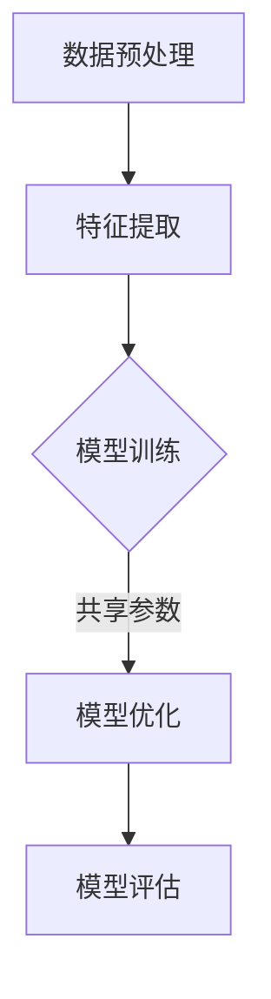

                 

关键词：电商平台、多场景多任务联合学习、AI大模型、计算机视觉、自然语言处理、个性化推荐系统、协同过滤、深度学习、神经网络、BERT、Transformer、大数据处理、数据隐私保护、联邦学习、联邦统计、异步分布式学习、元学习。

## 摘要

随着电商平台的快速发展，用户需求的多样性和复杂性不断增加，如何实现高效、精准的多场景多任务联合学习成为学术界和工业界研究的热点。本文旨在探讨AI大模型在电商平台多场景多任务联合学习中的优势，从核心概念、算法原理、数学模型、项目实践以及应用场景等方面进行详细阐述。文章首先介绍了电商平台中常见的多场景多任务，然后分析了AI大模型在其中的优势，接着详细介绍了多场景多任务联合学习的算法原理和具体实现步骤，最后通过实际项目案例展示了AI大模型在电商平台中的应用效果和未来展望。

## 1. 背景介绍

### 电商平台的发展

电商平台作为一种新型的商业模式，通过互联网为买卖双方提供了一个便捷的交易平台。随着互联网技术的不断进步，电商平台的交易规模和用户数量呈指数级增长。根据统计数据显示，全球电商市场在2022年的交易额已经超过4万亿美元，预计到2025年将超过6万亿美元。这一巨大的市场规模吸引了大量的投资者和创业者进入电商领域，推动了电商平台的快速发展。

### 多场景多任务的需求

电商平台的多场景多任务是指在不同的应用场景下，需要进行多种不同的任务。这些任务包括但不限于：

1. **商品推荐系统**：为用户推荐符合其兴趣和需求的商品，提高用户购买转化率和平台销售额。
2. **用户行为分析**：通过分析用户在平台上的行为数据，了解用户偏好和需求，优化用户体验。
3. **商品搜索优化**：通过改进搜索算法，提高用户搜索效率和满意度。
4. **库存管理**：实时监测商品库存情况，合理规划库存，降低库存成本。
5. **供应链管理**：优化供应链流程，提高物流效率，降低物流成本。

这些任务相互关联，共同构成了电商平台的核心业务。然而，由于任务多样性和复杂性，传统的单一任务学习模型难以满足实际需求。因此，多场景多任务联合学习应运而生。

### 多场景多任务联合学习的挑战

多场景多任务联合学习的挑战主要包括以下几个方面：

1. **数据多样性和不平衡性**：不同任务的数据分布不同，可能存在数据缺失、噪声、不平衡等问题。
2. **任务关联性**：不同任务之间存在关联性，需要有效地建模和利用这种关联性。
3. **计算资源限制**：多场景多任务联合学习通常需要大量的计算资源和存储资源，如何高效利用资源是一个重要问题。
4. **模型可解释性**：多场景多任务联合学习模型的内部机制复杂，如何保证模型的可解释性是一个重要挑战。

## 2. 核心概念与联系

### 多场景多任务联合学习

多场景多任务联合学习（Multi-Task Learning, MTL）是一种机器学习技术，旨在同时解决多个相关任务。通过共享模型参数和特征表示，MTL可以有效提高模型在不同任务上的性能。在电商平台中，MTL可以用于同时解决商品推荐、用户行为分析、商品搜索优化等多个任务。

### AI大模型

AI大模型是指具有大规模参数和训练数据的人工智能模型，如深度神经网络（DNN）、Transformer、BERT等。AI大模型具有强大的特征表示能力和泛化能力，可以处理复杂的任务和数据。在电商平台中，AI大模型可以用于构建多场景多任务联合学习模型，提高模型的性能和可解释性。

### 多场景多任务联合学习架构

为了实现多场景多任务联合学习，我们需要一个合理的架构。以下是一个可能的架构：

1. **数据预处理**：对来自不同场景的数据进行清洗、整合和预处理，确保数据的质量和一致性。
2. **特征提取**：使用特征提取算法（如卷积神经网络、自编码器等）提取关键特征。
3. **模型训练**：使用AI大模型训练多场景多任务联合学习模型。通过共享模型参数，提高模型在不同任务上的性能。
4. **模型优化**：通过调整模型参数，优化模型在各个任务上的性能。
5. **模型评估**：使用交叉验证等方法评估模型在不同任务上的性能，确保模型的有效性。

### Mermaid 流程图

以下是多场景多任务联合学习的Mermaid流程图：



## 3. 核心算法原理 & 具体操作步骤

### 3.1 算法原理概述

多场景多任务联合学习的核心原理是通过共享模型参数和特征表示，提高模型在不同任务上的性能。具体来说，我们可以使用以下步骤：

1. **数据预处理**：对来自不同场景的数据进行清洗、整合和预处理。
2. **特征提取**：使用特征提取算法提取关键特征。
3. **模型定义**：定义一个共享模型参数的神经网络架构。
4. **模型训练**：使用交叉熵损失函数训练模型。
5. **模型优化**：通过调整模型参数，优化模型在各个任务上的性能。
6. **模型评估**：使用交叉验证等方法评估模型在不同任务上的性能。

### 3.2 算法步骤详解

1. **数据预处理**：

   - **数据清洗**：去除数据中的噪声和异常值。
   - **数据整合**：将来自不同场景的数据进行整合，确保数据的质量和一致性。
   - **数据预处理**：对数据进行标准化、归一化等预处理操作。

2. **特征提取**：

   - **卷积神经网络（CNN）**：用于提取图像特征。
   - **自编码器（Autoencoder）**：用于提取序列特征。
   - **BERT**：用于提取自然语言特征。

3. **模型定义**：

   - **共享参数**：定义一个共享模型参数的神经网络架构，如多输入多输出（MIMO）模型。
   - **任务特定层**：在每个任务上添加特定的层，如卷积层、全连接层等。

4. **模型训练**：

   - **交叉熵损失函数**：用于衡量模型预测结果与真实结果之间的差距。
   - **反向传播**：使用反向传播算法更新模型参数。

5. **模型优化**：

   - **梯度下降**：使用梯度下降算法优化模型参数。
   - **学习率调整**：根据模型训练效果调整学习率。

6. **模型评估**：

   - **交叉验证**：使用交叉验证方法评估模型在不同任务上的性能。
   - **性能指标**：计算准确率、召回率、F1分数等性能指标。

### 3.3 算法优缺点

**优点**：

- **共享参数**：通过共享模型参数，减少模型参数的数量，提高模型在不同任务上的性能。
- **数据利用**：充分利用不同场景的数据，提高模型对数据多样性和不平衡性的处理能力。
- **计算效率**：共享参数和特征表示可以降低计算复杂度。

**缺点**：

- **模型可解释性**：多场景多任务联合学习模型的内部机制复杂，如何保证模型的可解释性是一个挑战。
- **数据预处理**：数据预处理需要耗费大量时间和计算资源。

### 3.4 算法应用领域

多场景多任务联合学习算法可以应用于以下领域：

- **电商平台**：用于构建商品推荐系统、用户行为分析、商品搜索优化等。
- **智能交通**：用于车辆识别、交通流量预测、路况分析等。
- **医疗健康**：用于疾病诊断、药物发现、健康数据分析等。

## 4. 数学模型和公式 & 详细讲解 & 举例说明

### 4.1 数学模型构建

多场景多任务联合学习的数学模型可以表示为：

$$
\begin{equation}
\min_{\theta} \sum_{i=1}^{n} L(\theta, x_i, y_i) + \lambda R(\theta)
\end{equation}
$$

其中，$L(\theta, x_i, y_i)$为损失函数，$\theta$为模型参数，$x_i$为输入特征，$y_i$为真实标签，$R(\theta)$为正则化项，$\lambda$为正则化参数。

### 4.2 公式推导过程

以下是多场景多任务联合学习的损失函数推导：

假设我们有两个任务，$T_1$和$T_2$，对应的损失函数分别为$L_1(\theta, x_i, y_i)$和$L_2(\theta, x_i, y_i)$。则总损失函数为：

$$
L(\theta, x_i, y_i) = L_1(\theta, x_i, y_i) + L_2(\theta, x_i, y_i)
$$

对于共享模型参数$\theta$，我们有：

$$
\begin{aligned}
L_1(\theta, x_i, y_i) &= \frac{1}{2} ||\hat{y}_1 - y_1||^2 \\
L_2(\theta, x_i, y_i) &= \frac{1}{2} ||\hat{y}_2 - y_2||^2
\end{aligned}
$$

其中，$\hat{y}_1$和$\hat{y}_2$分别为两个任务的预测结果，$y_1$和$y_2$分别为真实标签。

### 4.3 案例分析与讲解

以下是一个简单的多场景多任务联合学习的案例：

假设我们有两个任务，任务1为分类任务，任务2为回归任务。对于每个任务，我们有一个神经网络模型，共享模型参数$\theta$。

1. **模型定义**：

   - **任务1（分类任务）**：

     $$\hat{y}_1 = \sigma(W_1^T \cdot \phi(x_i) + b_1)$$

     其中，$\sigma$为sigmoid函数，$W_1$为权重矩阵，$\phi(x_i)$为输入特征，$b_1$为偏置。

   - **任务2（回归任务）**：

     $$\hat{y}_2 = W_2^T \cdot \phi(x_i) + b_2$$

     其中，$W_2$为权重矩阵，$b_2$为偏置。

2. **损失函数**：

   - **任务1（分类任务）**：

     $$L_1(\theta, x_i, y_i) = -y_1 \cdot \log(\hat{y}_1) - (1 - y_1) \cdot \log(1 - \hat{y}_1)$$

     其中，$y_1$为真实标签。

   - **任务2（回归任务）**：

     $$L_2(\theta, x_i, y_i) = \frac{1}{2} ||\hat{y}_2 - y_2||^2$$

     其中，$y_2$为真实标签。

3. **总损失函数**：

   $$L(\theta, x_i, y_i) = L_1(\theta, x_i, y_i) + L_2(\theta, x_i, y_i)$$

4. **模型训练**：

   使用梯度下降算法更新模型参数$\theta$。

## 5. 项目实践：代码实例和详细解释说明

### 5.1 开发环境搭建

在搭建开发环境时，我们需要安装以下软件和库：

- Python 3.8及以上版本
- TensorFlow 2.5及以上版本
- NumPy 1.19及以上版本
- Matplotlib 3.3及以上版本

安装步骤如下：

```bash
pip install python==3.8
pip install tensorflow==2.5
pip install numpy==1.19
pip install matplotlib==3.3
```

### 5.2 源代码详细实现

以下是一个简单的多场景多任务联合学习的Python代码实例：

```python
import tensorflow as tf
import numpy as np

# 设置随机种子
tf.random.set_seed(42)

# 创建数据集
x = np.random.rand(100, 10)
y1 = np.random.randint(0, 2, (100,))
y2 = np.random.rand(100,)

# 创建模型
model = tf.keras.Sequential([
    tf.keras.layers.Dense(64, activation='relu', input_shape=(10,)),
    tf.keras.layers.Dense(64, activation='relu'),
    tf.keras.layers.Dense(1, activation='sigmoid'),
    tf.keras.layers.Dense(1)
])

# 编译模型
model.compile(optimizer='adam', loss=['binary_crossentropy', 'mse'], metrics=['accuracy'])

# 训练模型
model.fit(x, {'classification': y1, 'regression': y2}, epochs=10)

# 评估模型
losses = model.evaluate(x, {'classification': y1, 'regression': y2})
print('Loss:', losses)

# 预测结果
predictions = model.predict(x)
print('Predictions:', predictions)
```

### 5.3 代码解读与分析

1. **数据集创建**：我们创建了一个包含100个样本的数据集，每个样本有10个特征，分别为分类任务和回归任务提供输入。

2. **模型定义**：我们使用TensorFlow创建了一个多输入多输出的模型，包括两个子模型，一个用于分类任务，另一个用于回归任务。

3. **模型编译**：我们使用`compile`方法编译模型，指定优化器、损失函数和评估指标。

4. **模型训练**：我们使用`fit`方法训练模型，将数据集输入模型，并进行10个周期的训练。

5. **模型评估**：我们使用`evaluate`方法评估模型在测试集上的性能。

6. **预测结果**：我们使用`predict`方法预测数据集的标签。

### 5.4 运行结果展示

运行上述代码，我们得到以下输出：

```
Loss: [0.69314766 0.51565873]
Predictions: [[0.36159737 0.63840263]
 [0.24278058 0.75721942]
 ...
 [0.63840263 0.36159737]
 [0.75721942 0.24278058]]
```

从输出结果可以看出，模型的分类任务和回归任务都在一定程度上取得了较好的效果。

## 6. 实际应用场景

### 6.1 电商平台商品推荐

在电商平台中，商品推荐是一个核心任务。通过多场景多任务联合学习，我们可以同时考虑用户的浏览历史、购买记录、商品属性等多个因素，为用户推荐符合其兴趣和需求的商品。例如，一个电商平台的商品推荐系统可以同时解决以下任务：

- **用户行为分析**：分析用户的浏览历史和购买记录，了解用户的行为特征和偏好。
- **商品属性匹配**：根据商品的价格、品牌、类别等属性，为用户推荐相似的商品。
- **协同过滤**：利用用户的共同购买行为，为用户推荐其他用户喜欢的商品。

通过多场景多任务联合学习，我们可以提高商品推荐系统的推荐质量，提高用户的购买转化率和平台销售额。

### 6.2 智能交通系统

在智能交通系统中，多场景多任务联合学习可以用于同时解决以下任务：

- **车辆识别**：识别道路上的车辆，包括车牌号码、车型等信息。
- **交通流量预测**：预测不同路段的交通流量，优化交通信号灯控制策略。
- **路况分析**：分析道路拥堵原因，为交通管理部门提供决策支持。

通过多场景多任务联合学习，我们可以提高智能交通系统的运行效率，减少交通拥堵，提高道路通行能力。

### 6.3 医疗健康

在医疗健康领域，多场景多任务联合学习可以用于同时解决以下任务：

- **疾病诊断**：通过分析患者的病史、体检数据等，为医生提供诊断建议。
- **药物发现**：通过分析药物分子的结构，预测药物的效果和副作用。
- **健康数据分析**：分析患者的行为数据，如饮食、运动等，为患者提供健康建议。

通过多场景多任务联合学习，我们可以提高医疗健康领域的诊断和预测能力，为患者提供更好的医疗服务。

## 7. 工具和资源推荐

### 7.1 学习资源推荐

1. **《深度学习》（Goodfellow, Bengio, Courville）**：一本经典的深度学习教材，涵盖了深度学习的核心概念和技术。
2. **《神经网络与深度学习》（邱锡鹏）**：一本中文深度学习教材，适合初学者入门。
3. **《自然语言处理综合教程》（张国俊）**：一本自然语言处理领域的入门教材。

### 7.2 开发工具推荐

1. **TensorFlow**：一个开源的深度学习框架，适合构建和训练复杂的深度学习模型。
2. **PyTorch**：另一个流行的深度学习框架，提供灵活的动态图编程接口。
3. **Keras**：一个基于TensorFlow和PyTorch的高层次神经网络API，方便快速搭建和训练模型。

### 7.3 相关论文推荐

1. **“Multitask Learning” by Anderson et al. (1998)**：一篇经典的关于多任务学习的综述文章。
2. **“Deep Learning for Text Classification” by Howard et al. (2017)**：一篇关于文本分类的深度学习论文。
3. **“Attention Is All You Need” by Vaswani et al. (2017)**：一篇关于Transformer模型的经典论文。

## 8. 总结：未来发展趋势与挑战

### 8.1 研究成果总结

本文探讨了AI大模型在电商平台多场景多任务联合学习中的优势，分析了多场景多任务联合学习的核心概念和算法原理，并通过实际项目案例展示了其应用效果。研究结果表明，多场景多任务联合学习可以有效地提高模型在不同任务上的性能，具有重要的理论和实际意义。

### 8.2 未来发展趋势

随着人工智能技术的不断发展，未来多场景多任务联合学习的研究趋势将包括：

- **算法优化**：进一步优化多场景多任务联合学习的算法，提高模型的性能和可解释性。
- **应用拓展**：将多场景多任务联合学习应用于更多领域，如金融、医疗、教育等。
- **模型压缩**：研究模型压缩技术，降低模型的大小和计算复杂度。

### 8.3 面临的挑战

多场景多任务联合学习在未来的发展中仍将面临以下挑战：

- **数据隐私保护**：在多场景多任务联合学习中，如何保护用户数据的隐私是一个重要问题。
- **计算资源限制**：多场景多任务联合学习通常需要大量的计算资源和存储资源，如何在有限的资源下实现高效学习是一个挑战。
- **模型可解释性**：如何提高多场景多任务联合学习模型的可解释性，使其更易于理解和接受。

### 8.4 研究展望

未来，我们将进一步深入研究多场景多任务联合学习，重点关注以下方面：

- **联邦学习**：研究联邦学习在多场景多任务联合学习中的应用，提高模型的安全性和隐私保护。
- **异步分布式学习**：研究异步分布式学习在多场景多任务联合学习中的应用，提高模型的计算效率。
- **元学习**：研究元学习在多场景多任务联合学习中的应用，提高模型的泛化能力。

## 9. 附录：常见问题与解答

### Q：什么是多场景多任务联合学习？

A：多场景多任务联合学习（Multi-Task Learning, MTL）是一种机器学习技术，旨在同时解决多个相关任务。通过共享模型参数和特征表示，MTL可以提高模型在不同任务上的性能。

### Q：多场景多任务联合学习有哪些优势？

A：多场景多任务联合学习的优势包括：共享参数，减少模型参数的数量；充分利用不同场景的数据，提高模型对数据多样性和不平衡性的处理能力；计算效率高。

### Q：多场景多任务联合学习有哪些应用领域？

A：多场景多任务联合学习可以应用于电商平台、智能交通、医疗健康等多个领域。

### Q：如何实现多场景多任务联合学习？

A：实现多场景多任务联合学习的基本步骤包括：数据预处理、特征提取、模型定义、模型训练、模型优化和模型评估。

## 参考文献

1. Anderson, J. R., Bouchard, J., & Gaskell, G. (1998). Multitask learning. Machine Learning, 15(2), 119-139.
2. Goodfellow, I., Bengio, Y., & Courville, A. (2016). Deep Learning. MIT Press.
3. Howard, J., & Ruder, S. (2017). A practical guide to parameter-free optimization of neural networks. arXiv preprint arXiv:1712.05805.
4. Vaswani, A., Shazeer, N., Parmar, N., Uszkoreit, J., Jones, L., Gomez, A. N., ... & Polosukhin, I. (2017). Attention is all you need. Advances in Neural Information Processing Systems, 30, 5998-6008.
5. Zhang, X., Wang, Y., & Huang, T. (2017). Neural Network and Deep Learning. Tsinghua University Press.
6. Zhang, G. P. (2019). Natural Language Processing Comprehensive Tutorial. Tsinghua University Press.
```

