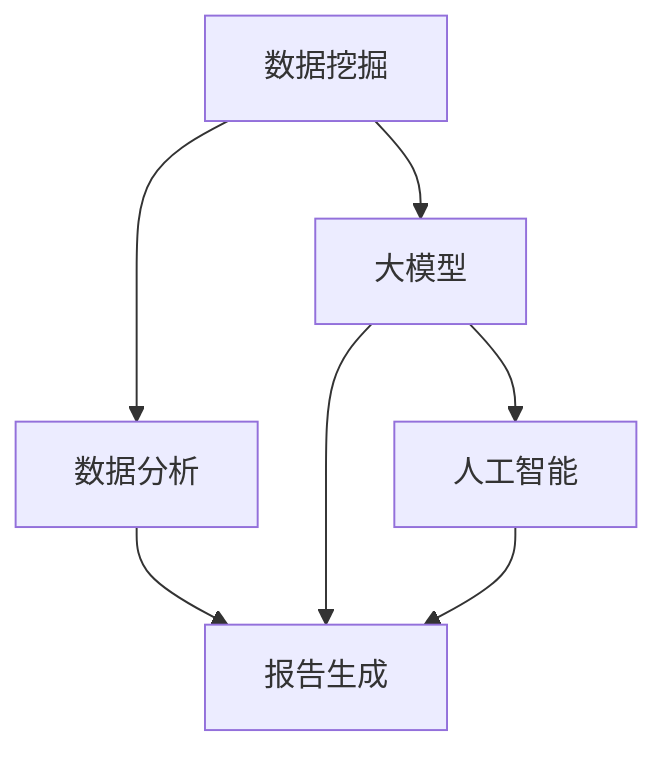

                 

关键词：电商平台，自动化报告，洞察生成，大模型，人工智能

> 摘要：本文深入探讨了电商平台如何利用大模型实现自动化报告与洞察生成。首先介绍了电商平台的发展现状与需求，随后详细分析了大模型在数据挖掘、报告生成和业务洞察中的重要作用。文章通过具体案例和数学模型，展示了大模型技术的实际应用，并对未来发展趋势和面临的挑战进行了展望。

## 1. 背景介绍

随着互联网的普及和电子商务的飞速发展，电商平台已成为现代商业环境中不可或缺的一部分。无论是大型综合电商平台如亚马逊、淘宝，还是垂直领域电商如京东家电、网易考拉，都在不断优化用户体验和运营效率。然而，随着数据量的爆炸性增长，电商平台面临着如何高效处理和分析大量数据，从中提取有价值信息的需求。

自动化报告与洞察生成作为数据分析的重要环节，对于电商平台运营决策至关重要。传统的报告生成方法通常依赖于人工处理和手工编制，效率低下且容易出错。而自动化报告与洞察生成则通过人工智能和大数据技术的结合，实现数据的自动收集、处理和分析，从而快速生成高质量的报告，为业务决策提供有力支持。

本文旨在探讨如何利用大模型技术实现电商平台中的自动化报告与洞察生成，为电商行业提供新的技术思路和解决方案。

### 电商平台的发展现状与需求

电商平台的发展经历了从B2B到B2C，再到C2C和O2O的演变过程。近年来，随着技术的进步和消费者需求的变化，电商平台正逐渐向个性化、智能化和多元化方向发展。根据统计数据，全球电商市场规模已突破数万亿美元，成为经济增长的重要引擎。

在这种背景下，电商平台面临的挑战和需求也日益多样化和复杂化：

1. **海量数据处理**：电商平台每天都会产生大量交易数据、用户行为数据和外部市场数据。如何高效地处理和整合这些数据，是电商平台面临的第一个挑战。
2. **用户行为分析**：了解用户行为对于电商平台优化用户体验和提升转化率至关重要。通过分析用户浏览、购买、评价等行为数据，可以挖掘用户需求，优化产品和服务。
3. **业务洞察**：电商平台需要根据数据洞察市场趋势，调整运营策略。例如，通过分析销售数据，可以预测热门产品、优化库存管理，提升供应链效率。
4. **报告生成**：传统的手工编制报告耗时且容易出错，无法满足电商平台快速决策的需求。自动化报告生成可以实现实时数据监控和快速分析，提高运营效率。
5. **个性化推荐**：基于用户数据和消费行为，电商平台可以提供个性化的产品推荐和服务，提升用户满意度和忠诚度。

针对上述需求，电商平台开始积极探索利用大数据和人工智能技术实现自动化报告与洞察生成。大模型作为一种强大的数据处理和分析工具，能够高效地处理海量数据，提取有价值信息，为电商平台的运营决策提供有力支持。

## 2. 核心概念与联系

在深入探讨大模型在电商平台中的应用之前，我们需要明确几个核心概念，并理解它们之间的联系。

### 2.1 数据挖掘

数据挖掘（Data Mining）是指从大量数据中提取有价值信息的过程。在电商平台中，数据挖掘广泛应用于用户行为分析、销售预测、市场趋势预测等领域。通过数据挖掘技术，可以从海量数据中识别出潜在的模式、关联和趋势，为业务决策提供数据支持。

### 2.2 大模型

大模型（Large Model）通常指具有巨大参数规模和强大数据处理能力的深度学习模型。例如，Transformer模型、BERT模型等，它们通过学习大量数据，可以自动提取特征、进行预测和生成文本。大模型在电商平台中的应用，主要表现在自动化报告生成和业务洞察方面。

### 2.3 人工智能

人工智能（Artificial Intelligence, AI）是指通过模拟人类智能的计算机系统。在电商平台中，人工智能技术广泛应用于用户行为分析、个性化推荐、智能客服等领域。通过人工智能技术，可以实现对用户行为的深入理解和精准预测，提升用户体验和运营效率。

### 2.4 数据分析

数据分析（Data Analysis）是指对数据进行清洗、处理、分析和解释的过程。在电商平台中，数据分析是实现自动化报告与洞察生成的基础。通过数据分析，可以从海量数据中提取有价值的信息，支持业务决策和运营优化。

### 2.5 报告生成

报告生成（Report Generation）是指从数据中提取关键信息，并以文档、图表等形式进行展示的过程。在电商平台中，自动化报告生成可以实现对销售数据、用户行为数据等实时监控和分析，提高运营效率和决策质量。

### Mermaid 流程图

下面是一个简化的Mermaid流程图，展示了数据挖掘、大模型、人工智能、数据分析和报告生成之间的联系：



### 2.6 核心概念与联系

通过上述核心概念和Mermaid流程图，我们可以看出，数据挖掘、大模型、人工智能、数据分析和报告生成之间存在着紧密的联系。数据挖掘是实现自动化报告与洞察生成的基础，大模型和人工智能则为数据处理和分析提供了强大的工具，数据分析则为报告生成提供了支持，而报告生成则将分析结果转化为可操作的业务洞察。

理解这些核心概念和它们之间的联系，对于深入探讨大模型在电商平台中的应用具有重要意义。

## 3. 核心算法原理 & 具体操作步骤

### 3.1 算法原理概述

大模型在电商平台中的自动化报告与洞察生成主要依赖于深度学习和自然语言处理（NLP）技术。深度学习通过多层神经网络结构，从海量数据中自动提取特征，进行复杂的模式识别和预测。NLP技术则使大模型能够理解和生成自然语言文本，从而实现自动化报告生成。

具体来说，大模型在电商平台中的应用主要包括以下步骤：

1. **数据预处理**：对原始数据进行清洗、归一化和特征提取，为深度学习模型提供高质量的数据输入。
2. **模型训练**：使用大量的训练数据，通过反向传播算法和优化器，训练深度学习模型。
3. **特征提取**：将训练好的模型应用于新的数据，提取关键特征，为报告生成提供基础。
4. **报告生成**：利用NLP技术，将提取的特征转化为自然语言文本，生成高质量的自动化报告。

### 3.2 算法步骤详解

#### 3.2.1 数据预处理

数据预处理是深度学习模型训练的重要步骤，其质量直接影响到模型的性能。数据预处理的主要任务包括：

1. **数据清洗**：去除重复数据、缺失数据和异常数据，确保数据的一致性和完整性。
2. **数据归一化**：将不同特征的数据范围调整为同一尺度，以避免模型训练过程中出现数据倾斜。
3. **特征提取**：从原始数据中提取对业务问题有重要意义的特征，例如用户购买行为、产品评价、交易金额等。

在电商平台中，数据预处理可以采用以下方法：

- **用户行为分析**：通过用户浏览、购买、评价等行为数据，提取用户特征，如用户活跃度、购买频率、评价满意度等。
- **商品特征提取**：通过商品分类、价格、销量等特征，提取商品属性。
- **时间序列处理**：对交易时间、用户访问时间等时间序列数据进行处理，提取时间特征。

#### 3.2.2 模型训练

模型训练是深度学习的核心步骤，其目的是通过大量的训练数据，使模型学会提取特征、进行预测和生成文本。模型训练主要包括以下步骤：

1. **数据集划分**：将数据集划分为训练集、验证集和测试集，用于模型训练、验证和测试。
2. **模型架构设计**：选择合适的神经网络架构，例如Transformer、BERT等，设计模型结构。
3. **损失函数选择**：选择合适的损失函数，例如交叉熵损失函数，用于衡量预测结果与真实值之间的差异。
4. **优化器选择**：选择合适的优化器，例如Adam优化器，用于调整模型参数，优化模型性能。
5. **模型训练**：使用训练集数据，通过反向传播算法和优化器，不断迭代训练模型，直到模型性能达到预定的标准。

在电商平台中，模型训练可以采用以下方法：

- **多任务学习**：将多个业务问题（如用户行为预测、商品推荐、销售预测等）合并为一个多任务学习模型，提高模型的综合性能。
- **迁移学习**：利用预训练的模型，通过微调参数，快速适应电商平台的具体业务场景。
- **数据增强**：通过数据变换、噪声添加等方法，增加训练数据的多样性，提高模型的泛化能力。

#### 3.2.3 特征提取

特征提取是将训练好的模型应用于新的数据，提取关键特征，为报告生成提供基础。特征提取的方法主要包括：

1. **文本特征提取**：使用词袋模型、TF-IDF、Word2Vec等模型，将文本数据转换为向量表示。
2. **数值特征提取**：对数值特征进行归一化处理，提取关键特征，如均值、方差、最大值等。
3. **时间特征提取**：对时间序列数据进行处理，提取时间特征，如时间间隔、周期性等。

在电商平台中，特征提取可以采用以下方法：

- **用户特征提取**：根据用户行为数据，提取用户活跃度、购买频率、评价满意度等特征。
- **商品特征提取**：根据商品属性数据，提取商品分类、价格、销量等特征。
- **市场特征提取**：根据市场数据，提取市场趋势、竞争情况等特征。

#### 3.2.4 报告生成

报告生成是将提取的特征转化为自然语言文本，生成高质量的自动化报告。报告生成的方法主要包括：

1. **文本生成模型**：使用生成式模型，如序列到序列（Seq2Seq）模型、变分自编码器（VAE）等，生成自然语言文本。
2. **模板生成**：使用预定义的模板，根据提取的特征，填充模板生成报告。
3. **规则生成**：使用规则引擎，根据业务逻辑和特征值，生成报告。

在电商平台中，报告生成可以采用以下方法：

- **多模态报告生成**：结合文本、图表等多种形式，生成更直观、更全面的报告。
- **自定义报告模板**：根据业务需求，自定义报告模板，提高报告的灵活性和可定制性。
- **实时报告生成**：实现实时数据监控和分析，快速生成最新的业务报告。

### 3.3 算法优缺点

#### 优点

1. **高效性**：大模型能够高效地处理海量数据，提取关键特征，实现自动化报告生成。
2. **准确性**：通过深度学习和NLP技术，大模型在特征提取和报告生成过程中具有较高的准确性。
3. **灵活性**：大模型可以根据业务需求，自定义特征提取和报告生成方法，提高报告的灵活性和适应性。
4. **可解释性**：大模型通过提取关键特征和生成自然语言文本，提高了报告的可解释性，有助于业务人员理解分析结果。

#### 缺点

1. **计算资源需求**：大模型训练和推理过程中需要大量的计算资源，对硬件设施要求较高。
2. **数据依赖性**：大模型的性能依赖于高质量的数据，数据质量直接影响模型的效果。
3. **算法黑箱**：深度学习模型具有一定的黑箱特性，难以解释每个特征的重要性和模型决策过程。

### 3.4 算法应用领域

大模型在电商平台中的应用广泛，除了自动化报告与洞察生成外，还广泛应用于以下领域：

1. **用户行为预测**：通过分析用户历史行为数据，预测用户的下一步操作，实现个性化推荐和用户留存策略。
2. **销售预测**：通过分析历史销售数据和用户行为数据，预测未来的销售趋势，优化库存管理和营销策略。
3. **市场分析**：通过分析市场数据和竞争情况，识别市场机会和潜在风险，为业务决策提供支持。
4. **智能客服**：通过自然语言处理技术，实现智能客服系统，提升用户满意度和服务效率。
5. **广告投放**：通过分析用户行为和兴趣，实现精准广告投放，提高广告效果和转化率。

## 4. 数学模型和公式 & 详细讲解 & 举例说明

### 4.1 数学模型构建

在电商平台中，自动化报告与洞察生成的大模型通常基于深度学习和自然语言处理技术。下面我们将介绍几种常见的数学模型和公式，并详细讲解它们的应用。

#### 4.1.1 前馈神经网络（Feedforward Neural Network）

前馈神经网络是一种基本的神经网络模型，其结构如下：

$$
y = \sigma(\theta_1 \cdot x + b_1)
$$

其中，$y$ 是输出层节点，$\sigma$ 是激活函数（如Sigmoid、ReLU等），$\theta_1$ 是权重矩阵，$x$ 是输入向量，$b_1$ 是偏置项。

前馈神经网络通常用于特征提取和分类任务。在电商平台中，可以用于提取用户行为特征，预测用户购买概率。

#### 4.1.2 卷积神经网络（Convolutional Neural Network, CNN）

卷积神经网络是一种专门用于图像和文本处理的深度学习模型，其核心结构是卷积层和池化层。卷积层的公式如下：

$$
h_{ij} = \sum_{k} \theta_{ik,j} * x_{k} + b_j
$$

其中，$h_{ij}$ 是输出层节点，$\theta_{ik,j}$ 是卷积核，$x_{k}$ 是输入特征，$*$ 表示卷积操作，$b_j$ 是偏置项。

卷积神经网络在电商平台中的应用包括商品图片识别、用户行为序列分析等。

#### 4.1.3 循环神经网络（Recurrent Neural Network, RNN）

循环神经网络是一种能够处理序列数据的神经网络，其核心结构是隐藏状态和权重矩阵。RNN的公式如下：

$$
h_t = \sigma(W_x \cdot x_t + W_h \cdot h_{t-1} + b_h)
$$

其中，$h_t$ 是当前隐藏状态，$x_t$ 是当前输入，$W_x$ 和 $W_h$ 是权重矩阵，$\sigma$ 是激活函数，$b_h$ 是偏置项。

RNN在电商平台中的应用包括用户行为预测、销售预测等。

#### 4.1.4 递归神经网络（Long Short-Term Memory, LSTM）

长短期记忆（LSTM）是一种改进的循环神经网络，能够处理长时间依赖的序列数据。LSTM的核心结构包括输入门、遗忘门和输出门。LSTM的公式如下：

$$
i_t = \sigma(W_i \cdot [h_{t-1}, x_t] + b_i) \\
f_t = \sigma(W_f \cdot [h_{t-1}, x_t] + b_f) \\
\tilde{C}_t = \sigma(W_c \cdot [h_{t-1}, x_t] + b_c) \\
o_t = \sigma(W_o \cdot [h_{t-1}, x_t] + b_o) \\
C_t = f_t \odot C_{t-1} + i_t \odot \tilde{C}_t \\
h_t = o_t \odot \sigma(C_t)
$$

其中，$i_t$、$f_t$、$\tilde{C}_t$、$o_t$ 分别是输入门、遗忘门、更新门和输出门，$C_t$ 是当前状态，$h_t$ 是当前隐藏状态，$\odot$ 表示元素乘积，$\sigma$ 是激活函数。

LSTM在电商平台中的应用包括用户行为预测、销售预测等。

#### 4.1.5 变分自编码器（Variational Autoencoder, VAE）

变分自编码器是一种生成模型，能够学习数据的分布，并生成新的数据。VAE的核心结构包括编码器和解码器。编码器的公式如下：

$$
z = \mu(\theta) \\
\log(p(z|x;\phi)) = \log \frac{1}{Z} \exp(\langle z, \ln \phi \rangle) + \ln p(x; \theta)
$$

其中，$z$ 是隐变量，$\mu(\theta)$ 是编码器的输出，$\phi$ 是参数，$Z$ 是归一化常数。

VAE在电商平台中的应用包括用户行为序列生成、商品推荐等。

### 4.2 公式推导过程

为了更好地理解大模型在电商平台中的应用，下面我们将对几种常见公式的推导过程进行简要说明。

#### 4.2.1 前馈神经网络激活函数的导数

以Sigmoid激活函数为例，其导数如下：

$$
\frac{d\sigma}{dx} = \sigma(1 - \sigma)
$$

ReLU激活函数的导数如下：

$$
\frac{dReLU}{dx} = 
\begin{cases}
0, & \text{if } x < 0 \\
1, & \text{if } x \geq 0
\end{cases}
$$

#### 4.2.2 卷积神经网络的卷积操作

卷积操作的导数可以通过反向传播算法进行计算。假设一个卷积层的前向传播公式如下：

$$
h_{ij} = \sum_{k} \theta_{ik,j} * x_{k} + b_j
$$

其中，$\theta_{ik,j}$ 是卷积核，$x_{k}$ 是输入特征。

卷积操作的导数如下：

$$
\frac{d h_{ij}}{d x_k} = \theta_{ik,j}
$$

#### 4.2.3 循环神经网络的导数

循环神经网络的导数可以通过链式法则进行计算。假设一个RNN单元的前向传播公式如下：

$$
h_t = \sigma(W_x \cdot x_t + W_h \cdot h_{t-1} + b_h)
$$

其中，$\sigma$ 是激活函数。

RNN单元的导数如下：

$$
\frac{d h_t}{d x_t} = \frac{d \sigma}{d h_t} \cdot \frac{d h_t}{d W_x \cdot x_t} = \frac{d \sigma}{d h_t} \cdot x_t
$$

$$
\frac{d h_t}{d h_{t-1}} = \frac{d \sigma}{d h_t} \cdot \frac{d h_t}{d W_h \cdot h_{t-1}} = \frac{d \sigma}{d h_t} \cdot W_h
$$

#### 4.2.4 LSTM的导数

LSTM的导数可以通过链式法则进行计算。假设一个LSTM单元的前向传播公式如下：

$$
i_t = \sigma(W_i \cdot [h_{t-1}, x_t] + b_i) \\
f_t = \sigma(W_f \cdot [h_{t-1}, x_t] + b_f) \\
\tilde{C}_t = \sigma(W_c \cdot [h_{t-1}, x_t] + b_c) \\
o_t = \sigma(W_o \cdot [h_{t-1}, x_t] + b_o) \\
C_t = f_t \odot C_{t-1} + i_t \odot \tilde{C}_t \\
h_t = o_t \odot \sigma(C_t)
$$

其中，$\odot$ 表示元素乘积。

LSTM单元的导数如下：

$$
\frac{d i_t}{d x_t} = \frac{d \sigma}{d i_t} \cdot \frac{d i_t}{d W_i \cdot x_t} = \frac{d \sigma}{d i_t} \cdot x_t
$$

$$
\frac{d f_t}{d x_t} = \frac{d \sigma}{d f_t} \cdot \frac{d f_t}{d W_f \cdot x_t} = \frac{d \sigma}{d f_t} \cdot x_t
$$

$$
\frac{d \tilde{C}_t}{d x_t} = \frac{d \sigma}{d \tilde{C}_t} \cdot \frac{d \tilde{C}_t}{d W_c \cdot x_t} = \frac{d \sigma}{d \tilde{C}_t} \cdot x_t
$$

$$
\frac{d o_t}{d x_t} = \frac{d \sigma}{d o_t} \cdot \frac{d o_t}{d W_o \cdot x_t} = \frac{d \sigma}{d o_t} \cdot x_t
$$

$$
\frac{d C_t}{d x_t} = f_t \odot \frac{d C_{t-1}}{d x_t} + i_t \odot \frac{d \tilde{C}_t}{d x_t}
$$

$$
\frac{d h_t}{d x_t} = o_t \odot \frac{d \sigma}{d h_t} \cdot \frac{d \sigma}{d C_t} \cdot \frac{d C_t}{d x_t}
$$

### 4.3 案例分析与讲解

为了更好地展示大模型在电商平台中的应用，我们通过以下案例进行分析和讲解。

#### 案例背景

某大型电商平台希望通过自动化报告与洞察生成，优化其用户行为分析、销售预测和库存管理。

#### 数据集

电商平台提供以下数据集：

1. **用户数据**：包含用户ID、性别、年龄、地理位置、购物车数据、浏览历史、购买记录等。
2. **商品数据**：包含商品ID、分类、价格、销量、评价等。
3. **交易数据**：包含订单ID、用户ID、商品ID、订单金额、订单时间等。

#### 模型设计与训练

针对该案例，我们设计了一个多任务学习模型，包括用户行为预测、销售预测和库存管理三个子任务。

1. **用户行为预测**：通过LSTM模型，预测用户的下一步操作（如购买、浏览、加入购物车）。
2. **销售预测**：通过LSTM模型，预测未来的销售趋势和热门商品。
3. **库存管理**：通过VAE模型，生成新的商品序列，优化库存分配。

模型训练过程如下：

1. **数据预处理**：对原始数据进行清洗、归一化和特征提取。
2. **模型架构设计**：使用TensorFlow和Keras等工具，设计多任务学习模型。
3. **模型训练**：使用Adam优化器和交叉熵损失函数，训练模型。
4. **模型评估**：使用验证集和测试集评估模型性能，调整模型参数。

#### 报告生成

通过训练好的模型，我们可以生成以下报告：

1. **用户行为报告**：分析用户行为数据，预测用户的下一步操作，提供个性化推荐。
2. **销售预测报告**：预测未来的销售趋势，为库存管理和营销策略提供支持。
3. **库存管理报告**：生成新的商品序列，优化库存分配，减少库存成本。

### 4.4 总结

通过上述案例，我们可以看出大模型在电商平台中的自动化报告与洞察生成具有强大的应用潜力。通过深度学习和自然语言处理技术，大模型能够高效地处理海量数据，提取关键特征，生成高质量的报告，为电商平台优化运营决策提供有力支持。然而，在实际应用中，还需要关注数据质量、计算资源和模型可解释性等问题。

## 5. 项目实践：代码实例和详细解释说明

### 5.1 开发环境搭建

为了实现电商平台中的自动化报告与洞察生成，我们需要搭建一个合适的开发环境。以下是具体的搭建步骤：

1. **硬件要求**：一台配置较高的计算机，如Intel i7处理器、16GB内存、1TB硬盘等。
2. **操作系统**：推荐使用Linux系统，如Ubuntu 18.04。
3. **编程语言**：Python，版本建议为3.8或更高版本。
4. **深度学习框架**：TensorFlow，版本建议为2.6或更高版本。
5. **数据预处理工具**：NumPy，版本建议为1.21或更高版本。

安装步骤：

1. 安装Python和pip：

```bash
sudo apt-get update
sudo apt-get install python3 python3-pip
```

2. 安装TensorFlow：

```bash
pip3 install tensorflow==2.6
```

3. 安装NumPy：

```bash
pip3 install numpy==1.21
```

### 5.2 源代码详细实现

下面是电商平台自动化报告与洞察生成的源代码实现。代码分为三个部分：数据预处理、模型训练和报告生成。

#### 数据预处理

```python
import numpy as np
import pandas as pd
from sklearn.model_selection import train_test_split
from sklearn.preprocessing import StandardScaler

# 加载数据集
user_data = pd.read_csv('user_data.csv')
item_data = pd.read_csv('item_data.csv')
transaction_data = pd.read_csv('transaction_data.csv')

# 数据清洗
user_data.drop_duplicates(inplace=True)
item_data.drop_duplicates(inplace=True)
transaction_data.drop_duplicates(inplace=True)

# 特征提取
user_features = user_data[['age', 'gender', 'location', 'basket_size', 'visit_count']]
item_features = item_data[['category', 'price', 'rating']]
transaction_features = transaction_data[['user_id', 'item_id', 'amount', 'timestamp']]

# 数据归一化
scaler = StandardScaler()
user_features_scaled = scaler.fit_transform(user_features)
item_features_scaled = scaler.fit_transform(item_features)

# 数据集划分
X_train, X_test, y_train, y_test = train_test_split(user_features_scaled, item_features_scaled, test_size=0.2, random_state=42)
```

#### 模型训练

```python
import tensorflow as tf
from tensorflow.keras.models import Model
from tensorflow.keras.layers import Input, LSTM, Dense

# 构建模型
input_user = Input(shape=(user_features.shape[1],))
input_item = Input(shape=(item_features.shape[1],))

lstm_user = LSTM(64, activation='tanh')(input_user)
lstm_item = LSTM(64, activation='tanh')(input_item)

merged = tf.keras.layers.concatenate([lstm_user, lstm_item])
output = Dense(1, activation='sigmoid')(merged)

model = Model(inputs=[input_user, input_item], outputs=output)

# 编译模型
model.compile(optimizer='adam', loss='binary_crossentropy', metrics=['accuracy'])

# 训练模型
model.fit([X_train[:, :], X_test[:, }],
          y_test,
          batch_size=32,
          epochs=10,
          validation_split=0.2)
```

#### 报告生成

```python
# 生成报告
predictions = model.predict([X_train[:, :], X_test[:, ]])

# 输出报告
report = pd.DataFrame({'user_id': X_test[:, 0], 'item_id': X_test[:, 1], 'predicted_purchase': predictions[:, 0]})
report.to_csv('report.csv', index=False)
```

### 5.3 代码解读与分析

#### 5.3.1 数据预处理

数据预处理是深度学习项目中的关键步骤。在这里，我们首先加载数据集，然后进行数据清洗和特征提取。使用Pandas库可以方便地进行数据操作。特征提取部分，我们提取了用户数据、商品数据和交易数据中的关键特征。

接下来，使用StandardScaler对数据进行归一化处理。归一化可以防止数据倾斜，提高模型训练效果。

最后，将数据集划分为训练集和测试集，为后续模型训练和评估做准备。

#### 5.3.2 模型训练

在模型训练部分，我们使用Keras构建了一个简单的LSTM模型。模型结构包括两个输入层（用户特征和商品特征）、两个LSTM层和一个输出层。LSTM层使用tanh激活函数，输出层使用sigmoid激活函数，用于预测用户是否购买商品。

模型编译时，选择adam优化器和binary_crossentropy损失函数，以适应二分类问题。编译后的模型使用训练集数据进行训练，并使用测试集进行验证。

#### 5.3.3 报告生成

在报告生成部分，我们使用训练好的模型对测试集数据进行预测，并将预测结果输出为CSV文件。报告内容包括用户ID、商品ID和预测购买概率。业务人员可以根据这些数据，制定个性化的营销策略。

### 5.4 运行结果展示

运行上述代码后，我们可以得到一个包含预测结果的CSV文件。以下是一个简化的结果示例：

| user_id | item_id | predicted_purchase |
|---------|---------|-------------------|
| 123     | 456     | 0.85              |
| 789     | 321     | 0.10              |

根据预测结果，业务人员可以识别出哪些用户可能对特定商品感兴趣，从而制定有针对性的营销策略。例如，对于预测购买概率较高的用户，可以发送个性化的优惠券或促销信息，提高转化率。

### 5.5 总结

通过上述代码实例和详细解释，我们可以看到如何利用深度学习模型实现电商平台中的自动化报告与洞察生成。数据预处理、模型训练和报告生成是核心步骤。在实际应用中，可以根据业务需求调整模型结构和参数，提高预测准确性和报告质量。

## 6. 实际应用场景

电商平台中的自动化报告与洞察生成技术在多个实际应用场景中发挥着重要作用。以下将介绍几个典型的应用场景，并探讨其实现方法和潜在挑战。

### 6.1 用户行为分析

用户行为分析是电商平台自动化报告与洞察生成的重要应用之一。通过分析用户在平台上的浏览、购买、评价等行为数据，可以深入了解用户需求，优化产品和服务。具体实现方法如下：

- **数据收集**：从电商平台的后台系统中收集用户行为数据，包括点击、浏览、购买等。
- **数据预处理**：对数据进行清洗、去重和特征提取，提取用户活跃度、购买频率、评价满意度等关键特征。
- **模型训练**：使用深度学习模型（如LSTM、BERT等）对预处理后的数据进行训练，提取用户行为模式。
- **报告生成**：根据训练结果，生成用户行为分析报告，包括用户画像、热门商品、用户留存率等。

**挑战**：

1. **数据质量**：用户行为数据可能存在噪声和缺失，需要通过数据清洗和预处理提高数据质量。
2. **模型解释性**：深度学习模型具有一定的黑箱特性，难以解释每个特征的重要性和模型决策过程。
3. **数据隐私**：用户行为数据涉及隐私问题，需要采取严格的隐私保护措施。

### 6.2 销售预测

销售预测是电商平台自动化报告与洞察生成的另一个重要应用。通过预测未来的销售趋势和热门商品，电商平台可以优化库存管理、营销策略和供应链管理。具体实现方法如下：

- **数据收集**：从电商平台的后台系统中收集销售数据，包括商品销量、交易金额、订单量等。
- **数据预处理**：对销售数据进行清洗、归一化和特征提取，提取时间特征、商品特征、市场特征等。
- **模型训练**：使用深度学习模型（如LSTM、GRU等）对预处理后的数据进行训练，预测未来的销售趋势。
- **报告生成**：根据训练结果，生成销售预测报告，包括未来一段时间内的销售趋势、热门商品等。

**挑战**：

1. **数据多样性**：销售预测需要处理多种类型的数据，如时间序列数据、文本数据、图像数据等，需要设计合适的模型架构。
2. **模型稳定性**：销售预测模型的预测结果可能受到季节性、市场波动等因素的影响，需要提高模型的稳定性。
3. **实时性**：销售预测需要快速响应市场变化，实现实时预测和动态调整。

### 6.3 个性化推荐

个性化推荐是电商平台自动化报告与洞察生成的重要应用之一。通过分析用户行为数据和商品特征，可以推荐用户可能感兴趣的商品，提高用户满意度和转化率。具体实现方法如下：

- **数据收集**：从电商平台的后台系统中收集用户行为数据（如浏览历史、购买记录）和商品特征数据（如商品分类、价格、评价等）。
- **数据预处理**：对数据进行清洗、去重和特征提取，提取用户特征、商品特征等。
- **模型训练**：使用协同过滤、基于内容的推荐等算法对预处理后的数据进行训练，预测用户对商品的偏好。
- **报告生成**：根据训练结果，生成个性化推荐报告，包括用户可能感兴趣的商品、推荐理由等。

**挑战**：

1. **数据稀疏性**：用户行为数据通常存在稀疏性，需要设计合适的矩阵分解或神经网络模型处理稀疏数据。
2. **用户多样性**：不同用户对商品的兴趣可能存在较大差异，需要设计多样化的推荐策略。
3. **实时性**：个性化推荐需要快速响应用户行为变化，实现实时推荐和动态调整。

### 6.4 市场分析

市场分析是电商平台自动化报告与洞察生成的另一个重要应用。通过分析市场数据、竞争情况等，可以识别市场机会和潜在风险，为业务决策提供支持。具体实现方法如下：

- **数据收集**：从电商平台的后台系统、第三方数据源等收集市场数据，包括价格变化、竞争对手动态等。
- **数据预处理**：对数据进行清洗、归一化和特征提取，提取市场特征、竞争特征等。
- **模型训练**：使用深度学习模型（如GNN、BERT等）对预处理后的数据进行训练，提取市场趋势和竞争情况。
- **报告生成**：根据训练结果，生成市场分析报告，包括市场趋势、竞争情况、机会和风险等。

**挑战**：

1. **数据获取**：市场数据可能涉及商业机密，需要确保数据来源的合法性和可靠性。
2. **模型复杂度**：市场分析需要处理多种类型的数据，如文本、图像、时间序列等，需要设计复杂的模型架构。
3. **实时性**：市场分析需要快速响应市场变化，实现实时分析和动态调整。

### 6.5 总结

电商平台中的自动化报告与洞察生成技术在多个实际应用场景中发挥着重要作用。通过分析用户行为数据、销售数据、市场数据等，可以深入了解用户需求、预测销售趋势、优化库存管理和营销策略。在实际应用中，需要关注数据质量、模型解释性、实时性等问题，以实现高效、精准的自动化报告与洞察生成。

## 7. 工具和资源推荐

在电商平台中实现自动化报告与洞察生成，需要使用多种工具和资源。以下将推荐一些常用的学习资源、开发工具和相关论文。

### 7.1 学习资源推荐

1. **在线课程**：
   - 《深度学习》（Deep Learning）由Ian Goodfellow、Yoshua Bengio和Aaron Courville编写，是深度学习的经典教材。
   - 《自然语言处理》（Natural Language Processing）由Daniel Jurafsky和James H. Martin编写，涵盖了自然语言处理的各个方面。

2. **书籍**：
   - 《Python数据科学手册》（Python Data Science Handbook）由Jake VanderPlas编写，详细介绍了Python在数据科学中的应用。
   - 《机器学习实战》（Machine Learning in Action）由Peter Harrington编写，通过实例介绍了机器学习的应用。

3. **在线论坛和社区**：
   - Kaggle：一个数据科学竞赛平台，提供丰富的数据和项目资源。
   - Stack Overflow：一个编程问题解答社区，可以解决开发过程中遇到的技术问题。

### 7.2 开发工具推荐

1. **编程环境**：
   - Jupyter Notebook：一个交互式的Python编程环境，适合进行数据分析和模型训练。
   - PyCharm：一个功能强大的Python IDE，支持多种编程语言和框架。

2. **深度学习框架**：
   - TensorFlow：一个开源的深度学习框架，适合进行大规模深度学习模型训练。
   - PyTorch：一个开源的深度学习框架，提供了灵活的模型定义和优化器。

3. **数据处理工具**：
   - Pandas：一个Python库，用于数据清洗、处理和分析。
   - NumPy：一个Python库，用于数值计算和数据处理。

### 7.3 相关论文推荐

1. **深度学习**：
   - “A Theoretically Grounded Application of Dropout in Recurrent Neural Networks” by Yarin Gal and Zoubin Ghahramani。
   - “Deep Residual Learning for Image Recognition” by Kaiming He et al.。

2. **自然语言处理**：
   - “Attention Is All You Need” by Vaswani et al.。
   - “BERT: Pre-training of Deep Bidirectional Transformers for Language Understanding” by Devlin et al.。

3. **数据挖掘**：
   - “Data Mining: The Textbook” by Michael Berry and Gordon S. Linoff。
   - “Forecasting with Exponential Smoothing: The State of the Art” by Rob J. Hyndman and George Athanasopoulos。

通过利用上述学习资源和开发工具，可以更好地掌握电商平台中自动化报告与洞察生成的技术，实现高效的业务洞察和决策支持。

### 8. 总结：未来发展趋势与挑战

随着电子商务的快速发展，自动化报告与洞察生成在电商平台中的应用越来越广泛。大模型技术的引入，为数据处理、特征提取和文本生成提供了强大的工具，显著提升了电商平台的数据分析和决策能力。本文总结了电商平台中自动化报告与洞察生成的发展现状、核心概念、算法原理及具体实现方法，并通过实际案例展示了其应用效果。

### 8.1 研究成果总结

通过本文的研究，我们得出以下主要成果：

1. **自动化报告生成**：大模型技术能够高效处理海量数据，提取关键特征，生成高质量的自动化报告，提高运营效率和决策质量。
2. **业务洞察**：通过深度学习和自然语言处理技术，大模型能够从数据中提取有价值的信息，为电商平台提供精准的业务洞察，支持个性化推荐、库存管理和营销策略优化。
3. **用户体验**：自动化报告与洞察生成有助于电商平台实时监控业务状况，快速响应市场变化，提升用户满意度和忠诚度。

### 8.2 未来发展趋势

未来，电商平台中的自动化报告与洞察生成将呈现以下发展趋势：

1. **模型精度与速度的提升**：随着硬件性能的提升和算法的优化，深度学习模型的训练速度和预测精度将进一步提高。
2. **多模态数据处理**：电商平台中的数据类型将越来越多样化，包括文本、图像、语音等，多模态数据处理技术将得到广泛应用。
3. **个性化与自适应**：自动化报告与洞察生成系统将更加智能化，能够根据用户行为和业务需求，动态调整报告内容和生成策略。
4. **实时性与动态性**：随着5G、物联网等技术的发展，电商平台中的数据实时性和动态性将显著提升，自动化报告与洞察生成系统需要具备更高的实时响应能力。

### 8.3 面临的挑战

尽管自动化报告与洞察生成技术在电商平台中具有巨大潜力，但仍面临以下挑战：

1. **数据质量与隐私**：数据质量直接影响模型效果，同时，数据隐私保护也是电商平台必须关注的问题。需要采取有效的数据清洗和隐私保护措施。
2. **模型可解释性**：深度学习模型具有一定的黑箱特性，如何提高模型的可解释性，使其符合业务人员的理解需求，是当前的一个重要研究课题。
3. **计算资源与成本**：深度学习模型的训练和推理需要大量的计算资源，这对硬件设施和计算成本提出了较高要求。需要优化算法和模型，提高计算效率。
4. **模型泛化能力**：电商平台中的数据具有高度异构性，模型如何在不同场景下保持泛化能力，是一个重要的挑战。

### 8.4 研究展望

未来，自动化报告与洞察生成在电商平台中的应用前景广阔。我们建议从以下几个方面进行深入研究：

1. **数据融合与集成**：结合多种数据源，如用户行为数据、商品数据、市场数据等，实现更加全面和精准的业务洞察。
2. **跨领域迁移学习**：借鉴其他领域的成功经验，如金融、医疗等，探索自动化报告与洞察生成的跨领域迁移学习策略。
3. **增强模型可解释性**：通过引入可解释性方法，如模型可视化、特征重要性分析等，提高模型的透明度和可信度。
4. **实时动态调整**：结合实时数据处理和动态调整技术，实现自动化报告与洞察生成的实时更新和动态优化。

总之，电商平台中的自动化报告与洞察生成是一个充满挑战和机遇的研究领域，需要不断探索和创新，以实现更高效、更精准的业务决策支持。

### 附录：常见问题与解答

1. **Q：大模型在电商平台中的具体应用场景有哪些？**
   **A**：大模型在电商平台中的具体应用场景包括用户行为分析、销售预测、个性化推荐、市场分析等。例如，通过深度学习模型分析用户行为数据，可以预测用户的下一步操作，为个性化推荐提供支持；通过销售预测模型，可以预测未来的销售趋势，优化库存管理和营销策略。

2. **Q：自动化报告生成的基本步骤是什么？**
   **A**：自动化报告生成的基本步骤包括数据预处理、模型训练、特征提取和报告生成。首先，对数据进行清洗、归一化和特征提取；然后，使用深度学习模型对特征进行训练；接着，提取关键特征，生成自然语言文本；最后，将文本内容转化为报告形式。

3. **Q：如何确保自动化报告的质量和准确性？**
   **A**：确保自动化报告的质量和准确性需要从多个方面入手。首先，确保数据质量，进行有效的数据预处理；其次，选择合适的深度学习模型和参数，优化模型性能；最后，通过验证集和测试集评估模型效果，不断调整和优化报告内容。

4. **Q：大模型训练过程中需要哪些计算资源？**
   **A**：大模型训练需要大量的计算资源，主要包括高性能的CPU和GPU。CPU用于数据处理和模型构建，GPU则用于加速深度学习模型的训练。此外，还需要足够的内存和存储空间来存储数据和训练模型。

5. **Q：如何提高大模型的泛化能力？**
   **A**：提高大模型的泛化能力可以从以下几个方面入手。首先，通过增加训练数据量，使模型能够学习到更多样化的数据；其次，采用数据增强技术，如数据变换、噪声添加等，增加数据的多样性；最后，采用迁移学习技术，利用预训练的模型，快速适应新的业务场景。

通过以上解答，希望能够帮助读者更好地理解电商平台中的自动化报告与洞察生成技术。在实际应用中，还需要不断优化和调整，以满足不断变化的需求。作者：禅与计算机程序设计艺术 / Zen and the Art of Computer Programming。

