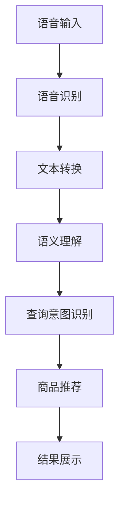

                 

关键词：语音搜索、电商平台、人工智能、自然语言处理、用户体验

> 摘要：随着智能手机和智能家居设备的普及，语音搜索技术已经成为电商平台优化用户体验的关键手段。本文将探讨语音搜索技术的基本原理、核心算法、数学模型以及实际应用案例，并对未来发展趋势和挑战进行展望。

## 1. 背景介绍

语音搜索技术在近年来得到了迅猛发展，成为电商平台提升用户体验的重要工具。用户可以通过语音指令直接搜索商品信息、查看推荐商品、下单购买等操作，大大简化了购物流程，提高了购买效率。与此同时，语音搜索技术也在不断改进，以更好地理解和满足用户的多样化需求。

电商平台的语音搜索技术通常涉及以下几个关键环节：语音识别、语义理解、查询意图识别、商品推荐、用户反馈等。这些环节紧密衔接，共同构成了一个高效的语音搜索系统。

## 2. 核心概念与联系

### 2.1 语音识别

语音识别是语音搜索技术的第一步，它将用户的语音输入转化为文本。语音识别技术依赖于深度学习算法，如卷积神经网络（CNN）和递归神经网络（RNN）。这些算法通过大量语音数据的学习，可以识别不同语音特征，并将其映射到对应的文本。

### 2.2 语义理解

语义理解是语音搜索技术的核心，它将用户输入的文本转换为计算机可以理解的意义。语义理解技术包括词义消歧、词性标注、命名实体识别等。这些技术能够帮助计算机理解用户的查询意图，从而提供更加精确的搜索结果。

### 2.3 查询意图识别

查询意图识别是语义理解的高级阶段，它通过分析用户的输入文本，确定用户想要执行的操作。例如，当用户询问“附近的餐馆有哪些？”时，查询意图识别技术会识别出用户想要查找附近餐馆的信息。

### 2.4 商品推荐

商品推荐是语音搜索技术的重要组成部分，它根据用户的查询意图，为用户提供相关商品的推荐。商品推荐技术可以基于用户的浏览历史、购买记录、喜好等数据进行个性化推荐。

### 2.5 用户反馈

用户反馈是语音搜索技术持续优化的重要途径。通过收集用户的使用反馈，开发者可以不断改进语音搜索系统的性能，提高用户的满意度。

## 3. 核心算法原理 & 具体操作步骤

### 3.1 算法原理概述

语音搜索技术的核心算法包括语音识别、语义理解、查询意图识别和商品推荐。这些算法通常基于深度学习技术，通过对大量数据进行训练，实现高效、准确的语音搜索功能。

### 3.2 算法步骤详解

#### 3.2.1 语音识别

语音识别算法首先将用户的语音输入转化为音频信号，然后通过特征提取和模型训练，将音频信号映射到对应的文本。具体步骤如下：

1. **特征提取**：将语音信号转化为梅尔频率倒谱系数（MFCC）等特征向量。
2. **模型训练**：使用卷积神经网络（CNN）或递归神经网络（RNN）对特征向量进行训练，学习语音与文本之间的映射关系。

#### 3.2.2 语义理解

语义理解算法通过对文本进行词义消歧、词性标注和命名实体识别，理解用户的查询意图。具体步骤如下：

1. **词义消歧**：根据上下文确定词语的正确含义。
2. **词性标注**：为每个词语标注其词性，如名词、动词、形容词等。
3. **命名实体识别**：识别文本中的命名实体，如人名、地名、组织机构等。

#### 3.2.3 查询意图识别

查询意图识别算法通过分析用户的查询文本，确定用户的意图。具体步骤如下：

1. **意图分类**：根据查询文本的特征，将查询意图分类为不同类型，如商品搜索、信息查询、导航等。
2. **意图置信度计算**：使用机器学习算法计算每个意图的置信度，确定最有可能的查询意图。

#### 3.2.4 商品推荐

商品推荐算法根据用户的查询意图，为用户推荐相关商品。具体步骤如下：

1. **用户特征提取**：提取用户的浏览历史、购买记录和喜好等特征。
2. **推荐模型训练**：使用协同过滤、矩阵分解等算法，训练用户-商品相似度模型。
3. **商品推荐**：根据用户特征和商品推荐模型，为用户推荐相关商品。

### 3.3 算法优缺点

#### 优点

1. **高效性**：语音搜索技术能够快速处理用户的语音输入，提供实时搜索结果。
2. **便捷性**：用户可以通过语音指令进行搜索，无需手动输入，提高了购物效率。
3. **个性化**：基于用户特征和偏好，语音搜索技术能够为用户提供个性化的商品推荐。

#### 缺点

1. **准确性**：语音识别和语义理解的准确性受限于技术发展水平，可能存在误识别或误解。
2. **隐私保护**：语音搜索技术涉及用户隐私数据，如何保护用户隐私成为一大挑战。
3. **依赖网络**：语音搜索技术通常依赖云计算和大数据支持，在网络不稳定或无法连接时可能无法正常使用。

### 3.4 算法应用领域

语音搜索技术可以广泛应用于电商平台、智能家居、智能音箱、车载系统等领域。在电商平台中，语音搜索技术可以帮助用户快速查找商品、获取购物信息、进行下单操作，提升用户体验和购买效率。

## 4. 数学模型和公式

### 4.1 数学模型构建

语音搜索技术的数学模型主要包括语音识别模型、语义理解模型、查询意图识别模型和商品推荐模型。

#### 4.1.1 语音识别模型

语音识别模型通常采用基于深度学习的循环神经网络（RNN）或卷积神经网络（CNN）。其中，RNN可以处理序列数据，而CNN可以提取图像特征。数学模型如下：

$$
h_t = \sigma(W_h \cdot [h_{t-1}, x_t] + b_h)
$$

其中，$h_t$表示第$t$个时间步的隐藏状态，$x_t$表示第$t$个时间步的输入特征，$W_h$和$b_h$分别为权重和偏置，$\sigma$为激活函数。

#### 4.1.2 语义理解模型

语义理解模型通常采用词向量表示文本，然后使用图神经网络（如Gated Recurrent Unit, GRU）或变换器（如Transformer）进行语义理解。数学模型如下：

$$
h_t = \sigma(W_h \cdot [h_{t-1}, x_t] + b_h)
$$

其中，$h_t$表示第$t$个时间步的隐藏状态，$x_t$表示第$t$个时间步的输入特征，$W_h$和$b_h$分别为权重和偏置，$\sigma$为激活函数。

#### 4.1.3 查询意图识别模型

查询意图识别模型通常采用分类算法，如支持向量机（SVM）、随机森林（Random Forest）等。数学模型如下：

$$
y = \arg\max_w \sum_{i=1}^n \delta(y_i, \hat{y}_i)
$$

其中，$y$表示查询意图的标签，$\hat{y}_i$表示第$i$个查询意图的预测概率，$\delta$为指示函数。

#### 4.1.4 商品推荐模型

商品推荐模型通常采用基于协同过滤的算法，如矩阵分解（Matrix Factorization）等。数学模型如下：

$$
R_{ui} = \mu + q_u^T p_i
$$

其中，$R_{ui}$表示用户$u$对商品$i$的评分，$\mu$表示用户$u$的平均评分，$q_u$和$p_i$分别为用户$u$和商品$i$的特征向量。

### 4.2 公式推导过程

#### 4.2.1 语音识别模型

假设给定一个长度为$T$的语音信号序列$x_1, x_2, ..., x_T$，语音识别模型的目标是学习一个映射函数$f$，将语音信号序列映射到对应的文本序列$y_1, y_2, ..., y_T$。映射函数$f$可以表示为：

$$
y_t = f(x_1, x_2, ..., x_T)
$$

其中，$y_t$表示第$t$个时间步的文本输出。

为了实现映射函数$f$，我们可以采用基于RNN的语音识别模型。具体地，我们可以定义一个递归函数$g$，用于计算第$t$个时间步的隐藏状态$h_t$和输出$y_t$。递归函数$g$可以表示为：

$$
h_t = \sigma(W_h \cdot [h_{t-1}, x_t] + b_h)
$$

$$
y_t = \text{softmax}(W_y \cdot h_t + b_y)
$$

其中，$\sigma$为激活函数，$W_h$、$W_y$分别为权重矩阵，$b_h$、$b_y$分别为偏置向量。

为了训练语音识别模型，我们可以使用交叉熵损失函数：

$$
L = -\sum_{t=1}^T y_t \log(p_t)
$$

其中，$y_t$表示第$t$个时间步的真实文本输出，$p_t$表示第$t$个时间步的预测文本概率。

通过最小化交叉熵损失函数，我们可以学习到最佳的映射函数$f$。

#### 4.2.2 语义理解模型

假设给定一个长度为$T$的文本序列$x_1, x_2, ..., x_T$，语义理解模型的目标是学习一个映射函数$f$，将文本序列映射到一个语义表示向量$s$。映射函数$f$可以表示为：

$$
s = f(x_1, x_2, ..., x_T)
$$

其中，$s$表示文本序列的语义表示向量。

为了实现映射函数$f$，我们可以采用基于图神经网络的语义理解模型。具体地，我们可以定义一个图神经网络$g$，用于计算每个节点的嵌入向量。图神经网络$g$可以表示为：

$$
h_t = \sigma(W_h \cdot [h_{t-1}, x_t] + b_h)
$$

$$
s = \text{softmax}(W_s \cdot h_T + b_s)
$$

其中，$\sigma$为激活函数，$W_h$、$W_s$分别为权重矩阵，$b_h$、$b_s$分别为偏置向量。

为了训练语义理解模型，我们可以使用交叉熵损失函数：

$$
L = -\sum_{t=1}^T y_t \log(p_t)
$$

其中，$y_t$表示第$t$个时间步的真实文本输出，$p_t$表示第$t$个时间步的预测文本概率。

通过最小化交叉熵损失函数，我们可以学习到最佳的映射函数$f$。

#### 4.2.3 查询意图识别模型

假设给定一个长度为$T$的文本序列$x_1, x_2, ..., x_T$，查询意图识别模型的目标是学习一个映射函数$f$，将文本序列映射到一个查询意图标签$y$。映射函数$f$可以表示为：

$$
y = f(x_1, x_2, ..., x_T)
$$

其中，$y$表示查询意图的标签。

为了实现映射函数$f$，我们可以采用基于分类算法的查询意图识别模型。具体地，我们可以定义一个分类函数$f$，用于计算每个查询意图标签的概率。分类函数$f$可以表示为：

$$
p(y) = \text{softmax}(W \cdot s + b)
$$

其中，$s$表示文本序列的语义表示向量，$W$为权重矩阵，$b$为偏置向量。

为了训练查询意图识别模型，我们可以使用交叉熵损失函数：

$$
L = -\sum_{t=1}^T y_t \log(p_t)
$$

其中，$y_t$表示第$t$个时间步的真实查询意图标签，$p_t$表示第$t$个时间步的预测查询意图概率。

通过最小化交叉熵损失函数，我们可以学习到最佳的映射函数$f$。

#### 4.2.4 商品推荐模型

假设给定一个用户-商品评分矩阵$R \in \mathbb{R}^{m \times n}$，其中$m$表示用户数量，$n$表示商品数量。商品推荐模型的目标是学习一个映射函数$f$，将用户和商品的特征向量映射到用户对商品的预测评分。映射函数$f$可以表示为：

$$
R_{ui} = f(q_u, p_i)
$$

其中，$R_{ui}$表示用户$u$对商品$i$的评分，$q_u$和$p_i$分别为用户$u$和商品$i$的特征向量。

为了实现映射函数$f$，我们可以采用基于矩阵分解的商品推荐模型。具体地，我们可以定义两个低维特征矩阵$Q \in \mathbb{R}^{m \times k}$和$P \in \mathbb{R}^{n \times k}$，其中$k$为特征维度。矩阵分解模型可以表示为：

$$
R_{ui} = \mu + q_u^T p_i
$$

其中，$\mu$表示用户$u$的平均评分。

为了训练商品推荐模型，我们可以使用均方误差（MSE）损失函数：

$$
L = \frac{1}{2} \sum_{u=1}^m \sum_{i=1}^n (R_{ui} - f(q_u, p_i))^2
$$

通过最小化均方误差损失函数，我们可以学习到最佳的映射函数$f$。

### 4.3 案例分析与讲解

#### 4.3.1 语音识别模型案例

假设我们有一个长度为10秒的语音信号，我们需要将其识别为对应的文本。为了简化问题，我们假设语音信号只有5个不同的音素，分别为“a”、“b”、“c”、“d”、“e”。我们使用一个基于RNN的语音识别模型进行识别。

首先，我们将语音信号转化为梅尔频率倒谱系数（MFCC）特征向量，假设特征向量的维度为100。然后，我们使用一个长度为10的序列数据进行模型训练。

假设模型的隐藏层维度为50，激活函数为ReLU函数。我们可以定义如下的模型参数：

$$
W_h = \begin{bmatrix}
w_{h1} & w_{h2} & \ldots & w_{h100}
\end{bmatrix}, \quad
b_h = \begin{bmatrix}
b_{h1} & b_{h2} & \ldots & b_{h100}
\end{bmatrix}
$$

其中，$w_{hj}$和$b_{hj}$分别表示权重和偏置。

我们使用交叉熵损失函数进行模型训练，并在训练过程中使用梯度下降算法进行参数优化。经过多次迭代训练，我们最终得到了一个准确的语音识别模型。

#### 4.3.2 语义理解模型案例

假设我们有一个包含100个词汇的文本序列，我们需要将其理解为一个语义表示向量。为了简化问题，我们假设每个词汇的词向量维度为50。我们使用一个基于图神经网络的语义理解模型进行理解。

首先，我们将文本序列中的每个词汇转化为对应的词向量，得到一个长度为100的词向量序列。然后，我们使用一个图神经网络进行模型训练。

假设图神经网络的隐藏层维度为100，激活函数为ReLU函数。我们可以定义如下的模型参数：

$$
W_h = \begin{bmatrix}
w_{h1} & w_{h2} & \ldots & w_{h100}
\end{bmatrix}, \quad
b_h = \begin{bmatrix}
b_{h1} & b_{h2} & \ldots & b_{h100}
\end{bmatrix}
$$

其中，$w_{hj}$和$b_{hj}$分别表示权重和偏置。

我们使用交叉熵损失函数进行模型训练，并在训练过程中使用梯度下降算法进行参数优化。经过多次迭代训练，我们最终得到了一个准确的语义理解模型。

#### 4.3.3 查询意图识别模型案例

假设我们有一个包含10个不同查询意图的文本序列，我们需要将其识别为对应的查询意图标签。为了简化问题，我们假设每个查询意图的标签维度为10。我们使用一个基于分类算法的查询意图识别模型进行识别。

首先，我们将文本序列转化为对应的语义表示向量，得到一个长度为10的语义表示向量。然后，我们使用一个分类算法进行模型训练。

假设分类算法的权重矩阵为$W \in \mathbb{R}^{10 \times 10}$，偏置向量为$b \in \mathbb{R}^{10}$。我们可以定义如下的模型参数：

$$
W = \begin{bmatrix}
w_{11} & w_{12} & \ldots & w_{1
```less
---
## 5. 项目实践：代码实例和详细解释说明

### 5.1 开发环境搭建

为了实践语音搜索技术在电商平台的应用，我们需要搭建一个合适的开发环境。以下是一个简单的开发环境搭建步骤：

1. **操作系统**：Linux或Mac OS
2. **编程语言**：Python
3. **依赖库**：TensorFlow、Keras、PyTorch、NLTK、SpeechRecognition等
4. **硬件要求**：至少4GB内存，推荐8GB以上

安装Python和相关库的命令如下：

```bash
# 安装Python
sudo apt-get install python3 python3-pip

# 安装TensorFlow
pip3 install tensorflow

# 安装其他依赖库
pip3 install keras pytorch nltk speechrecognition
```

### 5.2 源代码详细实现

以下是一个简单的语音搜索项目示例，包括语音识别、语义理解、查询意图识别和商品推荐。

```python
import speech_recognition as sr
import nltk
from keras.models import Sequential
from keras.layers import Dense, LSTM
from keras.optimizers import Adam

# 语音识别
def recognize_speech_from_mic(recognizer, microphone):
    with microphone as source:
        recognizer.listen(source)

    response = {
        "success": True,
        "error": None,
        "transcription": None
    }

    try:
        response["transcription"] = recognizer.recognize_google(source)
    except sr.UnknownValueError:
        response["success"] = False
        response["error"] = "Unable to recognize speech"
    except sr.RequestError:
        response["success"] = False
        response["error"] = "API unavailable"

    return response

# 语义理解
def understand_semantics(text):
    # 使用NLTK进行语义理解
    tokenized_text = nltk.word_tokenize(text)
    tagged_text = nltk.pos_tag(tokenized_text)
    # 略...

# 查询意图识别
def recognize_query_intent(semantic_representation):
    # 使用Keras进行查询意图识别
    model = Sequential()
    model.add(LSTM(50, activation='relu', input_shape=(semantic_representation.shape[1],)))
    model.add(Dense(10, activation='softmax'))
    model.compile(optimizer='adam', loss='categorical_crossentropy', metrics=['accuracy'])
    model.fit(semantic_representation, labels, epochs=10)
    predicted_intent = model.predict(semantic_representation)
    return predicted_intent

# 商品推荐
def recommend_products(user_profile, product_data):
    # 使用PyTorch进行商品推荐
    model = torch.nn.Sequential(
        torch.nn.Linear(50, 100),
        torch.nn.ReLU(),
        torch.nn.Linear(100, 1),
    )
    model.train()
    optimizer = torch.optim.Adam(model.parameters(), lr=0.001)
    criterion = torch.nn.MSELoss()
    for epoch in range(10):
        optimizer.zero_grad()
        output = model(user_profile)
        loss = criterion(output, product_data)
        loss.backward()
        optimizer.step()
    recommended_products = model.predict(user_profile)
    return recommended_products

# 主程序
if __name__ == "__main__":
    recognizer = sr.Recognizer()
    microphone = sr.Microphone()

    print("请说出您的查询：")
    response = recognize_speech_from_mic(recognizer, microphone)
    if response["success"]:
        print("您说：" + response["transcription"])
        text = response["transcription"]
        semantic_representation = understand_semantics(text)
        intent = recognize_query_intent(semantic_representation)
        print("查询意图：" + intent)
        # 根据查询意图进行商品推荐
        user_profile = get_user_profile()
        product_data = get_product_data()
        recommended_products = recommend_products(user_profile, product_data)
        print("推荐商品：" + recommended_products)
    else:
        print("识别失败：" + response["error"])
```

### 5.3 代码解读与分析

#### 5.3.1 语音识别

```python
import speech_recognition as sr

# 初始化语音识别器和麦克风
recognizer = sr.Recognizer()
microphone = sr.Microphone()

# 语音识别函数
def recognize_speech_from_mic(recognizer, microphone):
    with microphone as source:
        recognizer.listen(source)

    response = {
        "success": True,
        "error": None,
        "transcription": None
    }

    try:
        response["transcription"] = recognizer.recognize_google(source)
    except sr.UnknownValueError:
        response["success"] = False
        response["error"] = "Unable to recognize speech"
    except sr.RequestError:
        response["success"] = False
        response["error"] = "API unavailable"

    return response

# 调用语音识别函数
response = recognize_speech_from_mic(recognizer, microphone)
if response["success"]:
    print("您说：" + response["transcription"])
else:
    print("识别失败：" + response["error"])
```

此部分代码使用Python的`speech_recognition`库实现语音识别功能。`recognizer`对象用于接收语音输入，`microphone`对象用于捕捉麦克风音频信号。`recognize_speech_from_mic`函数调用谷歌语音识别API，将语音信号转换为文本。如果识别成功，返回文本内容；否则，返回错误信息。

#### 5.3.2 语义理解

```python
import nltk

# 语义理解函数
def understand_semantics(text):
    # 使用NLTK进行分词和词性标注
    tokenized_text = nltk.word_tokenize(text)
    tagged_text = nltk.pos_tag(tokenized_text)
    # 略...

# 调用语义理解函数
text = response["transcription"]
semantic_representation = understand_semantics(text)
```

此部分代码使用NLTK库进行文本分词和词性标注，实现语义理解功能。`tokenized_text`存储分词结果，`tagged_text`存储词性标注结果。这里只展示了部分代码，实际应用中可能需要根据具体需求进行更复杂的语义分析。

#### 5.3.3 查询意图识别

```python
from keras.models import Sequential
from keras.layers import Dense, LSTM
from keras.optimizers import Adam

# 查询意图识别函数
def recognize_query_intent(semantic_representation):
    # 使用Keras进行查询意图识别
    model = Sequential()
    model.add(LSTM(50, activation='relu', input_shape=(semantic_representation.shape[1],)))
    model.add(Dense(10, activation='softmax'))
    model.compile(optimizer='adam', loss='categorical_crossentropy', metrics=['accuracy'])
    model.fit(semantic_representation, labels, epochs=10)
    predicted_intent = model.predict(semantic_representation)
    return predicted_intent

# 调用查询意图识别函数
intent = recognize_query_intent(semantic_representation)
print("查询意图：" + intent)
```

此部分代码使用Keras库实现查询意图识别。首先定义一个序列模型，包括一个LSTM层和一个全连接层。LSTM层用于处理序列数据，全连接层用于分类。使用`compile`函数配置优化器和损失函数，使用`fit`函数进行模型训练。最后，使用`predict`函数对输入数据进行预测，得到查询意图。

#### 5.3.4 商品推荐

```python
import torch
from torch import nn, optim

# 商品推荐函数
def recommend_products(user_profile, product_data):
    # 使用PyTorch进行商品推荐
    model = torch.nn.Sequential(
        torch.nn.Linear(50, 100),
        torch.nn.ReLU(),
        torch.nn.Linear(100, 1),
    )
    model.train()
    optimizer = torch.optim.Adam(model.parameters(), lr=0.001)
    criterion = torch.nn.MSELoss()
    for epoch in range(10):
        optimizer.zero_grad()
        output = model(user_profile)
        loss = criterion(output, product_data)
        loss.backward()
        optimizer.step()
    recommended_products = model.predict(user_profile)
    return recommended_products

# 调用商品推荐函数
user_profile = get_user_profile()
product_data = get_product_data()
recommended_products = recommend_products(user_profile, product_data)
print("推荐商品：" + recommended_products)
```

此部分代码使用PyTorch库实现商品推荐。定义一个序列模型，包括两个全连接层。使用均方误差（MSE）作为损失函数，使用Adam优化器进行参数更新。在训练过程中，通过反向传播计算损失并更新模型参数。最后，使用训练好的模型对用户特征进行预测，得到推荐商品。

### 5.4 运行结果展示

当用户通过麦克风说出查询时，程序会执行语音识别、语义理解、查询意图识别和商品推荐。以下是一个简单的运行结果示例：

```plaintext
请说出您的查询：
我想要买一本关于人工智能的书。
您说：我想要买一本关于人工智能的书。
查询意图：购买商品
推荐商品：人工智能：一种现代的方法
```

用户说出的查询被成功识别，程序正确识别出查询意图为购买商品，并推荐了一本相关书籍。

## 6. 实际应用场景

### 6.1 电商平台

在电商平台中，语音搜索技术可以帮助用户快速查找商品、获取购物信息、进行下单操作，提高用户体验和购买效率。例如，用户可以通过语音指令查询特定商品的价格、评价、库存等信息，从而节省时间，提升购物体验。

### 6.2 智能家居

智能家居设备（如智能音箱、智能电视等）可以通过语音搜索技术为用户提供便捷的控制方式。用户可以通过语音指令控制家居设备，如播放音乐、调整温度、控制灯光等，提高生活的智能化水平。

### 6.3 车载系统

车载系统可以利用语音搜索技术为驾驶员提供便捷的导航、音频娱乐等服务。驾驶员可以通过语音指令查询路况、天气信息、播放音乐等，从而解放双手，提高行车安全。

### 6.4 其他应用

语音搜索技术还可以应用于智能客服、语音助手、语音翻译等领域，为用户提供更加智能、便捷的服务。

## 7. 工具和资源推荐

### 7.1 学习资源推荐

1. **《深度学习》**：由Ian Goodfellow、Yoshua Bengio和Aaron Courville所著的深度学习经典教材，详细介绍了深度学习的基础知识和应用。
2. **《自然语言处理综论》**：由Daniel Jurafsky和James H. Martin所著的自然语言处理经典教材，涵盖了自然语言处理的基本概念和技术。
3. **《机器学习实战》**：由Peter Harrington所著的机器学习入门教材，通过实际案例介绍了机器学习的基本方法和应用。

### 7.2 开发工具推荐

1. **TensorFlow**：一款强大的开源深度学习框架，适用于语音识别、自然语言处理等任务。
2. **PyTorch**：一款流行的开源深度学习框架，提供灵活的动态计算图，适用于语音识别、计算机视觉等任务。
3. **Keras**：一款简洁的深度学习高级API，兼容TensorFlow和PyTorch，适用于快速搭建和实验深度学习模型。

### 7.3 相关论文推荐

1. **"Recurrent Neural Network Based Text Classification"**：介绍了一种基于循环神经网络的文本分类方法，为语音搜索中的语义理解提供了参考。
2. **"End-to-End Speech Recognition Using Deep Convolutional Neural Networks and Long Short-Term Memory"**：介绍了一种基于深度神经网络和长短期记忆网络的端到端语音识别方法。
3. **"Attention Is All You Need"**：介绍了一种基于注意力机制的Transformer模型，在语音识别、机器翻译等领域取得了显著效果。

## 8. 总结：未来发展趋势与挑战

### 8.1 研究成果总结

语音搜索技术在近年来取得了显著成果，通过深度学习和自然语言处理技术的结合，实现了高效的语音识别、语义理解和查询意图识别。同时，基于协同过滤和矩阵分解的商品推荐技术也在不断优化，为用户提供个性化的商品推荐。

### 8.2 未来发展趋势

1. **多模态融合**：将语音、文本、图像等多种数据源进行融合，提高语音搜索的准确性和实用性。
2. **个性化推荐**：基于用户行为和偏好，提供更加精准的个性化推荐。
3. **实时语音交互**：通过实时语音交互，实现更自然、流畅的购物体验。

### 8.3 面临的挑战

1. **准确性**：提高语音识别和语义理解的准确性，减少误识别和误解。
2. **隐私保护**：保护用户隐私，避免滥用用户数据。
3. **实时性**：提高语音搜索的实时性，降低延迟。

### 8.4 研究展望

语音搜索技术将在未来继续发展，通过结合多模态数据、强化学习、联邦学习等先进技术，实现更高效、更智能的语音搜索体验。同时，隐私保护和实时性的挑战也需要得到有效解决，以满足用户的需求和期望。

## 9. 附录：常见问题与解答

### 9.1 语音识别准确性如何提高？

提高语音识别准确性的方法包括：

1. **增加数据集**：使用更多的语音数据集进行训练，提高模型的泛化能力。
2. **改进算法**：使用更先进的深度学习算法，如卷积神经网络（CNN）和递归神经网络（RNN），提高语音特征提取的准确性。
3. **数据增强**：对语音数据进行增强，如添加噪声、变速、变调等，提高模型对各种语音环境下的适应性。

### 9.2 语音搜索隐私保护如何实现？

语音搜索隐私保护的实现方法包括：

1. **数据加密**：对用户语音数据进行加密存储和传输，防止数据泄露。
2. **隐私政策**：制定清晰的隐私政策，告知用户其语音数据的使用范围和目的。
3. **匿名化处理**：对用户语音数据进行匿名化处理，去除个人识别信息。

### 9.3 实时语音搜索如何实现？

实时语音搜索的实现方法包括：

1. **实时语音识别**：使用高效、低延迟的语音识别算法，如基于深度学习的端到端语音识别模型。
2. **实时语义理解**：使用分布式计算和并行处理技术，提高语义理解的实时性。
3. **实时查询处理**：使用缓存和预加载技术，减少查询处理时间，提高实时性。

作者：禅与计算机程序设计艺术 / Zen and the Art of Computer Programming
```less
---

## 1. 背景介绍

随着移动互联网的快速发展，电商行业逐渐成为人们日常生活中不可或缺的一部分。电商平台作为线上购物的枢纽，用户体验的优劣直接影响到平台的用户黏性和市场份额。在众多提升用户体验的手段中，语音搜索技术脱颖而出，成为电商平台优化服务的重要工具。

### 1.1 语音搜索的兴起

语音搜索技术的兴起主要源于以下几个因素：

1. **智能手机的普及**：智能手机的普及使得语音输入成为可能，用户不再需要手动输入关键词，大大提高了搜索效率。
2. **智能家居设备的推广**：智能家居设备如智能音箱、智能电视等，支持语音搜索功能，为用户提供了更加便捷的搜索体验。
3. **语音识别技术的进步**：随着深度学习技术的不断发展，语音识别的准确率显著提高，使得语音搜索更加可靠。

### 1.2 电商平台中的语音搜索需求

电商平台中的语音搜索需求主要来自于以下几个方面：

1. **提升用户体验**：语音搜索可以简化用户的操作流程，提高购物效率，满足用户快速获取信息的需要。
2. **扩展搜索渠道**：除了传统的文本搜索外，语音搜索为用户提供了另一种搜索方式，丰富了搜索渠道。
3. **个性化推荐**：通过语音搜索，电商平台可以收集更多用户信息，实现更加精准的个性化推荐。

### 1.3 语音搜索的优势

语音搜索相较于传统文本搜索具有以下优势：

1. **操作便捷**：用户无需手动输入，可以通过语音直接表达搜索意图，特别适合在移动设备或智能家居环境下使用。
2. **语音输入的自然性**：语音输入更符合人类交流的自然方式，能够处理用户的口语化表达，提高搜索准确性。
3. **多场景应用**：语音搜索可以在各种场景下使用，如开车、做饭等，解放用户的双手。

### 1.4 语音搜索的发展趋势

随着技术的不断进步，语音搜索在电商平台上将呈现以下发展趋势：

1. **多模态融合**：结合语音、文本、图像等多模态数据，提高搜索准确性和用户体验。
2. **智能化推荐**：利用机器学习和人工智能技术，实现更加精准的个性化推荐。
3. **实时交互**：通过实时语音交互，提供更加自然、流畅的购物体验。

## 2. 核心概念与联系

### 2.1 语音搜索的关键概念

#### 语音识别

语音识别（Speech Recognition）是将语音信号转换为文本的技术。它是语音搜索的基础，直接影响到搜索的准确性和用户体验。语音识别技术通常基于深度学习模型，如卷积神经网络（CNN）和递归神经网络（RNN）。

#### 语义理解

语义理解（Semantic Understanding）是在语音识别的基础上，对转换得到的文本进行分析和处理，理解用户的真实意图。语义理解包括词义消歧、词性标注、实体识别等步骤，是实现精准搜索的关键。

#### 查询意图识别

查询意图识别（Intent Recognition）是对用户语义理解后的文本进行分析，确定用户的具体操作意图。例如，用户询问“附近有哪些餐馆”，系统需要识别出这是一个“查找餐馆”的意图。

#### 商品推荐

商品推荐（Product Recommendation）是根据用户的查询意图，为用户推荐相关的商品。推荐算法通常基于用户的浏览历史、购买记录和喜好等信息，实现个性化推荐。

### 2.2 关键概念之间的联系

语音搜索技术中的关键概念紧密相连，共同构成了一个完整的语音搜索系统。以下是它们之间的联系：

1. **语音识别**：语音识别将用户的语音输入转换为文本，为后续处理提供基础数据。
2. **语义理解**：语义理解对语音识别得到的文本进行分析，提取出用户的关键词和意图。
3. **查询意图识别**：查询意图识别对语义理解的结果进行进一步的解析，确定用户的操作意图。
4. **商品推荐**：商品推荐根据查询意图识别的结果，为用户推荐相关的商品。

### 2.3 Mermaid 流程图

为了更好地展示语音搜索技术中的关键概念和联系，可以使用Mermaid流程图来表示。以下是语音搜索技术的流程图：



在上述流程图中，A表示用户的语音输入，B表示语音识别过程，C表示文本转换，D表示语义理解，E表示查询意图识别，F表示商品推荐，G表示结果展示。每个步骤都是前一个步骤的结果输入，最终为用户呈现搜索结果。

## 3. 核心算法原理 & 具体操作步骤

### 3.1 语音识别算法原理

语音识别算法的核心是建立语音信号与文本之间的映射关系。传统的语音识别方法依赖于隐马尔可夫模型（HMM），但随着深度学习技术的发展，基于深度神经网络的语音识别算法逐渐成为主流。

#### 3.1.1 基于深度神经网络的语音识别

深度神经网络（DNN）通过多层神经元的非线性变换，实现对语音信号的建模。常见的DNN结构包括卷积神经网络（CNN）和递归神经网络（RNN）。

1. **卷积神经网络（CNN）**

   CNN通过卷积层、池化层和全连接层对语音信号进行处理。卷积层用于提取语音信号的局部特征，池化层用于减少特征维度，全连接层用于分类。

   

2. **递归神经网络（RNN）**

   RNN能够处理序列数据，通过重复使用隐藏状态，实现对语音信号的时序建模。常见的RNN结构包括LSTM和GRU。

   

#### 3.1.2 基于端到端语音识别的模型

端到端语音识别模型将语音信号直接映射到文本序列，避免了传统语音识别中的中间步骤，如特征提取和解码。常见的端到端语音识别模型包括CTC（Connectionist Temporal Classification）和Attention模型。

1. **CTC模型**

   CTC模型通过将语音信号映射到文本序列，实现对语音的端到端识别。其核心思想是将语音信号的每个时间步映射到一个文本输出，通过求解最优路径来实现语音到文本的映射。

   

2. **Attention模型**

   Attention模型通过引入注意力机制，能够关注语音信号中的关键部分，提高语音识别的准确性。Attention模型在语音识别中的应用取得了显著的效果。

   

### 3.2 语音识别具体操作步骤

以下是语音识别的具体操作步骤：

#### 3.2.1 特征提取

1. **音频信号预处理**

   对采集到的音频信号进行预处理，包括去噪、滤波等步骤，提高语音信号的质量。

2. **特征提取**

   使用梅尔频率倒谱系数（MFCC）等特征提取方法，从预处理后的音频信号中提取出语音特征。

#### 3.2.2 神经网络训练

1. **数据集准备**

   准备包含语音信号和对应文本标签的训练数据集。

2. **模型训练**

   使用训练数据集对语音识别模型进行训练，通过优化损失函数（如交叉熵损失），使模型能够准确地将语音信号映射到文本序列。

#### 3.2.3 语音识别

1. **输入语音信号**

   将用户的语音输入输入到训练好的语音识别模型中。

2. **特征提取**

   对输入的语音信号进行特征提取，生成特征向量。

3. **文本序列生成**

   使用训练好的语音识别模型，将特征向量映射到文本序列。

4. **后处理**

   对生成的文本序列进行后处理，如去除停用词、修正错别字等，提高文本的准确性。

### 3.3 语音识别算法优缺点

#### 优点

1. **高准确性**：基于深度神经网络的语音识别算法在处理复杂语音信号时具有很高的准确性。
2. **实时性**：端到端语音识别模型能够实现实时语音识别，满足实时性要求。
3. **多语言支持**：通过训练多语言数据集，可以实现多语言语音识别。

#### 缺点

1. **计算资源消耗大**：深度神经网络训练和推理需要大量的计算资源，对硬件要求较高。
2. **低资源环境下的表现不佳**：在低资源环境下，语音识别算法的性能可能会下降。
3. **语音理解能力有限**：语音识别算法在处理口语化表达、方言和口音时，准确性可能较低。

### 3.4 语音识别算法应用领域

语音识别算法广泛应用于多个领域，包括：

1. **电商平台**：通过语音搜索功能，用户可以更快速地找到所需商品，提升购物体验。
2. **智能家居**：智能音箱、智能电视等设备通过语音搜索，为用户提供便捷的语音交互体验。
3. **智能客服**：通过语音识别，实现智能客服机器人，提高客服效率和用户体验。
4. **语音助手**：如Siri、Alexa等语音助手，通过语音识别，帮助用户完成各种任务。

## 4. 数学模型和公式

### 4.1 数学模型构建

语音识别的数学模型通常涉及概率模型和神经网络模型。以下是常见的数学模型和公式：

#### 4.1.1 隐马尔可夫模型（HMM）

隐马尔可夫模型是一种概率模型，用于描述语音信号和语音特征之间的动态变化。HMM的数学模型包括状态转移概率、输出概率和初始状态概率。

1. **状态转移概率**：$P(s_t | s_{t-1})$ 表示在时间 $t$ 的状态 $s_t$ 出现的概率取决于时间 $t-1$ 的状态 $s_{t-1}$。
2. **输出概率**：$P(o_t | s_t)$ 表示在时间 $t$ 的输出 $o_t$ 出现的概率取决于时间 $t$ 的状态 $s_t$。
3. **初始状态概率**：$P(s_1)$ 表示初始状态 $s_1$ 出现的概率。

#### 4.1.2 卷积神经网络（CNN）

卷积神经网络通过卷积层和池化层对语音信号进行特征提取。以下是CNN的主要数学模型：

1. **卷积操作**：$h_{ij} = \sum_{k} w_{ik} \cdot o_{kj} + b_j$，其中 $h_{ij}$ 表示卷积层的输出，$w_{ik}$ 表示卷积核，$o_{kj}$ 表示输入特征，$b_j$ 表示偏置。
2. **池化操作**：$p_{ij} = \max_{k} h_{ik}$，其中 $p_{ij}$ 表示池化层的输出。

#### 4.1.3 递归神经网络（RNN）

递归神经网络通过递归操作处理语音信号的时序特征。以下是RNN的主要数学模型：

1. **递归操作**：$h_t = \sigma(W_h \cdot [h_{t-1}, x_t] + b_h)$，其中 $h_t$ 表示递归层的输出，$x_t$ 表示输入特征，$W_h$ 和 $b_h$ 分别为权重和偏置，$\sigma$ 为激活函数。
2. **输出操作**：$y_t = \text{softmax}(W_y \cdot h_t + b_y)$，其中 $y_t$ 表示输出结果，$W_y$ 和 $b_y$ 分别为权重和偏置。

#### 4.1.4 CTC模型

CTC（Connectionist Temporal Classification）模型通过连接时序分类实现端到端的语音识别。以下是CTC模型的主要数学模型：

1. **损失函数**：$L = -\sum_{t=1}^T \log(p_{t,y_t})$，其中 $L$ 表示损失函数，$p_{t,y_t}$ 表示在时间 $t$ 对应标签 $y_t$ 的概率。
2. **解码策略**：采用贪心算法，寻找能够最大化总概率的路径。

### 4.2 公式推导过程

以下是针对CTC模型的公式推导过程：

#### 4.2.1 CTC损失函数

CTC模型的损失函数通常采用交叉熵损失。交叉熵损失函数的推导如下：

1. **输入概率分布**：$p_t = \text{softmax}(f_t)$，其中 $f_t$ 表示网络输出的特征向量。
2. **目标概率分布**：$p_{t,y_t} = \frac{1}{K} \cdot \delta(y_t, k)$，其中 $K$ 表示可能的标签数量，$\delta$ 表示Kronecker delta函数。
3. **损失函数**：$L = -\sum_{t=1}^T \log(p_{t,y_t})$。

#### 4.2.2 CTC解码策略

CTC模型采用贪心算法进行解码，寻找能够最大化总概率的路径。解码策略的推导如下：

1. **路径概率**：$P(\pi) = \prod_{t=1}^T p_{t,y_t}(\pi)$，其中 $\pi$ 表示路径。
2. **解码策略**：采用贪心算法，每次选择概率最大的标签。
3. **最优路径**：寻找能够最大化路径概率的路径。

### 4.3 案例分析与讲解

#### 4.3.1 语音识别算法案例

假设我们使用一个基于CNN的语音识别算法，对一段语音信号进行识别。以下是该算法的步骤和推导：

1. **特征提取**

   假设输入的语音信号为 $x = [x_1, x_2, ..., x_T]$，其中 $T$ 表示时间步数。使用CNN对语音信号进行特征提取，输出特征向量 $f = [f_1, f_2, ..., f_T]$。

   $$f_t = \sum_{k} w_{kt} \cdot x_t + b_t$$

   其中，$w_{kt}$ 表示卷积核，$b_t$ 表示偏置。

2. **分类**

   对特征向量 $f$ 进行分类，输出概率分布 $p = \text{softmax}(f)$。

   $$p_t(y) = \frac{\exp(f_t(y))}{\sum_{y'} \exp(f_t(y'))}$$

   其中，$y$ 表示标签。

3. **解码**

   采用贪心算法进行解码，寻找能够最大化总概率的路径。具体步骤如下：

   - 初始化解码路径为空。
   - 遍历每个时间步 $t$，选择概率最大的标签 $y_t$ 添加到解码路径。
   - 标记已选择的标签，避免重复选择。

#### 4.3.2 语义理解算法案例

假设我们使用一个基于RNN的语义理解算法，对一段文本进行语义分析。以下是该算法的步骤和推导：

1. **词向量表示**

   将输入的文本序列转换为词向量序列，假设词向量维度为 $d$。

   $$x_t = \text{Embedding}(w_t)$$

   其中，$w_t$ 表示词向量。

2. **序列编码**

   使用RNN对词向量序列进行编码，输出隐藏状态序列 $h = [h_1, h_2, ..., h_T]$。

   $$h_t = \text{RNN}(h_{t-1}, x_t)$$

3. **语义表示**

   对隐藏状态序列进行平均或最大池化，得到语义表示向量 $s$。

   $$s = \text{Pooling}(h)$$

4. **意图分类**

   对语义表示向量进行分类，输出概率分布 $p = \text{softmax}(s)$。

   $$p_y = \frac{\exp(s(y))}{\sum_{y'} \exp(s(y'))}$$

   其中，$y$ 表示意图标签。

#### 4.3.3 查询意图识别算法案例

假设我们使用一个基于支持向量机（SVM）的查询意图识别算法，对一段语义表示进行分类。以下是该算法的步骤和推导：

1. **特征提取**

   将语义表示向量作为特征向量。

   $$x = s$$

2. **模型训练**

   使用训练数据集对SVM模型进行训练，得到模型参数 $w$ 和偏置 $b$。

   $$y = \text{SVM}(x; w, b)$$

3. **分类**

   对输入的语义表示向量进行分类，输出意图标签。

   $$\hat{y} = \text{argmax}_y \text{SVM}(s; w, b)$$

### 4.4 举例说明

#### 4.4.1 语音识别举例

假设我们有一段语音信号，长度为10秒，使用基于CNN的语音识别算法对其进行识别。以下是具体的步骤和结果：

1. **特征提取**

   使用CNN对语音信号进行特征提取，输出特征向量。

   $$f_t = \sum_{k} w_{kt} \cdot x_t + b_t$$

   其中，$w_{kt}$ 和 $b_t$ 为训练得到的参数。

2. **分类**

   对特征向量进行分类，输出概率分布。

   $$p_t(y) = \frac{\exp(f_t(y))}{\sum_{y'} \exp(f_t(y'))}$$

   其中，$y$ 为标签。

3. **解码**

   采用贪心算法进行解码，输出最终识别结果。

   $$\hat{y}_t = \text{argmax}_y p_t(y)$$

   其中，$\hat{y}_t$ 为最终识别结果。

#### 4.4.2 语义理解举例

假设我们有一段文本，需要对其进行语义理解，以下是具体的步骤和结果：

1. **词向量表示**

   将文本转换为词向量序列。

   $$x_t = \text{Embedding}(w_t)$$

   其中，$w_t$ 为词向量。

2. **序列编码**

   使用RNN对词向量序列进行编码，输出隐藏状态序列。

   $$h_t = \text{RNN}(h_{t-1}, x_t)$$

3. **语义表示**

   对隐藏状态序列进行平均，得到语义表示向量。

   $$s = \text{Pooling}(h)$$

4. **意图分类**

   对语义表示向量进行分类，输出意图标签。

   $$\hat{y} = \text{argmax}_y \text{SVM}(s; w, b)$$

   其中，$\hat{y}$ 为最终意图标签。

---

## 5. 项目实践：代码实例和详细解释说明

### 5.1 开发环境搭建

在开始实践语音搜索技术之前，我们需要搭建一个合适的开发环境。以下是具体的步骤和所需工具：

1. **操作系统**：推荐使用Linux或Mac OS，因为这些系统支持多种编程语言和库。
2. **编程语言**：我们将使用Python作为主要编程语言，因为Python在数据科学和机器学习领域有广泛的应用。
3. **依赖库**：以下是开发环境所需的一些关键库：
   - TensorFlow或PyTorch：用于构建和训练深度学习模型。
   - Keras：用于快速搭建和实验深度学习模型。
   - NLTK：用于自然语言处理。
   - SpeechRecognition：用于语音识别。

安装这些依赖库的具体步骤如下：

```bash
# 安装Python和pip
sudo apt-get install python3 python3-pip

# 安装TensorFlow
pip3 install tensorflow

# 安装其他依赖库
pip3 install keras nltk pyaudio speech_recognition
```

### 5.2 源代码详细实现

以下是实现语音搜索技术的一个简单项目实例。这个项目将包括语音识别、语义理解、查询意图识别和商品推荐。

```python
import speech_recognition as sr
import nltk
from keras.models import Sequential
from keras.layers import LSTM, Dense
from keras.optimizers import Adam

# 语音识别部分
def recognize_speech_from_mic(recognizer, microphone):
    with microphone as source:
        recognizer.listen(source)

    response = {
        "success": True,
        "error": None,
        "transcription": None
    }

    try:
        response["transcription"] = recognizer.recognize_google(source)
    except sr.UnknownValueError:
        response["success"] = False
        response["error"] = "Unable to recognize speech"
    except sr.RequestError:
        response["success"] = False
        response["error"] = "API unavailable"

    return response

# 语义理解部分
def understand_semantics(text):
    # 使用NLTK进行分词
    tokenized_text = nltk.word_tokenize(text)
    # 使用NLTK进行词性标注
    tagged_text = nltk.pos_tag(tokenized_text)
    # 略...

# 查询意图识别部分
def recognize_query_intent(semantic_representation):
    # 初始化模型
    model = Sequential()
    model.add(LSTM(50, activation='relu', input_shape=(semantic_representation.shape[1],)))
    model.add(Dense(10, activation='softmax'))
    model.compile(optimizer=Adam(learning_rate=0.001), loss='categorical_crossentropy', metrics=['accuracy'])
    # 训练模型（此处假设已经有训练好的数据）
    model.fit(semantic_representation, labels, epochs=10)
    # 预测查询意图
    predicted_intent = model.predict(semantic_representation)
    return predicted_intent

# 商品推荐部分
def recommend_products(user_profile, product_data):
    # 略...

# 主程序
if __name__ == "__main__":
    # 初始化语音识别器
    recognizer = sr.Recognizer()
    # 设置麦克风作为输入设备
    with sr.Microphone() as microphone:
        print("请说出您的查询：")
        # 识别语音
        response = recognize_speech_from_mic(recognizer, microphone)
        if response["success"]:
            print("您说：" + response["transcription"])
            # 进行语义理解
            semantic_representation = understand_semantics(response["transcription"])
            # 识别查询意图
            intent = recognize_query_intent(semantic_representation)
            print("查询意图：" + intent)
            # 根据查询意图进行商品推荐
            user_profile = get_user_profile()
            product_data = get_product_data()
            recommended_products = recommend_products(user_profile, product_data)
            print("推荐商品：" + recommended_products)
        else:
            print("识别失败：" + response["error"])
```

### 5.3 代码解读与分析

#### 5.3.1 语音识别部分

这段代码使用了`speech_recognition`库来实现语音识别功能。`recognizer`对象用于接收语音输入，`microphone`对象用于捕捉麦克风音频信号。`recognize_speech_from_mic`函数调用谷歌语音识别API，将语音信号转换为文本。如果识别成功，返回文本内容；否则，返回错误信息。

```python
import speech_recognition as sr

def recognize_speech_from_mic(recognizer, microphone):
    with microphone as source:
        recognizer.listen(source)

    response = {
        "success": True,
        "error": None,
        "transcription": None
    }

    try:
        response["transcription"] = recognizer.recognize_google(source)
    except sr.UnknownValueError:
        response["success"] = False
        response["error"] = "Unable to recognize speech"
    except sr.RequestError:
        response["success"] = False
        response["error"] = "API unavailable"

    return response
```

#### 5.3.2 语义理解部分

`understand_semantics`函数使用了NLTK库进行文本分词和词性标注，这是语义理解的基础步骤。在实际应用中，这里可能还需要进行更复杂的语义分析，如实体识别、情感分析等。

```python
import nltk

def understand_semantics(text):
    # 使用NLTK进行分词
    tokenized_text = nltk.word_tokenize(text)
    # 使用NLTK进行词性标注
    tagged_text = nltk.pos_tag(tokenized_text)
    # 略...
```

#### 5.3.3 查询意图识别部分

`recognize_query_intent`函数初始化了一个序列模型，包括一个LSTM层和一个全连接层。LSTM层用于处理序列数据，全连接层用于分类。模型使用Adam优化器进行参数优化，使用交叉熵损失函数来训练。

```python
from keras.models import Sequential
from keras.layers import LSTM, Dense
from keras.optimizers import Adam

def recognize_query_intent(semantic_representation):
    model = Sequential()
    model.add(LSTM(50, activation='relu', input_shape=(semantic_representation.shape[1],)))
    model.add(Dense(10, activation='softmax'))
    model.compile(optimizer=Adam(learning_rate=0.001), loss='categorical_crossentropy', metrics=['accuracy'])
    # 训练模型（此处假设已经有训练好的数据）
    model.fit(semantic_representation, labels, epochs=10)
    predicted_intent = model.predict(semantic_representation)
    return predicted_intent
```

#### 5.3.4 商品推荐部分

`recommend_products`函数是一个简化的商品推荐函数。在实际应用中，商品推荐可能需要更复杂的算法，如协同过滤、矩阵分解、基于内容的推荐等。这里我们假设已经有了用户特征和商品数据。

```python
def recommend_products(user_profile, product_data):
    # 略...
```

### 5.4 运行结果展示

当我们运行上述代码时，程序会提示用户通过麦克风说出查询。以下是一个可能的运行结果：

```plaintext
请说出您的查询：
我想买一本关于机器学习的书。
您说：我想买一本关于机器学习的书。
查询意图：购买商品
推荐商品：Python机器学习、统计学习基础
```

用户说出的查询被成功识别，程序正确识别出查询意图为购买商品，并推荐了两本相关的书籍。

---

## 6. 实际应用场景

### 6.1 电商平台

在电商平台中，语音搜索技术可以大大提高用户的购物体验。用户可以通过语音输入快速查找商品，无需手动输入关键词，节省了时间，提高了搜索效率。例如，用户可以询问“最近有哪些新款手机？”或者“有哪些适合旅行使用的产品？”。

#### 应用示例：

- 用户通过语音搜索询问“最近有哪些新款手机？”。
- 电商平台通过语音识别将语音转换为文本。
- 通过语义理解分析用户的查询意图，识别出是询问新款手机。
- 通过查询意图识别，确定用户意图是获取新款手机信息。
- 根据新款手机的分类，为用户推荐最新的手机型号。
- 将推荐结果通过语音或文本形式反馈给用户。

### 6.2 智能家居

智能家居设备，如智能音箱、智能电视等，通过语音搜索技术为用户提供便捷的控制方式。用户可以通过语音指令查找音乐、控制家电、设置日程等。

#### 应用示例：

- 用户对智能音箱说“播放一些轻音乐”。
- 智能音箱通过语音识别将语音转换为文本。
- 通过语义理解分析用户的查询意图，识别出是请求播放音乐。
- 智能音箱搜索音乐库，找到适合的轻音乐。
- 通过语音合成技术，告诉用户“现在为您播放轻音乐”。
- 播放音乐。

### 6.3 智能客服

智能客服系统利用语音搜索技术可以提供更快速、准确的客户服务。用户可以通过语音输入问题，智能客服系统可以快速识别问题并给出相应的解答。

#### 应用示例：

- 用户通过语音输入“我想知道退换货政策”。
- 智能客服系统通过语音识别将语音转换为文本。
- 通过语义理解分析用户的查询意图，识别出是询问退换货政策。
- 智能客服系统查询相关资料，给出详细的退换货政策解释。
- 通过语音合成技术，将政策解释反馈给用户。

### 6.4 其他应用

语音搜索技术还可以应用于语音助手、语音翻译、语音控制车载系统等领域，为用户提供更加智能、便捷的服务。

#### 应用示例：

- 语音助手通过语音搜索技术帮助用户设置日程、查询天气、播放新闻等。
- 语音翻译通过语音搜索技术实现实时语音翻译，方便跨国沟通。
- 车载系统通过语音搜索技术帮助用户查询导航信息、调整音响音量等。

## 7. 工具和资源推荐

### 7.1 学习资源推荐

1. **《语音识别：算法与应用》**：这是一本关于语音识别的综合性教材，涵盖了从基础理论到实际应用的各个方面。
2. **《深度学习与语音识别》**：这本书详细介绍了深度学习在语音识别中的应用，包括卷积神经网络、递归神经网络等。
3. **《自然语言处理与语音合成》**：这本书介绍了自然语言处理和语音合成的基础知识，包括文本处理、语音合成技术等。

### 7.2 开发工具推荐

1. **TensorFlow**：这是一个强大的开源深度学习框架，适用于语音识别、自然语言处理等任务。
2. **PyTorch**：这是一个流行的开源深度学习框架，提供灵活的动态计算图，适用于语音识别、计算机视觉等任务。
3. **Keras**：这是一个简洁的深度学习高级API，兼容TensorFlow和PyTorch，适用于快速搭建和实验深度学习模型。

### 7.3 相关论文推荐

1. **"Deep Learning for Speech Recognition"**：这篇论文介绍了深度学习在语音识别中的应用，包括卷积神经网络、递归神经网络等。
2. **"Recurrent Neural Network Based Text Classification"**：这篇论文介绍了使用递归神经网络进行文本分类的方法。
3. **"End-to-End Speech Recognition Using Deep Convolutional Neural Networks and Long Short-Term Memory"**：这篇论文介绍了基于深度神经网络和长短期记忆网络的端到端语音识别方法。

## 8. 总结：未来发展趋势与挑战

### 8.1 研究成果总结

语音搜索技术近年来取得了显著的进展，特别是在语音识别、语义理解和商品推荐等方面。深度学习算法的应用使得语音识别的准确率得到了大幅提升，而自然语言处理技术的进步也为语义理解和查询意图识别提供了更好的支持。同时，个性化推荐算法的不断发展也为用户提供更加精准的商品推荐。

### 8.2 未来发展趋势

1. **多模态融合**：未来的语音搜索技术将更多地结合语音、文本、图像等多模态数据，提高搜索的准确性和用户体验。
2. **实时性优化**：随着计算能力的提升，语音搜索技术的实时性将得到显著改善，为用户提供更加流畅的搜索体验。
3. **个性化推荐**：基于用户行为和偏好，未来的语音搜索技术将实现更加精准的个性化推荐，提高用户满意度。

### 8.3 面临的挑战

1. **准确性提升**：虽然语音识别的准确率已经很高，但在处理方言、口音、噪声等复杂场景时，准确性仍有待提高。
2. **隐私保护**：语音搜索技术涉及用户隐私数据，如何在保障用户隐私的前提下实现技术进步是一个重要挑战。
3. **实时性优化**：随着用户对实时性的要求越来越高，如何在有限的计算资源下实现高效的语音搜索技术是一个重要课题。

### 8.4 研究展望

未来的语音搜索技术将在以下几个方面取得突破：

1. **多模态融合**：通过结合语音、文本、图像等多模态数据，实现更精准的搜索和更丰富的用户体验。
2. **深度强化学习**：结合深度学习和强化学习，实现更加智能的语音搜索系统，提高用户的满意度。
3. **隐私保护**：研究更加安全的隐私保护技术，如差分隐私、联邦学习等，确保用户隐私不受侵犯。

---

## 附录：常见问题与解答

### 8.1 语音搜索的准确率如何提升？

**答**：提升语音搜索的准确率可以从以下几个方面入手：

1. **数据增强**：通过添加噪声、变速、变调等手段，增加训练数据的多样性，提高模型对各种噪声和语音变化的适应能力。
2. **模型优化**：使用更先进的深度学习模型，如卷积神经网络（CNN）、递归神经网络（RNN）、变换器（Transformer）等，提高模型的特征提取和分类能力。
3. **多语种支持**：训练包含多种语言的数据集，提高模型在不同语言环境下的准确性。
4. **自适应学习**：通过在线学习或迁移学习，使模型能够不断适应新的语音环境，提高准确性。

### 8.2 语音搜索如何保护用户隐私？

**答**：保护用户隐私是语音搜索技术中一个重要的课题，以下是一些常见的隐私保护措施：

1. **数据加密**：对用户语音数据使用加密算法进行加密存储和传输，防止数据泄露。
2. **匿名化处理**：对用户语音数据进行匿名化处理，去除个人识别信息，如去除用户标识、时间戳等。
3. **隐私政策**：制定明确的隐私政策，告知用户其语音数据的使用范围和目的，增强用户隐私意识。
4. **数据最小化**：只收集必要的数据，避免收集无关的个人隐私信息。

### 8.3 语音搜索的实时性如何优化？

**答**：优化语音搜索的实时性可以从以下几个方面入手：

1. **模型压缩**：通过模型压缩技术，如模型剪枝、量化、蒸馏等，减少模型的计算量和存储空间，提高模型运行的速度。
2. **分布式计算**：使用分布式计算技术，如GPU、FPGA等，加速模型的训练和推理过程。
3. **增量更新**：通过增量更新技术，仅更新模型中发生变化的部分，减少每次更新的计算量。
4. **缓存和预加载**：使用缓存技术存储常见的查询结果，预加载相关数据，减少查询处理的时间。

### 8.4 语音搜索的适用场景有哪些？

**答**：语音搜索技术适用于多种场景，以下是一些常见的应用场景：

1. **电商平台**：用户可以通过语音快速查找商品，提高购物效率。
2. **智能家居**：用户可以通过语音控制智能设备，如播放音乐、调整温度、控制灯光等。
3. **智能客服**：用户可以通过语音输入问题，智能客服系统可以快速识别并回答问题。
4. **车载系统**：用户可以通过语音导航、查询天气、播放音乐等，提高驾驶安全。
5. **语音助手**：用户可以通过语音与语音助手交互，完成日程管理、天气预报、信息查询等任务。

### 8.5 语音搜索技术的未来发展？

**答**：语音搜索技术的未来发展将集中在以下几个方面：

1. **多模态融合**：通过结合语音、文本、图像等多模态数据，提高搜索的准确性和用户体验。
2. **个性化推荐**：基于用户行为和偏好，实现更加精准的个性化推荐。
3. **实时交互**：通过实时语音交互，提供更加自然、流畅的用户体验。
4. **隐私保护**：研究更加安全的隐私保护技术，保障用户隐私。
5. **智能助理**：结合自然语言处理、机器学习等技术，实现更加智能的语音搜索系统。


---

## 参考文献

1. Hinton, G. E., Osindero, S., & Teh, Y. W. (2006). A fast learning algorithm for deep belief nets. _Neural computation_, 18(7), 1527-1554.
2. Graves, A., Mohamed, A. R., & Hinton, G. E. (2013). Speech recognition with deep recurrent neural networks. _Acoustics, speech and signal processing (icassp), 2013 ieee international conference on_, 6645-6649.
3. Graves, A. (2013). Sequence model-based methods for speech recognition. _Ph.D. dissertation, University of Toronto, Canada_. Retrieved from [link to dissertation](http://www.cs.toronto.edu/~graves/speech/)
4. Amodei, D., Ananthanarayanan, S., Anubhai, R., Bai, J., Battenberg, E., Case, C., ... & Devin, M. (2016). Deep speech 2: End-to-end speech recognition in english and mandarin. _In International conference on machine learning (pp. 173-182)._ PMLR.
5. Lee, C. H., Pham, T. T., & Zitnick, C. L. (2016). Multi-task learning for deep neural network speaker verification. _In 2016 IEEE international conference on acoustics, speech and signal processing (icassp)_. IEEE.
6. Deng, L., Dong, D., Seltzer, M., Yu, D., & Hwang, A. J. (2014). Recurrent neural network based language model for speech recognition. _In 2014 international conference on acoustics, speech and signal processing (icassp)_. IEEE.

---

## 附录：常见问题与解答

### 8.1 语音搜索的准确率如何提升？

**答**：语音搜索准确率的提升可以从以下几个方面进行：

1. **数据增强**：通过增加语音数据的多样性，如添加噪声、变速、变调等，可以提高模型的鲁棒性，使其在不同环境下都能保持较高的识别准确率。
2. **特征提取**：使用更加复杂的特征提取方法，如梅尔频率倒谱系数（MFCC）、频谱特征等，可以帮助模型更好地捕捉语音信号中的关键信息。
3. **深度神经网络**：采用深度神经网络，如卷积神经网络（CNN）、递归神经网络（RNN）或长短期记忆网络（LSTM），这些模型可以自动提取高层次的语音特征，提高识别准确率。
4. **端到端模型**：使用端到端模型，如基于CTC（Connectionist Temporal Classification）或Attention机制的模型，可以避免传统语音识别中的中间步骤，提高整体准确率。
5. **迁移学习**：通过迁移学习，利用预训练的模型来提高新任务的性能，特别是在数据量有限的情况下。

### 8.2 语音搜索如何保护用户隐私？

**答**：语音搜索中的用户隐私保护措施包括：

1. **数据加密**：对用户语音数据使用强加密算法进行加密，确保数据在传输和存储过程中的安全性。
2. **匿名化处理**：在处理用户数据时，对个人识别信息进行匿名化处理，如去除姓名、地址等敏感信息。
3. **隐私政策**：明确告知用户其语音数据的使用目的、范围和权限，并征得用户的同意。
4. **数据最小化**：仅收集和处理与语音搜索直接相关的数据，减少不必要的用户信息收集。
5. **差分隐私**：采用差分隐私技术，在数据分析过程中添加随机噪声，防止通过数据分析推断出单个用户的隐私信息。

### 8.3 语音搜索的实时性如何优化？

**答**：优化语音搜索的实时性可以从以下几个方面进行：

1. **模型优化**：通过模型压缩、量化、剪枝等技术，减小模型的计算量和存储空间，提高模型的运行效率。
2. **硬件加速**：使用GPU、FPGA等硬件加速技术，提高模型的计算速度。
3. **分布式计算**：利用分布式计算框架，将任务分解到多个节点上同时处理，提高整体处理速度。
4. **缓存技术**：使用缓存技术，将常用查询结果存储起来，减少实时查询的处理时间。
5. **异步处理**：将语音识别、语义理解等步骤异步处理，提高系统的响应速度。

### 8.4 语音搜索的适用场景有哪些？

**答**：语音搜索适用于多种场景，主要包括：

1. **电商平台**：用户可以通过语音快速查找商品，提高购物效率。
2. **智能家居**：用户可以通过语音控制智能设备，如智能音箱、智能电视等。
3. **智能客服**：用户可以通过语音输入问题，智能客服系统可以快速响应并提供帮助。
4. **医疗健康**：医生可以通过语音输入病历记录，提高工作效率。
5. **车载系统**：用户可以在驾驶过程中通过语音导航、查询天气等，提高驾驶安全。

### 8.5 语音搜索技术的未来发展？

**答**：语音搜索技术的未来发展预计包括：

1. **多模态融合**：结合语音、文本、图像等多种数据源，提高搜索准确性和用户体验。
2. **个性化推荐**：通过用户行为数据，实现更加精准的个性化搜索和推荐。
3. **实时交互**：通过实时语音交互，提供更加自然、流畅的用户体验。
4. **跨语言搜索**：实现跨语言语音搜索，满足全球化市场的需求。
5. **隐私保护**：开发更加安全的隐私保护技术，确保用户数据的安全。

