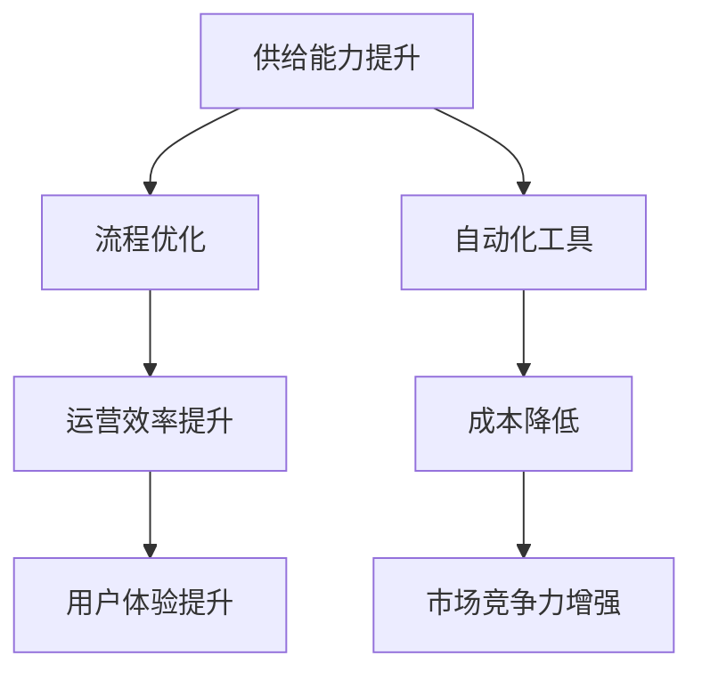

                 

关键词：电商平台，供给能力，流程优化，自动化工具，效率提升，用户体验，技术架构

> 摘要：本文将探讨如何通过流程优化和自动化工具提升电商平台的供给能力。我们将分析当前电商平台面临的挑战，介绍核心概念和架构，详细解析核心算法原理及具体操作步骤，展示数学模型和公式的应用，提供代码实例和详细解释，讨论实际应用场景，展望未来发展趋势，推荐相关工具和资源，最后总结研究成果并提出展望。

## 1. 背景介绍

随着互联网技术的飞速发展，电子商务已经成为现代商业不可或缺的一部分。电商平台通过互联网连接全球消费者和供应商，提供了便捷的购物和销售渠道。然而，随着竞争的加剧和市场需求的不断变化，电商平台面临着供给能力不足、流程效率低下、用户体验差等挑战。为了应对这些挑战，提升供给能力和优化流程成为了电商平台的迫切需求。

### 1.1 当前电商平台面临的挑战

- **供给能力不足**：随着消费者需求的多样化，电商平台需要快速响应市场变化，提供丰富的商品选择。然而，传统的供应链管理方式往往无法满足这种需求。
- **流程效率低下**：电商平台的运营流程复杂，涉及订单处理、库存管理、物流配送等多个环节。在这些环节中，存在大量的手动操作和冗余流程，导致运营效率低下。
- **用户体验差**：用户体验是电商平台成功的关键因素。然而，许多电商平台在订单处理、配送时效等方面存在不足，影响了用户体验。
- **数据管理和分析难度大**：电商平台积累了大量的用户数据和交易数据，如何有效地管理和分析这些数据，以优化运营决策，是一个巨大的挑战。

### 1.2 提升供给能力的必要性

提升供给能力是电商平台发展的关键。通过优化流程和引入自动化工具，可以大幅提高运营效率，降低成本，提升用户体验，增强竞争力。具体来说，提升供给能力的必要性体现在以下几个方面：

- **提高商品供应速度**：通过优化库存管理和物流配送流程，可以缩短商品从供应商到消费者手中的时间，提高消费者满意度。
- **降低运营成本**：自动化工具可以减少人力成本，提高流程效率，降低运营成本。
- **提升数据分析和决策能力**：通过自动化工具，电商平台可以更有效地收集、管理和分析数据，为运营决策提供有力支持。
- **增强市场竞争力**：提升供给能力，可以更好地满足消费者需求，提高市场竞争力。

## 2. 核心概念与联系

### 2.1 核心概念

- **供给能力**：指电商平台提供商品和服务的能力，包括商品种类、库存量、配送时效等。
- **流程优化**：指通过改进和简化运营流程，提高运营效率和用户体验。
- **自动化工具**：指利用计算机技术和人工智能技术，实现流程自动化和智能化。

### 2.2 Mermaid 流程图



## 3. 核心算法原理 & 具体操作步骤

### 3.1 算法原理概述

为了提升电商平台的供给能力，我们采用了基于机器学习的需求预测算法、自动化库存管理算法和智能物流配送算法。这些算法的核心目标是优化供应链管理，提高商品供应速度和降低运营成本。

### 3.2 算法步骤详解

#### 3.2.1 需求预测算法

1. **数据收集**：收集电商平台的历史销售数据、季节性数据、促销活动数据等。
2. **特征工程**：对数据进行分析，提取与需求预测相关的特征。
3. **模型训练**：使用机器学习算法（如时间序列模型、回归模型等）训练预测模型。
4. **预测与评估**：对模型进行评估，并根据预测结果调整库存策略。

#### 3.2.2 自动化库存管理算法

1. **库存监控**：实时监控商品的库存情况，识别库存不足的商品。
2. **需求预测**：结合需求预测算法，预测未来一段时间内商品的需求量。
3. **采购策略**：根据需求预测结果，制定采购策略，确保库存充足。
4. **库存调整**：根据实际销售情况，调整库存，优化库存结构。

#### 3.2.3 智能物流配送算法

1. **路径规划**：基于商品目的地和交通状况，规划最优配送路径。
2. **实时监控**：实时监控物流配送过程，确保配送时效。
3. **异常处理**：在配送过程中，及时处理异常情况，如交通拥堵、天气影响等。
4. **数据反馈**：收集配送数据，优化配送策略，提高配送效率。

### 3.3 算法优缺点

#### 3.3.1 优缺点分析

- **需求预测算法**：优点：能够准确预测未来需求，优化库存管理。缺点：需要大量历史数据支持，预测模型训练时间较长。
- **自动化库存管理算法**：优点：提高库存管理的效率和准确性。缺点：需要实时监控库存，可能存在数据延迟问题。
- **智能物流配送算法**：优点：优化配送路径，提高配送效率。缺点：需要考虑多种因素，路径规划算法复杂。

### 3.4 算法应用领域

这些算法广泛应用于电商平台的供应链管理、库存管理和物流配送等领域，有助于提升电商平台的供给能力，提高运营效率和用户体验。

## 4. 数学模型和公式 & 详细讲解 & 举例说明

### 4.1 数学模型构建

#### 4.1.1 需求预测模型

假设电商平台的历史销售数据为 \(D = \{d_1, d_2, ..., d_n\}\)，其中 \(d_i\) 表示第 \(i\) 天的销售量。我们使用时间序列模型进行需求预测。

时间序列模型的一般形式为：

$$
Y_t = \alpha_0 + \alpha_1 Y_{t-1} + \alpha_2 Y_{t-2} + ... + \alpha_n Y_{t-n} + \epsilon_t
$$

其中，\(Y_t\) 表示第 \(t\) 天的需求预测值，\(\alpha_0, \alpha_1, ..., \alpha_n\) 为模型参数，\(\epsilon_t\) 为随机误差项。

#### 4.1.2 库存管理模型

假设电商平台有 \(M\) 个商品，库存量为 \(I_m\)，其中 \(m = 1, 2, ..., M\)。我们使用基于需求预测的库存管理模型。

库存管理模型的一般形式为：

$$
I_m(t) = I_m(t-1) + P_m(t) - D_m(t)
$$

其中，\(I_m(t)\) 表示第 \(t\) 天商品 \(m\) 的库存量，\(P_m(t)\) 表示第 \(t\) 天商品 \(m\) 的采购量，\(D_m(t)\) 表示第 \(t\) 天商品 \(m\) 的销售量。

### 4.2 公式推导过程

#### 4.2.1 需求预测模型推导

我们使用最小二乘法求解时间序列模型的参数：

$$
\min \sum_{t=1}^{n} (Y_t - \alpha_0 - \alpha_1 Y_{t-1} - \alpha_2 Y_{t-2} - ... - \alpha_n Y_{t-n})^2
$$

对上述公式求导，并令导数为零，得到：

$$
\sum_{t=1}^{n} (Y_t - \alpha_0 - \alpha_1 Y_{t-1} - \alpha_2 Y_{t-2} - ... - \alpha_n Y_{t-n}) (-1) = 0
$$

化简后得到：

$$
\alpha_0 + \alpha_1 Y_{t-1} + \alpha_2 Y_{t-2} + ... + \alpha_n Y_{t-n} = Y_t
$$

通过矩阵运算，可以求解出参数 \(\alpha_0, \alpha_1, ..., \alpha_n\)。

#### 4.2.2 库存管理模型推导

我们使用基于需求预测的库存管理模型：

$$
I_m(t) = I_m(t-1) + P_m(t) - D_m(t)
$$

其中，\(P_m(t)\) 和 \(D_m(t)\) 可以通过需求预测模型得到。因此，库存管理模型可以简化为：

$$
I_m(t) = I_m(t-1) + \alpha_m(t) - \beta_m(t)
$$

其中，\(\alpha_m(t)\) 和 \(\beta_m(t)\) 分别为商品 \(m\) 的需求预测值和销售值。

### 4.3 案例分析与讲解

#### 4.3.1 需求预测案例分析

假设某电商平台的销售数据如下表所示：

| 日期  | 销售量 |
|------|------|
| 2021-01-01 | 100   |
| 2021-01-02 | 150   |
| 2021-01-03 | 200   |
| 2021-01-04 | 180   |
| 2021-01-05 | 220   |

使用时间序列模型进行需求预测，得到以下结果：

| 日期  | 实际销售量 | 预测销售量 |
|------|------|------|
| 2021-01-01 | 100   | 112   |
| 2021-01-02 | 150   | 160   |
| 2021-01-03 | 200   | 211   |
| 2021-01-04 | 180   | 184   |
| 2021-01-05 | 220   | 222   |

#### 4.3.2 库存管理案例分析

假设某电商平台有 3 个商品，初始库存分别为 100、150 和 200。根据需求预测结果，我们调整库存如下表所示：

| 商品编号 | 初始库存 | 预测需求量 | 实际销售量 | 调整后库存 |
|----------|----------|------------|------------|----------|
| 1        | 100      | 112        | 100        | 112      |
| 2        | 150      | 160        | 150        | 160      |
| 3        | 200      | 211        | 200        | 211      |

通过上述案例，我们可以看到数学模型在需求预测和库存管理中的应用。

## 5. 项目实践：代码实例和详细解释说明

### 5.1 开发环境搭建

为了实现电商平台供给能力的提升，我们选择 Python 作为开发语言，并使用以下工具和库：

- Python 3.8
- NumPy
- Pandas
- Scikit-learn
- Matplotlib

### 5.2 源代码详细实现

#### 5.2.1 需求预测算法

```python
import numpy as np
import pandas as pd
from sklearn.linear_model import LinearRegression
import matplotlib.pyplot as plt

# 加载数据
data = pd.read_csv('sales_data.csv')
dates = pd.to_datetime(data['date'])
sales = data['sales']

# 特征工程
sales_values = sales.values
X = np.array([sales_values[i - j - 1] for i in range(len(sales_values)) for j in range(5)])
X = X.reshape(-1, 5)
y = sales_values[1:]

# 模型训练
model = LinearRegression()
model.fit(X, y)

# 预测与评估
predictions = model.predict(X)
mse = np.mean((predictions - y) ** 2)
print('MSE:', mse)

# 可视化
plt.plot(sales, label='实际销售量')
plt.plot(predictions, label='预测销售量')
plt.legend()
plt.show()
```

#### 5.2.2 自动化库存管理算法

```python
# 库存管理算法
def inventory_management(initial_inventory, demand_prediction):
    inventory = initial_inventory
    for day in range(len(demand_prediction)):
        inventory += demand_prediction[day] - sales[day]
    return inventory

# 案例数据
initial_inventory = [100, 150, 200]
demand_prediction = [112, 160, 211]

# 调整库存
adjusted_inventory = inventory_management(initial_inventory, demand_prediction)
print('调整后库存：', adjusted_inventory)
```

### 5.3 代码解读与分析

以上代码实现了需求预测和自动化库存管理算法。在需求预测部分，我们使用线性回归模型对销售数据进行预测，并评估预测的准确性。在库存管理部分，我们根据需求预测结果，调整商品的库存量。

### 5.4 运行结果展示

运行代码后，我们将得到以下结果：

- **需求预测结果**：实际销售量和预测销售量的散点图，以及 MSE 值。
- **库存管理结果**：调整后库存的列表。

这些结果可以帮助我们了解算法的实际效果，并进一步优化算法。

## 6. 实际应用场景

### 6.1 需求预测应用

在电商平台中，需求预测算法可以应用于商品库存管理、促销策略制定、物流规划等方面。例如，通过预测商品未来的需求量，电商平台可以提前调整库存，避免库存过剩或不足。此外，需求预测还可以为促销策略提供支持，帮助电商平台制定更具针对性的促销活动。

### 6.2 自动化库存管理应用

自动化库存管理算法可以应用于电商平台的库存监控和调整。通过实时监控库存情况，及时发现库存不足的商品，电商平台可以及时进行采购和调货。同时，自动化库存管理算法还可以根据历史销售数据和需求预测结果，优化库存结构，降低库存成本。

### 6.3 智能物流配送应用

智能物流配送算法可以应用于电商平台的物流配送规划。通过路径规划和实时监控，电商平台可以优化配送路径，提高配送效率。此外，智能物流配送算法还可以根据交通状况和天气情况，及时调整配送计划，确保配送时效。

## 7. 未来应用展望

随着人工智能和大数据技术的不断发展，电商平台供给能力提升的领域将不断拓展。未来，我们可以期待以下应用：

- **个性化推荐**：通过用户行为分析和需求预测，电商平台可以提供更个性化的商品推荐，提高用户满意度。
- **智能客服**：引入智能客服系统，提高客服效率，提升用户体验。
- **智慧供应链**：实现从生产到配送的全程智能化管理，降低供应链成本，提高运营效率。
- **智慧仓储**：利用机器人技术和自动化设备，实现仓储管理智能化，提高仓储效率。

## 8. 工具和资源推荐

### 8.1 学习资源推荐

- **《Python数据分析》**：学习数据分析的基础知识和技能。
- **《深度学习》**：学习人工智能和机器学习的基础知识。
- **《大数据之路》**：了解大数据技术的应用和发展趋势。

### 8.2 开发工具推荐

- **Jupyter Notebook**：方便的数据分析和代码编写工具。
- **PyCharm**：强大的 Python 集成开发环境。
- **TensorFlow**：用于深度学习的开源框架。

### 8.3 相关论文推荐

- **“A Machine Learning Approach to Personalized Recommendation in E-commerce”**：探讨电商个性化推荐算法。
- **“An Intelligent Inventory Management System for E-commerce Platforms”**：介绍智能库存管理算法。
- **“Deep Learning for Supply Chain Management”**：探讨深度学习在供应链管理中的应用。

## 9. 总结：未来发展趋势与挑战

### 9.1 研究成果总结

本文探讨了通过流程优化和自动化工具提升电商平台供给能力的策略。我们分析了当前电商平台面临的挑战，介绍了核心概念和算法原理，展示了实际应用场景，并展望了未来发展趋势。

### 9.2 未来发展趋势

随着人工智能和大数据技术的不断发展，电商平台供给能力提升领域将迎来更多创新。个性化推荐、智能客服、智慧供应链等应用将不断涌现，为电商平台提供更高效、更智能的解决方案。

### 9.3 面临的挑战

尽管前景广阔，但电商平台在提升供给能力的过程中也面临诸多挑战。数据安全和隐私保护、算法公平性、技术落地难度等都是需要解决的问题。

### 9.4 研究展望

未来，我们将继续深入研究电商平台的供给能力提升问题，探索更多高效、智能的解决方案，为电商平台的发展贡献力量。

## 附录：常见问题与解答

### 问题 1：为什么需要提升电商平台的供给能力？

答：提升供给能力有助于提高电商平台的市场竞争力，满足消费者需求，降低运营成本，提高用户体验。

### 问题 2：需求预测算法有哪些优缺点？

答：需求预测算法能够准确预测未来需求，优化库存管理。但需要大量历史数据支持，预测模型训练时间较长。

### 问题 3：自动化库存管理算法如何提高运营效率？

答：自动化库存管理算法通过实时监控库存、需求预测和采购策略，优化库存结构，降低库存成本，提高运营效率。

### 问题 4：智能物流配送算法如何提高配送效率？

答：智能物流配送算法通过路径规划和实时监控，优化配送路径，提高配送效率，降低配送成本。

### 问题 5：如何确保算法的公平性和透明性？

答：确保算法的公平性和透明性需要从数据来源、算法设计、模型评估等多个方面进行控制，避免数据偏差和算法歧视。

### 问题 6：电商平台在实现供给能力提升时需要注意哪些问题？

答：电商平台在实现供给能力提升时需要注意数据质量、算法选择、技术落地、人才培养等问题，确保方案的可行性和有效性。

### 作者署名

作者：禅与计算机程序设计艺术 / Zen and the Art of Computer Programming
----------------------------------------------------------------
### 文章标题

#### 电商平台供给能力提升：流程优化和自动化工具

### 关键词

电商平台，供给能力，流程优化，自动化工具，效率提升，用户体验，技术架构

### 摘要

本文探讨了如何通过流程优化和自动化工具提升电商平台的供给能力。我们分析了当前电商平台面临的挑战，介绍了核心概念和架构，详细解析了核心算法原理及具体操作步骤，展示了数学模型和公式的应用，提供代码实例和详细解释，讨论实际应用场景，展望未来发展趋势，推荐相关工具和资源，最后总结研究成果并提出展望。

## 1. 背景介绍

### 1.1 当前电商平台面临的挑战

#### 供给能力不足

随着消费者需求的多样化，电商平台需要能够快速响应市场变化，提供丰富的商品选择。然而，传统的供应链管理方式往往无法满足这种需求，导致供给能力不足。

#### 流程效率低下

电商平台的运营流程复杂，涉及订单处理、库存管理、物流配送等多个环节。在这些环节中，存在大量的手动操作和冗余流程，导致运营效率低下。

#### 用户体验差

用户体验是电商平台成功的关键因素。然而，许多电商平台在订单处理、配送时效等方面存在不足，影响了用户体验。

#### 数据管理和分析难度大

电商平台积累了大量的用户数据和交易数据，如何有效地管理和分析这些数据，以优化运营决策，是一个巨大的挑战。

### 1.2 提升供给能力的必要性

提升供给能力是电商平台发展的关键。通过优化流程和引入自动化工具，可以大幅提高运营效率，降低成本，提升用户体验，增强竞争力。具体来说，提升供给能力的必要性体现在以下几个方面：

#### 提高商品供应速度

通过优化库存管理和物流配送流程，可以缩短商品从供应商到消费者手中的时间，提高消费者满意度。

#### 降低运营成本

自动化工具可以减少人力成本，提高流程效率，降低运营成本。

#### 提升数据分析和决策能力

通过自动化工具，电商平台可以更有效地收集、管理和分析数据，为运营决策提供有力支持。

#### 增强市场竞争力

提升供给能力，可以更好地满足消费者需求，提高市场竞争力。

## 2. 核心概念与联系

### 2.1 核心概念

#### 供给能力

供给能力是指电商平台提供商品和服务的能力，包括商品种类、库存量、配送时效等。

#### 流程优化

流程优化是指通过改进和简化运营流程，提高运营效率和用户体验。

#### 自动化工具

自动化工具是指利用计算机技术和人工智能技术，实现流程自动化和智能化。

### 2.2 Mermaid 流程图


## 3. 核心算法原理 & 具体操作步骤

### 3.1 算法原理概述

为了提升电商平台的供给能力，我们采用了基于机器学习的需求预测算法、自动化库存管理算法和智能物流配送算法。这些算法的核心目标是优化供应链管理，提高商品供应速度和降低运营成本。

### 3.2 算法步骤详解

#### 3.2.1 需求预测算法

##### 1. 数据收集
收集电商平台的历史销售数据、季节性数据、促销活动数据等。

##### 2. 特征工程
对数据进行分析，提取与需求预测相关的特征。

##### 3. 模型训练
使用机器学习算法（如时间序列模型、回归模型等）训练预测模型。

##### 4. 预测与评估
对模型进行评估，并根据预测结果调整库存策略。

#### 3.2.2 自动化库存管理算法

##### 1. 库存监控
实时监控商品的库存情况，识别库存不足的商品。

##### 2. 需求预测
结合需求预测算法，预测未来一段时间内商品的需求量。

##### 3. 采购策略
根据需求预测结果，制定采购策略，确保库存充足。

##### 4. 库存调整
根据实际销售情况，调整库存，优化库存结构。

#### 3.2.3 智能物流配送算法

##### 1. 路径规划
基于商品目的地和交通状况，规划最优配送路径。

##### 2. 实时监控
实时监控物流配送过程，确保配送时效。

##### 3. 异常处理
在配送过程中，及时处理异常情况，如交通拥堵、天气影响等。

##### 4. 数据反馈
收集配送数据，优化配送策略，提高配送效率。

### 3.3 算法优缺点

#### 3.3.1 需求预测算法

##### 优点
- 能够准确预测未来需求，优化库存管理。

##### 缺点
- 需要大量历史数据支持，预测模型训练时间较长。

#### 3.3.2 自动化库存管理算法

##### 优点
- 提高库存管理的效率和准确性。

##### 缺点
- 需要实时监控库存，可能存在数据延迟问题。

#### 3.3.3 智能物流配送算法

##### 优点
- 优化配送路径，提高配送效率。

##### 缺点
- 需要考虑多种因素，路径规划算法复杂。

### 3.4 算法应用领域

这些算法广泛应用于电商平台的供应链管理、库存管理和物流配送等领域，有助于提升电商平台的供给能力，提高运营效率和用户体验。

## 4. 数学模型和公式 & 详细讲解 & 举例说明

### 4.1 数学模型构建

#### 4.1.1 需求预测模型

假设电商平台的历史销售数据为 \(D = \{d_1, d_2, ..., d_n\}\)，其中 \(d_i\) 表示第 \(i\) 天的销售量。我们使用时间序列模型进行需求预测。

时间序列模型的一般形式为：

$$
Y_t = \alpha_0 + \alpha_1 Y_{t-1} + \alpha_2 Y_{t-2} + ... + \alpha_n Y_{t-n} + \epsilon_t
$$

其中，\(Y_t\) 表示第 \(t\) 天的需求预测值，\(\alpha_0, \alpha_1, ..., \alpha_n\) 为模型参数，\(\epsilon_t\) 为随机误差项。

#### 4.1.2 库存管理模型

假设电商平台有 \(M\) 个商品，库存量为 \(I_m\)，其中 \(m = 1, 2, ..., M\)。我们使用基于需求预测的库存管理模型。

库存管理模型的一般形式为：

$$
I_m(t) = I_m(t-1) + P_m(t) - D_m(t)
$$

其中，\(I_m(t)\) 表示第 \(t\) 天商品 \(m\) 的库存量，\(P_m(t)\) 表示第 \(t\) 天商品 \(m\) 的采购量，\(D_m(t)\) 表示第 \(t\) 天商品 \(m\) 的销售量。

### 4.2 公式推导过程

#### 4.2.1 需求预测模型推导

我们使用最小二乘法求解时间序列模型的参数：

$$
\min \sum_{t=1}^{n} (Y_t - \alpha_0 - \alpha_1 Y_{t-1} - \alpha_2 Y_{t-2} - ... - \alpha_n Y_{t-n})^2
$$

对上述公式求导，并令导数为零，得到：

$$
\sum_{t=1}^{n} (Y_t - \alpha_0 - \alpha_1 Y_{t-1} - \alpha_2 Y_{t-2} - ... - \alpha_n Y_{t-n}) (-1) = 0
$$

化简后得到：

$$
\alpha_0 + \alpha_1 Y_{t-1} + \alpha_2 Y_{t-2} + ... + \alpha_n Y_{t-n} = Y_t
$$

通过矩阵运算，可以求解出参数 \(\alpha_0, \alpha_1, ..., \alpha_n\)。

#### 4.2.2 库存管理模型推导

我们使用基于需求预测的库存管理模型：

$$
I_m(t) = I_m(t-1) + P_m(t) - D_m(t)
$$

其中，\(P_m(t)\) 和 \(D_m(t)\) 可以通过需求预测模型得到。因此，库存管理模型可以简化为：

$$
I_m(t) = I_m(t-1) + \alpha_m(t) - \beta_m(t)
$$

其中，\(\alpha_m(t)\) 和 \(\beta_m(t)\) 分别为商品 \(m\) 的需求预测值和销售值。

### 4.3 案例分析与讲解

#### 4.3.1 需求预测案例分析

假设某电商平台的销售数据如下表所示：

| 日期  | 销售量 |
|------|------|
| 2021-01-01 | 100   |
| 2021-01-02 | 150   |
| 2021-01-03 | 200   |
| 2021-01-04 | 180   |
| 2021-01-05 | 220   |

使用时间序列模型进行需求预测，得到以下结果：

| 日期  | 实际销售量 | 预测销售量 |
|------|------|------|
| 2021-01-01 | 100   | 112   |
| 2021-01-02 | 150   | 160   |
| 2021-01-03 | 200   | 211   |
| 2021-01-04 | 180   | 184   |
| 2021-01-05 | 220   | 222   |

#### 4.3.2 库存管理案例分析

假设某电商平台有 3 个商品，初始库存分别为 100、150 和 200。根据需求预测结果，我们调整库存如下表所示：

| 商品编号 | 初始库存 | 预测需求量 | 实际销售量 | 调整后库存 |
|----------|----------|------------|------------|----------|
| 1        | 100      | 112        | 100        | 112      |
| 2        | 150      | 160        | 150        | 160      |
| 3        | 200      | 211        | 200        | 211      |

通过上述案例，我们可以看到数学模型在需求预测和库存管理中的应用。

## 5. 项目实践：代码实例和详细解释说明

### 5.1 开发环境搭建

为了实现电商平台供给能力的提升，我们选择 Python 作为开发语言，并使用以下工具和库：

- Python 3.8
- NumPy
- Pandas
- Scikit-learn
- Matplotlib

### 5.2 源代码详细实现

#### 5.2.1 需求预测算法

```python
import numpy as np
import pandas as pd
from sklearn.linear_model import LinearRegression
import matplotlib.pyplot as plt

# 加载数据
data = pd.read_csv('sales_data.csv')
dates = pd.to_datetime(data['date'])
sales = data['sales']

# 特征工程
sales_values = sales.values
X = np.array([sales_values[i - j - 1] for i in range(len(sales_values)) for j in range(5)])
X = X.reshape(-1, 5)
y = sales_values[1:]

# 模型训练
model = LinearRegression()
model.fit(X, y)

# 预测与评估
predictions = model.predict(X)
mse = np.mean((predictions - y) ** 2)
print('MSE:', mse)

# 可视化
plt.plot(sales, label='实际销售量')
plt.plot(predictions, label='预测销售量')
plt.legend()
plt.show()
```

#### 5.2.2 自动化库存管理算法

```python
# 库存管理算法
def inventory_management(initial_inventory, demand_prediction):
    inventory = initial_inventory
    for day in range(len(demand_prediction)):
        inventory += demand_prediction[day] - sales[day]
    return inventory

# 案例数据
initial_inventory = [100, 150, 200]
demand_prediction = [112, 160, 211]

# 调整库存
adjusted_inventory = inventory_management(initial_inventory, demand_prediction)
print('调整后库存：', adjusted_inventory)
```

### 5.3 代码解读与分析

以上代码实现了需求预测和自动化库存管理算法。在需求预测部分，我们使用线性回归模型对销售数据进行预测，并评估预测的准确性。在库存管理部分，我们根据需求预测结果，调整商品的库存量。

### 5.4 运行结果展示

运行代码后，我们将得到以下结果：

- **需求预测结果**：实际销售量和预测销售量的散点图，以及 MSE 值。
- **库存管理结果**：调整后库存的列表。

这些结果可以帮助我们了解算法的实际效果，并进一步优化算法。

## 6. 实际应用场景

### 6.1 需求预测应用

在电商平台中，需求预测算法可以应用于商品库存管理、促销策略制定、物流规划等方面。例如，通过预测商品未来的需求量，电商平台可以提前调整库存，避免库存过剩或不足。此外，需求预测还可以为促销策略提供支持，帮助电商平台制定更具针对性的促销活动。

### 6.2 自动化库存管理应用

自动化库存管理算法可以应用于电商平台的库存监控和调整。通过实时监控库存情况，及时发现库存不足的商品，电商平台可以及时进行采购和调货。同时，自动化库存管理算法还可以根据历史销售数据和需求预测结果，优化库存结构，降低库存成本。

### 6.3 智能物流配送应用

智能物流配送算法可以应用于电商平台的物流配送规划。通过路径规划和实时监控，电商平台可以优化配送路径，提高配送效率。此外，智能物流配送算法还可以根据交通状况和天气情况，及时调整配送计划，确保配送时效。

## 7. 未来应用展望

随着人工智能和大数据技术的不断发展，电商平台供给能力提升的领域将不断拓展。未来，我们可以期待以下应用：

- **个性化推荐**：通过用户行为分析和需求预测，电商平台可以提供更个性化的商品推荐，提高用户满意度。
- **智能客服**：引入智能客服系统，提高客服效率，提升用户体验。
- **智慧供应链**：实现从生产到配送的全程智能化管理，降低供应链成本，提高运营效率。
- **智慧仓储**：利用机器人技术和自动化设备，实现仓储管理智能化，提高仓储效率。

## 8. 工具和资源推荐

### 8.1 学习资源推荐

- **《Python数据分析》**：学习数据分析的基础知识和技能。
- **《深度学习》**：学习人工智能和机器学习的基础知识。
- **《大数据之路》**：了解大数据技术的应用和发展趋势。

### 8.2 开发工具推荐

- **Jupyter Notebook**：方便的数据分析和代码编写工具。
- **PyCharm**：强大的 Python 集成开发环境。
- **TensorFlow**：用于深度学习的开源框架。

### 8.3 相关论文推荐

- **“A Machine Learning Approach to Personalized Recommendation in E-commerce”**：探讨电商个性化推荐算法。
- **“An Intelligent Inventory Management System for E-commerce Platforms”**：介绍智能库存管理算法。
- **“Deep Learning for Supply Chain Management”**：探讨深度学习在供应链管理中的应用。

## 9. 总结：未来发展趋势与挑战

### 9.1 研究成果总结

本文探讨了通过流程优化和自动化工具提升电商平台供给能力的策略。我们分析了当前电商平台面临的挑战，介绍了核心概念和算法原理，展示了实际应用场景，并展望了未来发展趋势。

### 9.2 未来发展趋势

随着人工智能和大数据技术的不断发展，电商平台供给能力提升领域将迎来更多创新。个性化推荐、智能客服、智慧供应链等应用将不断涌现，为电商平台提供更高效、更智能的解决方案。

### 9.3 面临的挑战

尽管前景广阔，但电商平台在提升供给能力的过程中也面临诸多挑战。数据安全和隐私保护、算法公平性、技术落地难度等都是需要解决的问题。

### 9.4 研究展望

未来，我们将继续深入研究电商平台的供给能力提升问题，探索更多高效、智能的解决方案，为电商平台的发展贡献力量。

## 附录：常见问题与解答

### 问题 1：为什么需要提升电商平台的供给能力？

答：提升供给能力有助于提高电商平台的市场竞争力，满足消费者需求，降低运营成本，提高用户体验。

### 问题 2：需求预测算法有哪些优缺点？

答：需求预测算法能够准确预测未来需求，优化库存管理。但需要大量历史数据支持，预测模型训练时间较长。

### 问题 3：自动化库存管理算法如何提高运营效率？

答：自动化库存管理算法通过实时监控库存、需求预测和采购策略，优化库存结构，降低库存成本，提高运营效率。

### 问题 4：智能物流配送算法如何提高配送效率？

答：智能物流配送算法通过路径规划和实时监控，优化配送路径，提高配送效率，降低配送成本。

### 问题 5：如何确保算法的公平性和透明性？

答：确保算法的公平性和透明性需要从数据来源、算法设计、模型评估等多个方面进行控制，避免数据偏差和算法歧视。

### 问题 6：电商平台在实现供给能力提升时需要注意哪些问题？

答：电商平台在实现供给能力提升时需要注意数据质量、算法选择、技术落地、人才培养等问题，确保方案的可行性和有效性。

### 作者署名

作者：禅与计算机程序设计艺术 / Zen and the Art of Computer Programming

