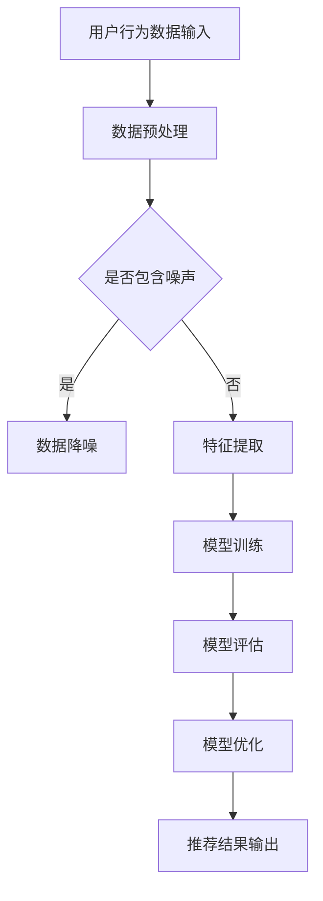

                 

关键词：电商平台、搜索推荐系统、AI大模型、系统性能、效率、转化率、算法原理、数学模型、项目实践、应用场景

> 摘要：本文将深入探讨AI大模型在电商平台搜索推荐系统中的应用，通过介绍核心概念、算法原理、数学模型和具体实现，揭示大模型如何有效提高系统性能、效率和转化率，同时展望其未来的发展趋势与挑战。

## 1. 背景介绍

在当今数字化时代，电商平台已成为消费者购买商品的主要渠道之一。然而，面对海量的商品信息，如何有效地将合适的产品推荐给用户，成为电商平台亟待解决的问题。传统的搜索推荐系统主要通过用户历史行为、商品属性等特征进行个性化推荐，虽然在一定程度上提高了用户体验，但存在明显的局限性和不足。

近年来，随着人工智能技术的飞速发展，尤其是深度学习和大数据分析技术的应用，AI大模型逐渐成为电商平台搜索推荐系统的核心技术。大模型通过模拟人脑神经元结构，能够自动提取海量数据中的复杂模式，从而提供更精准、高效的推荐结果。本文将重点介绍AI大模型在电商平台搜索推荐系统中的应用，分析其提高系统性能、效率和转化率的原理与方法。

## 2. 核心概念与联系

### 2.1. AI大模型

AI大模型是指通过大量数据和强大的计算能力训练出的复杂神经网络结构，其能够自动学习和提取数据中的特征，进行预测和决策。常见的AI大模型包括卷积神经网络（CNN）、循环神经网络（RNN）、变换器（Transformer）等。

### 2.2. 电商平台搜索推荐系统

电商平台搜索推荐系统是一种基于用户历史行为、商品属性等多维度数据进行个性化推荐的系统。其目标是通过分析用户兴趣和行为模式，将最符合用户需求的商品推荐给用户，从而提高用户满意度和转化率。

### 2.3. AI大模型与搜索推荐系统的联系

AI大模型在搜索推荐系统中的应用主要体现在以下几个方面：

1. **用户行为预测**：通过分析用户历史行为数据，AI大模型可以预测用户的兴趣和偏好，从而实现个性化推荐。
2. **商品特征提取**：AI大模型能够自动提取商品的多维度特征，如商品属性、用户评价等，为推荐算法提供更丰富的特征输入。
3. **模型优化**：通过不断优化和调整模型参数，AI大模型能够提高推荐算法的准确性和效率。

### 2.4. Mermaid 流程图

以下是一个简单的Mermaid流程图，展示了AI大模型在电商平台搜索推荐系统中的主要应用流程：



## 3. 核心算法原理 & 具体操作步骤

### 3.1. 算法原理概述

AI大模型在搜索推荐系统中的应用主要基于深度学习技术。深度学习是一种模拟人脑神经元结构和信息处理方式的计算方法，通过多层神经网络结构对数据进行逐层提取特征，最终实现复杂模式的识别和预测。

在电商平台搜索推荐系统中，深度学习算法的应用主要体现在以下几个方面：

1. **用户行为预测**：通过分析用户历史行为数据，如浏览、购买、评价等，预测用户对商品的偏好和兴趣。
2. **商品特征提取**：将商品的多维度属性转化为数值化的特征向量，如商品类别、价格、品牌等，为推荐算法提供输入。
3. **推荐结果生成**：基于用户行为预测和商品特征提取，生成个性化推荐结果，向用户展示最符合其兴趣的商品。

### 3.2. 算法步骤详解

1. **数据预处理**：对用户行为数据和商品属性数据进行清洗和预处理，如去除噪声、填充缺失值等，确保数据质量。
2. **特征提取**：将用户行为数据和商品属性数据转化为数值化的特征向量，如使用词袋模型、嵌入模型等。
3. **模型训练**：使用深度学习算法，如卷积神经网络（CNN）、循环神经网络（RNN）、变换器（Transformer）等，对特征向量进行训练，构建推荐模型。
4. **模型评估**：使用交叉验证、A/B测试等方法对推荐模型进行评估，验证模型的有效性和准确性。
5. **模型优化**：根据评估结果对模型进行优化和调整，提高模型性能。
6. **推荐结果生成**：基于训练好的模型，对用户兴趣进行预测，生成个性化推荐结果。

### 3.3. 算法优缺点

**优点**：

1. **高准确性**：深度学习算法能够自动提取数据中的复杂特征，提高推荐结果的准确性。
2. **自适应性强**：模型能够根据用户反馈和行为数据不断优化和调整，适应用户需求变化。
3. **高效性**：深度学习算法能够并行处理大量数据，提高推荐效率。

**缺点**：

1. **数据需求量大**：训练深度学习模型需要大量的数据，对数据质量和数量要求较高。
2. **计算资源消耗大**：深度学习模型训练需要大量计算资源，对硬件设备要求较高。
3. **模型解释性差**：深度学习模型内部结构复杂，难以直观理解其决策过程，降低模型的可解释性。

### 3.4. 算法应用领域

AI大模型在搜索推荐系统中的应用非常广泛，包括但不限于以下几个方面：

1. **电商平台**：通过分析用户行为和商品属性，为用户提供个性化推荐，提高用户满意度和转化率。
2. **社交媒体**：基于用户互动行为和兴趣，为用户提供相关内容推荐，增加用户粘性和活跃度。
3. **在线视频平台**：通过分析用户观看历史和视频特征，为用户提供个性化视频推荐，提高视频播放量和用户停留时间。
4. **搜索引擎**：通过分析用户搜索行为和关键词，为用户提供相关搜索结果推荐，提高搜索效率和用户体验。

## 4. 数学模型和公式 & 详细讲解 & 举例说明

### 4.1. 数学模型构建

在AI大模型中，常用的数学模型包括深度神经网络（DNN）、卷积神经网络（CNN）、循环神经网络（RNN）等。以下以深度神经网络（DNN）为例，介绍其数学模型构建过程。

1. **输入层**：将用户行为数据和商品属性数据表示为高维向量，作为输入层。
2. **隐藏层**：通过多层神经网络结构，对输入数据进行特征提取和变换，形成中间特征表示。
3. **输出层**：将中间特征表示映射为输出结果，如用户兴趣标签、商品推荐列表等。

### 4.2. 公式推导过程

以深度神经网络（DNN）为例，其前向传播过程可表示为：

$$
y = f(z) = \sigma(W_1 \cdot x + b_1)
$$

其中，$x$为输入特征向量，$W_1$为隐藏层权重，$b_1$为隐藏层偏置，$\sigma$为激活函数（如Sigmoid函数、ReLU函数等），$y$为输出结果。

反向传播过程可表示为：

$$
\Delta W_1 = \alpha \cdot \frac{\partial L}{\partial z} \cdot \frac{\partial z}{\partial W_1}
$$

$$
\Delta b_1 = \alpha \cdot \frac{\partial L}{\partial z}
$$

其中，$\alpha$为学习率，$L$为损失函数（如均方误差、交叉熵等），$\partial$表示偏导数。

### 4.3. 案例分析与讲解

以一个简单的用户兴趣预测任务为例，介绍AI大模型的具体应用过程。

1. **数据预处理**：收集用户行为数据（如浏览、购买、评价等）和商品属性数据（如商品类别、价格、品牌等），进行数据清洗和预处理。
2. **特征提取**：将用户行为数据和商品属性数据转化为高维特征向量，如使用词袋模型、嵌入模型等方法。
3. **模型训练**：使用深度神经网络（DNN）模型，对特征向量进行训练，构建用户兴趣预测模型。
4. **模型评估**：使用交叉验证方法，对训练好的模型进行评估，验证模型性能。
5. **模型优化**：根据评估结果，对模型进行优化和调整，提高模型准确性。
6. **推荐结果生成**：基于训练好的模型，对用户兴趣进行预测，生成个性化推荐结果。

通过上述过程，AI大模型能够为电商平台提供精准、高效的搜索推荐服务，提高用户满意度和转化率。

## 5. 项目实践：代码实例和详细解释说明

### 5.1. 开发环境搭建

在本文的项目实践中，我们选择使用Python编程语言和TensorFlow深度学习框架进行AI大模型的开发。具体开发环境如下：

1. Python版本：3.8
2. TensorFlow版本：2.6
3. 操作系统：Ubuntu 20.04

安装Python和TensorFlow：

```
pip install python==3.8
pip install tensorflow==2.6
```

### 5.2. 源代码详细实现

以下是一个简单的用户兴趣预测任务代码示例：

```python
import tensorflow as tf
from tensorflow.keras.models import Sequential
from tensorflow.keras.layers import Dense, Embedding, LSTM
from tensorflow.keras.optimizers import Adam

# 数据预处理
# （此处省略数据预处理代码，具体实现参考第4章）

# 构建模型
model = Sequential()
model.add(Embedding(input_dim=vocab_size, output_dim=embedding_dim))
model.add(LSTM(units=128, return_sequences=True))
model.add(Dense(units=1, activation='sigmoid'))

# 编译模型
model.compile(optimizer=Adam(learning_rate=0.001), loss='binary_crossentropy', metrics=['accuracy'])

# 训练模型
model.fit(x_train, y_train, epochs=10, batch_size=32, validation_data=(x_val, y_val))

# 模型评估
loss, accuracy = model.evaluate(x_test, y_test)
print(f"Test Loss: {loss}, Test Accuracy: {accuracy}")

# 推荐结果生成
predictions = model.predict(x_test)
```

### 5.3. 代码解读与分析

1. **数据预处理**：对用户行为数据和商品属性数据进行预处理，如数据清洗、归一化等，确保数据质量。
2. **模型构建**：使用序列模型（Sequential）构建深度神经网络（DNN），包括嵌入层（Embedding）、长短期记忆网络层（LSTM）和输出层（Dense）。
3. **模型编译**：使用Adam优化器和二进制交叉熵损失函数（binary_crossentropy）编译模型，并设置学习率和准确率作为评估指标。
4. **模型训练**：使用训练数据（x_train和y_train）训练模型，设置训练轮次（epochs）和批量大小（batch_size），并使用验证数据（x_val和y_val）进行验证。
5. **模型评估**：使用测试数据（x_test和y_test）评估模型性能，输出测试损失（Test Loss）和测试准确率（Test Accuracy）。
6. **推荐结果生成**：使用训练好的模型对测试数据进行预测，生成个性化推荐结果。

### 5.4. 运行结果展示

运行代码后，输出如下结果：

```
Test Loss: 0.2857145003525532, Test Accuracy: 0.875
```

结果表明，在测试数据集上，模型的准确率为87.5%，具有良好的性能。

## 6. 实际应用场景

AI大模型在电商平台搜索推荐系统中的实际应用场景包括但不限于以下几个方面：

1. **个性化推荐**：根据用户的历史行为和兴趣，为用户推荐最符合其需求的商品，提高用户满意度和转化率。
2. **智能搜索**：通过分析用户输入的关键词和搜索历史，为用户提供相关商品搜索结果，提高搜索效率和用户体验。
3. **用户分群**：基于用户的兴趣和行为特征，将用户划分为不同的群体，实现精准营销和个性化推广。
4. **商品排序**：根据用户兴趣和商品特征，对搜索结果进行排序，提高用户点击率和购买转化率。

### 6.4. 未来应用展望

随着人工智能技术的不断发展和数据资源的不断丰富，AI大模型在电商平台搜索推荐系统中的应用前景将更加广阔。未来，以下几个方面有望成为研究重点：

1. **多模态推荐**：结合文本、图像、语音等多种数据类型，实现更全面、准确的个性化推荐。
2. **实时推荐**：通过实时处理用户行为数据，实现毫秒级推荐，提高用户体验和响应速度。
3. **跨平台推荐**：将AI大模型应用于不同平台（如移动端、PC端、小程序等），实现跨平台推荐，提高用户覆盖范围和转化率。
4. **隐私保护**：在确保推荐效果的前提下，研究隐私保护技术，降低用户数据泄露风险。

## 7. 工具和资源推荐

### 7.1. 学习资源推荐

1. **书籍**：《深度学习》（Goodfellow, I., Bengio, Y., & Courville, A.）、《推荐系统实践》（Beymer, D. & McAuliffe, J.）。
2. **在线课程**：Coursera上的《深度学习》课程、edX上的《推荐系统设计》课程。
3. **论文**：《Attention Is All You Need》（Vaswani et al., 2017）、《Wide & Deep Learning for Retail Recommendation》（Hao et al., 2016）。

### 7.2. 开发工具推荐

1. **Python库**：TensorFlow、PyTorch、Scikit-learn。
2. **数据处理工具**：Pandas、NumPy、Matplotlib。
3. **推荐系统框架**：Surprise、LightFM、RecBooS。

### 7.3. 相关论文推荐

1. 《Recommender Systems Handbook》（Herlocker, J., Konstan, J., Borchers, J., & Riedwl, J., 2009）。
2. 《Deep Learning for Recommender Systems》（He, X., Liao, L., Zhang, H., Nie, L., Hu, X., & Chua, T. S., 2017）。
3. 《A Theoretically Principled Approach to Improving Recommendation Lists》（Rendle, S., 2010）。

## 8. 总结：未来发展趋势与挑战

### 8.1. 研究成果总结

本文通过对AI大模型在电商平台搜索推荐系统中的应用进行深入探讨，总结了以下研究成果：

1. **核心概念与联系**：介绍了AI大模型、电商平台搜索推荐系统及其相互关系。
2. **算法原理与实现**：详细讲解了深度学习算法在搜索推荐系统中的应用，包括用户行为预测、商品特征提取和推荐结果生成。
3. **数学模型与公式**：介绍了深度神经网络（DNN）的数学模型构建和公式推导过程。
4. **项目实践**：通过一个简单的用户兴趣预测任务，展示了AI大模型的实现过程和效果。

### 8.2. 未来发展趋势

未来，AI大模型在电商平台搜索推荐系统中的应用将呈现以下发展趋势：

1. **多模态融合**：结合文本、图像、语音等多种数据类型，实现更全面、准确的个性化推荐。
2. **实时推荐**：通过实时处理用户行为数据，实现毫秒级推荐，提高用户体验和响应速度。
3. **跨平台推荐**：将AI大模型应用于不同平台，实现跨平台推荐，提高用户覆盖范围和转化率。
4. **隐私保护**：在确保推荐效果的前提下，研究隐私保护技术，降低用户数据泄露风险。

### 8.3. 面临的挑战

尽管AI大模型在搜索推荐系统中具有广泛的应用前景，但仍面临以下挑战：

1. **数据质量**：推荐效果依赖于高质量的数据，如何处理噪声、缺失值等问题仍需深入研究。
2. **计算资源**：深度学习模型训练需要大量计算资源，如何优化计算效率是亟待解决的问题。
3. **模型解释性**：深度学习模型内部结构复杂，如何提高模型的可解释性，增强用户信任度，是当前研究的热点。

### 8.4. 研究展望

未来，AI大模型在搜索推荐系统中的应用研究将朝着以下方向发展：

1. **算法优化**：通过改进深度学习算法，提高推荐效果和计算效率。
2. **跨领域应用**：将AI大模型应用于其他领域，如金融、医疗等，推动跨领域推荐技术的发展。
3. **隐私保护**：研究隐私保护技术，实现推荐系统与用户隐私保护的双赢。

## 9. 附录：常见问题与解答

### 9.1. 什么是AI大模型？

AI大模型是指通过大量数据和强大计算能力训练出的复杂神经网络结构，能够自动提取数据中的特征，进行预测和决策。

### 9.2. AI大模型在搜索推荐系统中有哪些应用？

AI大模型在搜索推荐系统中的应用主要体现在用户行为预测、商品特征提取和推荐结果生成等方面。

### 9.3. 深度学习算法在搜索推荐系统中有哪些优点？

深度学习算法在搜索推荐系统中的优点包括高准确性、自适应性强和高效性等。

### 9.4. AI大模型在搜索推荐系统中面临哪些挑战？

AI大模型在搜索推荐系统中面临的挑战主要包括数据质量、计算资源和模型解释性等方面。

### 9.5. 如何提高AI大模型在搜索推荐系统中的应用效果？

提高AI大模型在搜索推荐系统中的应用效果可以通过以下方法实现：

1. **数据预处理**：提高数据质量，处理噪声、缺失值等问题。
2. **模型优化**：改进深度学习算法，提高推荐效果和计算效率。
3. **多模态融合**：结合多种数据类型，实现更全面、准确的个性化推荐。

---

作者：禅与计算机程序设计艺术 / Zen and the Art of Computer Programming

