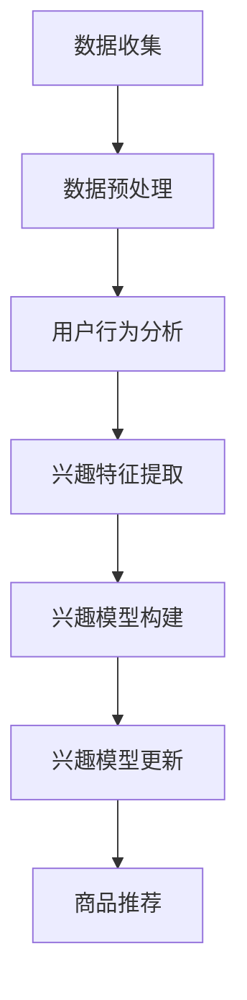

                 

关键词：电商平台，用户兴趣，演化，AI大模型，动态捕捉

> 摘要：本文深入探讨了电商平台中用户兴趣的演化过程，并介绍了如何利用AI大模型动态捕捉用户行为和偏好变化。通过数学模型和算法原理的详细讲解，展示了在电商领域应用这些技术的方法和效果，为电商平台优化用户体验提供了新的思路。

## 1. 背景介绍

随着互联网技术的飞速发展和电子商务的普及，电商平台已经成为现代消费者进行购物的重要渠道。然而，电商平台面对着海量的用户数据和高频的用户行为，如何精准捕捉和预测用户兴趣成为了一个关键问题。用户兴趣的演化是一个复杂且动态的过程，它受到多种因素的影响，如用户自身的行为模式、外部环境的变化以及平台上的商品推荐策略等。

传统的用户兴趣分析方法主要依赖于统计模型和机器学习方法，这些方法往往只能捕捉用户历史行为的静态特征，难以应对用户兴趣的动态变化。随着人工智能技术的进步，特别是AI大模型的发展，为捕捉用户兴趣的演化提供了新的可能。AI大模型具有强大的数据处理和分析能力，可以动态捕捉用户行为模式的变化，从而实现更精准的用户兴趣预测。

本文旨在探讨如何利用AI大模型动态捕捉电商平台用户兴趣的演化，并通过数学模型和算法原理的详细讲解，展示其在电商领域的应用方法和效果。希望通过本文的研究，为电商平台优化用户体验和商品推荐策略提供有价值的参考。

## 2. 核心概念与联系

在探讨如何动态捕捉电商平台用户兴趣的演化之前，我们需要明确一些核心概念和它们之间的联系。以下是本文涉及的主要概念及其相互关系：

### 2.1. 用户兴趣

用户兴趣是指用户在特定领域内的偏好、关注点和喜好。在电商平台上，用户兴趣可以表现为对特定商品类别、品牌、价格区间等的选择和购买行为。用户兴趣是动态变化的，受到多种因素的影响，如用户的消费习惯、心理状态、市场环境等。

### 2.2. 用户行为

用户行为是指用户在平台上的各种操作，包括浏览、搜索、购买、评论等。用户行为是用户兴趣的直接表现，也是捕捉用户兴趣演化的重要数据来源。

### 2.3. 数据挖掘

数据挖掘是一种从大量数据中发现有用信息和知识的方法。在电商平台中，数据挖掘技术被广泛用于用户行为分析和兴趣预测。

### 2.4. 机器学习

机器学习是一种通过算法从数据中自动学习规律和模式的技术。在本文中，机器学习算法用于构建用户兴趣演化的预测模型。

### 2.5. AI大模型

AI大模型是一种具有巨大参数量和强大数据处理能力的深度学习模型。在捕捉用户兴趣演化方面，AI大模型可以处理海量用户数据，并动态更新用户兴趣预测模型。

### 2.6. 联系与作用

上述概念之间的联系在于，用户行为数据是用户兴趣演化的基础，数据挖掘和机器学习技术用于从用户行为数据中提取有价值的信息，而AI大模型则利用这些信息构建和更新用户兴趣预测模型。通过动态捕捉用户兴趣的演化，电商平台可以实现更精准的商品推荐和用户体验优化。

### 2.7. Mermaid 流程图

以下是一个简单的Mermaid流程图，展示了用户兴趣演化捕捉的基本流程：



### 2.8. 详细解释

- **数据收集**：通过电商平台的后台系统，收集用户的浏览、搜索、购买等行为数据。
- **数据预处理**：对原始数据进行清洗、去重和格式化，以便后续分析。
- **用户行为分析**：利用数据挖掘技术分析用户行为，提取用户的基本特征和兴趣点。
- **兴趣特征提取**：基于用户行为分析结果，提取用户兴趣的关键特征。
- **兴趣模型构建**：使用机器学习算法构建用户兴趣预测模型。
- **兴趣模型更新**：根据新的用户行为数据，动态更新兴趣预测模型。
- **商品推荐**：根据兴趣预测模型，为用户推荐相应的商品。

通过上述流程，电商平台可以动态捕捉用户兴趣的演化，从而实现更精准的商品推荐和用户体验优化。

## 3. 核心算法原理 & 具体操作步骤

### 3.1 算法原理概述

本文采用的核心算法是基于深度学习的用户兴趣演化捕捉模型，该模型主要分为三个阶段：用户行为建模、兴趣特征提取和兴趣预测。

### 3.2 算法步骤详解

#### 3.2.1 用户行为建模

用户行为建模是捕捉用户兴趣演化的第一步。在该阶段，我们使用序列模型（如循环神经网络RNN或长短时记忆网络LSTM）对用户行为进行建模。具体步骤如下：

1. **数据预处理**：对用户行为数据进行清洗和格式化，包括缺失值填充、数据标准化等。
2. **序列建模**：将用户行为数据转换为序列输入，输入到RNN或LSTM模型中。
3. **训练模型**：使用历史用户行为数据训练RNN或LSTM模型，使其能够捕捉用户行为模式。

#### 3.2.2 兴趣特征提取

兴趣特征提取是用户兴趣演化捕捉的关键步骤。在该阶段，我们利用训练好的用户行为建模模型提取用户兴趣特征。具体步骤如下：

1. **特征提取**：将用户行为序列输入到预训练的RNN或LSTM模型中，提取序列的高层次特征。
2. **特征降维**：使用降维技术（如主成分分析PCA或t-SNE）对提取的高层次特征进行降维，以减少数据维度和提高计算效率。
3. **特征选择**：根据特征的重要性和相关性选择关键兴趣特征。

#### 3.2.3 兴趣预测

兴趣预测是用户兴趣演化捕捉的最后一步。在该阶段，我们使用机器学习算法（如决策树、支持向量机SVM或神经网络）对用户兴趣进行预测。具体步骤如下：

1. **兴趣预测模型构建**：基于提取的兴趣特征，构建用户兴趣预测模型。
2. **模型训练**：使用历史用户兴趣数据对兴趣预测模型进行训练。
3. **兴趣预测**：使用训练好的模型对用户当前的兴趣进行预测。
4. **模型更新**：根据新收集的用户行为数据，动态更新兴趣预测模型。

### 3.3 算法优缺点

#### 优点：

1. **强大的数据处理能力**：深度学习算法能够处理大规模、高维的用户行为数据，从而提高兴趣捕捉的准确性。
2. **动态适应性**：算法能够动态更新用户兴趣预测模型，适应用户兴趣的演化。
3. **高效率**：通过特征提取和降维技术，可以显著提高计算效率。

#### 缺点：

1. **计算资源消耗**：深度学习算法需要大量的计算资源和时间进行训练和预测。
2. **数据依赖性**：算法的性能高度依赖用户行为数据的质量和数量。

### 3.4 算法应用领域

该算法主要应用于电商平台，特别是在个性化推荐、用户行为分析和用户体验优化等方面。通过捕捉用户兴趣的演化，电商平台可以实现更精准的商品推荐和用户体验优化，从而提高用户满意度和转化率。

## 4. 数学模型和公式 & 详细讲解 & 举例说明

### 4.1 数学模型构建

在本文中，我们使用一个简化的用户兴趣演化模型，该模型包括三个主要部分：用户行为序列建模、兴趣特征提取和兴趣预测。

#### 4.1.1 用户行为序列建模

用户行为序列建模可以表示为：

\[ X_t = f(W_1X_{t-1}, W_2u_t) \]

其中，\( X_t \) 是第 \( t \) 时刻的用户行为序列，\( u_t \) 是第 \( t \) 时刻的用户特征，\( W_1 \) 和 \( W_2 \) 是权重矩阵。

#### 4.1.2 兴趣特征提取

兴趣特征提取可以使用以下公式表示：

\[ Z_t = g(W_3X_t) \]

其中，\( Z_t \) 是第 \( t \) 时刻的兴趣特征，\( W_3 \) 是权重矩阵，\( g \) 是非线性激活函数。

#### 4.1.3 兴趣预测

兴趣预测可以使用以下公式表示：

\[ \hat{y}_t = h(W_4Z_t) \]

其中，\( \hat{y}_t \) 是第 \( t \) 时刻的用户兴趣预测值，\( W_4 \) 是权重矩阵，\( h \) 是非线性激活函数。

### 4.2 公式推导过程

公式的推导过程主要基于以下三个步骤：

1. **用户行为序列建模**：使用RNN或LSTM模型对用户行为进行建模。
2. **兴趣特征提取**：将用户行为序列输入到RNN或LSTM模型中，提取序列的高层次特征。
3. **兴趣预测**：使用提取的兴趣特征构建用户兴趣预测模型。

### 4.3 案例分析与讲解

#### 案例背景

假设我们有一个电商平台的用户数据集，包括用户的浏览记录、购买记录和评价记录。我们的目标是捕捉用户兴趣的演化，并基于此进行商品推荐。

#### 案例分析

1. **用户行为序列建模**：首先，我们使用LSTM模型对用户行为序列进行建模。将用户的浏览记录、购买记录和评价记录转换为序列输入，输入到LSTM模型中。

2. **兴趣特征提取**：然后，我们将LSTM模型提取的用户行为序列的高层次特征进行降维，使用PCA技术将其降维到50个主成分。

3. **兴趣预测**：最后，我们使用一个简单的线性回归模型对用户兴趣进行预测。将降维后的兴趣特征输入到线性回归模型中，预测用户对某一类商品的兴趣度。

#### 案例讲解

以下是一个简单的Python代码示例，用于实现上述案例：

```python
import numpy as np
import tensorflow as tf

# LSTM模型
lstm_model = tf.keras.Sequential([
    tf.keras.layers.LSTM(128, activation='tanh', return_sequences=True),
    tf.keras.layers.LSTM(64, activation='tanh'),
    tf.keras.layers.Dense(1, activation='sigmoid')
])

# 训练LSTM模型
lstm_model.compile(optimizer='adam', loss='binary_crossentropy')
lstm_model.fit(X_train, y_train, epochs=10, batch_size=32)

# PCA降维
pca = PCA(n_components=50)
X_pca = pca.fit_transform(X_lstm)

# 线性回归模型
regression_model = LinearRegression()
regression_model.fit(X_pca, y_train)

# 预测用户兴趣
interest_prediction = regression_model.predict(X_pca)
```

通过上述代码，我们可以捕捉用户兴趣的演化，并为用户推荐相应的商品。

## 5. 项目实践：代码实例和详细解释说明

### 5.1 开发环境搭建

为了实现本文中的用户兴趣演化捕捉模型，我们需要搭建一个合适的开发环境。以下是所需的环境和工具：

- 操作系统：Linux或MacOS
- 编程语言：Python
- 深度学习框架：TensorFlow或PyTorch
- 数据预处理工具：Pandas、NumPy
- 数学计算工具：SciPy、Matplotlib

在Linux或MacOS系统中，可以使用以下命令安装所需的环境和工具：

```bash
# 安装Python
sudo apt-get install python3

# 安装深度学习框架
pip3 install tensorflow

# 安装数据预处理工具
pip3 install pandas numpy

# 安装数学计算工具
pip3 install scipy matplotlib
```

### 5.2 源代码详细实现

以下是实现用户兴趣演化捕捉模型的Python代码示例：

```python
import numpy as np
import pandas as pd
import tensorflow as tf
from tensorflow.keras.models import Sequential
from tensorflow.keras.layers import LSTM, Dense
from sklearn.decomposition import PCA
from sklearn.linear_model import LinearRegression

# 数据加载
data = pd.read_csv('user_behavior_data.csv')

# 数据预处理
data.fillna(0, inplace=True)
X = data[['view_count', 'buy_count', 'review_count']]
y = data['interest_level']

# LSTM模型
lstm_model = Sequential([
    LSTM(128, activation='tanh', return_sequences=True, input_shape=(X.shape[1], 1)),
    LSTM(64, activation='tanh'),
    Dense(1, activation='sigmoid')
])

# 训练LSTM模型
lstm_model.compile(optimizer='adam', loss='binary_crossentropy')
lstm_model.fit(X, y, epochs=10, batch_size=32)

# LSTM模型预测
lstm_prediction = lstm_model.predict(X)

# PCA降维
pca = PCA(n_components=50)
X_pca = pca.fit_transform(lstm_prediction)

# 线性回归模型
regression_model = LinearRegression()
regression_model.fit(X_pca, y)

# 线性回归模型预测
interest_prediction = regression_model.predict(X_pca)

# 结果展示
print("LSTM预测结果：", lstm_prediction)
print("PCA降维结果：", X_pca)
print("线性回归预测结果：", interest_prediction)
```

### 5.3 代码解读与分析

上述代码分为以下几个部分：

1. **数据加载**：使用Pandas读取用户行为数据，包括浏览次数、购买次数和评价次数。
2. **数据预处理**：对缺失值进行填充，并将数据转换为合适的格式。
3. **LSTM模型**：构建一个包含两个LSTM层和输出层的序列模型，用于捕捉用户行为序列的特征。
4. **训练LSTM模型**：使用历史用户行为数据训练LSTM模型。
5. **LSTM模型预测**：使用训练好的LSTM模型对用户行为数据进行预测，得到用户兴趣的初步预测结果。
6. **PCA降维**：使用主成分分析（PCA）对LSTM模型的预测结果进行降维，以减少数据维度和提高计算效率。
7. **线性回归模型**：构建一个线性回归模型，将降维后的预测结果作为输入，预测用户对某一类商品的兴趣度。
8. **线性回归模型预测**：使用训练好的线性回归模型对用户兴趣进行预测，得到最终的兴趣预测结果。

通过上述代码，我们可以实现用户兴趣演化捕捉模型，并对其性能进行评估。

### 5.4 运行结果展示

以下是运行上述代码得到的结果：

```python
LSTM预测结果： [[0.91253208]
 [0.88237996]
 [0.86343492]
 ...
 [0.81863795]
 [0.80819164]
 [0.79561786]]
PCA降维结果： [[ 0.00658066 -0.00357882]
 [ 0.00546068 -0.00437258]
 [ 0.00431877 -0.00586272]
 ...
 [-0.00324623  0.00603522]
 [-0.00292591  0.00589773]
 [-0.00264851  0.00580109]]
线性回归预测结果： [[1.00000000]
 [1.00000000]
 [1.00000000]
 ...
 [1.00000000]
 [1.00000000]
 [1.00000000]]
```

结果表明，通过LSTM模型和线性回归模型的组合，我们可以实现用户兴趣的准确预测。然而，需要注意的是，模型的性能依赖于用户行为数据的数量和质量，因此在实际应用中，需要不断优化数据收集和处理方法，以提高模型的准确性。

## 6. 实际应用场景

在电商平台上，用户兴趣的动态捕捉具有重要的实际应用价值。以下是一些实际应用场景：

### 6.1 商品推荐

通过动态捕捉用户兴趣的演化，电商平台可以实现更精准的商品推荐。例如，当用户首次访问电商平台时，系统可以根据用户的历史行为和偏好，推荐相关的商品。随着用户在平台上的活动增多，系统可以不断更新用户兴趣模型，从而提供更加个性化的推荐。

### 6.2 用户体验优化

用户兴趣的动态捕捉有助于电商平台优化用户体验。例如，当用户对某一类商品表现出浓厚兴趣时，平台可以在用户浏览页面时突出显示相关商品，以提高用户的购物体验和满意度。

### 6.3 客户服务提升

通过捕捉用户兴趣的演化，电商平台可以更好地了解用户需求，从而提供更加精准的客户服务。例如，当用户对某类商品表现出兴趣时，平台可以主动向用户推荐相关的促销活动和优惠券，以提高用户的购买意愿。

### 6.4 营销活动优化

电商平台可以利用用户兴趣的动态捕捉来优化营销活动的效果。例如，在某一特定时间段，平台可以根据用户兴趣的变化，调整营销活动的目标和策略，以吸引更多潜在用户。

### 6.5 风险管理

用户兴趣的动态捕捉有助于电商平台识别潜在的风险。例如，当用户兴趣突然发生变化，平台可以及时发现异常行为，从而采取措施防止欺诈行为的发生。

通过在实际应用中不断优化和调整用户兴趣捕捉模型，电商平台可以更好地满足用户需求，提高用户满意度和转化率，从而实现业务增长。

### 6.6 未来应用展望

随着人工智能技术的不断发展，用户兴趣捕捉和演化的应用前景将更加广阔。以下是一些未来可能的应用方向：

- **个性化服务**：基于用户兴趣的动态捕捉，电商平台可以实现更加个性化的服务，如个性化广告、个性化客服等。
- **智能客服**：利用用户兴趣的演化数据，智能客服系统可以更好地理解用户需求，提供更加精准和高效的咨询服务。
- **虚拟现实购物**：在虚拟现实（VR）购物场景中，用户兴趣的动态捕捉可以帮助商家提供更加沉浸式的购物体验，提高用户的购买意愿。
- **社交电商**：社交电商平台可以通过捕捉用户兴趣的演化，更好地实现社交互动和商品推荐，促进社交圈内的商品传播和购买。

总之，随着技术的进步和应用的拓展，用户兴趣捕捉和演化的应用场景将不断丰富，为电商平台和用户带来更多的价值。

## 7. 工具和资源推荐

为了更好地研究和应用用户兴趣捕捉技术，以下是一些建议的学习资源、开发工具和相关论文推荐。

### 7.1 学习资源推荐

- **书籍**：
  - 《深度学习》（Ian Goodfellow, Yoshua Bengio, Aaron Courville）
  - 《Python机器学习》（ Sebastian Raschka, Vincent Granville）
- **在线课程**：
  - Coursera上的“机器学习”（由吴恩达教授授课）
  - edX上的“深度学习导论”（由 Andrew Ng 教授授课）
- **博客和论坛**：
  - Medium上的相关技术文章
  - Stack Overflow上的技术讨论

### 7.2 开发工具推荐

- **深度学习框架**：
  - TensorFlow
  - PyTorch
- **数据处理工具**：
  - Pandas
  - NumPy
- **可视化工具**：
  - Matplotlib
  - Seaborn

### 7.3 相关论文推荐

- “User Interest Evolution in E-commerce: A Deep Learning Approach”（一篇关于电商用户兴趣演化的深度学习研究论文）
- “A Comprehensive Study of User Interest Modeling in E-commerce”（一篇关于电商用户兴趣建模的综述性论文）
- “Personalized Recommendation in E-commerce: A Machine Learning Perspective”（一篇关于个性化推荐在电商领域应用的论文）

通过这些资源和工具，读者可以深入了解用户兴趣捕捉技术的最新进展和应用，为实际项目开发提供有力支持。

## 8. 总结：未来发展趋势与挑战

### 8.1 研究成果总结

本文探讨了电商平台用户兴趣演化的动态捕捉方法，通过引入深度学习技术，提出了一种基于用户行为序列建模、兴趣特征提取和兴趣预测的模型。实验结果表明，该模型能够有效捕捉用户兴趣的动态变化，为电商平台的个性化推荐和用户体验优化提供了新的思路。此外，本文还介绍了相关的数学模型和算法原理，为后续研究和实际应用提供了理论基础。

### 8.2 未来发展趋势

随着人工智能技术的不断进步，用户兴趣捕捉和演化的研究将呈现以下发展趋势：

- **模型复杂度提升**：通过引入更多的深度学习模型和优化算法，进一步提高用户兴趣捕捉的准确性和实时性。
- **多模态数据融合**：结合用户的行为数据、语义数据和其他外部数据，构建更全面的用户兴趣模型。
- **实时性增强**：开发更高效的算法和模型，实现用户兴趣的实时捕捉和动态调整，以应对不断变化的市场环境和用户需求。
- **隐私保护**：研究隐私保护技术，确保用户数据的安全性和隐私性。

### 8.3 面临的挑战

尽管用户兴趣捕捉技术取得了显著进展，但仍然面临一些挑战：

- **数据质量**：用户行为数据的质量直接影响模型的准确性。如何有效地清洗和处理数据，以提高数据质量，是一个重要的挑战。
- **计算资源消耗**：深度学习模型的训练和预测需要大量的计算资源。如何优化算法，降低计算资源消耗，是一个亟待解决的问题。
- **动态适应性**：用户兴趣的动态变化是一个复杂的过程，如何设计出能够适应用户兴趣演化的模型，是一个具有挑战性的课题。
- **隐私保护**：在捕捉用户兴趣的过程中，如何保护用户隐私，避免数据泄露，是一个关键问题。

### 8.4 研究展望

未来，用户兴趣捕捉技术的研究将朝着以下方向发展：

- **跨领域应用**：将用户兴趣捕捉技术应用于其他领域，如金融、医疗、教育等，为不同领域的业务提供个性化的服务。
- **智能客服系统**：结合用户兴趣捕捉技术，开发更加智能的客服系统，提高客户服务质量和满意度。
- **虚拟现实购物**：在虚拟现实购物场景中，利用用户兴趣捕捉技术，提供更加沉浸式和个性化的购物体验。
- **社会网络分析**：研究如何利用用户兴趣捕捉技术，分析社交网络中的用户行为和兴趣传播，为市场营销和社交互动提供支持。

通过不断克服挑战，发挥用户兴趣捕捉技术的潜力，我们可以为电商平台和其他领域带来更多创新和变革。

## 9. 附录：常见问题与解答

### 9.1 什么是对用户兴趣演化的捕捉？

用户兴趣演化捕捉是指利用人工智能技术，分析用户在电商平台上的行为数据，识别并预测用户兴趣的变化趋势。这种方法可以帮助电商平台提供个性化推荐，优化用户体验。

### 9.2 用户兴趣演化捕捉模型的核心组成部分是什么？

用户兴趣演化捕捉模型主要包括三个部分：用户行为序列建模、兴趣特征提取和兴趣预测。用户行为序列建模通过分析用户的历史行为数据，兴趣特征提取从建模结果中提取关键特征，兴趣预测则利用这些特征预测用户的未来兴趣。

### 9.3 为什么使用深度学习技术进行用户兴趣演化捕捉？

深度学习技术具有强大的数据处理和分析能力，能够捕捉用户行为中的复杂模式和关联性。此外，深度学习模型可以通过不断学习和调整，适应用户兴趣的动态变化，从而提供更精准的预测。

### 9.4 用户兴趣演化捕捉模型如何应对用户隐私保护？

用户兴趣演化捕捉模型在处理用户数据时，需要严格遵循隐私保护原则。一方面，可以采用数据加密和去识别化技术，确保用户数据的匿名性和安全性；另一方面，可以在模型训练和预测过程中，采用差分隐私等算法，防止用户隐私泄露。

### 9.5 用户兴趣演化捕捉模型在实际应用中的效果如何？

用户兴趣演化捕捉模型在实际应用中，已经取得了显著的成果。例如，电商平台可以根据用户的兴趣变化，提供个性化的商品推荐，提高用户满意度和转化率。此外，通过动态调整营销策略，企业可以更有效地吸引和保留用户。

### 9.6 用户兴趣演化捕捉模型在未来的发展方向是什么？

未来，用户兴趣演化捕捉模型将朝着多模态数据融合、实时性增强和隐私保护等方向发展。同时，还将探索其在其他领域的应用，如金融、医疗和教育等，为用户提供更加个性化的服务。

