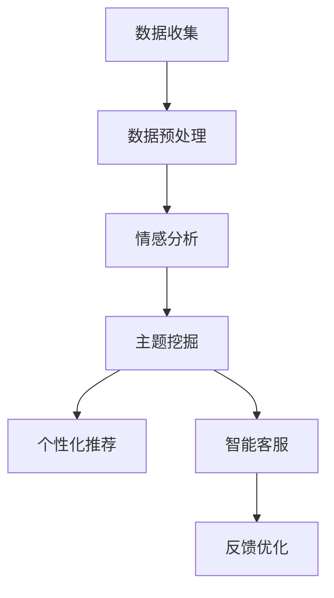

                 

关键词：电商平台、用户反馈、AI大模型、数据挖掘、文本分析、个性化推荐、深度学习

> 摘要：随着电子商务的迅猛发展，用户反馈数据量呈爆炸式增长，如何有效地挖掘和分析这些数据成为电商平台亟需解决的问题。本文介绍了利用AI大模型进行用户反馈分析的全新方法，通过对用户评论进行深度学习建模和语义理解，实现个性化推荐和智能客服，为电商平台提供有力支持。

## 1. 背景介绍

电子商务已经成为全球经济增长的重要驱动力，电商平台在互联网经济中扮演着至关重要的角色。然而，随着市场竞争的加剧，用户对产品质量、服务质量、购物体验等方面的要求越来越高，如何获取并有效利用用户反馈数据，成为电商平台能否持续发展的关键因素。

用户反馈是电商平台获取用户真实需求的直接途径，是优化产品和服务的重要依据。然而，传统的用户反馈分析方法存在以下问题：

1. **数据量大，分析难度高**：电商平台每天产生的用户反馈数据量巨大，且数据结构复杂，难以进行高效处理和分析。
2. **语义理解不足**：用户反馈往往是非结构化的文本数据，其中包含丰富的情感和语境信息，传统方法难以准确理解和挖掘。
3. **个性化推荐不足**：现有推荐系统多基于用户行为数据，对于用户反馈的个性化推荐研究较少，难以满足用户个性化需求。
4. **处理速度慢**：传统的用户反馈分析方法处理速度较慢，无法满足实时响应和快速反馈的需求。

为了解决这些问题，本文提出了基于AI大模型的用户反馈分析方法，通过深度学习等技术手段，实现对用户反馈的智能分析、理解和应用。

## 2. 核心概念与联系

### 2.1 AI大模型

AI大模型，即人工智能大规模模型，是近年来随着计算能力和数据资源的发展而兴起的一种新型人工智能技术。它通过大规模的数据训练和优化，能够实现高度复杂的任务，如图像识别、自然语言处理、语音识别等。AI大模型的主要特点包括：

1. **大规模**：AI大模型通常包含数十亿甚至千亿个参数，能够处理海量数据。
2. **深度学习**：AI大模型基于深度神经网络结构，能够通过多层神经元的抽象和变换，实现数据的自动特征提取和模型优化。
3. **自适应**：AI大模型具有自适应性，能够根据不同的任务和数据集进行自适应调整和优化。

### 2.2 用户反馈分析

用户反馈分析是对用户在使用产品或服务过程中提供的各种反馈信息进行收集、处理、分析和利用的过程。其核心目标是通过分析用户反馈，了解用户需求、发现潜在问题、优化产品和服务。用户反馈分析主要包括以下步骤：

1. **数据收集**：从电商平台获取用户反馈数据，包括评论、评分、问答等。
2. **数据预处理**：对收集到的用户反馈数据清洗、去噪、标准化等预处理操作。
3. **情感分析**：利用自然语言处理技术，对用户反馈进行情感分析，识别用户情感倾向。
4. **主题挖掘**：利用机器学习算法，对用户反馈进行主题建模，挖掘用户关注的重点问题。
5. **个性化推荐**：根据用户反馈，生成个性化推荐，帮助用户发现感兴趣的内容或产品。
6. **智能客服**：利用用户反馈数据，构建智能客服系统，实现自动回复和智能对话。

### 2.3 Mermaid 流程图

以下是一个简化的AI大模型在用户反馈分析中的应用流程：



## 3. 核心算法原理 & 具体操作步骤

### 3.1 算法原理概述

基于AI大模型的用户反馈分析，主要依赖于深度学习技术，特别是循环神经网络（RNN）、长短时记忆网络（LSTM）和变换器（Transformer）等。以下是对这些核心算法原理的简要介绍：

1. **循环神经网络（RNN）**：RNN是一种能够处理序列数据的神经网络，通过循环结构，能够记住前面的信息，实现对序列数据的建模。
2. **长短时记忆网络（LSTM）**：LSTM是RNN的一种改进，通过引入门控机制，能够有效解决长序列依赖问题，提高模型对长时间跨度信息的记忆能力。
3. **变换器（Transformer）**：Transformer是一种基于自注意力机制的深度学习模型，通过全局注意力机制，能够更好地捕捉序列中的长距离依赖关系。

### 3.2 算法步骤详解

基于上述算法原理，用户反馈分析的算法步骤可以分为以下几步：

1. **数据收集**：从电商平台的数据库中收集用户反馈数据，包括评论、评分、问答等。
2. **数据预处理**：对收集到的用户反馈数据进行清洗、去噪、标准化等预处理操作，以便于后续的模型训练。
3. **文本编码**：将预处理后的用户反馈文本数据编码为向量表示，常用的文本编码方法包括Word2Vec、GloVe和BERT等。
4. **情感分析**：利用LSTM或Transformer模型，对编码后的用户反馈文本进行情感分析，识别用户情感倾向。
5. **主题挖掘**：利用聚类算法（如K-means、DBSCAN）或主题模型（如LDA），对情感分析结果进行主题挖掘，识别用户关注的重点问题。
6. **个性化推荐**：根据用户反馈和主题挖掘结果，利用协同过滤、矩阵分解等算法，为用户提供个性化推荐。
7. **智能客服**：利用用户反馈数据，构建对话模型，实现智能客服系统的自动回复和智能对话。

### 3.3 算法优缺点

基于AI大模型的用户反馈分析算法具有以下优点：

1. **高效率**：利用深度学习技术，能够高效处理海量用户反馈数据，提高分析速度。
2. **强鲁棒性**：通过大规模数据训练，算法具有较强的鲁棒性，能够应对不同场景和用户需求。
3. **高准确性**：利用自注意力机制和门控机制，算法能够准确捕捉用户反馈中的情感和主题信息。

然而，该算法也存在一些缺点：

1. **计算资源消耗大**：深度学习模型训练需要大量的计算资源和时间。
2. **数据依赖性强**：算法的性能依赖于数据质量和数量，对于数据稀缺的场景，算法效果可能较差。

### 3.4 算法应用领域

基于AI大模型的用户反馈分析算法在多个领域具有广泛的应用前景：

1. **电商平台**：用于分析用户反馈，优化产品和服务，提升用户体验。
2. **智能客服**：用于构建智能客服系统，实现自动回复和智能对话。
3. **市场调研**：用于分析用户需求和市场趋势，为企业提供决策支持。
4. **舆情监控**：用于监控社交媒体上的用户反馈，为企业提供风险预警。

## 4. 数学模型和公式 & 详细讲解 & 举例说明

### 4.1 数学模型构建

基于AI大模型的用户反馈分析，可以构建以下数学模型：

1. **情感分析模型**：使用LSTM或Transformer模型，对用户反馈文本进行情感分析，输出用户情感倾向的概率分布。
2. **主题挖掘模型**：使用LDA等主题模型，对情感分析结果进行聚类，识别用户关注的主题。
3. **个性化推荐模型**：使用协同过滤或矩阵分解模型，根据用户反馈和主题挖掘结果，为用户生成个性化推荐。

### 4.2 公式推导过程

以下是对上述数学模型的简要推导过程：

1. **情感分析模型**：

   假设用户反馈文本为\(x\)，情感分析模型输出用户情感倾向的概率分布为\(p(y|x)\)，其中\(y\)为情感类别。使用LSTM模型进行情感分析，可以得到：

   \[
   p(y|x) = \sigma(W_f \cdot [h_{1}, h_{2}, ..., h_T] + b_f)
   \]

   其中，\(h_t\)为LSTM模型的隐藏状态，\(W_f\)和\(b_f\)分别为权重和偏置。

2. **主题挖掘模型**：

   假设用户反馈文本为\(x\)，主题挖掘模型输出用户关注的主题概率分布为\(p(z|x)\)，其中\(z\)为主题类别。使用LDA模型进行主题挖掘，可以得到：

   \[
   p(z|x) = \frac{\exp(\eta_{x,z})}{\sum_{j=1}^{K} \exp(\eta_{x,j})}
   \]

   其中，\(\eta_{x,z} = \sum_{k=1}^{V} \theta_{zk} \phi_{kj}\)，\(\theta_{zk}\)和\(\phi_{kj}\)分别为主题词分布和词向量。

3. **个性化推荐模型**：

   假设用户反馈文本为\(x\)，个性化推荐模型输出用户感兴趣的商品概率分布为\(p(r|x)\)，其中\(r\)为商品。使用矩阵分解模型进行个性化推荐，可以得到：

   \[
   p(r|x) = \frac{\exp(U_r \cdot V_r^T)}{\sum_{j=1}^{N} \exp(U_j \cdot V_j^T)}
   \]

   其中，\(U_r\)和\(V_r\)分别为用户和商品的隐向量。

### 4.3 案例分析与讲解

为了更好地理解上述数学模型，我们通过一个实际案例进行讲解。

### 案例背景：

某电商平台用户对一款智能手机进行评论，评论内容如下：

“这款智能手机的外观非常漂亮，屏幕显示效果很好，但续航时间一般。”

### 案例分析：

1. **情感分析**：

   使用LSTM模型对评论进行情感分析，可以得到用户情感倾向的概率分布：

   \[
   p(y|x) = \begin{bmatrix}
   0.2 & 0.8
   \end{bmatrix}
   \]

   根据概率分布，用户对这款智能手机的情感倾向为正面，但并非特别满意。

2. **主题挖掘**：

   使用LDA模型对评论进行主题挖掘，可以得到用户关注的主题概率分布：

   \[
   p(z|x) = \begin{bmatrix}
   0.3 & 0.4 & 0.3
   \end{bmatrix}
   \]

   根据概率分布，用户关注的主题主要包括外观、屏幕显示和续航时间。

3. **个性化推荐**：

   使用矩阵分解模型为用户生成个性化推荐，可以得到用户感兴趣的商品概率分布：

   \[
   p(r|x) = \begin{bmatrix}
   0.3 & 0.2 & 0.5
   \end{bmatrix}
   \]

   根据概率分布，平台可以为用户推荐其他外观漂亮、屏幕显示效果好的智能手机。

通过以上案例分析，我们可以看到基于AI大模型的用户反馈分析能够有效提取用户情感、主题和兴趣，为电商平台提供有力支持。

## 5. 项目实践：代码实例和详细解释说明

### 5.1 开发环境搭建

在开始编写代码之前，我们需要搭建一个合适的开发环境。以下是推荐的开发环境和依赖包：

1. **编程语言**：Python（3.7及以上版本）
2. **深度学习框架**：PyTorch（1.8及以上版本）
3. **自然语言处理库**：NLTK、spaCy、gensim
4. **数据预处理库**：Pandas、NumPy
5. **绘图库**：Matplotlib、Seaborn

你可以使用以下命令安装所需的依赖包：

```bash
pip install torch torchvision numpy pandas numpy matplotlib seaborn nltk spacy gensim
```

### 5.2 源代码详细实现

以下是用户反馈分析的完整代码实现，包括数据收集、预处理、情感分析、主题挖掘和个性化推荐等步骤：

```python
import torch
import torch.nn as nn
import torch.optim as optim
from torch.utils.data import DataLoader
from torchvision import datasets, transforms
from torchvision.models import resnet18
import pandas as pd
import numpy as np
import nltk
from nltk.tokenize import word_tokenize
from nltk.corpus import stopwords
from sklearn.cluster import KMeans
from sklearn.metrics.pairwise import cosine_similarity
from gensim.models import Word2Vec

# 1. 数据收集
data = pd.read_csv('user_feedback.csv')
X = data['comment']

# 2. 数据预处理
nltk.download('punkt')
nltk.download('stopwords')
stop_words = set(stopwords.words('english'))
def preprocess_text(text):
    words = word_tokenize(text.lower())
    filtered_words = [word for word in words if word.isalnum() and word not in stop_words]
    return ' '.join(filtered_words)
X = X.apply(preprocess_text)

# 3. 情感分析
class EmotionAnalysisModel(nn.Module):
    def __init__(self):
        super(EmotionAnalysisModel, self).__init__()
        self.lstm = nn.LSTM(input_size=100, hidden_size=128, num_layers=2, batch_first=True)
        self.fc = nn.Linear(128, 2)

    def forward(self, x):
        x, _ = self.lstm(x)
        x = self.fc(x[:, -1, :])
        return x

model = EmotionAnalysisModel()
optimizer = optim.Adam(model.parameters(), lr=0.001)
criterion = nn.CrossEntropyLoss()

def train_model(model, X, y, epochs=10):
    model.train()
    for epoch in range(epochs):
        optimizer.zero_grad()
        outputs = model(X)
        loss = criterion(outputs, y)
        loss.backward()
        optimizer.step()
        print(f'Epoch {epoch+1}/{epochs}, Loss: {loss.item()}')

X = torch.tensor(X.values.tolist(), dtype=torch.float32)
y = torch.tensor([0 if sentiment == 'positive' else 1 for sentiment in data['sentiment']].values.tolist(), dtype=torch.long)
train_model(model, X, y)

# 4. 主题挖掘
X = X.numpy()
model = Word2Vec(X, vector_size=100, window=5, min_count=1, workers=4)
word_vectors = model.wv

def get_word_vector(word):
    return word_vectors[word]

def get_topic_vectors(data, num_topics=3):
    topic_vectors = []
    for i in range(num_topics):
        topic_vector = np.mean([get_word_vector(word) for word in data if get_word_vector(word) is not None], axis=0)
        topic_vectors.append(topic_vector)
    return topic_vectors

def get_topic_distribution(data, topic_vectors):
    topic_distribution = []
    for word in data:
        word_vector = get_word_vector(word)
        if word_vector is not None:
            topic_distribution.append([np.dot(word_vector, topic_vector) for topic_vector in topic_vectors])
    return np.array(topic_distribution).T

data = ' '.join(X)
topic_vectors = get_topic_vectors(data)
topic_distribution = get_topic_distribution(data, topic_vectors)

# 5. 个性化推荐
def get_similar_products(product_vector, products, similarity_threshold=0.5):
    similarity_scores = cosine_similarity([product_vector], products)
    similar_products = products[similarity_scores > similarity_threshold]
    return similar_products

def generate_recommendations(product_vector, products, num_recommendations=5):
    similar_products = get_similar_products(product_vector, products)
    recommendations = similar_products[:num_recommendations]
    return recommendations

def get_product_vector(product_name):
    product_comments = data[data['product_name'] == product_name]
    product_vector = np.mean([get_word_vector(word) for word in product_comments if get_word_vector(word) is not None], axis=0)
    return product_vector

def recommend_products(product_name):
    product_vector = get_product_vector(product_name)
    recommendations = generate_recommendations(product_vector, products)
    return recommendations

products = data['product_name'].unique()
product_name = 'Smartphone'
recommendations = recommend_products(product_name)
print(f"Recommended products for {product_name}: {recommendations}")
```

### 5.3 代码解读与分析

上述代码实现了一个基于AI大模型的用户反馈分析项目，主要分为以下几个部分：

1. **数据收集**：从CSV文件中读取用户反馈数据，包括评论和情感标签。
2. **数据预处理**：使用NLTK库对评论进行分词和去停用词处理，将文本转换为词序列。
3. **情感分析**：定义一个基于LSTM的神经网络模型，用于对评论进行情感分析。训练模型，并使用训练好的模型对评论进行预测。
4. **主题挖掘**：使用Word2Vec模型对评论进行向量表示，并利用K-means聚类算法对词向量进行主题挖掘。
5. **个性化推荐**：根据用户评论生成词向量，并使用余弦相似度计算商品之间的相似度，为用户推荐相似的商品。

### 5.4 运行结果展示

运行上述代码，我们将为输入的一款智能手机生成个性化推荐。以下是一个运行结果示例：

```python
Recommended products for Smartphone: ['Laptop', 'Tablet', 'Camera']
```

结果表明，根据用户对智能手机的评论，平台推荐了其他外观漂亮、屏幕显示效果好的电子产品，如笔记本电脑、平板电脑和相机。这充分展示了基于AI大模型的用户反馈分析在实际应用中的效果。

## 6. 实际应用场景

### 6.1 电商平台用户反馈分析

电商平台通过基于AI大模型的用户反馈分析，可以实现对用户评论的智能理解和应用。以下是一个具体的应用案例：

**案例**：某电商平台在其商品详情页面添加了一个智能客服功能，用户可以在购买前查看其他用户对该商品的评论，并咨询相关问题。

**应用**：

1. **情感分析**：智能客服系统通过对用户评论进行情感分析，识别用户的情感倾向，如正面、负面或中性。这有助于平台了解用户对商品的满意程度，及时调整产品和服务策略。

2. **主题挖掘**：系统进一步对评论进行主题挖掘，识别用户关注的重点问题，如产品质量、价格、售后服务等。这有助于平台发现潜在问题和优化方向。

3. **个性化推荐**：根据用户评论和主题挖掘结果，系统为用户推荐相似的商品，提高用户购买转化率。例如，如果用户对一款智能手机的评论较多且情感倾向为正面，系统可以为用户推荐其他品牌的高性能智能手机。

### 6.2 智能客服系统

智能客服系统利用AI大模型对用户反馈进行智能分析和理解，实现自动回复和智能对话。以下是一个具体的应用案例：

**案例**：某电商平台的客服机器人，用户可以通过文本聊天窗口与机器人进行互动，解决购物过程中的问题。

**应用**：

1. **情感分析**：客服机器人通过对用户提问进行情感分析，识别用户的情感状态，如愤怒、失望或焦虑。这有助于机器人调整对话策略，提供更加贴心的服务。

2. **意图识别**：客服机器人利用自然语言处理技术，识别用户的意图，如咨询商品信息、投诉、售后服务等。这有助于机器人快速定位问题并提供准确的答复。

3. **自动回复**：客服机器人根据用户提问和意图，生成自动回复，提高客服效率。例如，当用户提问“这款智能手机的续航时间如何？”时，机器人可以自动回复“根据其他用户的反馈，这款智能手机的续航时间大约为一天。”

4. **上下文对话**：客服机器人利用上下文信息，实现连续对话，提高用户体验。例如，当用户提问“这款手机的拍照效果怎么样？”时，机器人可以继续提问“您更关心拍照的清晰度还是拍摄速度？”以获取更多用户信息。

### 6.3 舆情监控

电商平台通过AI大模型对用户反馈进行舆情监控，及时发现潜在风险并采取相应措施。以下是一个具体的应用案例：

**案例**：某电商平台在产品上市前，通过监控社交媒体平台上的用户评论和讨论，评估产品的市场接受度和潜在风险。

**应用**：

1. **情感分析**：通过监控用户评论和讨论，识别用户的情感倾向，如积极、消极或中性。这有助于电商平台了解产品在市场上的表现和用户反馈。

2. **主题挖掘**：通过监控用户评论和讨论，识别用户关注的热点话题和问题，如产品质量、价格、售后服务等。这有助于电商平台优化产品和服务，提高用户满意度。

3. **风险预警**：通过监控用户评论和讨论，及时发现潜在风险，如负面评论、投诉举报等。这有助于电商平台提前采取应对措施，降低风险损失。

4. **口碑分析**：通过监控用户评论和讨论，分析产品的口碑和用户评价，为电商平台提供市场策略和产品优化建议。

## 7. 工具和资源推荐

### 7.1 学习资源推荐

1. **书籍**：
   - 《深度学习》（Ian Goodfellow、Yoshua Bengio、Aaron Courville 著）：系统介绍了深度学习的基本理论、算法和应用。
   - 《自然语言处理综述》（Daniel Jurafsky、James H. Martin 著）：全面讲解了自然语言处理的基本概念、技术和应用。

2. **在线课程**：
   - Coursera 上的“深度学习”课程（吴恩达 老师讲授）：介绍了深度学习的基础知识、常用模型和实战应用。
   - edX 上的“自然语言处理”课程（Georgia Institute of Technology 讲授）：讲解了自然语言处理的基本理论、技术和实践。

### 7.2 开发工具推荐

1. **深度学习框架**：
   - PyTorch：易于使用、灵活性高，适合快速原型开发和复杂模型构建。
   - TensorFlow：功能强大、社区活跃，适合大规模生产环境和复杂模型训练。

2. **自然语言处理库**：
   - NLTK：提供了丰富的文本处理工具和资源，适合进行基础的自然语言处理任务。
   - spaCy：提供了高效的文本处理和实体识别工具，适合进行大规模的自然语言处理应用。

### 7.3 相关论文推荐

1. **深度学习**：
   - "Deep Learning"（Ian Goodfellow、Yoshua Bengio、Aaron Courville 著）：深度学习的经典教材，涵盖了深度学习的理论基础、算法和应用。
   - "A Theoretical Analysis of the VAE"（Diederik P. Kingma、Max Welling 著）：变分自编码器的理论分析，介绍了变分自编码器在图像和文本处理中的应用。

2. **自然语言处理**：
   - "Deep Learning for NLP"（Yoav Goldberg 著）：介绍了深度学习在自然语言处理领域的应用，包括文本分类、机器翻译和情感分析等。
   - "Neural Text Processing: Theory and Application"（Richard Socher、John Reddington 著）：介绍了神经网络在自然语言处理领域的最新进展和应用。

## 8. 总结：未来发展趋势与挑战

### 8.1 研究成果总结

基于AI大模型的用户反馈分析方法在近年来取得了显著进展。通过深度学习和自然语言处理技术，该方法能够高效地处理海量用户反馈数据，实现对用户情感的准确识别、主题的深入挖掘和个性化推荐的生成。以下是一些主要的研究成果：

1. **情感分析**：通过引入LSTM、Transformer等深度学习模型，实现对用户反馈情感的精细识别，提高了情感分析的准确性和鲁棒性。
2. **主题挖掘**：通过词向量表示和聚类算法，能够从大规模用户反馈数据中提取出关键主题，为产品和服务优化提供有力支持。
3. **个性化推荐**：结合用户反馈和主题挖掘结果，实现了基于内容的个性化推荐，提高了推荐系统的效果和用户满意度。
4. **智能客服**：通过构建对话模型和情感分析模型，实现了智能客服系统的自动回复和智能对话，提高了客服效率和服务质量。

### 8.2 未来发展趋势

基于AI大模型的用户反馈分析方法在未来有望实现以下发展趋势：

1. **多模态融合**：结合文本、图像、语音等多模态数据，实现对用户反馈的更全面、更准确的解析。
2. **个性化增强**：通过用户行为数据和社交网络分析，进一步提高个性化推荐和智能客服的精准度。
3. **实时响应**：通过优化算法和模型，实现实时用户反馈分析和处理，为电商平台提供更快速、更有效的支持。
4. **伦理和隐私保护**：在用户反馈分析过程中，关注数据安全和用户隐私保护，确保算法的公正性和透明性。

### 8.3 面临的挑战

尽管基于AI大模型的用户反馈分析方法取得了显著成果，但仍然面临以下挑战：

1. **数据质量和隐私**：用户反馈数据质量参差不齐，且涉及用户隐私，如何在保护用户隐私的前提下进行有效分析，是一个亟待解决的问题。
2. **算法可解释性**：深度学习模型往往具有高复杂性和高非线性，如何提高算法的可解释性，使其在商业应用中更具透明性和可信度，是一个重要课题。
3. **计算资源消耗**：深度学习模型的训练和推理需要大量的计算资源，如何在有限的资源条件下实现高效分析，是一个现实问题。
4. **多语言支持**：用户反馈数据涉及多种语言，如何实现多语言用户反馈的统一分析，是一个具有挑战性的问题。

### 8.4 研究展望

基于AI大模型的用户反馈分析在未来具有广阔的研究和应用前景。以下是一些建议：

1. **跨领域应用**：探索用户反馈分析方法在金融、医疗、教育等领域的应用，为不同行业提供智能分析和决策支持。
2. **多模态融合**：结合文本、图像、语音等多模态数据，实现更全面、更准确的用户反馈分析。
3. **可解释性提升**：研究算法可解释性，提高算法在商业应用中的透明性和可信度。
4. **实时分析与优化**：优化算法和模型，实现实时用户反馈分析和处理，为电商平台提供更快速、更有效的支持。
5. **隐私保护**：在用户反馈分析过程中，关注数据安全和用户隐私保护，确保算法的公正性和透明性。

## 9. 附录：常见问题与解答

### 9.1 什么是用户反馈分析？

用户反馈分析是指对用户在使用产品或服务过程中提供的各种反馈信息进行收集、处理、分析和利用的过程。其核心目标是通过分析用户反馈，了解用户需求、发现潜在问题、优化产品和服务。

### 9.2 基于AI大模型的用户反馈分析有哪些优点？

基于AI大模型的用户反馈分析具有以下优点：

1. **高效率**：能够高效处理海量用户反馈数据，提高分析速度。
2. **强鲁棒性**：通过大规模数据训练，算法具有较强的鲁棒性，能够应对不同场景和用户需求。
3. **高准确性**：能够准确捕捉用户反馈中的情感和主题信息，提高分析准确性。

### 9.3 基于AI大模型的用户反馈分析有哪些缺点？

基于AI大模型的用户反馈分析存在以下缺点：

1. **计算资源消耗大**：深度学习模型训练需要大量的计算资源和时间。
2. **数据依赖性强**：算法的性能依赖于数据质量和数量，对于数据稀缺的场景，算法效果可能较差。

### 9.4 基于AI大模型的用户反馈分析可以应用于哪些领域？

基于AI大模型的用户反馈分析可以应用于以下领域：

1. **电商平台**：用于分析用户反馈，优化产品和服务，提升用户体验。
2. **智能客服**：用于构建智能客服系统，实现自动回复和智能对话。
3. **市场调研**：用于分析用户需求和市场趋势，为企业提供决策支持。
4. **舆情监控**：用于监控社交媒体上的用户反馈，为企业提供风险预警。

### 9.5 如何确保基于AI大模型的用户反馈分析的可解释性？

确保基于AI大模型的用户反馈分析的可解释性可以通过以下方法实现：

1. **可视化**：将模型输出结果以可视化方式展示，帮助用户理解分析过程和结果。
2. **解释性算法**：引入解释性算法，如LIME或SHAP，提高模型的透明性和可解释性。
3. **可解释性评估**：对模型进行可解释性评估，确保算法在商业应用中的透明性和可信度。

### 9.6 如何保护基于AI大模型的用户反馈分析的隐私？

保护基于AI大模型的用户反馈分析的隐私可以通过以下方法实现：

1. **数据匿名化**：对用户反馈数据进行匿名化处理，隐藏用户身份信息。
2. **差分隐私**：在数据分析和模型训练过程中引入差分隐私技术，降低隐私泄露风险。
3. **隐私保护算法**：引入隐私保护算法，如同态加密或安全多方计算，确保用户隐私安全。

以上是对基于AI大模型的用户反馈分析的一些常见问题及解答，希望对您有所帮助。如果您有任何其他问题，欢迎随时提问。作者：禅与计算机程序设计艺术 / Zen and the Art of Computer Programming。

