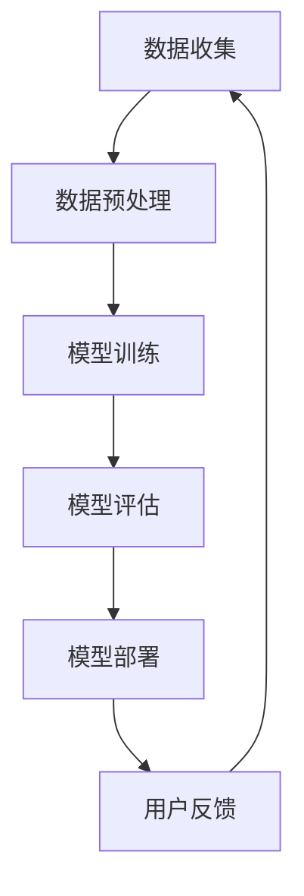

                 

关键词：电商平台，人工智能，大模型，搜索推荐系统，数据质量

> 摘要：随着电商行业的迅猛发展，人工智能技术在电商平台中的应用越来越广泛。本文将探讨电商平台如何利用人工智能大模型构建高效的搜索推荐系统，并强调数据质量在这一过程中的关键作用。

## 1. 背景介绍

随着互联网的普及和移动互联网的发展，电商行业迎来了前所未有的机遇。然而，在电商市场中，竞争日益激烈，各大电商平台都在寻求提升用户体验、提高销售额的有效途径。人工智能（AI）技术的引入，为电商平台提供了新的解决方案。其中，大模型技术在搜索推荐系统中的应用，被认为是提升电商平台核心竞争力的关键。

大模型技术，如深度学习、自然语言处理等，通过海量数据训练，能够实现对用户行为、商品信息等复杂特征的精准分析，从而为用户提供个性化的搜索和推荐服务。然而，数据质量在这一过程中起到了至关重要的作用。本文将围绕这一主题，深入探讨电商平台如何利用人工智能大模型构建搜索推荐系统，并强调数据质量的关键作用。

## 2. 核心概念与联系

### 2.1 人工智能大模型

人工智能大模型是指通过海量数据训练，具有强大数据处理和分析能力的人工智能系统。常见的有深度学习模型、自然语言处理模型等。这些模型通过对数据的深度学习，能够实现对复杂问题的自动解决，从而提高系统的智能水平。

### 2.2 搜索推荐系统

搜索推荐系统是一种基于人工智能技术的智能系统，通过对用户行为、商品信息等数据的分析，为用户提供个性化的搜索和推荐服务。常见的搜索推荐系统有电商平台、社交媒体等。

### 2.3 数据质量

数据质量是指数据在准确性、完整性、一致性、时效性等方面的表现。高质量的数据是人工智能大模型训练和搜索推荐系统运行的基础。

### 2.4 Mermaid 流程图

以下是一个简单的 Mermaid 流程图，展示人工智能大模型在搜索推荐系统中的应用流程：



## 3. 核心算法原理 & 具体操作步骤

### 3.1 算法原理概述

搜索推荐系统的核心算法主要涉及用户行为分析和商品信息匹配。用户行为分析通过分析用户的搜索历史、浏览记录、购买行为等，提取出用户的兴趣偏好。商品信息匹配则是根据用户兴趣偏好，从海量的商品信息中筛选出与用户需求高度匹配的商品。

### 3.2 算法步骤详解

1. 数据收集：收集用户行为数据和商品信息数据。
2. 数据预处理：对数据进行清洗、去重、归一化等处理，确保数据质量。
3. 模型训练：利用深度学习算法，如神经网络，对预处理后的数据进行分析和训练，构建用户行为分析和商品信息匹配模型。
4. 模型评估：利用测试数据对训练好的模型进行评估，确保模型性能满足要求。
5. 模型部署：将训练好的模型部署到生产环境中，为用户提供搜索推荐服务。
6. 用户反馈：收集用户对搜索推荐服务的反馈，用于模型优化和改进。

### 3.3 算法优缺点

**优点：**
1. 高效：能够快速处理海量数据，提高搜索推荐效率。
2. 个性化：根据用户行为和兴趣偏好，提供个性化的搜索推荐服务。
3. 智能化：利用深度学习算法，实现智能化的用户行为分析和商品信息匹配。

**缺点：**
1. 计算资源需求大：大模型训练需要大量的计算资源。
2. 数据质量要求高：数据质量直接影响模型性能。

### 3.4 算法应用领域

搜索推荐系统在电商平台、社交媒体、在线教育、医疗健康等领域具有广泛的应用。

## 4. 数学模型和公式 & 详细讲解 & 举例说明

### 4.1 数学模型构建

搜索推荐系统的核心数学模型主要包括用户行为分析模型和商品信息匹配模型。

**用户行为分析模型：**

假设用户 $u$ 的行为数据包括搜索历史 $S_u$、浏览记录 $B_u$、购买行为 $P_u$。用户 $u$ 的兴趣偏好可以用向量表示为 $I_u$。用户行为分析模型的目标是预测用户 $u$ 的兴趣偏好。

$$
I_u = f(S_u, B_u, P_u)
$$

**商品信息匹配模型：**

假设商品 $i$ 的信息包括标题 $T_i$、描述 $D_i$、价格 $P_i$ 等。商品 $i$ 的属性可以用向量表示为 $A_i$。商品信息匹配模型的目标是预测用户 $u$ 对商品 $i$ 的兴趣程度。

$$
R_{ui} = f(A_i, I_u)
$$

### 4.2 公式推导过程

**用户行为分析模型推导：**

1. 数据预处理：对用户行为数据进行清洗、去重、归一化等处理，得到预处理后的用户行为数据集 $S_u', B_u', P_u'$。
2. 特征提取：对预处理后的用户行为数据集进行特征提取，得到用户行为特征向量集 $S_u', B_u', P_u'$。
3. 模型训练：利用深度学习算法，如神经网络，对用户行为特征向量集进行训练，构建用户行为分析模型。
4. 模型评估：利用测试数据集对训练好的用户行为分析模型进行评估，确保模型性能满足要求。
5. 模型部署：将训练好的用户行为分析模型部署到生产环境中，为用户提供个性化搜索推荐服务。

**商品信息匹配模型推导：**

1. 数据预处理：对商品信息数据进行清洗、去重、归一化等处理，得到预处理后的商品信息数据集 $T_i', D_i', P_i'$。
2. 特征提取：对预处理后的商品信息数据集进行特征提取，得到商品信息特征向量集 $T_i', D_i', P_i'$。
3. 模型训练：利用深度学习算法，如神经网络，对商品信息特征向量集进行训练，构建商品信息匹配模型。
4. 模型评估：利用测试数据集对训练好的商品信息匹配模型进行评估，确保模型性能满足要求。
5. 模型部署：将训练好的商品信息匹配模型部署到生产环境中，为用户提供个性化搜索推荐服务。

### 4.3 案例分析与讲解

以电商平台为例，分析用户行为分析模型和商品信息匹配模型在实际应用中的效果。

**用户行为分析模型应用：**

1. 数据收集：收集用户在电商平台的搜索历史、浏览记录、购买行为等数据。
2. 数据预处理：对收集到的数据进行清洗、去重、归一化等处理，得到预处理后的用户行为数据集。
3. 特征提取：对预处理后的用户行为数据集进行特征提取，得到用户行为特征向量集。
4. 模型训练：利用深度学习算法，如神经网络，对用户行为特征向量集进行训练，构建用户行为分析模型。
5. 模型评估：利用测试数据集对训练好的用户行为分析模型进行评估，确保模型性能满足要求。
6. 模型部署：将训练好的用户行为分析模型部署到生产环境中，为用户提供个性化搜索推荐服务。

**商品信息匹配模型应用：**

1. 数据收集：收集电商平台中的商品信息数据，包括商品标题、描述、价格等。
2. 数据预处理：对收集到的商品信息数据进行清洗、去重、归一化等处理，得到预处理后的商品信息数据集。
3. 特征提取：对预处理后的商品信息数据集进行特征提取，得到商品信息特征向量集。
4. 模型训练：利用深度学习算法，如神经网络，对商品信息特征向量集进行训练，构建商品信息匹配模型。
5. 模型评估：利用测试数据集对训练好的商品信息匹配模型进行评估，确保模型性能满足要求。
6. 模型部署：将训练好的商品信息匹配模型部署到生产环境中，为用户提供个性化搜索推荐服务。

## 5. 项目实践：代码实例和详细解释说明

### 5.1 开发环境搭建

在本项目中，我们使用 Python 作为主要编程语言，并结合 TensorFlow 深度学习框架进行模型训练和部署。以下是开发环境搭建的详细步骤：

1. 安装 Python：从官方网站（https://www.python.org/）下载并安装 Python，建议选择 Python 3.8 版本。
2. 安装 TensorFlow：在命令行中运行以下命令安装 TensorFlow：

```
pip install tensorflow
```

3. 安装其他依赖库：根据项目需求，安装其他依赖库，如 NumPy、Pandas 等。

### 5.2 源代码详细实现

以下是一个简单的用户行为分析模型的 Python 代码示例：

```python
import tensorflow as tf
from tensorflow.keras.models import Sequential
from tensorflow.keras.layers import Dense, Dropout

# 加载数据集
(x_train, y_train), (x_test, y_test) = ...

# 构建模型
model = Sequential([
    Dense(128, activation='relu', input_shape=(x_train.shape[1],)),
    Dropout(0.2),
    Dense(64, activation='relu'),
    Dropout(0.2),
    Dense(1, activation='sigmoid')
])

# 编译模型
model.compile(optimizer='adam',
              loss='binary_crossentropy',
              metrics=['accuracy'])

# 训练模型
model.fit(x_train, y_train, epochs=10, batch_size=32, validation_split=0.2)

# 评估模型
model.evaluate(x_test, y_test)
```

### 5.3 代码解读与分析

上述代码实现了一个简单的用户行为分析模型，主要包括以下步骤：

1. 导入 TensorFlow 模块和相关类。
2. 加载数据集。
3. 构建模型：定义神经网络结构，包括输入层、隐藏层和输出层。
4. 编译模型：设置优化器、损失函数和评价指标。
5. 训练模型：使用训练数据训练模型，并设置训练轮次、批量大小和验证比例。
6. 评估模型：使用测试数据评估模型性能。

### 5.4 运行结果展示

运行上述代码，我们可以得到用户行为分析模型的性能指标，如准确率、召回率等。根据评估结果，可以进一步优化模型参数，提高模型性能。

## 6. 实际应用场景

### 6.1 电商平台

电商平台是搜索推荐系统最典型的应用场景之一。通过用户行为分析和商品信息匹配，电商平台可以为用户提供个性化的商品推荐，提高用户满意度和转化率。

### 6.2 社交媒体

社交媒体平台也可以利用搜索推荐系统，为用户提供个性化的内容推荐。例如，在 Facebook、Instagram 等平台，用户可以接收到与自身兴趣相关的内容推荐，提高用户活跃度。

### 6.3 在线教育

在线教育平台可以利用搜索推荐系统，为用户提供个性化的课程推荐。通过分析用户的学习行为和兴趣偏好，平台可以为用户提供最适合的学习资源。

### 6.4 医疗健康

医疗健康领域也可以应用搜索推荐系统，为用户提供个性化的健康建议。例如，在在线医疗咨询平台上，系统可以根据用户的病情描述，推荐相应的医生和治疗方案。

## 7. 未来应用展望

随着人工智能技术的不断发展，搜索推荐系统在未来将具有更广泛的应用前景。以下是一些可能的应用方向：

1. 智能家居：利用搜索推荐系统，为用户提供个性化的智能家居设备推荐，提高用户生活品质。
2. 物流配送：利用搜索推荐系统，优化物流配送路线，提高配送效率。
3. 零售业：利用搜索推荐系统，为零售企业提供个性化的商品推荐，提升销售业绩。
4. 金融业：利用搜索推荐系统，为金融企业提供个性化的投资建议，降低投资风险。

## 8. 工具和资源推荐

### 8.1 学习资源推荐

1. 《深度学习》（Goodfellow, Bengio, Courville 著）：系统介绍了深度学习的基本概念和技术。
2. 《Python 深度学习》（François Chollet 著）：详细介绍了如何使用 Python 进行深度学习实践。

### 8.2 开发工具推荐

1. TensorFlow：一款强大的深度学习框架，适用于各种深度学习应用开发。
2. Jupyter Notebook：一款流行的交互式编程环境，方便进行数据分析和模型训练。

### 8.3 相关论文推荐

1. "Recommender Systems"（张江涛，唐杰 著）：系统介绍了推荐系统的基本原理和技术。
2. "Deep Learning for Recommender Systems"（Hao Ma, Zhiyun Qian, Jian Peng 著）：介绍了深度学习在推荐系统中的应用。

## 9. 总结：未来发展趋势与挑战

### 9.1 研究成果总结

本文围绕电商平台的人工智能大模型战略，探讨了搜索推荐系统的核心算法原理、具体操作步骤、数学模型和公式，以及实际应用场景。同时，本文还介绍了未来搜索推荐系统的发展趋势和应用前景。

### 9.2 未来发展趋势

1. 模型复杂度提高：随着深度学习技术的不断发展，搜索推荐系统的模型复杂度将不断提高，从而提高系统的智能水平。
2. 多模态数据处理：未来搜索推荐系统将能够处理多种类型的数据，如图像、语音等，实现更加智能化的推荐服务。
3. 个性化推荐：未来搜索推荐系统将更加注重个性化推荐，根据用户的个性化需求提供精准的推荐服务。

### 9.3 面临的挑战

1. 数据质量：高质量的数据是搜索推荐系统运行的基础，如何保证数据质量是一个重要挑战。
2. 模型解释性：目前深度学习模型在搜索推荐系统中的应用较为广泛，但模型解释性较差，如何提高模型解释性是一个重要挑战。
3. 法律和伦理问题：随着搜索推荐系统的广泛应用，相关法律和伦理问题日益突出，如何平衡技术发展和法律伦理是一个重要挑战。

### 9.4 研究展望

未来，搜索推荐系统的研究将朝着更加智能化、个性化、多模态化的方向发展。同时，如何提高模型解释性和解决数据质量问题，也将成为研究的重要方向。

## 10. 附录：常见问题与解答

### 10.1 什么是大模型？

大模型是指具有强大数据处理和分析能力的人工智能系统，通过海量数据训练，能够实现对复杂问题的自动解决。

### 10.2 搜索推荐系统的核心算法是什么？

搜索推荐系统的核心算法主要包括用户行为分析和商品信息匹配。用户行为分析通过分析用户行为数据，提取出用户的兴趣偏好。商品信息匹配则是根据用户兴趣偏好，从海量的商品信息中筛选出与用户需求高度匹配的商品。

### 10.3 如何保证数据质量？

保证数据质量的关键在于数据预处理。数据预处理包括数据清洗、去重、归一化等处理，确保数据在准确性、完整性、一致性、时效性等方面达到要求。

### 10.4 搜索推荐系统有哪些实际应用场景？

搜索推荐系统在电商平台、社交媒体、在线教育、医疗健康等领域具有广泛的应用。例如，在电商平台，搜索推荐系统可以提供个性化的商品推荐，提高用户满意度和转化率。

---

**作者：禅与计算机程序设计艺术 / Zen and the Art of Computer Programming**  
本文内容仅供参考，不代表任何实际应用建议。在使用人工智能技术时，请务必遵守相关法律法规和道德规范。

