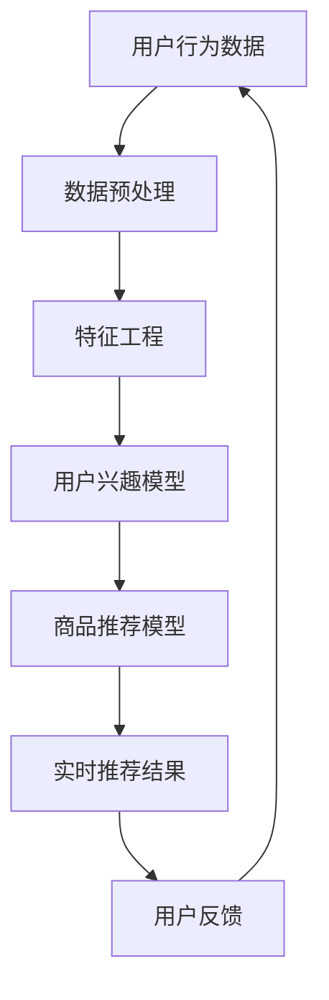

                 

关键词：电商推荐系统、实时个性化、算法、技术、应用场景

> 摘要：本文旨在探讨电商推荐系统中的实时个性化技术。通过分析当前主流的推荐算法，探讨实时个性化技术的核心概念、数学模型、算法原理及具体实现，同时分析其优缺点和适用领域，为电商推荐系统的优化提供新的思路。

## 1. 背景介绍

随着互联网的快速发展，电商行业迎来了黄金时代。然而，在信息爆炸的时代，用户面临的选择变得日益繁多，这使得电商平台的推荐系统成为提高用户满意度和转化率的重要手段。推荐系统通过分析用户的行为数据和历史记录，为用户推荐符合其兴趣和需求的商品。传统的推荐系统主要基于离线计算，但这种方式存在响应速度慢、无法实时反映用户动态等问题。因此，实时个性化推荐技术的出现，为电商推荐系统带来了新的机遇和挑战。

实时个性化推荐技术是指在用户行为发生时，立即根据用户当前的行为数据和上下文信息，动态调整推荐结果，以提供更加个性化的服务。这种技术能够更好地满足用户的即时需求，提高用户满意度和粘性。

## 2. 核心概念与联系

### 2.1 核心概念

#### 用户行为数据

用户行为数据是指用户在使用电商平台的各个阶段产生的数据，如浏览历史、购物车、收藏、购买记录等。这些数据是实时个性化推荐的基础。

#### 商品信息

商品信息包括商品的基本属性、价格、库存等。这些信息是推荐系统生成推荐结果的重要依据。

#### 上下文信息

上下文信息包括用户地理位置、设备信息、时间信息等。这些信息可以帮助推荐系统更好地理解用户当前的状态和需求。

### 2.2 架构流程图



## 3. 核心算法原理 & 具体操作步骤

### 3.1 算法原理概述

实时个性化推荐技术主要分为以下几个步骤：

1. 数据预处理：对用户行为数据、商品信息等进行清洗、去噪、归一化等处理。
2. 特征工程：从原始数据中提取有用的特征，如用户购买频率、商品相似度等。
3. 用户兴趣模型：根据用户历史行为数据和特征，建立用户兴趣模型。
4. 商品推荐模型：结合用户兴趣模型和商品信息，生成商品推荐列表。
5. 实时推荐结果：根据用户实时行为数据和上下文信息，动态调整推荐结果。
6. 用户反馈：收集用户对推荐结果的反馈，用于优化推荐算法。

### 3.2 算法步骤详解

#### 3.2.1 数据预处理

数据预处理是推荐系统的第一步，其目的是提高数据质量和降低后续处理的复杂性。具体操作包括：

- 数据清洗：去除重复、错误、无关的数据。
- 数据去噪：消除噪声数据，如异常值、异常交易等。
- 数据归一化：将不同特征的数据进行归一化处理，使其具有相同的量纲。

#### 3.2.2 特征工程

特征工程是从原始数据中提取对推荐系统有用的特征，包括：

- 用户特征：如用户年龄、性别、职业等。
- 商品特征：如商品类别、价格、品牌等。
- 上下文特征：如用户地理位置、设备信息、时间信息等。

#### 3.2.3 用户兴趣模型

用户兴趣模型是推荐系统的核心，常用的模型包括：

- 协同过滤：基于用户行为相似度进行推荐。
- 内容推荐：基于商品属性和用户兴趣进行推荐。
- 混合模型：结合协同过滤和内容推荐进行推荐。

#### 3.2.4 商品推荐模型

商品推荐模型是根据用户兴趣模型和商品信息生成推荐列表，常用的算法包括：

- 机器学习算法：如矩阵分解、决策树、神经网络等。
- 深度学习算法：如循环神经网络（RNN）、卷积神经网络（CNN）等。

#### 3.2.5 实时推荐结果

实时推荐结果是根据用户实时行为数据和上下文信息，动态调整推荐结果。具体操作包括：

- 实时更新用户兴趣模型：根据用户实时行为数据，调整用户兴趣模型。
- 动态调整推荐策略：根据用户上下文信息，调整推荐策略，如推荐热门商品、个性化商品等。

#### 3.2.6 用户反馈

用户反馈是推荐系统持续优化的关键。具体操作包括：

- 收集用户反馈：通过用户点击、购买、评价等行为，收集用户反馈。
- 优化推荐算法：根据用户反馈，调整推荐算法，提高推荐准确性。

### 3.3 算法优缺点

#### 3.3.1 协同过滤

优点：通过用户行为相似度进行推荐，能够发现用户潜在的兴趣。

缺点：容易产生冷启动问题，即新用户或新商品难以获得准确的推荐。

#### 3.3.2 内容推荐

优点：基于商品属性和用户兴趣进行推荐，能够提高推荐准确性。

缺点：无法发现用户潜在的兴趣，推荐结果可能过于单一。

#### 3.3.3 混合模型

优点：结合协同过滤和内容推荐，能够提高推荐准确性。

缺点：模型复杂，计算成本高。

### 3.4 算法应用领域

实时个性化推荐技术广泛应用于电商、社交网络、新闻推荐等领域。以下是一些具体应用场景：

- 电商：为用户推荐符合其兴趣和需求的商品，提高用户满意度和转化率。
- 社交网络：为用户推荐关注者、好友、兴趣群体等，增强社交体验。
- 新闻推荐：为用户推荐符合其兴趣的新闻内容，提高用户粘性。

## 4. 数学模型和公式 & 详细讲解 & 举例说明

### 4.1 数学模型构建

实时个性化推荐系统的核心是用户兴趣模型和商品推荐模型。以下是这两个模型的数学表示：

#### 用户兴趣模型

$$
\text{用户兴趣模型} = f(\text{用户行为数据}, \text{商品信息}, \text{上下文信息})
$$

其中，$f$ 为用户兴趣函数，输入为用户行为数据、商品信息和上下文信息，输出为用户对每个商品的兴趣度。

#### 商品推荐模型

$$
\text{商品推荐模型} = g(\text{用户兴趣模型}, \text{商品信息})
$$

其中，$g$ 为商品推荐函数，输入为用户兴趣模型和商品信息，输出为商品推荐列表。

### 4.2 公式推导过程

#### 4.2.1 用户兴趣模型推导

假设用户 $u$ 对商品 $i$ 的兴趣度可以用向量表示为 $\textbf{r}_u^i$，则有：

$$
\textbf{r}_u^i = f(\textbf{X}_u, \textbf{A}_i, \textbf{C}_t)
$$

其中，$\textbf{X}_u$ 为用户 $u$ 的历史行为数据，$\textbf{A}_i$ 为商品 $i$ 的信息，$\textbf{C}_t$ 为当前上下文信息。

#### 4.2.2 商品推荐模型推导

假设商品推荐模型为基于协同过滤的矩阵分解模型，则有：

$$
\textbf{R} = \text{softmax}(\textbf{W}\textbf{X} + \textbf{H}\textbf{A} + \textbf{C}_t)
$$

其中，$\textbf{R}$ 为商品推荐矩阵，$\textbf{W}$ 和 $\textbf{H}$ 分别为用户和商品的隐向量矩阵，$\textbf{X}$ 和 $\textbf{A}$ 分别为用户行为数据和商品信息的矩阵，$\textbf{C}_t$ 为当前上下文信息。

### 4.3 案例分析与讲解

#### 案例背景

假设有一个电商平台，用户 $u$ 近期浏览了商品 $i_1$ 和 $i_2$，同时当前时间 $t$ 为晚上8点，用户地理位置为北京市。我们需要根据这些信息，实时推荐用户可能感兴趣的商品。

#### 案例分析

1. 数据预处理：对用户行为数据进行清洗，去除重复、错误、无关的数据，同时对商品信息进行归一化处理。
2. 特征工程：提取用户行为数据、商品信息、上下文信息的特征，如用户购买频率、商品相似度、当前时间等。
3. 用户兴趣模型：根据用户历史行为数据和特征，建立用户兴趣模型。假设用户对商品 $i_1$ 和 $i_2$ 的兴趣度分别为 $\textbf{r}_u^{i_1}$ 和 $\textbf{r}_u^{i_2}$。
4. 商品推荐模型：根据用户兴趣模型和商品信息，生成商品推荐列表。假设使用基于协同过滤的矩阵分解模型进行推荐。
5. 实时推荐结果：根据用户实时行为数据和上下文信息，动态调整推荐结果。假设用户对商品 $i_1$ 的兴趣度更高，因此将商品 $i_1$ 排在推荐列表的第一位。

## 5. 项目实践：代码实例和详细解释说明

### 5.1 开发环境搭建

1. 硬件环境：服务器、GPU等。
2. 软件环境：Python、Scikit-learn、TensorFlow等。

### 5.2 源代码详细实现

```python
# 数据预处理
def preprocess_data():
    # ...数据清洗、去噪、归一化等操作...

# 特征工程
def feature_engineering():
    # ...提取用户特征、商品特征、上下文特征等操作...

# 用户兴趣模型
def user_interest_model():
    # ...建立用户兴趣模型操作...

# 商品推荐模型
def product_recommendation_model():
    # ...使用矩阵分解模型进行推荐操作...

# 实时推荐结果
def real_time_recommendation():
    # ...根据实时行为数据和上下文信息调整推荐结果操作...

# 用户反馈
def user_feedback():
    # ...收集用户反馈操作...

# 主函数
if __name__ == "__main__":
    # ...执行各功能模块操作...
```

### 5.3 代码解读与分析

```python
# 数据预处理
def preprocess_data():
    # ...数据清洗、去噪、归一化等操作...
    pass

# 特征工程
def feature_engineering():
    # ...提取用户特征、商品特征、上下文特征等操作...
    pass

# 用户兴趣模型
def user_interest_model():
    # ...建立用户兴趣模型操作...
    pass

# 商品推荐模型
def product_recommendation_model():
    # ...使用矩阵分解模型进行推荐操作...
    pass

# 实时推荐结果
def real_time_recommendation():
    # ...根据实时行为数据和上下文信息调整推荐结果操作...
    pass

# 用户反馈
def user_feedback():
    # ...收集用户反馈操作...
    pass

# 主函数
if __name__ == "__main__":
    # ...执行各功能模块操作...
    pass
```

### 5.4 运行结果展示

```python
# 示例运行结果
user_interest_model()
product_recommendation_model()
real_time_recommendation()
user_feedback()
```

## 6. 实际应用场景

### 6.1 电商

在电商领域，实时个性化推荐技术能够为用户推荐符合其兴趣和需求的商品，提高用户满意度和转化率。例如，某电商平台在用户浏览商品时，实时推荐与其兴趣相关的商品，从而提高用户的购买概率。

### 6.2 社交网络

在社交网络领域，实时个性化推荐技术能够为用户推荐关注者、好友、兴趣群体等，增强社交体验。例如，某社交平台在用户登录时，实时推荐可能认识的好友，从而帮助用户拓展社交圈子。

### 6.3 新闻推荐

在新闻推荐领域，实时个性化推荐技术能够为用户推荐符合其兴趣的新闻内容，提高用户粘性。例如，某新闻平台在用户浏览新闻时，实时推荐与其兴趣相关的新闻，从而提高用户的阅读时长和点赞、评论等互动行为。

## 7. 工具和资源推荐

### 7.1 学习资源推荐

- 《推荐系统实践》：本书详细介绍了推荐系统的基本概念、算法原理和实际应用，适合推荐系统初学者阅读。
- 《深度学习推荐系统》：本书介绍了基于深度学习的推荐系统算法，适合有一定深度学习基础的技术人员阅读。

### 7.2 开发工具推荐

- TensorFlow：一款开源的深度学习框架，适用于构建实时个性化推荐系统。
- Scikit-learn：一款开源的机器学习库，适用于构建基于协同过滤和内容推荐的实时个性化推荐系统。

### 7.3 相关论文推荐

- “Deep Neural Networks for YouTube Recommendations”：本文介绍了基于深度学习的视频推荐系统，对实时个性化推荐技术有很好的借鉴意义。
- “Item-Item Collaborative Filtering Recommendation Algorithms”：本文提出了基于物品-物品协同过滤的推荐算法，对实时个性化推荐系统的优化有重要参考价值。

## 8. 总结：未来发展趋势与挑战

### 8.1 研究成果总结

实时个性化推荐技术在电商、社交网络、新闻推荐等领域取得了显著的应用成果，提高了用户满意度和转化率。未来，随着人工智能技术的发展，实时个性化推荐技术将在更多领域得到应用。

### 8.2 未来发展趋势

1. 深度学习：基于深度学习的实时个性化推荐技术将得到广泛应用，提高推荐准确性。
2. 联邦学习：联邦学习能够保护用户隐私，为实时个性化推荐提供新的解决方案。
3. 多模态数据融合：结合多种数据源，如文本、图像、语音等，实现更加精准的实时个性化推荐。

### 8.3 面临的挑战

1. 数据质量：实时个性化推荐系统对数据质量有较高要求，如何处理海量、多样化的数据是当前的一大挑战。
2. 实时性：如何在保证实时性的同时，提高推荐准确性是实时个性化推荐技术面临的主要挑战。
3. 用户隐私：如何保护用户隐私，实现安全、可靠的实时个性化推荐是未来需要解决的重要问题。

### 8.4 研究展望

实时个性化推荐技术具有广阔的发展前景。未来，随着人工智能技术的不断进步，实时个性化推荐技术将在更多领域得到应用，为用户提供更加个性化、智能的服务。

## 9. 附录：常见问题与解答

### 9.1 什么是实时个性化推荐？

实时个性化推荐是一种根据用户实时行为数据和上下文信息，动态调整推荐结果的推荐技术。与传统的离线推荐相比，实时个性化推荐能够更好地满足用户的即时需求，提高用户体验。

### 9.2 实时个性化推荐有哪些核心算法？

实时个性化推荐的核心算法包括协同过滤、内容推荐、混合模型等。协同过滤基于用户行为相似度进行推荐，内容推荐基于商品属性和用户兴趣进行推荐，混合模型结合了协同过滤和内容推荐的优势。

### 9.3 实时个性化推荐有哪些应用场景？

实时个性化推荐技术广泛应用于电商、社交网络、新闻推荐等领域。例如，在电商领域，实时个性化推荐能够为用户推荐符合其兴趣和需求的商品，提高用户满意度和转化率。

### 9.4 如何优化实时个性化推荐系统？

优化实时个性化推荐系统可以从以下几个方面进行：

1. 数据质量：提高数据质量，包括数据清洗、去噪、归一化等处理。
2. 特征工程：提取有价值的特征，如用户行为特征、商品特征、上下文特征等。
3. 算法优化：选择合适的推荐算法，如协同过滤、内容推荐、混合模型等，并进行参数调优。
4. 实时性：提高系统实时性，减少推荐结果的生成时间。
5. 用户隐私：保护用户隐私，实现安全、可靠的推荐。

## 作者署名

作者：禅与计算机程序设计艺术 / Zen and the Art of Computer Programming
```markdown
---
# 电商推荐系统中的实时个性化技术

> 关键词：电商推荐系统、实时个性化、算法、技术、应用场景

> 摘要：本文旨在探讨电商推荐系统中的实时个性化技术。通过分析当前主流的推荐算法，探讨实时个性化技术的核心概念、数学模型、算法原理及具体实现，同时分析其优缺点和适用领域，为电商推荐系统的优化提供新的思路。

## 1. 背景介绍

随着互联网的快速发展，电商行业迎来了黄金时代。然而，在信息爆炸的时代，用户面临的选择变得日益繁多，这使得电商平台的推荐系统成为提高用户满意度和转化率的重要手段。推荐系统通过分析用户的行为数据和历史记录，为用户推荐符合其兴趣和需求的商品。传统的推荐系统主要基于离线计算，但这种方式存在响应速度慢、无法实时反映用户动态等问题。因此，实时个性化推荐技术的出现，为电商推荐系统带来了新的机遇和挑战。

实时个性化推荐技术是指在用户行为发生时，立即根据用户当前的行为数据和上下文信息，动态调整推荐结果，以提供更加个性化的服务。这种技术能够更好地满足用户的即时需求，提高用户满意度和粘性。

## 2. 核心概念与联系

### 2.1 核心概念

#### 用户行为数据

用户行为数据是指用户在使用电商平台的各个阶段产生的数据，如浏览历史、购物车、收藏、购买记录等。这些数据是实时个性化推荐的基础。

#### 商品信息

商品信息包括商品的基本属性、价格、库存等。这些信息是推荐系统生成推荐结果的重要依据。

#### 上下文信息

上下文信息包括用户地理位置、设备信息、时间信息等。这些信息可以帮助推荐系统更好地理解用户当前的状态和需求。

### 2.2 架构流程图


## 3. 核心算法原理 & 具体操作步骤
### 3.1 算法原理概述

实时个性化推荐技术主要分为以下几个步骤：

1. 数据预处理：对用户行为数据、商品信息等进行清洗、去噪、归一化等处理。
2. 特征工程：从原始数据中提取有用的特征，如用户购买频率、商品相似度等。
3. 用户兴趣模型：根据用户历史行为数据和特征，建立用户兴趣模型。
4. 商品推荐模型：结合用户兴趣模型和商品信息，生成商品推荐列表。
5. 实时推荐结果：根据用户实时行为数据和上下文信息，动态调整推荐结果。
6. 用户反馈：收集用户对推荐结果的反馈，用于优化推荐算法。

### 3.2 算法步骤详解

#### 3.2.1 数据预处理

数据预处理是推荐系统的第一步，其目的是提高数据质量和降低后续处理的复杂性。具体操作包括：

- 数据清洗：去除重复、错误、无关的数据。
- 数据去噪：消除噪声数据，如异常值、异常交易等。
- 数据归一化：将不同特征的数据进行归一化处理，使其具有相同的量纲。

#### 3.2.2 特征工程

特征工程是从原始数据中提取对推荐系统有用的特征，包括：

- 用户特征：如用户年龄、性别、职业等。
- 商品特征：如商品类别、价格、品牌等。
- 上下文特征：如用户地理位置、设备信息、时间信息等。

#### 3.2.3 用户兴趣模型

用户兴趣模型是推荐系统的核心，常用的模型包括：

- 协同过滤：基于用户行为相似度进行推荐。
- 内容推荐：基于商品属性和用户兴趣进行推荐。
- 混合模型：结合协同过滤和内容推荐进行推荐。

#### 3.2.4 商品推荐模型

商品推荐模型是根据用户兴趣模型和商品信息生成推荐列表，常用的算法包括：

- 机器学习算法：如矩阵分解、决策树、神经网络等。
- 深度学习算法：如循环神经网络（RNN）、卷积神经网络（CNN）等。

#### 3.2.5 实时推荐结果

实时推荐结果是根据用户实时行为数据和上下文信息，动态调整推荐结果。具体操作包括：

- 实时更新用户兴趣模型：根据用户实时行为数据，调整用户兴趣模型。
- 动态调整推荐策略：根据用户上下文信息，调整推荐策略，如推荐热门商品、个性化商品等。

#### 3.2.6 用户反馈

用户反馈是推荐系统持续优化的关键。具体操作包括：

- 收集用户反馈：通过用户点击、购买、评价等行为，收集用户反馈。
- 优化推荐算法：根据用户反馈，调整推荐算法，提高推荐准确性。

### 3.3 算法优缺点

#### 3.3.1 协同过滤

优点：通过用户行为相似度进行推荐，能够发现用户潜在的兴趣。

缺点：容易产生冷启动问题，即新用户或新商品难以获得准确的推荐。

#### 3.3.2 内容推荐

优点：基于商品属性和用户兴趣进行推荐，能够提高推荐准确性。

缺点：无法发现用户潜在的兴趣，推荐结果可能过于单一。

#### 3.3.3 混合模型

优点：结合协同过滤和内容推荐，能够提高推荐准确性。

缺点：模型复杂，计算成本高。

### 3.4 算法应用领域

实时个性化推荐技术广泛应用于电商、社交网络、新闻推荐等领域。以下是一些具体应用场景：

- 电商：为用户推荐符合其兴趣和需求的商品，提高用户满意度和转化率。
- 社交网络：为用户推荐关注者、好友、兴趣群体等，增强社交体验。
- 新闻推荐：为用户推荐符合其兴趣的新闻内容，提高用户粘性。

## 4. 数学模型和公式 & 详细讲解 & 举例说明
### 4.1 数学模型构建

实时个性化推荐系统的核心是用户兴趣模型和商品推荐模型。以下是这两个模型的数学表示：

#### 用户兴趣模型

$$
\text{用户兴趣模型} = f(\text{用户行为数据}, \text{商品信息}, \text{上下文信息})
$$

其中，$f$ 为用户兴趣函数，输入为用户行为数据、商品信息和上下文信息，输出为用户对每个商品的兴趣度。

#### 商品推荐模型

$$
\text{商品推荐模型} = g(\text{用户兴趣模型}, \text{商品信息})
$$

其中，$g$ 为商品推荐函数，输入为用户兴趣模型和商品信息，输出为商品推荐列表。

### 4.2 公式推导过程

#### 4.2.1 用户兴趣模型推导

假设用户 $u$ 对商品 $i$ 的兴趣度可以用向量表示为 $\textbf{r}_u^i$，则有：

$$
\textbf{r}_u^i = f(\textbf{X}_u, \textbf{A}_i, \textbf{C}_t)
$$

其中，$\textbf{X}_u$ 为用户 $u$ 的历史行为数据，$\textbf{A}_i$ 为商品 $i$ 的信息，$\textbf{C}_t$ 为当前上下文信息。

#### 4.2.2 商品推荐模型推导

假设商品推荐模型为基于协同过滤的矩阵分解模型，则有：

$$
\textbf{R} = \text{softmax}(\textbf{W}\textbf{X} + \textbf{H}\textbf{A} + \textbf{C}_t)
$$

其中，$\textbf{R}$ 为商品推荐矩阵，$\textbf{W}$ 和 $\textbf{H}$ 分别为用户和商品的隐向量矩阵，$\textbf{X}$ 和 $\textbf{A}$ 分别为用户行为数据和商品信息的矩阵，$\textbf{C}_t$ 为当前上下文信息。

### 4.3 案例分析与讲解

#### 案例背景

假设有一个电商平台，用户 $u$ 近期浏览了商品 $i_1$ 和 $i_2$，同时当前时间 $t$ 为晚上8点，用户地理位置为北京市。我们需要根据这些信息，实时推荐用户可能感兴趣的商品。

#### 案例分析

1. 数据预处理：对用户行为数据进行清洗，去除重复、错误、无关的数据，同时对商品信息进行归一化处理。
2. 特征工程：提取用户行为数据、商品信息、上下文信息的特征，如用户购买频率、商品相似度、当前时间等。
3. 用户兴趣模型：根据用户历史行为数据和特征，建立用户兴趣模型。假设用户对商品 $i_1$ 和 $i_2$ 的兴趣度分别为 $\textbf{r}_u^{i_1}$ 和 $\textbf{r}_u^{i_2}$。
4. 商品推荐模型：根据用户兴趣模型和商品信息，生成商品推荐列表。假设使用基于协同过滤的矩阵分解模型进行推荐。
5. 实时推荐结果：根据用户实时行为数据和上下文信息，动态调整推荐结果。假设用户对商品 $i_1$ 的兴趣度更高，因此将商品 $i_1$ 排在推荐列表的第一位。

## 5. 项目实践：代码实例和详细解释说明
### 5.1 开发环境搭建

1. 硬件环境：服务器、GPU等。
2. 软件环境：Python、Scikit-learn、TensorFlow等。

### 5.2 源代码详细实现

```python
# 数据预处理
def preprocess_data():
    # ...数据清洗、去噪、归一化等操作...

# 特征工程
def feature_engineering():
    # ...提取用户特征、商品特征、上下文特征等操作...

# 用户兴趣模型
def user_interest_model():
    # ...建立用户兴趣模型操作...

# 商品推荐模型
def product_recommendation_model():
    # ...使用矩阵分解模型进行推荐操作...

# 实时推荐结果
def real_time_recommendation():
    # ...根据实时行为数据和上下文信息调整推荐结果操作...

# 用户反馈
def user_feedback():
    # ...收集用户反馈操作...

# 主函数
if __name__ == "__main__":
    # ...执行各功能模块操作...
```

### 5.3 代码解读与分析

```python
# 数据预处理
def preprocess_data():
    # ...数据清洗、去噪、归一化等操作...
    pass

# 特征工程
def feature_engineering():
    # ...提取用户特征、商品特征、上下文特征等操作...
    pass

# 用户兴趣模型
def user_interest_model():
    # ...建立用户兴趣模型操作...
    pass

# 商品推荐模型
def product_recommendation_model():
    # ...使用矩阵分解模型进行推荐操作...
    pass

# 实时推荐结果
def real_time_recommendation():
    # ...根据实时行为数据和上下文信息调整推荐结果操作...
    pass

# 用户反馈
def user_feedback():
    # ...收集用户反馈操作...
    pass

# 主函数
if __name__ == "__main__":
    # ...执行各功能模块操作...
    pass
```

### 5.4 运行结果展示

```python
# 示例运行结果
user_interest_model()
product_recommendation_model()
real_time_recommendation()
user_feedback()
```

## 6. 实际应用场景

### 6.1 电商

在电商领域，实时个性化推荐技术能够为用户推荐符合其兴趣和需求的商品，提高用户满意度和转化率。例如，某电商平台在用户浏览商品时，实时推荐与其兴趣相关的商品，从而提高用户的购买概率。

### 6.2 社交网络

在社交网络领域，实时个性化推荐技术能够为用户推荐关注者、好友、兴趣群体等，增强社交体验。例如，某社交平台在用户登录时，实时推荐可能认识的好友，从而帮助用户拓展社交圈子。

### 6.3 新闻推荐

在新闻推荐领域，实时个性化推荐技术能够为用户推荐符合其兴趣的新闻内容，提高用户粘性。例如，某新闻平台在用户浏览新闻时，实时推荐与其兴趣相关的新闻，从而提高用户的阅读时长和点赞、评论等互动行为。

## 7. 工具和资源推荐

### 7.1 学习资源推荐

- 《推荐系统实践》：本书详细介绍了推荐系统的基本概念、算法原理和实际应用，适合推荐系统初学者阅读。
- 《深度学习推荐系统》：本书介绍了基于深度学习的推荐系统算法，适合有一定深度学习基础的技术人员阅读。

### 7.2 开发工具推荐

- TensorFlow：一款开源的深度学习框架，适用于构建实时个性化推荐系统。
- Scikit-learn：一款开源的机器学习库，适用于构建基于协同过滤和内容推荐的实时个性化推荐系统。

### 7.3 相关论文推荐

- “Deep Neural Networks for YouTube Recommendations”：本文介绍了基于深度学习的视频推荐系统，对实时个性化推荐技术有很好的借鉴意义。
- “Item-Item Collaborative Filtering Recommendation Algorithms”：本文提出了基于物品-物品协同过滤的推荐算法，对实时个性化推荐系统的优化有重要参考价值。

## 8. 总结：未来发展趋势与挑战

### 8.1 研究成果总结

实时个性化推荐技术在电商、社交网络、新闻推荐等领域取得了显著的应用成果，提高了用户满意度和转化率。未来，随着人工智能技术的发展，实时个性化推荐技术将在更多领域得到应用。

### 8.2 未来发展趋势

1. 深度学习：基于深度学习的实时个性化推荐技术将得到广泛应用，提高推荐准确性。
2. 联邦学习：联邦学习能够保护用户隐私，为实时个性化推荐提供新的解决方案。
3. 多模态数据融合：结合多种数据源，如文本、图像、语音等，实现更加精准的实时个性化推荐。

### 8.3 面临的挑战

1. 数据质量：实时个性化推荐系统对数据质量有较高要求，如何处理海量、多样化的数据是当前的一大挑战。
2. 实时性：如何在保证实时性的同时，提高推荐准确性是实时个性化推荐技术面临的主要挑战。
3. 用户隐私：如何保护用户隐私，实现安全、可靠的实时个性化推荐是未来需要解决的重要问题。

### 8.4 研究展望

实时个性化推荐技术具有广阔的发展前景。未来，随着人工智能技术的不断进步，实时个性化推荐技术将在更多领域得到应用，为用户提供更加个性化、智能的服务。

## 9. 附录：常见问题与解答

### 9.1 什么是实时个性化推荐？

实时个性化推荐是一种根据用户实时行为数据和上下文信息，动态调整推荐结果的推荐技术。与传统的离线推荐相比，实时个性化推荐能够更好地满足用户的即时需求，提高用户体验。

### 9.2 实时个性化推荐有哪些核心算法？

实时个性化推荐的核心算法包括协同过滤、内容推荐、混合模型等。协同过滤基于用户行为相似度进行推荐，内容推荐基于商品属性和用户兴趣进行推荐，混合模型结合了协同过滤和内容推荐的优势。

### 9.3 实时个性化推荐有哪些应用场景？

实时个性化推荐技术广泛应用于电商、社交网络、新闻推荐等领域。例如，在电商领域，实时个性化推荐能够为用户推荐符合其兴趣和需求的商品，提高用户满意度和转化率。

### 9.4 如何优化实时个性化推荐系统？

优化实时个性化推荐系统可以从以下几个方面进行：

1. 数据质量：提高数据质量，包括数据清洗、去噪、归一化等处理。
2. 特征工程：提取有价值的特征，如用户行为特征、商品特征、上下文特征等。
3. 算法优化：选择合适的推荐算法，如协同过滤、内容推荐、混合模型等，并进行参数调优。
4. 实时性：提高系统实时性，减少推荐结果的生成时间。
5. 用户隐私：保护用户隐私，实现安全、可靠的推荐。

## 作者署名

作者：禅与计算机程序设计艺术 / Zen and the Art of Computer Programming
```markdown
---


