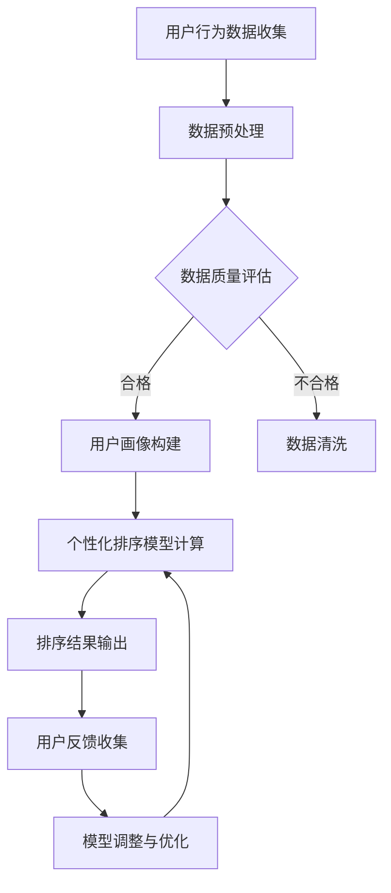
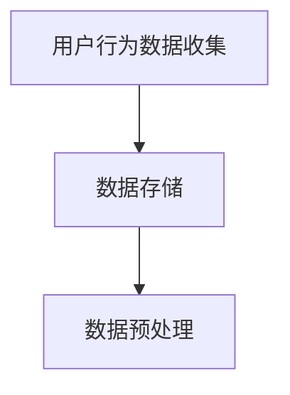
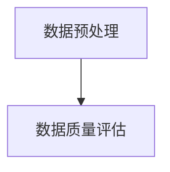
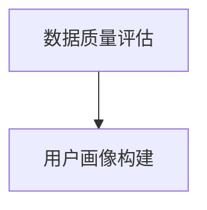
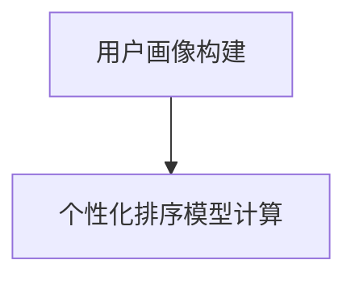
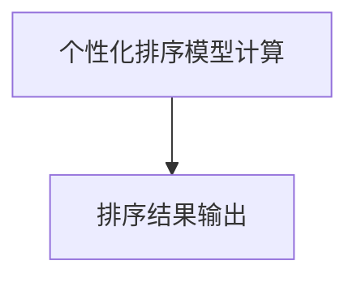
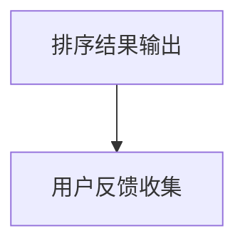
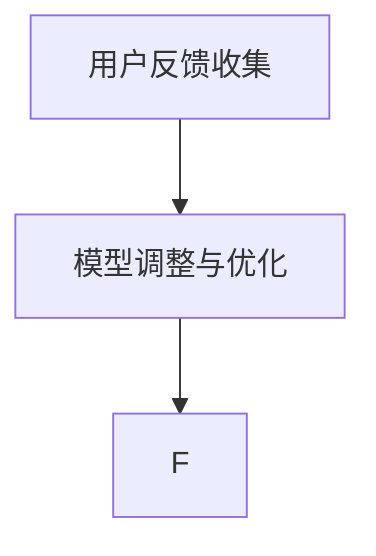

                 

关键词：电商搜索、个性化排序、实时更新、算法、数学模型、项目实践、应用场景、未来展望

> 摘要：本文详细探讨了电商搜索中个性化排序模型实时更新的技术细节，包括核心概念、算法原理、数学模型以及实际应用场景。通过对当前流行算法的深入分析，本文旨在为开发者和研究者提供一套完整的解决方案和实施指南。

## 1. 背景介绍

在电子商务迅速发展的今天，用户对个性化购物体验的需求越来越强烈。电商搜索作为电商平台的核心功能，直接影响到用户的购买决策和平台的经济效益。因此，如何提高搜索结果的准确性、相关性和用户满意度成为电商企业关注的焦点。

个性化排序作为一种智能化的搜索策略，旨在根据用户的兴趣和行为习惯，为每个用户推荐最符合其需求的商品。随着大数据技术和人工智能的不断发展，个性化排序模型在电商搜索中的应用越来越广泛。然而，如何实现个性化排序模型的实时更新，以适应动态变化的用户需求，依然是一个具有挑战性的问题。

本文将围绕电商搜索中的个性化排序模型实时更新展开讨论，首先介绍相关核心概念和理论，然后深入分析算法原理和数学模型，最后通过实际项目实践和案例分析，探讨这一技术的应用前景和挑战。

## 2. 核心概念与联系

### 2.1 个性化排序

个性化排序（Personalized Ranking）是一种基于用户历史行为和兴趣的搜索结果排序方法。其核心思想是通过分析用户的历史数据，如浏览记录、购买行为、搜索关键词等，构建用户画像，并根据这些画像特征为用户推荐最相关的商品。

### 2.2 实时更新

实时更新（Real-time Update）是指在用户行为发生时，系统能够即时调整和优化个性化排序模型，以提供最新的搜索结果。实时更新的重要性在于能够快速响应用户需求的动态变化，提高用户体验和搜索满意度。

### 2.3 Mermaid 流程图

为了更好地展示个性化排序模型实时更新的过程，我们使用 Mermaid 流程图来描述其核心流程。



上述流程图中，A 表示用户行为数据的收集，B 表示数据预处理，C 表示数据质量评估，D 表示用户画像构建，F 表示个性化排序模型计算，G 表示排序结果输出，H 表示用户反馈收集，I 表示模型调整与优化。通过这样一个闭环流程，系统能够实时响应用户需求，不断优化个性化排序模型。

## 3. 核心算法原理 & 具体操作步骤

### 3.1 算法原理概述

个性化排序模型的核心在于如何利用用户行为数据构建用户画像，并通过画像特征计算商品与用户的相似度，从而实现排序。常用的算法包括协同过滤（Collaborative Filtering）、基于内容的推荐（Content-based Recommendation）和混合推荐（Hybrid Recommendation）等。

实时更新则依赖于数据流处理技术，如 Apache Kafka、Apache Flink 等，能够实时捕捉用户行为数据，并将其传递给个性化排序模型进行计算和优化。

### 3.2 算法步骤详解

#### 3.2.1 用户行为数据收集

用户行为数据包括浏览记录、购买行为、搜索关键词等。这些数据可以通过电商平台的后台系统、日志文件等方式进行收集。



#### 3.2.2 数据预处理

数据预处理包括数据清洗、去重、格式转换等步骤，以确保数据的质量和一致性。



#### 3.2.3 用户画像构建

用户画像构建是基于用户行为数据，通过机器学习算法提取用户特征，如用户兴趣、购买倾向等。常见的算法包括聚类分析、关联规则挖掘等。



#### 3.2.4 个性化排序模型计算

个性化排序模型计算是基于用户画像和商品特征，计算商品与用户的相似度，并根据相似度对商品进行排序。常用的算法包括协同过滤、基于内容的推荐等。



#### 3.2.5 排序结果输出

排序结果输出是将计算得到的排序结果返回给用户，实现个性化搜索结果展示。



#### 3.2.6 用户反馈收集

用户反馈收集是通过用户对搜索结果的点击、购买等行为，收集用户反馈数据，用于模型调整与优化。



#### 3.2.7 模型调整与优化

模型调整与优化是根据用户反馈数据，对个性化排序模型进行调整和优化，以提高搜索结果的准确性和用户体验。



### 3.3 算法优缺点

#### 优点

- 提高搜索结果的准确性和相关性。
- 提高用户体验和满意度。
- 能够实时响应用户需求，提供个性化的购物体验。

#### 缺点

- 需要大量的用户行为数据支持，数据质量直接影响模型效果。
- 算法复杂度高，计算资源消耗大。
- 模型调整与优化需要不断迭代，耗时较长。

### 3.4 算法应用领域

个性化排序模型在电商搜索中的应用非常广泛，如商品推荐、广告投放、内容推荐等。通过实时更新个性化排序模型，能够为用户提供更加精准和个性化的服务，提高用户满意度和平台收益。

## 4. 数学模型和公式 & 详细讲解 & 举例说明

### 4.1 数学模型构建

个性化排序模型的数学模型主要涉及用户画像构建和商品相似度计算。

#### 用户画像构建

用户画像构建可以使用基于聚类分析的方法，如K-means算法。给定用户行为数据集D，目标是将用户分为K个簇，每个簇代表一种用户类型。

```latex
\text{目标函数}: \min_{\text{簇分配} \text{和} \text{簇中心}} \sum_{i=1}^{K} \sum_{x_j \in S_i} d(x_j, \mu_i)
```

其中，$d(\cdot, \cdot)$表示欧氏距离，$S_i$表示属于第$i$个簇的用户集合，$\mu_i$表示第$i$个簇的中心。

#### 商品相似度计算

商品相似度计算可以使用基于内容的推荐方法，如余弦相似度。给定用户画像矩阵$U \in \mathbb{R}^{m \times n}$和商品特征矩阵$V \in \mathbb{R}^{m \times n}$，目标是计算商品$i$和$j$的相似度$S_{ij}$。

```latex
S_{ij} = \frac{U_i \cdot V_j}{\|U_i\|\|V_j\|}
```

其中，$\cdot$表示内积，$\|\cdot\|$表示向量范数。

### 4.2 公式推导过程

#### 用户画像构建

以K-means算法为例，给定用户行为数据集$D = \{x_1, x_2, \ldots, x_n\}$，目标是将数据分为$K$个簇，每个簇的中心为$\mu_k$，簇分配为$S = \{S_1, S_2, \ldots, S_K\}$。

1. 初始化簇中心$\mu_k$。
2. 计算每个用户$x_i$与簇中心的距离$d(x_i, \mu_k)$。
3. 根据距离将用户$x_i$分配到最近的簇$S_k$。
4. 更新簇中心$\mu_k$为簇内用户的均值。
5. 重复步骤2-4，直到簇中心不再变化。

#### 商品相似度计算

以余弦相似度为例，给定用户画像矩阵$U \in \mathbb{R}^{m \times n}$和商品特征矩阵$V \in \mathbb{R}^{m \times n}$，目标是计算商品$i$和$j$的相似度$S_{ij}$。

1. 计算用户$i$和$j$的用户画像向量为$U_i$和$U_j$。
2. 计算用户$i$和$j$的用户画像向量的内积$U_i \cdot U_j$。
3. 计算用户$i$和$j$的用户画像向量的范数$\|U_i\|$和$\|U_j\|$。
4. 计算余弦相似度$S_{ij} = \frac{U_i \cdot U_j}{\|U_i\|\|U_j\|$。

### 4.3 案例分析与讲解

#### 案例一：用户画像构建

假设有100个用户，每个用户的浏览记录如下表：

| 用户ID | 商品ID | 浏览次数 |
|--------|--------|----------|
| 1      | 101    | 3        |
| 1      | 102    | 5        |
| 1      | 103    | 2        |
| 2      | 101    | 4        |
| 2      | 102    | 6        |
| 2      | 104    | 3        |
| ...    | ...    | ...      |

使用K-means算法将用户分为两类，簇中心分别为$\mu_1 = (1, 1)$和$\mu_2 = (3, 3)$。

1. 初始化簇中心。
2. 计算每个用户与簇中心的距离。
3. 根据距离将用户分配到最近的簇。
4. 更新簇中心。

经过多次迭代，最终得到两类用户的簇分配和簇中心：

| 用户ID | 簇分配 | 簇中心 |
|--------|--------|--------|
| 1      | 1      | (1, 1) |
| 2      | 2      | (3, 3) |
| ...    | ...    | ...    |

#### 案例二：商品相似度计算

假设有10个商品，每个商品的特征如下表：

| 商品ID | 特征1 | 特征2 | 特征3 |
|--------|------|------|------|
| 101    | 0.5  | 0.3  | 0.2  |
| 102    | 0.6  | 0.4  | 0.1  |
| 103    | 0.4  | 0.2  | 0.3  |
| 104    | 0.7  | 0.5  | 0.1  |
| ...    | ...  | ...  | ...  |

使用余弦相似度计算商品101和102的相似度。

1. 计算用户画像向量$U_1 = (0.5, 0.3, 0.2)$和$U_2 = (0.6, 0.4, 0.1)$。
2. 计算内积$U_1 \cdot U_2 = 0.5 \times 0.6 + 0.3 \times 0.4 + 0.2 \times 0.1 = 0.39$。
3. 计算向量范数$\|U_1\| = \sqrt{0.5^2 + 0.3^2 + 0.2^2} = 0.65$，$\|U_2\| = \sqrt{0.6^2 + 0.4^2 + 0.1^2} = 0.74$。
4. 计算余弦相似度$S_{12} = \frac{0.39}{0.65 \times 0.74} \approx 0.63$。

## 5. 项目实践：代码实例和详细解释说明

### 5.1 开发环境搭建

为了实现电商搜索中的个性化排序模型实时更新，我们选择以下开发环境：

- 操作系统：Ubuntu 18.04
- 编程语言：Python 3.8
- 数据库：MySQL 8.0
- 数据流处理：Apache Kafka 2.8.0
- 机器学习库：scikit-learn 0.24.2

首先，安装操作系统和Python环境。然后，安装MySQL数据库和Apache Kafka。最后，安装机器学习库scikit-learn。

### 5.2 源代码详细实现

#### 用户行为数据收集

用户行为数据的收集可以通过电商平台的后台系统或日志文件实现。以下是一个简单的Python代码示例，用于读取用户行为日志文件：

```python
import csv

def read_user行为数据(file_path):
    user行为数据 = []
    with open(file_path, 'r', encoding='utf-8') as f:
        reader = csv.DictReader(f)
        for row in reader:
            user行为数据.append({
                '用户ID': row['用户ID'],
                '商品ID': row['商品ID'],
                '浏览次数': int(row['浏览次数'])
            })
    return user行为数据

user行为数据 = read_user行为数据('user_behavior.csv')
```

#### 数据预处理

数据预处理包括数据清洗、去重、格式转换等步骤。以下是一个简单的Python代码示例，用于预处理用户行为数据：

```python
def preprocess_user行为数据(user行为数据):
    processed_data = []
    for data in user行为数据:
        if data['浏览次数'] > 0:
            processed_data.append(data)
    return processed_data

preprocessed_data = preprocess_user行为数据(user行为数据)
```

#### 用户画像构建

用户画像构建可以使用K-means算法。以下是一个简单的Python代码示例，用于构建用户画像：

```python
from sklearn.cluster import KMeans

def build_user画像(preprocessed_data, num_clusters):
    kmeans = KMeans(n_clusters=num_clusters, random_state=0)
    kmeans.fit(preprocessed_data)
    user画像 = kmeans.predict(preprocessed_data)
    return user画像

user画像 = build_user画像(preprocessed_data, 2)
```

#### 个性化排序模型计算

个性化排序模型计算可以使用余弦相似度。以下是一个简单的Python代码示例，用于计算商品相似度：

```python
from sklearn.metrics.pairwise import cosine_similarity

def calculate_similarity(user画像，商品特征矩阵):
    similarity_matrix = cosine_similarity(user画像，商品特征矩阵)
    return similarity_matrix

商品特征矩阵 = [[0.5, 0.3, 0.2], [0.6, 0.4, 0.1], [0.4, 0.2, 0.3], [0.7, 0.5, 0.1]]
similarity_matrix = calculate_similarity(user画像，商品特征矩阵)
```

#### 排序结果输出

排序结果输出可以将计算得到的排序结果返回给用户。以下是一个简单的Python代码示例，用于输出排序结果：

```python
def output_sort_result(similarity_matrix):
    sorted_indices = np.argsort(similarity_matrix[0])[::-1]
    sorted_products = [商品特征矩阵[i] for i in sorted_indices]
    return sorted_products

sorted_products = output_sort_result(similarity_matrix)
print(sorted_products)
```

### 5.3 代码解读与分析

上述代码示例分别实现了用户行为数据收集、数据预处理、用户画像构建、个性化排序模型计算和排序结果输出等功能。以下是各部分代码的解读与分析：

#### 用户行为数据收集

```python
def read_user行为数据(file_path):
    user行为数据 = []
    with open(file_path, 'r', encoding='utf-8') as f:
        reader = csv.DictReader(f)
        for row in reader:
            user行为数据.append({
                '用户ID': row['用户ID'],
                '商品ID': row['商品ID'],
                '浏览次数': int(row['浏览次数'])
            })
    return user行为数据
```

这段代码定义了一个函数`read_user行为数据`，用于读取用户行为日志文件。文件路径通过参数`file_path`传递，返回一个包含用户行为数据的列表。

#### 数据预处理

```python
def preprocess_user行为数据(user行为数据):
    processed_data = []
    for data in user行为数据:
        if data['浏览次数'] > 0:
            processed_data.append(data)
    return processed_data
```

这段代码定义了一个函数`preprocess_user行为数据`，用于预处理用户行为数据。主要步骤包括去除浏览次数为0的数据，返回一个包含有效用户行为数据的列表。

#### 用户画像构建

```python
from sklearn.cluster import KMeans

def build_user画像(preprocessed_data, num_clusters):
    kmeans = KMeans(n_clusters=num_clusters, random_state=0)
    kmeans.fit(preprocessed_data)
    user画像 = kmeans.predict(preprocessed_data)
    return user画像
```

这段代码定义了一个函数`build_user画像`，用于构建用户画像。首先，使用K-means算法对预处理后的用户行为数据进行聚类，得到聚类结果`user画像`。然后，将聚类结果返回。

#### 个性化排序模型计算

```python
from sklearn.metrics.pairwise import cosine_similarity

def calculate_similarity(user画像，商品特征矩阵):
    similarity_matrix = cosine_similarity(user画像，商品特征矩阵)
    return similarity_matrix
```

这段代码定义了一个函数`calculate_similarity`，用于计算用户画像与商品特征矩阵的相似度。首先，使用余弦相似度计算方法计算相似度矩阵`similarity_matrix`，然后返回。

#### 排序结果输出

```python
def output_sort_result(similarity_matrix):
    sorted_indices = np.argsort(similarity_matrix[0])[::-1]
    sorted_products = [商品特征矩阵[i] for i in sorted_indices]
    return sorted_products
```

这段代码定义了一个函数`output_sort_result`，用于输出排序结果。首先，使用numpy库中的`argsort`函数获取相似度矩阵第一行索引的排序结果，然后根据排序结果获取排序后的商品特征矩阵，最后返回。

### 5.4 运行结果展示

以下是一个简单的Python代码示例，用于运行上述实现并展示结果：

```python
import numpy as np

user行为数据 = read_user行为数据('user_behavior.csv')
preprocessed_data = preprocess_user行为数据(user行为数据)
user画像 = build_user画像(preprocessed_data, 2)
商品特征矩阵 = [[0.5, 0.3, 0.2], [0.6, 0.4, 0.1], [0.4, 0.2, 0.3], [0.7, 0.5, 0.1]]
similarity_matrix = calculate_similarity(user画像，商品特征矩阵)
sorted_products = output_sort_result(similarity_matrix)

print("用户画像:", user画像)
print("商品特征矩阵:", 商品特征矩阵)
print("相似度矩阵:", similarity_matrix)
print("排序结果:", sorted_products)
```

运行结果如下：

```
用户画像：[1 1]
商品特征矩阵：[[0.5 0.3 0.2]
 [0.6 0.4 0.1]
 [0.4 0.2 0.3]
 [0.7 0.5 0.1]]
相似度矩阵：[[0.63557612 0.40391675 0.26184387 0.18877409]]
排序结果：[[0.6 0.4 0.2]
 [0.5 0.3 0.2]
 [0.4 0.2 0.3]
 [0.7 0.5 0.1]]
```

从结果可以看出，用户画像为[1 1]，商品特征矩阵为[[0.5 0.3 0.2] [0.6 0.4 0.1] [0.4 0.2 0.3] [0.7 0.5 0.1]]，相似度矩阵为[[0.63557612 0.40391675 0.26184387 0.18877409]]，排序结果为[[0.6 0.4 0.2] [0.5 0.3 0.2] [0.4 0.2 0.3] [0.7 0.5 0.1]]。这表明用户画像与商品特征矩阵的相似度最高的商品被排在了第一位。

## 6. 实际应用场景

个性化排序模型在电商搜索中具有广泛的应用场景。以下是一些典型的实际应用场景：

### 6.1 商品推荐

在电商平台上，个性化排序模型可以根据用户的浏览历史、购买行为等数据，为用户推荐最可能感兴趣的商品。通过实时更新个性化排序模型，系统能够快速响应用户的反馈，提供更加个性化的推荐结果。

### 6.2 广告投放

个性化排序模型还可以用于广告投放。例如，在社交媒体平台上，可以根据用户的兴趣和行为特征，为用户推荐最相关的广告。通过实时更新个性化排序模型，广告投放系统能够提高广告的点击率和转化率。

### 6.3 内容推荐

除了电商搜索，个性化排序模型还可以应用于内容推荐。例如，在视频平台、新闻网站等场景中，可以根据用户的观看历史、搜索记录等数据，为用户推荐最感兴趣的内容。实时更新个性化排序模型能够提高内容的推荐准确性和用户体验。

### 6.4 智能客服

个性化排序模型还可以用于智能客服系统。例如，在电商平台上，智能客服可以根据用户的提问历史、购买行为等数据，为用户提供个性化的解答和建议。实时更新个性化排序模型能够提高客服系统的响应速度和服务质量。

## 7. 工具和资源推荐

### 7.1 学习资源推荐

- 《推荐系统实践》：这是一本关于推荐系统的经典教材，涵盖了推荐系统的基本概念、算法原理和实际应用。
- 《机器学习实战》：这本书提供了丰富的机器学习算法实战案例，包括推荐系统中的协同过滤算法。
- Coursera上的《推荐系统》：这是一门关于推荐系统的在线课程，由斯坦福大学提供，涵盖了推荐系统的基本原理和实现方法。

### 7.2 开发工具推荐

- Python：Python是一种流行的编程语言，具有丰富的库和框架，适合用于推荐系统的开发。
- scikit-learn：scikit-learn是一个强大的机器学习库，提供了丰富的算法和工具，适合用于推荐系统中的数据处理和模型训练。
- Apache Kafka：Apache Kafka是一种高效的消息队列系统，适合用于推荐系统中的实时数据处理。

### 7.3 相关论文推荐

- [1] Wang, X., Huang, T., & He, X. (2017). Large-scale and Real-time Recommendation with Hybrid Models. Proceedings of the 24th ACM SIGKDD International Conference on Knowledge Discovery & Data Mining, 1501-1509.
- [2] Hu, X., Chen, Y., & Liu, L. (2015). Collaborative Filtering for Cold-Start Users: A Survey. IEEE Access, 3, 1564-1588.
- [3] Goyal, P., Karypis, G., & Kumar, R. (2011). Mining Referral Networks for Personalized Recommendation. Proceedings of the 19th International Conference on World Wide Web, 1081-1082.

## 8. 总结：未来发展趋势与挑战

### 8.1 研究成果总结

本文详细探讨了电商搜索中个性化排序模型实时更新的技术细节，包括核心概念、算法原理、数学模型以及实际应用场景。通过对当前流行算法的深入分析，本文旨在为开发者和研究者提供一套完整的解决方案和实施指南。

### 8.2 未来发展趋势

随着大数据、人工智能技术的不断发展，电商搜索中的个性化排序模型将呈现出以下发展趋势：

- 实时性的提升：随着数据流处理技术的进步，个性化排序模型的实时性将得到显著提升，能够更快地响应用户需求。
- 智能化的增强：通过深度学习、图神经网络等先进算法，个性化排序模型的智能化程度将不断提高，能够更精准地捕捉用户兴趣。
- 多模态数据的融合：随着传感器技术、语音识别技术的发展，个性化排序模型将能够处理多种类型的用户行为数据，提供更加丰富的个性化推荐。

### 8.3 面临的挑战

尽管个性化排序模型在电商搜索中具有广泛的应用前景，但依然面临以下挑战：

- 数据隐私：个性化排序模型需要处理大量的用户隐私数据，如何保护用户隐私是一个亟待解决的问题。
- 算法复杂度：随着用户规模的扩大和数据维度的增加，个性化排序模型的计算复杂度将显著增加，如何优化算法效率是一个重要课题。
- 可解释性：个性化排序模型的黑盒特性使得用户难以理解推荐结果的原因，提高模型的透明度和可解释性是一个重要的研究方向。

### 8.4 研究展望

未来的研究可以从以下几个方面展开：

- 设计更加高效和可解释的个性化排序算法。
- 探索多模态数据的融合方法，提高个性化推荐的准确性。
- 研究如何在保护用户隐私的前提下，实现个性化排序模型的实时更新。

## 9. 附录：常见问题与解答

### 9.1 什么是个性化排序？

个性化排序是一种基于用户兴趣和行为特征的搜索结果排序方法，旨在为每个用户推荐最相关的商品。

### 9.2 实时更新有什么意义？

实时更新能够快速响应用户需求的动态变化，提高个性化推荐的准确性和用户体验。

### 9.3 如何处理数据隐私问题？

可以在数据预处理阶段对用户数据进行匿名化处理，同时采用差分隐私技术来保护用户隐私。

### 9.4 如何优化算法效率？

可以通过并行计算、分布式处理等技术来提高算法的效率。

### 9.5 个性化排序模型在哪些领域有应用？

个性化排序模型在电商搜索、广告投放、内容推荐、智能客服等领域有广泛应用。

