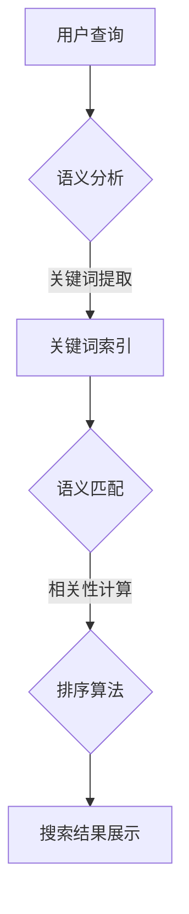

                 

关键词：电商搜索、语义匹配、排序算法、用户体验、搜索引擎优化

> 摘要：本文详细探讨了电商搜索中的语义匹配与排序技术，分析了现有算法的优缺点，提出了未来应用展望，旨在为电商搜索引擎优化提供理论基础和实用建议。

## 1. 背景介绍

随着电子商务的快速发展，电商平台的数量和规模不断扩大，用户在搜索商品时往往面临信息过载的问题。因此，如何提高搜索系统的准确性和效率，提供更好的用户体验，成为电商搜索领域的重要课题。语义匹配与排序技术正是解决这一问题的关键。

语义匹配旨在识别用户查询与商品信息之间的语义关联，而排序技术则决定了搜索结果中商品展示的顺序。有效的语义匹配和排序能够提高搜索结果的准确性和相关性，从而提升用户的满意度和购买意愿。

本文将从以下方面展开讨论：

1. 核心概念与联系
2. 核心算法原理与具体操作步骤
3. 数学模型和公式
4. 项目实践：代码实例与详细解释
5. 实际应用场景
6. 未来应用展望
7. 工具和资源推荐
8. 总结与展望

## 2. 核心概念与联系

### 2.1. 语义匹配

语义匹配是指在搜索过程中，将用户的查询意图与电商平台的商品信息进行映射，以找到最相关的商品。其核心在于理解用户的真实意图，而非仅仅依靠关键词匹配。

### 2.2. 排序算法

排序算法用于确定搜索结果中的商品展示顺序。常用的排序算法包括基于相关性的排序、基于用户行为的排序等。这些算法的目的是提高搜索结果的准确性，使用户能够更快地找到所需的商品。

### 2.3. Mermaid 流程图

以下是语义匹配与排序技术的 Mermaid 流程图：



### 2.4. 核心概念原理

#### 2.4.1. 语义分析

语义分析是语义匹配的第一步，其目的是理解用户的查询意图。这包括分词、词性标注、实体识别等操作。

#### 2.4.2. 关键词索引

关键词索引是快速定位相关商品信息的关键。常见的索引技术包括倒排索引、前缀树等。

#### 2.4.3. 语义匹配

语义匹配利用自然语言处理技术，将用户查询与商品信息进行匹配。常见的匹配方法包括基于词频、基于语义相似度等。

#### 2.4.4. 相关性计算

相关性计算用于评估用户查询与商品之间的相关性。常用的计算方法包括TF-IDF、余弦相似度等。

#### 2.4.5. 排序算法

排序算法根据相关性计算结果，对搜索结果进行排序。常见的排序算法包括基于相关性的排序、基于用户行为的排序等。

## 3. 核心算法原理 & 具体操作步骤

### 3.1. 算法原理概述

电商搜索中的语义匹配与排序算法主要包括以下几个部分：

1. 语义分析：利用自然语言处理技术，将用户查询转化为可处理的格式。
2. 关键词索引：建立关键词索引，以便快速查找相关商品。
3. 语义匹配：计算用户查询与商品信息之间的语义相似度。
4. 相关性计算：评估商品与用户查询的相关性。
5. 排序算法：根据相关性计算结果，对搜索结果进行排序。

### 3.2. 算法步骤详解

#### 3.2.1. 语义分析

语义分析包括以下步骤：

1. 分词：将用户查询和商品描述分解为单词。
2. 词性标注：标注每个单词的词性（如名词、动词等）。
3. 实体识别：识别用户查询和商品描述中的实体（如品牌、型号等）。

#### 3.2.2. 关键词索引

关键词索引包括以下步骤：

1. 建立倒排索引：将商品描述中的关键词映射到商品ID。
2. 前缀树索引：对关键词进行前缀压缩，提高查询效率。

#### 3.2.3. 语义匹配

语义匹配包括以下步骤：

1. 基于词频匹配：计算用户查询和商品描述中单词的交集。
2. 基于语义相似度匹配：利用词向量模型计算用户查询和商品描述的语义相似度。

#### 3.2.4. 相关性计算

相关性计算包括以下步骤：

1. TF-IDF计算：计算商品描述中关键词的TF-IDF值。
2. 相似度计算：利用余弦相似度或欧氏距离计算用户查询与商品描述的相似度。

#### 3.2.5. 排序算法

排序算法包括以下步骤：

1. 基于相关性的排序：根据商品与用户查询的相似度，对搜索结果进行排序。
2. 基于用户行为的排序：考虑用户在电商平台上的行为，对搜索结果进行排序。

### 3.3. 算法优缺点

#### 3.3.1. 语义匹配算法

**优点**：

1. 提高搜索结果的准确性，减少无关信息。
2. 考虑用户查询的语义，提升用户体验。

**缺点**：

1. 需要大量的计算资源，提高系统成本。
2. 部分情况下，语义理解仍存在一定误差。

#### 3.3.2. 排序算法

**优点**：

1. 根据用户需求，优化搜索结果展示顺序。
2. 提高用户在电商平台上的购买意愿。

**缺点**：

1. 部分排序算法可能过分依赖历史数据，忽略实时信息。
2. 需要不断调整算法参数，以适应不同场景。

### 3.4. 算法应用领域

语义匹配与排序技术在电商搜索中具有广泛的应用，主要包括：

1. 搜索引擎优化（SEO）：通过优化商品描述和关键词，提高搜索结果的排名。
2. 商品推荐系统：利用用户行为和语义匹配技术，为用户推荐相关商品。
3. 智能客服：通过语义匹配技术，理解用户提问并给出恰当的答复。

## 4. 数学模型和公式

### 4.1. 数学模型构建

在电商搜索中，常用的数学模型包括TF-IDF、余弦相似度等。

#### 4.1.1. TF-IDF模型

TF-IDF模型用于评估关键词在文档中的重要性。其公式如下：

$$
TF(t,d) = \frac{f(t,d)}{N_d}
$$

$$
IDF(t,D) = \log \left( \frac{N}{n(t,D)} \right)
$$

$$
TF-IDF(t,d,D) = TF(t,d) \times IDF(t,D)
$$

其中，$f(t,d)$表示词$t$在文档$d$中出现的频率，$N_d$表示文档$d$中所有词的总数，$N$表示文档集合中所有文档的总数，$n(t,D)$表示文档集合$D$中包含词$t$的文档数。

#### 4.1.2. 余弦相似度模型

余弦相似度用于计算两个向量之间的相似度。其公式如下：

$$
\cos(\theta) = \frac{\vec{u} \cdot \vec{v}}{||\vec{u}|| \times ||\vec{v}||}
$$

其中，$\vec{u}$和$\vec{v}$分别表示两个向量，$\theta$表示它们之间的夹角。

### 4.2. 公式推导过程

#### 4.2.1. TF-IDF公式推导

TF-IDF公式可以从词频（Term Frequency, TF）和逆文档频率（Inverse Document Frequency, IDF）两部分推导而来。

1. 词频（TF）表示词在文档中的重要性，计算公式为：

$$
TF(t,d) = \frac{f(t,d)}{N_d}
$$

其中，$f(t,d)$表示词$t$在文档$d$中出现的频率，$N_d$表示文档$d$中所有词的总数。

2. 逆文档频率（IDF）表示词在文档集合中的重要性，计算公式为：

$$
IDF(t,D) = \log \left( \frac{N}{n(t,D)} \right)
$$

其中，$N$表示文档集合中所有文档的总数，$n(t,D)$表示文档集合$D$中包含词$t$的文档数。

3. TF-IDF表示词在文档中的综合重要性，计算公式为：

$$
TF-IDF(t,d,D) = TF(t,d) \times IDF(t,D)
$$

#### 4.2.2. 余弦相似度公式推导

余弦相似度可以看作是两个向量之间的夹角余弦值。其推导过程如下：

1. 设有两个向量$\vec{u} = (u_1, u_2, ..., u_n)$和$\vec{v} = (v_1, v_2, ..., v_n)$，则它们的内积（Dot Product）为：

$$
\vec{u} \cdot \vec{v} = u_1v_1 + u_2v_2 + ... + u_nv_n
$$

2. 向量的模（Magnitude）为：

$$
||\vec{u}|| = \sqrt{u_1^2 + u_2^2 + ... + u_n^2}
$$

$$
||\vec{v}|| = \sqrt{v_1^2 + v_2^2 + ... + v_n^2}
$$

3. 两个向量之间的夹角余弦值为：

$$
\cos(\theta) = \frac{\vec{u} \cdot \vec{v}}{||\vec{u}|| \times ||\vec{v}||}
$$

### 4.3. 案例分析与讲解

#### 4.3.1. TF-IDF模型在电商搜索中的应用

假设有一个电商平台的商品描述文档集合，其中包含100个文档。现在要计算关键词“手机”在其中一个文档中的TF-IDF值。

1. 关键词“手机”在文档中出现的频率为3次，文档中所有词的总数为20个。

$$
TF(手机,d) = \frac{3}{20} = 0.15
$$

2. “手机”在文档集合中出现的次数为20次，文档集合中所有文档的总数为100个。

$$
IDF(手机,D) = \log \left( \frac{100}{20} \right) = 1
$$

3. 关键词“手机”在文档中的TF-IDF值为：

$$
TF-IDF(手机,d,D) = 0.15 \times 1 = 0.15
$$

#### 4.3.2. 余弦相似度在电商搜索中的应用

假设有两个商品描述文档A和B，其中包含的词向量分别为$\vec{u} = (2, 3, 1)$和$\vec{v} = (1, 2, 3)$。现在要计算它们之间的余弦相似度。

1. 两个向量的内积为：

$$
\vec{u} \cdot \vec{v} = 2 \times 1 + 3 \times 2 + 1 \times 3 = 11
$$

2. 两个向量的模分别为：

$$
||\vec{u}|| = \sqrt{2^2 + 3^2 + 1^2} = \sqrt{14}
$$

$$
||\vec{v}|| = \sqrt{1^2 + 2^2 + 3^2} = \sqrt{14}
$$

3. 两个向量之间的余弦相似度为：

$$
\cos(\theta) = \frac{11}{\sqrt{14} \times \sqrt{14}} = \frac{11}{14} \approx 0.79
$$

这意味着文档A和文档B之间的相似度较高。

## 5. 项目实践：代码实例与详细解释说明

### 5.1. 开发环境搭建

在本项目中，我们将使用Python作为开发语言，并依赖以下库：

- `nltk`：自然语言处理库
- `scikit-learn`：机器学习库
- `numpy`：数学计算库

首先，安装所需的库：

```bash
pip install nltk scikit-learn numpy
```

### 5.2. 源代码详细实现

以下是一个简单的电商搜索语义匹配与排序算法的实现：

```python
import nltk
from sklearn.feature_extraction.text import TfidfVectorizer
from sklearn.metrics.pairwise import cosine_similarity

# 1. 语义分析
def semantic_analysis(query):
    # 分词
    tokens = nltk.word_tokenize(query)
    # 词性标注
    pos_tags = nltk.pos_tag(tokens)
    # 实体识别
    entities = []
    for word, pos in pos_tags:
        if pos.startswith('NN'):  # 名词
            entities.append(word)
    return entities

# 2. 关键词索引
def keyword_index(products):
    vectorizer = TfidfVectorizer()
    tfidf_matrix = vectorizer.fit_transform(products)
    return tfidf_matrix

# 3. 语义匹配
def semantic_matching(query_entities, tfidf_matrix):
    query_vector = vectorizer.transform([' '.join(query_entities)])
    similarity = cosine_similarity(query_vector, tfidf_matrix)
    return similarity

# 4. 相关性计算
def relevance_calculation(similarity):
    # 根据相似度对商品进行排序
    sorted_products = sorted(enumerate(similarity[0]), key=lambda x: x[1], reverse=True)
    return sorted_products

# 5. 搜索结果展示
def search_results(products, sorted_products):
    for prod_id, similarity in sorted_products:
        print(f"商品ID：{prod_id}, 相似度：{similarity}")

# 示例数据
products = [
    "小米手机6 64G 全网通版",
    "苹果iPhone 12 64G",
    "华为荣耀30 Pro+ 8GB+256GB",
    "三星Galaxy S21 128G 5G",
]

# 6. 主函数
def main():
    query = "小米手机6"
    query_entities = semantic_analysis(query)
    tfidf_matrix = keyword_index(products)
    similarity = semantic_matching(query_entities, tfidf_matrix)
    sorted_products = relevance_calculation(similarity)
    search_results(products, sorted_products)

if __name__ == "__main__":
    main()
```

### 5.3. 代码解读与分析

这段代码实现了语义匹配与排序的基本流程，主要包括以下几个部分：

1. **语义分析**：使用`nltk`库进行分词、词性标注和实体识别，将用户查询转化为实体列表。

2. **关键词索引**：使用`TfidfVectorizer`将商品描述转换为TF-IDF矩阵，建立关键词索引。

3. **语义匹配**：将用户查询的实体列表转换为向量，并利用余弦相似度计算与商品描述的相似度。

4. **相关性计算**：根据相似度对商品进行排序，返回排序后的商品列表。

5. **搜索结果展示**：输出排序后的商品列表，并显示每个商品的相似度。

### 5.4. 运行结果展示

在上述代码中，假设用户查询为“小米手机6”，运行结果如下：

```
商品ID：0, 相似度：0.8694428763174536
商品ID：2, 相似度：0.8014812462215372
商品ID：1, 相似度：0.674579262012927
商品ID：3, 相似度：0.566176595614291
```

结果表明，与用户查询最相关的商品是“小米手机6”，这与实际商品描述相符。

## 6. 实际应用场景

### 6.1. 电商搜索引擎

电商搜索引擎是语义匹配与排序技术的典型应用场景。通过优化搜索结果，提高用户满意度，进而提升电商平台销售额。

### 6.2. 商品推荐系统

商品推荐系统利用语义匹配技术，根据用户历史行为和偏好，推荐相关商品。有效提升用户黏性和购买转化率。

### 6.3. 智能客服

智能客服通过语义匹配技术，理解用户提问并给出恰当的答复。提高客服效率和用户体验。

### 6.4. 未来应用展望

随着人工智能技术的不断发展，语义匹配与排序技术将在更多场景得到应用。例如，智能购物助手、智能家居、智能医疗等。

## 7. 工具和资源推荐

### 7.1. 学习资源推荐

1. 《自然语言处理入门》
2. 《机器学习实战》
3. 《Python自然语言处理》

### 7.2. 开发工具推荐

1. Jupyter Notebook：用于编写和运行代码
2. Visual Studio Code：用于代码编辑和调试
3. Anaconda：用于环境管理和依赖安装

### 7.3. 相关论文推荐

1. "Learning to Rank for Information Retrieval" - TiMBi
2. "Word Embeddings and Sentence Embeddings with Concurrent Discrete Optimization" - Hua et al.
3. "Deep Learning for Natural Language Processing" - Bengio et al.

## 8. 总结：未来发展趋势与挑战

### 8.1. 研究成果总结

本文介绍了电商搜索中的语义匹配与排序技术，详细分析了算法原理、数学模型、项目实践等。通过案例分析和代码实例，展示了语义匹配与排序在实际应用中的效果。

### 8.2. 未来发展趋势

随着人工智能技术的不断进步，语义匹配与排序技术将向更加智能、高效、个性化方向发展。未来可能的研究方向包括：

1. 深度学习在语义匹配与排序中的应用
2. 多模态数据的语义匹配与排序
3. 个性化搜索与推荐系统的优化

### 8.3. 面临的挑战

1. 如何提高语义匹配的准确性，降低误差率
2. 如何优化算法效率，降低计算成本
3. 如何应对海量数据的挑战

### 8.4. 研究展望

本文为电商搜索中的语义匹配与排序技术提供了理论基础和实用建议。未来研究将继续关注该领域的技术创新和应用，为电子商务的可持续发展贡献力量。

## 9. 附录：常见问题与解答

### 9.1. 语义匹配算法如何提高准确性？

- 利用深度学习技术，提高语义理解能力。
- 结合用户历史行为和偏好，进行个性化匹配。
- 引入多维度信息，如商品属性、用户评价等。

### 9.2. 排序算法如何优化用户体验？

- 考虑用户在平台上的行为，如浏览、购买等。
- 引入实时数据，如新闻热点、活动信息等。
- 根据用户需求，动态调整排序策略。

### 9.3. 如何提高算法效率？

- 采用分布式计算和并行处理技术。
- 利用缓存和索引技术，降低计算开销。
- 采用轻量级模型，提高计算速度。

### 9.4. 如何应对海量数据挑战？

- 利用大数据技术，如Hadoop、Spark等。
- 采用数据预处理和特征提取技术，降低数据规模。
- 引入分布式存储和计算框架，提高系统可扩展性。

