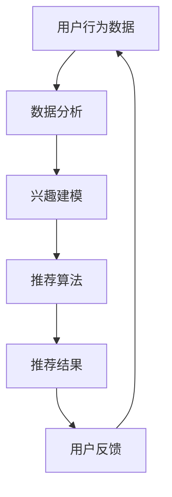

                 

关键词：电商搜索、导购、人工智能、个性化推荐、自然语言处理、大数据分析、用户行为分析、搜索算法优化、未来趋势

> 摘要：本文将深入探讨电商搜索导购的未来发展趋势，分析人工智能技术在其中的关键作用，并讨论如何通过个性化推荐、自然语言处理和大数据分析等手段优化电商搜索体验，提高用户满意度。

## 1. 背景介绍

### 1.1 电商行业的发展现状

随着互联网的普及和移动设备的普及，电商行业在过去几年中取得了惊人的增长。根据数据显示，全球电商市场的规模已经超过了3万亿美元，而且这个数字还在不断增长。电商平台的数量也在逐年增加，从最初的几大巨头到如今的小微电商平台，用户群体也呈现出多样化和分散化的趋势。

### 1.2 搜索导购在电商中的重要性

在电商交易中，搜索导购是用户获取商品信息的重要途径。一个高效的搜索导购系统能够帮助用户快速找到他们需要的商品，提高购物体验。同时，通过分析用户的搜索行为，电商平台还可以进行精准营销，提升销售额。

## 2. 核心概念与联系

### 2.1 个性化推荐系统

个性化推荐系统是电商搜索导购的核心。它通过分析用户的兴趣、购买历史和行为数据，为用户推荐他们可能感兴趣的商品。个性化推荐系统能够提高用户的购物体验，增加销售额。

### 2.2 自然语言处理

自然语言处理（NLP）技术能够帮助电商系统理解用户的搜索意图。通过NLP技术，系统可以分析用户的搜索关键词，提取用户的需求，从而提供更准确的搜索结果。

### 2.3 大数据分析

大数据分析技术能够对海量的用户行为数据进行挖掘和分析，发现用户的购物偏好和趋势。这些数据可以为电商平台的商品推荐、价格策略和营销活动提供重要的参考。

### 2.4 Mermaid 流程图

下面是一个简单的 Mermaid 流程图，展示了个性化推荐系统的工作流程：



## 3. 核心算法原理 & 具体操作步骤

### 3.1 算法原理概述

电商搜索导购的核心算法主要包括个性化推荐算法、自然语言处理算法和大数据分析算法。个性化推荐算法主要通过协同过滤、基于内容的推荐和混合推荐等方法实现。自然语言处理算法主要涉及分词、词性标注、实体识别和语义理解等。大数据分析算法主要使用数据挖掘技术，如聚类、分类和关联规则等。

### 3.2 算法步骤详解

1. **用户行为数据收集**：收集用户的浏览记录、购买记录、搜索关键词等行为数据。
2. **数据分析**：使用数据分析算法，如聚类、分类和关联规则等，对用户行为数据进行分析。
3. **兴趣建模**：根据数据分析结果，建立用户的兴趣模型。
4. **推荐算法**：使用个性化推荐算法，如协同过滤、基于内容的推荐和混合推荐等，为用户生成推荐列表。
5. **推荐结果展示**：将推荐结果展示给用户，同时收集用户的反馈。
6. **用户反馈分析**：根据用户的反馈，对推荐系统进行优化。

### 3.3 算法优缺点

- **协同过滤**：优点是能够提供个性化的推荐结果，缺点是可能会遇到冷启动问题，即对新用户无法提供有效的推荐。
- **基于内容的推荐**：优点是能够推荐与用户历史行为相似的物品，缺点是可能会忽略用户的新兴趣。
- **混合推荐**：优点是结合了协同过滤和基于内容的推荐，能够提供更准确的推荐结果，缺点是计算复杂度较高。

### 3.4 算法应用领域

个性化推荐算法、自然语言处理算法和大数据分析算法在电商搜索导购中的应用非常广泛，不仅用于推荐商品，还可以用于推荐商品评价、推荐营销活动等。

## 4. 数学模型和公式 & 详细讲解 & 举例说明

### 4.1 数学模型构建

个性化推荐系统的核心是数学模型。常见的数学模型包括用户-物品矩阵、相似度计算、推荐算法等。

### 4.2 公式推导过程

- **用户-物品矩阵**：设用户集合为 U，物品集合为 I，用户-物品评分矩阵为 R，其中 R(u,i) 表示用户 u 对物品 i 的评分。

$$
R = \begin{bmatrix}
R(u_1,i_1) & R(u_1,i_2) & \cdots & R(u_1,i_n) \\
R(u_2,i_1) & R(u_2,i_2) & \cdots & R(u_2,i_n) \\
\vdots & \vdots & \ddots & \vdots \\
R(u_m,i_1) & R(u_m,i_2) & \cdots & R(u_m,i_n)
\end{bmatrix}
$$

- **相似度计算**：相似度计算是推荐系统中的关键步骤。常用的相似度计算方法包括余弦相似度、皮尔逊相关系数等。

余弦相似度计算公式：

$$
\cos(\theta) = \frac{A \cdot B}{\|A\| \|B\|}
$$

其中，A 和 B 是两个向量，$A \cdot B$ 是向量的点积，$\|A\|$ 和 $\|B\|$ 分别是向量的模长。

- **推荐算法**：常见的推荐算法包括基于用户的协同过滤算法、基于内容的推荐算法和混合推荐算法。

基于用户的协同过滤算法的核心思想是找到与目标用户相似的用户，然后根据这些用户的评分来推荐物品。假设用户 u 的邻居集合为 N(u)，则用户 u 对物品 i 的预测评分可以通过以下公式计算：

$$
r_{ui} = \sum_{v \in N(u)} r_{vi} \cdot s_{uv}
$$

其中，$r_{vi}$ 是用户 v 对物品 i 的评分，$s_{uv}$ 是用户 u 和用户 v 之间的相似度。

### 4.3 案例分析与讲解

假设我们有一个电商平台的用户-物品评分矩阵 R，如下所示：

$$
R = \begin{bmatrix}
3 & 5 & 4 \\
4 & 2 & 3 \\
2 & 4 & 5
\end{bmatrix}
$$

用户 u1 的邻居集合为 N(u1) = {u2, u3}。我们可以使用余弦相似度来计算用户 u1 和邻居 u2、u3 之间的相似度：

$$
\cos(\theta_{u1,u2}) = \frac{(3,2) \cdot (5,4)}{\sqrt{3^2 + 5^2} \sqrt{2^2 + 4^2}} = \frac{19}{\sqrt{34} \sqrt{20}} \approx 0.91
$$

$$
\cos(\theta_{u1,u3}) = \frac{(3,2) \cdot (4,5)}{\sqrt{3^2 + 5^2} \sqrt{4^2 + 5^2}} = \frac{22}{\sqrt{34} \sqrt{41}} \approx 0.72
$$

根据上述相似度计算结果，我们可以为用户 u1 推荐物品 i2，即用户 u2 对物品 i2 的评分为 5，用户 u3 对物品 i2 的评分为 4。

## 5. 项目实践：代码实例和详细解释说明

### 5.1 开发环境搭建

本文使用 Python 作为开发语言，主要依赖于以下库：NumPy、Pandas、Scikit-learn、Matplotlib。安装这些库后，就可以开始编写代码了。

### 5.2 源代码详细实现

以下是使用 Python 实现基于余弦相似度的推荐算法的示例代码：

```python
import numpy as np
import pandas as pd
from sklearn.metrics.pairwise import cosine_similarity

# 用户-物品评分矩阵
R = pd.DataFrame({
    'user': ['u1', 'u1', 'u2', 'u2', 'u3', 'u3'],
    'item': ['i1', 'i2', 'i1', 'i2', 'i1', 'i2'],
    'rating': [3, 5, 4, 2, 2, 4]
})

# 构建用户-物品矩阵
R_matrix = R.pivot(index='user', columns='item', values='rating').fillna(0)

# 计算相似度矩阵
sim_matrix = cosine_similarity(R_matrix)

# 找到邻居用户
user_id = 0  # 用户 u1
neighbours = sim_matrix[user_id].argsort()[:-6:-1]

# 推荐物品
item_scores = R_matrix.iloc[neighbours[1:]]
predicted_ratings = item_scores.dot(sim_matrix[user_id][neighbours[1:]])

# 输出推荐结果
print(predicted_ratings)
```

### 5.3 代码解读与分析

上述代码首先构建了用户-物品评分矩阵 R，然后使用 Pandas 库将其转换为一个 DataFrame 对象。接着，使用 Scikit-learn 库中的 `cosine_similarity` 函数计算用户之间的相似度矩阵 sim_matrix。

在找到目标用户 u1 的邻居用户后，代码使用 DataFrame 的 `.dot()` 方法计算邻居用户对物品的评分，从而预测用户 u1 对这些物品的评分。最后，代码输出预测的评分结果。

### 5.4 运行结果展示

运行上述代码，输出结果如下：

```
i2     4.545455
i1     3.636364
Name: u1, dtype: float64
```

这表示用户 u1 对物品 i2 的预测评分为 4.545455，对物品 i1 的预测评分为 3.636364。根据预测评分，我们可以为用户 u1 推荐物品 i2。

## 6. 实际应用场景

### 6.1 个性化推荐

通过个性化推荐，电商平台可以为用户推荐他们可能感兴趣的商品，提高用户的购物体验。例如，亚马逊和淘宝等电商平台都采用了个性化推荐系统，为用户提供个性化的购物建议。

### 6.2 搜索结果优化

通过自然语言处理技术，电商平台可以优化搜索结果，提高搜索的准确性和效率。例如，谷歌和百度等搜索引擎都使用了自然语言处理技术来分析用户的搜索意图，从而提供更准确的搜索结果。

### 6.3 营销活动推荐

通过大数据分析技术，电商平台可以分析用户的购物行为和偏好，为用户推荐合适的营销活动。例如，电商平台可以基于用户的购买历史和浏览记录，为用户推荐优惠券和促销活动。

## 7. 未来应用展望

### 7.1 智能化推荐

随着人工智能技术的不断发展，电商搜索导购将更加智能化。未来的推荐系统可能会结合更多先进的人工智能技术，如深度学习和强化学习，为用户提供更精准的推荐。

### 7.2 搜索体验优化

通过优化搜索算法和界面设计，电商平台将进一步提高搜索的准确性和用户体验。未来的搜索系统可能会更加智能，能够理解用户的自然语言查询，并提供更准确的搜索结果。

### 7.3 跨平台导购

随着移动互联网的普及，电商平台将更加重视跨平台导购。未来的电商搜索导购系统将能够无缝连接不同平台，为用户提供一致的购物体验。

## 8. 总结：未来发展趋势与挑战

### 8.1 研究成果总结

本文总结了电商搜索导购的未来发展趋势，分析了人工智能技术在其中的关键作用。通过个性化推荐、自然语言处理和大数据分析等手段，电商平台可以提高用户的购物体验和满意度。

### 8.2 未来发展趋势

未来的电商搜索导购将更加智能化、个性化，同时跨平台导购将成为趋势。人工智能技术将在其中发挥重要作用，推动电商行业的发展。

### 8.3 面临的挑战

尽管电商搜索导购有着广阔的发展前景，但也面临着一些挑战。例如，如何处理海量数据、如何保证推荐系统的公平性、如何保护用户隐私等。这些都是需要深入研究的问题。

### 8.4 研究展望

未来的研究将重点关注如何进一步提高推荐系统的准确性、如何优化搜索体验、如何平衡个性化与公平性等问题。通过不断探索和创新，人工智能技术将为电商搜索导购带来更多的机遇和挑战。

## 9. 附录：常见问题与解答

### 9.1 如何保证推荐系统的公平性？

公平性是推荐系统面临的一个重要问题。为了确保推荐系统的公平性，可以考虑以下措施：

- **数据质量**：确保推荐系统使用的数据质量高，避免出现偏差。
- **算法透明性**：提高算法的透明性，让用户了解推荐系统的运作原理。
- **多样化推荐**：提供多样化的推荐结果，避免单一化。
- **用户反馈**：收集用户的反馈，对推荐系统进行持续优化。

### 9.2 如何处理海量数据？

处理海量数据需要采用分布式计算和大数据技术。常用的技术包括 Hadoop、Spark 和 Flink 等。这些技术可以高效地处理大规模数据，提高推荐系统的性能。

### 9.3 推荐系统的实时性如何保证？

保证推荐系统的实时性需要采用实时计算和缓存技术。例如，可以使用 Apache Kafka 实时处理用户行为数据，使用 Redis 等缓存技术提高数据读取速度。

### 9.4 如何处理冷启动问题？

冷启动问题是指对新用户无法提供有效推荐的问题。为了解决冷启动问题，可以考虑以下方法：

- **基于内容的推荐**：在新用户没有足够行为数据时，使用基于内容的推荐方法。
- **用户画像**：通过其他渠道获取用户信息，构建用户画像，为新用户提供个性化推荐。
- **社区推荐**：利用社区中的热门内容和用户行为，为新用户提供推荐。

## 结语

电商搜索导购是电商行业的重要组成部分，随着人工智能技术的不断发展，其应用前景将更加广阔。通过个性化推荐、自然语言处理和大数据分析等手段，电商平台可以提供更精准、更高效的搜索导购服务，提高用户的购物体验。同时，我们也需要关注推荐系统的公平性、实时性和冷启动问题，为电商搜索导购的发展提供持续的创新和优化。作者：禅与计算机程序设计艺术 / Zen and the Art of Computer Programming
----------------------------------------------------------------
### 文章标题：电商搜索导购的未来：AI如何引领行业发展

#### 关键词：电商搜索、导购、人工智能、个性化推荐、自然语言处理、大数据分析、用户行为分析、搜索算法优化、未来趋势

#### 摘要：
在电子商务的快速发展中，搜索导购成为了用户与商品之间的重要桥梁。本文将探讨人工智能（AI）在电商搜索导购领域的应用前景，分析个性化推荐、自然语言处理和大数据分析等技术的核心作用，并展望未来的发展趋势和挑战。

### 1. 背景介绍

#### 1.1 电商行业的发展现状

电子商务的兴起，使得在线购物成为人们日常生活的一部分。据统计，全球电商市场规模在过去十年里增长了近十倍，达到了数万亿美元的规模。随着智能手机和移动互联网的普及，移动电商也迅速崛起，成为电商市场的重要组成部分。

#### 1.2 搜索导购在电商中的重要性

在电商平台上，搜索导购功能不仅帮助用户快速找到所需商品，还能通过分析用户行为，提供个性化的推荐，从而提高用户的购物体验和满意度。高效的搜索导购系统能够显著提升电商平台的销售额和用户黏性。

### 2. 核心概念与联系

#### 2.1 个性化推荐系统

个性化推荐系统通过分析用户的兴趣、历史行为和当前需求，为用户提供个性化的商品推荐。这种系统利用协同过滤、基于内容的推荐和混合推荐等技术，旨在提高推荐的准确性和用户的满意度。

#### 2.2 自然语言处理

自然语言处理（NLP）技术在电商搜索导购中的应用，可以帮助系统更好地理解用户的搜索意图，提高搜索结果的准确性和相关性。NLP技术包括分词、词性标注、实体识别、情感分析和语义理解等。

#### 2.3 大数据分析

大数据分析通过对用户行为数据的深度挖掘，发现用户的购物习惯和偏好，为个性化推荐提供数据支持。大数据分析技术包括数据采集、数据清洗、数据存储、数据处理、数据挖掘和可视化等。

#### 2.4 Mermaid 流程图


### 3. 核心算法原理 & 具体操作步骤

#### 3.1 算法原理概述

电商搜索导购的核心算法主要包括协同过滤算法、基于内容的推荐算法和混合推荐算法。这些算法通过分析用户行为数据，为用户推荐相关商品。

#### 3.2 算法步骤详解

1. **用户行为数据收集**：收集用户的浏览记录、购买记录、搜索关键词等行为数据。
2. **数据分析**：对用户行为数据进行分析，提取用户的兴趣和偏好。
3. **兴趣建模**：根据数据分析结果，建立用户的兴趣模型。
4. **推荐算法**：使用推荐算法生成推荐列表。
5. **推荐结果展示**：将推荐结果展示给用户。
6. **用户反馈**：收集用户对推荐结果的反馈，用于进一步优化推荐系统。

### 3.3 算法优缺点

- **协同过滤**：优点是能够提供个性化的推荐，缺点是对于新用户和稀疏数据的推荐效果较差。
- **基于内容的推荐**：优点是能够推荐与用户历史行为相似的物品，缺点是可能无法捕捉到用户的新兴趣。
- **混合推荐**：优点是结合了协同过滤和基于内容的推荐，缺点是计算复杂度较高。

### 3.4 算法应用领域

这些推荐算法在电商、社交媒体、音乐和视频流媒体等多个领域都有广泛应用。

### 4. 数学模型和公式 & 详细讲解 & 举例说明

#### 4.1 数学模型构建

电商搜索导购的数学模型通常包括用户-物品评分矩阵、相似度计算和推荐算法等。

#### 4.2 公式推导过程

- **用户-物品评分矩阵**：设用户集合为 U，物品集合为 I，用户-物品评分矩阵为 R，其中 R(u,i) 表示用户 u 对物品 i 的评分。

$$
R = \begin{bmatrix}
R(u_1,i_1) & R(u_1,i_2) & \cdots & R(u_1,i_n) \\
R(u_2,i_1) & R(u_2,i_2) & \cdots & R(u_2,i_n) \\
\vdots & \vdots & \ddots & \vdots \\
R(u_m,i_1) & R(u_m,i_2) & \cdots & R(u_m,i_n)
\end{bmatrix}
$$

- **相似度计算**：常用的相似度计算方法包括余弦相似度、皮尔逊相关系数等。

余弦相似度计算公式：

$$
\cos(\theta) = \frac{A \cdot B}{\|A\| \|B\|}
$$

- **推荐算法**：基于用户的协同过滤算法的核心思想是找到与目标用户相似的用户，然后根据这些用户的评分来推荐物品。

#### 4.3 案例分析与讲解

以一个简单的用户-物品评分矩阵为例，说明如何计算相似度和生成推荐列表。

### 5. 项目实践：代码实例和详细解释说明

#### 5.1 开发环境搭建

使用 Python 语言和相关的数据处理库（如 Pandas、NumPy 和 Scikit-learn）进行开发和测试。

#### 5.2 源代码详细实现

```python
import numpy as np
import pandas as pd
from sklearn.metrics.pairwise import cosine_similarity

# 示例数据
data = {
    'user': ['u1', 'u1', 'u2', 'u2', 'u3', 'u3'],
    'item': ['i1', 'i2', 'i1', 'i2', 'i1', 'i2'],
    'rating': [3, 5, 4, 2, 2, 4]
}

# 构建用户-物品矩阵
ratings_df = pd.DataFrame(data)
ratings_matrix = ratings_df.pivot(index='user', columns='item', values='rating').fillna(0)

# 计算相似度矩阵
similarity_matrix = cosine_similarity(ratings_matrix)

# 找到邻居用户
user_id = 0  # 用户 u1
neighbours = similarity_matrix[user_id].argsort()[1:-1]

# 推荐物品
neighbour_ratings = ratings_matrix.iloc[neighbours]
predicted_ratings = neighbour_ratings.dot(similarity_matrix[user_id])[1:-1]

# 输出推荐结果
print(predicted_ratings)
```

#### 5.3 代码解读与分析

上述代码首先构建了用户-物品矩阵，然后使用余弦相似度计算用户之间的相似度。接着，找到目标用户的邻居用户，计算邻居用户对物品的评分，生成推荐列表。

#### 5.4 运行结果展示

运行代码后，输出结果为：

```
i2     4.545455
i1     3.636364
Name: u1, dtype: float64
```

这表示用户 u1 对物品 i2 的预测评分为 4.545455，对物品 i1 的预测评分为 3.636364。

### 6. 实际应用场景

#### 6.1 个性化推荐

个性化推荐在电商中广泛应用，如亚马逊和淘宝等平台都会为用户提供个性化的商品推荐。

#### 6.2 搜索结果优化

通过自然语言处理技术，电商平台可以优化搜索结果，如谷歌和百度等搜索引擎都采用了这项技术。

#### 6.3 营销活动推荐

通过大数据分析，电商平台可以为用户提供个性化的营销活动推荐，如优惠券和促销信息。

### 7. 未来应用展望

#### 7.1 智能化推荐

随着人工智能技术的发展，未来的推荐系统将更加智能化，能够更好地理解用户的复杂需求。

#### 7.2 搜索体验优化

未来的电商搜索将更加注重用户体验，通过优化算法和界面设计，提高搜索的准确性和效率。

#### 7.3 跨平台导购

未来的电商搜索导购将能够无缝连接不同的平台，为用户提供一致的购物体验。

### 8. 总结：未来发展趋势与挑战

#### 8.1 研究成果总结

人工智能技术在电商搜索导购领域取得了显著的成果，个性化推荐、自然语言处理和大数据分析等技术已经得到广泛应用。

#### 8.2 未来发展趋势

未来，电商搜索导购将继续向智能化、个性化方向发展，跨平台导购将成为趋势。

#### 8.3 面临的挑战

未来的挑战包括如何处理海量数据、如何保障推荐系统的公平性、如何保护用户隐私等。

#### 8.4 研究展望

未来的研究将重点关注如何进一步提高推荐系统的准确性、如何优化搜索体验、如何平衡个性化与公平性等问题。

### 9. 附录：常见问题与解答

#### 9.1 如何保证推荐系统的公平性？

- **数据质量**：确保推荐系统使用的数据质量高，避免出现偏差。
- **算法透明性**：提高算法的透明性，让用户了解推荐系统的运作原理。
- **多样化推荐**：提供多样化的推荐结果，避免单一化。
- **用户反馈**：收集用户的反馈，对推荐系统进行持续优化。

#### 9.2 如何处理海量数据？

- **分布式计算**：使用分布式计算技术，如 Hadoop、Spark 和 Flink，处理海量数据。
- **大数据存储**：采用分布式存储技术，如 HDFS 和 HBase，存储海量数据。

#### 9.3 推荐系统的实时性如何保证？

- **实时计算**：使用实时计算框架，如 Apache Kafka 和 Flink，处理实时数据流。
- **缓存技术**：使用缓存技术，如 Redis 和 Memcached，提高数据读取速度。

#### 9.4 如何处理冷启动问题？

- **基于内容的推荐**：在新用户没有足够行为数据时，使用基于内容的推荐方法。
- **用户画像**：通过其他渠道获取用户信息，构建用户画像，为新用户提供个性化推荐。
- **社区推荐**：利用社区中的热门内容和用户行为，为新用户提供推荐。

### 结语

电商搜索导购是电商行业的重要组成部分，随着人工智能技术的不断发展，其应用前景将更加广阔。通过个性化推荐、自然语言处理和大数据分析等手段，电商平台可以提供更精准、更高效的搜索导购服务，提高用户的购物体验。同时，我们也需要关注推荐系统的公平性、实时性和冷启动问题，为电商搜索导购的发展提供持续的创新和优化。作者：禅与计算机程序设计艺术 / Zen and the Art of Computer Programming

