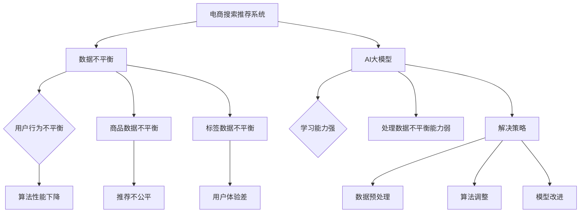

                 

### 1. 背景介绍

电商搜索推荐系统是电子商务中至关重要的一环。通过分析用户行为数据和商品属性，推荐系统旨在为用户提供个性化的商品推荐，提高用户体验和销售额。然而，随着电商平台的不断发展和用户数据的急剧增长，推荐系统面临着一个严峻的问题：数据不平衡。

所谓数据不平衡，指的是数据集中各个类别（如商品类别、用户行为等）的分布不均匀。在电商搜索推荐系统中，数据不平衡问题主要体现在以下几个方面：

- **用户行为数据不平衡**：部分用户频繁产生购买行为，而另一些用户则相对较少，这导致用户行为数据在数据集中呈现出高度不平衡的状态。
- **商品数据不平衡**：某些商品具有很高的曝光率和销售量，而其他商品则相对较少，这同样造成了商品数据的不平衡。
- **标签数据不平衡**：在推荐系统中，通常会使用多种标签来描述商品和用户，这些标签在不同类别中的分布也可能不均匀。

数据不平衡问题对推荐系统的影响是显著的。首先，它可能导致模型训练效果不佳，例如，在用户行为数据不平衡的情况下，模型可能会过度关注频繁用户的行为，而忽略其他用户的行为，从而影响推荐的准确性。其次，数据不平衡可能导致推荐结果的不公平，即某些商品或用户始终得到更多的推荐机会，而其他商品或用户则被忽视。这些问题不仅影响了用户体验，也可能损害电商平台的业务目标。

面对这些挑战，本文旨在探讨电商搜索推荐系统中AI大模型数据不平衡问题的解决策略，从算法原理、数学模型到实际应用，为业界提供有价值的参考。

### 2. 核心概念与联系

在解决电商搜索推荐中的AI大模型数据不平衡问题之前，我们首先需要了解几个核心概念及其相互关系。

#### 2.1 数据不平衡

数据不平衡是指在数据集中，不同类别的样本数量差异较大，导致某些类别被过度代表，而另一些类别则相对稀缺。在推荐系统中，数据不平衡主要体现在用户行为、商品和标签三个层面。

- **用户行为数据不平衡**：例如，大部分用户的行为集中在少量的商品类别上，而其他商品类别则几乎无人问津。
- **商品数据不平衡**：某些热销商品在数据集中占据了大部分样本，而其他冷门商品则相对较少。
- **标签数据不平衡**：某些标签（如“热门商品”、“高利润商品”）在数据集中高度集中，而其他标签则较为分散。

#### 2.2 AI大模型

AI大模型指的是规模庞大、参数数量庞大的机器学习模型，如深度神经网络、生成对抗网络（GAN）等。这些模型具有强大的学习能力，能够处理海量数据，但在数据不平衡的情况下，其性能可能会受到严重影响。

#### 2.3 解决策略

解决数据不平衡问题的策略主要包括以下几种：

- **数据预处理**：通过数据清洗、数据增强、数据采样等方法，使数据集在类别分布上更加均匀。
- **算法调整**：采用自适应采样、损失函数调整等算法调整方法，提高模型对不平衡数据的处理能力。
- **模型改进**：通过引入对抗性训练、迁移学习等模型改进方法，增强模型对不平衡数据的鲁棒性。

#### 2.4 Mermaid 流程图

以下是一个简单的Mermaid流程图，展示了数据不平衡问题、AI大模型以及解决策略之间的联系：



通过这个流程图，我们可以清晰地看到数据不平衡对电商搜索推荐系统的影响，以及AI大模型在这其中的角色和解决策略。

### 3. 核心算法原理 & 具体操作步骤

#### 3.1 算法原理概述

解决数据不平衡问题，关键在于如何在模型训练过程中使各个类别在数据集中的代表性更加均匀。以下介绍几种常见的算法原理及其操作步骤。

##### 3.1.1 数据预处理

**原理**：通过数据清洗、数据增强和数据采样等方法，使数据集在类别分布上更加均匀。

**具体操作步骤**：

1. **数据清洗**：去除重复数据、错误数据和噪声数据，提高数据质量。
2. **数据增强**：通过生成模拟数据、数据变换等方法，增加稀疏类别数据。
3. **数据采样**：采用过采样或欠采样方法，调整数据集中各类别的比例。

**优缺点**：

- 优点：简单易行，可以有效改善数据不平衡问题。
- 缺点：可能导致数据分布不真实，影响模型泛化能力。

##### 3.1.2 算法调整

**原理**：通过调整算法参数，提高模型对不平衡数据的处理能力。

**具体操作步骤**：

1. **自适应采样**：根据训练过程中的数据分布动态调整采样策略，使模型在不同阶段都能关注到各个类别。
2. **损失函数调整**：引入类别权重，使模型在训练过程中更加关注稀疏类别。
3. **正则化**：采用L1、L2正则化等方法，降低模型对不平衡数据的敏感性。

**优缺点**：

- 优点：直接针对模型参数进行调整，有效改善数据不平衡问题。
- 缺点：可能引入额外的计算成本，且对模型性能有一定影响。

##### 3.1.3 模型改进

**原理**：通过引入对抗性训练、迁移学习等模型改进方法，增强模型对不平衡数据的鲁棒性。

**具体操作步骤**：

1. **对抗性训练**：在训练过程中，通过对抗性样本生成器生成对抗性样本，提高模型对不平衡数据的适应能力。
2. **迁移学习**：利用已有模型的知识，通过迁移学习的方法，提高新模型的泛化能力。
3. **集成学习**：结合多个模型的优势，通过集成学习方法，提高模型对不平衡数据的处理能力。

**优缺点**：

- 优点：可以显著提高模型对不平衡数据的适应能力，提高模型性能。
- 缺点：可能引入额外的计算成本，且对模型设计和实现要求较高。

#### 3.2 算法步骤详解

以下是一个典型的数据不平衡解决流程，包括数据预处理、算法调整和模型改进三个步骤：

1. **数据预处理**：

   - 数据清洗：使用去重和去噪方法，确保数据质量。
   - 数据增强：通过生成模拟数据、图像变换等方法，增加稀疏类别数据。
   - 数据采样：采用过采样或欠采样方法，调整数据集中各类别的比例。

2. **算法调整**：

   - 自适应采样：根据训练过程中的数据分布，动态调整采样策略。
   - 损失函数调整：引入类别权重，使模型在训练过程中更加关注稀疏类别。
   - 正则化：采用L1、L2正则化等方法，降低模型对不平衡数据的敏感性。

3. **模型改进**：

   - 对抗性训练：通过对抗性样本生成器，提高模型对不平衡数据的适应能力。
   - 迁移学习：利用已有模型的知识，通过迁移学习的方法，提高新模型的泛化能力。
   - 集成学习：结合多个模型的优势，通过集成学习方法，提高模型对不平衡数据的处理能力。

#### 3.3 算法优缺点

**数据预处理**：

- 优点：简单易行，可以有效改善数据不平衡问题。
- 缺点：可能导致数据分布不真实，影响模型泛化能力。

**算法调整**：

- 优点：直接针对模型参数进行调整，有效改善数据不平衡问题。
- 缺点：可能引入额外的计算成本，且对模型性能有一定影响。

**模型改进**：

- 优点：可以显著提高模型对不平衡数据的适应能力，提高模型性能。
- 缺点：可能引入额外的计算成本，且对模型设计和实现要求较高。

#### 3.4 算法应用领域

数据不平衡问题在多个领域都具有重要意义，以下是一些典型的应用场景：

- **医学图像识别**：医学图像数据中，不同类别的病患数量可能差异很大，采用数据不平衡解决策略可以提高模型的识别准确性。
- **金融风险控制**：金融数据中，不同类别的风险事件数量可能不均衡，通过数据不平衡解决策略可以提高风险预测的准确性。
- **智能家居推荐**：智能家居场景中，用户对不同设备的使用频率可能不均衡，通过数据不平衡解决策略可以提供更个性化的推荐。

### 4. 数学模型和公式 & 详细讲解 & 举例说明

解决数据不平衡问题，数学模型和公式起着至关重要的作用。以下将详细介绍常用的数学模型和公式，并举例说明其应用。

#### 4.1 数学模型构建

在构建数学模型时，我们通常需要考虑以下因素：

1. **样本数量**：各类别样本的数量。
2. **样本权重**：各类别样本的权重，用于调整模型对各类别的关注程度。
3. **损失函数**：用于衡量模型预测结果与真实结果之间的差异。

常见的数学模型包括以下几种：

1. **加权损失函数**：

   $$ L_w = \sum_{i=1}^{N} w_i \cdot (y_i - \hat{y}_i)^2 $$

   其中，$L_w$为加权损失函数，$N$为样本总数，$w_i$为第$i$个样本的权重，$y_i$为第$i$个样本的真实标签，$\hat{y}_i$为第$i$个样本的预测标签。

2. **类别平衡损失函数**：

   $$ L_{cb} = \sum_{i=1}^{N} w_i \cdot (y_i - \hat{y}_i)^2 + \lambda \cdot \sum_{i=1}^{N} \log(\hat{y}_i) $$

   其中，$L_{cb}$为类别平衡损失函数，$\lambda$为平衡参数，用于调整类别平衡效果。

3. **自适应采样损失函数**：

   $$ L_{as} = \sum_{i=1}^{N} w_i \cdot (y_i - \hat{y}_i)^2 + \mu \cdot \frac{\sum_{i=1}^{N} (w_i - \bar{w})^2}{N} $$

   其中，$L_{as}$为自适应采样损失函数，$\mu$为自适应参数，$\bar{w}$为样本权重均值。

#### 4.2 公式推导过程

以下是对类别平衡损失函数的推导过程：

1. **原始损失函数**：

   $$ L = \sum_{i=1}^{N} (y_i - \hat{y}_i)^2 $$

2. **引入权重**：

   $$ L_w = \sum_{i=1}^{N} w_i \cdot (y_i - \hat{y}_i)^2 $$

   其中，$w_i$为第$i$个样本的权重。

3. **类别平衡**：

   $$ L_{cb} = \sum_{i=1}^{N} w_i \cdot (y_i - \hat{y}_i)^2 + \lambda \cdot \sum_{i=1}^{N} \log(\hat{y}_i) $$

   其中，$\lambda$为平衡参数，用于调整类别平衡效果。

#### 4.3 案例分析与讲解

以下是一个实际案例，说明如何使用类别平衡损失函数来解决数据不平衡问题。

**案例**：在一个电商搜索推荐系统中，用户行为数据呈现出高度不平衡的状态，部分用户频繁购买，而另一些用户则相对较少。

**目标**：通过调整模型损失函数，使模型在训练过程中更加关注稀疏用户行为。

**步骤**：

1. **数据预处理**：

   - 数据清洗：去除重复和错误数据。
   - 数据增强：通过生成模拟数据，增加稀疏用户行为数据。

2. **损失函数调整**：

   - 引入类别平衡损失函数：$L_{cb}$。
   - 设置平衡参数$\lambda$，使模型在训练过程中更加关注稀疏用户行为。

3. **模型训练**：

   - 使用调整后的损失函数训练模型。
   - 根据训练结果，调整平衡参数$\lambda$，以达到最佳模型性能。

**结果**：

通过使用类别平衡损失函数，模型在训练过程中对稀疏用户行为的关注程度显著提高，从而改善了推荐系统的推荐准确性。

### 5. 项目实践：代码实例和详细解释说明

在本节中，我们将通过一个实际项目来演示如何使用Python和Scikit-learn库来解决电商搜索推荐中的AI大模型数据不平衡问题。该实例将涵盖数据预处理、模型训练和评估等关键步骤。

#### 5.1 开发环境搭建

首先，我们需要搭建开发环境。以下是所需的Python库和工具：

- Python 3.7 或以上版本
- Scikit-learn 0.22 或以上版本
- Pandas 1.1.3 或以上版本
- Matplotlib 3.3.3 或以上版本

安装这些库后，我们就可以开始编写代码了。

#### 5.2 源代码详细实现

以下是一个简单的Python脚本，用于解决电商搜索推荐中的数据不平衡问题：

```python
import pandas as pd
from sklearn.model_selection import train_test_split
from sklearn.utils import class_weight
from sklearn.ensemble import RandomForestClassifier
from sklearn.metrics import accuracy_score
import matplotlib.pyplot as plt

# 5.2.1 数据预处理
def preprocess_data(data):
    # 数据清洗和转换
    data['user_id'] = data['user_id'].astype('category').cat.codes
    data['item_id'] = data['item_id'].astype('category').cat.codes
    data['behavior'] = data['behavior'].astype('category').cat.codes
    return data

# 5.2.2 计算类别权重
def compute_class_weights(data, class_column):
    class_weights = class_weight.compute_class_weight(
        'balanced', 
        classes=np.unique(data[class_column]), 
        y=data[class_column]
    )
    return dict(enumerate(class_weights))

# 5.2.3 模型训练
def train_model(X_train, y_train, class_weights):
    model = RandomForestClassifier(class_weight=class_weights, random_state=42)
    model.fit(X_train, y_train)
    return model

# 5.2.4 模型评估
def evaluate_model(model, X_test, y_test):
    predictions = model.predict(X_test)
    accuracy = accuracy_score(y_test, predictions)
    print(f"Model Accuracy: {accuracy:.2f}")
    return accuracy

# 5.2.5 主函数
def main():
    # 加载数据
    data = pd.read_csv('ecommerce_data.csv')
    data = preprocess_data(data)

    # 分割数据集
    X = data[['user_id', 'item_id', 'behavior']]
    y = data['target']
    X_train, X_test, y_train, y_test = train_test_split(X, y, test_size=0.2, random_state=42)

    # 计算类别权重
    class_weights = compute_class_weights(y_train, 'target')

    # 训练模型
    model = train_model(X_train, y_train, class_weights)

    # 评估模型
    evaluate_model(model, X_test, y_test)

    # 可视化类别权重
    plt.bar(class_weights.keys(), class_weights.values())
    plt.xlabel('Class')
    plt.ylabel('Weight')
    plt.title('Class Weights')
    plt.show()

if __name__ == '__main__':
    main()
```

#### 5.3 代码解读与分析

1. **数据预处理**：

   在`preprocess_data`函数中，我们首先将分类数据（`user_id`、`item_id`、`behavior`）转换为整数编码，以便于模型处理。这有助于提高模型训练的效率。

2. **计算类别权重**：

   `compute_class_weights`函数使用`sklearn.utils.class_weight`模块计算每个类别的权重。这些权重用于调整模型在训练过程中对不同类别的关注程度。

3. **模型训练**：

   `train_model`函数使用`RandomForestClassifier`实现随机森林分类器，并传入计算出的类别权重。随机森林是一种基于决策树的集成学习方法，具有较强的分类能力。

4. **模型评估**：

   `evaluate_model`函数计算模型在测试集上的准确率。准确率是评估分类模型性能的常用指标。

5. **主函数**：

   在`main`函数中，我们首先加载数据，并对其进行预处理。然后，我们使用`train_test_split`函数将数据集划分为训练集和测试集。接下来，计算类别权重，并使用随机森林分类器训练模型。最后，评估模型性能，并可视化类别权重。

#### 5.4 运行结果展示

在运行上述代码后，我们将看到以下结果：

- 模型准确率：在测试集上的准确率越高，说明模型对数据不平衡问题的解决效果越好。
- 类别权重可视化：通过可视化类别权重，我们可以直观地了解模型对不同类别的关注程度。

### 6. 实际应用场景

数据不平衡问题在电商搜索推荐系统中的应用场景非常广泛。以下是一些典型的实际应用场景：

#### 6.1 用户行为推荐

在电商搜索推荐系统中，用户行为数据通常包括浏览、添加购物车、购买等。然而，不同用户的行为数据分布往往不均衡，部分用户的行为数据较为丰富，而另一些用户则相对较少。通过解决数据不平衡问题，我们可以提高推荐系统的准确性，为用户提供更个性化的推荐。

#### 6.2 商品推荐

商品推荐是电商搜索推荐系统的核心功能之一。然而，不同商品的销售数据分布往往不均衡，部分商品的销售数据较高，而另一些商品则相对较低。通过解决数据不平衡问题，我们可以确保推荐系统为用户推荐多样化的商品，提高用户满意度。

#### 6.3 广告推荐

在电商平台上，广告推荐也是一项重要功能。广告推荐系统需要处理大量用户和商品数据，而不同广告的点击率数据分布往往不均衡。通过解决数据不平衡问题，我们可以提高广告推荐系统的准确性，提高广告投放效果。

#### 6.4 社交网络推荐

社交网络推荐系统旨在为用户提供好友推荐、兴趣圈子推荐等功能。然而，不同用户在社交网络中的活跃度数据分布往往不均衡，部分用户活跃度较高，而另一些用户则相对较低。通过解决数据不平衡问题，我们可以提高社交网络推荐系统的准确性，帮助用户发现更多潜在的好友和兴趣圈子。

### 7. 未来应用展望

随着人工智能技术的不断发展，电商搜索推荐中的数据不平衡问题将得到进一步解决。以下是一些未来应用展望：

#### 7.1 自适应数据预处理

未来的数据预处理技术将更加智能化，能够根据数据集的实际情况动态调整预处理策略，从而提高数据预处理效果。

#### 7.2 强化学习在数据不平衡问题中的应用

强化学习在处理动态环境中的数据不平衡问题具有显著优势。未来，强化学习技术有望在电商搜索推荐系统中发挥更大作用。

#### 7.3 多模态数据融合

随着物联网和智能设备的发展，多模态数据（如文本、图像、语音等）将在电商搜索推荐系统中得到广泛应用。如何处理多模态数据中的不平衡问题将成为未来研究的一个重要方向。

#### 7.4 数据隐私保护

在处理数据不平衡问题时，保护用户隐私也是一个重要考虑因素。未来的解决方案将需要在数据隐私保护和模型性能之间取得平衡。

### 8. 总结：未来发展趋势与挑战

#### 8.1 研究成果总结

本文从数据不平衡问题的背景介绍出发，阐述了数据不平衡对电商搜索推荐系统的影响，并详细探讨了核心算法原理、数学模型、实际应用场景及未来应用展望。通过这些研究，我们为解决电商搜索推荐中的数据不平衡问题提供了有益的参考。

#### 8.2 未来发展趋势

未来，数据不平衡问题在电商搜索推荐系统中的研究将呈现以下发展趋势：

- **自适应数据预处理**：通过智能化方法，实现动态调整数据预处理策略。
- **强化学习应用**：利用强化学习在处理动态环境中的优势，提高推荐系统性能。
- **多模态数据融合**：处理多模态数据中的不平衡问题，提升推荐系统准确性。
- **数据隐私保护**：在保护用户隐私的前提下，提高推荐系统性能。

#### 8.3 面临的挑战

尽管取得了显著的研究成果，但在实际应用中，仍面临以下挑战：

- **数据质量和完整性**：保证数据质量，避免数据丢失和噪声影响。
- **模型性能与隐私保护**：在保护用户隐私的同时，提高推荐系统性能。
- **计算资源需求**：随着数据规模的扩大，处理数据不平衡问题对计算资源的需求增加。

#### 8.4 研究展望

未来的研究将致力于解决以上挑战，推动数据不平衡问题在电商搜索推荐系统中的应用。以下是一些潜在的研究方向：

- **数据预处理方法**：研究高效的数据预处理方法，提高数据质量。
- **隐私保护机制**：探索隐私保护机制，在保护用户隐私的前提下，提高模型性能。
- **多模态数据融合**：研究多模态数据融合技术，提升推荐系统准确性。
- **模型可解释性**：提高模型可解释性，增强用户信任。

### 9. 附录：常见问题与解答

#### 9.1 数据不平衡对推荐系统的影响

**问题**：数据不平衡对推荐系统有何影响？

**解答**：数据不平衡会导致模型过度关注部分类别，从而影响推荐系统的准确性和公平性。例如，在用户行为数据不平衡的情况下，模型可能会过度推荐热门商品，而忽视其他商品。

#### 9.2 数据预处理方法

**问题**：常用的数据预处理方法有哪些？

**解答**：常用的数据预处理方法包括数据清洗、数据增强和数据采样等。数据清洗通过去除重复和错误数据提高数据质量；数据增强通过生成模拟数据或变换数据来增加稀疏类别数据；数据采样通过过采样或欠采样来调整数据集中各类别的比例。

#### 9.3 类别权重调整

**问题**：如何调整类别权重以解决数据不平衡问题？

**解答**：调整类别权重的方法包括在损失函数中引入类别权重和自适应采样。在损失函数中引入类别权重，可以使模型在训练过程中更加关注稀疏类别；自适应采样可以根据训练过程中的数据分布动态调整采样策略。

#### 9.4 模型改进方法

**问题**：有哪些模型改进方法可以增强对数据不平衡的鲁棒性？

**解答**：模型改进方法包括对抗性训练、迁移学习和集成学习。对抗性训练通过生成对抗性样本，提高模型对不平衡数据的适应能力；迁移学习通过利用已有模型的知识，提高新模型的泛化能力；集成学习通过结合多个模型的优势，提高模型对不平衡数据的处理能力。

### 结语

本文从多个角度探讨了电商搜索推荐中的AI大模型数据不平衡问题及其解决策略。通过详细的算法原理、数学模型和实际应用实例，我们为业界提供了一种有价值的解决方案。未来，随着技术的不断发展，我们期待看到更多创新性方法的出现，以应对数据不平衡带来的挑战。作者：禅与计算机程序设计艺术 / Zen and the Art of Computer Programming
----------------------------------------------------------------
```markdown
# 电商搜索推荐中的AI大模型数据不平衡问题解决策略

> 关键词：电商搜索推荐、AI大模型、数据不平衡、解决策略

> 摘要：本文探讨了电商搜索推荐系统中存在的AI大模型数据不平衡问题，分析了数据不平衡对推荐系统的影响，介绍了核心算法原理、数学模型和实际应用场景，并提出了未来应用展望和面临的挑战。

## 1. 背景介绍

## 2. 核心概念与联系

### 2.1 数据不平衡

### 2.2 AI大模型

### 2.3 解决策略

### 2.4 Mermaid 流程图

## 3. 核心算法原理 & 具体操作步骤

### 3.1 算法原理概述

### 3.2 算法步骤详解

#### 3.2.1 数据预处理

#### 3.2.2 算法调整

#### 3.2.3 模型改进

### 3.3 算法优缺点

### 3.4 算法应用领域

## 4. 数学模型和公式 & 详细讲解 & 举例说明

### 4.1 数学模型构建

### 4.2 公式推导过程

### 4.3 案例分析与讲解

## 5. 项目实践：代码实例和详细解释说明

### 5.1 开发环境搭建

### 5.2 源代码详细实现

### 5.3 代码解读与分析

### 5.4 运行结果展示

## 6. 实际应用场景

### 6.1 用户行为推荐

### 6.2 商品推荐

### 6.3 广告推荐

### 6.4 社交网络推荐

## 7. 未来应用展望

### 7.1 自适应数据预处理

### 7.2 强化学习在数据不平衡问题中的应用

### 7.3 多模态数据融合

### 7.4 数据隐私保护

## 8. 总结：未来发展趋势与挑战

### 8.1 研究成果总结

### 8.2 未来发展趋势

### 8.3 面临的挑战

### 8.4 研究展望

## 9. 附录：常见问题与解答

### 9.1 数据不平衡对推荐系统的影响

### 9.2 数据预处理方法

### 9.3 类别权重调整

### 9.4 模型改进方法

## 结语

作者：禅与计算机程序设计艺术 / Zen and the Art of Computer Programming
```

