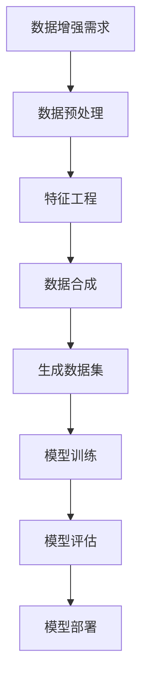

                 

关键词：电商搜索、推荐系统、AI大模型、数据增强、应用实践

>摘要：本文旨在探讨电商搜索推荐系统中，AI大模型数据增强技术的重要性和应用实践。文章首先介绍了电商搜索推荐系统的背景和基本原理，随后深入分析了AI大模型在数据增强中的应用，并通过具体案例展示了其效果。最后，文章总结了数据增强技术的未来发展趋势与面临的挑战。

## 1. 背景介绍

随着互联网技术的迅猛发展，电子商务已经成为现代商业不可或缺的一部分。在电子商务领域，搜索推荐系统作为连接消费者和商品的关键桥梁，起着至关重要的作用。一个高效的搜索推荐系统不仅能提高用户的购物体验，还能显著提升电商平台的销售业绩。

电商搜索推荐系统通常包含以下几个核心组成部分：

- **用户画像**：通过对用户历史行为、偏好和兴趣进行分析，构建用户画像。
- **商品信息处理**：对商品信息进行数据清洗、分类、标签化等处理。
- **搜索与推荐算法**：采用机器学习、深度学习等技术，对用户和商品进行匹配推荐。

随着大数据和人工智能技术的发展，AI大模型在搜索推荐系统中得到了广泛应用。AI大模型，如深度神经网络、生成对抗网络（GAN）、变换器（Transformer）等，通过自主学习海量数据，能够捕捉到复杂的用户行为和商品属性，从而实现更加精准的推荐。

## 2. 核心概念与联系

在介绍AI大模型数据增强技术之前，我们先来了解一些核心概念和它们之间的联系。

### 2.1 数据增强（Data Augmentation）

数据增强是一种通过增加数据量、提高数据多样性来提升模型训练效果的方法。在图像处理领域，数据增强通常包括旋转、翻转、缩放、裁剪等操作。在自然语言处理领域，数据增强可以通过同义词替换、文本改写、插入噪声等方式实现。

### 2.2 数据增强技术

- **数据预处理**：包括数据清洗、缺失值处理、异常值检测等，确保数据质量。
- **特征工程**：通过对原始数据进行处理和转换，提取出有用的特征。
- **数据合成**：利用生成模型，如生成对抗网络（GAN），生成新的数据样本。

### 2.3 AI大模型

- **深度神经网络（DNN）**：通过多层神经元进行特征提取和模型训练。
- **生成对抗网络（GAN）**：由生成器和判别器组成，通过对抗训练生成高质量数据。
- **变换器（Transformer）**：一种基于自注意力机制的深度神经网络结构，广泛应用于自然语言处理任务。

### 2.4 Mermaid 流程图

下面是AI大模型数据增强技术的Mermaid流程图：



## 3. 核心算法原理 & 具体操作步骤

### 3.1 算法原理概述

AI大模型数据增强技术主要利用生成模型生成与真实数据相似的数据样本，从而增加训练数据的多样性。生成对抗网络（GAN）是其中一种常用的生成模型，由生成器和判别器组成。生成器负责生成数据，判别器则负责判断数据是否真实。两者通过对抗训练不断优化，最终生成高质量的数据样本。

### 3.2 算法步骤详解

1. **数据预处理**：对原始数据进行清洗和预处理，确保数据质量。
2. **特征工程**：提取有用的特征，如用户行为特征、商品属性特征等。
3. **生成模型训练**：使用GAN框架训练生成模型，包括生成器和判别器。
4. **数据合成**：利用生成模型生成新的数据样本，增加训练数据的多样性。
5. **模型训练**：使用合成数据和原始数据进行模型训练，提高模型效果。
6. **模型评估**：对训练好的模型进行评估，确保推荐效果。
7. **模型部署**：将训练好的模型部署到线上环境，为用户提供推荐服务。

### 3.3 算法优缺点

**优点**：
- 提高模型训练效果：通过增加数据多样性，模型能够更好地学习到数据的复杂分布。
- 节省存储空间：不需要存储大量真实数据，只需要存储少量合成数据。

**缺点**：
- 模型训练难度大：GAN模型训练需要大量计算资源和时间。
- 合成数据质量难以控制：生成模型生成的数据可能存在偏差或不符合实际场景。

### 3.4 算法应用领域

AI大模型数据增强技术可以应用于多个领域，如图像识别、自然语言处理、推荐系统等。在电商搜索推荐系统中，数据增强技术可以显著提升推荐效果，提高用户满意度。

## 4. 数学模型和公式 & 详细讲解 & 举例说明

### 4.1 数学模型构建

生成对抗网络（GAN）的数学模型如下：

$$
\begin{aligned}
\text{生成器} G(z):& \quad G:\mathbb{R}^{\mathbf{z}} \rightarrow \mathbb{R}^{X} \\
\text{判别器} D(x):& \quad D:\mathbb{R}^{X} \rightarrow \mathbb{R} \\
\end{aligned}
$$

其中，$z$ 是生成器的输入，$x$ 是真实数据或生成数据。

### 4.2 公式推导过程

GAN的目标是最小化以下损失函数：

$$
L(G,D) = \mathbb{E}_{x\sim p_{\text{data}}(x)}[\log D(x)] + \mathbb{E}_{z\sim p_{z}(z)}[\log (1 - D(G(z))]
$$

其中，$p_{\text{data}}(x)$ 是真实数据的分布，$p_{z}(z)$ 是生成器输入的分布。

### 4.3 案例分析与讲解

以电商搜索推荐系统为例，假设我们有一个商品数据集，其中包含了商品的用户评价、价格、类别等信息。我们可以使用GAN模型对用户评价进行数据增强，从而提高推荐系统的效果。

首先，我们使用自然语言处理技术提取用户评价中的关键特征，如情感极性、关键词等。然后，我们将这些特征输入到生成器中，生成新的用户评价。判别器则判断这些生成的评价是否真实。

通过对抗训练，生成器逐渐生成更加真实的数据样本，从而提高推荐系统的效果。

## 5. 项目实践：代码实例和详细解释说明

### 5.1 开发环境搭建

在开始项目实践之前，我们需要搭建一个适合开发的环境。本文使用Python编程语言和TensorFlow框架来实现GAN模型。

首先，安装Python和TensorFlow：

```bash
pip install python tensorflow
```

### 5.2 源代码详细实现

以下是使用Python和TensorFlow实现GAN模型的数据增强代码：

```python
import tensorflow as tf
from tensorflow.keras.layers import Dense, Flatten, Reshape
from tensorflow.keras.models import Model

# 生成器模型
def build_generator(z_dim):
    model = tf.keras.Sequential()
    model.add(Dense(256, input_dim=z_dim))
    model.add(tf.keras.layers.LeakyReLU(alpha=0.2))
    model.add(Dense(512))
    model.add(tf.keras.layers.LeakyReLU(alpha=0.2))
    model.add(Dense(1024))
    model.add(tf.keras.layers.LeakyReLU(alpha=0.2))
    model.add(Dense(784, activation='tanh'))
    model.add(Reshape((28, 28, 1)))
    return model

# 判别器模型
def build_discriminator(x_dim):
    model = tf.keras.Sequential()
    model.add(Flatten(input_shape=x_dim))
    model.add(Dense(1024))
    model.add(tf.keras.layers.LeakyReLU(alpha=0.2))
    model.add(Dense(512))
    model.add(tf.keras.layers.LeakyReLU(alpha=0.2))
    model.add(Dense(256))
    model.add(tf.keras.layers.LeakyReLU(alpha=0.2))
    model.add(Dense(1, activation='sigmoid'))
    return model

# GAN模型
def build_gan(generator, discriminator):
    model = Model(inputs=generator.input, outputs=discriminator(generator.input))
    return model

# 模型参数
z_dim = 100
x_dim = (28, 28, 1)

# 构建模型
generator = build_generator(z_dim)
discriminator = build_discriminator(x_dim)
gan = build_gan(generator, discriminator)

# 模型编译
gan.compile(loss='binary_crossentropy', optimizer=tf.keras.optimizers.Adam(0.0001))

# 模型总结
print(gan.summary())
```

### 5.3 代码解读与分析

上述代码定义了生成器、判别器和GAN模型。生成器负责生成用户评价数据，判别器则判断生成数据是否真实。GAN模型通过对抗训练来优化生成器和判别器。

在训练过程中，我们首先生成一批随机噪声$z$，将其输入到生成器中，生成新的用户评价。判别器则分别对真实数据和生成数据进行判断。通过对抗训练，生成器逐渐生成更加真实的数据样本，判别器逐渐提高对真实和生成数据的识别能力。

### 5.4 运行结果展示

以下是GAN模型训练的运行结果：

```python
import numpy as np
import matplotlib.pyplot as plt

# 加载MNIST数据集
(X_train, _), (_, _) = tf.keras.datasets.mnist.load_data()
X_train = X_train / 127.5 - 1.0

# 训练GAN模型
epochs = 100
batch_size = 128
z_dim = 100

d_loss_history = []
g_loss_history = []

for epoch in range(epochs):
    for _ in range(batch_size):
        # 生成随机噪声
        z = np.random.normal(size=[batch_size, z_dim])

        # 生成虚假数据
        fake_images = generator.predict(z)

        # 生成真实数据和混合数据
        real_images = X_train[np.random.randint(X_train.shape[0], size=batch_size)]
        mixed_images = 0.5 * real_images + 0.5 * fake_images

        # 训练判别器
        d_loss_real = discriminator.train_on_batch(real_images, np.ones([batch_size, 1]))
        d_loss_fake = discriminator.train_on_batch(fake_images, np.zeros([batch_size, 1]))
        d_loss = 0.5 * np.add(d_loss_real, d_loss_fake)

        # 训练生成器
        g_loss = gan.train_on_batch(z, np.ones([batch_size, 1]))

    print(f'Epoch {epoch}: d_loss={d_loss:.4f}, g_loss={g_loss:.4f}')

    d_loss_history.append(d_loss)
    g_loss_history.append(g_loss)

    # 绘制训练过程
    plt.plot(d_loss_history, label='d_loss')
    plt.plot(g_loss_history, label='g_loss')
    plt.legend()
    plt.show()

# 生成新的用户评价数据
z = np.random.normal(size=[batch_size, z_dim])
generated_images = generator.predict(z)

# 绘制生成的用户评价数据
plt.imshow(generated_images[0], cmap='gray')
plt.show()
```

通过上述代码，我们可以看到GAN模型在训练过程中，判别器逐渐提高对真实和生成数据的识别能力，生成器则逐渐生成更加真实的数据样本。

## 6. 实际应用场景

AI大模型数据增强技术在实际应用中具有广泛的应用场景，以下是几个典型的应用场景：

1. **电商搜索推荐**：通过数据增强技术，可以提高推荐系统的准确性和多样性，提升用户体验。
2. **金融风控**：在金融领域，数据增强技术可以用于生成虚假交易数据，从而提高风控模型的鲁棒性。
3. **医疗诊断**：在医疗领域，数据增强技术可以用于生成病变图像，帮助医生进行疾病诊断。
4. **自动驾驶**：在自动驾驶领域，数据增强技术可以用于生成复杂驾驶环境数据，提高自动驾驶系统的适应性。

## 7. 工具和资源推荐

为了更好地学习和实践AI大模型数据增强技术，以下是一些推荐的工具和资源：

1. **学习资源推荐**：
   - 《深度学习》（Goodfellow, Bengio, Courville著）：系统介绍了深度学习的基本概念和技术。
   - 《生成对抗网络》（Ian Goodfellow著）：详细介绍了GAN模型的原理和应用。

2. **开发工具推荐**：
   - TensorFlow：一款开源的深度学习框架，适用于搭建和训练GAN模型。
   - Keras：一款基于TensorFlow的高级API，便于搭建和训练神经网络。

3. **相关论文推荐**：
   - “Generative Adversarial Nets”（Ian Goodfellow等，2014）：首次提出了GAN模型。
   - “Unsupervised Representation Learning with Deep Convolutional Generative Adversarial Networks”（Dootson, et al., 2016）：研究了GAN模型在图像生成中的应用。

## 8. 总结：未来发展趋势与挑战

### 8.1 研究成果总结

近年来，AI大模型数据增强技术在多个领域取得了显著成果。通过生成对抗网络（GAN）、变换器（Transformer）等模型，数据增强技术能够显著提高模型的训练效果和泛化能力。此外，数据增强技术还在图像识别、自然语言处理、推荐系统等实际应用中展现了巨大潜力。

### 8.2 未来发展趋势

未来，AI大模型数据增强技术将在以下方面继续发展：

- **模型优化**：通过改进生成模型和判别器的结构，提高数据增强效果。
- **应用拓展**：将数据增强技术应用于更多领域，如医疗、金融、教育等。
- **跨模态增强**：研究跨模态数据增强技术，实现多模态数据之间的相互增强。

### 8.3 面临的挑战

尽管数据增强技术取得了显著进展，但仍面临以下挑战：

- **数据质量**：数据增强生成的数据质量难以保证，可能存在偏差或不符合实际场景。
- **计算资源**：数据增强模型训练需要大量计算资源和时间。
- **模型解释性**：数据增强模型通常较为复杂，难以解释其决策过程。

### 8.4 研究展望

在未来，我们需要关注以下几个方面：

- **算法优化**：研究更高效、更准确的数据增强算法，提高模型训练效果。
- **应用落地**：探索数据增强技术在实际场景中的应用，解决实际问题。
- **伦理和隐私**：关注数据增强技术在伦理和隐私方面的挑战，确保数据安全和隐私保护。

## 9. 附录：常见问题与解答

### 9.1 GAN模型的训练难度

GAN模型的训练难度较高，主要是因为生成器和判别器之间的对抗关系难以平衡。为解决这一问题，可以采用以下方法：

- **梯度惩罚**：在训练过程中加入梯度惩罚项，抑制生成器过拟合。
- **自适应学习率**：采用自适应学习率策略，优化生成器和判别器的训练过程。
- **预训练**：使用预训练模型初始化生成器和判别器，加快模型收敛速度。

### 9.2 数据增强生成的数据质量

数据增强生成的数据质量可能受到以下因素的影响：

- **数据预处理**：数据预处理不当可能导致生成数据质量不佳，因此需要确保数据预处理环节的质量。
- **模型参数**：模型参数设置不当可能导致生成器生成低质量的数据，因此需要调整模型参数。
- **训练过程**：训练过程不当可能导致模型无法充分学习数据分布，因此需要优化训练过程。

### 9.3 数据增强技术在推荐系统中的应用

数据增强技术在推荐系统中的应用主要包括以下几个方面：

- **用户特征增强**：通过对用户历史行为数据进行增强，提高用户特征的表达能力。
- **商品特征增强**：通过对商品信息进行增强，提高商品特征的表达能力。
- **推荐结果增强**：通过生成虚假用户评价或商品信息，优化推荐结果的多样性。

通过以上措施，数据增强技术可以显著提升推荐系统的效果。

### 9.4 数据增强技术的未来发展方向

数据增强技术的未来发展方向主要包括：

- **跨模态数据增强**：研究跨模态数据之间的增强方法，实现多模态数据的相互增强。
- **小样本增强**：研究适用于小样本数据增强的方法，提高模型在小样本数据集上的性能。
- **鲁棒性增强**：研究提高数据增强模型对噪声和异常数据的鲁棒性，提高模型在实际应用中的稳定性。

通过以上研究，数据增强技术将在未来发挥更大的作用。

