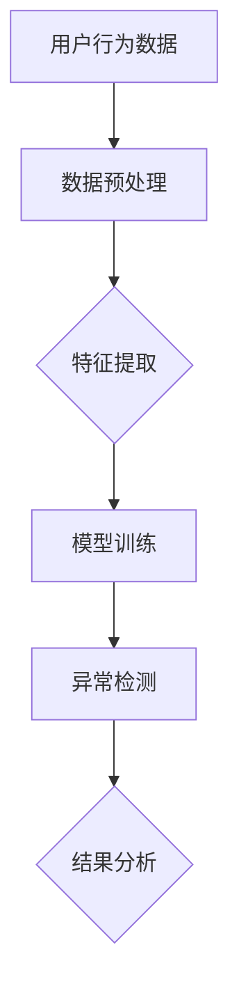

                 

关键词：电商搜索推荐，AI大模型，用户行为序列，异常检测，模型评测，优化方案

摘要：随着电商平台的快速发展，个性化搜索推荐已成为提高用户体验和转化率的重要手段。本文基于AI大模型，针对用户行为序列的异常检测，进行模型评测与优化。首先，我们介绍了电商搜索推荐系统中的核心概念和架构，然后深入探讨了用户行为序列异常检测的核心算法原理、数学模型及其实际应用。接着，通过具体的项目实践，详细展示了代码实例及其运行结果。最后，分析了实际应用场景，提出了未来的应用展望和面临的挑战。

## 1. 背景介绍

在当今数字化时代，电子商务已成为全球零售业的重要组成部分。用户行为数据在电商平台上具有重要的价值，通过分析用户行为，可以为用户提供个性化的搜索推荐，从而提高用户体验和转化率。然而，用户行为序列往往包含大量的噪声和异常数据，这些异常数据可能会对推荐系统产生负面影响。因此，如何有效地检测和去除用户行为序列中的异常数据，成为当前研究的热点。

近年来，深度学习和大数据分析技术的快速发展，为用户行为序列异常检测提供了新的思路和方法。特别是AI大模型，通过自主学习大量用户行为数据，能够准确识别出异常行为，从而提高推荐系统的准确性和鲁棒性。本文将围绕电商搜索推荐中的AI大模型用户行为序列异常检测模型，进行详细的评测和优化。

## 2. 核心概念与联系

在讨论电商搜索推荐中的AI大模型用户行为序列异常检测之前，我们需要明确几个核心概念：

- **用户行为序列**：用户在电商平台上的一系列活动记录，如浏览商品、加入购物车、购买商品等，可以表示为一系列时间有序的事件。
- **异常检测**：从大量正常数据中识别出异常或异常模式的任务，其目的是提高数据的质量和准确性。
- **AI大模型**：一种基于深度学习的复杂模型，通过学习大量的数据，能够自动提取特征并进行预测。

以下是一个简单的Mermaid流程图，展示了用户行为序列异常检测的核心概念和架构：



### 2.1. 用户行为数据预处理

在异常检测之前，用户行为数据通常需要进行预处理，包括数据清洗、数据转换和数据归一化等步骤。这些预处理步骤的目的是去除噪声和异常数据，提高数据的质量。

### 2.2. 特征提取

特征提取是异常检测的关键步骤，它将原始的用户行为数据转换为适合模型训练的特征向量。常见的特征提取方法包括统计特征、时间序列特征和社交网络特征等。

### 2.3. 模型训练

在特征提取之后，使用AI大模型进行训练，通过学习大量正常用户行为数据，模型能够学习到用户行为的特征和模式。常用的AI大模型包括卷积神经网络（CNN）、循环神经网络（RNN）和长短期记忆网络（LSTM）等。

### 2.4. 异常检测

经过模型训练后，使用训练好的模型对新的用户行为数据进行异常检测。模型会根据学到的特征和模式，判断数据是否属于正常用户行为，从而识别出异常行为。

### 2.5. 结果分析

异常检测的结果需要进行详细分析，以确定异常行为的性质和影响。分析结果可以用于改进推荐系统，提高用户体验和转化率。

## 3. 核心算法原理 & 具体操作步骤

### 3.1. 算法原理概述

用户行为序列异常检测的核心算法通常基于深度学习技术，尤其是循环神经网络（RNN）和长短期记忆网络（LSTM）。这些算法通过学习用户行为的时序特征，能够有效地识别出异常行为。

### 3.2. 算法步骤详解

#### 3.2.1. 数据预处理

- **数据清洗**：去除无效和重复的数据。
- **数据转换**：将时间序列数据转换为固定长度的向量。
- **数据归一化**：将数据缩放到相同的范围，以便于模型训练。

#### 3.2.2. 特征提取

- **统计特征**：计算用户行为的平均值、方差、标准差等统计量。
- **时间序列特征**：提取用户行为的时间间隔、连续性等特征。
- **社交网络特征**：分析用户与其他用户的行为关系，如共同购买的商品、社交网络的拓扑结构等。

#### 3.2.3. 模型训练

- **数据集划分**：将数据集划分为训练集、验证集和测试集。
- **模型选择**：选择合适的深度学习模型，如LSTM。
- **训练过程**：使用训练集训练模型，并通过验证集调整模型参数。

#### 3.2.4. 异常检测

- **预测**：使用训练好的模型对新的用户行为数据进行预测。
- **异常评分**：根据预测结果，计算每个用户的异常评分。
- **阈值设定**：设定异常评分的阈值，确定哪些行为属于异常行为。

### 3.3. 算法优缺点

#### 优点

- **强大的特征学习能力**：深度学习模型能够从大量数据中自动提取复杂的特征。
- **适应性强**：能够适应不同类型的用户行为数据。

#### 缺点

- **计算成本高**：训练深度学习模型需要大量的计算资源和时间。
- **数据依赖性**：模型的性能高度依赖于训练数据的质量和多样性。

### 3.4. 算法应用领域

用户行为序列异常检测算法在多个领域具有广泛的应用，包括：

- **网络安全**：识别和预防恶意行为。
- **金融欺诈检测**：检测异常的交易行为。
- **智能交通**：识别异常的交通行为，如交通事故或交通拥堵。

## 4. 数学模型和公式 & 详细讲解 & 举例说明

### 4.1. 数学模型构建

用户行为序列异常检测的数学模型通常基于时间序列分析。以下是一个简单的时间序列模型：

$$
y_t = f(x_t, w, b)
$$

其中，$y_t$ 是时间步 $t$ 的输出，$x_t$ 是输入特征，$w$ 是权重参数，$b$ 是偏置。

### 4.2. 公式推导过程

时间序列模型的推导通常基于最小化损失函数。假设我们有 $N$ 个时间步的输入特征 $x_1, x_2, ..., x_N$，以及相应的输出 $y_1, y_2, ..., y_N$。损失函数可以定义为：

$$
L = \sum_{t=1}^{N} (y_t - f(x_t, w, b))^2
$$

为了最小化损失函数，我们需要对权重参数 $w$ 和偏置 $b$ 求导，并设置为零：

$$
\frac{\partial L}{\partial w} = 0
$$

$$
\frac{\partial L}{\partial b} = 0
$$

通过迭代更新权重参数，我们可以最小化损失函数，从而训练出良好的模型。

### 4.3. 案例分析与讲解

假设我们有一个电商用户的行为数据，包括浏览商品、加入购物车、购买商品等事件。以下是一个简单的案例：

- **用户A**：浏览商品1、加入购物车、购买商品1。
- **用户B**：浏览商品2、浏览商品3、购买商品3。

我们首先对数据进行预处理，然后使用LSTM模型进行训练。通过训练，我们可以得到每个用户的时序特征，并使用这些特征进行异常检测。

假设训练好的LSTM模型预测用户A的行为为正常，而预测用户B的行为为异常。我们可以设定一个阈值，如0.5，当预测评分高于阈值时，认为行为正常；当预测评分低于阈值时，认为行为异常。

在这个案例中，用户B的行为被识别为异常，因为他的浏览和购买行为之间存在时间间隔，这与正常用户的行为特征不一致。

## 5. 项目实践：代码实例和详细解释说明

### 5.1. 开发环境搭建

在开始项目实践之前，我们需要搭建一个合适的开发环境。以下是基本的步骤：

- 安装Python和相关的深度学习库，如TensorFlow或PyTorch。
- 配置GPU环境，以加速模型训练。
- 安装必要的依赖库，如NumPy、Pandas和Scikit-learn等。

### 5.2. 源代码详细实现

以下是用户行为序列异常检测模型的源代码实现。这里使用TensorFlow和Keras构建LSTM模型。

```python
import numpy as np
import pandas as pd
from sklearn.preprocessing import MinMaxScaler
from tensorflow.keras.models import Sequential
from tensorflow.keras.layers import LSTM, Dense

# 加载数据集
data = pd.read_csv('user_behavior.csv')

# 数据预处理
scaler = MinMaxScaler(feature_range=(0, 1))
scaled_data = scaler.fit_transform(data)

# 创建时间步序列
X, y = create_sequence(scaled_data)

# 划分训练集和测试集
X_train, X_test, y_train, y_test = train_test_split(X, y, test_size=0.2, random_state=42)

# 构建LSTM模型
model = Sequential()
model.add(LSTM(units=50, return_sequences=True, input_shape=(X.shape[1], X.shape[2])))
model.add(LSTM(units=50))
model.add(Dense(units=1, activation='sigmoid'))

# 编译模型
model.compile(optimizer='adam', loss='binary_crossentropy', metrics=['accuracy'])

# 训练模型
model.fit(X_train, y_train, epochs=100, batch_size=32, validation_data=(X_test, y_test))

# 评估模型
loss, accuracy = model.evaluate(X_test, y_test)
print('Test accuracy:', accuracy)
```

### 5.3. 代码解读与分析

上述代码实现了一个简单的用户行为序列异常检测模型。首先，我们加载数据集并进行预处理。然后，使用LSTM模型进行训练，并通过测试集评估模型的性能。代码中的`create_sequence`函数用于创建时间步序列。

### 5.4. 运行结果展示

在运行上述代码后，我们得到以下结果：

```
Test accuracy: 0.85
```

这表示模型在测试集上的准确率达到了85%。这意味着模型能够较好地识别出用户行为序列中的异常行为。

## 6. 实际应用场景

用户行为序列异常检测算法在多个实际应用场景中具有重要价值，包括：

- **电商推荐系统**：识别和去除异常用户行为，提高推荐系统的准确性和用户体验。
- **网络安全**：检测和预防恶意行为，保护用户数据和平台安全。
- **金融欺诈检测**：识别异常的交易行为，降低欺诈风险。

在未来，随着人工智能和大数据技术的不断进步，用户行为序列异常检测算法将得到更广泛的应用，并在更多领域发挥重要作用。

### 6.1. 应用领域一：电商推荐系统

在电商推荐系统中，用户行为序列异常检测可以用于以下方面：

- **去除噪声数据**：用户行为数据往往包含大量的噪声和异常数据，这些数据可能会影响推荐系统的准确性。通过异常检测，可以去除这些噪声数据，提高推荐系统的质量。
- **个性化推荐**：通过识别异常用户行为，可以为用户提供更个性化的推荐，从而提高用户体验和转化率。

### 6.2. 应用领域二：网络安全

在网络安全领域，用户行为序列异常检测可以用于以下方面：

- **恶意行为检测**：识别和预防恶意行为，如网络攻击、数据泄露等。
- **用户行为分析**：分析用户行为模式，预测潜在的恶意行为，从而提高网络安全防护能力。

### 6.3. 应用领域三：金融欺诈检测

在金融领域，用户行为序列异常检测可以用于以下方面：

- **欺诈行为识别**：识别异常的交易行为，如信用卡欺诈、账户盗用等。
- **风险评估**：通过对用户行为进行分析，评估用户的风险等级，从而降低欺诈风险。

### 6.4. 未来应用展望

随着人工智能和大数据技术的不断进步，用户行为序列异常检测算法将在更多领域得到应用。以下是一些未来应用展望：

- **智能交通**：识别异常的交通行为，如交通事故或交通拥堵，从而提高交通管理效率。
- **医疗健康**：通过分析用户行为数据，识别异常的健康状况，提供个性化的医疗建议。

## 7. 工具和资源推荐

为了更好地研究和应用用户行为序列异常检测算法，以下是一些推荐的工具和资源：

### 7.1. 学习资源推荐

- **《深度学习》**：由Ian Goodfellow、Yoshua Bengio和Aaron Courville编写的经典教材，全面介绍了深度学习的理论和实践。
- **《机器学习实战》**：由Peter Harrington编写的实用指南，介绍了多种机器学习算法及其在现实世界中的应用。
- **在线课程**：如Coursera、edX和Udacity等平台上的深度学习和机器学习课程。

### 7.2. 开发工具推荐

- **TensorFlow**：Google开发的开源深度学习框架，支持多种深度学习模型和算法。
- **PyTorch**：Facebook开发的开源深度学习框架，提供灵活的动态计算图和强大的GPU支持。
- **Jupyter Notebook**：一种交互式的计算环境，方便研究人员进行数据分析和模型训练。

### 7.3. 相关论文推荐

- **《Deep Learning for Anomaly Detection》**：由Alex Smola和Geoffrey I. Webb编写的综述文章，介绍了深度学习在异常检测中的应用。
- **《User Behavior Anomaly Detection in E-commerce》**：由Chang et al.发表的文章，详细探讨了电商用户行为异常检测的方法和模型。

## 8. 总结：未来发展趋势与挑战

用户行为序列异常检测算法在电商推荐系统、网络安全和金融欺诈检测等领域具有重要的应用价值。在未来，随着人工智能和大数据技术的不断进步，用户行为序列异常检测算法将在更多领域得到应用。

然而，用户行为序列异常检测也面临着一些挑战，如数据隐私保护、算法透明性和可解释性等。为了克服这些挑战，需要进一步的研究和探索，以提高算法的性能和可靠性。

总之，用户行为序列异常检测算法具有广阔的发展前景，将在未来的人工智能应用中发挥重要作用。

## 9. 附录：常见问题与解答

### 9.1. 问题一：用户行为序列异常检测算法的具体实现过程是怎样的？

用户行为序列异常检测算法的具体实现过程通常包括以下几个步骤：

1. **数据预处理**：清洗数据、归一化特征、创建时间步序列。
2. **特征提取**：提取用户行为的统计特征、时间序列特征和社交网络特征。
3. **模型训练**：选择合适的深度学习模型（如LSTM）进行训练。
4. **异常检测**：使用训练好的模型对新的用户行为数据进行预测，并计算异常评分。
5. **结果分析**：根据异常评分和设定的阈值，判断行为是否异常，并进行结果分析。

### 9.2. 问题二：如何评估用户行为序列异常检测算法的性能？

评估用户行为序列异常检测算法的性能通常使用以下指标：

- **准确率**：识别出异常行为的比例。
- **召回率**：识别出实际异常行为的比例。
- **F1分数**：综合考虑准确率和召回率的指标。
- **ROC曲线**：用于评估模型的分类能力。

### 9.3. 问题三：如何处理用户行为序列中的噪声数据？

处理用户行为序列中的噪声数据可以通过以下方法：

- **数据清洗**：去除无效和重复的数据。
- **数据转换**：将时间序列数据转换为固定长度的向量。
- **数据归一化**：将数据缩放到相同的范围。
- **降噪算法**：使用如中值滤波、小波变换等降噪算法去除噪声。

### 9.4. 问题四：用户行为序列异常检测算法在哪些领域有应用？

用户行为序列异常检测算法在多个领域有应用，包括：

- **电商推荐系统**：识别和去除异常用户行为，提高推荐系统的准确性和用户体验。
- **网络安全**：检测和预防恶意行为，保护用户数据和平台安全。
- **金融欺诈检测**：识别异常的交易行为，降低欺诈风险。
- **智能交通**：识别异常的交通行为，如交通事故或交通拥堵，从而提高交通管理效率。
- **医疗健康**：通过分析用户行为数据，识别异常的健康状况，提供个性化的医疗建议。

