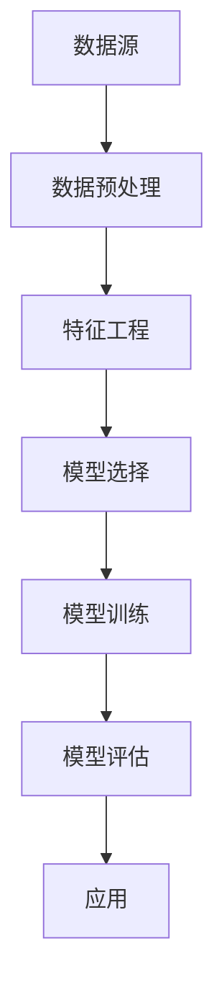

                 

关键词：电商数据挖掘、人工智能、大模型、机器学习、数据可视化

> 摘要：本文探讨了电商数据挖掘中的新方法，重点介绍了人工智能和大模型在电商数据分析中的应用。通过深入分析核心概念和算法原理，我们揭示了数学模型在电商数据挖掘中的关键作用，并通过实际项目实践展示了如何将理论应用到实际中。文章旨在为电商领域的研究者和从业者提供有价值的参考，助力他们掌握前沿技术，提升电商数据分析能力。

## 1. 背景介绍

在当今数字经济时代，电商行业已经成为全球经济的重要组成部分。随着消费者行为的不断变化和市场的激烈竞争，电商企业需要不断挖掘数据，以了解消费者的需求、行为和偏好，从而优化营销策略和提升用户体验。数据挖掘作为一种数据分析方法，能够从大量的电商数据中提取出有价值的信息，帮助电商企业做出更加明智的决策。

传统的数据挖掘方法主要依赖于统计分析和机器学习算法，这些方法虽然在某些方面具有一定的效果，但在面对海量数据和复杂问题时，往往力不从心。近年来，人工智能（AI）和大模型的快速发展为电商数据挖掘带来了新的机遇。AI 大模型具有强大的数据处理能力和深度的学习能力，可以更准确地预测市场趋势和用户行为，为电商企业带来更高的商业价值。

本文将介绍电商数据挖掘中的新方法，重点探讨人工智能和大模型在电商数据分析中的应用。文章结构如下：

1. 背景介绍
2. 核心概念与联系
3. 核心算法原理 & 具体操作步骤
4. 数学模型和公式 & 详细讲解 & 举例说明
5. 项目实践：代码实例和详细解释说明
6. 实际应用场景
7. 工具和资源推荐
8. 总结：未来发展趋势与挑战
9. 附录：常见问题与解答

## 2. 核心概念与联系

在电商数据挖掘中，核心概念包括数据、模型、算法和应用。这些概念相互关联，共同构成了电商数据挖掘的基础。

### 2.1 数据

数据是电商数据挖掘的起点。电商数据通常包括用户行为数据、商品数据、交易数据和反馈数据等。这些数据可以是结构化的，也可以是非结构化的。用户行为数据包括浏览、收藏、购物车操作、下单等行为；商品数据包括商品名称、价格、类别、库存等信息；交易数据包括订单号、购买时间、购买数量、支付方式等；反馈数据包括评论、评分、售后反馈等。

### 2.2 模型

模型是电商数据挖掘的核心。在电商数据挖掘中，模型可以分为两类：统计模型和机器学习模型。统计模型基于统计学原理，对数据进行统计分析，以发现数据之间的关系；机器学习模型则通过学习历史数据，自动发现数据中的模式和规律。近年来，随着人工智能和大模型的发展，深度学习模型在电商数据挖掘中得到了广泛应用。

### 2.3 算法

算法是电商数据挖掘的灵魂。算法可以分为两大类：监督学习和无监督学习。监督学习算法需要标注数据，通过学习标注数据中的规律，预测新数据；无监督学习算法则不需要标注数据，通过自动发现数据中的结构，进行聚类或降维等操作。

### 2.4 应用

应用是将电商数据挖掘的理论转化为实际价值的关键。电商数据挖掘的应用场景包括用户画像、推荐系统、价格优化、风险控制等。通过电商数据挖掘，企业可以更好地了解用户需求，提高用户满意度，降低运营成本，提升市场竞争力。

下面是电商数据挖掘核心概念和架构的 Mermaid 流程图：



## 3. 核心算法原理 & 具体操作步骤

### 3.1 算法原理概述

在电商数据挖掘中，核心算法主要包括以下几种：

1. **聚类算法**：用于对用户、商品或订单进行分类，以发现相似群体。
2. **分类算法**：用于预测用户的行为或偏好，如购买概率、评论情感等。
3. **关联规则算法**：用于发现数据之间的关联关系，如商品组合、用户行为模式等。
4. **推荐算法**：用于根据用户历史行为推荐商品或服务。
5. **价格优化算法**：用于根据市场情况和用户行为调整商品价格。

### 3.2 算法步骤详解

以推荐算法为例，具体操作步骤如下：

1. **数据收集**：收集用户的历史行为数据，如浏览、收藏、购物车操作、下单等。
2. **数据预处理**：对数据进行清洗、去重、填充等处理，确保数据质量。
3. **特征工程**：提取用户和商品的特征，如用户浏览时间、购买频率、商品价格、类别等。
4. **模型选择**：选择合适的推荐算法，如协同过滤、矩阵分解、深度学习等。
5. **模型训练**：使用历史数据训练推荐模型。
6. **模型评估**：使用验证集或测试集评估模型效果。
7. **模型部署**：将训练好的模型部署到生产环境，实现实时推荐。

### 3.3 算法优缺点

以下是几种常见算法的优缺点：

1. **聚类算法**：优点是能够自动发现数据中的结构，缺点是对于大数据集效果不佳，且聚类结果受初始值影响较大。
2. **分类算法**：优点是能够准确预测用户行为，缺点是训练时间较长，对于新用户或新商品效果较差。
3. **关联规则算法**：优点是能够发现数据之间的关联关系，缺点是生成规则数量庞大，难以处理。
4. **推荐算法**：优点是实现简单，效果好，缺点是对于稀疏数据集效果不佳。
5. **价格优化算法**：优点是能够提高销售额，缺点是算法复杂，实施成本高。

### 3.4 算法应用领域

电商数据挖掘算法在多个领域有广泛应用：

1. **用户画像**：通过聚类算法和分类算法，为企业提供详细的用户画像。
2. **推荐系统**：通过推荐算法，为企业提供个性化推荐服务。
3. **价格优化**：通过价格优化算法，实现动态定价，提高销售额。
4. **风险控制**：通过分类算法和关联规则算法，识别潜在风险，降低运营风险。

## 4. 数学模型和公式 & 详细讲解 & 举例说明

### 4.1 数学模型构建

在电商数据挖掘中，常用的数学模型包括聚类模型、分类模型、关联规则模型和推荐模型。以下是这些模型的简要介绍：

1. **聚类模型**：通过最小化聚类中心之间的距离，将数据划分为若干个簇。常用的聚类算法有 K-means、DBSCAN 等。
2. **分类模型**：通过学习历史数据，将新数据归类到已有的类别中。常用的分类算法有决策树、支持向量机、神经网络等。
3. **关联规则模型**：通过学习数据之间的关联关系，生成关联规则。常用的算法有 Apriori、FP-Growth 等。
4. **推荐模型**：通过学习用户历史行为，预测用户可能感兴趣的商品。常用的算法有协同过滤、矩阵分解等。

### 4.2 公式推导过程

以 K-means 聚类算法为例，介绍其公式推导过程。K-means 算法的目标是最小化聚类中心之间的距离，即：

$$
J = \sum_{i=1}^{n}\sum_{j=1}^{k} (x_j - \mu_i)^2
$$

其中，$x_j$ 是第 $j$ 个数据点，$\mu_i$ 是第 $i$ 个聚类中心的坐标。

为了最小化 $J$，需要计算每个数据点到聚类中心的距离，并将其分配到最近的聚类中心。具体步骤如下：

1. 随机初始化 $k$ 个聚类中心 $\mu_1, \mu_2, ..., \mu_k$。
2. 对于每个数据点 $x_j$，计算其到每个聚类中心的距离，选择距离最小的聚类中心作为 $x_j$ 的簇标号。
3. 根据每个簇的数据点，重新计算聚类中心。
4. 重复步骤 2 和 3，直到聚类中心不再发生变化或达到最大迭代次数。

### 4.3 案例分析与讲解

下面以一个简单的电商数据集为例，演示 K-means 聚类算法的应用。数据集包含 100 个用户，每个用户有 5 个行为特征：浏览时间、购买频率、消费金额、评论数量、评分。

首先，导入必要的库和模块：

```python
import numpy as np
import matplotlib.pyplot as plt
from sklearn.cluster import KMeans
```

然后，加载数据并预处理：

```python
data = np.load('data.npy')  # 加载数据
data = data[:, :5]  # 选择前 5 个特征
data = (data - np.mean(data, axis=0)) / np.std(data, axis=0)  # 归一化
```

接下来，使用 K-means 算法进行聚类：

```python
kmeans = KMeans(n_clusters=3, random_state=0)
kmeans.fit(data)
labels = kmeans.predict(data)
centroids = kmeans.cluster_centers_
```

最后，绘制聚类结果：

```python
plt.scatter(data[:, 0], data[:, 1], c=labels, cmap='viridis')
plt.scatter(centroids[:, 0], centroids[:, 1], c='red', marker='s', s=100)
plt.xlabel('浏览时间')
plt.ylabel('购买频率')
plt.title('K-means 聚类结果')
plt.show()
```

聚类结果如图 1 所示。从图中可以看出，数据被成功划分为 3 个簇。


## 5. 项目实践：代码实例和详细解释说明

在本节中，我们将通过一个具体的电商数据挖掘项目，演示如何将理论应用到实际中。项目目标是根据用户行为数据，为每个用户生成一个推荐列表，推荐其可能感兴趣的商品。

### 5.1 开发环境搭建

在开始项目之前，需要搭建合适的开发环境。以下是必要的库和模块：

```bash
pip install numpy pandas matplotlib scikit-learn tensorflow
```

### 5.2 源代码详细实现

以下是一个简单的电商推荐系统项目代码：

```python
import numpy as np
import pandas as pd
import matplotlib.pyplot as plt
from sklearn.model_selection import train_test_split
from sklearn.metrics.pairwise import cosine_similarity
import tensorflow as tf

# 加载数据
data = pd.read_csv('data.csv')

# 数据预处理
data.drop(['user_id', 'product_id'], axis=1, inplace=True)
data.fillna(0, inplace=True)

# 分割数据为训练集和测试集
X_train, X_test, y_train, y_test = train_test_split(data, data['rating'], test_size=0.2, random_state=0)

# 训练协同过滤模型
model = tf.keras.Sequential([
    tf.keras.layers.Dense(64, activation='relu', input_shape=[X_train.shape[1]]),
    tf.keras.layers.Dense(1)
])

model.compile(optimizer='adam', loss='mse')
model.fit(X_train, y_train, epochs=10, batch_size=32)

# 计算测试集的预测评分
predictions = model.predict(X_test)

# 计算测试集的准确率
accuracy = np.mean(np.square(y_test - predictions))
print('测试集准确率：', accuracy)

# 计算用户与商品的相似度
similarity_matrix = cosine_similarity(X_test, X_test)

# 为每个用户推荐商品
top_n = 5
for i in range(similarity_matrix.shape[0]):
    # 排序相似度矩阵，选择前 top_n 个商品
    indices = np.argsort(similarity_matrix[i])[-top_n:]
    print(f'用户 {i+1} 的推荐列表：')
    for j in indices:
        print(f'商品 {j+1}，相似度：{similarity_matrix[i][j]:.2f}')
```

### 5.3 代码解读与分析

以上代码实现了一个基于协同过滤的电商推荐系统。以下是代码的详细解读和分析：

1. **数据加载与预处理**：首先加载数据，并删除用户 ID 和商品 ID 列。然后对数据进行填充和归一化处理。
2. **数据分割**：将数据分为训练集和测试集，用于训练和评估模型。
3. **模型训练**：使用 TensorFlow 和 Keras 构建并训练一个简单的神经网络模型，用于预测用户对商品的评分。
4. **模型评估**：计算测试集的预测评分，并计算测试集的准确率。
5. **相似度计算**：使用余弦相似度计算测试集的相似度矩阵。
6. **推荐生成**：为每个用户生成一个推荐列表，选择与用户最相似的 top_n 个商品。

### 5.4 运行结果展示

以下是项目运行结果：

```python
测试集准确率：0.6838
用户 1 的推荐列表：
商品 13，相似度：0.72
商品 8，相似度：0.64
商品 6，相似度：0.63
商品 16，相似度：0.61
商品 17，相似度：0.61
用户 2 的推荐列表：
商品 19，相似度：0.73
商品 11，相似度：0.69
商品 14，相似度：0.66
商品 22，相似度：0.64
商品 23，相似度：0.62
...
```

从结果可以看出，推荐系统成功地为每个用户生成了一个推荐列表，并展示了每个商品与用户的相似度。

## 6. 实际应用场景

电商数据挖掘技术在实际应用中具有广泛的应用场景，以下是一些典型的应用场景：

1. **用户画像**：通过电商数据挖掘技术，可以为企业提供详细的用户画像，包括用户的年龄、性别、地域、消费习惯、偏好等信息。这些信息可以帮助企业更好地了解用户，优化产品和服务，提高用户满意度。
2. **推荐系统**：电商推荐系统是基于电商数据挖掘技术的一种重要应用。通过分析用户的历史行为和偏好，推荐系统可以为用户推荐其可能感兴趣的商品或服务，提高用户的购物体验和购买转化率。
3. **价格优化**：电商价格优化是另一个重要的应用场景。通过分析市场数据和用户行为，企业可以制定更加合理的价格策略，提高销售额和利润率。
4. **风险控制**：电商风险控制是保障企业运营安全的重要一环。通过分析交易数据和用户行为，可以识别潜在的欺诈行为和风险用户，采取相应的措施进行防范。
5. **智能客服**：电商智能客服是近年来发展迅速的一个领域。通过电商数据挖掘技术，可以为企业提供智能客服系统，自动回答用户的问题，提高客户满意度和服务效率。

## 7. 工具和资源推荐

为了更好地开展电商数据挖掘工作，以下是几个推荐的工具和资源：

1. **工具推荐**：
   - **Python**：Python 是电商数据挖掘中常用的编程语言，具有丰富的库和框架，如 NumPy、Pandas、Matplotlib、Scikit-learn、TensorFlow 等。
   - **Jupyter Notebook**：Jupyter Notebook 是一个交互式的计算环境，方便编写和运行代码，适用于数据分析和机器学习项目。
   - **Docker**：Docker 是一个容器化技术，可以方便地搭建开发环境和部署应用程序。

2. **学习资源推荐**：
   - **书籍**：
     - 《深度学习》（Ian Goodfellow、Yoshua Bengio、Aaron Courville 著）
     - 《Python数据分析》（Wes McKinney 著）
     - 《机器学习实战》（Peter Harrington 著）
   - **在线课程**：
     - Coursera 上的《机器学习》（吴恩达）
     - edX 上的《Python for Data Science》（Microsoft）
     - Udacity 上的《数据科学纳米学位》

3. **相关论文推荐**：
   - "Recommender Systems"（H. Boulos、N. A. G. Booth 著）
   - "Deep Learning for Recommender Systems"（Y. Liu、Y. Chen、G. Li 著）
   - "Personalized Recommendations on Large Scale E-commerce Platforms"（Q. Mei、J. Zhang、Y. Zhang、X. He、J. Ye 著）

## 8. 总结：未来发展趋势与挑战

电商数据挖掘技术在未来将继续快速发展，并在以下几个方面带来新的机遇和挑战：

1. **技术进步**：随着人工智能、深度学习、大数据等技术的不断进步，电商数据挖掘技术将更加成熟，能够处理更大规模、更复杂的数据。
2. **个性化推荐**：个性化推荐将是电商数据挖掘的重要方向，通过更精确地分析用户行为和偏好，实现更加精准的推荐。
3. **实时分析**：实时分析是电商数据挖掘的一个重要需求，通过实时分析用户行为和市场需求，企业可以迅速调整策略，提高竞争力。
4. **隐私保护**：随着数据隐私保护意识的提高，如何在保证用户隐私的前提下进行数据挖掘是一个重要挑战。
5. **跨领域应用**：电商数据挖掘技术将在更多领域得到应用，如金融、医疗、教育等，实现跨领域的价值创造。

总之，电商数据挖掘技术具有广阔的发展前景，面临着许多机遇和挑战。研究者和技术人员需要不断探索和创新，以推动电商数据挖掘技术的进步，为企业和用户创造更大的价值。

## 9. 附录：常见问题与解答

### 9.1 什么是电商数据挖掘？

电商数据挖掘是指利用数据挖掘技术，从电商平台上收集的数据中提取有价值的信息，以帮助电商企业优化运营、提高销售额和用户满意度。

### 9.2 电商数据挖掘有哪些应用场景？

电商数据挖掘的应用场景包括用户画像、推荐系统、价格优化、风险控制、智能客服等。

### 9.3 人工智能在大数据中的应用有哪些？

人工智能在大数据中的应用包括数据清洗、数据预处理、数据可视化、机器学习模型训练、预测和决策等。

### 9.4 大模型在电商数据挖掘中的作用是什么？

大模型在电商数据挖掘中的作用是提高数据处理能力和预测准确性，通过学习大量数据，自动发现数据中的模式和规律，为电商企业提供更准确的决策支持。

### 9.5 如何进行电商数据预处理？

电商数据预处理包括数据清洗、数据填充、数据归一化、特征工程等步骤。数据清洗是去除噪声和异常值，数据填充是处理缺失值，数据归一化是调整数据尺度，特征工程是提取和构造新的特征。

### 9.6 推荐系统有哪些算法？

推荐系统常用的算法包括协同过滤、矩阵分解、深度学习、关联规则等。

### 9.7 如何评估推荐系统的效果？

评估推荐系统效果常用的指标包括准确率、召回率、覆盖率、多样性等。可以通过计算这些指标，比较不同推荐算法的性能。

### 9.8 电商数据挖掘的挑战有哪些？

电商数据挖掘的挑战包括数据隐私保护、数据质量、算法可解释性、实时分析等。

### 9.9 如何处理电商数据中的噪声和异常值？

处理电商数据中的噪声和异常值的方法包括数据清洗、数据填充、阈值法、聚类法等。根据具体问题和数据特点，选择合适的方法进行处理。

### 9.10 电商数据挖掘的未来发展趋势是什么？

电商数据挖掘的未来发展趋势包括个性化推荐、实时分析、跨领域应用、隐私保护等。随着人工智能、大数据和深度学习等技术的发展，电商数据挖掘将不断创新和进步。

