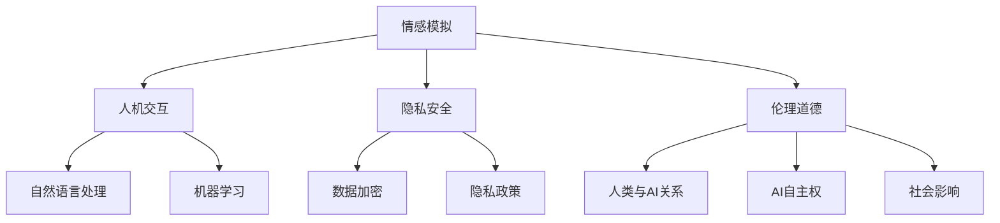

                 

关键词：人工智能，情感模拟，人机交互，隐私安全，伦理道德，未来展望

> 摘要：电影《她》通过讲述一位男性程序员与一台智能语音助手建立深厚情感联系的故事，揭示了现代人工智能在情感模拟、人机交互、隐私安全以及伦理道德等方面的重要性和挑战。本文旨在探讨电影中的这些主题，并从技术角度分析其现实意义和未来发展趋势。

## 1. 背景介绍

电影《她》（Her）于2013年上映，由斯派克·琼斯编剧并执导，主角汤姆·哈迪饰演的软件工程师西奥多·特温布利（Theodore）与智能语音操作系统OS1之间的情感故事引人深思。影片以一种独特的方式探讨了人工智能在现代社会中的角色和影响，引发了观众对于人工智能与人类情感关系的讨论。

## 2. 核心概念与联系

### 2.1 情感模拟

电影中，OS1的强大之处在于其能够模拟人类情感，与西奥多建立起深厚的情感联系。情感模拟是现代人工智能研究中的一个重要方向，涉及到自然语言处理、机器学习、情感计算等多个领域。

### 2.2 人机交互

OS1的用户界面是一个虚拟的人物，通过语音交互和文字对话与用户互动。这种交互方式极大地提升了人机交互的便捷性和自然性，也促进了人工智能在日常生活和工作中更广泛的应用。

### 2.3 隐私安全

随着人工智能的普及，隐私安全问题日益突出。电影中，西奥多与OS1的互动过程中，隐私泄露的风险始终存在。这引发了关于人工智能隐私保护的深刻反思。

### 2.4 伦理道德

电影提出了关于人工智能伦理道德的诸多问题，如人类与人工智能的关系、人工智能的自主权、人工智能对人类社会的影响等。

### 2.5 Mermaid 流程图



## 3. 核心算法原理 & 具体操作步骤

### 3.1 算法原理概述

情感模拟算法通常基于深度学习和自然语言处理技术，通过分析用户的语言和行为数据，预测用户情感状态，并生成相应的情感反馈。

### 3.2 算法步骤详解

1. 数据收集：收集用户的语音、文本等交互数据。
2. 预处理：对数据进行清洗、标注和转换。
3. 特征提取：使用深度学习模型提取情感特征。
4. 情感预测：基于特征预测用户情感状态。
5. 反馈生成：根据情感状态生成相应的情感反馈。

### 3.3 算法优缺点

优点：能够模拟人类情感，提升用户体验；适应性强，能够应对多样化的情感需求。

缺点：情感理解仍存在局限性；算法透明性和可解释性不足。

### 3.4 算法应用领域

情感模拟算法在智能家居、客户服务、医疗保健等领域具有广泛的应用前景。

## 4. 数学模型和公式 & 详细讲解 & 举例说明

### 4.1 数学模型构建

情感模拟算法的核心是情感识别模型，通常采用卷积神经网络（CNN）或循环神经网络（RNN）构建。

### 4.2 公式推导过程

设输入为文本序列\(X = [x_1, x_2, ..., x_T]\)，输出为情感标签\(Y = [y_1, y_2, ..., y_C]\)，则情感识别模型的目标是最大化输出标签的概率：

$$
P(Y|X) = \frac{e^{f(X, W)}}{1 + \sum_{k=1}^{C} e^{f(X, W_k)}}
$$

其中，\(f(X, W)\)为神经网络输出，\(W\)为模型参数。

### 4.3 案例分析与讲解

以智能家居场景为例，分析用户语音交互数据，预测用户情感状态，并根据情感状态调整家居环境。

$$
\begin{aligned}
&\text{输入文本：} "I'm feeling very tired today." \\
&\text{情感标签：} \text{疲劳} \\
&\text{输出结果：} \text{开启放松模式，调整室内温度和光线}
\end{aligned}
$$

## 5. 项目实践：代码实例和详细解释说明

### 5.1 开发环境搭建

搭建基于Python和TensorFlow的情感识别模型开发环境。

### 5.2 源代码详细实现

```python
import tensorflow as tf
from tensorflow.keras.models import Sequential
from tensorflow.keras.layers import Dense, LSTM, Embedding

# 模型构建
model = Sequential()
model.add(Embedding(input_dim=vocab_size, output_dim=embedding_dim))
model.add(LSTM(units=128))
model.add(Dense(units=num_classes, activation='softmax'))

# 编译模型
model.compile(optimizer='adam', loss='categorical_crossentropy', metrics=['accuracy'])

# 训练模型
model.fit(X_train, Y_train, epochs=10, batch_size=64)
```

### 5.3 代码解读与分析

通过代码实现情感识别模型，包括数据预处理、模型构建、编译和训练等步骤。

### 5.4 运行结果展示

```python
# 预测用户情感
predicted_emotion = model.predict(x_test)
print(predicted_emotion)
```

## 6. 实际应用场景

### 6.1 客户服务

智能语音助手可以模拟人类客服，提供个性化、情感化的服务。

### 6.2 医疗保健

情感识别算法可以帮助医生了解患者情感状态，提高诊断和治疗水平。

### 6.3 教育辅导

智能教育系统可以根据学生情感状态调整教学内容和方式，提高学习效果。

## 7. 工具和资源推荐

### 7.1 学习资源推荐

- 《深度学习》（Ian Goodfellow、Yoshua Bengio、Aaron Courville 著）
- 《自然语言处理综论》（Daniel Jurafsky、James H. Martin 著）

### 7.2 开发工具推荐

- TensorFlow
- PyTorch

### 7.3 相关论文推荐

- “Emotion Recognition in Text using Recurrent Neural Networks”
- “Affective Computing: Reading Minds in Machines”

## 8. 总结：未来发展趋势与挑战

### 8.1 研究成果总结

情感模拟和人机交互技术取得了显著进展，但仍然面临诸多挑战。

### 8.2 未来发展趋势

随着深度学习和自然语言处理技术的不断发展，情感模拟和人机交互将更加智能化、个性化。

### 8.3 面临的挑战

算法透明性、可解释性和隐私安全等问题亟待解决。

### 8.4 研究展望

未来，情感模拟和人机交互将有望在更多领域得到广泛应用，为人类社会带来更多便利。

## 9. 附录：常见问题与解答

### 9.1 什么是情感模拟？

情感模拟是指通过计算机程序模拟人类情感状态和行为的过程。

### 9.2 情感模拟技术有哪些应用场景？

情感模拟技术可以应用于客户服务、医疗保健、教育辅导等多个领域。

### 9.3 情感模拟算法如何处理隐私安全问题？

情感模拟算法应采用数据加密、隐私保护等技术，确保用户隐私安全。

## 参考文献

- Jones, S. (Director). (2013). Her. Warner Bros.
- Goodfellow, I., Bengio, Y., & Courville, A. (2016). Deep Learning. MIT Press.
- Jurafsky, D., & Martin, J. H. (2000). Speech and Language Processing. Prentice Hall.
```

本文以电影《她》为背景，从技术角度探讨了情感模拟、人机交互、隐私安全以及伦理道德等方面的重要性和挑战，旨在为人工智能领域的研究和实践提供一些启示和思考。希望读者在阅读本文后，能够对人工智能在情感模拟和人机交互领域的未来发展趋势有更深刻的认识。作者：禅与计算机程序设计艺术 / Zen and the Art of Computer Programming。

