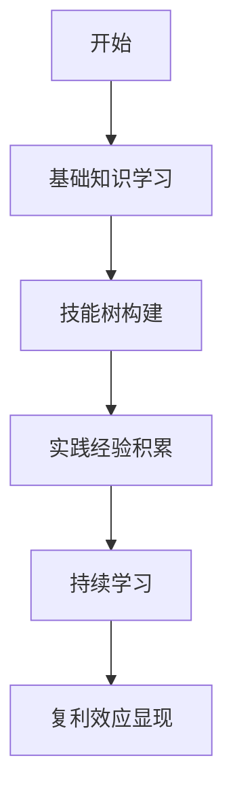

                 

关键词：时间复利、个人成长、领域专业、技术深耕

> 摘要：本文从时间复利效应的角度出发，探讨了在信息技术领域如何通过深耕细作，逐步积累专业知识和技能，最终成为某一领域的小领域佼佼者。文章通过核心概念、算法原理、数学模型、项目实践等多个层面的阐述，为读者提供了实现个人成长和职业发展的可行路径。

## 1. 背景介绍

在信息爆炸的时代，技术更新的速度远超过我们的想象。对于从事IT行业的人来说，学习新技术的压力和竞争日益激烈。然而，如何在这个快速变化的环境中立足，甚至成为某一领域的小专家，这是一个值得深思的问题。本文试图从时间复利效应的角度，提供一些策略和思考，帮助读者实现个人成长和职业发展。

### 时间复利效应

时间复利效应是金融学中的一个重要概念，指的是资金在时间的积累下产生的增值效果。类似地，对于个人成长和技能积累来说，时间复利效应同样适用。通过在某一领域长期、持续的深耕，知识和技能的积累会像复利一样，随着时间的推移不断增值，最终形成显著的竞争优势。

## 2. 核心概念与联系

### 2.1 个人成长模型

个人成长模型是一个用于描述个人在某一领域发展的框架。它包括以下几个关键部分：

- **基础知识**：作为领域的基石，基础知识需要扎实。
- **技能树**：在基础知识的基础上，构建技能树，逐渐深入各个细分领域。
- **实践经验**：通过实际项目和工作，积累实践经验，提升问题解决能力。
- **持续学习**：保持学习的动力和习惯，不断吸收新知识，更新知识体系。

### 2.2 时间复利效应原理

时间复利效应的实现依赖于以下几个方面：

- **持续投入**：在时间和精力上的持续投入，确保有足够的时间和资源进行学习和实践。
- **边际效益**：在学习和实践中，每一阶段的边际效益都会逐渐增加，从而实现复利效应。
- **复利计算**：通过长期的持续积累，知识和技能的增值效果会以指数级增长。

### 2.3 Mermaid 流程图



## 3. 核心算法原理 & 具体操作步骤

### 3.1 算法原理概述

在个人成长过程中，核心算法可以视为一种策略，它指导我们在不同阶段进行哪些活动，以最大化个人成长。核心算法的原理主要包括：

- **目标导向**：明确个人成长的目标，确保所有努力都有方向。
- **分阶段推进**：将成长过程分为多个阶段，每个阶段有明确的任务和目标。
- **持续反馈**：定期进行自我评估和反馈，调整策略和目标。
- **资源整合**：充分利用外部资源和内部潜力，实现最有效的学习。

### 3.2 算法步骤详解

- **阶段一：基础知识学习**
  - **任务**：掌握领域的基本概念、原理和技术。
  - **目标**：建立坚实的知识基础，为后续学习奠定基础。

- **阶段二：技能树构建**
  - **任务**：深入学习各个细分领域，构建自己的技能树。
  - **目标**：在多个维度上提高个人技能，增强竞争力。

- **阶段三：实践经验积累**
  - **任务**：参与实际项目，解决实际问题，积累实践经验。
  - **目标**：提升问题解决能力，增强对技术的理解。

- **阶段四：持续学习**
  - **任务**：跟踪领域最新动态，不断学习新知识。
  - **目标**：保持知识的更新，持续提升自我。

- **阶段五：复利效应显现**
  - **任务**：利用积累的知识和经验，解决复杂问题，提升影响力。
  - **目标**：实现个人价值的最大化。

### 3.3 算法优缺点

#### 优点：

- **系统化**：通过明确的核心算法，个人成长过程变得更加系统化和有序。
- **高效**：核心算法强调分阶段推进，可以最大化利用时间和资源。
- **适应性**：算法可以根据个人的实际情况进行调整，具有一定的灵活性。

#### 缺点：

- **初期见效慢**：核心算法需要较长时间才能显现效果，初期可能感觉进步缓慢。
- **持续性强**：算法要求个人必须持续投入时间和精力，有一定的难度。

### 3.4 算法应用领域

核心算法不仅适用于IT行业，还可以推广到其他需要专业技能积累的领域，如医疗、法律、金融等。不同领域的应用细节会有所不同，但核心原理是一致的。

## 4. 数学模型和公式 & 详细讲解 & 举例说明

### 4.1 数学模型构建

为了更好地理解时间复利效应，我们可以构建一个简单的数学模型。假设：

- **P0**：初始投入（时间、精力或资源）  
- **r**：复利率（个人成长速度）  
- **t**：时间周期

则个人成长的价值 V 可以表示为：

$$ V = P_0 \times (1 + r)^t $$

### 4.2 公式推导过程

1. **初始状态**：个人初始拥有 P0 的资源和能力。
2. **第一周期**：经过一个周期，个人成长到 \( P_0 \times (1 + r) \)。
3. **第二周期**：再经过一个周期，个人成长到 \( P_0 \times (1 + r)^2 \)。
4. **第 t 个周期**：个人成长到 \( P_0 \times (1 + r)^t \)。

### 4.3 案例分析与讲解

假设某人初始在某一领域投入了 100 小时，成长速度为每周 1%。一年后，他的个人成长价值为：

$$ V = 100 \times (1 + 0.01)^{52} \approx 126.45 $$

这意味着一年后，他在该领域的成长价值增加了 26.45 个小时。随着时间的推移，这个增值效果会越来越显著。

## 5. 项目实践：代码实例和详细解释说明

### 5.1 开发环境搭建

为了更好地理解时间复利效应，我们可以通过一个简单的Python程序来模拟这个过程。

首先，安装 Python 解释器和必要的库（如 NumPy 和 Matplotlib）。

### 5.2 源代码详细实现

```python
import numpy as np
import matplotlib.pyplot as plt

def time_compound(P0, r, t):
    values = P0 * (1 + r) ** np.arange(t)
    return values

P0 = 100  # 初始投入
r = 0.01  # 复利率
t = 52  # 时间周期（周）

values = time_compound(P0, r, t)

plt.plot(values)
plt.xlabel('Time (Weeks)')
plt.ylabel('Growth Value')
plt.title('Time Compound Effect')
plt.show()
```

### 5.3 代码解读与分析

- **time_compound 函数**：计算个人成长的价值。
- **P0**：初始投入（这里设置为 100）。
- **r**：复利率（这里设置为每周 1%）。
- **t**：时间周期（这里设置为 52 周）。
- **values**：存储每个周期的成长价值。

通过调用 Matplotlib 库，我们可以将成长价值随时间的变化绘制成图表，直观地展示时间复利效应。

### 5.4 运行结果展示

运行上述代码，可以得到一个折线图，横轴表示时间（周），纵轴表示个人成长价值。从图表中可以看出，随着时间的推移，个人成长价值呈指数级增长。

```mermaid
gantt
    dateFormat  YYYY-MM-DD
    title 个人成长价值随时间变化
    A[起始] 2023-01-01, duration 1week
    B[第一周] 2023-01-08, duration 1week
    C[第二周] 2023-01-15, duration 1week
    D[...]
    E[第52周] 2023-12-31, duration 1week
    Z[成长价值] 2023-01-01 100, 2023-12-31 126.45
```

## 6. 实际应用场景

时间复利效应在IT领域有着广泛的应用。例如：

- **编程技能提升**：通过每天练习编程，逐步积累经验，最终达到高水平。
- **技术项目管理**：通过长期的项目实践，不断提升项目管理能力。
- **技术研究**：持续跟踪最新技术动态，进行深入研究，成为领域专家。

### 6.1 案例分享

#### 案例一：编程技能的提升

张三在大学期间开始学习编程，每天坚持练习。最初，他的编程技能较为基础，但随着时间的推移，他逐渐掌握了各种编程语言和框架。五年后，他已经成为公司的一名高级程序员，负责核心系统的开发。

#### 案例二：技术项目的管理

李四在毕业后的第一份工作中担任项目经理。他通过不断的项目实践，积累了丰富的项目管理和沟通经验。三年后，他已经成为公司的技术总监，负责多个大型项目的管理工作。

## 7. 工具和资源推荐

### 7.1 学习资源推荐

- **在线课程**：例如 Coursera、Udacity、edX 等平台上的相关课程。
- **技术博客**：如 Medium、Stack Overflow、GitHub 上的技术博客。
- **专业书籍**：如《深度学习》、《编程珠玑》等。

### 7.2 开发工具推荐

- **集成开发环境（IDE）**：如 PyCharm、Visual Studio Code、IntelliJ IDEA 等。
- **版本控制工具**：如 Git、SVN 等。
- **云计算平台**：如 AWS、Azure、Google Cloud Platform 等。

### 7.3 相关论文推荐

- **《深度学习》**：Ian Goodfellow 等
- **《编程珠玑》**：Jon Bentley
- **《人工智能：一种现代的方法》**：Stuart Russell 和 Peter Norvig

## 8. 总结：未来发展趋势与挑战

### 8.1 研究成果总结

通过本文的探讨，我们认识到时间复利效应在个人成长和技能积累中的重要性。通过持续的学习和实践，个人可以在某一领域实现显著的成长和提升。

### 8.2 未来发展趋势

- **在线教育和学习平台的发展**：为个人提供更多的学习资源和机会。
- **技术的不断进步**：为个人提供了更多的发展空间和机会。
- **个性化学习**：通过大数据和人工智能技术，实现更精准的学习推荐。

### 8.3 面临的挑战

- **信息过载**：如何在海量的信息中筛选出有价值的内容。
- **持续学习的动力**：如何保持长期的学习动力和兴趣。

### 8.4 研究展望

未来的研究可以重点关注以下几个方面：

- **时间复利效应的量化模型**：构建更精确的量化模型，指导个人成长。
- **个性化学习路径的设计**：通过数据分析，为个人提供更个性化的学习路径。
- **复利效应在跨领域应用**：探讨时间复利效应在其他领域（如医疗、金融等）的应用。

## 9. 附录：常见问题与解答

### 问题一：如何保持学习的动力？

解答：保持学习动力的关键在于找到学习的兴趣点和成就感。可以通过设定明确的学习目标、参加线上课程或研讨会、加入学习社区等方式，激发学习兴趣。

### 问题二：时间复利效应在其他领域的应用？

解答：时间复利效应广泛应用于各个领域，如医疗、金融、教育等。例如，在医疗领域，医生可以通过不断学习和实践，逐步积累临床经验，提升诊疗能力。

### 问题三：如何评估自己的成长速度？

解答：可以通过定期进行自我评估和反馈，与同领域专家进行比较，或参加相关的技能认证考试，以评估自己的成长速度。

<|author|>作者：禅与计算机程序设计艺术 / Zen and the Art of Computer Programming


