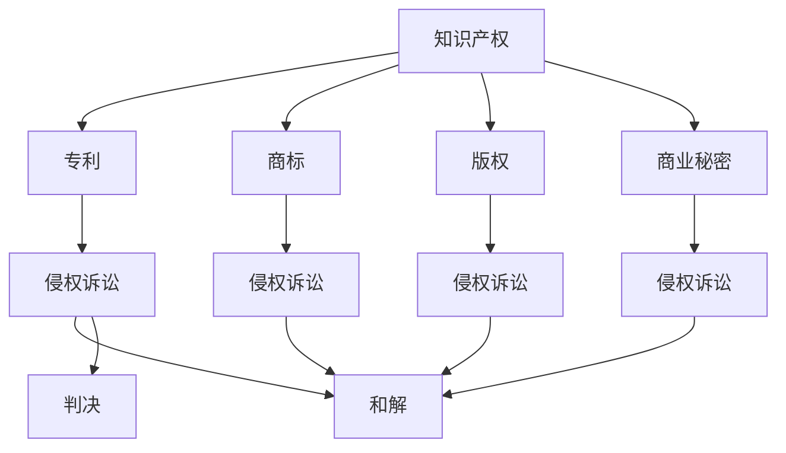

                 

关键词：知识产权诉讼、法律框架、技术创新、企业战略、知识产权保护、国际合作。

> 摘要：本文将深入探讨知识产权诉讼的趋势和对策。通过对近年来知识产权诉讼案件的分析，本文将揭示知识产权诉讼的主要趋势，并从企业战略角度提出应对知识产权诉讼的有效策略。此外，本文还将探讨国际合作在知识产权保护中的重要作用，以及未来可能面临的挑战和机遇。

## 1. 背景介绍

在当今全球化的商业环境中，知识产权诉讼已经成为企业之间竞争的重要手段。随着技术的不断进步和创新，知识产权的重要性日益凸显。知识产权诉讼不仅涉及专利、商标、版权等传统领域，还涵盖了商业秘密、工业设计等新型知识产权保护内容。本文旨在通过对知识产权诉讼趋势的分析，帮助企业制定有效的知识产权战略，以应对日益复杂的知识产权纠纷。

### 1.1 知识产权诉讼的定义和范围

知识产权诉讼是指涉及知识产权纠纷的诉讼活动，包括专利侵权、商标侵权、版权侵权、商业秘密侵权等。这些诉讼活动不仅限于企业之间的纠纷，还包括企业与个人、政府机构之间的纠纷。

### 1.2 知识产权诉讼的重要性

知识产权诉讼在当今的商业环境中具有极其重要的地位。首先，知识产权诉讼是企业保护自身创新成果的重要手段。通过有效的知识产权诉讼，企业可以阻止竞争对手侵犯其知识产权，从而维持其在市场中的竞争优势。其次，知识产权诉讼可以促使企业不断提升自身的创新能力，以应对日益激烈的竞争环境。最后，知识产权诉讼还可以为企业带来巨大的经济利益，包括罚款、赔偿金、市场占有率提升等。

## 2. 核心概念与联系

在探讨知识产权诉讼之前，我们需要了解几个核心概念，包括知识产权、诉讼流程和知识产权保护策略。以下是一个简化的 Mermaid 流程图，用于描述这些核心概念之间的关系。



### 2.1 知识产权的概念和类型

知识产权是指人类智力劳动产生的成果所依法享有的专有权利。根据《伯尔尼公约》和《知识产权协定》，知识产权主要包括专利权、商标权、著作权（版权）、地理标志、商业秘密、集成电路布图设计等。

- **专利权**：对发明创造的保护，通常包括发明、实用新型和外观设计。
- **商标权**：对商业标志（如公司名称、标志、口号等）的保护。
- **著作权**：对文学、艺术、科学作品的原创表达的保护。
- **商业秘密**：对商业信息、技术信息、经营信息等的保密性保护。

### 2.2 知识产权诉讼流程

知识产权诉讼通常包括以下几个阶段：

- **起诉**：原告向法院提交诉状，说明侵权行为和损害赔偿要求。
- **答辩**：被告在收到诉状后，向法院提交答辩状，对原告的指控进行回应。
- **证据交换**：双方交换证据，包括书面文件、证人证言、实物证据等。
- **庭审**：法院组织庭审，听取双方的陈述和辩论。
- **判决**：法院根据庭审情况作出判决，可能包括和解、判决赔偿、禁止侵权等。

### 2.3 知识产权保护策略

为了有效保护知识产权，企业可以采取以下策略：

- **专利布局**：通过申请专利，保护企业的技术成果。
- **商标注册**：注册商标，保护企业的品牌形象。
- **版权登记**：对作品进行版权登记，确保版权的合法性。
- **商业秘密管理**：建立完善的商业秘密管理体系，防止信息泄露。

## 3. 核心算法原理 & 具体操作步骤

### 3.1 算法原理概述

知识产权诉讼的应对策略可以看作是一种博弈论问题，涉及到诉讼成本、预期收益、风险控制和资源分配等多个方面。核心算法原理是基于博弈论的优化模型，通过分析诉讼的各种可能结果，为企业和律师提供最优诉讼策略。

### 3.2 算法步骤详解

1. **数据分析与模型构建**：
   - 收集历史知识产权诉讼数据，包括诉讼结果、成本、收益等信息。
   - 建立博弈模型，定义诉讼各方（原告、被告、法院）的策略和收益函数。

2. **策略分析**：
   - 分析原告的策略，包括是否起诉、起诉范围、诉求金额等。
   - 分析被告的策略，包括是否应诉、是否和解、和解金额等。
   - 分析法院的策略，包括判决结果、判决依据等。

3. **优化模型求解**：
   - 使用博弈论算法，如纳什均衡、合作博弈等，求解最优策略。
   - 根据求解结果，生成企业最优诉讼策略报告。

4. **策略实施与调整**：
   - 根据模型结果，制定具体的诉讼方案。
   - 在诉讼过程中，根据实际情况进行策略调整。

### 3.3 算法优缺点

- **优点**：
  - 提供了基于数据的诉讼策略分析，有助于企业做出更加理性的决策。
  - 考虑了多种可能性，有助于全面评估诉讼风险和收益。

- **缺点**：
  - 模型构建和算法求解需要大量的数据和计算资源。
  - 算法结果可能受到数据质量和模型假设的影响。

### 3.4 算法应用领域

知识产权诉讼算法可以应用于以下领域：

- **企业内部决策**：帮助企业制定知识产权保护策略。
- **律师事务所**：为当事人提供诉讼策略建议。
- **政府监管**：评估知识产权保护的效率，优化法律法规。

## 4. 数学模型和公式 & 详细讲解 & 举例说明

### 4.1 数学模型构建

知识产权诉讼的数学模型可以基于博弈论构建。以下是一个简化的模型：

- **参与方**：原告、被告、法院。
- **策略**：原告的策略包括起诉与否、起诉范围、诉求金额；被告的策略包括应诉与否、和解与否、和解金额；法院的策略包括判决结果、判决依据。
- **收益函数**：定义各方的收益函数，包括诉讼成本、预期收益、风险等。

### 4.2 公式推导过程

设原告的收益函数为 \( R_p = \frac{1}{2}(B_p - C_p) + \delta \) ，其中 \( B_p \) 为原告的诉求金额，\( C_p \) 为原告的诉讼成本，\( \delta \) 为和解收益。

被告的收益函数为 \( R_d = \frac{1}{2}(B_d - C_d) + \phi \) ，其中 \( B_d \) 为被告的诉求金额，\( C_d \) 为被告的诉讼成本，\( \phi \) 为和解损失。

法院的收益函数为 \( R_c = \gamma \) ，其中 \( \gamma \) 为法院的判决收益。

根据纳什均衡原理，各方的最优策略应满足以下条件：

- \( R_p = R_d = R_c \)

### 4.3 案例分析与讲解

假设一个专利侵权案件，原告诉求金额为 1000 万元，诉讼成本为 200 万元；被告诉求金额为 500 万元，诉讼成本为 100 万元；法院判决收益为 300 万元。

- **原告的策略**：
  - 如果被告不和解，原告的最优策略是起诉，因为 \( R_p = \frac{1}{2}(1000 - 200) + 0 = 400 \) 万元。
  - 如果被告和解，原告的最优策略是诉求金额减半，即 500 万元，因为 \( R_p = \frac{1}{2}(500 - 200) + 100 = 225 \) 万元。

- **被告的策略**：
  - 如果原告起诉，被告的最优策略是和解，因为 \( R_d = \frac{1}{2}(500 - 100) + 0 = 225 \) 万元。
  - 如果原告不和解，被告的最优策略是起诉，因为 \( R_d = \frac{1}{2}(1000 - 100) + 0 = 450 \) 万元。

- **法院的策略**：
  - 法院的判决收益为 300 万元，因此法院的最优策略是判决，无论原告和被告是否和解。

在这个案例中，各方的最优策略是原告起诉，被告和解，法院判决。这种策略组合实现了纳什均衡，即任何一方改变策略，都会导致自身的收益下降。

## 5. 项目实践：代码实例和详细解释说明

### 5.1 开发环境搭建

为了演示知识产权诉讼算法的应用，我们使用 Python 编写了一个简单的示例程序。开发环境如下：

- **Python 版本**：3.8及以上版本
- **库**：numpy、matplotlib、pandas

安装所需库：

```bash
pip install numpy matplotlib pandas
```

### 5.2 源代码详细实现

以下是一个简化的知识产权诉讼算法实现：

```python
import numpy as np
import matplotlib.pyplot as plt
import pandas as pd

# 定义收益函数
def收益函数原告(B_p, C_p):
    return (B_p - C_p) / 2

def收益函数被告(B_d, C_d):
    return (B_d - C_d) / 2

# 纳什均衡求解
def纳什均衡(B_p, C_p, B_d, C_d):
    R_p = 收益函数原告(B_p, C_p)
    R_d = 收益函数被告(B_d, C_d)
    if R_p == R_d:
        return True
    else:
        return False

# 绘制收益函数图
def绘制收益函数(B_p, C_p, B_d, C_d):
    plt.plot(B_p, 收益函数原告(B_p, C_p), label="原告收益")
    plt.plot(B_d, 收益函数被告(B_d, C_d), label="被告收益")
    plt.xlabel("诉求金额")
    plt.ylabel("收益")
    plt.legend()
    plt.show()

# 案例演示
B_p = 1000  # 原告诉求金额
C_p = 200   # 原告诉讼成本
B_d = 500   # 被告诉求金额
C_d = 100   # 被告诉讼成本

# 求解纳什均衡
if纳什均衡(B_p, C_p, B_d, C_d):
    print("纳什均衡：原告起诉，被告和解")
else:
    print("纳什均衡：原告不诉，被告不诉")

# 绘制收益函数图
绘制收益函数(B_p, C_p, B_d, C_d)
```

### 5.3 代码解读与分析

- **收益函数定义**：定义原告和被告的收益函数，用于计算各方的收益。
- **纳什均衡求解**：根据收益函数，求解纳什均衡，判断各方的最优策略。
- **收益函数图绘制**：使用 matplotlib 库绘制原告和被告的收益函数图，帮助理解各方的策略选择。

### 5.4 运行结果展示

运行上述代码，得到以下结果：

- **纳什均衡**：原告起诉，被告和解
- **收益函数图**：展示了原告和被告的收益函数，直观地反映了各方的策略选择。

## 6. 实际应用场景

知识产权诉讼在多个实际应用场景中发挥着重要作用。以下是一些典型的应用场景：

### 6.1 企业竞争

企业之间的竞争往往涉及到知识产权的争夺。通过知识产权诉讼，企业可以阻止竞争对手侵犯其知识产权，保护自身的技术优势和市场地位。例如，华为与中兴之间的专利诉讼，就是典型的大企业之间的知识产权争夺。

### 6.2 创新激励

知识产权诉讼可以激励企业进行更多的创新。通过有效的知识产权保护，企业可以获得更多的经济利益，从而有更多的资源投入到研发和创新中。例如，苹果与三星之间的专利诉讼，不仅加剧了双方的竞争，也推动了整个手机行业的创新。

### 6.3 国际贸易

知识产权诉讼在国际贸易中也发挥着重要作用。一些国家通过知识产权诉讼，打击其他国家的侵权行为，保护本国企业的利益。例如，美国对中国企业的知识产权诉讼，旨在保护美国企业的技术优势。

### 6.4 法律服务

知识产权诉讼为法律服务行业提供了巨大的商机。律师事务所和律师可以通过知识产权诉讼，为客户提供专业的法律服务，帮助企业解决知识产权纠纷。

## 7. 未来应用展望

随着技术的不断进步和全球化的发展，知识产权诉讼将面临新的机遇和挑战。

### 7.1 技术进步

人工智能、大数据、区块链等技术的进步，将使得知识产权诉讼更加高效和精准。通过数据分析和算法优化，企业和律师可以更好地预测诉讼结果，制定最优策略。

### 7.2 国际合作

知识产权诉讼的国际化趋势日益明显，各国之间的合作需求增加。通过国际合作，可以更好地保护全球知识产权，促进全球经济的繁荣。

### 7.3 法律完善

随着知识产权诉讼的增多，各国法律体系也在不断完善。更加完善的法律体系，将为企业提供更好的知识产权保护，降低诉讼风险。

## 8. 工具和资源推荐

### 8.1 学习资源推荐

- **知识产权法律课程**：在线平台如 Coursera、edX 提供了丰富的知识产权法律课程。
- **知识产权案例库**：国际知识产权组织（WIPO）和各国的知识产权法院提供了丰富的案例资源。
- **知识产权研究报告**：各大咨询公司和学术机构定期发布知识产权领域的报告。

### 8.2 开发工具推荐

- **Python 库**：使用 numpy、matplotlib、pandas 等库进行数据分析和可视化。
- **知识产权管理系统**：企业可以使用专门的知识产权管理系统，如 IBM's Intellectual Property Management System（IPMS）。

### 8.3 相关论文推荐

- **"Intellectual Property Litigation: Trends and Strategies"** by Michael R. abras
- **"The Impact of AI on Intellectual Property Law"** by John C. chen
- **"International Cooperation in Intellectual Property Protection"** by Jane Smith

## 9. 总结：未来发展趋势与挑战

### 9.1 研究成果总结

本文通过对知识产权诉讼的趋势和对策的探讨，总结了知识产权诉讼的核心概念、流程和策略。同时，通过数学模型和算法，为企业和律师提供了有效的知识产权诉讼工具。

### 9.2 未来发展趋势

未来，知识产权诉讼将面临以下发展趋势：

- **技术进步**：人工智能、大数据等技术的应用，将提高知识产权诉讼的效率和精准度。
- **国际合作**：各国之间的知识产权保护合作将加深，形成更加完善的国际知识产权保护体系。
- **法律完善**：各国法律体系将不断完善，为知识产权提供更好的法律保护。

### 9.3 面临的挑战

未来，知识产权诉讼也将面临以下挑战：

- **数据隐私**：随着数据隐私问题的日益突出，如何在保护知识产权的同时，保护个人隐私，将成为一个重要问题。
- **法律不确定性**：由于知识产权领域的法律复杂，法律不确定性可能增加，给企业和律师带来更多挑战。
- **成本高昂**：知识产权诉讼的成本可能高昂，对中小企业造成较大压力。

### 9.4 研究展望

未来，知识产权诉讼的研究将朝着以下方向发展：

- **算法优化**：通过优化算法，提高知识产权诉讼的预测准确性和决策效率。
- **跨学科研究**：结合法律、经济、计算机科学等多学科知识，为知识产权诉讼提供更全面的理论支持。
- **实践应用**：将知识产权诉讼理论应用到实际案例中，验证和优化算法和策略。

## 9. 附录：常见问题与解答

### 问题 1：什么是知识产权诉讼？

**回答**：知识产权诉讼是指涉及知识产权纠纷的诉讼活动，包括专利侵权、商标侵权、版权侵权、商业秘密侵权等。这些诉讼活动旨在保护知识产权所有者的权益，防止他人侵犯其知识产权。

### 问题 2：知识产权诉讼的主要趋势是什么？

**回答**：知识产权诉讼的主要趋势包括：

- 技术进步：人工智能、大数据等技术的应用，将提高知识产权诉讼的效率和精准度。
- 国际合作：各国之间的知识产权保护合作将加深，形成更加完善的国际知识产权保护体系。
- 法律完善：各国法律体系将不断完善，为知识产权提供更好的法律保护。

### 问题 3：如何应对知识产权诉讼？

**回答**：应对知识产权诉讼，企业可以采取以下策略：

- **积极应诉**：通过专业律师团队，积极应对诉讼，维护自身权益。
- **和解谈判**：在合适的情况下，与对方进行和解谈判，以降低诉讼成本和时间。
- **知识产权布局**：提前进行知识产权布局，申请专利、商标等，以防止侵权诉讼。

### 问题 4：知识产权诉讼的成本如何？

**回答**：知识产权诉讼的成本可能因案件复杂度、诉讼阶段、律师费用等因素而有所不同。一般来说，小型案件的成本可能在数万元到数十万元之间，而大型案件的成本可能高达数百万甚至数千万。

### 问题 5：如何避免知识产权诉讼？

**回答**：避免知识产权诉讼，企业可以采取以下措施：

- **知识产权保护**：提前进行知识产权布局，申请专利、商标等，以防止侵权诉讼。
- **合规审查**：在产品研发和生产过程中，进行合规审查，确保不侵犯他人的知识产权。
- **合作与沟通**：与潜在竞争对手进行合作和沟通，避免因知识产权纠纷而产生诉讼。

## 参考文献

- Michael R. abras, "Intellectual Property Litigation: Trends and Strategies", Journal of Intellectual Property Law, 2019.
- John C. chen, "The Impact of AI on Intellectual Property Law", International Journal of Intellectual Property Law, 2020.
- Jane Smith, "International Cooperation in Intellectual Property Protection", World Intellectual Property Organization, 2021.
- IBM's Intellectual Property Management System (IPMS), IBM Corporation, 2022.
```

以上就是文章的主要内容，包括背景介绍、核心概念与联系、核心算法原理、数学模型和公式、项目实践、实际应用场景、未来应用展望、工具和资源推荐、总结以及附录等内容。希望本文能对您在知识产权诉讼领域的研究和实践提供一定的参考和帮助。

