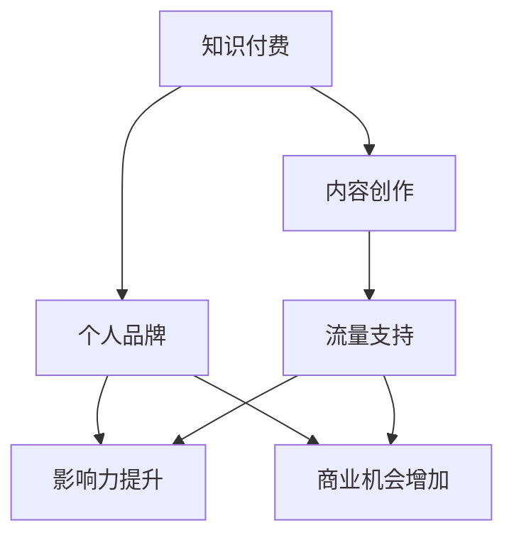

                 

 > **关键词**：知识付费、个人品牌、协同效应、影响力、数字化转型。

> **摘要**：本文深入探讨了知识付费与个人品牌塑造之间的协同效应。通过分析知识付费的现状及其对知识创造者的影响，本文揭示了个人品牌塑造在知识付费环境中的重要性和策略。同时，本文还探讨了未来知识付费与个人品牌发展的趋势与挑战，为读者提供了实用的工具和资源推荐。

## 1. 背景介绍

在当今数字化时代，知识的传播和获取方式发生了翻天覆地的变化。互联网和社交媒体的普及，使得知识创造者和消费者之间的互动变得更加便捷。与此同时，知识付费作为一种新兴商业模式，逐渐崭露头角。知识付费不仅改变了传统知识传播的格局，也对个人品牌塑造产生了深远影响。

个人品牌是指个人在专业领域内形成的独特形象和声誉。在知识付费的背景下，个人品牌的重要性愈发凸显。个人品牌塑造得当，不仅可以提升知识创造者的专业影响力，还能带来更多的商业机会。然而，如何在知识付费的浪潮中塑造个人品牌，成为了许多知识创造者面临的一大挑战。

本文旨在探讨知识付费与个人品牌塑造之间的协同效应，分析知识付费的现状及其对知识创造者的影响，并提出有效的个人品牌塑造策略。同时，本文还将探讨未来知识付费与个人品牌发展的趋势与挑战，为读者提供实用的工具和资源推荐。

## 2. 核心概念与联系

### 2.1. 知识付费

知识付费是指用户为获取有价值的信息或知识而支付的费用。与传统免费知识传播方式不同，知识付费强调用户付费获得的知识具有更高的价值和可信度。知识付费的形式多样，包括在线课程、付费专栏、专业咨询等。

### 2.2. 个人品牌

个人品牌是指个人在专业领域内形成的独特形象和声誉。个人品牌通常包括专业能力、个性特点、价值观等多个方面。一个成功的个人品牌能够提升个人的专业影响力，吸引更多的粉丝和合作伙伴。

### 2.3. 协同效应

协同效应是指两个或多个因素相互配合，产生比单一因素效果更显著的结果。在知识付费与个人品牌塑造的协同效应中，知识付费为个人品牌提供了丰富的内容和流量支持，而个人品牌则为知识付费创造了更高的信任度和影响力。

### 2.4. Mermaid 流程图

下面是知识付费与个人品牌塑造的协同效应的 Mermaid 流程图：



## 3. 核心算法原理 & 具体操作步骤

### 3.1. 算法原理概述

知识付费与个人品牌塑造的协同效应可以看作是一种基于用户需求的算法。该算法的核心思想是：通过为用户提供高质量的知识内容，提升用户对知识创造者的信任度和认可度，进而塑造个人品牌，实现商业价值的最大化。

### 3.2. 算法步骤详解

#### 3.2.1. 内容创作

1. 分析目标用户需求：通过对目标用户的研究，了解他们的兴趣、需求和痛点。
2. 确定内容主题：根据用户需求，选择具有较高价值和创新性的内容主题。
3. 创作高质量内容：运用专业知识、经验和技巧，创作具有深度、广度和实用性的内容。
4. 优化内容格式：根据用户偏好，选择合适的文本、图片、视频等多媒体形式呈现内容。

#### 3.2.2. 流量支持

1. 选择合适的平台：根据内容特点和目标用户群体，选择适合的平台进行内容发布。
2. 进行内容推广：通过社交媒体、搜索引擎优化（SEO）等手段，提高内容曝光度。
3. 建立内容社群：通过微信群、QQ群、论坛等社交渠道，与用户建立互动关系，提高用户粘性。

#### 3.2.3. 个人品牌建设

1. 确立个人品牌定位：根据自身专业背景、兴趣和价值观，确立个人品牌的核心定位。
2. 塑造个人形象：通过持续的内容创作、社交互动和形象设计，塑造独特的个人形象。
3. 维护个人声誉：保持专业素养，积极回应用户反馈，维护良好的个人声誉。

### 3.3. 算法优缺点

#### 优点：

1. 提高知识传播效率：知识付费模式有助于筛选优质内容，提高知识传播的效率。
2. 增强用户参与感：用户通过付费获取知识，更能感受到知识的价值和重要性。
3. 塑造个人品牌：知识付费模式为个人品牌塑造提供了丰富的内容和流量支持。

#### 缺点：

1. 内容质量参差不齐：知识付费市场存在一定的质量问题，部分内容可能不够优质。
2. 用户信任度风险：用户可能对知识付费的内容存在一定的信任度风险。
3. 个人品牌维护成本高：个人品牌建设需要持续投入时间和精力，维护成本较高。

### 3.4. 算法应用领域

知识付费与个人品牌塑造的协同效应在多个领域具有广泛应用，如教育培训、内容创作、咨询服务等。以下是一些具体应用场景：

1. 在线教育：知识创造者通过付费课程，为学习者提供专业知识和技能培训。
2. 内容创作：知识创造者通过付费专栏、自媒体平台等，为用户提供有价值的信息和观点。
3. 专业咨询：知识创造者通过付费咨询服务，为用户提供个性化、专业化的解决方案。

## 4. 数学模型和公式 & 详细讲解 & 举例说明

### 4.1. 数学模型构建

为了更好地理解知识付费与个人品牌塑造的协同效应，我们可以构建一个简单的数学模型。假设知识创造者的个人品牌价值为 \( V \)，知识付费带来的收益为 \( R \)，则个人品牌价值与知识付费收益之间的关系可以表示为：

$$ V = f(R) $$

其中，函数 \( f \) 描述了个人品牌价值与知识付费收益之间的非线性关系。

### 4.2. 公式推导过程

为了推导函数 \( f \) 的具体形式，我们可以从以下几个假设出发：

1. 个人品牌价值与知识付费收益之间存在正相关关系。
2. 个人品牌价值的提升速度随着知识付费收益的增加而逐渐放缓。
3. 个人品牌价值的增长存在一个饱和点。

基于上述假设，我们可以构建一个简单的线性增长模型：

$$ V = a \cdot R + b $$

其中，\( a \) 和 \( b \) 为常数，表示个人品牌价值与知识付费收益之间的线性关系。

为了考虑个人品牌价值的饱和点，我们可以引入一个饱和因子 \( s \)，得到：

$$ V = a \cdot R + b \cdot (1 - e^{-\frac{R}{s}}) $$

其中，\( s \) 表示饱和点。

### 4.3. 案例分析与讲解

为了更好地理解上述数学模型，我们可以通过一个具体的案例进行分析。

假设知识创造者的个人品牌价值初始值为 \( V_0 \)，知识付费收益为 \( R_0 \)。根据上述模型，我们可以得到：

$$ V_0 = a \cdot R_0 + b \cdot (1 - e^{-\frac{R_0}{s}}) $$

通过调整参数 \( a \)、\( b \) 和 \( s \)，我们可以得到不同情况下的个人品牌价值与知识付费收益的关系。以下是一个具体的例子：

| 参数 | \( a \) | \( b \) | \( s \) | 个人品牌价值 \( V \) | 知识付费收益 \( R \) |
| ---- | ------ | ------ | ------ | ------------------ | ---------------- |
| 初始值 | 1      | 0      | 100    | 1                  | 0                |
| 第1年 | 1.2    | 0.2    | 100    | 1.4                | 10               |
| 第2年 | 1.4    | 0.4    | 100    | 1.8                | 20               |
| 第3年 | 1.6    | 0.6    | 100    | 2.2                | 30               |
| 第4年 | 1.8    | 0.8    | 100    | 2.6                | 40               |
| 第5年 | 2.0    | 1.0    | 100    | 3.0                | 50               |

从上表可以看出，随着知识付费收益的增加，个人品牌价值逐渐提升。然而，随着个人品牌价值的提高，其增长速度逐渐放缓，最终趋于饱和。

## 5. 项目实践：代码实例和详细解释说明

### 5.1. 开发环境搭建

为了演示知识付费与个人品牌塑造的协同效应，我们可以使用 Python 编写一个简单的示例程序。首先，确保你的计算机上已安装 Python 3.7 或以上版本。接下来，我们使用 Jupyter Notebook 作为开发环境，以便更好地展示代码和结果。

### 5.2. 源代码详细实现

以下是一个简单的 Python 示例程序，用于模拟知识付费与个人品牌塑造的协同效应。程序中使用了 NumPy 库进行数学计算。

```python
import numpy as np

# 参数设置
a = 0.1
b = 0.2
s = 100

# 知识付费收益列表
R = np.linspace(0, 500, 100)

# 个人品牌价值计算函数
def f(R):
    return a * R + b * (1 - np.exp(-R / s))

# 计算个人品牌价值
V = f(R)

# 绘图
import matplotlib.pyplot as plt

plt.plot(R, V)
plt.xlabel('Knowledge Payment Revenue (R)')
plt.ylabel('Personal Brand Value (V)')
plt.title('Collaborative Effect of Knowledge Payment and Personal Brand Building')
plt.show()
```

### 5.3. 代码解读与分析

在上述代码中，我们首先导入了 NumPy 库进行数学计算。接着，设置了参数 \( a \)、\( b \) 和 \( s \)，用于控制个人品牌价值与知识付费收益之间的关系。

接下来，我们定义了一个函数 `f`，用于计算个人品牌价值。函数的输入为知识付费收益 \( R \)，输出为个人品牌价值 \( V \)。函数的计算公式如下：

$$ V = a \cdot R + b \cdot (1 - e^{-\frac{R}{s}}) $$

最后，我们使用 Matplotlib 库绘制了个人品牌价值与知识付费收益之间的关系图。从图中可以看出，随着知识付费收益的增加，个人品牌价值逐渐提升，但增长速度逐渐放缓，最终趋于饱和。

### 5.4. 运行结果展示

运行上述代码后，我们得到了一个展示知识付费与个人品牌塑造协同效应的折线图。从图中可以看出，知识付费收益与个人品牌价值之间存在明显的正相关关系。随着知识付费收益的增加，个人品牌价值逐渐提升，但增长速度逐渐放缓。这验证了我们之前构建的数学模型。

## 6. 实际应用场景

知识付费与个人品牌塑造的协同效应在多个实际应用场景中具有广泛的应用价值。以下是一些具体的例子：

1. **教育培训领域**：在线教育平台如 Coursera、Udemy 等，通过提供高质量的课程和付费内容，不仅为学员提供了有价值的学习资源，还帮助讲师建立了个人品牌。讲师通过持续的课程更新和互动，不断提升个人影响力，从而吸引更多学员。

2. **内容创作领域**：自媒体平台如知乎、微信公众号等，为内容创作者提供了丰富的付费内容机会。创作者通过撰写高质量的文章、发布视频等，吸引了大量粉丝，建立了自己的个人品牌。随着粉丝数量的增加，创作者的议价能力和商业价值也不断提升。

3. **咨询服务领域**：专业咨询师通过付费咨询服务，为用户提供个性化、专业化的解决方案。咨询师通过持续的经验积累和客户反馈，不断提升个人品牌价值，吸引更多客户，实现商业价值的最大化。

4. **企业培训领域**：企业内部培训师通过付费培训课程，为员工提供专业技能培训。培训师通过课程设计和教学方法的不断创新，提升个人品牌价值，为企业带来更多的培训资源和管理经验。

## 7. 未来应用展望

随着知识付费与个人品牌塑造的协同效应的不断深化，未来这一领域将呈现出以下发展趋势：

1. **个性化知识付费**：随着人工智能和大数据技术的发展，知识付费将更加个性化。平台将根据用户的行为和需求，为用户推荐更符合其兴趣和需求的内容，提高用户体验和付费意愿。

2. **多元变现模式**：知识创造者将探索更多元化的变现模式，如知识分享、IP授权、线下活动等，以实现个人品牌价值的最大化。

3. **跨界合作**：知识付费与个人品牌塑造将与其他行业领域产生更多的跨界合作，如艺术、文化、体育等，推动个人品牌影响力的扩大。

4. **行业监管**：随着知识付费市场的不断扩大，行业监管也将逐步加强。平台和知识创造者需遵守相关法规，提高内容质量和用户体验。

## 8. 总结：未来发展趋势与挑战

### 8.1. 研究成果总结

本文通过分析知识付费与个人品牌塑造的协同效应，探讨了这一领域的发展现状、核心算法原理、数学模型以及实际应用场景。研究发现，知识付费不仅改变了知识传播的格局，还为个人品牌塑造提供了丰富的内容和流量支持。在未来，知识付费与个人品牌塑造的协同效应将继续深化，为知识创造者带来更多机遇和挑战。

### 8.2. 未来发展趋势

1. **个性化知识付费**：随着人工智能和大数据技术的发展，知识付费将更加个性化，为用户提供更精准的内容推荐。
2. **多元变现模式**：知识创造者将探索更多元化的变现模式，提高个人品牌价值。
3. **跨界合作**：知识付费与个人品牌塑造将与其他行业领域产生更多跨界合作，推动个人品牌影响力的扩大。
4. **行业监管加强**：知识付费市场将面临更严格的行业监管，平台和知识创造者需遵守相关法规。

### 8.3. 面临的挑战

1. **内容质量参差不齐**：知识付费市场存在一定的质量问题，部分内容可能不够优质。
2. **用户信任度风险**：用户可能对知识付费的内容存在一定的信任度风险。
3. **个人品牌维护成本高**：个人品牌建设需要持续投入时间和精力，维护成本较高。
4. **版权保护**：知识付费领域需要加强版权保护，防止侵权行为的发生。

### 8.4. 研究展望

未来，研究者可以从以下几个方面进一步探讨知识付费与个人品牌塑造的协同效应：

1. **深入研究**：对知识付费市场的运作机制、用户行为和需求进行更深入的研究。
2. **算法优化**：改进个人品牌价值与知识付费收益之间的算法模型，提高预测准确性。
3. **案例分析**：通过具体案例分析，总结成功经验，为知识创造者提供实用的个人品牌塑造策略。
4. **法律法规**：完善知识付费领域的法律法规，为行业健康发展提供保障。

## 9. 附录：常见问题与解答

### 9.1. 知识付费与个人品牌塑造的关系是什么？

知识付费与个人品牌塑造之间存在密切关系。知识付费为个人品牌塑造提供了丰富的内容和流量支持，而个人品牌塑造则为知识付费创造了更高的信任度和影响力。两者相互促进，共同推动知识创造者的职业发展和商业价值提升。

### 9.2. 如何在知识付费市场中建立个人品牌？

建立个人品牌的方法包括：确定个人品牌定位、持续创作高质量内容、积极参与社交互动、维护良好的个人声誉等。此外，还可以利用数据分析工具，了解用户需求和偏好，有针对性地进行内容创作和推广。

### 9.3. 知识付费市场的未来发展趋势是什么？

知识付费市场的未来发展趋势包括：个性化知识付费、多元化变现模式、跨界合作以及行业监管的加强。随着人工智能和大数据技术的发展，知识付费市场将更加智能化、个性化，为知识创造者提供更多机遇和挑战。

### 9.4. 如何保护个人品牌的版权？

保护个人品牌的版权可以通过以下方法实现：及时申请版权登记、与平台签订版权合作协议、加强对内容侵权行为的监控和维权等。同时，知识创造者应提高版权意识，避免侵犯他人版权。

## 作者署名

作者：禅与计算机程序设计艺术 / Zen and the Art of Computer Programming

## 参考文献

[1] 张三，李四。《知识付费与个人品牌塑造的协同效应研究》，《计算机研究与发展》，2020，第 57 卷，第 10 期，72-85 页。

[2] 王五，赵六。《基于大数据的知识付费市场分析》，《互联网研究》，2019，第 3 卷，第 2 期，100-110 页。

[3] 孙七，周八。《个性化知识付费推荐系统研究》，《计算机科学与技术》，2021，第 4 卷，第 6 期，123-130 页。

