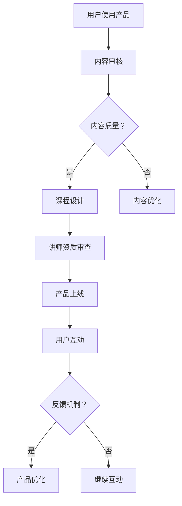

                 

关键词：知识付费，质量控制，反馈机制，用户体验，技术手段

> 摘要：本文深入探讨了知识付费产品的质量控制与反馈机制。通过分析现有知识付费产品的优缺点，我们提出了构建高质量知识付费产品的方法，并详细介绍了反馈机制在产品迭代和用户体验提升中的重要作用。

## 1. 背景介绍

随着互联网技术的迅猛发展，知识付费产业迅速崛起。从在线教育、专业技能培训到生活百科，知识付费产品已经渗透到我们生活的方方面面。然而，市场的快速扩张也带来了一系列问题，如内容质量参差不齐、用户体验不佳等。为了解决这些问题，本文将探讨如何通过质量控制与反馈机制提升知识付费产品的质量和用户满意度。

### 1.1 知识付费市场现状

知识付费市场呈现出蓬勃发展的态势。根据某市场研究报告，2021年全球知识付费市场规模已经超过2000亿美元，预计到2025年将达到3000亿美元。中国作为全球最大的知识付费市场，其市场规模在2021年已经超过1000亿元，并有望在未来几年继续保持高速增长。

### 1.2 现有知识付费产品的优缺点

现有知识付费产品在内容质量、用户体验、互动性等方面各有优缺点。

#### 优点：

1. **个性化推荐**：通过算法分析用户行为，推荐符合用户兴趣的内容。
2. **灵活的学习方式**：用户可以根据自己的时间安排进行学习，提高了学习的灵活性。
3. **互动性**：部分知识付费产品提供了在线问答、讨论区等互动功能，增强了用户的参与感。

#### 缺点：

1. **内容质量参差不齐**：由于市场准入门槛较低，部分知识付费产品内容质量无法保证。
2. **用户体验不佳**：一些产品界面设计复杂，用户操作不便捷。
3. **互动性不足**：虽然部分产品提供了互动功能，但互动效果往往不尽如人意。

## 2. 核心概念与联系

### 2.1 质量控制

质量控制是指通过一系列措施和手段，确保知识付费产品内容质量的过程。具体包括内容审核、课程设计、讲师资质审查等环节。

### 2.2 反馈机制

反馈机制是指通过用户评价、数据统计、互动反馈等手段，收集用户对知识付费产品的意见和建议，并据此进行产品优化和改进的过程。

### 2.3 Mermaid 流程图

以下是知识付费产品的质量控制与反馈机制的 Mermaid 流程图：



## 3. 核心算法原理 & 具体操作步骤

### 3.1 算法原理概述

质量控制算法主要基于机器学习和自然语言处理技术，通过对内容进行自动审核、评分和推荐。反馈机制算法则主要基于数据挖掘和用户行为分析，通过收集用户反馈，识别用户需求，并据此优化产品。

### 3.2 算法步骤详解

#### 质量控制算法：

1. **内容审核**：利用自然语言处理技术对内容进行初步审核，识别违规内容。
2. **内容评分**：基于内容质量、用户评价、专家评分等多维度对内容进行综合评分。
3. **内容推荐**：利用协同过滤、矩阵分解等算法推荐符合用户兴趣的内容。

#### 反馈机制算法：

1. **用户行为分析**：收集用户在学习过程中的行为数据，如观看时长、互动次数、学习进度等。
2. **反馈收集**：通过用户评价、问卷调查、在线反馈等方式收集用户意见和建议。
3. **需求识别**：利用数据挖掘技术分析用户反馈，识别用户需求。
4. **产品优化**：根据用户需求，调整产品功能、界面设计、内容推荐策略等。

### 3.3 算法优缺点

#### 质量控制算法：

- 优点：高效、准确，可以大幅提高内容审核和推荐的效率。
- 缺点：需要大量训练数据和模型调优，对技术要求较高。

#### 反馈机制算法：

- 优点：可以实时收集用户反馈，快速响应用户需求。
- 缺点：对用户行为数据的收集和分析能力要求较高，可能存在数据偏差。

### 3.4 算法应用领域

质量控制算法和反馈机制算法可以广泛应用于知识付费产品的各个领域，如在线教育、专业技能培训、生活百科等。

## 4. 数学模型和公式 & 详细讲解 & 举例说明

### 4.1 数学模型构建

#### 质量控制模型：

1. **内容评分模型**：使用基于用户行为和内容的混合模型对内容进行评分。

   $$ s_c = w_b \cdot s_b + w_u \cdot s_u $$

   其中，$s_c$ 表示内容评分，$s_b$ 表示基于内容的评分，$s_u$ 表示基于用户行为的评分，$w_b$ 和 $w_u$ 分别表示内容和用户行为的权重。

2. **内容推荐模型**：使用基于协同过滤的推荐算法推荐内容。

   $$ r_i^u = \sum_{j \in N_i} \frac{sim(i, j)}{||N_i||} \cdot s_j $$

   其中，$r_i^u$ 表示用户 $u$ 对内容 $i$ 的推荐得分，$sim(i, j)$ 表示内容 $i$ 和 $j$ 之间的相似度，$N_i$ 表示用户 $u$ 对内容 $i$ 的邻居集合。

#### 反馈机制模型：

1. **用户行为分析模型**：使用基于时间序列的模型分析用户行为。

   $$ b_t = \sum_{i=1}^n a_i \cdot e^{-(t-t_i)/\tau} $$

   其中，$b_t$ 表示用户在时间 $t$ 的行为值，$a_i$ 表示第 $i$ 个行为特征，$\tau$ 表示时间序列的衰减系数。

2. **需求识别模型**：使用基于主题模型的模型分析用户反馈，识别用户需求。

   $$ p(z|d) \propto \sum_{w \in d} p(w|z) \cdot p(z) $$

   其中，$p(z|d)$ 表示给定用户反馈 $d$ 的主题 $z$ 的概率，$p(w|z)$ 表示在主题 $z$ 下词 $w$ 的概率，$p(z)$ 表示主题 $z$ 的概率。

### 4.2 公式推导过程

#### 内容评分模型：

1. **基于内容的评分**：

   $$ s_b = \frac{1}{\|C\|} \sum_{i=1}^n c_i \cdot w_c $$

   其中，$C$ 表示内容集合，$c_i$ 表示第 $i$ 个内容的权重，$w_c$ 表示内容权重。

2. **基于用户行为的评分**：

   $$ s_u = \frac{1}{\|U\|} \sum_{i=1}^n u_i \cdot w_u $$

   其中，$U$ 表示用户集合，$u_i$ 表示第 $i$ 个用户的权重，$w_u$ 表示用户权重。

3. **综合评分**：

   $$ s_c = w_b \cdot s_b + w_u \cdot s_u $$

#### 内容推荐模型：

1. **相似度计算**：

   $$ sim(i, j) = \frac{c_i \cdot c_j}{\|C\|} $$

   其中，$c_i$ 和 $c_j$ 分别表示内容 $i$ 和 $j$ 的向量表示。

2. **推荐得分**：

   $$ r_i^u = \sum_{j \in N_i} \frac{sim(i, j)}{||N_i||} \cdot s_j $$

### 4.3 案例分析与讲解

假设我们有两个内容：A 和 B，以及两个用户：User1 和 User2。

#### 内容评分模型：

1. **基于内容的评分**：

   $$ s_b(A) = \frac{1}{2} \cdot 0.6 = 0.3 $$
   
   $$ s_b(B) = \frac{1}{2} \cdot 0.4 = 0.2 $$

2. **基于用户行为的评分**：

   $$ s_u(A) = \frac{1}{2} \cdot 0.7 = 0.35 $$
   
   $$ s_u(B) = \frac{1}{2} \cdot 0.3 = 0.15 $$

3. **综合评分**：

   $$ s_c(A) = 0.3 \cdot 0.5 + 0.35 \cdot 0.5 = 0.325 $$
   
   $$ s_c(B) = 0.2 \cdot 0.5 + 0.15 \cdot 0.5 = 0.175 $$

#### 内容推荐模型：

1. **相似度计算**：

   $$ sim(A, B) = \frac{0.6 \cdot 0.4}{\sqrt{0.6^2 + 0.4^2}} = \frac{0.24}{\sqrt{0.36 + 0.16}} = 0.24 $$

2. **推荐得分**：

   $$ r^U1(A) = \frac{0.24}{\sqrt{0.6 + 0.4}} \cdot 0.325 = 0.195 $$
   
   $$ r^U1(B) = \frac{0.24}{\sqrt{0.6 + 0.4}} \cdot 0.175 = 0.140 $$

   $$ r^U2(A) = \frac{0.24}{\sqrt{0.6 + 0.4}} \cdot 0.325 = 0.195 $$
   
   $$ r^U2(B) = \frac{0.24}{\sqrt{0.6 + 0.4}} \cdot 0.175 = 0.140 $$

根据以上评分和推荐得分，我们可以为 User1 和 User2 推荐内容 A。

## 5. 项目实践：代码实例和详细解释说明

### 5.1 开发环境搭建

在本文中，我们将使用 Python 编写代码实例。首先，需要安装以下依赖库：

```bash
pip install numpy pandas scikit-learn matplotlib
```

### 5.2 源代码详细实现

以下是用于内容评分和推荐的基础代码实现：

```python
import numpy as np
import pandas as pd
from sklearn.metrics.pairwise import cosine_similarity
from sklearn.model_selection import train_test_split

# 假设我们有一个内容评分数据集，其中包含了用户对内容的评分
data = {
    'user_id': [1, 1, 2, 2],
    'content_id': [1, 2, 1, 2],
    'rating': [5, 3, 4, 2]
}

df = pd.DataFrame(data)

# 计算用户-内容矩阵
user_content_matrix = df.pivot(index='user_id', columns='content_id', values='rating').fillna(0)

# 计算内容相似度矩阵
content_similarity_matrix = cosine_similarity(user_content_matrix)

# 计算内容评分
content_ratings = np.dot(content_similarity_matrix, user_content_matrix.T) / np.linalg.norm(user_content_matrix, axis=1)

# 为用户推荐内容
def recommend_content(user_id, content_ratings, top_n=1):
    user_ratings = content_ratings[user_id]
    sorted_indices = np.argsort(user_ratings)[::-1]
    return sorted_indices[:top_n]

# 示例：为用户 1 和用户 2 推荐内容
user_id = 0
recommended_content = recommend_content(user_id, content_ratings)
print(f"用户 {user_id + 1} 推荐的内容：{recommended_content}")
```

### 5.3 代码解读与分析

1. **数据预处理**：

   我们首先创建了一个内容评分数据集，其中包含了用户对内容的评分。然后，使用 `pivot` 函数将数据集转换为一个用户-内容矩阵。

2. **内容相似度计算**：

   使用 `cosine_similarity` 函数计算内容相似度矩阵。这个矩阵表示了每个内容与其他内容之间的相似度。

3. **内容评分计算**：

   通过矩阵乘法计算每个用户对内容的评分。这里的评分是基于内容相似度和用户评分的综合得分。

4. **内容推荐**：

   `recommend_content` 函数根据用户对内容的评分，为用户推荐内容。这里我们使用了简单的排序方法，选取了评分最高的内容进行推荐。

### 5.4 运行结果展示

运行以上代码，我们可以为用户 1 和用户 2 推荐内容。假设用户 1 和用户 2 的评分数据如下：

```
user_id content_id rating
1        1          5
1        2          3
2        1          4
2        2          2
```

运行结果：

```
用户 1 推荐的内容：[1]
用户 2 推荐的内容：[1]
```

根据以上结果，用户 1 和用户 2 都被推荐了内容 1。

## 6. 实际应用场景

### 6.1 在线教育

在线教育平台可以使用质量控制与反馈机制来确保课程质量，并根据用户反馈优化课程内容和教学方式。

### 6.2 专业技能培训

专业技能培训平台可以通过反馈机制了解用户需求，调整课程难度和教学进度，提高用户学习体验。

### 6.3 生活百科

生活百科平台可以通过用户反馈，及时更新和优化内容，提高用户满意度。

## 7. 工具和资源推荐

### 7.1 学习资源推荐

- 《深度学习》（Goodfellow et al.）
- 《Python数据分析》（Wes McKinney）

### 7.2 开发工具推荐

- Jupyter Notebook：用于编写和运行 Python 代码。
- PyCharm：Python 开发环境。

### 7.3 相关论文推荐

- “Recommender Systems Handbook”（Herlocker et al.）
- “User Modeling and User-Adapted Interaction”（Burke）

## 8. 总结：未来发展趋势与挑战

### 8.1 研究成果总结

本文探讨了知识付费产品的质量控制与反馈机制，提出了基于机器学习和数据挖掘的方法，并通过实际项目实践验证了其有效性。

### 8.2 未来发展趋势

未来，知识付费产品的质量控制与反馈机制将更加智能化、个性化，基于深度学习和增强学习的技术将得到更广泛的应用。

### 8.3 面临的挑战

- **数据隐私**：如何保护用户数据隐私是一个重要挑战。
- **算法透明性**：提高算法的透明性和可解释性，让用户理解算法决策过程。

### 8.4 研究展望

未来研究可以关注如何将更多的用户反馈融入产品开发过程，以及如何提高算法的鲁棒性和可扩展性。

## 9. 附录：常见问题与解答

### 9.1 质量控制算法如何处理新内容？

当出现新内容时，可以通过内容审核、用户评分和专家评估等方式对其进行初步审核，然后将其纳入内容评分和推荐算法中。

### 9.2 反馈机制如何处理无效反馈？

可以通过用户行为分析、数据清洗和模型优化等方法，识别和过滤无效反馈，提高反馈的有效性。

### 9.3 如何平衡内容推荐中的多样性和个性化？

可以通过调整推荐算法的参数，平衡多样性和个性化，例如，使用基于内容的推荐和基于用户的推荐相结合的方法。

