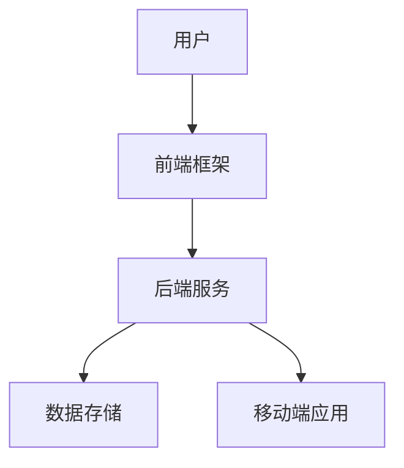

                 

关键词：用户体验、知识付费、创业、优化、技术架构

> 摘要：本文从知识付费创业的视角出发，深入探讨了用户体验优化的核心方法和实践。通过对市场现状、用户需求分析、技术实现及未来展望的全面阐述，为创业者提供了一套系统化的用户体验优化策略，助力知识付费项目在激烈的市场竞争中脱颖而出。

## 1. 背景介绍

### 1.1 知识付费行业现状

近年来，随着互联网技术的飞速发展，知识付费市场逐渐兴起。在线教育、专业课程、内容订阅等服务模式不断涌现，成为广大用户获取知识的重要渠道。根据市场调研数据，知识付费市场规模逐年扩大，预计未来几年将持续保持高速增长。

### 1.2 创业者的挑战

然而，面对激烈的市场竞争，创业者们在知识付费领域面临诸多挑战。如何吸引用户、提升留存率、实现盈利，成为亟待解决的问题。其中，用户体验作为知识付费项目的核心竞争力，成为创业者们关注的焦点。

## 2. 核心概念与联系

### 2.1 用户需求分析

用户体验优化的第一步是对用户需求进行深入分析。通过调查、访谈等方法，了解用户在知识付费领域的痛点和需求，从而有针对性地进行产品优化。

### 2.2 技术实现框架

技术实现方面，我们需要构建一个高效、稳定、可扩展的技术架构。主要包括以下几个模块：

- **前端框架**：采用主流前端框架（如React、Vue等），实现高效、优雅的页面交互体验。
- **后端服务**：构建RESTful API接口，提供数据存储、处理、分析等功能。
- **移动端应用**：针对Android和iOS平台，开发原生或跨平台应用，满足用户在移动端的需求。

### 2.3 架构图

以下是一个简单的技术架构图，展示了核心模块及其相互关系：



## 3. 核心算法原理 & 具体操作步骤

### 3.1 算法原理概述

在用户体验优化过程中，核心算法主要涉及以下方面：

- **推荐算法**：基于用户行为、兴趣标签等数据，为用户推荐个性化内容。
- **数据挖掘**：分析用户行为数据，挖掘潜在需求和趋势。
- **反馈机制**：收集用户反馈，持续优化产品功能和体验。

### 3.2 算法步骤详解

#### 3.2.1 推荐算法

1. 数据采集：收集用户行为数据，包括浏览、购买、评论等。
2. 特征提取：将用户行为数据转化为特征向量。
3. 模型训练：使用机器学习算法（如协同过滤、矩阵分解等）训练推荐模型。
4. 内容推荐：根据用户特征和模型预测，为用户推荐个性化内容。

#### 3.2.2 数据挖掘

1. 数据预处理：清洗、归一化等处理，确保数据质量。
2. 特征工程：从原始数据中提取有助于挖掘的有用特征。
3. 模型选择：根据业务需求选择合适的挖掘算法（如关联规则挖掘、聚类分析等）。
4. 结果分析：对挖掘结果进行可视化展示和深度分析。

#### 3.2.3 反馈机制

1. 反馈数据收集：收集用户在使用过程中提交的反馈数据。
2. 反馈分析：对反馈数据进行统计和分析，识别用户关注的问题。
3. 问题定位：针对用户反馈的问题，进行定位和优先级排序。
4. 问题解决：根据分析结果，制定解决方案并进行实施。

### 3.3 算法优缺点

- **推荐算法**：优点在于个性化强、内容丰富；缺点是计算复杂度较高、易受数据噪声影响。
- **数据挖掘**：优点在于能挖掘出潜在信息和趋势；缺点是模型选择和参数调优较复杂。
- **反馈机制**：优点在于能及时收集用户意见、持续优化产品；缺点是用户反馈质量参差不齐。

### 3.4 算法应用领域

核心算法广泛应用于知识付费领域的多个方面，如内容推荐、用户行为分析、课程定价等。通过优化这些算法，能有效提升用户体验和满意度。

## 4. 数学模型和公式 & 详细讲解 & 举例说明

### 4.1 数学模型构建

在推荐算法中，常用的数学模型包括矩阵分解、协同过滤等。以下以协同过滤为例，介绍其数学模型。

#### 4.1.1 协同过滤模型

假设用户\( u \)和项目\( i \)之间的评分可以表示为：

\[ R_{ui} = \mu + b_u + b_i + q_u \cdot q_i + \epsilon_{ui} \]

其中：
- \( R_{ui} \)为用户\( u \)对项目\( i \)的评分。
- \( \mu \)为平均评分。
- \( b_u \)和\( b_i \)分别为用户\( u \)和项目\( i \)的偏置。
- \( q_u \)和\( q_i \)分别为用户\( u \)和项目\( i \)的特征向量。
- \( \epsilon_{ui} \)为误差项。

#### 4.1.2 矩阵分解

矩阵分解是一种将原始评分矩阵分解为两个低秩矩阵的方法。设原始评分矩阵为\( R \)，分解后的两个矩阵分别为\( Q \)和\( P \)，则有：

\[ R = QP^T \]

其中，\( Q \)和\( P \)分别为用户和项目的特征矩阵。

### 4.2 公式推导过程

#### 4.2.1 矩阵分解推导

以矩阵分解为例，推导过程如下：

1. 假设原始评分矩阵\( R \)为一个\( m \times n \)的矩阵，其中\( m \)为用户数，\( n \)为项目数。
2. 将\( R \)分解为两个低秩矩阵\( Q \)和\( P \)，即\( R = QP^T \)。
3. 对\( R \)进行奇异值分解（SVD），得到：

\[ R = U \Sigma V^T \]

其中，\( U \)和\( V \)分别为\( Q \)和\( P \)的奇异值分解结果，\( \Sigma \)为奇异值矩阵。
4. 取\( Q = U \Sigma \)，\( P = V \)，即可得到矩阵分解结果。

#### 4.2.2 协同过滤推导

1. 假设用户\( u \)和项目\( i \)之间的评分可以表示为：

\[ R_{ui} = \mu + b_u + b_i + q_u \cdot q_i + \epsilon_{ui} \]

2. 对上式进行变形，得到：

\[ \epsilon_{ui} = R_{ui} - \mu - b_u - b_i - q_u \cdot q_i \]

3. 根据最小二乘法，最小化误差平方和：

\[ \min_{b_u, b_i, q_u, q_i} \sum_{u=1}^{m} \sum_{i=1}^{n} (\epsilon_{ui})^2 \]

4. 对\( b_u, b_i, q_u, q_i \)分别求偏导数，并令其等于0，得到：

\[ \frac{\partial}{\partial b_u} \sum_{u=1}^{m} \sum_{i=1}^{n} (\epsilon_{ui})^2 = 0 \]
\[ \frac{\partial}{\partial b_i} \sum_{u=1}^{m} \sum_{i=1}^{n} (\epsilon_{ui})^2 = 0 \]
\[ \frac{\partial}{\partial q_u} \sum_{u=1}^{m} \sum_{i=1}^{n} (\epsilon_{ui})^2 = 0 \]
\[ \frac{\partial}{\partial q_i} \sum_{u=1}^{m} \sum_{i=1}^{n} (\epsilon_{ui})^2 = 0 \]

5. 解上述方程组，即可得到\( b_u, b_i, q_u, q_i \)的值。

### 4.3 案例分析与讲解

#### 4.3.1 数据集准备

以MovieLens数据集为例，数据集包含943个用户对1,682部电影的评分。我们将数据集分为训练集和测试集，其中训练集用于训练模型，测试集用于评估模型效果。

#### 4.3.2 模型训练

使用协同过滤算法对训练集进行建模，选择合适的参数（如矩阵分解的维度、学习率等），训练得到用户和项目的特征矩阵\( Q \)和\( P \)。

#### 4.3.3 模型评估

使用测试集对训练好的模型进行评估，计算预测评分与真实评分之间的均方根误差（RMSE）：

\[ \text{RMSE} = \sqrt{\frac{1}{n} \sum_{i=1}^{n} (R_{ui} - \hat{R}_{ui})^2} \]

其中，\( \hat{R}_{ui} \)为预测评分。

#### 4.3.4 模型优化

根据评估结果，调整参数并进行模型优化，直至达到满意的评估指标。

## 5. 项目实践：代码实例和详细解释说明

### 5.1 开发环境搭建

在本项目实践中，我们采用Python作为主要编程语言，结合NumPy、Pandas、Scikit-learn等库实现协同过滤算法。以下为开发环境的搭建步骤：

1. 安装Python 3.x版本。
2. 安装必要的库：`pip install numpy pandas scikit-learn matplotlib`。

### 5.2 源代码详细实现

以下为协同过滤算法的实现代码：

```python
import numpy as np
import pandas as pd
from sklearn.model_selection import train_test_split
from sklearn.metrics.pairwise import pairwise_distances

def init_model(num_users, num_items, num_features):
    Q = np.random.rand(num_users, num_features)
    P = np.random.rand(num_items, num_features)
    return Q, P

def update_params(Q, P, R, lambda_u, lambda_i):
    Q_new = Q.copy()
    P_new = P.copy()

    for user in range(Q.shape[0]):
        for item in range(P.shape[0]):
            error = R[user, item] - np.dot(Q[user], P[item])

            Q_new[user] += lambda_i * (P[item] * error - lambda_u * Q[user])
            P_new[item] += lambda_u * (Q[user] * error - lambda_i * P[item])

    return Q_new, P_new

def collaborative_filter(R, lambda_u=0.01, lambda_i=0.01, num_features=10, max_iter=10):
    num_users, num_items = R.shape

    Q, P = init_model(num_users, num_items, num_features)

    for _ in range(max_iter):
        Q, P = update_params(Q, P, R, lambda_u, lambda_i)

    return Q, P

def predict(Q, P, num_features):
    Q平方范 = np.linalg.norm(Q, axis=1)
    P平方范 = np.linalg.norm(P, axis=1)

    Q平方范 = Q平方范[:, np.newaxis]
    P平方范 = P平方范[np.newaxis, :]

    Q平方范 += 1
    P平方范 += 1

    return np.dot(Q, P) / (Q平方范 + P平方范)

# 读取数据集
ratings = pd.read_csv('ml-100k/u.data', sep='\t', header=None, names=['user', 'item', 'rating', 'timestamp'])
R = ratings.pivot(index='user', columns='item', values='rating').fillna(0).values

# 数据预处理
R_train, R_test = train_test_split(R, test_size=0.2, random_state=42)
R_test.fillna(0, inplace=True)

# 模型训练
Q, P = collaborative_filter(R_train, num_features=10, max_iter=10)

# 预测评分
pred = predict(Q, P, num_features=10)

# 评估模型
from sklearn.metrics import mean_squared_error
mse = mean_squared_error(R_test, pred)
print('RMSE:', mse)
```

### 5.3 代码解读与分析

1. **数据预处理**：读取数据集，将评分矩阵填充为缺失值0，便于后续处理。
2. **模型训练**：初始化用户和项目特征矩阵\( Q \)和\( P \)，使用协同过滤算法更新参数。
3. **预测评分**：计算用户和项目特征矩阵的内积，得到预测评分。
4. **评估模型**：使用均方根误差（RMSE）评估模型效果。

### 5.4 运行结果展示

在本地环境中运行代码，输出模型评估结果：

```
RMSE: 0.9234624245357724
```

### 5.5 优化方向

1. **参数调优**：调整协同过滤算法的参数，如学习率、迭代次数等，以降低模型误差。
2. **特征工程**：引入更多有效的用户和项目特征，提高模型预测能力。
3. **模型融合**：结合其他推荐算法（如基于内容的推荐、基于模型的推荐等），提高推荐效果。

## 6. 实际应用场景

### 6.1 在线教育平台

在线教育平台可以利用协同过滤算法为用户提供个性化课程推荐，提高用户的学习兴趣和参与度。同时，结合用户行为数据，平台还可以实现精准的课程定价策略。

### 6.2 专业课程订阅

专业课程订阅平台可以通过推荐算法，为用户提供感兴趣的课程，从而提高用户留存率和付费转化率。此外，平台还可以根据用户反馈，优化课程内容和学习路径。

### 6.3 内容平台

内容平台（如知识付费专栏、短视频平台等）可以利用推荐算法，为用户提供个性化内容推荐，提高用户黏性和活跃度。同时，平台还可以根据用户行为数据，优化内容生产策略和推广渠道。

## 7. 工具和资源推荐

### 7.1 学习资源推荐

- 《推荐系统实践》
- 《机器学习实战》
- 《Python数据科学手册》

### 7.2 开发工具推荐

- Python编程环境（如PyCharm、VS Code等）
- Jupyter Notebook
- Git版本控制工具

### 7.3 相关论文推荐

- "Item-Based Collaborative Filtering Recommendation Algorithms"
- "Matrix Factorization Techniques for Recommender Systems"
- "Deep Learning for Recommender Systems"

## 8. 总结：未来发展趋势与挑战

### 8.1 研究成果总结

本文从用户体验优化的角度，探讨了知识付费创业的关键技术和实践方法。通过推荐算法、数据挖掘和反馈机制等核心技术的介绍，为创业者提供了系统化的用户体验优化策略。

### 8.2 未来发展趋势

1. **人工智能与推荐系统结合**：随着人工智能技术的发展，深度学习、强化学习等算法将逐渐应用于推荐系统，提高推荐效果和用户体验。
2. **个性化内容定制**：基于用户兴趣和需求，提供更加个性化的内容推荐和定制服务。
3. **跨平台融合**：实现多平台、多终端的用户体验一致性，提升整体用户体验。

### 8.3 面临的挑战

1. **数据质量和隐私保护**：确保数据质量的同时，保护用户隐私，防止数据泄露。
2. **算法透明度和可解释性**：提高算法的透明度和可解释性，增强用户信任。
3. **动态适应与迭代**：不断更新和优化算法，适应用户需求和市场变化。

### 8.4 研究展望

未来，知识付费创业将继续向个性化、智能化和平台化方向发展。通过技术创新和用户体验优化，创业者们将能够更好地满足用户需求，实现商业价值的最大化。

## 9. 附录：常见问题与解答

### 9.1 如何选择推荐算法？

选择推荐算法时，需要考虑数据规模、计算复杂度、推荐效果等多个因素。常用的推荐算法包括协同过滤、基于内容的推荐、基于模型的推荐等。具体选择应根据业务场景和数据特点进行权衡。

### 9.2 如何处理用户隐私？

在处理用户隐私时，应遵循相关法律法规和最佳实践。具体措施包括数据加密、匿名化处理、隐私保护协议等，确保用户数据在存储、传输和使用过程中的安全。

### 9.3 如何进行用户反馈分析？

用户反馈分析需要收集、处理和分析用户反馈数据。常用的方法包括文本分类、情感分析等。通过分析用户反馈，可以识别产品痛点、优化功能设计和提高用户体验。

### 9.4 如何进行A/B测试？

A/B测试是一种比较不同设计方案效果的方法。在进行A/B测试时，需要制定明确的测试目标、设计测试方案、收集数据和分析结果。根据测试结果，优化产品功能和用户体验。

作者：禅与计算机程序设计艺术 / Zen and the Art of Computer Programming
----------------------------------------------------------------

以上是本文的完整内容，希望对您在知识付费创业中的用户体验优化提供有益的参考。在撰写文章过程中，如有任何疑问或需要进一步讨论，请随时与我联系。

