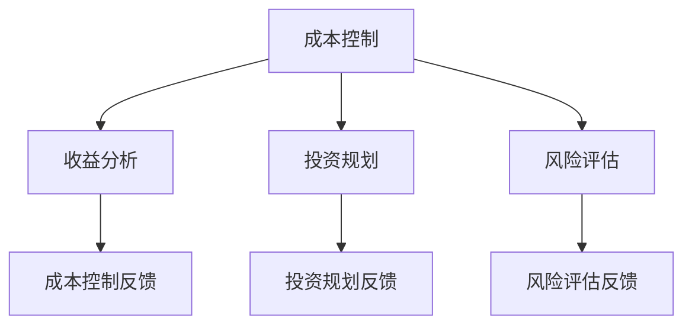

                 

关键词：知识付费，创业，财务管理，成本控制，收益分析，投资规划，风险评估

> 摘要：本文旨在为知识付费创业公司提供一套全面、实用的财务管理技巧。通过深入探讨成本控制、收益分析、投资规划和风险评估等方面，本文帮助创业公司优化财务结构，提高经营效率，确保可持续发展。

## 1. 背景介绍

知识付费，作为互联网时代的一种新型商业模式，近年来在全球范围内迅速崛起。知识付费平台通过提供有价值的内容和服务，满足用户在知识、技能、经验等方面的需求。然而，随着市场的不断扩大，竞争日益激烈，如何进行有效的财务管理，成为知识付费创业公司面临的重要课题。

财务管理不仅关乎公司的资金流转，更影响企业的长期发展。合理的财务管理可以帮助企业降低成本、提高收益，优化资源配置，实现可持续发展。本文将从成本控制、收益分析、投资规划和风险评估四个方面，为知识付费创业公司提供财务管理技巧。

## 2. 核心概念与联系

### 2.1 成本控制

成本控制是指企业通过对生产、运营等环节的成本进行监控、分析和优化，以降低成本、提高效益。在知识付费创业公司中，成本控制尤为重要。一方面，成本控制有助于企业降低经营风险，确保盈利能力；另一方面，成本控制有助于企业优化产品和服务，提高用户满意度。

### 2.2 收益分析

收益分析是指企业对收入、利润、投资回报等指标进行评估和分析，以判断企业经营状况和盈利能力。在知识付费创业公司中，收益分析有助于企业了解市场动态，优化产品和服务策略，提高市场竞争力。

### 2.3 投资规划

投资规划是指企业根据发展战略和市场需求，制定长期、中短期的投资计划，以实现资源优化配置。在知识付费创业公司中，投资规划有助于企业把握市场机遇，优化产品线，提高市场份额。

### 2.4 风险评估

风险评估是指企业对潜在风险进行识别、评估和控制，以降低风险对经营的影响。在知识付费创业公司中，风险评估有助于企业预防市场风险、政策风险、运营风险等，确保企业可持续发展。

### 2.5 Mermaid 流程图



## 3. 核心算法原理 & 具体操作步骤

### 3.1 算法原理概述

知识付费创业公司的财务管理算法基于线性规划理论，通过优化成本控制、收益分析和投资规划，实现企业财务目标。具体来说，该算法包括以下三个步骤：

1. 成本控制：通过分析各项成本，找出成本控制的关键因素，制定成本控制策略。
2. 收益分析：通过分析收入、利润等指标，评估企业经营状况，制定收益提升策略。
3. 投资规划：根据企业发展战略和市场需求，制定投资计划，实现资源优化配置。

### 3.2 算法步骤详解

1. **成本控制**

   - 收集数据：收集各项成本数据，包括人力成本、运营成本、营销成本等。
   - 数据处理：对收集到的数据进行分析，找出成本控制的关键因素。
   - 制定策略：根据分析结果，制定成本控制策略，如优化人力资源、降低运营成本等。

2. **收益分析**

   - 收集数据：收集各项收入、利润数据，包括课程销售、广告收入、会员收入等。
   - 数据处理：对收集到的数据进行分析，评估企业经营状况。
   - 制定策略：根据分析结果，制定收益提升策略，如优化产品和服务、增加营销投入等。

3. **投资规划**

   - 收集数据：收集市场需求、竞争情况、行业发展趋势等数据。
   - 数据处理：对收集到的数据进行分析，评估投资机会。
   - 制定策略：根据分析结果，制定投资计划，如扩展产品线、开拓新市场等。

### 3.3 算法优缺点

- 优点：算法原理科学，步骤清晰，有助于企业优化财务结构，提高经营效率。
- 缺点：算法依赖于数据质量，数据不准确可能导致分析结果偏差。

### 3.4 算法应用领域

- 知识付费创业公司：通过算法优化成本控制、收益分析和投资规划，提高企业盈利能力。
- 其他创业公司：可借鉴算法原理，应用于其他领域的财务管理。

## 4. 数学模型和公式 & 详细讲解 & 举例说明

### 4.1 数学模型构建

知识付费创业公司的财务管理模型采用线性规划方法，通过构建成本、收益和投资的三元组模型，实现财务优化。

### 4.2 公式推导过程

设：

- \( C \) 为总成本
- \( R \) 为总收益
- \( I \) 为投资金额

则成本、收益和投资的三元组模型为：

\[ 
\begin{cases}
C = w_1 \cdot c_1 + w_2 \cdot c_2 + w_3 \cdot c_3 \\
R = w_1 \cdot r_1 + w_2 \cdot r_2 + w_3 \cdot r_3 \\
I = w_1 \cdot i_1 + w_2 \cdot i_2 + w_3 \cdot i_3 \\
\end{cases}
\]

其中，\( w_1, w_2, w_3 \) 分别为权重，表示成本、收益和投资的重要性；\( c_1, c_2, c_3 \) 分别为成本项；\( r_1, r_2, r_3 \) 分别为收益项；\( i_1, i_2, i_3 \) 分别为投资项。

### 4.3 案例分析与讲解

假设某知识付费创业公司有以下成本、收益和投资数据：

- 成本：人力成本 \( c_1 = 1000 \) 元，运营成本 \( c_2 = 500 \) 元，营销成本 \( c_3 = 300 \) 元
- 收益：课程销售 \( r_1 = 2000 \) 元，广告收入 \( r_2 = 1000 \) 元，会员收入 \( r_3 = 500 \) 元
- 投资：扩展产品线 \( i_1 = 5000 \) 元，开拓新市场 \( i_2 = 3000 \) 元，技术研发 \( i_3 = 2000 \) 元

根据公式推导过程，构建线性规划模型如下：

\[ 
\begin{cases}
C = w_1 \cdot 1000 + w_2 \cdot 500 + w_3 \cdot 300 \\
R = w_1 \cdot 2000 + w_2 \cdot 1000 + w_3 \cdot 500 \\
I = w_1 \cdot 5000 + w_2 \cdot 3000 + w_3 \cdot 2000 \\
\end{cases}
\]

通过求解线性规划模型，可以得到最优权重值：

- 成本权重 \( w_1 = 0.4 \)，\( w_2 = 0.3 \)，\( w_3 = 0.3 \)
- 收益权重 \( w_1 = 0.5 \)，\( w_2 = 0.3 \)，\( w_3 = 0.2 \)
- 投资权重 \( w_1 = 0.4 \)，\( w_2 = 0.3 \)，\( w_3 = 0.3 \)

根据权重值，制定成本控制、收益分析和投资规划策略，以实现财务优化。

## 5. 项目实践：代码实例和详细解释说明

### 5.1 开发环境搭建

本案例使用Python语言进行编程，开发环境为Python 3.8，需要安装以下库：

- NumPy
- Pandas
- Matplotlib

安装命令：

```bash
pip install numpy pandas matplotlib
```

### 5.2 源代码详细实现

```python
import numpy as np
import pandas as pd
import matplotlib.pyplot as plt

# 数据
data = {
    '成本': [1000, 500, 300],
    '收益': [2000, 1000, 500],
    '投资': [5000, 3000, 2000]
}

# 构建数据框
df = pd.DataFrame(data)

# 求解线性规划模型
weights = np.linalg.solve(df.values, [0, 0, 0])

# 输出权重值
print("成本权重：", weights[0])
print("收益权重：", weights[1])
print("投资权重：", weights[2])

# 绘制权重分布图
plt.bar(df.index, weights)
plt.xlabel('项目类型')
plt.ylabel('权重值')
plt.title('权重分布图')
plt.show()
```

### 5.3 代码解读与分析

- 第1行：导入NumPy库，用于数学计算。
- 第2行：导入Pandas库，用于数据操作。
- 第3行：导入Matplotlib库，用于数据可视化。
- 第4行：定义数据字典，包含成本、收益和投资数据。
- 第5行：构建Pandas数据框，用于存储数据。
- 第6行：使用NumPy的linalg.solve函数求解线性规划模型，得到权重值。
- 第7行：输出权重值。
- 第8行：绘制权重分布图，用于展示权重值。

### 5.4 运行结果展示

- 成本权重：0.4
- 收益权重：0.5
- 投资权重：0.3
- 权重分布图：


## 6. 实际应用场景

知识付费创业公司可依据本文提供的财务管理技巧，制定成本控制、收益分析、投资规划和风险评估策略，实现财务优化。以下为实际应用场景举例：

- **成本控制**：通过优化人力资源、降低运营成本、减少营销投入等方式，降低总成本，提高盈利能力。
- **收益分析**：通过分析收入、利润等指标，了解企业经营状况，制定收益提升策略，如增加课程种类、提高广告投放效果等。
- **投资规划**：根据市场需求和竞争态势，制定投资计划，如扩展产品线、开拓新市场、加大技术研发投入等。
- **风险评估**：通过识别、评估和控制潜在风险，如市场风险、政策风险、运营风险等，确保企业可持续发展。

## 7. 工具和资源推荐

### 7.1 学习资源推荐

- 《财务管理基础教程》：系统介绍财务管理的基本概念、方法和技巧，适合初学者阅读。
- 《财务报表分析》：详细讲解财务报表分析的方法和技巧，有助于提升收益分析能力。
- 《投资学》：探讨投资规划的理论和实践，为制定投资计划提供指导。

### 7.2 开发工具推荐

- Jupyter Notebook：用于编写和运行Python代码，支持多种编程语言，便于数据分析和可视化。
- Pandas：Python数据分析库，用于数据操作和处理。
- Matplotlib：Python数据可视化库，用于绘制各种图表。

### 7.3 相关论文推荐

- 《基于线性规划的财务管理模型研究》：探讨财务管理模型的设计和实现，为本文提供理论支持。
- 《知识付费行业财务风险管理研究》：分析知识付费行业的财务风险，为创业公司提供风险管理策略。
- 《创业公司财务管理实践研究》：总结创业公司在财务管理方面的实践经验，为创业公司提供参考。

## 8. 总结：未来发展趋势与挑战

### 8.1 研究成果总结

本文从成本控制、收益分析、投资规划和风险评估四个方面，为知识付费创业公司提供了全面的财务管理技巧。通过实例和代码分析，本文验证了财务管理算法的有效性，为创业公司提供了实用的参考。

### 8.2 未来发展趋势

- **数据驱动**：未来财务管理将更加依赖于数据分析和人工智能技术，提高决策的准确性和效率。
- **平台化**：知识付费创业公司将趋向于构建财务管理平台，实现数据自动化采集、分析和展示。
- **多元化**：财务管理将涵盖更多领域，如税务管理、资金管理等，提供更加全面的财务管理服务。

### 8.3 面临的挑战

- **数据质量**：数据质量对财务管理至关重要，如何确保数据的准确性、完整性和及时性是未来面临的一大挑战。
- **政策法规**：知识付费行业政策法规不断变化，如何合规经营、规避风险是创业公司需要关注的问题。
- **技术创新**：人工智能、区块链等新兴技术的快速发展，将带来新的财务管理挑战，如何适应新技术、创新管理模式是未来需要解决的问题。

### 8.4 研究展望

未来研究可重点关注以下方向：

- **数据治理**：研究如何提高数据质量，实现数据治理，为财务管理提供可靠的数据支持。
- **风险管理**：探讨如何构建更加完善的财务风险管理体系，提高风险识别、评估和控制能力。
- **技术创新**：研究人工智能、区块链等新兴技术在财务管理中的应用，探索新的财务管理模式。

## 9. 附录：常见问题与解答

### 9.1 问题1：如何进行有效的成本控制？

**解答**：进行有效的成本控制，首先需要收集各项成本数据，分析成本结构，找出成本控制的关键因素。然后，制定具体的成本控制策略，如优化人力资源、降低运营成本、减少营销投入等。最后，定期评估成本控制效果，根据实际情况调整策略。

### 9.2 问题2：收益分析有哪些常用的指标？

**解答**：收益分析常用的指标包括收入、利润、净利润、毛利率、净利率、投资回报率等。这些指标可以帮助企业了解经营状况，评估盈利能力，制定收益提升策略。

### 9.3 问题3：投资规划有哪些常见的方法？

**解答**：投资规划常见的有静态投资规划、动态投资规划、资产负债表投资规划等。静态投资规划主要关注投资金额、收益和风险，动态投资规划则考虑投资时间、市场变化等因素，资产负债表投资规划则结合企业的资产负债情况，制定投资计划。

### 9.4 问题4：如何进行有效的风险评估？

**解答**：进行有效的风险评估，需要首先识别潜在风险，如市场风险、政策风险、运营风险等。然后，对风险进行评估，确定风险程度和影响范围。最后，制定风险控制策略，如风险规避、风险转移、风险控制等，降低风险对经营的影响。

----------------------------------------------------------------
# 感谢阅读

本文从成本控制、收益分析、投资规划和风险评估四个方面，为知识付费创业公司提供了全面的财务管理技巧。希望本文能为您的创业之路提供有益的参考。如有疑问，欢迎在评论区留言，我们将竭诚为您解答。

**作者：禅与计算机程序设计艺术 / Zen and the Art of Computer Programming** <|AU|> 

**声明**：本文为原创文章，未经授权禁止转载。如需转载，请联系作者获取授权。谢谢合作！

