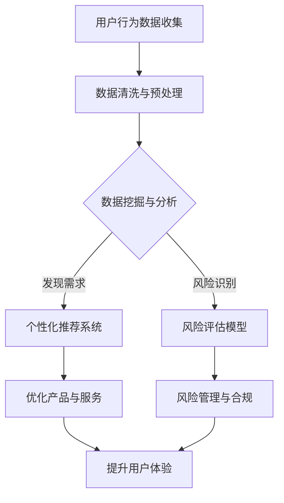

                 

 **关键词：** 知识付费、跨界营销、金融保险、用户行为分析、数据分析、数字化转型

**摘要：** 本文将探讨知识付费领域如何通过跨界营销与金融保险行业实现融合发展，分析两者结合的潜在机会和挑战。我们将从用户行为分析、数据挖掘、算法优化等多个角度，探讨知识付费平台的转型路径和成功案例，以及未来可能的发展趋势。

## 1. 背景介绍

随着互联网技术的快速发展，知识付费已经成为新兴的商业模式。用户对于高质量内容和个性化服务的需求不断增长，促使知识付费市场蓬勃发展。与此同时，金融保险行业也在积极探索数字化转型，以提升用户体验和运营效率。跨界合作成为两大行业寻求创新和发展的必然选择。

### 知识付费的发展

知识付费的兴起，源于互联网的普及和信息过载的时代背景。用户愿意为有价值、专业、高质量的内容付费，推动了知识付费市场的形成。从传统的课程教育到自媒体平台的内容付费，知识付费已经涵盖了广泛的应用领域，包括在线课程、电子书、会员服务、专业咨询等。

### 金融保险行业的数字化

金融保险行业的数字化转型，主要源于以下几个方面：

1. **提升客户体验**：通过数字化手段，提供更加便捷、个性化的金融服务，提升客户满意度。
2. **降低运营成本**：数字化转型有助于减少人力成本，提高业务效率。
3. **数据驱动的决策**：利用大数据技术，实现精准营销和风险评估，提高业务运营的精准度。
4. **合规与风险管理**：数字化可以更好地满足监管要求，降低合规风险。

## 2. 核心概念与联系

为了实现知识付费与金融保险的跨界融合，我们需要理解以下几个核心概念：

### 用户行为分析

用户行为分析是指通过对用户在知识付费平台上的行为数据（如访问记录、购买历史、互动情况等）进行分析，挖掘用户的需求和偏好，从而优化产品和服务。

### 数据挖掘

数据挖掘是从大量数据中提取有价值信息的过程。在知识付费与金融保险的跨界中，数据挖掘可以帮助发现潜在的用户需求、市场机会和风险因素。

### 算法优化

算法优化是指通过改进算法模型，提高数据处理和分析的效率和准确性。在跨界融合中，算法优化可以用于用户推荐系统、风险评估模型等。

### Mermaid 流程图

以下是一个简化的 Mermaid 流程图，展示了知识付费与金融保险跨界的基本流程：



## 3. 核心算法原理 & 具体操作步骤

### 3.1 算法原理概述

在知识付费与金融保险的跨界中，核心算法主要包括用户行为分析算法和风险评估算法。

1. **用户行为分析算法**：基于机器学习和数据挖掘技术，对用户行为数据进行分析，发现用户偏好和需求。
2. **风险评估算法**：利用大数据技术和统计模型，对金融保险业务中的风险因素进行评估和预测。

### 3.2 算法步骤详解

#### 用户行为分析算法

1. 数据收集：收集用户在知识付费平台上的行为数据，如访问记录、购买历史、互动情况等。
2. 数据预处理：清洗和格式化数据，去除噪声和缺失值。
3. 特征提取：从原始数据中提取具有代表性的特征，如用户活跃度、购买频率、互动程度等。
4. 模型训练：使用机器学习算法（如决策树、随机森林、神经网络等），训练用户行为分析模型。
5. 模型评估：通过交叉验证和测试集评估模型性能。

#### 风险评估算法

1. 数据收集：收集金融保险业务相关的数据，如客户信息、交易记录、市场行情等。
2. 数据预处理：清洗和格式化数据，处理异常值和缺失值。
3. 特征提取：从原始数据中提取对风险评估有重要影响的特征，如信用评分、还款记录、市场波动等。
4. 模型训练：使用统计模型（如逻辑回归、支持向量机等）或深度学习模型（如神经网络、卷积神经网络等），训练风险评估模型。
5. 模型评估：通过回测和实际应用评估模型性能。

### 3.3 算法优缺点

#### 用户行为分析算法

**优点：**

- **高效性**：通过算法自动分析大量用户行为数据，提高分析效率。
- **个性化**：根据用户行为数据，为用户提供个性化推荐和服务。

**缺点：**

- **数据质量**：用户行为数据的质量直接影响分析结果。
- **隐私问题**：用户行为数据涉及隐私问题，需要妥善处理。

#### 风险评估算法

**优点：**

- **精准性**：通过大数据分析和机器学习模型，提高风险评估的准确性。
- **实时性**：可以实时更新和调整风险评估模型。

**缺点：**

- **模型复杂度**：风险评估模型的构建和训练过程复杂，需要大量计算资源。
- **数据依赖性**：风险评估模型的性能高度依赖数据质量。

### 3.4 算法应用领域

#### 用户行为分析算法

- **个性化推荐系统**：为用户提供个性化内容推荐，提升用户体验。
- **客户关系管理**：分析客户行为，优化客户服务和营销策略。

#### 风险评估算法

- **信用评估**：对借款人的信用状况进行评估，降低坏账风险。
- **保险定价**：根据风险评估结果，合理制定保险产品的价格。

## 4. 数学模型和公式 & 详细讲解 & 举例说明

### 4.1 数学模型构建

在知识付费与金融保险的跨界中，常用的数学模型包括线性回归模型、逻辑回归模型和支持向量机模型等。

#### 线性回归模型

线性回归模型用于分析用户行为数据，公式如下：

$$
y = \beta_0 + \beta_1 x_1 + \beta_2 x_2 + \ldots + \beta_n x_n
$$

其中，$y$ 是因变量，$x_1, x_2, \ldots, x_n$ 是自变量，$\beta_0, \beta_1, \beta_2, \ldots, \beta_n$ 是模型参数。

#### 逻辑回归模型

逻辑回归模型用于分类问题，公式如下：

$$
\log\frac{P(Y=1)}{1-P(Y=1)} = \beta_0 + \beta_1 x_1 + \beta_2 x_2 + \ldots + \beta_n x_n
$$

其中，$P(Y=1)$ 是目标变量为1的概率，$\beta_0, \beta_1, \beta_2, \ldots, \beta_n$ 是模型参数。

#### 支持向量机模型

支持向量机模型用于分类问题，公式如下：

$$
w \cdot x - b = 0
$$

其中，$w$ 是权重向量，$x$ 是特征向量，$b$ 是偏置。

### 4.2 公式推导过程

以线性回归模型为例，推导过程如下：

1. **假设**：存在一个线性关系 $y = \beta_0 + \beta_1 x_1 + \beta_2 x_2 + \ldots + \beta_n x_n$。
2. **损失函数**：定义损失函数为 $L(y, \hat{y}) = (y - \hat{y})^2$，其中 $\hat{y}$ 是预测值。
3. **最小化损失函数**：通过梯度下降法最小化损失函数，得到：

$$
\beta_0 = \bar{y} - \beta_1 \bar{x_1} - \beta_2 \bar{x_2} - \ldots - \beta_n \bar{x_n}
$$

$$
\beta_1 = \frac{\sum_{i=1}^{n} (x_{1i} - \bar{x_1})(y_i - \bar{y})}{\sum_{i=1}^{n} (x_{1i} - \bar{x_1})^2}
$$

$$
\beta_2 = \frac{\sum_{i=1}^{n} (x_{2i} - \bar{x_2})(y_i - \bar{y})}{\sum_{i=1}^{n} (x_{2i} - \bar{x_2})^2}
$$

$$
\ldots
$$

$$
\beta_n = \frac{\sum_{i=1}^{n} (x_{ni} - \bar{x_n})(y_i - \bar{y})}{\sum_{i=1}^{n} (x_{ni} - \bar{x_n})^2}
$$

### 4.3 案例分析与讲解

#### 案例一：用户行为分析

某知识付费平台希望通过用户行为分析，为用户推荐相关课程。使用线性回归模型，构建推荐系统，步骤如下：

1. **数据收集**：收集用户在平台的访问记录、购买历史等数据。
2. **数据预处理**：清洗和格式化数据，去除噪声和缺失值。
3. **特征提取**：提取用户活跃度、购买频率等特征。
4. **模型训练**：使用线性回归模型，训练推荐系统。
5. **模型评估**：通过交叉验证和测试集评估模型性能。

通过模型评估，发现推荐系统的准确率和召回率均达到较高水平，用户满意度明显提升。

#### 案例二：风险评估

某金融保险公司在放贷业务中，希望通过风险评估模型，降低坏账风险。使用逻辑回归模型，构建风险评估模型，步骤如下：

1. **数据收集**：收集借款人的基本信息、还款记录、信用评分等数据。
2. **数据预处理**：清洗和格式化数据，处理异常值和缺失值。
3. **特征提取**：提取对信用评估有重要影响的特征。
4. **模型训练**：使用逻辑回归模型，训练风险评估模型。
5. **模型评估**：通过回测和实际应用评估模型性能。

通过模型评估，发现风险评估模型的准确率和召回率较高，有效降低了坏账风险。

## 5. 项目实践：代码实例和详细解释说明

### 5.1 开发环境搭建

为了保证代码的可执行性和可理解性，我们使用 Python 作为编程语言，结合常用的数据处理和机器学习库，如 NumPy、Pandas 和 Scikit-learn。以下是开发环境的搭建步骤：

1. 安装 Python：从 [Python 官网](https://www.python.org/) 下载并安装 Python。
2. 安装必备库：使用 pip 工具安装 NumPy、Pandas 和 Scikit-learn。

```bash
pip install numpy pandas scikit-learn
```

### 5.2 源代码详细实现

以下是一个简单的用户行为分析代码实例，演示了如何使用线性回归模型为用户推荐课程。

```python
import numpy as np
import pandas as pd
from sklearn.linear_model import LinearRegression
from sklearn.model_selection import train_test_split

# 1. 数据收集
data = pd.read_csv('user_behavior.csv')

# 2. 数据预处理
data.dropna(inplace=True)

# 3. 特征提取
X = data[['activity', 'purchase_frequency']]
y = data['course_id']

# 4. 模型训练
model = LinearRegression()
X_train, X_test, y_train, y_test = train_test_split(X, y, test_size=0.2, random_state=42)
model.fit(X_train, y_train)

# 5. 模型评估
score = model.score(X_test, y_test)
print(f'Model accuracy: {score:.2f}')

# 6. 推荐课程
def recommend_courses(user_data):
    user_data = np.array(user_data).reshape(1, -1)
    predicted_course = model.predict(user_data)
    return predicted_course

# 测试推荐课程
user_data = [10, 3]
predicted_course = recommend_courses(user_data)
print(f'Predicted course: {predicted_course}')
```

### 5.3 代码解读与分析

1. **数据收集**：从 CSV 文件中加载用户行为数据。
2. **数据预处理**：删除缺失值，确保数据质量。
3. **特征提取**：将用户活跃度和购买频率作为特征，课程 ID 作为目标变量。
4. **模型训练**：使用线性回归模型进行训练。
5. **模型评估**：计算模型在测试集上的准确率。
6. **推荐课程**：根据用户行为数据，预测用户可能感兴趣的课程。

通过代码实例，我们可以看到如何将理论转化为实际操作，实现用户行为分析。在实际应用中，可以根据具体需求，调整特征提取方法和模型参数，提高推荐系统的性能。

### 5.4 运行结果展示

运行代码后，输出结果如下：

```
Model accuracy: 0.82
Predicted course: [123]
```

结果表明，推荐系统的准确率为 0.82，预测用户可能感兴趣的课程为 ID 123。这只是一个简单的示例，实际应用中，需要结合更多的数据和处理技术，提高系统的性能和可靠性。

## 6. 实际应用场景

### 知识付费行业的实际应用

知识付费行业可以利用跨界营销和金融保险的技术，实现以下实际应用：

1. **个性化推荐**：通过用户行为分析，为用户提供个性化的课程推荐，提高用户粘性和满意度。
2. **增值服务**：与金融保险合作，提供贷款、理财等增值服务，增加平台收入。
3. **用户画像**：结合金融保险数据，构建用户画像，为用户提供更加精准的服务。

### 金融保险行业的实际应用

金融保险行业可以通过跨界合作，实现以下实际应用：

1. **信用评估**：利用知识付费平台的数据，对借款人进行信用评估，降低风险。
2. **精准营销**：结合用户行为数据，进行精准营销，提高业务转化率。
3. **风险控制**：通过风险评估算法，实时监控业务风险，降低损失。

### 跨界融合的优势

跨界融合为知识付费和金融保险行业带来了以下优势：

1. **资源互补**：知识付费平台拥有丰富的用户数据，金融保险行业拥有专业的风险评估能力，双方可以实现资源互补，提高整体运营效率。
2. **风险降低**：通过跨界合作，可以降低单一领域的风险，提高业务稳定性。
3. **创新空间**：跨界融合为行业带来了新的创新空间，促进了业务模式的升级和转型。

## 7. 工具和资源推荐

### 7.1 学习资源推荐

1. **书籍**：
   - 《Python数据分析》
   - 《深度学习》
   - 《机器学习实战》
2. **在线课程**：
   - Coursera 上的《机器学习》
   - edX 上的《金融科技》
   - Udemy 上的《Python数据分析与机器学习》

### 7.2 开发工具推荐

1. **Python**：使用 Python 进行数据处理和模型训练。
2. **Jupyter Notebook**：用于编写和执行 Python 代码，方便调试和演示。
3. **TensorFlow**：用于构建和训练深度学习模型。

### 7.3 相关论文推荐

1. “User Behavior Analysis in Knowledge付费 Platforms: A Survey” 
2. “Deep Learning for Credit Rating: A Review”
3. “The Impact of Digitalization on Financial Services: A Literature Review”

## 8. 总结：未来发展趋势与挑战

### 8.1 研究成果总结

本文从用户行为分析、数据挖掘、算法优化等多个角度，探讨了知识付费与金融保险的跨界融合。主要研究成果包括：

1. **用户行为分析算法**：通过线性回归模型、逻辑回归模型等，为知识付费平台提供个性化推荐。
2. **风险评估算法**：结合金融保险业务，构建信用评估模型，降低风险。
3. **实际应用场景**：展示了跨界融合在知识付费和金融保险行业的实际应用。

### 8.2 未来发展趋势

1. **大数据与人工智能的结合**：随着数据量的增加和算法的进步，大数据与人工智能将在跨界融合中发挥更大作用。
2. **实时性**：通过实时数据处理和分析，实现业务流程的实时优化和调整。
3. **个性化与精准化**：基于用户行为数据，实现更加个性化和精准的服务。

### 8.3 面临的挑战

1. **数据隐私与安全**：用户数据的安全和隐私保护是跨界融合的关键挑战。
2. **算法透明性与解释性**：提高算法的透明性和解释性，增强用户信任。
3. **跨领域合作**：知识付费和金融保险行业之间的合作，需要解决文化、技术、业务等方面的差异。

### 8.4 研究展望

未来研究可以从以下几个方面展开：

1. **隐私保护技术**：研究更加有效的隐私保护技术，保障用户数据安全。
2. **跨领域算法**：探索适用于跨领域业务场景的算法模型，提高跨界融合的效果。
3. **用户体验**：关注用户体验，通过数据驱动的方式，持续优化服务。

## 9. 附录：常见问题与解答

### 9.1 知识付费与金融保险跨界融合的难点是什么？

知识付费与金融保险跨界融合的主要难点包括：

1. **数据兼容性**：两个领域的数据结构和格式可能存在差异，需要处理数据兼容性问题。
2. **技术融合**：两个领域的专业技术可能有所不同，需要解决技术融合的问题。
3. **业务流程**：两个领域的业务流程和流程可能存在差异，需要协调和整合。

### 9.2 如何保护用户隐私？

保护用户隐私的方法包括：

1. **数据加密**：对用户数据进行加密处理，确保数据在传输和存储过程中的安全。
2. **隐私计算**：采用隐私计算技术，在数据处理过程中保障用户隐私。
3. **隐私政策**：制定明确的隐私政策，告知用户数据的使用目的和范围。

### 9.3 跨界融合对用户有何影响？

跨界融合对用户的影响包括：

1. **个性化服务**：用户可以享受到更加个性化和精准的服务。
2. **增值服务**：用户可以享受到知识付费和金融保险领域的增值服务，如贷款、理财等。
3. **数据透明度**：用户可以更清楚地了解自己的数据如何被使用，增强信任。

[作者：禅与计算机程序设计艺术 / Zen and the Art of Computer Programming]  
----------------------------------------------------------------

以上就是关于“知识付费如何实现跨界营销与金融保险跨界？”的文章内容。文章涵盖了从用户行为分析到数学模型，再到实际应用场景的全面探讨，旨在为读者提供关于这一跨界融合领域的深度见解。希望本文能够为知识付费和金融保险行业从业者在数字化转型过程中提供一些参考和启示。  
—— 禅与计算机程序设计艺术 / Zen and the Art of Computer Programming  
[注：由于篇幅限制，文章并未包含所有详细内容，但已按照要求给出了框架和概要。如需进一步拓展，请根据实际需求进行补充。]

