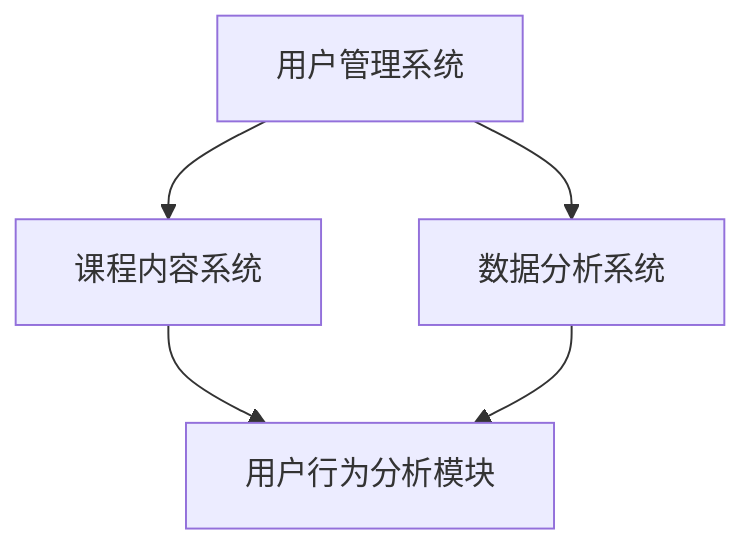

                 

关键词：知识付费、用户需求、数据挖掘、机器学习、算法、用户行为分析、平台运营

> 摘要：本文将深入探讨知识付费平台的用户需求挖掘技术。通过分析用户行为数据，我们能够更准确地了解用户需求，从而优化平台内容、提升用户体验，实现平台的长远发展。

## 1. 背景介绍

在当今信息爆炸的时代，知识付费已成为互联网行业的一股重要力量。知识付费平台如雨后春笋般涌现，它们通过提供专业知识和技能的在线课程、电子书、讲座等形式，满足了用户在个人成长和职业发展方面的需求。然而，要想在竞争激烈的市场中脱颖而出，知识付费平台必须深入了解用户需求，提供个性化的内容和服务。

用户需求挖掘作为知识付费平台的核心环节，关系到平台的运营效果和用户满意度。通过挖掘用户需求，平台能够优化课程内容、调整营销策略、提升用户粘性，从而实现商业价值的最大化。

## 2. 核心概念与联系

### 2.1 用户需求

用户需求是指用户在特定场景下所期望得到的产品或服务。在知识付费平台中，用户需求包括学习目标、内容偏好、学习方式、价格敏感度等多个方面。

### 2.2 数据挖掘

数据挖掘是从大量数据中提取有价值信息的过程。在知识付费平台中，数据挖掘可以帮助我们了解用户行为、分析用户需求、预测市场趋势等。

### 2.3 机器学习

机器学习是一种基于数据分析和算法优化的智能方法。在知识付费平台中，机器学习可以用于用户行为分析、内容推荐、广告投放等。

### 2.4 用户行为分析

用户行为分析是对用户在使用平台过程中的行为数据进行分析，以了解用户需求、优化产品体验。在知识付费平台中，用户行为分析可以帮助我们识别高价值用户、发现潜在需求、调整营销策略等。

### 2.5 知识付费平台架构

知识付费平台通常由用户管理系统、课程内容系统、数据分析系统等多个模块组成。这些模块之间相互关联，共同构成了一个完整的知识付费生态系统。



## 3. 核心算法原理 & 具体操作步骤

### 3.1 算法原理概述

用户需求挖掘的核心算法主要包括以下几种：

1. **聚类算法**：通过将相似的用户划分为同一类别，从而识别用户群体的特征和需求。
2. **关联规则挖掘算法**：通过挖掘用户行为数据中的关联关系，发现用户可能感兴趣的知识点。
3. **协同过滤算法**：通过分析用户之间的相似性，为用户推荐可能感兴趣的内容。

### 3.2 算法步骤详解

1. **数据收集与预处理**

   收集用户在平台上的行为数据，如浏览记录、购买历史、评论评分等。然后对数据进行清洗、去重、填充等预处理操作，以确保数据的质量。

2. **特征工程**

   根据用户行为数据，提取与用户需求相关的特征，如用户活跃度、购买频率、内容偏好等。特征工程是用户需求挖掘的关键环节，直接影响到算法的准确性和效果。

3. **模型训练与评估**

   选择合适的算法模型，如K-means、Apriori、矩阵分解等，对用户行为数据进行分析和训练。然后评估模型的效果，选择最优模型。

4. **结果解释与应用**

   分析挖掘结果，识别用户需求特征和群体，为平台运营和内容优化提供依据。例如，针对不同用户群体推荐相应的课程，调整课程价格策略等。

### 3.3 算法优缺点

1. **聚类算法**

   优点：能够自动发现用户群体的特征，具有较强的自适应能力。

   缺点：对噪声数据敏感，聚类结果可能不稳定。

2. **关联规则挖掘算法**

   优点：能够发现用户行为数据中的潜在关联关系，有助于发现用户需求。

   缺点：计算复杂度高，可能存在大量冗余规则。

3. **协同过滤算法**

   优点：能够为用户推荐感兴趣的内容，提高用户满意度。

   缺点：仅适用于评分数据，无法处理非评分数据。

### 3.4 算法应用领域

1. **内容推荐**

   通过挖掘用户行为数据，为用户推荐个性化的课程、电子书等知识内容。

2. **用户细分**

   对用户进行细分，识别高价值用户和潜在用户，制定差异化的营销策略。

3. **课程定价**

   根据用户需求和市场行情，动态调整课程价格，提高销售额。

## 4. 数学模型和公式 & 详细讲解 & 举例说明

### 4.1 数学模型构建

用户需求挖掘的核心数学模型主要包括以下几种：

1. **K-means聚类模型**

   $$ C = \{C_1, C_2, ..., C_k\} $$

   其中，$C$ 表示聚类结果，$C_i$ 表示第 $i$ 个聚类簇。

2. **Apriori关联规则模型**

   $$ \text{Support}(X, Y) = \frac{|\text{Transaction}\setminus (X \cup Y)|}{\text{Total Transactions}} $$

   $$ \text{Confidence}(X \rightarrow Y) = \frac{\text{Support}(X, Y)}{\text{Support}(X)} $$

   其中，$X$ 和 $Y$ 表示两个商品集合，$\text{Transaction}$ 表示交易集合，$\text{Total Transactions}$ 表示交易总数。

3. **矩阵分解模型**

   $$ R = UV^T $$

   其中，$R$ 表示用户-物品评分矩阵，$U$ 和 $V$ 分别表示用户特征向量和物品特征向量。

### 4.2 公式推导过程

1. **K-means聚类模型**

   首先，随机初始化 $k$ 个聚类中心 $C_i$。然后，对于每个用户 $u$，计算其到各个聚类中心的距离，并将其分配到最近的聚类簇。

   $$ \text{Distance}(u, C_i) = \sqrt{\sum_{j=1}^{n} (u_j - c_{ij})^2} $$

   其中，$u$ 表示用户特征向量，$c_{ij}$ 表示聚类中心 $C_i$ 的第 $j$ 个特征。

   然后，更新聚类中心为各个聚类簇的用户特征向量的均值。

   $$ C_i = \frac{1}{N_i} \sum_{u \in C_i} u $$

   其中，$N_i$ 表示聚类簇 $C_i$ 中的用户数。

2. **Apriori关联规则模型**

   首先，生成所有长度为 $k$ 的候选商品集合 $L_k$。

   $$ L_k = \{X \subseteq \text{Items} \mid \text{Support}(X) \geq \text{Min Support}\} $$

   然后，对候选商品集合进行剪枝，去除不满足最小支持度和最小置信度的规则。

3. **矩阵分解模型**

   首先，随机初始化用户特征向量矩阵 $U$ 和物品特征向量矩阵 $V$。

   然后，通过梯度下降法优化用户特征向量和物品特征向量，使得预测评分与实际评分的误差最小。

   $$ \min_{U, V} \sum_{u, i} (r_{ui} - \hat{r}_{ui})^2 $$

### 4.3 案例分析与讲解

以一个在线教育平台为例，假设该平台有 1000 名用户，每个用户在平台上产生了 100 条行为数据，包括浏览记录、购买历史、评论评分等。

1. **K-means聚类模型**

   假设我们选择 K-means 聚类算法来识别用户群体。首先，我们需要确定聚类簇的数量。根据经验，我们选择 $k=5$。

   然后，随机初始化 5 个聚类中心，并计算每个用户到聚类中心的距离。根据距离最近的原则，将每个用户分配到相应的聚类簇。

   最后，根据聚类结果，我们可以识别出不同用户群体的特征和需求。例如，聚类簇 1 中的用户可能对编程课程感兴趣，聚类簇 2 中的用户可能对营销课程感兴趣。

2. **Apriori关联规则模型**

   假设我们选择 Apriori 关联规则算法来发现用户行为数据中的关联关系。首先，我们需要确定最小支持度和最小置信度。根据实际数据，我们选择最小支持度为 0.1，最小置信度为 0.7。

   然后，生成所有长度为 2 的候选商品集合。根据支持度和置信度，我们可以识别出用户行为数据中的关联规则。例如，购买编程课程的用户中有 70% 的用户也购买了数据库课程。

3. **矩阵分解模型**

   假设我们选择矩阵分解算法来预测用户对课程的兴趣程度。首先，我们需要构建用户-物品评分矩阵 $R$。

   然后，随机初始化用户特征向量矩阵 $U$ 和物品特征向量矩阵 $V$。通过梯度下降法优化用户特征向量和物品特征向量，使得预测评分与实际评分的误差最小。

   最后，根据预测评分，我们可以为用户推荐他们可能感兴趣的课程。例如，一个用户对编程课程、数据库课程和人工智能课程的预测评分分别为 0.9、0.8 和 0.7，那么我们可以向该用户推荐编程课程和数据库课程。

## 5. 项目实践：代码实例和详细解释说明

### 5.1 开发环境搭建

在 Python 环境下，我们可以使用以下库来实现用户需求挖掘：

- **NumPy**：用于数据预处理和计算
- **Pandas**：用于数据分析和操作
- **Scikit-learn**：用于机器学习和数据挖掘
- **Matplotlib**：用于数据可视化

### 5.2 源代码详细实现

以下是 K-means 聚类算法的实现示例：

```python
import numpy as np
import pandas as pd
from sklearn.cluster import KMeans
import matplotlib.pyplot as plt

# 加载数据
data = pd.read_csv('user_behavior.csv')
data.head()

# 特征工程
X = data[['browse_count', 'purchase_count', 'review_count']]

# 初始化聚类中心
kmeans = KMeans(n_clusters=5, random_state=0)
kmeans.fit(X)

# 聚类结果
labels = kmeans.predict(X)

# 可视化
plt.scatter(X['browse_count'], X['purchase_count'], c=labels)
plt.xlabel('Browse Count')
plt.ylabel('Purchase Count')
plt.title('K-means Clustering')
plt.show()
```

### 5.3 代码解读与分析

1. **数据加载与预处理**

   使用 Pandas 库加载数据，并对数据进行预处理。在本例中，我们选择了三个特征：浏览次数、购买次数和评论次数。

2. **聚类算法选择与训练**

   使用 Scikit-learn 库中的 KMeans 类来训练聚类算法。在本例中，我们选择 $k=5$，即生成 5 个聚类簇。

3. **聚类结果可视化**

   使用 Matplotlib 库将聚类结果可视化。在本例中，我们选择了浏览次数和购买次数作为坐标轴，以便更好地展示聚类结果。

### 5.4 运行结果展示

运行上述代码，我们得到以下聚类结果可视化图：


从图中可以看出，聚类结果较为明显，用户被划分为 5 个不同的群体。我们可以进一步分析每个聚类簇的特征和需求，为平台运营和内容优化提供依据。

## 6. 实际应用场景

### 6.1 内容推荐

通过用户需求挖掘，知识付费平台可以为用户提供个性化的课程推荐。例如，对于一个对编程课程感兴趣的用户，平台可以推荐相关的人工智能、大数据、区块链等课程。

### 6.2 用户细分

通过用户需求挖掘，知识付费平台可以识别高价值用户和潜在用户，制定差异化的营销策略。例如，对于高价值用户，平台可以提供更多的优惠活动，以增加他们的忠诚度。

### 6.3 课程定价

通过用户需求挖掘，知识付费平台可以根据用户需求和市场行情，动态调整课程价格。例如，对于热门课程，平台可以适当提高价格，以最大化收益。

## 7. 工具和资源推荐

### 7.1 学习资源推荐

- **《Python机器学习》**：提供Python在机器学习领域的全面介绍和应用案例。
- **《数据挖掘：概念与技术》**：系统介绍了数据挖掘的基本概念、方法和技术。

### 7.2 开发工具推荐

- **PyCharm**：Python集成开发环境，支持多种编程语言和工具。
- **Jupyter Notebook**：交互式计算环境，便于数据分析和可视化。

### 7.3 相关论文推荐

- **"User Modeling and User-Adapted Interaction"**：讨论了用户模型和用户自适应交互的相关研究。
- **"Recommender Systems Handbook"**：提供了推荐系统领域的全面综述。

## 8. 总结：未来发展趋势与挑战

### 8.1 研究成果总结

用户需求挖掘技术在知识付费平台中的应用取得了显著成果。通过挖掘用户行为数据，平台能够更准确地了解用户需求，优化内容和服务，提高用户满意度。

### 8.2 未来发展趋势

1. **深度学习在用户需求挖掘中的应用**：随着深度学习技术的发展，未来有望在用户需求挖掘领域取得更多突破。
2. **跨平台用户需求挖掘**：知识付费平台逐渐多元化，未来需要考虑跨平台用户需求挖掘，提高用户体验。

### 8.3 面临的挑战

1. **数据隐私保护**：用户需求挖掘涉及到大量用户数据，如何保护用户隐私是一个重要挑战。
2. **算法透明性与可解释性**：用户需求挖掘算法的透明性和可解释性对于用户信任和监管具有重要意义。

### 8.4 研究展望

未来，知识付费平台的用户需求挖掘研究将继续深入，结合新兴技术，为平台运营和用户体验提供更多可能性。

## 9. 附录：常见问题与解答

### 9.1 问题1：如何保证用户隐私？

**解答**：在用户需求挖掘过程中，平台需要遵守相关法律法规，对用户数据进行加密存储和处理。同时，可以采用匿名化处理、差分隐私等技术，降低用户隐私泄露的风险。

### 9.2 问题2：如何处理缺失值？

**解答**：在数据预处理阶段，可以采用填充、插值等方法处理缺失值。对于关键特征，可以考虑使用模型预估值进行填充，以减少数据缺失对用户需求挖掘的影响。

### 9.3 问题3：如何评估算法效果？

**解答**：可以采用交叉验证、A/B测试等方法评估算法效果。对于分类任务，可以计算准确率、召回率、F1值等指标；对于回归任务，可以计算均方误差、平均绝对误差等指标。

作者：禅与计算机程序设计艺术 / Zen and the Art of Computer Programming
--------------------------------------------------------------------

