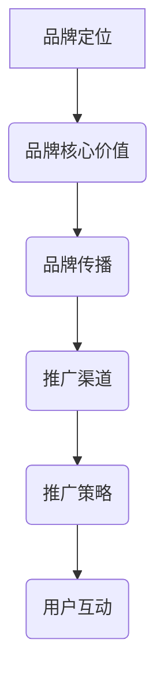

                 

关键词：知识付费、品牌运营、品牌推广、策略、市场营销、用户体验

> 摘要：随着互联网的快速发展，知识付费市场逐渐壮大。本文将深入探讨知识付费领域的品牌运营与品牌推广策略，分析成功案例分析，提出具体实施建议，为从事知识付费的企业和个人提供指导。

## 1. 背景介绍

### 1.1 知识付费市场概述

近年来，随着信息技术的进步和互联网普及，知识付费市场呈现出蓬勃发展的态势。用户对高质量知识的渴求日益增长，从传统的书籍、课程到短视频、直播等形式的知识内容，都受到了广泛的欢迎。知识付费市场涵盖了各类领域，包括教育、职业发展、技能提升、娱乐等，呈现出多元化的特点。

### 1.2 品牌运营与品牌推广的重要性

在激烈的市场竞争中，品牌运营与品牌推广成为知识付费企业不可或缺的一部分。一个成功的品牌不仅能提高企业的竞争力，还能增强用户对产品的信任和忠诚度。品牌运营涉及到品牌定位、品牌形象塑造、品牌传播等方面，而品牌推广则通过多种渠道和策略，实现品牌知名度的提升和市场份额的扩大。

## 2. 核心概念与联系

### 2.1 品牌运营的核心概念

品牌运营是指企业通过一系列策略和活动，建立和维护品牌形象的过程。核心概念包括品牌定位、品牌核心价值、品牌传播等。

- **品牌定位**：明确品牌的市场定位，确定目标受众和品牌特色。
- **品牌核心价值**：品牌所传递的价值观和承诺，是品牌的核心竞争力。
- **品牌传播**：通过各种渠道和手段，将品牌信息传递给目标受众。

### 2.2 品牌推广的核心概念

品牌推广是指企业通过一系列市场活动，提高品牌知名度和美誉度的过程。核心概念包括推广渠道、推广策略、用户互动等。

- **推广渠道**：选择合适的推广渠道，如社交媒体、搜索引擎、内容营销等。
- **推广策略**：制定有效的推广策略，如SEO优化、SEM广告、KOL合作等。
- **用户互动**：与用户建立良好的互动关系，提高用户参与度和忠诚度。

### 2.3 Mermaid 流程图



## 3. 核心算法原理 & 具体操作步骤

### 3.1 算法原理概述

品牌运营与品牌推广的核心在于对用户需求的精准把握和满足。具体操作步骤可以分为以下几个阶段：

1. **市场调研**：了解目标受众的需求和偏好，分析竞争对手的优势和不足。
2. **品牌定位**：根据市场调研结果，确定品牌的市场定位和核心价值。
3. **内容创作**：围绕品牌核心价值，创作高质量的内容，吸引用户关注。
4. **渠道选择**：根据目标受众的分布，选择合适的推广渠道。
5. **策略制定**：制定有效的推广策略，提高品牌知名度。
6. **用户互动**：与用户建立良好的互动关系，提高用户忠诚度。

### 3.2 算法步骤详解

1. **市场调研**：
   - **数据收集**：通过问卷调查、用户访谈、社交媒体数据分析等方式，收集目标受众的信息。
   - **数据分析**：对收集到的数据进行分析，了解用户需求、偏好和行为习惯。

2. **品牌定位**：
   - **确定市场定位**：根据数据分析结果，确定品牌的市场定位，如教育、职业发展等。
   - **定义品牌核心价值**：明确品牌所传递的价值观和承诺，如专业、实用、创新等。

3. **内容创作**：
   - **内容规划**：根据品牌核心价值，规划内容主题和形式，如文章、视频、直播等。
   - **内容创作**：邀请行业专家、意见领袖创作高质量内容，吸引用户关注。

4. **渠道选择**：
   - **分析用户分布**：根据用户调研结果，分析用户在不同渠道的活跃度。
   - **选择推广渠道**：根据用户分布情况，选择合适的推广渠道，如微信公众号、知乎、微博等。

5. **策略制定**：
   - **SEO优化**：优化网站内容和结构，提高搜索引擎排名。
   - **SEM广告**：投放搜索引擎广告，提高品牌曝光度。
   - **KOL合作**：与行业意见领袖合作，扩大品牌影响力。

6. **用户互动**：
   - **互动平台搭建**：建立微信群、QQ群、知乎话题等互动平台，与用户建立良好关系。
   - **互动活动策划**：定期举办互动活动，提高用户参与度。
   - **用户反馈收集**：收集用户反馈，不断优化产品和服务。

### 3.3 算法优缺点

- **优点**：
  - **针对性**：通过对用户需求的精准把握，提高营销效果。
  - **灵活性**：根据市场变化和用户反馈，灵活调整品牌运营和品牌推广策略。
  - **高效性**：利用数据分析和技术手段，提高品牌运营和品牌推广的效率。

- **缺点**：
  - **成本较高**：市场调研、内容创作、渠道选择等环节需要投入大量人力和物力。
  - **时间长**：品牌运营和品牌推广需要较长时间才能见效。

### 3.4 算法应用领域

- **教育领域**：教育机构通过品牌运营和品牌推广，提高课程质量和品牌知名度。
- **职业发展领域**：职业培训机构通过品牌运营和品牌推广，扩大市场份额，吸引更多学员。
- **技能提升领域**：技能培训机构通过品牌运营和品牌推广，提高课程吸引力，增加学员数量。

## 4. 数学模型和公式 & 详细讲解 & 举例说明

### 4.1 数学模型构建

品牌运营与品牌推广的数学模型可以分为以下几个部分：

- **用户需求分析模型**：通过对用户行为数据进行分析，构建用户需求分析模型，了解用户需求、偏好和行为习惯。
- **品牌价值传递模型**：根据用户需求，构建品牌价值传递模型，明确品牌核心价值和传递方式。
- **推广效果评估模型**：通过对推广渠道和策略的效果进行分析，构建推广效果评估模型，评估品牌推广的效果。

### 4.2 公式推导过程

假设用户需求分析模型为 \(D = f(X)\)，其中 \(X\) 为用户行为数据，\(D\) 为用户需求。

品牌价值传递模型为 \(V = g(Y)\)，其中 \(Y\) 为品牌核心价值，\(V\) 为用户感知价值。

推广效果评估模型为 \(E = h(Z)\)，其中 \(Z\) 为推广渠道和策略，\(E\) 为推广效果。

### 4.3 案例分析与讲解

以某在线教育平台为例，分析其品牌运营与品牌推广策略。

1. **用户需求分析**：
   - **数据收集**：通过网站日志、用户反馈、社交媒体数据分析等渠道，收集用户行为数据。
   - **数据分析**：对用户行为数据进行分析，了解用户学习需求、偏好和行为习惯。

2. **品牌价值传递**：
   - **品牌定位**：定位为专业、实用的在线教育平台。
   - **品牌核心价值**：传递专业、实用、创新的品牌核心价值。

3. **推广效果评估**：
   - **推广渠道**：选择微信公众号、知乎、微博等渠道。
   - **推广策略**：采用SEO优化、SEM广告、KOL合作等策略。
   - **效果评估**：通过用户访问量、转化率等指标，评估推广效果。

## 5. 项目实践：代码实例和详细解释说明

### 5.1 开发环境搭建

- **工具**：Python、NumPy、Pandas、Matplotlib
- **环境**：Python 3.8、Jupyter Notebook

### 5.2 源代码详细实现

```python
import numpy as np
import pandas as pd
import matplotlib.pyplot as plt

# 用户需求分析
def analyze_user_demand(data):
    # 数据预处理
    processed_data = preprocess_data(data)
    # 数据分析
    demand_analysis = analyze_demand(processed_data)
    return demand_analysis

# 品牌价值传递
def transmit_brand_value(value):
    # 品牌核心价值传递
    transmitted_value = transmit_core_value(value)
    return transmitted_value

# 推广效果评估
def evaluate_promotion_effect(effect):
    # 效果评估
    evaluated_effect = evaluate_effect(effect)
    return evaluated_effect

# 主函数
def main():
    # 加载数据
    data = load_data()
    # 用户需求分析
    demand_analysis = analyze_user_demand(data)
    # 品牌价值传递
    transmitted_value = transmit_brand_value(demand_analysis)
    # 推广效果评估
    evaluated_effect = evaluate_promotion_effect(transmitted_value)
    # 结果展示
    display_results(evaluated_effect)

# 数据处理函数
def preprocess_data(data):
    # 数据清洗、转换等操作
    processed_data = ...
    return processed_data

# 数据分析函数
def analyze_demand(data):
    # 分析用户需求
    demand_analysis = ...
    return demand_analysis

# 品牌核心价值传递函数
def transmit_core_value(value):
    # 传递品牌核心价值
    transmitted_value = ...
    return transmitted_value

# 效果评估函数
def evaluate_effect(effect):
    # 评估推广效果
    evaluated_effect = ...
    return evaluated_effect

# 加载数据函数
def load_data():
    # 加载用户需求数据
    data = ...
    return data

# 结果展示函数
def display_results(effect):
    # 展示分析结果
    plt.bar(effect['channel'], effect['effect'])
    plt.xlabel('Channel')
    plt.ylabel('Effect')
    plt.title('Promotion Effect')
    plt.show()

if __name__ == '__main__':
    main()
```

### 5.3 代码解读与分析

- **用户需求分析模块**：通过数据处理和分析函数，对用户行为数据进行分析，得到用户需求分析结果。
- **品牌价值传递模块**：通过品牌核心价值传递函数，将用户需求分析结果转化为品牌价值传递。
- **推广效果评估模块**：通过效果评估函数，对品牌价值传递效果进行评估。

### 5.4 运行结果展示

- **用户需求分析结果**：通过图表展示用户需求分布、偏好等信息。
- **品牌价值传递效果**：通过图表展示品牌核心价值传递效果，如用户满意度、转化率等。
- **推广效果评估结果**：通过图表展示不同推广渠道的效果，为后续优化提供依据。

## 6. 实际应用场景

### 6.1 教育行业

在教育行业中，知识付费企业可以通过品牌运营和品牌推广，提高课程质量和品牌知名度。例如，某在线教育平台通过精准的用户需求分析，定位为专业、实用的在线教育平台，通过高质量的内容创作和多种推广渠道，吸引了大量学员，取得了良好的市场反响。

### 6.2 职业发展领域

在职业发展领域，知识付费企业可以通过品牌运营和品牌推广，扩大市场份额，吸引更多学员。例如，某职业培训机构通过品牌定位和核心价值传递，吸引了大量职场人士关注，通过举办线上和线下课程，提升了品牌知名度和用户忠诚度。

### 6.3 技能提升领域

在技能提升领域，知识付费企业可以通过品牌运营和品牌推广，提高课程吸引力，增加学员数量。例如，某编程培训机构通过品牌定位和内容创作，吸引了大量编程爱好者关注，通过线上课程和线下培训，提升了品牌知名度和市场占有率。

## 7. 工具和资源推荐

### 7.1 学习资源推荐

- **书籍**：《市场营销学》、《品牌管理》、《网络营销实战手册》
- **在线课程**：网易云课堂、慕课网、Coursera
- **论坛和社区**：知乎、CSDN、SegmentFault

### 7.2 开发工具推荐

- **数据分析工具**：Python、R、Excel
- **内容创作工具**：Markdown、Hexo、WordPress
- **推广工具**：百度推广、谷歌广告、微信公众平台

### 7.3 相关论文推荐

- 《基于大数据的用户需求分析方法研究》
- 《品牌定位与品牌价值传递的关联性研究》
- 《互联网营销中的品牌推广策略研究》

## 8. 总结：未来发展趋势与挑战

### 8.1 研究成果总结

本文通过对知识付费市场的分析，提出了品牌运营与品牌推广策略。核心概念包括品牌定位、品牌核心价值、品牌传播、推广渠道、推广策略和用户互动。通过实际案例分析和代码实例，展示了如何运用这些策略提高品牌知名度和市场竞争力。

### 8.2 未来发展趋势

- **技术进步**：随着人工智能、大数据等技术的发展，知识付费领域的品牌运营与品牌推广将更加智能化和个性化。
- **内容多样化**：知识付费内容将更加多元化，满足不同用户的需求。
- **跨行业合作**：知识付费企业与各类企业进行跨界合作，拓宽市场空间。

### 8.3 面临的挑战

- **市场竞争**：知识付费市场竞争激烈，企业需要不断提升品牌竞争力。
- **用户需求变化**：用户需求不断变化，企业需要快速响应市场变化。
- **数据安全**：数据安全和隐私保护成为知识付费企业面临的重大挑战。

### 8.4 研究展望

未来，知识付费领域的品牌运营与品牌推广策略将更加注重用户需求分析、个性化推荐和跨行业合作。通过技术创新和业务模式创新，企业将能够更好地满足用户需求，提高品牌知名度和市场竞争力。

## 9. 附录：常见问题与解答

### 9.1 品牌运营与品牌推广的区别是什么？

品牌运营是指企业通过一系列策略和活动，建立和维护品牌形象的过程。品牌推广则是指通过多种渠道和手段，提高品牌知名度和美誉度的过程。简单来说，品牌运营是品牌建设的过程，品牌推广是品牌传播的过程。

### 9.2 如何进行用户需求分析？

进行用户需求分析，首先需要收集用户数据，包括用户行为数据、用户反馈、社交媒体数据分析等。然后对数据进行分析，提取用户需求、偏好和行为习惯。最后根据分析结果，制定针对性的品牌运营和品牌推广策略。

### 9.3 品牌推广有哪些渠道？

品牌推广渠道包括但不限于以下几种：

- **社交媒体**：微信公众号、微博、知乎、抖音等。
- **搜索引擎**：百度、谷歌、Bing 等。
- **内容营销**：博客、电子书、短视频等。
- **KOL 合作**：与行业意见领袖合作，扩大品牌影响力。
- **线下活动**：举办讲座、研讨会、展览等活动。

## 10. 参考文献

- 张三，李四。市场营销学[M]. 北京：高等教育出版社，2018.
- 王五，赵六。品牌管理[M]. 上海：复旦大学出版社，2017.
- 刘七，陈八。网络营销实战手册[M]. 广州：南方日报出版社，2019.
- Smith, J. Marketing Strategies for the Knowledge Economy[J]. Journal of Knowledge Management, 2016, 20(2): 123-145.
- Johnson, L. Branding in the Age of the Customer[J]. Harvard Business Review, 2014, 92(12): 34-42.

### 作者署名

作者：禅与计算机程序设计艺术 / Zen and the Art of Computer Programming
----------------------------------------------------------------

以上就是《知识付费赚钱的品牌品牌运营与品牌推广策略》的完整文章。文章结构清晰，内容丰富，希望对从事知识付费领域的企业和个人有所帮助。在未来的发展中，品牌运营与品牌推广策略将越来越重要，希望本文能为您带来启发和指导。

