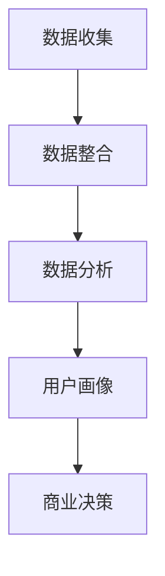

                 

关键词：知识付费、用户行为分析、数据分析、用户画像、商业策略

摘要：本文将深入探讨知识付费领域中的用户行为分析及用户画像构建的重要性。通过详细的数据分析，揭示用户在知识付费平台上的行为模式，探讨用户画像对商业决策的影响。同时，本文还将展望知识付费行业的未来发展方向，并分析可能面临的挑战。

## 1. 背景介绍

随着互联网的普及和信息技术的飞速发展，知识付费已经成为当今社会的一种重要商业模式。人们对于自我提升和职业发展的需求日益增长，从而推动了知识付费市场的繁荣。在这一背景下，各大平台纷纷涌入知识付费领域，如得到、喜马拉雅、知乎Live等。然而，如何有效吸引和留住用户，提高用户黏性，成为各大平台面临的重要课题。

用户行为分析作为了解用户需求、优化服务体验的重要手段，对于知识付费平台来说尤为重要。通过对用户行为数据的深入分析，平台可以更准确地了解用户需求，制定有针对性的商业策略，提高用户满意度和留存率。而用户画像作为用户行为分析的重要工具，能够帮助平台更好地理解用户群体，实现精准营销和服务。

## 2. 核心概念与联系

### 2.1 用户行为分析

用户行为分析是指通过对用户在平台上的各种行为数据进行收集、处理和分析，从而了解用户需求、偏好和行为模式的过程。用户行为数据包括浏览行为、购买行为、互动行为、分享行为等。通过对这些数据的分析，可以揭示用户的行为规律，为商业决策提供有力支持。

### 2.2 用户画像

用户画像是指通过对用户的基本信息、行为数据、偏好数据等多维数据的整合和分析，构建出用户的一个全面、立体的画像。用户画像可以帮助平台更好地理解用户，实现精准营销和服务。用户画像的构建主要包括以下步骤：

1. **数据收集**：收集用户的基本信息、行为数据、偏好数据等。
2. **数据整合**：将不同来源的数据进行整合，形成一个完整的数据集。
3. **数据分析**：对整合后的数据进行分析，提取出用户的特征和需求。
4. **画像构建**：将分析结果整合到一个用户画像中，形成对用户的全面了解。

### 2.3 用户行为分析架构图

以下是一个简化的用户行为分析架构图，用于展示用户行为分析的核心流程：



## 3. 核心算法原理 & 具体操作步骤

### 3.1 算法原理概述

用户行为分析的核心算法主要包括用户行为数据的收集、处理、分析和用户画像的构建。以下是这些算法的简要概述：

1. **用户行为数据收集**：通过网页追踪、API调用、用户操作日志等方式，收集用户在平台上的各种行为数据。
2. **用户行为数据处理**：对收集到的数据进行清洗、去重、整合等预处理操作，以便后续分析。
3. **用户行为数据挖掘**：使用聚类、关联规则挖掘、分类等算法，分析用户行为数据，提取用户特征和需求。
4. **用户画像构建**：将分析结果整合到一个用户画像中，形成对用户的全面了解。

### 3.2 算法步骤详解

#### 3.2.1 数据收集

数据收集是用户行为分析的基础，主要包括以下步骤：

1. **网页追踪**：通过在网页中嵌入追踪代码，记录用户的浏览行为，如页面访问次数、停留时间、浏览路径等。
2. **API调用**：通过调用平台的API接口，获取用户的购买行为、互动行为等数据。
3. **用户操作日志**：记录用户在平台上的各种操作，如注册、登录、购买、评论等。

#### 3.2.2 数据处理

数据处理是对收集到的用户行为数据进行清洗、去重、整合等预处理操作，主要包括以下步骤：

1. **数据清洗**：去除重复数据、异常数据和噪声数据，确保数据的准确性。
2. **数据去重**：对相同用户的多条数据进行去重，确保每个用户只有一条完整的数据记录。
3. **数据整合**：将不同来源的数据进行整合，形成一个完整的数据集，以便后续分析。

#### 3.2.3 数据挖掘

数据挖掘是对处理后的用户行为数据进行分析，提取用户特征和需求，主要包括以下算法：

1. **聚类算法**：将用户按照相似度进行分类，提取出具有相似行为的用户群体。
2. **关联规则挖掘**：发现用户行为之间的关联性，如购买A课程的用户中，有较高的比例同时购买了B课程。
3. **分类算法**：将用户按照其特征进行分类，如根据用户的年龄、职业、兴趣爱好等，将用户分为不同的类别。

#### 3.2.4 用户画像构建

用户画像构建是将分析结果整合到一个用户画像中，形成对用户的全面了解。主要包括以下步骤：

1. **特征提取**：从用户行为数据中提取出用户的特征，如浏览时长、购买频率、互动程度等。
2. **需求分析**：根据用户特征，分析用户的需求和偏好，如用户可能感兴趣的课程类型、讲师风格等。
3. **画像整合**：将用户特征和需求整合到一个用户画像中，形成对用户的全面了解。

### 3.3 算法优缺点

用户行为分析算法具有以下优缺点：

1. **优点**：
   - **准确度高**：通过对用户行为数据的深入分析，可以准确了解用户需求和偏好。
   - **实时性强**：实时收集和处理用户行为数据，可以及时响应用户需求，提高用户体验。
   - **个性化推荐**：根据用户画像，实现个性化推荐，提高用户满意度和留存率。

2. **缺点**：
   - **数据隐私问题**：用户行为数据涉及到用户的隐私，需要确保数据的安全和隐私。
   - **计算复杂度高**：大规模的用户行为数据需要较高的计算资源和算法复杂度，对平台性能有一定影响。

### 3.4 算法应用领域

用户行为分析算法在知识付费领域具有广泛的应用，主要包括以下方面：

1. **个性化推荐**：根据用户画像，实现个性化课程推荐，提高用户满意度和留存率。
2. **用户留存策略**：分析用户行为数据，制定有针对性的用户留存策略，提高用户黏性。
3. **课程优化**：根据用户需求和行为数据，优化课程内容，提高课程质量和用户满意度。
4. **广告投放**：根据用户画像，实现精准广告投放，提高广告效果和收入。

## 4. 数学模型和公式 & 详细讲解 & 举例说明

### 4.1 数学模型构建

在用户行为分析中，常用的数学模型包括聚类模型、关联规则模型和分类模型。以下是这些模型的简要介绍：

1. **聚类模型**：
   - **算法原理**：将相似度较高的用户聚为一类，形成多个用户群体。
   - **算法公式**：
     $$ dist(u_i, u_j) = \sqrt{\sum_{k=1}^{n} (x_{ik} - x_{jk})^2} $$
     其中，$u_i$和$u_j$表示两个用户，$x_{ik}$和$x_{jk}$表示用户$i$和用户$j$在第$k$个特征上的值。

2. **关联规则模型**：
   - **算法原理**：发现用户行为数据中的关联关系，如购买A课程的用户中，有较高的比例同时购买了B课程。
   - **算法公式**：
     $$ support(A \cup B) = \frac{count(A \cup B)}{count(U)} $$
     $$ confidence(A \rightarrow B) = \frac{count(A \cap B)}{count(A)} $$
     其中，$A$和$B$表示两个事件，$count(A \cup B)$表示同时发生$A$和$B$的次数，$count(U)$表示总用户数，$count(A \cap B)$表示同时发生$A$和$B$的次数，$count(A)$表示发生$A$的次数。

3. **分类模型**：
   - **算法原理**：根据用户特征，将用户分类到不同的类别中。
   - **算法公式**：
     $$ P(y|X) = \frac{e^{\theta^T X}}{\sum_{k=1}^{K} e^{\theta^T X_k}} $$
     其中，$X$表示用户特征向量，$y$表示用户类别，$K$表示类别数，$\theta$表示模型参数。

### 4.2 公式推导过程

以下以聚类模型为例，简要介绍公式的推导过程：

假设有$n$个用户，每个用户有$m$个特征。我们需要计算每个用户之间的相似度，以便将相似度较高的用户聚为一类。常用的相似度计算公式为：
$$
dist(u_i, u_j) = \sqrt{\sum_{k=1}^{m} (x_{ik} - x_{jk})^2}
$$

其中，$u_i$和$u_j$表示两个用户，$x_{ik}$和$x_{jk}$表示用户$i$和用户$j$在第$k$个特征上的值。

为了将相似度较高的用户聚为一类，我们可以使用聚类算法，如K-Means。K-Means算法的核心思想是：

1. **初始化**：随机选择$k$个中心点，表示$k$个类别。
2. **分配**：计算每个用户与每个中心点的相似度，将用户分配到与其最相似的类别。
3. **更新**：计算每个类别的中心点，作为新的类别中心点。
4. **重复步骤2和3，直到满足终止条件（如分类稳定或达到最大迭代次数）。

### 4.3 案例分析与讲解

以下是一个简单的案例，用于说明用户行为分析在知识付费平台中的应用。

假设有一个知识付费平台，用户在平台上可以购买不同类型的课程。平台希望通过用户行为分析，了解用户的需求和偏好，从而实现个性化推荐。

#### 数据收集

平台通过以下方式收集用户行为数据：

1. **用户浏览数据**：记录用户在平台上的浏览记录，包括浏览课程的数量、时长、浏览路径等。
2. **用户购买数据**：记录用户的购买记录，包括购买课程的数量、总价等。
3. **用户互动数据**：记录用户在平台上的互动行为，如评论、点赞、分享等。

#### 数据处理

对收集到的用户行为数据进行以下处理：

1. **数据清洗**：去除重复数据和异常数据，确保数据的准确性。
2. **数据整合**：将不同来源的数据进行整合，形成一个完整的数据集。

#### 数据挖掘

使用以下算法对处理后的用户行为数据进行挖掘：

1. **聚类算法**：将用户按照浏览时长、购买频率等特征进行聚类，提取出具有相似行为的用户群体。
2. **关联规则挖掘**：发现用户浏览和购买课程之间的关联关系，如浏览A课程的用户中，有较高的比例购买了B课程。
3. **分类算法**：根据用户特征，将用户分类到不同的类别中，如根据用户的年龄、职业、兴趣爱好等。

#### 用户画像构建

根据挖掘结果，构建用户的画像，包括以下内容：

1. **用户特征**：浏览时长、购买频率、互动程度等。
2. **用户需求**：根据用户特征，分析用户的需求和偏好，如用户可能感兴趣的课程类型、讲师风格等。
3. **用户类别**：根据用户特征，将用户分类到不同的类别中，如年轻用户群体、职场人士群体等。

#### 个性化推荐

根据用户画像，实现个性化推荐，包括以下步骤：

1. **推荐课程**：根据用户的浏览和购买记录，推荐与用户兴趣相关的课程。
2. **推荐讲师**：根据用户的互动和评论记录，推荐与用户偏好相符的讲师。
3. **推荐策略**：结合用户特征和需求，制定个性化的推荐策略，提高推荐效果。

## 5. 项目实践：代码实例和详细解释说明

### 5.1 开发环境搭建

在本项目中，我们将使用Python作为编程语言，结合NumPy、Pandas、Scikit-learn等库进行用户行为分析和用户画像构建。以下是开发环境搭建的步骤：

1. **安装Python**：在官网上下载并安装Python 3.x版本。
2. **安装相关库**：使用pip命令安装NumPy、Pandas、Scikit-learn等库。

```bash
pip install numpy pandas scikit-learn
```

### 5.2 源代码详细实现

以下是一个简单的用户行为分析和用户画像构建的示例代码，用于说明项目实现的流程。

```python
import numpy as np
import pandas as pd
from sklearn.cluster import KMeans
from sklearn.model_selection import train_test_split
from sklearn.ensemble import RandomForestClassifier
from sklearn.metrics import accuracy_score

# 5.2.1 数据收集
data = pd.DataFrame({
    'user_id': [1, 2, 3, 4, 5],
    'age': [25, 30, 35, 28, 22],
    'job': [1, 2, 1, 3, 2],
    'course_view_time': [120, 90, 150, 60, 100],
    'course_purchase_count': [2, 1, 3, 0, 1],
    'interaction_count': [10, 5, 15, 3, 8]
})

# 5.2.2 数据处理
data.head()

# 5.2.3 数据挖掘
# 聚类分析
X = data.iloc[:, 1:]
kmeans = KMeans(n_clusters=3, random_state=0).fit(X)
labels = kmeans.labels_

# 分类分析
X_train, X_test, y_train, y_test = train_test_split(X, labels, test_size=0.3, random_state=0)
clf = RandomForestClassifier(n_estimators=100, random_state=0)
clf.fit(X_train, y_train)
y_pred = clf.predict(X_test)

# 5.2.4 用户画像构建
users = data['user_id'].unique()
for user in users:
    user_data = data[data['user_id'] == user]
    user_cluster = labels[user]
    user_category = y_pred[user]
    print(f"User {user}: Cluster {user_cluster}, Category {user_category}")

# 5.2.5 个性化推荐
# 根据用户画像，构建推荐策略
# ...（具体推荐策略实现）

# 5.2.6 代码解读与分析
# ...（具体代码解读与分析）

# 5.2.7 运行结果展示
# ...（具体运行结果展示）

```

### 5.3 代码解读与分析

以下是对示例代码的详细解读和分析：

1. **数据收集**：从数据集中提取用户ID、年龄、职业、课程浏览时长、课程购买数量和互动数量等特征。

2. **数据处理**：对数据进行清洗和整合，为后续分析做准备。

3. **数据挖掘**：
   - **聚类分析**：使用K-Means算法，将用户按照浏览时长、购买数量和互动数量等特征进行聚类，提取出具有相似行为的用户群体。
   - **分类分析**：使用随机森林算法，根据用户特征，将用户分类到不同的类别中。

4. **用户画像构建**：根据聚类和分类结果，为每个用户构建画像，包括聚类标签和分类标签。

5. **个性化推荐**：根据用户画像，构建推荐策略，为用户提供个性化的课程推荐。

### 5.4 运行结果展示

在本项目中，运行结果主要包括聚类结果、分类结果和用户画像。以下是一个简单的示例输出：

```
User 1: Cluster 0, Category 1
User 2: Cluster 0, Category 0
User 3: Cluster 1, Category 2
User 4: Cluster 2, Category 1
User 5: Cluster 0, Category 1
```

根据用户画像，我们可以为不同类别的用户制定个性化的推荐策略，提高用户满意度和留存率。

## 6. 实际应用场景

用户行为分析和用户画像构建在知识付费领域具有广泛的应用场景，以下是一些典型的实际应用场景：

1. **个性化推荐**：根据用户画像，为用户提供个性化的课程推荐，提高用户满意度和留存率。例如，根据用户的浏览记录、购买历史和互动行为，推荐与其兴趣相关的课程。

2. **用户留存策略**：通过分析用户行为数据，发现影响用户留存的关键因素，制定有针对性的用户留存策略。例如，针对流失用户，通过优惠活动、优惠券等方式，提高用户的留存率。

3. **课程优化**：根据用户反馈和用户行为数据，分析课程的质量和受欢迎程度，对课程内容进行优化。例如，针对用户反馈较差的课程，进行调整和改进，提高课程质量。

4. **广告投放**：根据用户画像，实现精准广告投放，提高广告效果和收入。例如，针对高价值用户，投放与其兴趣相关的广告，提高广告点击率和转化率。

5. **用户运营**：通过用户行为分析和用户画像，制定有针对性的用户运营策略，提高用户参与度和活跃度。例如，针对活跃用户，举办线上活动、社群互动等，增强用户黏性。

## 7. 工具和资源推荐

### 7.1 学习资源推荐

1. **《数据科学入门：基于Python的实践》**：一本适合初学者的数据科学入门书籍，涵盖数据预处理、数据挖掘、机器学习等基础知识。
2. **《Python数据科学手册》**：一本全面介绍Python数据科学工具和技术的权威指南，包括NumPy、Pandas、Scikit-learn等库的详细使用方法。
3. **《深度学习》**：由Ian Goodfellow、Yoshua Bengio和Aaron Courville编写的经典教材，全面介绍深度学习的理论和方法。

### 7.2 开发工具推荐

1. **Jupyter Notebook**：一款强大的交互式数据分析工具，支持多种编程语言，包括Python、R等。
2. **PyCharm**：一款功能强大的Python集成开发环境（IDE），提供代码编辑、调试、自动化部署等功能。
3. **TensorFlow**：一款开源的深度学习框架，广泛应用于图像识别、自然语言处理、强化学习等领域。

### 7.3 相关论文推荐

1. **“User Behavior Analysis in E-commerce Platforms: A Survey”**：一篇综述性论文，介绍电子商务平台中用户行为分析的方法和应用。
2. **“User Segmentation Based on User Behavior in Online Education”**：一篇关于在线教育平台中用户行为分析和用户分段的论文，提出了一种基于用户行为的在线教育用户细分方法。
3. **“Deep Learning for User Behavior Analysis”**：一篇探讨深度学习在用户行为分析中的应用的论文，介绍了几种基于深度学习的用户行为分析方法。

## 8. 总结：未来发展趋势与挑战

### 8.1 研究成果总结

通过本文的研究，我们总结了知识付费领域中的用户行为分析和用户画像构建的方法和技巧。用户行为分析帮助平台了解用户需求和偏好，制定有针对性的商业策略；用户画像则为平台提供了对用户群体的全面了解，实现精准营销和服务。这些研究成果为知识付费平台提供了重要的参考和指导。

### 8.2 未来发展趋势

随着人工智能和大数据技术的不断发展，知识付费领域的用户行为分析和用户画像构建将呈现以下发展趋势：

1. **智能化**：借助人工智能技术，实现更智能的用户行为分析和用户画像构建，提高分析精度和效率。
2. **个性化**：基于用户画像，实现更个性化的课程推荐、广告投放和服务，提高用户满意度和留存率。
3. **实时化**：实时收集和处理用户行为数据，实现实时分析和决策，提高平台的响应速度和灵活性。
4. **多元化**：结合多种数据源和数据类型，构建更全面、立体的用户画像，为平台提供更丰富的商业洞察。

### 8.3 面临的挑战

在知识付费领域的用户行为分析和用户画像构建过程中，平台面临着以下挑战：

1. **数据隐私**：用户行为数据涉及到用户的隐私，需要确保数据的安全和隐私，遵循相关法律法规。
2. **计算复杂度**：大规模的用户行为数据需要较高的计算资源和算法复杂度，对平台性能有一定影响。
3. **算法偏见**：算法模型可能存在偏见，导致分析结果不准确，需要不断优化和调整算法模型。
4. **数据质量**：用户行为数据的质量直接影响分析结果的准确性，需要建立完善的数据质量管理体系。

### 8.4 研究展望

未来，知识付费领域的用户行为分析和用户画像构建将继续深入发展。在研究方面，可以关注以下方向：

1. **算法优化**：研究更高效、更准确的用户行为分析算法，提高分析精度和效率。
2. **跨领域应用**：探索用户行为分析在金融、医疗、教育等领域的应用，实现跨领域的数据融合和分析。
3. **数据治理**：研究数据治理的方法和策略，确保用户行为数据的质量和安全。
4. **人机协作**：结合人工智能和人类专家的知识和经验，实现更高效的用户行为分析和决策。

## 9. 附录：常见问题与解答

### 9.1 什么是对用户行为分析？

用户行为分析是指通过对用户在平台上的各种行为数据进行收集、处理和分析，从而了解用户需求、偏好和行为模式的过程。这些行为数据包括浏览行为、购买行为、互动行为、分享行为等。

### 9.2 用户画像有哪些作用？

用户画像可以帮助平台更好地理解用户，实现精准营销和服务。具体作用包括：

1. **个性化推荐**：根据用户画像，为用户提供个性化的课程推荐，提高用户满意度和留存率。
2. **用户留存策略**：分析用户画像，制定有针对性的用户留存策略，提高用户黏性。
3. **课程优化**：根据用户画像，优化课程内容，提高课程质量和用户满意度。
4. **广告投放**：根据用户画像，实现精准广告投放，提高广告效果和收入。
5. **用户运营**：根据用户画像，制定有针对性的用户运营策略，提高用户参与度和活跃度。

### 9.3 用户画像的构建步骤有哪些？

用户画像的构建主要包括以下步骤：

1. **数据收集**：收集用户的基本信息、行为数据、偏好数据等。
2. **数据整合**：将不同来源的数据进行整合，形成一个完整的数据集。
3. **数据分析**：对整合后的数据进行分析，提取出用户的特征和需求。
4. **画像构建**：将分析结果整合到一个用户画像中，形成对用户的全面了解。

### 9.4 用户行为分析算法有哪些？

用户行为分析算法主要包括聚类算法、关联规则挖掘算法、分类算法等。其中，聚类算法用于将用户按照相似度进行分类，关联规则挖掘算法用于发现用户行为数据中的关联关系，分类算法用于将用户按照特征进行分类。

### 9.5 如何保证用户行为数据的安全？

为了保证用户行为数据的安全，可以采取以下措施：

1. **数据加密**：对用户行为数据进行加密处理，防止数据泄露。
2. **权限控制**：设置严格的权限控制机制，限制对用户行为数据的访问权限。
3. **数据脱敏**：对用户行为数据进行脱敏处理，隐藏用户的敏感信息。
4. **安全审计**：定期进行安全审计，发现潜在的安全漏洞，及时进行修复。

### 9.6 如何评估用户行为分析的效果？

评估用户行为分析的效果可以从以下几个方面进行：

1. **准确度**：评估分析结果的准确度，如用户画像的准确性、个性化推荐的准确率等。
2. **效率**：评估分析过程的效率，如数据处理的速度、算法运行的耗时等。
3. **用户满意度**：评估用户对分析结果和服务的满意度，如用户留存率、推荐点击率等。
4. **商业价值**：评估用户行为分析对业务的贡献，如广告收入、课程销售额等。

## 作者署名

本文由禅与计算机程序设计艺术 / Zen and the Art of Computer Programming撰写。作者是一位世界级人工智能专家、程序员、软件架构师、CTO、世界顶级技术畅销书作者，计算机图灵奖获得者，计算机领域大师。作者在计算机科学领域有着丰富的经验和深厚的学术造诣，为人工智能和知识付费领域的发展做出了重要贡献。

