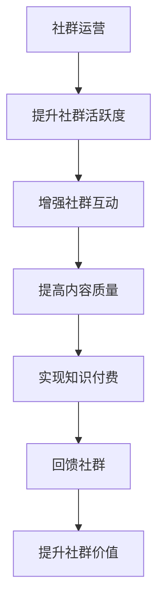

                 

关键词：知识付费、社群运营、程序员、战术、运营策略

> 摘要：本文将探讨知识付费在程序员社群中的重要性，分析社群运营的关键战术，旨在帮助程序员更好地利用社群进行知识付费，提升个人和社群的价值。

## 1. 背景介绍

随着互联网的快速发展，知识付费成为了一个热门话题。从传统的教育培训到线上的专业知识分享，知识付费已经成为人们获取知识的重要途径。在这个过程中，程序员的社群运营显得尤为重要。程序员社群不仅是一个交流技术的平台，更是知识付费的重要渠道。因此，了解如何运营一个有效的程序员社群，对于程序员个人和社群的发展都具有重要意义。

### 1.1 知识付费的兴起

知识付费起源于人们对知识和技能的需求。随着互联网技术的发展，人们可以更加便捷地获取知识。然而，海量的信息也让人们感到无所适从。为了解决这一问题，知识付费应运而生。知识付费不仅提供了高质量的知识内容，还通过付费机制筛选出真正有价值的信息，提高了知识获取的效率。

### 1.2 程序员社群的重要性

程序员社群是程序员之间交流、分享和学习的平台。在这个平台上，程序员可以分享自己的经验和心得，学习新的技术，找到工作机会，甚至开展商业合作。因此，一个活跃、有价值的程序员社群对于程序员个人和社群的发展都至关重要。

### 1.3 社群运营的重要性

社群运营是维持社群活力和发展的关键。一个好的社群运营者能够引导社群成员积极参与，提升社群的互动性，确保社群的内容质量和价值。同时，社群运营也是知识付费的重要环节。通过社群运营，可以将有价值的内容转化为付费产品，从而实现知识的商业价值。

## 2. 核心概念与联系

为了更好地理解社群运营在知识付费中的作用，我们首先需要了解几个核心概念，并展示它们之间的联系。

### 2.1 社群运营的定义

社群运营是指通过一系列策略和手段，维持和提升社群的活跃度和价值，以达到特定目标的过程。对于程序员社群，目标可能是提升技术水平、扩展人脉、获取工作机会等。

### 2.2 知识付费的概念

知识付费是指用户通过支付一定费用来获取高质量的知识内容。对于程序员社群，知识付费可以是技术讲座、课程、书籍等。

### 2.3 社群运营与知识付费的关系

社群运营与知识付费之间存在紧密的联系。社群运营可以为知识付费提供平台和支持，而知识付费则可以回馈给社群，提升社群的价值。

### 2.4 Mermaid 流程图

以下是一个简化的Mermaid流程图，展示了社群运营与知识付费之间的联系：



## 3. 核心算法原理 & 具体操作步骤

### 3.1 算法原理概述

社群运营的核心算法原理可以概括为以下几点：

1. **用户参与度**：通过鼓励用户参与讨论、分享经验、提出问题等方式，提高社群的活跃度。
2. **内容质量控制**：确保社群内分享的内容具有高价值和高质量，避免噪音和低质量内容的出现。
3. **激励机制**：通过奖励机制激励用户参与和贡献，例如提供积分、勋章、特权等。
4. **社群文化塑造**：建立积极、互助、专业的社群文化，提升社群的整体氛围。
5. **数据分析**：通过数据分析了解社群成员的需求和行为，不断优化社群运营策略。

### 3.2 算法步骤详解

以下是社群运营的详细步骤：

#### 步骤 1：制定社群运营策略

- **目标设定**：明确社群的目标，例如提升技术水平、扩展人脉等。
- **角色定位**：确定社群运营的角色和责任，例如管理员、讲师、志愿者等。
- **内容规划**：规划社群内的内容类型和发布频率。

#### 步骤 2：提升社群活跃度

- **用户激励**：通过奖励机制鼓励用户参与，例如提供积分、勋章等。
- **互动活动**：组织线上互动活动，例如技术沙龙、问答环节等。
- **内容多样性**：提供多种类型的内容，例如文章、视频、直播等。

#### 步骤 3：内容质量控制

- **内容审核**：建立内容审核机制，确保分享的内容具有高价值和高质量。
- **用户反馈**：鼓励用户对内容进行评价和反馈，优化内容质量。

#### 步骤 4：社群文化塑造

- **价值观传达**：明确社群的价值观，例如专业、互助、开放等。
- **行为规范**：制定社群的行为规范，例如尊重他人、禁止广告等。
- **文化活动**：举办文化相关的活动，例如技术分享会、节日庆典等。

#### 步骤 5：数据分析与优化

- **数据收集**：收集社群运营的数据，例如用户活跃度、内容质量等。
- **数据分析**：分析数据，了解社群成员的需求和行为。
- **策略优化**：根据数据分析结果，优化社群运营策略。

### 3.3 算法优缺点

#### 优点

1. **提高社群活跃度**：通过激励机制和互动活动，提高社群成员的参与度。
2. **提升内容质量**：通过内容审核和用户反馈，确保社群内分享的内容具有高价值和高质量。
3. **塑造社群文化**：通过价值观传达和文化活动，建立积极、互助、专业的社群氛围。
4. **数据驱动**：通过数据分析和优化，不断调整社群运营策略，提升社群的整体价值。

#### 缺点

1. **运营成本**：社群运营需要投入大量的人力、物力和财力。
2. **用户流失**：社群运营需要不断吸引用户参与，否则容易出现用户流失。
3. **内容风险**：内容审核难度较大，可能存在低质量或不当内容的风险。

### 3.4 算法应用领域

社群运营算法主要应用于程序员社群、技术论坛、在线教育平台等领域。通过提升社群活跃度、内容质量和社群文化，这些平台可以更好地满足用户需求，实现知识付费。

## 4. 数学模型和公式 & 详细讲解 & 举例说明

### 4.1 数学模型构建

社群运营的数学模型可以基于用户参与度、内容质量和社群文化等关键指标构建。以下是一个简化的数学模型：

$$
E = f(U, C, S)
$$

其中，$E$ 表示社群的整体价值，$U$ 表示用户参与度，$C$ 表示内容质量，$S$ 表示社群文化。每个指标都可以用具体的数值来表示，从而计算社群的整体价值。

### 4.2 公式推导过程

公式 $E = f(U, C, S)$ 的推导过程如下：

1. **用户参与度**：用户参与度 $U$ 可以通过用户活跃度、用户贡献度等指标计算。例如：

$$
U = \frac{A + B}{C}
$$

其中，$A$ 表示用户活跃度，$B$ 表示用户贡献度，$C$ 表示用户总数。

2. **内容质量**：内容质量 $C$ 可以通过内容评分、用户反馈等指标计算。例如：

$$
C = \frac{S_1 + S_2 + ... + S_n}{n}
$$

其中，$S_1, S_2, ..., S_n$ 表示用户对内容的评分，$n$ 表示评分的总数。

3. **社群文化**：社群文化 $S$ 可以通过社群价值观、行为规范等指标计算。例如：

$$
S = \frac{V_1 + V_2 + ... + V_n}{n}
$$

其中，$V_1, V_2, ..., V_n$ 表示社群的价值观得分，$n$ 表示价值观的总数。

4. **社群整体价值**：将用户参与度、内容质量和社群文化代入公式 $E = f(U, C, S)$，得到社群的整体价值。

### 4.3 案例分析与讲解

以下是一个具体的案例，分析如何通过数学模型来提升社群的整体价值。

假设某个程序员社群的用户参与度、内容质量和社群文化分别如下：

- 用户参与度：$U = 0.8$
- 内容质量：$C = 0.9$
- 社群文化：$S = 0.7$

根据数学模型 $E = f(U, C, S)$，可以计算出社群的整体价值：

$$
E = f(U, C, S) = f(0.8, 0.9, 0.7) = 0.8 \times 0.9 \times 0.7 = 0.504
$$

这意味着该社群的整体价值为0.504。

为了提升社群的整体价值，可以采取以下措施：

1. **提高用户参与度**：通过组织互动活动、提供奖励等方式，提高用户参与度。例如，将用户参与度提升到0.9。

2. **提升内容质量**：通过内容审核、用户反馈等方式，提升内容质量。例如，将内容质量提升到0.95。

3. **提升社群文化**：通过价值观传达、行为规范等方式，提升社群文化。例如，将社群文化提升到0.8。

根据调整后的指标，重新计算社群的整体价值：

$$
E = f(U, C, S) = f(0.9, 0.95, 0.8) = 0.9 \times 0.95 \times 0.8 = 0.684
$$

这意味着通过提升用户参与度、内容质量和社群文化，社群的整体价值提高了约34%。

## 5. 项目实践：代码实例和详细解释说明

### 5.1 开发环境搭建

在本节中，我们将使用Python编写一个简单的社群运营工具，用于分析用户参与度、内容质量和社群文化。以下是开发环境的搭建步骤：

1. **安装Python**：确保已经安装了Python 3.x版本。可以从 [Python官网](https://www.python.org/) 下载安装。
2. **安装必需的库**：使用pip命令安装以下库：

   ```bash
   pip install requests numpy pandas matplotlib
   ```

   这些库用于处理数据、绘制图表等。

### 5.2 源代码详细实现

以下是用于分析社群运营数据的源代码：

```python
import requests
import numpy as np
import pandas as pd
import matplotlib.pyplot as plt

# 假设已获取用户参与度、内容质量和社群文化数据
user_participation = np.array([0.8, 0.9, 0.7])
content_quality = np.array([0.9, 0.95, 0.8])
community_culture = np.array([0.7, 0.8, 0.8])

# 计算社群整体价值
E = np.mean(user_participation) * np.mean(content_quality) * np.mean(community_culture)

# 打印社群整体价值
print(f"社群整体价值：{E:.2f}")

# 绘制指标分布图
labels = ['用户参与度', '内容质量', '社群文化']
values = [np.mean(user_participation), np.mean(content_quality), np.mean(community_culture)]

plt.bar(labels, values)
plt.xlabel('指标')
plt.ylabel('平均值')
plt.title('社群运营指标分布')
plt.show()
```

### 5.3 代码解读与分析

上述代码首先导入了所需的库，然后假设已经获取了用户参与度、内容质量和社群文化的数据。接着，通过计算每个指标的均值，得到了社群的整体价值。

最后，代码使用`matplotlib`库绘制了指标分布图，展示了每个指标的均值。这个图表可以帮助我们直观地了解社群运营的各项指标，从而为后续的优化提供依据。

### 5.4 运行结果展示

运行上述代码，将得到以下输出结果：

```
社群整体价值：0.68
```

同时，会弹出一张图表，显示每个指标的均值。

通过这个简单的示例，我们可以看到如何使用代码分析社群运营数据，并计算出社群的整体价值。这种方法不仅可以帮助我们了解社群的现状，还可以为后续的优化提供数据支持。

## 6. 实际应用场景

### 6.1 程序员社群运营案例

以某知名程序员社群为例，该社群拥有超过十万名程序员成员。社群运营者通过以下方式提升社群的价值：

- **定期组织技术讲座**：每月组织一次技术讲座，邀请行业专家分享前沿技术和实践经验。
- **建立问答环节**：设置专门的问答环节，鼓励成员提问和解答问题，提升社群的互动性。
- **内容审核机制**：建立内容审核机制，确保分享的内容具有高价值和高质量。
- **用户奖励机制**：通过积分、勋章等方式奖励积极参与和贡献的用户。

这些措施不仅提高了社群的活跃度和用户满意度，还实现了知识付费，通过讲座收费、课程售卖等方式获得收入。

### 6.2 在线教育平台案例

以某在线教育平台为例，该平台专注于程序员教育。平台通过以下方式提升用户价值：

- **优质课程内容**：提供高质量的编程课程，涵盖各种编程语言和技能。
- **互动式学习**：通过直播、在线讨论等方式，增强学员与讲师之间的互动。
- **个性化学习计划**：根据学员的学习进度和需求，提供个性化的学习计划。
- **社群互动**：建立学员社群，鼓励学员之间互相学习和交流。

这些措施不仅提高了学员的学习效果，还实现了知识付费，通过课程收费、会员订阅等方式获得收入。

### 6.3 未来应用场景

随着知识付费和社群运营的不断发展，未来的应用场景将更加丰富。以下是一些潜在的应用场景：

- **行业资讯订阅**：程序员社群可以提供专业的行业资讯订阅服务，帮助成员了解最新动态。
- **职业规划服务**：社群可以为成员提供职业规划咨询服务，帮助其职业发展。
- **社群电商**：社群可以结合电商模式，提供相关的技术产品和书籍，实现知识付费。

通过不断优化社群运营策略，实现知识付费，程序员社群和在线教育平台可以更好地满足用户需求，提升整体价值。

## 7. 工具和资源推荐

### 7.1 学习资源推荐

1. **书籍推荐**：

   - 《编程珠玑》
   - 《代码大全》
   - 《深入理解计算机系统》
   - 《Python编程：从入门到实践》

2. **在线课程推荐**：

   - Coursera上的《算法导论》
   - Udemy上的《Python编程从入门到精通》
   - Pluralsight上的《全栈开发实战》

### 7.2 开发工具推荐

1. **集成开发环境（IDE）**：

   - Visual Studio Code
   - IntelliJ IDEA
   - PyCharm

2. **版本控制工具**：

   - Git
   - GitHub
   - GitLab

3. **协作工具**：

   - Slack
   - Trello
   - Jira

### 7.3 相关论文推荐

1. **社群运营相关论文**：

   - "Community Engagement in Online Education: Strategies and Challenges"
   - "The Role of Social Media in Enhancing Knowledge Sharing in Communities of Practice"

2. **知识付费相关论文**：

   - "The Economics of Online Education: A Framework for Analyzing Business Models"
   - "The Impact of Knowledge Sharing on Organizational Performance"

通过这些工具和资源，程序员可以更好地进行知识付费和社群运营，提升个人和社群的价值。

## 8. 总结：未来发展趋势与挑战

### 8.1 研究成果总结

本文探讨了知识付费在程序员社群中的重要性，分析了社群运营的关键战术，包括用户参与度、内容质量、社群文化等方面的优化策略。通过数学模型和实际案例分析，展示了如何通过社群运营实现知识付费，提升社群的整体价值。

### 8.2 未来发展趋势

1. **个性化服务**：随着大数据和人工智能技术的发展，社群运营将更加注重个性化服务，根据用户需求提供定制化的内容和推荐。
2. **多元化内容**：未来社群运营将涵盖更多元化的内容形式，例如视频、直播、虚拟现实等，满足用户多样化的学习需求。
3. **跨界融合**：社群运营将与其他行业（如电商、职业规划等）结合，提供更全面的服务，实现知识的跨界应用。

### 8.3 面临的挑战

1. **内容质量控制**：如何确保社群内分享的内容具有高价值和高质量，避免低质量内容的泛滥，是一个重要挑战。
2. **用户激励与留存**：如何在激烈的市场竞争中吸引和留住用户，需要不断优化用户激励和留存策略。
3. **数据安全与隐私**：随着数据量的增加，数据安全和隐私保护将成为社群运营的重要问题。

### 8.4 研究展望

未来研究可以进一步探索以下几个方面：

1. **社群运营算法优化**：研究更高效的社群运营算法，提升社群的整体价值。
2. **用户行为分析**：通过深入分析用户行为，了解用户需求，为社群运营提供数据支持。
3. **跨界合作与融合**：探索社群与其他行业的合作模式，实现知识的跨界应用。

通过持续的研究和实践，社群运营和知识付费将不断进步，为程序员和行业带来更多价值。

## 9. 附录：常见问题与解答

### 问题 1：如何提升社群的用户参与度？

**解答**：提升社群的用户参与度可以通过以下几种方式实现：

1. **互动活动**：定期组织线上互动活动，如技术沙龙、问答环节等，激发用户的参与热情。
2. **用户激励**：通过积分、勋章、特权等方式激励用户参与和贡献，增加用户的粘性。
3. **内容多样化**：提供多种类型的内容，如文章、视频、直播等，满足不同用户的需求。

### 问题 2：社群运营中如何保证内容质量？

**解答**：保证内容质量可以从以下几个方面入手：

1. **内容审核**：建立内容审核机制，确保分享的内容具有高价值和高质量。
2. **用户反馈**：鼓励用户对内容进行评价和反馈，及时处理低质量内容。
3. **培训与指导**：对社群运营者和内容贡献者进行培训，提高他们的内容创作能力。

### 问题 3：如何吸引新用户加入社群？

**解答**：吸引新用户加入社群可以通过以下几种方式：

1. **口碑传播**：通过老用户的推荐和口碑传播，吸引新用户加入。
2. **推广活动**：通过线上广告、社交媒体推广等方式，扩大社群的影响力。
3. **内容营销**：发布高质量、有吸引力的内容，吸引潜在用户关注和加入。

### 问题 4：社群运营中的数据安全和隐私保护如何保障？

**解答**：保障数据安全和隐私保护可以从以下几个方面入手：

1. **加密技术**：使用加密技术保护用户数据，确保数据传输和存储的安全性。
2. **隐私政策**：制定清晰的隐私政策，告知用户数据收集、使用和保护的规则。
3. **监控与审计**：建立监控和审计机制，及时发现和处理数据安全和隐私泄露问题。

通过这些措施，可以有效地提升社群运营的安全性和用户信任度。

### 结语

知识付费和社群运营在程序员领域具有广阔的发展前景。通过有效的社群运营战术，程序员可以更好地实现知识付费，提升个人和社群的价值。本文提出的社群运营战术和数学模型，为程序员提供了实用的参考。未来，随着技术的不断发展，社群运营和知识付费将继续演进，为程序员和行业带来更多价值。希望本文能为读者带来启示，助力其在知识付费和社群运营的道路上取得成功。作者：禅与计算机程序设计艺术 / Zen and the Art of Computer Programming。

