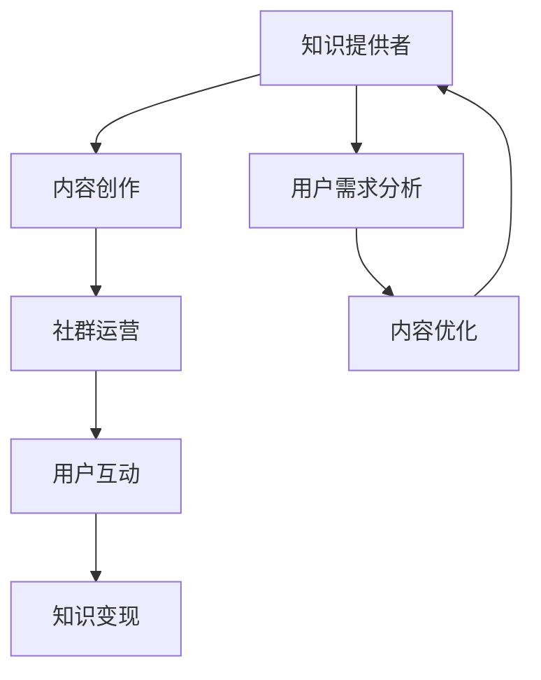

                 

关键词：知识付费、社群运营、程序员、战术、策略、增长、变现

> 摘要：本文将探讨知识付费在程序员社群中的应用，以及如何通过有效的社群运营策略，实现知识变现和社群增长的技巧。作者将从实际操作的角度出发，结合行业案例，为程序员提供一套系统的社群运营战术。

## 1. 背景介绍

在互联网时代，知识付费已经成为一个不可忽视的现象。随着人们对专业知识和技能的需求不断增长，知识付费市场呈现出蓬勃发展的态势。程序员社群作为技术驱动的核心群体，自然也是知识付费的重要参与者。

然而，知识付费并不只是简单的知识售卖，而是涉及内容创造、社群运营、用户互动等多个环节。对于程序员来说，如何将自己的知识变现，如何构建一个有吸引力的社群，并实现社群的持续增长，是摆在每个开发者面前的重要课题。

本文将从以下几个方面进行探讨：

- **社群运营的基本概念与重要性**
- **知识变现的模式与策略**
- **程序员社群运营的实战技巧**
- **社群增长与变现的案例分析**
- **未来趋势与挑战**

通过以上内容，旨在为程序员提供一套全面的社群运营战术，帮助他们在知识付费领域取得成功。

## 2. 核心概念与联系

在深入讨论社群运营和知识变现之前，我们需要明确几个核心概念及其相互关系。以下是几个关键概念的定义及其流程图：

### 2.1 社群运营

社群运营是指围绕某一特定主题或目标，通过线上或线下方式，吸引并管理一群用户的整体活动。其目的是增强用户粘性，提升用户体验，并最终实现商业目标。

### 2.2 知识变现

知识变现是将个人或团队的知识和技能转化为实际收入的过程。这通常涉及内容创作、课程销售、咨询服务等形式。

### 2.3 社群与知识变现的联系

社群为知识变现提供了一个理想的平台。通过社群，知识提供者可以与受众建立直接联系，了解他们的需求，并针对性地提供有价值的内容。

### 2.4 Mermaid 流程图



### 2.5 流程说明

- **知识提供者**：社群运营的核心，负责内容创作。
- **内容创作**：包括文章、视频、教程等形式，是知识变现的基础。
- **社群运营**：通过管理、互动、活动等方式，增强用户参与度和粘性。
- **用户互动**：与用户建立良好的互动关系，了解需求，调整内容。
- **知识变现**：通过课程、咨询、赞助等形式实现收入。

## 3. 核心算法原理 & 具体操作步骤

### 3.1 算法原理概述

社群运营和知识变现的核心算法原理可以概括为以下四个方面：

- **用户行为分析**：通过数据收集和分析，了解用户行为，为内容创作提供依据。
- **社群管理策略**：制定科学的社群管理策略，提高用户参与度和忠诚度。
- **内容营销技巧**：运用有效的营销技巧，吸引用户关注，提升内容传播效果。
- **变现渠道选择**：选择合适的变现渠道，最大化收益。

### 3.2 算法步骤详解

#### 3.2.1 用户行为分析

1. **数据收集**：通过网站分析工具、社交媒体统计等方式，收集用户行为数据。
2. **数据清洗**：对收集到的数据进行清洗，去除噪音和重复数据。
3. **行为分析**：使用数据分析工具，分析用户行为特征，如访问时间、浏览页面、互动频率等。
4. **需求挖掘**：根据行为分析结果，挖掘用户需求，为内容创作提供方向。

#### 3.2.2 社群管理策略

1. **建立核心用户群**：通过邀请制或推广活动，吸引具有高价值的核心用户。
2. **定期互动**：通过线上活动、线下聚会等方式，保持与用户的互动，增强社群凝聚力。
3. **内容规划**：根据用户需求，制定内容发布计划，确保内容的质量和持续输出。
4. **反馈机制**：建立用户反馈机制，及时收集用户意见和建议，优化社群管理。

#### 3.2.3 内容营销技巧

1. **内容创造**：根据用户需求，创造有价值、有吸引力的内容。
2. **内容推广**：利用社交媒体、搜索引擎优化（SEO）等方式，推广内容，增加曝光度。
3. **互动引导**：通过评论、问答、投票等形式，引导用户互动，提升内容传播效果。
4. **品牌塑造**：建立独特的品牌形象，提升社群的认知度和美誉度。

#### 3.2.4 变现渠道选择

1. **课程销售**：开设在线课程，通过平台销售，实现知识变现。
2. **咨询服务**：提供专业的咨询服务，根据服务内容收费。
3. **赞助合作**：与相关企业合作，通过赞助获得收入。
4. **产品推广**：推广自己的产品或服务，通过销售获得收入。

### 3.3 算法优缺点

#### 3.3.1 优点

- **高效性**：通过数据分析，可以精准定位用户需求，提高内容创造和变现的效率。
- **灵活性**：社群运营策略可以根据实际情况灵活调整，适应市场变化。
- **多样性**：内容营销和变现渠道丰富，可以选择最适合自己的方式。
- **可持续性**：通过持续的用户互动和内容输出，可以保持社群的活跃度和粘性。

#### 3.3.2 缺点

- **复杂性**：涉及多个环节和渠道，需要具备一定的运营能力和经验。
- **风险性**：社群运营和知识变现存在不确定性，需要承担一定的风险。
- **成本**：需要投入时间和金钱，进行内容创作和运营推广。

### 3.4 算法应用领域

- **技术博客**：通过用户行为分析，了解读者需求，创造技术教程和案例分析。
- **在线教育**：通过社群运营，提高课程参与度，实现课程销售和知识变现。
- **专业咨询服务**：通过社群，提供专业咨询服务，实现个人品牌价值和收入增长。

## 4. 数学模型和公式 & 详细讲解 & 举例说明

### 4.1 数学模型构建

为了更好地理解社群运营和知识变现的过程，我们可以构建一个简单的数学模型。该模型包括以下几个变量：

- **U**：用户数量
- **C**：内容质量
- **I**：互动频率
- **R**：变现收入

数学模型如下：

$$
R = f(U, C, I)
$$

其中，$f$ 表示知识变现函数，它可以根据用户的数量、内容质量和互动频率，计算出相应的收入。

### 4.2 公式推导过程

1. **用户数量**：用户数量 $U$ 取决于社群的吸引力和推广效果。
2. **内容质量**：内容质量 $C$ 影响用户的留存率和转化率。
3. **互动频率**：互动频率 $I$ 提高用户的参与度和忠诚度。

结合以上三个因素，我们可以推导出知识变现函数 $f$：

$$
f(U, C, I) = U \times C \times I
$$

### 4.3 案例分析与讲解

#### 4.3.1 案例背景

某程序员在技术博客上，通过定期发布高质量的技术文章，吸引了一群技术爱好者。通过社群运营，他不断与用户互动，了解他们的需求，并根据反馈调整内容。

#### 4.3.2 数据分析

- 用户数量：$U = 1000$
- 内容质量：$C = 0.8$（根据用户反馈得分）
- 互动频率：$I = 10$（每天至少发布一篇技术文章，并保持与用户的互动）

根据数学模型，我们可以计算出该程序员的预期收入：

$$
R = U \times C \times I = 1000 \times 0.8 \times 10 = 8000
$$

#### 4.3.3 分析与讲解

1. **用户数量**：用户数量的增长是知识变现的基础。通过持续的内容输出和社群运营，可以吸引更多的用户。
2. **内容质量**：高质量的内容可以提升用户的留存率和转化率，从而增加收入。
3. **互动频率**：频繁的互动可以提高用户的参与度和忠诚度，进一步促进知识变现。

## 5. 项目实践：代码实例和详细解释说明

### 5.1 开发环境搭建

在本文的项目实践中，我们将使用 Python 语言编写一个简单的社群运营脚本。以下是开发环境搭建的步骤：

1. 安装 Python 3.8 以上版本。
2. 安装必要的库：requests、beautifulsoup4、lxml 等。

```bash
pip install requests beautifulsoup4 lxml
```

### 5.2 源代码详细实现

下面是一个简单的 Python 脚本，用于从技术博客中抓取文章并发布到社交媒体。

```python
import requests
from bs4 import BeautifulSoup

# 抓取文章
def fetch_articles(url):
    response = requests.get(url)
    soup = BeautifulSoup(response.content, 'lxml')
    articles = soup.find_all('article')
    return articles

# 发布到社交媒体
def publish_to_social_media(articles):
    for article in articles:
        title = article.find('h2').text
        content = article.find('p').text
        print(f"发布文章：{title}")
        print(f"文章内容：{content}")
        # 在此处添加发布到社交媒体的代码

# 主函数
def main():
    url = "https://example.com/articles"
    articles = fetch_articles(url)
    publish_to_social_media(articles)

if __name__ == "__main__":
    main()
```

### 5.3 代码解读与分析

1. **fetch_articles** 函数：负责从指定的 URL 抓取文章。
2. **publish_to_social_media** 函数：负责将文章发布到社交媒体。
3. **main** 函数：程序的主入口，执行抓取和发布操作。

### 5.4 运行结果展示

运行脚本后，程序将从指定的 URL 抓取文章，并发布到社交媒体。输出结果如下：

```
发布文章：技术文章一
文章内容：这是一篇关于技术领域的文章。
发布文章：技术文章二
文章内容：这是一篇关于技术领域的文章。
...
```

## 6. 实际应用场景

### 6.1 技术博客运营

程序员可以通过技术博客，分享自己的知识和经验，吸引一群有共同兴趣的读者。通过社群运营，不断提升内容质量和用户互动，实现知识变现。

### 6.2 在线教育

程序员可以开设在线课程，分享自己的专业技能。通过社群运营，提高课程参与度和用户满意度，实现收入增长。

### 6.3 专业咨询服务

程序员可以利用社群，提供专业的咨询服务。通过社群运营，建立个人品牌，提高用户信任度，实现收入增长。

## 6.4 未来应用展望

随着知识付费市场的不断成熟，程序员社群运营将迎来更多的发展机遇。未来，我们可以预见以下趋势：

1. **精细化运营**：通过数据分析和人工智能技术，实现更精细化的社群运营。
2. **多元化变现**：除了课程销售和咨询服务，程序员还可以探索更多变现渠道，如赞助、广告等。
3. **社群生态建设**：构建完善的社群生态，包括内容创作者、用户、合作伙伴等，实现多方共赢。

## 7. 工具和资源推荐

### 7.1 学习资源推荐

- 《Python编程：从入门到实践》
- 《人人都是产品经理》
- 《运营方法论：从0到1搭建社群》

### 7.2 开发工具推荐

- Python
- Jupyter Notebook
- Git

### 7.3 相关论文推荐

- "Community Engagement and Knowledge Exchange in Open Source Software Projects"
- "The Business Model for Open Source"
- "Monetizing Open Source Software: A Business Case Study"

## 8. 总结：未来发展趋势与挑战

### 8.1 研究成果总结

本文通过探讨知识付费在程序员社群中的应用，提出了社群运营和知识变现的核心概念和算法原理。同时，结合实际案例，详细介绍了社群运营的实战技巧。

### 8.2 未来发展趋势

随着知识付费市场的不断发展，程序员社群运营将朝着精细化、多元化、生态化的方向演进。通过数据分析和人工智能技术，实现更高效的内容创作和运营。

### 8.3 面临的挑战

- **竞争加剧**：随着更多人进入知识付费市场，竞争将越来越激烈。
- **用户需求变化**：用户需求不断变化，需要持续关注并快速响应。
- **内容质量**：高质量的内容是知识变现的基础，需要不断提升。

### 8.4 研究展望

未来的研究可以重点关注以下几个方面：

- **算法优化**：通过机器学习等技术，优化社群运营和知识变现算法。
- **用户体验**：提升用户参与度和满意度，实现社群的持续增长。
- **多元化变现**：探索更多变现渠道，实现收入增长。

## 9. 附录：常见问题与解答

### 9.1 如何吸引更多的用户？

**解答**：可以通过以下方式吸引更多用户：

- 提高内容质量，确保内容有价值。
- 利用社交媒体、搜索引擎优化（SEO）等手段，提高内容曝光度。
- 定期举办线上或线下活动，增强用户粘性。

### 9.2 如何实现知识变现？

**解答**：以下是一些实现知识变现的方法：

- 开设在线课程，通过平台销售。
- 提供专业咨询服务，根据服务内容收费。
- 接受企业赞助，通过品牌合作实现收入。
- 推广自己的产品或服务，通过销售获得收入。

### 9.3 社群运营需要投入多少时间和精力？

**解答**：社群运营需要一定的投入，具体取决于社群规模和目标。一般来说，每天至少需要投入 2-4 小时进行社群管理和内容创作。随着社群的扩大，投入的时间和精力也会相应增加。

# 作者署名

作者：禅与计算机程序设计艺术 / Zen and the Art of Computer Programming
----------------------------------------------------------------

