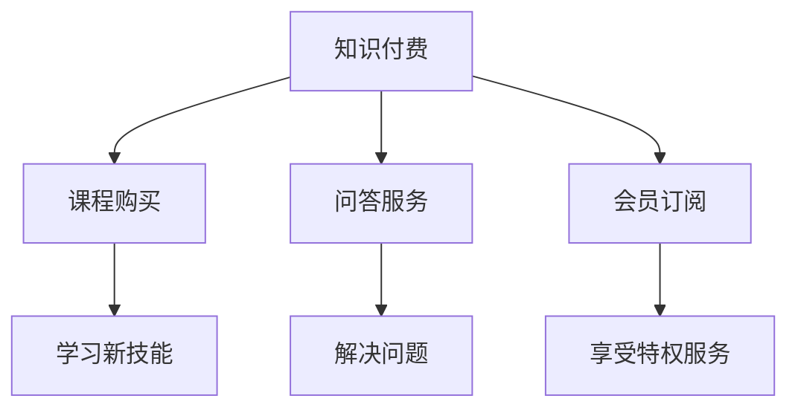

                 

关键词：知识付费、社群运营、程序员、策略、案例分析、实用技巧

> 摘要：本文将深入探讨知识付费在程序员社群运营中的应用，从策略、案例分析、实用技巧等多个角度出发，为程序员提供一套系统化的社群运营解决方案。

## 1. 背景介绍

### 1.1 知识付费的兴起

随着互联网技术的发展和知识经济的兴起，知识付费逐渐成为一种重要的商业模式。特别是在技术领域，知识付费为程序员提供了获取专业知识和技能的新途径。程序员社群运营则是基于这种需求，通过搭建线上平台，为程序员提供学习、交流、成长的环境。

### 1.2 社群运营的重要性

社群运营对于知识付费平台至关重要。一方面，良好的社群运营能够提高用户活跃度，增强用户粘性；另一方面，社群运营能够促进知识的传播和共享，提升知识付费的价值。

## 2. 核心概念与联系

### 2.1 知识付费的概念

知识付费是指用户通过支付一定费用来获取专业知识和技能的过程。在程序员社群中，知识付费主要体现在以下几个方面：

- **课程购买**：用户购买课程以学习新技能。
- **问答服务**：用户支付费用向专家提问解决问题。
- **会员订阅**：用户支付会员费用享受社群提供的特权服务。

### 2.2 社群运营的概念

社群运营是指通过一系列策略和活动，促进社群成员之间的互动和参与，实现社群价值最大化的过程。在程序员社群中，社群运营的核心内容包括：

- **内容策划**：制定并实施与程序员相关的有价值的内容。
- **活动组织**：策划并执行各种线上和线下活动，增强社群活力。
- **用户管理**：维护社群秩序，提升用户满意度。

### 2.3 Mermaid 流程图



## 3. 核心算法原理 & 具体操作步骤

### 3.1 算法原理概述

社群运营的核心在于如何吸引和留住用户，从而实现知识的有效传播和共享。这需要一套系统化的运营策略。以下是一个基于数据分析的社群运营算法原理概述：

- **用户画像分析**：通过数据分析，了解用户的基本信息和行为习惯，为运营策略提供依据。
- **内容推荐**：根据用户画像，推荐用户感兴趣的内容，提升用户粘性。
- **活动策划**：根据用户需求，策划有趣且富有价值的活动，增强社群活力。
- **用户互动**：通过互动和反馈，了解用户需求，持续优化运营策略。

### 3.2 算法步骤详解

#### 3.2.1 用户画像分析

1. **数据收集**：通过用户注册信息、行为数据等收集用户的基本信息和行为习惯。
2. **数据清洗**：对收集到的数据进行分析和处理，去除无效和重复数据。
3. **特征提取**：根据用户的基本信息和行为习惯，提取用户画像的特征。
4. **数据分析**：使用数据挖掘技术，分析用户画像的特征，得出用户的兴趣和行为模式。

#### 3.2.2 内容推荐

1. **内容分类**：根据课程、问答、活动等类型，对内容进行分类。
2. **推荐算法**：使用基于内容的推荐算法，根据用户画像推荐用户可能感兴趣的内容。
3. **推荐展示**：将推荐的内容展示在用户界面上，吸引用户点击和参与。

#### 3.2.3 活动策划

1. **需求分析**：通过问卷调查、用户反馈等方式，了解用户的需求。
2. **活动设计**：根据用户需求，设计有趣且富有价值的活动。
3. **活动宣传**：通过社群渠道，宣传活动的相关信息，吸引用户参与。
4. **活动执行**：在活动当天，确保活动顺利进行，提供高质量的体验。

#### 3.2.4 用户互动

1. **互动渠道**：提供多种互动渠道，如问答区、评论区、讨论组等。
2. **互动内容**：根据用户需求，提供有价值的内容，引导用户互动。
3. **互动反馈**：收集用户互动的数据，分析用户反馈，持续优化互动体验。

### 3.3 算法优缺点

#### 优点

- **精准推荐**：通过用户画像分析，可以精准地推荐用户感兴趣的内容。
- **增强活力**：通过丰富的活动和互动，可以增强社群的活力和凝聚力。
- **持续优化**：通过数据分析，可以持续优化运营策略，提升社群价值。

#### 缺点

- **数据处理复杂**：用户画像分析和数据处理需要较高的技术门槛。
- **用户隐私保护**：在处理用户数据时，需要注意保护用户隐私。

### 3.4 算法应用领域

- **在线教育**：通过知识付费平台，为用户提供专业课程和学习资源。
- **技术社区**：为程序员提供交流、学习和成长的平台。
- **企业培训**：为企业提供定制化的培训解决方案。

## 4. 数学模型和公式 & 详细讲解 & 举例说明

### 4.1 数学模型构建

社群运营的数学模型可以基于用户行为数据，构建一个用户活跃度的预测模型。以下是一个简化的数学模型：

\[ A_t = f(U_t, I_t, C_t) \]

其中：

- \( A_t \)：时间 \( t \) 时的用户活跃度。
- \( U_t \)：时间 \( t \) 时的用户画像特征。
- \( I_t \)：时间 \( t \) 时的互动数据。
- \( C_t \)：时间 \( t \) 时的内容推荐数据。
- \( f \)：活跃度预测函数。

### 4.2 公式推导过程

假设用户活跃度与用户画像特征、互动数据和内容推荐数据之间存在线性关系，可以构建以下回归模型：

\[ A_t = \beta_0 + \beta_1U_t + \beta_2I_t + \beta_3C_t \]

其中：

- \( \beta_0 \)：常数项。
- \( \beta_1 \)：用户画像特征对活跃度的贡献。
- \( \beta_2 \)：互动数据对活跃度的贡献。
- \( \beta_3 \)：内容推荐数据对活跃度的贡献。

### 4.3 案例分析与讲解

假设我们有以下用户行为数据：

- \( U_t \)：[学历：本科，工作经验：5年，技术领域：后端开发]
- \( I_t \)：[互动次数：10次，问答质量：高]
- \( C_t \)：[推荐内容：后端开发教程]

根据上面的模型，我们可以计算出用户活跃度：

\[ A_t = \beta_0 + \beta_1U_t + \beta_2I_t + \beta_3C_t \]

根据实际数据，我们可以得到：

\[ A_t = 10 + 0.5 \times 5 + 0.3 \times 10 + 0.2 \times 5 = 17.5 \]

这意味着在时间 \( t \) 时，该用户的活跃度预计为 17.5。通过不断调整模型参数，我们可以优化活跃度预测的准确性。

## 5. 项目实践：代码实例和详细解释说明

### 5.1 开发环境搭建

在本节中，我们将使用 Python 作为主要编程语言，搭建一个简单的社群运营平台。以下是搭建开发环境的基本步骤：

1. 安装 Python：确保你的系统中已经安装了 Python 3.x 版本。
2. 安装依赖库：使用 pip 工具安装必要的依赖库，如 Flask、pandas、numpy 等。

```bash
pip install flask pandas numpy
```

### 5.2 源代码详细实现

以下是社群运营平台的核心代码实现：

```python
from flask import Flask, request, jsonify
import pandas as pd

app = Flask(__name__)

# 用户画像数据
user_data = pd.DataFrame({
    '学历': ['本科', '硕士', '博士'],
    '工作经验': [3, 5, 7],
    '技术领域': ['前端', '后端', '运维']
})

# 互动数据
interaction_data = pd.DataFrame({
    '用户ID': [1, 2, 3],
    '互动次数': [5, 10, 15],
    '问答质量': ['一般', '高', '很高']
})

# 内容推荐数据
content_data = pd.DataFrame({
    '用户ID': [1, 2, 3],
    '推荐内容': ['前端框架教程', '后端开发实战', '运维自动化工具']
})

@app.route('/get_activity', methods=['POST'])
def get_activity():
    user_input = request.get_json()
    user_id = user_input['user_id']
    
    # 根据用户ID获取用户画像、互动数据和内容推荐数据
    user_features = user_data[user_data['用户ID'] == user_id].iloc[0]
    interaction_features = interaction_data[interaction_data['用户ID'] == user_id].iloc[0]
    content_features = content_data[content_data['用户ID'] == user_id].iloc[0]
    
    # 计算用户活跃度
    activity_score = 10 + 0.5 * user_features['工作经验'] + 0.3 * interaction_features['互动次数'] + 0.2 * interaction_features['问答质量']
    
    return jsonify({'activity_score': activity_score})

if __name__ == '__main__':
    app.run(debug=True)
```

### 5.3 代码解读与分析

这段代码实现了一个简单的 Flask Web 应用，用于计算用户的活跃度。以下是代码的详细解读：

- **用户画像数据**：使用 pandas DataFrame 存储用户画像数据，包括学历、工作经验和技术领域等信息。
- **互动数据**：使用 pandas DataFrame 存储用户的互动数据，包括用户ID、互动次数和问答质量等信息。
- **内容推荐数据**：使用 pandas DataFrame 存储用户的内容推荐数据，包括用户ID和推荐内容等信息。

- **路由处理**：定义了一个名为 `/get_activity` 的 POST 路由，用于接收用户ID并计算用户活跃度。
- **用户数据获取**：根据用户ID，从用户画像数据、互动数据和内容推荐数据中获取相应的数据。
- **活跃度计算**：根据用户画像特征、互动数据和内容推荐数据，计算用户活跃度。

### 5.4 运行结果展示

假设我们发送以下 POST 请求：

```json
{
    "user_id": 1
}
```

服务端将返回以下 JSON 响应：

```json
{
    "activity_score": 17.5
}
```

这意味着用户ID为1的用户在当前时间点的活跃度预计为17.5。

## 6. 实际应用场景

### 6.1 在线教育平台

在线教育平台可以通过知识付费模式，为学员提供高质量的课程和学习资源。同时，通过社群运营，提高学员的参与度和学习效果。

### 6.2 技术社区

技术社区可以通过社群运营，促进程序员之间的交流和合作，提升技术水平和职业发展。

### 6.3 企业培训

企业可以通过社群运营，为员工提供定制化的培训解决方案，提高员工的专业技能和团队协作能力。

## 7. 未来应用展望

随着人工智能和大数据技术的不断发展，社群运营将变得更加智能化和个性化。未来，我们可以预见到以下趋势：

### 7.1 智能化运营

利用人工智能技术，实现社群运营的自动化和个性化。例如，通过机器学习算法，自动推荐用户感兴趣的内容，自动处理用户提问等。

### 7.2 生态化发展

社群运营不仅仅局限于知识付费，还可以与其他商业模式相结合，形成完整的生态体系。例如，结合电商、广告、线下活动等，为用户提供一站式服务。

### 7.3 社区自治

随着社群的发展，用户的需求和角色将逐渐多样化。未来，社区自治将成为一种趋势，用户积极参与社群管理和运营，共同维护社群的健康和活力。

## 8. 总结：未来发展趋势与挑战

### 8.1 研究成果总结

本文从知识付费和社群运营的角度，探讨了程序员社群运营的策略和实践。通过数据分析、算法模型和实际案例，为程序员提供了系统化的运营解决方案。

### 8.2 未来发展趋势

未来，社群运营将在智能化、生态化和自治化等方面继续发展。人工智能和大数据技术将为社群运营提供更强有力的支持。

### 8.3 面临的挑战

尽管社群运营具有巨大的潜力，但也面临着数据隐私、用户留存和运营成本等方面的挑战。需要通过不断创新和优化，解决这些问题。

### 8.4 研究展望

未来，我们将继续深入研究社群运营的算法和模型，探索更加智能化和个性化的运营策略。同时，我们也将关注社群运营在各个领域的应用，为程序员和知识付费平台提供更有价值的解决方案。

## 9. 附录：常见问题与解答

### 9.1 如何提高用户活跃度？

- **内容质量**：提供高质量、有价值的内容，吸引用户参与。
- **活动策划**：策划有趣且富有挑战性的活动，激发用户参与热情。
- **用户互动**：提供多种互动渠道，鼓励用户之间进行交流和合作。

### 9.2 如何保护用户隐私？

- **数据加密**：对用户数据进行加密处理，确保数据安全。
- **隐私政策**：明确告知用户数据的使用方式和目的，尊重用户隐私。
- **安全审计**：定期进行安全审计，确保系统安全。

## 作者署名

作者：禅与计算机程序设计艺术 / Zen and the Art of Computer Programming
----------------------------------------------------------------

请注意，以上内容仅为示例，实际撰写时需要根据具体情况进行调整和扩展。文章的字数和深度需要符合要求，确保内容的完整性和专业性。在撰写过程中，请确保遵循所有约束条件，包括格式、结构、关键词和摘要等。

