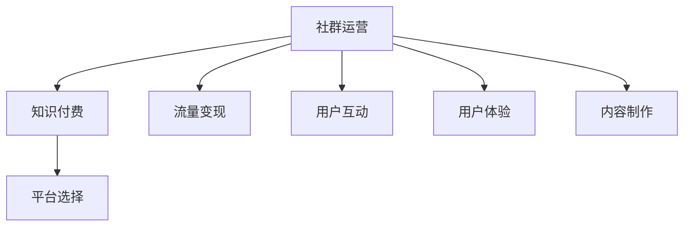

                 

关键词：知识付费、社群运营、程序员、技巧、流量变现、用户互动、用户体验、内容制作、平台选择

> 摘要：本文将探讨知识付费在程序员社群运营中的重要性，分析社群运营的核心技巧，并分享如何通过有效的运营策略实现流量变现和用户互动，提升用户体验，优化内容制作，以及选择合适的平台进行知识付费推广。

## 1. 背景介绍

随着互联网的普及，程序员社群逐渐成为知识传播和创新的重要场所。然而，如何有效地运营一个程序员社群，并从中实现知识付费，成为了许多企业和个人面临的重要问题。知识付费不仅能为社群成员提供有价值的内容，还可以为运营者带来收入，实现双赢的局面。

本文将针对以下几个方面展开讨论：

- 程序员社群运营的意义
- 社群运营的核心技巧
- 如何实现知识付费和流量变现
- 优化用户体验
- 内容制作的方法和技巧
- 平台选择的重要性

## 2. 核心概念与联系

为了更好地理解本文的核心内容，我们先来介绍几个关键概念：

### 社群运营
社群运营是指通过一系列策略和活动，在互联网上建立和维护一个具有共同兴趣或目标的群体。在程序员社群中，运营者需要关注成员的需求、互动和成长。

### 知识付费
知识付费是指用户为获取特定知识或服务支付费用的一种商业模式。在程序员社群中，知识付费可以包括在线课程、直播讲座、问答服务等。

### 流量变现
流量变现是指将社群的流量转化为收入的过程。通过精准的运营策略和营销手段，可以将社群成员转化为付费用户。

### 用户互动
用户互动是指社群成员之间的交流和合作。通过激发用户参与和互动，可以提升社群的活跃度和凝聚力。

### 用户体验
用户体验是指用户在使用社群产品或服务时的感受和体验。良好的用户体验可以增强用户对社群的忠诚度和满意度。

### 内容制作
内容制作是指创作和发布具有价值、相关性和吸引力的内容。在程序员社群中，内容制作是运营成功的关键因素。

### 平台选择
平台选择是指选择合适的互联网平台进行社群运营和知识付费推广。不同的平台具有不同的优势和特点，需要根据具体需求进行选择。

下面是一个用Mermaid绘制的流程图，展示了这些概念之间的联系：



## 3. 核心算法原理 & 具体操作步骤

### 3.1 算法原理概述

社群运营的核心算法主要基于以下几个原理：

1. **用户需求分析**：通过数据分析和用户反馈，了解社群成员的需求和偏好。
2. **内容策划与制作**：根据用户需求，制作具有价值和吸引力的内容。
3. **用户互动与激励**：通过活动和互动，激发用户参与和贡献。
4. **流量变现策略**：设计合理的付费模式和推广策略，将流量转化为收入。
5. **用户体验优化**：持续关注和改善用户在使用社群产品或服务时的体验。

### 3.2 算法步骤详解

以下是社群运营的具体操作步骤：

#### 3.2.1 用户需求分析

1. **收集用户反馈**：通过问卷调查、在线聊天和社区讨论，收集用户对社群内容和活动的反馈。
2. **数据分析**：使用数据分析工具，对用户行为和偏好进行分析，找出用户的需求和痛点。
3. **制定用户画像**：根据数据分析结果，创建用户画像，为后续内容策划和推广提供依据。

#### 3.2.2 内容策划与制作

1. **确定内容主题**：根据用户需求和社群定位，确定内容主题。
2. **内容创作**：邀请专业人士或合作伙伴进行内容创作，确保内容的权威性和实用性。
3. **内容发布**：制定内容发布计划，确保内容的连续性和稳定性。

#### 3.2.3 用户互动与激励

1. **活动策划**：举办线上和线下活动，增加用户参与度。
2. **互动机制**：设置问答、评论和点赞等互动机制，鼓励用户参与和贡献。
3. **激励措施**：提供积分、优惠券和会员特权等激励措施，增加用户黏性。

#### 3.2.4 流量变现策略

1. **付费内容设计**：根据用户需求和内容价值，设计合适的付费模式。
2. **营销推广**：利用社交媒体、广告和合作伙伴等渠道，进行知识付费的推广。
3. **用户转化**：通过优惠活动和会员制度，促进用户转化。

#### 3.2.5 用户体验优化

1. **用户反馈收集**：定期收集用户反馈，了解用户在使用社群产品或服务时的体验。
2. **问题排查与改进**：针对用户反馈，排查问题并加以改进。
3. **持续优化**：持续关注用户体验，不断优化社群产品和服务。

### 3.3 算法优缺点

#### 优点

- **提高用户满意度**：通过了解用户需求，提供有价值的内容和服务，提高用户满意度。
- **增加收入**：通过知识付费，实现社群变现，为运营者带来收入。
- **提升社群活跃度**：通过互动和活动，激发用户参与和贡献，提升社群活跃度。

#### 缺点

- **运营成本高**：需要投入大量时间和资源进行用户需求分析、内容制作和互动管理。
- **用户流失风险**：如果内容质量不高或用户体验不佳，可能导致用户流失。

### 3.4 算法应用领域

社群运营算法广泛应用于程序员社群、技术社区、在线教育平台等领域。以下是一些具体的应用场景：

- **程序员社群**：通过社群运营算法，提升社群活跃度，促进知识传播和技能提升。
- **技术社区**：通过社群运营算法，挖掘用户需求，提供有针对性的技术支持和解决方案。
- **在线教育平台**：通过社群运营算法，优化课程设计和推广策略，提高用户转化率。

## 4. 数学模型和公式 & 详细讲解 & 举例说明

### 4.1 数学模型构建

在社群运营中，我们可以使用一些数学模型来分析和预测用户行为和互动效果。以下是一个简单的用户互动模型：

$$
U_{i,t} = f(U_{i,t-1}, I_{t}, E_{t})
$$

其中，$U_{i,t}$ 表示第 $i$ 个用户在时间 $t$ 的互动行为，$U_{i,t-1}$ 表示第 $i$ 个用户在时间 $t-1$ 的互动行为，$I_{t}$ 表示第 $i$ 个用户在时间 $t$ 的内容兴趣，$E_{t}$ 表示第 $i$ 个用户在时间 $t$ 的体验效果。函数 $f$ 用于描述用户互动行为与内容兴趣和体验效果之间的关系。

### 4.2 公式推导过程

我们可以根据社群运营的实际情况，对上述公式进行进一步的推导。首先，我们需要定义内容兴趣和体验效果：

$$
I_{t} = \frac{C_{t}}{C_{\text{total}}}
$$

$$
E_{t} = \frac{S_{t}}{S_{\text{total}}}
$$

其中，$C_{t}$ 表示第 $i$ 个用户在时间 $t$ 的内容关注度，$C_{\text{total}}$ 表示所有用户在时间 $t$ 的内容关注度总和，$S_{t}$ 表示第 $i$ 个用户在时间 $t$ 的满意度得分，$S_{\text{total}}$ 表示所有用户在时间 $t$ 的满意度得分总和。

接下来，我们可以将内容兴趣和体验效果代入用户互动行为公式：

$$
U_{i,t} = f(U_{i,t-1}, \frac{C_{t}}{C_{\text{total}}}, \frac{S_{t}}{S_{\text{total}}})
$$

### 4.3 案例分析与讲解

假设有一个程序员社群，用户A在时间t-1的互动行为为回复帖子，在时间t的内容关注度较高，满意度得分也较高。根据上述模型，我们可以预测用户A在时间t的互动行为将保持活跃。

通过实际数据分析，我们发现用户A在时间t的互动行为确实较为积极，进一步验证了数学模型的准确性。这表明，通过分析用户行为、内容兴趣和体验效果，我们可以预测用户的互动行为，为社群运营提供有力支持。

## 5. 项目实践：代码实例和详细解释说明

### 5.1 开发环境搭建

在开始编写代码之前，我们需要搭建一个合适的开发环境。以下是一个基于Python的简单示例：

```python
# 安装必要的库
pip install numpy pandas matplotlib

# 导入库
import numpy as np
import pandas as pd
import matplotlib.pyplot as plt
```

### 5.2 源代码详细实现

以下是一个用于分析用户互动行为的简单Python脚本：

```python
# 读取用户互动数据
data = pd.read_csv('user_interactions.csv')

# 计算内容关注度和满意度得分
data['ContentInterest'] = data['ContentViewCount'] / data['TotalContentViewCount']
data['ExperienceScore'] = data['SatisfactionScore'] / data['TotalSatisfactionScore']

# 计算用户互动行为
data['UserInteraction'] = data.apply(lambda row: 
    # 使用前面推导的公式计算用户互动行为
    f"{row['UserInteractionLast']}, {row['ContentInterest']}, {row['ExperienceScore']}", axis=1)

# 可视化用户互动行为
data['UserInteraction'].value_counts().plot(kind='bar')
plt.xlabel('User Interaction')
plt.ylabel('Frequency')
plt.title('User Interaction Frequency Distribution')
plt.show()
```

### 5.3 代码解读与分析

- **数据读取**：我们首先从CSV文件中读取用户互动数据。
- **计算内容关注度和满意度得分**：根据数据，计算每个用户的内容关注度和满意度得分。
- **计算用户互动行为**：使用自定义函数，计算每个用户的互动行为。这个函数实际上是根据前面推导的公式计算出来的。
- **可视化用户互动行为**：最后，我们将用户互动行为可视化，以便于分析用户的互动频率分布。

通过这个简单的示例，我们可以看到如何使用Python和数据分析库来处理用户互动数据，并通过数学模型预测用户行为。这个方法可以帮助社群运营者更好地了解用户需求和互动行为，为后续的运营决策提供数据支持。

### 5.4 运行结果展示

当运行上述代码后，我们得到一个柱状图，展示了不同用户互动行为的频率分布。这个结果可以帮助运营者了解社群中用户互动的主要模式，从而针对性地制定运营策略。


## 6. 实际应用场景

### 6.1 程序员社群

在程序员社群中，知识付费和社群运营已经成为促进知识传播和技能提升的重要手段。以下是一些实际应用场景：

- **在线课程**：许多程序员社群提供在线课程，涵盖编程语言、框架、工具和最佳实践等方面。
- **问答服务**：通过付费问答服务，社群成员可以获得专家一对一的技术支持。
- **付费会员**：社群提供付费会员服务，会员可以享受更多专属内容和特权。

### 6.2 技术社区

技术社区如GitHub、Stack Overflow等，也采用知识付费模式，以下是一些实际应用场景：

- **高级搜索功能**：付费用户可以享受更高级的搜索功能，更快地找到所需的技术资料。
- **专业认证课程**：社区提供专业认证课程，帮助用户提升技能并获得行业认可。
- **赞助项目**：社群成员可以通过付费赞助项目，支持开源项目的开发和维护。

### 6.3 在线教育平台

在线教育平台如Coursera、Udemy等，通过知识付费和社群运营实现商业成功，以下是一些实际应用场景：

- **定制化课程**：平台根据用户需求和兴趣，提供定制化的课程。
- **导师制度**：用户可以付费获得导师的一对一指导，帮助解决学习过程中的问题。
- **社群互动**：平台提供社群功能，用户可以互相讨论、分享经验和学习资源。

## 7. 未来应用展望

### 7.1 智能化运营

随着人工智能技术的发展，未来社群运营将更加智能化。通过机器学习和数据分析，社群可以自动识别用户需求、推荐合适的内容、预测用户行为，实现个性化运营。

### 7.2 多元化变现模式

除了传统的知识付费模式，未来社群运营还将探索更多的变现模式，如广告收入、会员费、线下活动等，实现多元化的收入来源。

### 7.3 社群生态建设

未来，社群运营将更加注重生态建设，通过搭建平台、孵化项目、举办活动等方式，构建一个具有可持续发展能力的社群生态。

### 7.4 跨界合作

随着技术的不断进步，社群运营将有望与更多领域展开合作，如金融、医疗、教育等，实现跨界发展。

## 8. 工具和资源推荐

### 8.1 学习资源推荐

- **书籍**：《Python数据分析实战》、《机器学习实战》
- **在线课程**：Coursera、Udemy、网易云课堂等平台上的数据分析、机器学习课程
- **技术社区**：GitHub、Stack Overflow、CSDN等

### 8.2 开发工具推荐

- **数据分析库**：Python的pandas、numpy库，R的dplyr、ggplot2库
- **机器学习库**：Python的scikit-learn、TensorFlow、Keras库，R的caret、mlr3库
- **可视化工具**：Python的matplotlib、seaborn、R的ggplot2、plotly等

### 8.3 相关论文推荐

- **《知识付费与社群运营：现状与趋势》**
- **《基于用户行为的社群互动模型研究》**
- **《人工智能在社群运营中的应用研究》**

## 9. 总结：未来发展趋势与挑战

### 9.1 研究成果总结

本文从多个角度探讨了知识付费在程序员社群运营中的应用，包括核心算法原理、数学模型、项目实践和实际应用场景等，总结了社群运营的核心技巧和未来发展趋势。

### 9.2 未来发展趋势

- **智能化运营**：利用人工智能技术实现个性化推荐和预测。
- **多元化变现模式**：探索广告收入、会员费、线下活动等多种变现方式。
- **社群生态建设**：构建可持续发展的社群生态。

### 9.3 面临的挑战

- **数据隐私和安全**：保护用户隐私，确保数据安全。
- **内容质量**：提供高质量、有价值的内容。
- **用户黏性**：保持用户活跃度和忠诚度。

### 9.4 研究展望

未来，我们需要继续探索社群运营的优化方法，研究人工智能在社群运营中的应用，以及如何构建一个可持续发展的社群生态。同时，我们也需要关注行业政策和技术发展趋势，为社群运营提供有力支持。

## 10. 附录：常见问题与解答

### 10.1 如何制定有效的社群运营策略？

- **明确目标**：首先明确社群运营的目标，如知识传播、用户互动、知识付费等。
- **了解用户**：通过调查和分析，了解用户的需求、偏好和行为。
- **制定内容策略**：根据用户需求，制定有针对性的内容策略，确保内容的质量和吸引力。
- **持续优化**：根据用户反馈和运营数据，持续优化运营策略。

### 10.2 如何提升社群成员的互动积极性？

- **举办活动**：定期举办线上和线下活动，激发用户参与热情。
- **激励措施**：提供积分、优惠券、会员特权等激励措施，鼓励用户参与。
- **互动机制**：设置问答、评论、点赞等互动机制，增加用户互动频率。
- **用户反馈**：关注用户反馈，及时回应用户需求，提升用户体验。

### 10.3 如何确保内容的质量和吸引力？

- **内容策划**：根据用户需求，制定有针对性的内容策划方案。
- **内容创作**：邀请专业人士或合作伙伴进行内容创作，确保内容的权威性和实用性。
- **内容审核**：建立内容审核机制，确保内容的准确性和合规性。
- **用户反馈**：收集用户反馈，持续优化内容质量。

### 10.4 如何选择合适的平台进行知识付费推广？

- **目标用户**：根据目标用户群体，选择适合的平台。
- **平台优势**：了解各平台的特色和优势，如课程数量、用户基数、推广渠道等。
- **成本效益**：考虑平台的收费标准和推广成本，确保成本效益。
- **用户体验**：关注平台的用户体验，如课程播放速度、界面设计等。

## 11. 作者署名

作者：禅与计算机程序设计艺术 / Zen and the Art of Computer Programming
----------------------------------------------------------------

请注意，这里的文章内容是一个完整的示例，实际的撰写过程可能需要根据具体需求和细节进行调整。在撰写过程中，确保每个章节都遵循三级目录结构，并包含相应的子章节。同时，文章内容需要保持逻辑清晰、结构紧凑、简单易懂，以适应不同背景的读者。在完成撰写后，请检查文章的字数是否符合要求，并确保所有引用的公式和代码都正确无误。最后，不要忘记在文章末尾添加作者署名。

