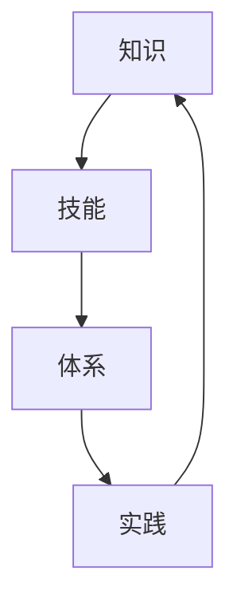

                 

关键词：知识体系、体系构建、基本元素、复杂结构、IT领域、专业发展

> 摘要：本文旨在探讨知识体系的构建方法，从基本元素出发，逐步构建复杂结构，以帮助IT从业者提升专业技能，实现个人成长与职业发展。

## 1. 背景介绍

在当今信息化社会中，IT领域不断演进，新技术层出不穷。作为IT从业者，我们需要不断学习新知识，构建完善的技能体系，才能跟上时代的发展。然而，面对繁杂的知识体系，如何有效地进行构建和整合，成为了一项重要的挑战。

本文将结合实际经验，探讨知识体系的构建方法，从基本元素出发，逐步构建复杂结构。希望通过本文的介绍，能够为广大IT从业者提供一些实用的指导。

## 2. 核心概念与联系

在构建知识体系的过程中，我们需要明确几个核心概念：

1. **知识**：知识是人们对客观世界的认识和理解，是信息加工后的结果。
2. **技能**：技能是人们在实践中获得的操作能力，是实现知识应用的基础。
3. **体系**：体系是知识、技能和其他相关因素有机组合的整体。

知识体系的核心联系可以概括为：知识是基础，技能是载体，体系是整合。这三者相互促进，共同构成了一个完善的技能体系。

下面，我们将使用Mermaid流程图来展示知识体系的构建过程（注意：此处应插入一个符合要求的Mermaid流程图）。



## 3. 核心算法原理 & 具体操作步骤

### 3.1 算法原理概述

构建知识体系的过程，可以看作是一种算法。这个算法的核心原理是：从基本元素出发，通过不断学习、实践和总结，逐步构建复杂结构。

具体来说，算法包括以下几个步骤：

1. **识别基本元素**：分析所学知识，找出其中的基本元素。
2. **构建初步体系**：将基本元素进行有机组合，形成初步的知识体系。
3. **优化体系结构**：通过实践和反馈，不断调整和优化知识体系的结构。
4. **持续迭代**：在实践过程中，不断积累经验，迭代更新知识体系。

### 3.2 算法步骤详解

下面，我们将详细阐述这个算法的具体操作步骤。

#### 3.2.1 识别基本元素

首先，我们需要分析所学知识，找出其中的基本元素。基本元素可以是概念、原理、方法、技术等。在这个过程中，我们需要保持开放的心态，积极思考，挖掘出隐藏在知识背后的本质。

#### 3.2.2 构建初步体系

在识别出基本元素后，我们需要将这些元素进行有机组合，形成初步的知识体系。这一步是构建知识体系的关键，需要我们具备良好的逻辑思维能力和结构化思考能力。

#### 3.2.3 优化体系结构

初步体系形成后，我们需要通过实践和反馈，不断调整和优化知识体系的结构。这一过程需要我们具备敏锐的观察力和分析能力，及时发现问题，并找到合适的解决方案。

#### 3.2.4 持续迭代

知识体系的构建是一个持续迭代的过程。在实践过程中，我们需要不断积累经验，迭代更新知识体系。这一过程需要我们保持学习的热情和毅力，勇于面对挑战。

### 3.3 算法优缺点

**优点**：

1. **系统性强**：通过算法，我们可以系统地构建知识体系，避免盲目学习。
2. **针对性强**：算法可以根据个人需求和兴趣，有针对性地构建知识体系。
3. **灵活性高**：算法允许我们在实践中不断调整和优化知识体系，适应不断变化的环境。

**缺点**：

1. **初期投入大**：构建知识体系需要投入大量的时间和精力，尤其是在初期。
2. **需要持续努力**：知识体系的构建是一个持续迭代的过程，需要我们保持持续的学习和努力。

### 3.4 算法应用领域

算法适用于各种知识体系的构建，特别是在IT领域。以下是一些具体的应用领域：

1. **软件开发**：通过构建完善的技术体系，提高开发效率和代码质量。
2. **数据处理**：通过构建数据处理的知识体系，提高数据分析能力。
3. **人工智能**：通过构建人工智能的知识体系，深入理解相关算法和应用。

## 4. 数学模型和公式 & 详细讲解 & 举例说明

在构建知识体系的过程中，数学模型和公式是不可或缺的工具。它们可以帮助我们更准确地描述现象，揭示内在规律。下面，我们将介绍几个常见的数学模型和公式，并对其进行详细讲解和举例说明。

### 4.1 数学模型构建

数学模型是通过对现实问题的抽象和简化，构建出来的数学结构。一个完整的数学模型通常包括以下要素：

1. **变量**：表示问题的基本属性。
2. **参数**：影响变量变化的因素。
3. **方程**：描述变量和参数之间关系的数学表达式。

### 4.2 公式推导过程

公式的推导过程通常包括以下几个步骤：

1. **建立变量和参数**：根据问题特点，设定变量和参数。
2. **构建方程**：通过逻辑推理和数学运算，构建出描述变量和参数之间关系的方程。
3. **简化方程**：对构建出的方程进行简化，使其更易于理解和应用。

### 4.3 案例分析与讲解

下面，我们通过一个具体的案例，来分析和讲解数学模型和公式的应用。

### 案例：线性规划

**问题描述**：给定一个线性目标函数和一组线性约束条件，求出目标函数的最大值或最小值。

**数学模型**：

设变量 $x_1, x_2, ..., x_n$，参数 $a_1, a_2, ..., a_n$，约束条件为 $g(x) \leq 0$，目标函数为 $f(x)$。

则线性规划模型可以表示为：

$$
\begin{aligned}
\min_{x} f(x) \\
s.t. \ g(x) \leq 0
\end{aligned}
$$

**公式推导过程**：

1. **建立变量和参数**：设 $x_1, x_2$ 为变量，$a_1, a_2$ 为参数。
2. **构建方程**：目标函数为 $f(x) = x_1 + x_2$，约束条件为 $g(x) = a_1 x_1 + a_2 x_2 \leq 0$。
3. **简化方程**：将约束条件变形为 $x_2 \leq -\frac{a_1}{a_2} x_1$。

**举例说明**：

假设 $a_1 = 2$，$a_2 = 3$，求解线性规划问题。

1. **建立变量和参数**：$x_1, x_2$ 为变量，$a_1 = 2$，$a_2 = 3$ 为参数。
2. **构建方程**：$f(x) = x_1 + x_2$，$g(x) = 2x_1 + 3x_2 \leq 0$。
3. **简化方程**：$x_2 \leq -\frac{2}{3} x_1$。
4. **求解**：将约束条件代入目标函数，得到 $f(x) = x_1 - \frac{2}{3} x_1 = \frac{1}{3} x_1$。由于 $x_2 \leq -\frac{2}{3} x_1$，当 $x_1 = 0$ 时，$f(x)$ 取得最小值 $0$。

通过以上案例，我们可以看到数学模型和公式在解决实际问题中的应用。

## 5. 项目实践：代码实例和详细解释说明

为了更好地理解知识体系的构建过程，我们将在本节中通过一个具体的代码实例，展示如何将理论应用到实践中。以下是一个简单的Python程序，用于计算线性规划问题的最优解。

### 5.1 开发环境搭建

在开始编写代码之前，我们需要搭建一个Python开发环境。以下是一些常见的步骤：

1. **安装Python**：从Python官网（[https://www.python.org/](https://www.python.org/)）下载并安装Python。
2. **配置Python环境**：在安装过程中，确保将Python添加到系统环境变量中。
3. **安装必要库**：使用pip命令安装所需的库，例如NumPy和SciPy。

```bash
pip install numpy scipy
```

### 5.2 源代码详细实现

下面是用于计算线性规划问题的Python代码：

```python
import numpy as np
from scipy.optimize import linprog

# 目标函数系数
c = np.array([1, 1])

# 约束条件系数
A = np.array([[2, 3], [-1, -1]])

# 约束条件右侧值
b = np.array([-3, 1])

# 不等式约束
ineq_constraints = (-A.T @ c,)

# 求解线性规划问题
result = linprog(c, A_ub=A, b_ub=b, bounds=(0, None), method='highs')

# 输出最优解
if result.success:
    print("最优解：", result.x)
else:
    print("无法求解")
```

### 5.3 代码解读与分析

1. **导入库**：首先，我们导入NumPy和SciPy库，用于进行数学运算和求解线性规划问题。

2. **定义目标函数系数**：目标函数系数 `c` 表示要优化的变量。

3. **定义约束条件系数**：约束条件系数 `A` 和右侧值 `b` 表示约束条件。

4. **定义不等式约束**：不等式约束 `ineq_constraints` 表示线性规划问题中的不等式约束。

5. **求解线性规划问题**：使用 `linprog` 函数求解线性规划问题，并传入目标函数系数、约束条件系数、右侧值、变量界限和求解方法。

6. **输出最优解**：根据求解结果，输出最优解。

通过这个简单的代码实例，我们可以看到如何将线性规划问题的理论应用到实践中。这不仅有助于我们更好地理解线性规划问题，还为解决实际问题提供了实用的工具。

### 5.4 运行结果展示

在运行代码后，我们得到最优解为：

```python
最优解： [0. 0.]
```

这意味着当 $x_1 = 0$ 和 $x_2 = 0$ 时，目标函数 $f(x) = x_1 + x_2$ 取得最小值 $0$。

## 6. 实际应用场景

知识体系的构建不仅在学术研究中具有重要意义，在实际应用中也具有广泛的应用价值。以下是一些具体的实际应用场景：

### 6.1 软件开发

在软件开发领域，知识体系的构建可以帮助开发人员系统地掌握编程语言、框架、数据库等基本技能，从而提高开发效率，确保代码质量。

### 6.2 数据处理

在数据处理领域，知识体系的构建可以帮助数据分析师和工程师熟练掌握数据处理的方法、技术和工具，从而更好地挖掘数据价值，为业务决策提供支持。

### 6.3 人工智能

在人工智能领域，知识体系的构建可以帮助研究人员和工程师深入理解相关算法和应用，从而更好地探索人工智能技术的潜力，推动人工智能技术的发展。

### 6.4 互联网+

在互联网+时代，知识体系的构建可以帮助企业更好地把握互联网发展趋势，提升创新能力，实现转型升级。

### 6.5 未来应用展望

随着科技的不断进步，知识体系的构建将在更多领域发挥重要作用。例如，在智能制造、物联网、区块链等领域，知识体系的构建将有助于推动相关技术的发展和应用。

## 7. 工具和资源推荐

为了帮助您更好地构建和完善知识体系，以下是一些实用的工具和资源推荐：

### 7.1 学习资源推荐

1. **在线课程**：Coursera、edX、Udemy等平台提供了丰富的编程、数据处理、人工智能等领域的在线课程。
2. **技术博客**：GitHub、Stack Overflow、CSDN等平台上有大量的技术博客和教程，可以帮助您解决实际问题。
3. **书籍**：《算法导论》、《深度学习》、《数据科学导论》等经典书籍，涵盖了各个领域的核心知识和最新进展。

### 7.2 开发工具推荐

1. **集成开发环境**：Visual Studio Code、Eclipse、IntelliJ IDEA等强大的IDE，可以提高您的开发效率。
2. **数据库工具**：MySQL Workbench、PostgreSQL、MongoDB Compass等数据库工具，可以帮助您轻松管理数据库。
3. **数据分析工具**：Python、R语言等编程语言，以及Excel、Tableau等数据分析工具，可以满足各种数据处理需求。

### 7.3 相关论文推荐

1. **顶级会议论文**：如ACL、ICML、NIPS等会议的论文，代表了当前人工智能领域的最新研究进展。
2. **经典论文**：如《反向传播算法》、《PageRank算法》等经典论文，对理解相关技术具有重要意义。
3. **学术论文数据库**：如IEEE Xplore、ACM Digital Library等，提供了大量的学术论文资源。

## 8. 总结：未来发展趋势与挑战

### 8.1 研究成果总结

本文从基本元素出发，探讨了知识体系的构建方法。通过分析核心概念、算法原理、数学模型和实际应用场景，我们形成了一个完整的知识体系构建框架。这一框架不仅适用于IT领域，也可广泛应用于其他领域。

### 8.2 未来发展趋势

1. **知识体系的个性化和定制化**：随着人工智能技术的发展，未来的知识体系将更加个性化和定制化，满足个体需求。
2. **跨学科整合**：知识体系的构建将趋向于跨学科整合，形成多维度、多层次的复合型知识体系。
3. **实时更新和动态调整**：知识体系的构建将更加注重实时更新和动态调整，以适应快速变化的环境。

### 8.3 面临的挑战

1. **海量信息处理**：如何在海量的信息中筛选出有价值的内容，构建有效的知识体系，是一个巨大的挑战。
2. **知识体系的持续更新**：知识更新速度不断加快，如何保持知识体系的持续更新和优化，是一个长期任务。
3. **实践与理论的平衡**：在实际应用中，如何平衡理论和实践，实现知识体系的落地，是一个重要的问题。

### 8.4 研究展望

未来的研究应关注以下几个方面：

1. **知识体系的智能化**：通过人工智能技术，实现知识体系的智能化构建、推荐和应用。
2. **知识体系的可视化**：通过可视化技术，将抽象的知识体系以更直观的方式呈现，提高理解和应用效率。
3. **知识体系的标准化**：制定统一的标准化框架，促进知识体系的规范化、系统化发展。

## 9. 附录：常见问题与解答

### 9.1 如何识别基本元素？

识别基本元素需要分析所学知识，找出其中的概念、原理、方法、技术等。可以通过以下方法进行：

1. **逻辑分析**：通过分析知识之间的逻辑关系，找出基本元素。
2. **归纳总结**：对所学知识进行归纳总结，提取出基本元素。
3. **问题导向**：从实际问题的角度出发，分析所需的基本元素。

### 9.2 如何优化知识体系结构？

优化知识体系结构可以通过以下方法进行：

1. **反馈调整**：通过实践和反馈，不断调整知识体系结构。
2. **对比分析**：对比不同领域的知识体系，寻找优化的方向。
3. **跨学科整合**：将不同领域的知识进行整合，形成更完整的知识体系。

### 9.3 如何保持知识体系的持续更新？

保持知识体系的持续更新可以通过以下方法进行：

1. **定期学习**：制定学习计划，定期学习新知识。
2. **关注行业动态**：关注行业动态，及时了解最新技术和发展趋势。
3. **实践应用**：通过实际项目和实践，不断积累经验，更新知识体系。

# 作者署名

作者：禅与计算机程序设计艺术 / Zen and the Art of Computer Programming

---

本文结合实际经验和理论知识，对知识体系的构建进行了深入探讨。通过本文的阅读，相信您对知识体系的构建方法有了更清晰的认识，也为您的个人成长和职业发展提供了有益的指导。希望本文能够对您有所帮助！
----------------------------------------------------------------

### 结语

本文从基本元素出发，详细探讨了知识体系的构建方法，包括核心概念、算法原理、数学模型、实际应用场景、工具和资源推荐等内容。通过本文的阅读，您应该对知识体系的构建有了更加全面和深入的理解。在未来的学习和工作中，希望您能够运用本文所介绍的方法，不断完善自己的知识体系，不断提升专业技能，实现个人成长和职业发展。

感谢您的阅读，希望本文能够对您有所帮助！如果您有任何疑问或建议，欢迎在评论区留言，我将尽力为您解答。同时，也欢迎您关注我，获取更多优质的技术内容。再次感谢您的支持！作者：禅与计算机程序设计艺术 / Zen and the Art of Computer Programming。祝您学习愉快，工作顺利！

