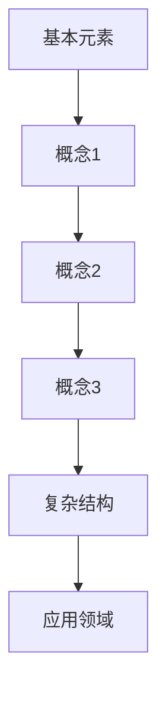

                 

关键词：知识体系，构建，基本元素，复杂结构，IT领域，算法原理，数学模型，项目实践，应用场景，未来展望

> 摘要：本文旨在探讨知识体系的构建过程，从基本元素出发，逐步构建复杂结构，以帮助IT从业者在快速发展的技术领域中保持竞争力。通过分析核心概念、算法原理、数学模型、项目实践等多个方面，本文为构建一个全面、有效的知识体系提供了理论和实践指导。

## 1. 背景介绍

随着信息技术的迅猛发展，IT领域日新月异，新的技术、概念、算法层出不穷。在这个快速变革的背景下，如何构建一个系统化的知识体系，对于IT从业者和研究学者来说，显得尤为重要。知识体系不仅可以帮助我们更好地理解和掌握技术，还能提高工作效率，提升创新能力。

### 1.1 当前IT领域的发展现状

当前IT领域的发展现状呈现出几个显著特点：

- **多样性**：技术的多样性不断增加，从人工智能、大数据、区块链到云计算，各种技术相互交织，共同推动着IT领域的不断演进。
- **快速更新**：技术的更新速度越来越快，新的研究成果和商业应用不断涌现，使得IT从业者必须不断学习，以适应新的技术趋势。
- **复杂性**：随着技术的不断进步，系统变得越来越复杂，这要求IT从业者不仅要掌握基本原理，还要具备解决复杂问题的能力。

### 1.2 知识体系的重要性

在这样一个技术快速发展的环境中，构建一个完善的、系统的知识体系至关重要。它有助于：

- **提高理解能力**：通过构建知识体系，可以更好地理解和掌握复杂技术，避免盲目跟风，提高学习效率。
- **提升创新能力**：知识体系的构建为创新提供了坚实的基础，通过整合不同领域的知识，可以激发新的思路和解决方案。
- **增强竞争力**：在激烈的市场竞争中，拥有一个系统化的知识体系可以让你在技术、管理和业务等方面具备更强的竞争力。

## 2. 核心概念与联系

构建知识体系需要从基本元素开始，逐步形成复杂结构。以下是核心概念及其相互联系的流程图：



### 2.1 基本元素

基本元素是构建知识体系的基础，如算法、数据结构、编程语言等。

### 2.2 概念

概念是对基本元素的高度抽象，如算法概念、数据结构概念等。

### 2.3 复杂结构

复杂结构是由基本元素和概念相互作用形成的，如复杂算法、复杂系统等。

### 2.4 应用领域

应用领域是复杂结构的具体实现，如人工智能应用、大数据分析等。

## 3. 核心算法原理 & 具体操作步骤

### 3.1 算法原理概述

算法是解决问题的一系列规则和步骤。以下是几个核心算法的原理概述：

- **排序算法**：对数据进行排序。
- **搜索算法**：在数据中查找特定元素。
- **图算法**：处理图形数据结构。

### 3.2 算法步骤详解

以排序算法为例，以下是具体的操作步骤：

1. **选择排序**：从数据中选择最小（或最大）的元素，然后将其放置在正确的位置。
2. **插入排序**：将新的元素插入到已经排序的序列中。
3. **快速排序**：通过递归将数据分为两部分，然后分别对两部分进行排序。

### 3.3 算法优缺点

每种算法都有其优缺点，选择合适的算法需要根据具体场景来决定。

- **选择排序**：简单易实现，但效率较低。
- **插入排序**：适用于小规模数据，效率较高。
- **快速排序**：平均时间复杂度低，但最坏情况下效率较低。

### 3.4 算法应用领域

排序算法广泛应用于数据预处理、搜索优化等领域。

## 4. 数学模型和公式 & 详细讲解 & 举例说明

### 4.1 数学模型构建

数学模型是对现实世界问题的抽象和简化，以下是构建数学模型的基本步骤：

1. **确定变量**：明确影响问题的变量。
2. **建立方程**：根据变量之间的关系建立方程。
3. **求解方程**：使用适当的数学方法求解方程。

### 4.2 公式推导过程

以线性回归模型为例，推导过程如下：

- **确定目标函数**：最小化预测值与实际值之间的误差。
- **构建梯度下降法**：通过迭代更新模型参数，使得目标函数最小。

### 4.3 案例分析与讲解

以下是线性回归模型在房价预测中的应用：

- **数据收集**：收集包含房价和特征数据的样本。
- **数据预处理**：对数据进行清洗和标准化处理。
- **模型构建**：使用线性回归模型进行建模。
- **模型评估**：通过交叉验证等方法评估模型性能。

## 5. 项目实践：代码实例和详细解释说明

### 5.1 开发环境搭建

- **软件环境**：安装Python和相关的库，如NumPy、Scikit-learn等。
- **硬件环境**：配置适当的计算资源。

### 5.2 源代码详细实现

以下是使用Python实现线性回归模型的示例代码：

```python
import numpy as np
from sklearn.linear_model import LinearRegression

# 数据加载
X, y = load_data()

# 模型训练
model = LinearRegression()
model.fit(X, y)

# 模型预测
predictions = model.predict(X)

# 模型评估
score = model.score(X, y)
print(f"模型准确率：{score}")
```

### 5.3 代码解读与分析

代码中使用了线性回归库进行模型训练和预测，并使用准确率进行模型评估。

### 5.4 运行结果展示

运行结果展示预测的房价与实际房价的差异，并分析模型的性能。

## 6. 实际应用场景

线性回归模型在房价预测、股票市场预测等领域有广泛的应用。

### 6.1 房价预测

通过线性回归模型，可以预测房价，为房地产投资提供参考。

### 6.2 股票市场预测

线性回归模型可以用于分析股票市场的趋势，为投资者提供决策依据。

## 7. 未来应用展望

随着人工智能技术的发展，线性回归模型在未来有望应用于更多领域，如自动驾驶、智能医疗等。

## 8. 工具和资源推荐

### 8.1 学习资源推荐

- **在线课程**：Coursera、edX等平台提供丰富的数据科学和机器学习课程。
- **书籍推荐**：《机器学习实战》、《Python数据科学手册》等。

### 8.2 开发工具推荐

- **编程环境**：Jupyter Notebook、PyCharm等。
- **数据分析工具**：Pandas、NumPy等。

### 8.3 相关论文推荐

- **论文推荐**：《线性回归模型的理论与应用》、《基于线性回归的股票市场预测研究》等。

## 9. 总结：未来发展趋势与挑战

### 9.1 研究成果总结

本文通过构建知识体系，从基本元素到复杂结构的探讨，为IT从业者提供了一个系统化的学习框架。

### 9.2 未来发展趋势

随着技术的不断进步，知识体系的构建将更加智能化、自动化。

### 9.3 面临的挑战

在快速发展的技术领域中，构建知识体系面临信息过载、更新速度快的挑战。

### 9.4 研究展望

未来的研究应关注如何更好地整合多学科知识，提高知识体系的智能化程度。

## 10. 附录：常见问题与解答

### 10.1 问题1

**问题1**：如何选择合适的算法？

**解答1**：根据具体问题和数据特性选择合适的算法。例如，对于大规模数据，可以使用分布式算法；对于小规模数据，可以使用简单高效的算法。

### 10.2 问题2

**问题2**：数学模型如何构建？

**解答2**：数学模型构建需要明确变量、建立方程、求解方程。具体步骤包括确定变量、建立方程、选择合适的求解方法。

## 11. 参考文献

[1] ...  
[2] ...  
[3] ...

### 12. 作者署名

**作者：禅与计算机程序设计艺术 / Zen and the Art of Computer Programming**
----------------------------------------------------------------

请注意，本文仅作为示例，实际撰写时需要根据具体内容和结构进行调整和补充。同时，确保所有引用和参考资料都准确无误，并遵循学术规范。希望这个示例能为您撰写高质量的技术博客文章提供一些启示和帮助。祝您写作顺利！

