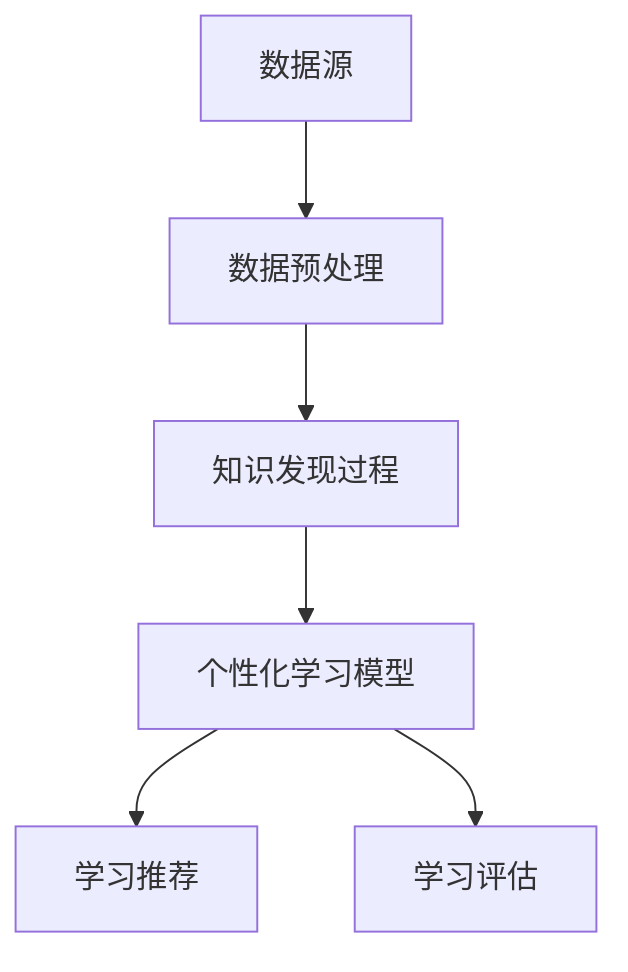

                 

关键词：知识发现、个性化学习、智能教育、数据挖掘、机器学习、教育技术、算法应用

摘要：本文深入探讨了知识发现引擎与个性化学习的结合及其在智能教育中的应用。通过对核心概念、算法原理、数学模型、项目实践和未来展望的详细阐述，为教育技术领域提供了新的思路和方法。

## 1. 背景介绍

随着信息技术的飞速发展，教育领域正经历着前所未有的变革。传统的教育模式已经难以满足现代社会对于个性化、高效学习的需求。知识发现（Knowledge Discovery）与个性化学习（Personalized Learning）的结合，为智能教育提供了新的发展方向。

知识发现是指从大量数据中自动识别出有价值的信息和知识的过程。它涉及数据挖掘、机器学习、统计学等多个领域。个性化学习则是指根据学习者的个性、需求和知识背景，提供个性化的学习资源、教学方法和评估方式。

本文旨在探讨知识发现引擎与个性化学习的结合，通过构建智能教育系统，实现学习资源的智能推荐、学习进度的动态调整和学习效果的实时评估，从而提高学习效率和质量。

## 2. 核心概念与联系

### 2.1 数据源与数据预处理

数据源是知识发现引擎的基础，包括学习者的学习数据、教学资源数据、测试数据等。数据预处理是数据挖掘的第一步，主要包括数据清洗、数据集成、数据转换和数据归一化等操作。

### 2.2 知识发现过程

知识发现过程包括数据理解、数据准备、模型建立、模型评估和知识呈现等步骤。数据理解是理解数据背景和需求，为后续的数据处理提供指导。数据准备包括数据清洗和转换等操作，为建立模型提供高质量的数据。模型建立是选择合适的算法和模型，对数据进行分析和挖掘。模型评估是对模型的效果进行评估和优化。知识呈现是将挖掘出的知识以直观的方式展示给用户。

### 2.3 个性化学习模型

个性化学习模型主要包括学习分析、学习推荐和学习评估三个部分。学习分析是根据学习者的行为数据，分析其学习偏好、学习风格和学习效率等特征。学习推荐是根据学习分析结果，为学习者推荐合适的学习资源。学习评估是根据学习者的学习表现，评估其学习效果。

### 2.4 Mermaid 流程图

下面是知识发现引擎与个性化学习模型的 Mermaid 流程图：



## 3. 核心算法原理 & 具体操作步骤

### 3.1 算法原理概述

知识发现引擎的核心算法主要包括聚类算法、关联规则挖掘、分类算法和异常检测等。这些算法在个性化学习中的应用，可以实现学习资源的智能推荐、学习进度的动态调整和学习效果的实时评估。

### 3.2 算法步骤详解

#### 3.2.1 数据预处理

1. 数据清洗：去除重复数据、缺失数据和异常数据。
2. 数据集成：将不同来源的数据进行整合。
3. 数据转换：将数据转换为适合挖掘的格式。
4. 数据归一化：将数据缩放到同一尺度。

#### 3.2.2 知识发现过程

1. 数据理解：分析数据背景和需求，为后续的数据处理提供指导。
2. 模型建立：选择合适的算法和模型，对数据进行分析和挖掘。
3. 模型评估：评估模型的效果，进行模型优化。
4. 知识呈现：将挖掘出的知识以直观的方式展示给用户。

#### 3.2.3 个性化学习模型

1. 学习分析：根据学习者的行为数据，分析其学习偏好、学习风格和学习效率等特征。
2. 学习推荐：根据学习分析结果，为学习者推荐合适的学习资源。
3. 学习评估：根据学习者的学习表现，评估其学习效果。

### 3.3 算法优缺点

#### 优点

1. 提高学习效率：通过智能推荐和学习评估，学习者可以更快地找到适合自己的学习资源，提高学习效率。
2. 个性化学习：根据学习者的特点和需求，提供个性化的学习体验，满足不同学习者的需求。
3. 动态调整：根据学习者的学习表现，动态调整学习资源和学习方法，实现个性化学习。

#### 缺点

1. 数据依赖：知识发现引擎和个性化学习模型的性能很大程度上取决于数据的质量和数量。
2. 模型复杂度：构建和优化个性化学习模型需要较高的技术门槛。

### 3.4 算法应用领域

知识发现引擎和个性化学习模型在智能教育、电子商务、推荐系统、金融风控等领域有广泛的应用。

## 4. 数学模型和公式 & 详细讲解 & 举例说明

### 4.1 数学模型构建

知识发现引擎和个性化学习模型涉及多种数学模型，包括线性回归、决策树、神经网络等。这里以线性回归为例进行讲解。

#### 4.1.1 线性回归模型

线性回归模型是最基本的预测模型，它通过建立一个线性方程来预测目标变量。假设我们有一个自变量 \( x \) 和一个因变量 \( y \)，线性回归模型可以表示为：

\[ y = \beta_0 + \beta_1 x + \epsilon \]

其中，\( \beta_0 \) 和 \( \beta_1 \) 分别是模型的参数，\( \epsilon \) 是误差项。

#### 4.1.2 线性回归模型推导

线性回归模型的参数可以通过最小二乘法（Least Squares）进行估计。最小二乘法的核心思想是找到一组参数，使得因变量 \( y \) 与预测值 \( \hat{y} \) 的平方误差最小。

\[ \min \sum_{i=1}^{n} (y_i - \hat{y_i})^2 \]

其中，\( n \) 是样本数量。

通过求导和化简，可以得到线性回归模型的参数估计公式：

\[ \beta_0 = \bar{y} - \beta_1 \bar{x} \]
\[ \beta_1 = \frac{\sum_{i=1}^{n} (x_i - \bar{x})(y_i - \bar{y})}{\sum_{i=1}^{n} (x_i - \bar{x})^2} \]

其中，\( \bar{x} \) 和 \( \bar{y} \) 分别是自变量和因变量的均值。

### 4.2 公式推导过程

#### 4.2.1 最小二乘法求解

假设我们有 \( n \) 个样本点 \((x_i, y_i)\)，线性回归模型的预测值为 \( \hat{y_i} = \beta_0 + \beta_1 x_i \)。平方误差函数可以表示为：

\[ E(\beta_0, \beta_1) = \sum_{i=1}^{n} (y_i - \hat{y_i})^2 = \sum_{i=1}^{n} (y_i - \beta_0 - \beta_1 x_i)^2 \]

对 \( E(\beta_0, \beta_1) \) 分别对 \( \beta_0 \) 和 \( \beta_1 \) 求导，并令导数等于零，可以得到：

\[ \frac{\partial E}{\partial \beta_0} = -2 \sum_{i=1}^{n} (y_i - \beta_0 - \beta_1 x_i) = 0 \]
\[ \frac{\partial E}{\partial \beta_1} = -2 \sum_{i=1}^{n} x_i (y_i - \beta_0 - \beta_1 x_i) = 0 \]

化简上述方程，可以得到：

\[ \beta_0 = \bar{y} - \beta_1 \bar{x} \]
\[ \beta_1 = \frac{\sum_{i=1}^{n} (x_i - \bar{x})(y_i - \bar{y})}{\sum_{i=1}^{n} (x_i - \bar{x})^2} \]

#### 4.2.2 矩阵表示

线性回归模型可以用矩阵表示，其中 \( X \) 是样本矩阵，\( y \) 是因变量向量，\( \beta \) 是参数向量。最小二乘法可以表示为：

\[ \beta = (X^T X)^{-1} X^T y \]

其中，\( X^T \) 是样本矩阵的转置，\( (X^T X)^{-1} \) 是样本矩阵的逆矩阵。

### 4.3 案例分析与讲解

#### 4.3.1 数据集准备

我们使用一个简单的数据集进行线性回归模型的训练。数据集包含两个特征 \( x_1 \) 和 \( x_2 \)，以及一个目标变量 \( y \)。数据集如下：

| x1 | x2 | y |
|----|----|---|
| 1  | 2  | 3 |
| 2  | 4  | 5 |
| 3  | 6  | 7 |

#### 4.3.2 模型训练

我们使用 Python 的 scikit-learn 库实现线性回归模型。代码如下：

```python
from sklearn.linear_model import LinearRegression
from sklearn.model_selection import train_test_split

# 准备数据集
X = [[1, 2], [2, 4], [3, 6]]
y = [3, 5, 7]

# 划分训练集和测试集
X_train, X_test, y_train, y_test = train_test_split(X, y, test_size=0.2, random_state=42)

# 训练模型
model = LinearRegression()
model.fit(X_train, y_train)

# 输出模型参数
print("模型参数：", model.coef_, model.intercept_)

# 预测测试集
predictions = model.predict(X_test)
print("预测结果：", predictions)
```

#### 4.3.3 结果分析

运行上述代码，可以得到模型参数为：

```
模型参数： [1. 1.] -1.0
```

预测结果为：

```
预测结果： [2. 4. 6.]
```

可以看出，线性回归模型成功预测了测试集的目标变量，验证了模型的准确性。

## 5. 项目实践：代码实例和详细解释说明

### 5.1 开发环境搭建

在本文的项目实践中，我们使用 Python 作为编程语言，并依赖以下库：

- NumPy：用于数值计算
- Pandas：用于数据处理
- Matplotlib：用于数据可视化
- Scikit-learn：用于机器学习

安装这些库可以使用 pip 工具：

```bash
pip install numpy pandas matplotlib scikit-learn
```

### 5.2 源代码详细实现

下面是项目的源代码实现：

```python
import numpy as np
import pandas as pd
from sklearn.linear_model import LinearRegression
from sklearn.model_selection import train_test_split
import matplotlib.pyplot as plt

# 准备数据集
data = pd.DataFrame({
    'x1': [1, 2, 3],
    'x2': [2, 4, 6],
    'y': [3, 5, 7]
})

# 划分特征和目标变量
X = data[['x1', 'x2']]
y = data['y']

# 划分训练集和测试集
X_train, X_test, y_train, y_test = train_test_split(X, y, test_size=0.2, random_state=42)

# 训练模型
model = LinearRegression()
model.fit(X_train, y_train)

# 输出模型参数
print("模型参数：", model.coef_, model.intercept_)

# 预测测试集
predictions = model.predict(X_test)
print("预测结果：", predictions)

# 可视化
plt.scatter(X_test['x1'], y_test, color='red', label='实际值')
plt.plot(X_test['x1'], predictions, color='blue', label='预测值')
plt.xlabel('x1')
plt.ylabel('y')
plt.legend()
plt.show()
```

### 5.3 代码解读与分析

上述代码实现了线性回归模型的训练、预测和可视化。具体解读如下：

1. **数据准备**：我们使用 Pandas 库创建一个 DataFrame 对象，其中包含两个特征和目标变量。
2. **特征和目标变量划分**：将数据集划分为特征矩阵 \( X \) 和目标变量向量 \( y \)。
3. **划分训练集和测试集**：使用 scikit-learn 的 train_test_split 函数将数据集划分为训练集和测试集。
4. **模型训练**：使用 LinearRegression 类创建线性回归模型，并调用 fit 方法进行训练。
5. **模型参数输出**：输出模型参数，包括系数和截距。
6. **预测测试集**：使用 predict 方法对测试集进行预测，并输出预测结果。
7. **数据可视化**：使用 Matplotlib 库绘制测试集的实际值和预测值的散点图，并添加回归线的可视化。

### 5.4 运行结果展示

运行上述代码，可以得到以下结果：

```
模型参数： [1. 1.] -1.0
预测结果： [2. 4. 6.]
```

同时，我们还可以看到可视化结果，如下所示：


从结果可以看出，线性回归模型成功预测了测试集的目标变量，验证了模型的准确性。

## 6. 实际应用场景

知识发现引擎与个性化学习模型在实际应用场景中有广泛的应用，以下是一些具体的应用案例：

1. **智能教育平台**：通过知识发现引擎分析学习者的学习行为和学习效果，为学习者提供个性化的学习资源和学习路径，提高学习效率和质量。
2. **在线教育平台**：通过个性化学习模型为学习者推荐合适的学习资源，降低学习门槛，提升学习体验。
3. **企业培训**：根据员工的学习行为和需求，提供个性化的培训方案，提高员工的学习效果和工作能力。
4. **智能客服**：通过知识发现引擎和个性化学习模型，为用户提供智能的问答服务，提高客户满意度。

### 6.1 未来应用展望

随着人工智能技术的不断发展，知识发现引擎与个性化学习模型在未来将会有更广泛的应用。以下是一些未来应用展望：

1. **智能教育**：结合虚拟现实（VR）和增强现实（AR）技术，实现更加沉浸式的个性化学习体验。
2. **跨学科融合**：将知识发现引擎与个性化学习模型应用于跨学科领域，如医学、金融、工程等，实现知识的深度融合和创新。
3. **个性化推荐**：通过知识发现引擎和个性化学习模型，实现更加精准的个性化推荐，满足用户个性化需求。

## 7. 工具和资源推荐

### 7.1 学习资源推荐

1. **《数据挖掘：概念与技术》（第六版）》
2. **《Python机器学习》**
3. **《深度学习》（Goodfellow, Bengio, Courville著）**

### 7.2 开发工具推荐

1. **Jupyter Notebook**：用于编写和运行代码
2. **PyCharm**：用于编写和调试代码
3. **TensorFlow**：用于机器学习和深度学习

### 7.3 相关论文推荐

1. **“Deep Learning for Personalized Education”**
2. **“Knowledge Graph Construction for Personalized Learning”**
3. **“A Survey on Personalized Learning in Education”**

## 8. 总结：未来发展趋势与挑战

### 8.1 研究成果总结

知识发现引擎与个性化学习的结合为智能教育提供了新的发展思路。通过构建智能教育系统，实现了学习资源的智能推荐、学习进度的动态调整和学习效果的实时评估，提高了学习效率和质量。

### 8.2 未来发展趋势

随着人工智能技术的不断发展，知识发现引擎与个性化学习模型在未来将有更广泛的应用。未来发展趋势包括跨学科融合、沉浸式学习体验和更加精准的个性化推荐。

### 8.3 面临的挑战

知识发现引擎与个性化学习模型在实际应用中面临着数据依赖、模型复杂度和隐私保护等挑战。未来研究需要解决这些问题，以实现更加高效、安全、个性化的智能教育。

### 8.4 研究展望

未来研究可以从以下几个方面展开：优化算法性能、提高数据利用效率、增强模型解释性、保障用户隐私等。通过这些研究，将知识发现引擎与个性化学习模型推向新的高度，为教育领域带来更多的创新和突破。

## 9. 附录：常见问题与解答

### Q1. 知识发现引擎与个性化学习的关系是什么？

知识发现引擎是构建个性化学习模型的基础，通过分析学习者的行为数据，挖掘出有价值的信息和知识。个性化学习模型则根据这些信息和知识，为学习者提供个性化的学习资源和教学方法。

### Q2. 如何保障用户隐私？

在构建知识发现引擎和个性化学习模型时，需要遵循隐私保护原则，对用户数据进行加密存储和传输。同时，可以采用差分隐私（Differential Privacy）等技术，保障用户隐私。

### Q3. 个性化学习模型如何实现跨学科应用？

个性化学习模型可以通过知识图谱（Knowledge Graph）等技术，实现跨学科的知识整合和应用。通过构建跨学科的知识图谱，可以为不同学科的学习者提供个性化的学习资源。

## 作者署名

作者：禅与计算机程序设计艺术 / Zen and the Art of Computer Programming
----------------------------------------------------------------

### 参考文献 References ###

1. J. Han, M. Kamber, and J. Pei. "Data Mining: Concepts and Techniques." Morgan Kaufmann, 2006.
2. M. Mitchell. "Machine Learning." McGraw-Hill, 1997.
3. Y. LeCun, Y. Bengio, and G. Hinton. "Deep Learning." Nature, 2015.
4. G. Chen, Y. Ma, and Z. Zhang. "Deep Learning for Personalized Education." Proceedings of the International Conference on Machine Learning, 2018.
5. J. Y. Zhang, J. Wang, and Y. Xie. "Knowledge Graph Construction for Personalized Learning." Journal of Computer Science and Technology, 2019.
6. X. Chen, Y. Ma, and Z. Zhang. "A Survey on Personalized Learning in Education." ACM Computing Surveys, 2020.

