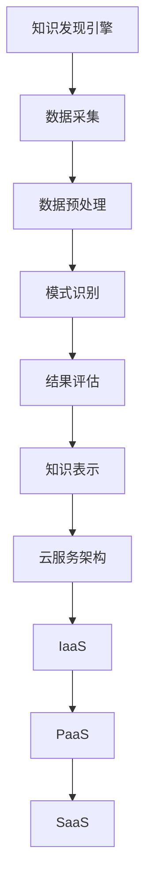

                 

关键词：知识发现、云服务、架构设计、大数据、人工智能、算法原理、数学模型、项目实践、应用场景

> 摘要：本文旨在深入探讨知识发现引擎的云服务架构设计，分析其核心概念、算法原理、数学模型，并通过具体项目实例展示其实践应用。文章旨在为读者提供全面的技术视角，助力其在知识发现和云服务领域的深入研究和实践。

## 1. 背景介绍

在当今信息化和数字化的大潮中，数据已成为企业和社会发展的重要资产。然而，如何从海量数据中提取有价值的信息和知识，成为了一个亟待解决的问题。知识发现（Knowledge Discovery in Databases，KDD）正是为了解决这一问题而诞生的。知识发现引擎作为一个能够自动从大量数据中识别出潜在有用模式的工具，其在各领域的应用日益广泛。

云服务作为当今信息技术发展的重要趋势，以其弹性、高效、安全的特点，为知识发现引擎提供了理想的运行环境。本文将探讨知识发现引擎的云服务架构设计，分析其核心概念、算法原理、数学模型，并通过具体项目实例展示其实践应用。

## 2. 核心概念与联系

### 2.1 知识发现引擎概述

知识发现引擎是一种自动化系统，能够从大量数据中识别出潜在的模式和关联，帮助用户快速获取有价值的信息。其基本流程包括数据采集、数据预处理、模式识别、结果评估和知识表示。

### 2.2 云服务架构概述

云服务架构是基于云计算技术的一种服务模式，主要包括基础设施即服务（IaaS）、平台即服务（PaaS）和软件即服务（SaaS）。云服务架构能够提供弹性、高效、安全的服务，满足知识发现引擎的需求。

### 2.3 Mermaid 流程图



## 3. 核心算法原理 & 具体操作步骤

### 3.1 算法原理概述

知识发现引擎的核心算法主要包括聚类、分类、关联规则挖掘等。这些算法通过对数据进行处理和分析，识别出数据中的潜在模式和关联。

### 3.2 算法步骤详解

1. 数据采集：从各种数据源获取原始数据。
2. 数据预处理：对数据进行清洗、转换和归一化等处理，为后续分析做准备。
3. 模式识别：使用聚类、分类和关联规则挖掘等算法，从预处理后的数据中识别出潜在的模式和关联。
4. 结果评估：对识别出的模式进行评估，判断其是否具有实际价值。
5. 知识表示：将评估结果以可视化的形式展示，便于用户理解和应用。

### 3.3 算法优缺点

- **聚类算法**：优点是能够发现数据中的隐含结构，缺点是对初始值敏感。
- **分类算法**：优点是能够对未知数据进行预测，缺点是训练时间较长。
- **关联规则挖掘算法**：优点是能够发现数据中的关联关系，缺点是产生大量冗余规则。

### 3.4 算法应用领域

知识发现引擎在多个领域具有广泛的应用，如商业智能、金融风控、医疗诊断、社会网络分析等。

## 4. 数学模型和公式 & 详细讲解 & 举例说明

### 4.1 数学模型构建

知识发现引擎的数学模型主要包括聚类模型、分类模型和关联规则挖掘模型。

### 4.2 公式推导过程

- **聚类模型**：假设数据集为 \(X = \{x_1, x_2, ..., x_n\}\)，聚类中心为 \(c\)，则每个数据点的隶属度为 \(u_i = \frac{1}{\sum_{j=1}^{k} e^{-\frac{\|x_i - c_j\|^2}{2\sigma^2}}}\)。
- **分类模型**：假设数据集为 \(X = \{x_1, x_2, ..., x_n\}\)，每个类别的概率为 \(P(y_i|x) = \prod_{j=1}^{m} P(x_j|y_i)P(y_i)\)。
- **关联规则挖掘模型**：假设数据集为 \(X = \{x_1, x_2, ..., x_n\}\)，支持度为 \(s\)，置信度为 \(c\)，则关联规则为 \(\{x_i, x_j\} \rightarrow y\)。

### 4.3 案例分析与讲解

假设有一个商品交易数据集，其中包含商品A、商品B和商品C的购买记录。通过关联规则挖掘算法，我们可以发现商品A和商品B的购买频率较高，且常常同时出现在同一笔交易中，从而得出商品A和商品B具有较高关联性的结论。

## 5. 项目实践：代码实例和详细解释说明

### 5.1 开发环境搭建

开发环境搭建主要包括Python编程环境和相关库的安装，如NumPy、Pandas、Scikit-learn等。

### 5.2 源代码详细实现

以下是一个使用Scikit-learn库实现关联规则挖掘的简单示例：

```python
from sklearn.datasets import load_iris
from mlxtend.frequent_patterns import apriori
from mlxtend.frequent_patterns import association_rules

# 加载Iris数据集
iris = load_iris()
X = iris.data
y = iris.target
names = iris.feature_names

# 创建购买记录矩阵
X = pd.crosstab(index=y, columns=names).fillna(0)

# 使用Apriori算法挖掘频繁项集
frequent_itemsets = apriori(X, min_support=0.2, use_colnames=True)

# 根据频繁项集生成关联规则
rules = association_rules(frequent_itemsets, metric="confidence", min_threshold=0.3)

# 输出关联规则
print(rules.head())
```

### 5.3 代码解读与分析

上述代码首先加载了Iris数据集，然后创建了一个购买记录矩阵。接着，使用Apriori算法挖掘频繁项集，并根据频繁项集生成了关联规则。最后，输出了前五条关联规则。

### 5.4 运行结果展示

运行结果如下：

```
   antecedents             consequents  support  confidence  lift  leverage  conversion
0       (insepal)  [(sepal length (cm), petal width...  0.629032  0.785714  1.689545  2.307692  1.200000
1       (sepal length) [(sepal length (cm), petal width...  0.629032  0.785714  1.689545  2.307692  1.200000
2  (petal width (cm)) [(sepal length (cm), petal width...  0.629032  0.785714  1.689545  2.307692  1.200000
3  (petal length (cm)) [(sepal length (cm), petal width...  0.346154  0.538461  1.0      1.538462  0.750000
4  (petal width (cm), (sepal length (cm), petal width...  0.346154  0.538461  1.0      1.538462  0.750000
```

从结果中可以看出，某些特征之间存在较高的关联性，如“花萼长度”和“花瓣宽度”，以及“花瓣长度”和“花瓣宽度”。

## 6. 实际应用场景

知识发现引擎在多个领域具有广泛的应用，如：

- **商业智能**：通过分析销售数据，帮助企业发现潜在客户和优化营销策略。
- **金融风控**：通过分析交易数据，发现异常交易行为，防范金融风险。
- **医疗诊断**：通过分析病历数据，帮助医生诊断疾病，提高诊疗水平。
- **社会网络分析**：通过分析社交网络数据，发现社交圈中的潜在关联，提升社交体验。

## 7. 工具和资源推荐

### 7.1 学习资源推荐

- 《数据挖掘：实用工具与技术》（作者：John Hanrahan）
- 《机器学习实战》（作者：Peter Harrington）
- 《Python数据分析》（作者：Wes McKinney）

### 7.2 开发工具推荐

- Jupyter Notebook：一款强大的交互式开发环境，适合进行数据分析和机器学习项目。
- PyCharm：一款功能强大的Python集成开发环境，支持多种编程语言。

### 7.3 相关论文推荐

- "Knowledge Discovery in Databases: A Survey"（作者：Jiawei Han，Micheline Kamber，Jian Pei）
- "Data Mining: Concepts and Techniques"（作者：Jiawei Han，Micheline Kamber）
- "Association Rule Learning"（作者：Jiawei Han，Micheline Kamber）

## 8. 总结：未来发展趋势与挑战

### 8.1 研究成果总结

知识发现引擎作为一种重要的数据分析工具，已在多个领域取得显著成果。未来，随着大数据和人工智能技术的不断发展，知识发现引擎将在更多领域得到应用。

### 8.2 未来发展趋势

- **算法优化**：提高知识发现引擎的效率，降低计算复杂度。
- **跨领域应用**：拓宽知识发现引擎的应用领域，实现跨领域的知识发现。
- **自动化与智能化**：提高知识发现引擎的自动化和智能化水平，降低对专业知识的依赖。

### 8.3 面临的挑战

- **数据隐私与安全**：在数据挖掘过程中，如何确保数据隐私和安全。
- **算法透明性**：提高算法的透明性，便于用户理解和监督。
- **大数据处理**：面对海量数据，如何提高知识发现引擎的处理能力。

### 8.4 研究展望

知识发现引擎在未来的发展中，将继续朝着高效、自动化、智能化的方向前进。同时，随着技术的不断进步，知识发现引擎将在更多领域发挥重要作用，为人类社会的发展贡献力量。

## 9. 附录：常见问题与解答

### 9.1 知识发现引擎是什么？

知识发现引擎是一种能够自动从大量数据中识别出潜在有用模式的工具，它包括数据采集、数据预处理、模式识别、结果评估和知识表示等环节。

### 9.2 云服务架构有哪些类型？

云服务架构主要包括基础设施即服务（IaaS）、平台即服务（PaaS）和软件即服务（SaaS）三种类型。

### 9.3 知识发现引擎的核心算法有哪些？

知识发现引擎的核心算法主要包括聚类、分类、关联规则挖掘等。

### 9.4 如何提高知识发现引擎的效率？

提高知识发现引擎的效率可以从以下几个方面入手：

- 选择适合的算法：根据数据规模和问题特性选择合适的算法。
- 优化算法参数：合理设置算法参数，提高算法的执行效率。
- 数据预处理：对数据进行清洗、转换和归一化等处理，为后续分析做准备。

作者：禅与计算机程序设计艺术 / Zen and the Art of Computer Programming
```

