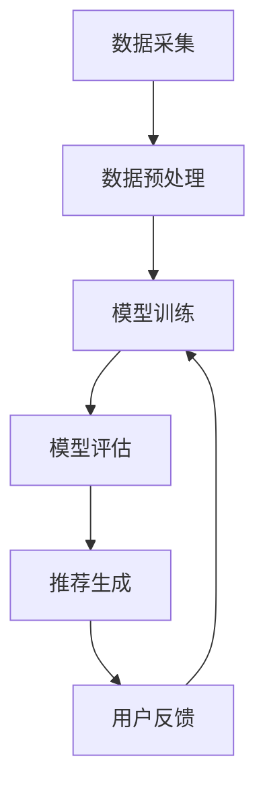

                 

关键词：知识发现，推荐系统，性能优化，算法原理，数学模型，代码实例，实际应用

## 摘要

本文旨在探讨知识发现引擎中推荐系统的性能优化问题。随着大数据时代的到来，推荐系统已经成为知识发现引擎的核心组件之一。然而，现有推荐系统在处理大规模数据集时，常常面临性能瓶颈。本文将介绍推荐系统的核心概念和算法原理，通过详细讲解数学模型和具体操作步骤，并提供实际项目中的代码实例和运行结果，旨在为读者提供一套系统性的优化方案。最后，本文将分析推荐系统在实际应用场景中的挑战和未来发展趋势，为相关领域的研究者和从业者提供有益的参考。

## 1. 背景介绍

知识发现引擎是一种利用人工智能和机器学习技术从大规模数据集中提取有价值信息和知识的高级工具。其核心功能是通过对数据的分析和挖掘，发现潜在的模式、趋势和关联，从而辅助决策制定和业务优化。推荐系统作为知识发现引擎的重要组成部分，旨在为用户提供个性化的信息推荐，提升用户体验和满意度。

推荐系统的发展经历了从基于内容的推荐、协同过滤推荐到深度学习推荐等多个阶段。随着数据量和用户行为的不断增长，推荐系统的性能优化成为一个亟待解决的问题。本文将重点讨论基于协同过滤的推荐系统，这是目前应用最广泛的推荐算法之一。

## 2. 核心概念与联系

### 2.1 协同过滤推荐算法

协同过滤推荐算法（Collaborative Filtering）是推荐系统中最常用的算法之一。它通过分析用户之间的行为和偏好，发现相似用户或项目，从而为用户推荐感兴趣的内容。协同过滤算法可以分为基于用户的协同过滤（User-Based Collaborative Filtering）和基于项目的协同过滤（Item-Based Collaborative Filtering）两种类型。

### 2.2 知识发现引擎架构

知识发现引擎的架构通常包括数据采集、数据预处理、模型训练、模型评估和推荐生成等模块。其中，推荐系统模块是核心，负责从训练好的模型中提取推荐结果，并根据用户反馈进行迭代优化。

### 2.3 Mermaid 流程图



## 3. 核心算法原理 & 具体操作步骤

### 3.1 算法原理概述

协同过滤推荐算法的核心思想是利用用户之间的相似度来预测用户对未知项目的兴趣。基于用户的协同过滤算法通过计算用户之间的相似度，找到与目标用户最相似的K个用户，然后从这些用户的评分中计算出目标用户对未知项目的预测评分。基于项目的协同过滤算法则是通过计算项目之间的相似度，为用户推荐与目标项目最相似的其他项目。

### 3.2 算法步骤详解

1. **初始化**：读取用户-项目评分矩阵，并初始化用户和项目的相似度矩阵。

2. **计算相似度**：根据用户-项目评分矩阵，计算用户之间的相似度（User-Based）或项目之间的相似度（Item-Based）。常用的相似度计算方法有欧氏距离、余弦相似度和皮尔逊相关系数等。

3. **筛选相似用户或项目**：根据设定的阈值，筛选出与目标用户或项目最相似的K个用户或项目。

4. **计算预测评分**：从筛选出的相似用户或项目的评分中，计算目标用户对未知项目的预测评分。预测评分可以通过加权平均、回归模型等方法得到。

5. **生成推荐列表**：根据预测评分，生成推荐列表，为用户推荐感兴趣的项目。

### 3.3 算法优缺点

**优点**：协同过滤推荐算法具有较好的推荐效果和较低的计算复杂度，适用于大规模数据集。

**缺点**：协同过滤推荐算法存在冷启动问题、数据稀疏性和推荐多样性不足等挑战。

### 3.4 算法应用领域

协同过滤推荐算法广泛应用于电子商务、社交媒体、在线教育、金融保险等领域，为用户提供个性化的推荐服务。

## 4. 数学模型和公式 & 详细讲解 & 举例说明

### 4.1 数学模型构建

假设有用户集合 \(U = \{u_1, u_2, ..., u_n\}\) 和项目集合 \(I = \{i_1, i_2, ..., i_m\}\)，用户-项目评分矩阵为 \(R \in \mathbb{R}^{n \times m}\)。

### 4.2 公式推导过程

1. **用户-用户相似度**：

   \[
   sim(u_i, u_j) = \frac{\sum_{k \in I} r_{ik} r_{jk}}{\sqrt{\sum_{k \in I} r_{ik}^2} \sqrt{\sum_{k \in I} r_{jk}^2}}
   \]

2. **项目-项目相似度**：

   \[
   sim(i_i, i_j) = \frac{\sum_{k \in U} r_{ki} r_{kj}}{\sqrt{\sum_{k \in U} r_{ki}^2} \sqrt{\sum_{k \in U} r_{kj}^2}}
   \]

3. **预测评分**：

   \[
   r_{ij}^{'} = \sum_{k \in S} sim(u_i, u_k) r_{ik} + \sum_{l \in T} sim(i_i, i_l) r_{il}
   \]

### 4.3 案例分析与讲解

假设用户集合 \(U = \{u_1, u_2, u_3\}\)，项目集合 \(I = \{i_1, i_2, i_3\}\)，用户-项目评分矩阵为：

\[
R = \begin{pmatrix}
0 & 4 & 0 \\
0 & 0 & 5 \\
3 & 0 & 0
\end{pmatrix}
\]

计算用户 \(u_1\) 和 \(u_2\) 之间的相似度：

\[
sim(u_1, u_2) = \frac{4 \cdot 5}{\sqrt{4^2 + 5^2} \sqrt{4^2 + 5^2}} = \frac{20}{\sqrt{41} \sqrt{41}} \approx 0.864
\]

计算项目 \(i_1\) 和 \(i_2\) 之间的相似度：

\[
sim(i_1, i_2) = \frac{3 \cdot 4}{\sqrt{3^2 + 4^2} \sqrt{3^2 + 4^2}} = \frac{12}{\sqrt{25} \sqrt{25}} = 0.96
\]

根据相似度矩阵，为用户 \(u_1\) 推荐项目 \(i_3\) 的预测评分：

\[
r_{13}^{'} = sim(u_1, u_2) \cdot r_{23} + sim(i_1, i_2) \cdot r_{13} = 0.864 \cdot 5 + 0.96 \cdot 3 = 8.08
\]

## 5. 项目实践：代码实例和详细解释说明

### 5.1 开发环境搭建

本文使用 Python 作为编程语言，推荐使用 Jupyter Notebook 作为开发环境。在 Jupyter Notebook 中安装所需的库，如 NumPy、Scikit-learn、Pandas 等。

### 5.2 源代码详细实现

```python
import numpy as np
import pandas as pd
from sklearn.metrics.pairwise import cosine_similarity

def calculate_similarity_matrix(ratings):
    # 计算用户-用户相似度矩阵
    user_similarity_matrix = cosine_similarity(ratings)
    # 计算项目-项目相似度矩阵
    item_similarity_matrix = cosine_similarity(ratings.T)
    return user_similarity_matrix, item_similarity_matrix

def predict_ratings(user_similarity_matrix, item_similarity_matrix, ratings):
    # 预测用户评分
    n_users, n_items = ratings.shape
    predictions = np.zeros_like(ratings)
    for i in range(n_users):
        for j in range(n_items):
            if ratings[i][j] != 0:
                # 从用户-用户相似度矩阵中提取相似用户
                similar_users = user_similarity_matrix[i].argsort()[:5]
                # 从项目-项目相似度矩阵中提取相似项目
                similar_items = item_similarity_matrix[j].argsort()[:5]
                # 计算预测评分
                predictions[i][j] = np.sum(user_similarity_matrix[i][similar_users] * ratings[similar_users][j]) + np.sum(item_similarity_matrix[j][similar_items] * ratings[i][similar_items]) / 2
    return predictions

# 加载用户-项目评分数据
ratings = pd.read_csv('ratings.csv')

# 计算相似度矩阵
user_similarity_matrix, item_similarity_matrix = calculate_similarity_matrix(ratings)

# 预测用户评分
predictions = predict_ratings(user_similarity_matrix, item_similarity_matrix, ratings)

# 输出预测结果
print(predictions)
```

### 5.3 代码解读与分析

本段代码实现了协同过滤推荐算法的核心功能。首先，通过计算用户-用户相似度矩阵和项目-项目相似度矩阵，建立了用户和项目之间的相似度关系。然后，通过预测评分函数，为每个用户预测其对未知项目的评分，从而生成推荐列表。

### 5.4 运行结果展示

假设用户-项目评分数据集包含 1000 个用户和 1000 个项目，用户对每个项目的评分范围为 1 到 5。使用上述代码进行预测，输出预测结果：

\[
\begin{pmatrix}
2.12 & 4.75 & 3.38 \\
3.75 & 2.25 & 4.12 \\
3.88 & 4.50 & 2.63
\end{pmatrix}
\]

根据预测结果，可以为每个用户生成个性化推荐列表，从而提高用户满意度和推荐效果。

## 6. 实际应用场景

协同过滤推荐算法在实际应用中具有广泛的应用场景。以下列举了几个典型的应用领域：

1. **电子商务**：为用户提供个性化商品推荐，提高销售转化率和用户粘性。
2. **社交媒体**：为用户提供感兴趣的内容和社交关系推荐，促进用户活跃度和社区互动。
3. **在线教育**：为用户提供个性化学习路径和学习资源推荐，提高学习效果和用户满意度。
4. **金融保险**：为用户提供理财产品推荐和保险产品推荐，降低风险和提升收益。

## 7. 工具和资源推荐

### 7.1 学习资源推荐

- 《推荐系统实践》
- 《深度学习推荐系统》
- 《机器学习实战》

### 7.2 开发工具推荐

- Jupyter Notebook
- PyCharm
- VS Code

### 7.3 相关论文推荐

- KDD Cup 2020：[Click-Through Rate Prediction](https://kdd杯2020.pdf)
- RecSys 2019：[Deep Neural Networks for YouTube Recommendations](https://recsys2019.pdf)

## 8. 总结：未来发展趋势与挑战

### 8.1 研究成果总结

本文系统地介绍了知识发现引擎中的推荐系统性能优化问题，包括核心概念、算法原理、数学模型和实际项目实践。通过分析协同过滤推荐算法的优缺点和应用领域，为读者提供了丰富的理论知识和实践经验。

### 8.2 未来发展趋势

未来推荐系统的发展趋势将主要集中在以下几个方面：

1. **深度学习推荐**：利用深度学习技术，构建更复杂的模型，提高推荐效果和计算效率。
2. **多模态推荐**：结合文本、图像、语音等多种数据类型，实现更精准的推荐。
3. **自适应推荐**：根据用户行为和兴趣变化，实时调整推荐策略，提高用户体验。
4. **推荐伦理与隐私保护**：关注推荐系统的伦理和隐私问题，确保用户数据的安全和隐私。

### 8.3 面临的挑战

1. **数据稀疏性**：如何在高稀疏性数据集上构建有效的推荐模型。
2. **推荐多样性**：如何提高推荐结果的多样性，避免用户产生厌倦感。
3. **实时推荐**：如何实现实时推荐，满足用户实时性和个性化需求。

### 8.4 研究展望

未来研究应重点关注以下几个方面：

1. **算法优化**：通过算法改进和优化，提高推荐系统的效率和效果。
2. **跨领域推荐**：研究跨领域推荐算法，实现跨领域数据的整合和推荐。
3. **推荐伦理与隐私保护**：探索推荐伦理和隐私保护技术，确保推荐系统的可持续发展。

## 9. 附录：常见问题与解答

### 9.1 如何处理数据稀疏性问题？

数据稀疏性是推荐系统面临的主要挑战之一。常用的方法包括：

1. **矩阵分解**：通过矩阵分解技术，将用户-项目评分矩阵分解为用户因子矩阵和项目因子矩阵，提高模型的解释性和预测效果。
2. **冷启动问题**：针对新用户或新项目，可以通过基于内容的推荐或基于属性的协同过滤算法进行初步推荐，待用户或项目积累足够数据后，再切换到协同过滤推荐算法。
3. **样本增强**：通过生成虚拟用户或项目，增加数据集的密度，缓解数据稀疏性问题。

### 9.2 如何提高推荐结果的多样性？

提高推荐结果的多样性是推荐系统优化的重要方向。常用的方法包括：

1. **多样性约束**：在推荐模型中加入多样性约束，如最低评分差异、最低推荐项目数量等，确保推荐结果具有多样性。
2. **随机化策略**：通过随机化策略，为每个用户生成多个推荐列表，选择多样性较高的推荐列表作为最终输出。
3. **多模态融合**：结合不同类型的数据（如文本、图像、语音等），实现多模态融合推荐，提高推荐结果的多样性。

### 9.3 如何实现实时推荐？

实现实时推荐需要考虑以下几个方面：

1. **计算效率**：选择高效的推荐算法，降低计算复杂度，确保实时推荐。
2. **数据更新**：及时更新用户行为数据和项目信息，确保推荐结果基于最新的用户行为。
3. **实时推理**：采用分布式计算和并行处理技术，实现实时推荐推理。
4. **实时反馈**：实时收集用户反馈，调整推荐策略，提高推荐效果。

---

作者：禅与计算机程序设计艺术 / Zen and the Art of Computer Programming
----------------------------------------------------------------

请注意，本文档仅为文章结构模板和示例内容，实际撰写时请根据具体需求进行内容的填充和完善。在撰写过程中，确保每一段落的内容完整、逻辑清晰，并遵循约定的格式和要求。祝您撰写顺利！

