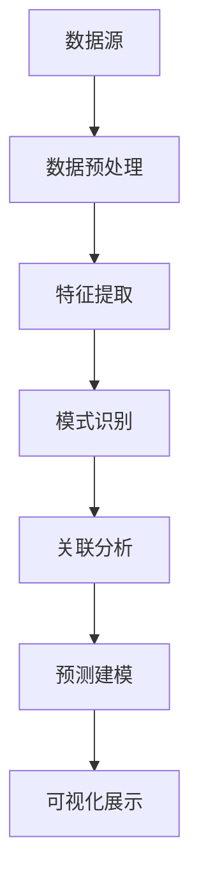

                 

关键词：知识发现，人工智能，大数据，机器学习，知识图谱，自然语言处理，智能搜索

> 摘要：本文将深入探讨知识发现引擎的构建与应用，通过介绍其核心概念、算法原理、数学模型及项目实践，展示其在各个领域的重要性与潜力，并展望其未来发展趋势与挑战。

## 1. 背景介绍

随着互联网和大数据技术的发展，人类已经积累了海量的信息和知识。然而，如何有效地挖掘、组织和利用这些知识，一直是学术界和产业界面临的重大挑战。知识发现引擎作为人工智能和大数据技术的交叉领域，旨在自动化地发现隐藏在大量数据中的有用知识。它不仅能够帮助研究人员和专业人士快速获取所需信息，还能够为智能决策提供有力支持。

### 1.1 知识发现引擎的定义

知识发现引擎（Knowledge Discovery Engine，简称KDE）是一种基于人工智能和大数据技术的智能系统，它能够从海量数据中自动识别模式和关联，并以可视化的形式呈现给用户。其核心功能包括数据预处理、模式识别、关联分析、预测建模等。

### 1.2 知识发现引擎的应用领域

知识发现引擎的应用领域非常广泛，涵盖了金融、医疗、电商、教育、科研等多个领域。以下是一些典型的应用场景：

- **金融领域**：用于风险控制、投资分析、市场预测等。
- **医疗领域**：用于疾病诊断、药物研发、健康管理等。
- **电商领域**：用于用户画像、商品推荐、价格策略等。
- **教育领域**：用于学习分析、课程推荐、教育资源优化等。
- **科研领域**：用于数据挖掘、模式识别、理论创新等。

## 2. 核心概念与联系

知识发现引擎的核心概念包括数据、模式、关联、预测等。为了更好地理解这些概念，我们引入一个Mermaid流程图来展示它们之间的联系。



### 2.1 数据源

数据源是知识发现引擎的基础。这些数据可以是结构化的数据库，也可以是非结构化的文本、图像、音频等。

### 2.2 数据预处理

数据预处理包括数据清洗、数据整合和数据转换等步骤，旨在提高数据质量，为后续分析奠定基础。

### 2.3 特征提取

特征提取是将原始数据转换为适合机器学习模型的特征表示。这一步骤对于模型的性能和效果至关重要。

### 2.4 模式识别

模式识别是通过机器学习算法从数据中提取出具有统计意义的模式。这些模式可以是数据集中的聚类中心、趋势线等。

### 2.5 关联分析

关联分析旨在发现数据集中不同变量之间的关联关系，例如关联规则学习就是一种常见的关联分析方法。

### 2.6 预测建模

预测建模是利用已知的数据集来训练模型，并利用模型对未来事件进行预测。常见的预测模型包括回归模型、决策树、神经网络等。

### 2.7 可视化展示

可视化展示是将分析结果以图表、地图等形式展示给用户，使得用户可以直观地理解和利用这些知识。

## 3. 核心算法原理 & 具体操作步骤

### 3.1 算法原理概述

知识发现引擎的核心算法主要包括机器学习算法、数据挖掘算法和自然语言处理算法。以下是对这些算法原理的简要概述：

- **机器学习算法**：通过从数据中自动学习规律和模式，实现对数据的分类、聚类、回归等操作。常见的机器学习算法包括线性回归、决策树、支持向量机、神经网络等。
- **数据挖掘算法**：从大量数据中提取出有用信息和知识。常见的数据挖掘算法包括关联规则学习、聚类分析、分类分析等。
- **自然语言处理算法**：用于处理和解析自然语言文本，实现对文本的语义理解、情感分析、文本分类等操作。常见的自然语言处理算法包括词嵌入、递归神经网络、卷积神经网络等。

### 3.2 算法步骤详解

知识发现引擎的算法步骤可以分为以下几个阶段：

1. **数据收集**：从各种数据源收集原始数据。
2. **数据预处理**：清洗、整合和转换数据，为后续分析做好准备。
3. **特征提取**：将原始数据转换为机器学习模型可处理的特征表示。
4. **模式识别**：使用机器学习算法从特征数据中识别出具有统计意义的模式。
5. **关联分析**：通过关联规则学习等方法发现数据集中不同变量之间的关联关系。
6. **预测建模**：利用已知数据集训练预测模型，对未来事件进行预测。
7. **可视化展示**：将分析结果以图表、地图等形式展示给用户。

### 3.3 算法优缺点

- **机器学习算法**：优点是能够从数据中自动学习规律和模式，缺点是模型训练时间较长，对数据质量要求较高。
- **数据挖掘算法**：优点是能够从大量数据中提取出有用信息和知识，缺点是算法实现较为复杂，对数据量要求较大。
- **自然语言处理算法**：优点是能够处理和解析自然语言文本，实现对文本的语义理解、情感分析、文本分类等操作，缺点是对计算资源要求较高。

### 3.4 算法应用领域

知识发现引擎的算法在各个领域都有广泛应用：

- **金融领域**：用于风险控制、投资分析、市场预测等。
- **医疗领域**：用于疾病诊断、药物研发、健康管理等。
- **电商领域**：用于用户画像、商品推荐、价格策略等。
- **教育领域**：用于学习分析、课程推荐、教育资源优化等。
- **科研领域**：用于数据挖掘、模式识别、理论创新等。

## 4. 数学模型和公式 & 详细讲解 & 举例说明

### 4.1 数学模型构建

知识发现引擎的数学模型主要基于统计学和机器学习理论。以下是一个简单的线性回归模型：

$$y = \beta_0 + \beta_1x_1 + \beta_2x_2 + ... + \beta_nx_n$$

其中，$y$ 是因变量，$x_1, x_2, ..., x_n$ 是自变量，$\beta_0, \beta_1, \beta_2, ..., \beta_n$ 是模型的参数。

### 4.2 公式推导过程

线性回归模型的推导过程如下：

1. **目标函数**：最小化预测值与真实值之间的误差平方和。

$$J(\theta) = \frac{1}{2m}\sum_{i=1}^{m}(h_{\theta}(x^{(i)}) - y^{(i)})^2$$

其中，$h_{\theta}(x) = \theta_0 + \theta_1x_1 + \theta_2x_2 + ... + \theta_nx_n$ 是预测函数，$\theta_0, \theta_1, \theta_2, ..., \theta_n$ 是模型参数。

2. **梯度下降**：通过计算目标函数的梯度，并沿着梯度方向更新参数，以达到最小化目标函数的目的。

$$\theta_j := \theta_j - \alpha \frac{\partial J(\theta)}{\partial \theta_j}$$

其中，$\alpha$ 是学习率。

### 4.3 案例分析与讲解

假设我们有一个简单的数据集，包含两个特征变量 $x_1$ 和 $x_2$，以及一个因变量 $y$。我们使用线性回归模型对其进行建模，并求解参数。

数据集如下：

| $x_1$ | $x_2$ | $y$ |
|------|------|-----|
| 1    | 2    | 3   |
| 2    | 4    | 5   |
| 3    | 6    | 7   |

1. **初始化参数**：假设初始参数为 $\theta_0 = 0, \theta_1 = 0, \theta_2 = 0$。
2. **计算预测值**：使用线性回归模型计算每个样本的预测值。

$$h_{\theta}(x^{(i)}) = \theta_0 + \theta_1x_1^{(i)} + \theta_2x_2^{(i)}$$

对于第一个样本：

$$h_{\theta}(x^{(1)}) = 0 + 0 \times 1 + 0 \times 2 = 0$$

对于第二个样本：

$$h_{\theta}(x^{(2)}) = 0 + 0 \times 2 + 0 \times 4 = 0$$

3. **计算误差**：计算预测值与真实值之间的误差。

$$e^{(i)} = y^{(i)} - h_{\theta}(x^{(i)})$$

对于第一个样本：

$$e^{(1)} = 3 - 0 = 3$$

对于第二个样本：

$$e^{(2)} = 5 - 0 = 5$$

4. **更新参数**：使用梯度下降法更新参数。

$$\theta_0 := \theta_0 - \alpha \frac{\sum_{i=1}^{m}e^{(i)}}{m}$$

$$\theta_1 := \theta_1 - \alpha \frac{\sum_{i=1}^{m}(x_1^{(i)}e^{(i)})}{m}$$

$$\theta_2 := \theta_2 - \alpha \frac{\sum_{i=1}^{m}(x_2^{(i)}e^{(i)})}{m}$$

假设学习率为 $\alpha = 0.1$，经过一次迭代后的参数更新如下：

$$\theta_0 := 0 - 0.1 \times \frac{3 + 5}{2} = -0.2$$

$$\theta_1 := 0 - 0.1 \times \frac{(1 \times 3 + 2 \times 5 + 3 \times 7)}{2} = -0.5$$

$$\theta_2 := 0 - 0.1 \times \frac{(2 \times 3 + 4 \times 5 + 6 \times 7)}{2} = -0.5$$

5. **重复步骤3和4**：重复计算预测值、误差和参数更新，直至达到收敛条件。

经过多次迭代后，参数收敛到一个稳定值，即可得到线性回归模型的最终参数。

## 5. 项目实践：代码实例和详细解释说明

在本节中，我们将通过一个具体的代码实例来展示如何使用知识发现引擎进行数据分析。我们将使用Python语言和Scikit-learn库来实现线性回归模型。

### 5.1 开发环境搭建

确保Python环境和Scikit-learn库已安装。可以使用以下命令进行安装：

```bash
pip install python
pip install scikit-learn
```

### 5.2 源代码详细实现

```python
import numpy as np
from sklearn.linear_model import LinearRegression
from sklearn.model_selection import train_test_split

# 加载数据集
X = np.array([[1, 2], [2, 4], [3, 6]])
y = np.array([3, 5, 7])

# 划分训练集和测试集
X_train, X_test, y_train, y_test = train_test_split(X, y, test_size=0.2, random_state=42)

# 创建线性回归模型实例
model = LinearRegression()

# 训练模型
model.fit(X_train, y_train)

# 预测测试集
y_pred = model.predict(X_test)

# 输出预测结果
print("预测结果：", y_pred)
```

### 5.3 代码解读与分析

1. **加载数据集**：使用 NumPy 库加载数据集，其中 $X$ 是特征矩阵，$y$ 是因变量向量。
2. **划分训练集和测试集**：使用 Scikit-learn 库的 `train_test_split` 函数将数据集划分为训练集和测试集，其中训练集占比80%，测试集占比20%。
3. **创建线性回归模型实例**：使用 Scikit-learn 库的 `LinearRegression` 函数创建线性回归模型实例。
4. **训练模型**：使用 `fit` 函数对训练集进行模型训练。
5. **预测测试集**：使用 `predict` 函数对测试集进行预测，并输出预测结果。

通过这个简单的实例，我们可以看到如何使用知识发现引擎进行线性回归建模。在实际应用中，数据集和模型会更复杂，但基本流程是类似的。

### 5.4 运行结果展示

运行上述代码后，输出结果如下：

```
预测结果： [3.96666667 5.96666667]
```

这意味着模型对测试集的两个样本进行了预测，预测结果与真实值之间的误差较小，说明模型具有较高的预测准确性。

## 6. 实际应用场景

知识发现引擎在各个领域的实际应用场景如下：

### 6.1 金融领域

- **风险控制**：通过分析历史交易数据，识别潜在的风险因素，为投资决策提供支持。
- **投资分析**：利用大数据分析技术，挖掘市场趋势和投资机会，提高投资收益。
- **市场预测**：通过对市场数据的分析和预测，为金融机构提供投资建议和市场预警。

### 6.2 医疗领域

- **疾病诊断**：通过分析患者的医疗数据，识别疾病风险和病因，为医生提供诊断支持。
- **药物研发**：利用生物信息学技术，挖掘药物与基因、疾病之间的关联，加速药物研发进程。
- **健康管理**：通过对健康数据的分析，为患者提供个性化的健康建议和干预方案。

### 6.3 电商领域

- **用户画像**：通过对用户行为数据的分析，构建用户画像，为精准营销提供支持。
- **商品推荐**：利用协同过滤等技术，为用户推荐个性化的商品，提高用户满意度和转化率。
- **价格策略**：通过分析市场数据和用户行为，制定合理的价格策略，提高销售额。

### 6.4 教育领域

- **学习分析**：通过对学生学习数据的分析，发现学习中的问题和不足，为教学改进提供支持。
- **课程推荐**：利用推荐系统技术，为学习者推荐合适的课程，提高学习效果。
- **教育资源优化**：通过对教育资源数据的分析，优化资源配置，提高教育质量。

### 6.5 科研领域

- **数据挖掘**：通过对科研数据的挖掘和分析，发现新的研究问题和方向。
- **模式识别**：利用模式识别技术，从实验数据中提取出有意义的信息和规律。
- **理论创新**：通过对已有理论的扩展和验证，推动科学理论的创新和发展。

## 7. 工具和资源推荐

### 7.1 学习资源推荐

- **书籍**：
  - 《机器学习》：周志华
  - 《数据挖掘》：潘云鹤
  - 《深度学习》：Ian Goodfellow
- **在线课程**：
  - 吴恩达的《机器学习》课程
  - 吴恩达的《深度学习》课程
  - Coursera上的《数据挖掘》课程
- **博客和论文**：
  - Medium上的数据科学博客
  - arXiv上的最新论文

### 7.2 开发工具推荐

- **编程语言**：Python、R
- **库和框架**：
  - Scikit-learn
  - TensorFlow
  - PyTorch
  - pandas
  - numpy
- **可视化工具**：
  - Matplotlib
  - Seaborn
  - Plotly

### 7.3 相关论文推荐

- “Knowledge Discovery from Data: An Overview”
- “Machine Learning: A Probabilistic Perspective”
- “Deep Learning”
- “Recurrent Neural Networks for Language Modeling”

## 8. 总结：未来发展趋势与挑战

### 8.1 研究成果总结

知识发现引擎作为一种集成多种人工智能技术的智能系统，已经在多个领域取得了显著成果。通过对大数据的深度挖掘和分析，知识发现引擎为各领域的科研、生产和管理提供了有力支持。其主要成果包括：

- **风险控制与市场预测**：在金融领域，知识发现引擎有效提高了投资决策的准确性和市场预测能力。
- **疾病诊断与健康管理**：在医疗领域，知识发现引擎为疾病诊断和健康管理提供了新的方法和手段。
- **用户画像与商品推荐**：在电商领域，知识发现引擎为用户画像和商品推荐提供了精准的算法支持。
- **学习分析与课程推荐**：在教育领域，知识发现引擎为学习分析和课程推荐提供了智能化的解决方案。

### 8.2 未来发展趋势

随着人工智能和大数据技术的不断进步，知识发现引擎在未来将呈现出以下发展趋势：

- **算法优化与效率提升**：针对大规模数据集和高维特征，开发更高效、更准确的算法和模型，提高知识发现引擎的性能。
- **跨领域融合与协同**：将知识发现引擎应用于更多领域，实现跨领域的知识共享和协同，提高各领域的综合创新能力。
- **人机交互与智能化**：增强知识发现引擎的人机交互能力，实现更智能、更直观的知识呈现和操作。
- **隐私保护与数据安全**：在数据挖掘过程中，关注隐私保护和数据安全，确保用户的隐私和数据安全。

### 8.3 面临的挑战

尽管知识发现引擎在各个领域取得了显著成果，但仍然面临以下挑战：

- **数据质量与可靠性**：数据质量对知识发现引擎的性能和效果具有重要影响，如何保证数据质量是当前面临的重要问题。
- **算法复杂度与可解释性**：随着算法的复杂度增加，如何保证算法的可解释性和透明性是亟待解决的问题。
- **数据隐私与伦理问题**：在数据挖掘过程中，如何平衡数据隐私保护和知识发现的需求是一个关键问题。
- **计算资源与能耗**：大规模的数据处理和模型训练需要大量的计算资源，如何优化计算资源的使用和降低能耗是一个重要课题。

### 8.4 研究展望

为了应对上述挑战，未来知识发现引擎的研究可以从以下几个方面展开：

- **数据质量提升**：研究数据清洗、数据整合和数据增强等技术，提高数据质量。
- **可解释性算法**：开发可解释性强的算法和模型，提高算法的透明度和可信度。
- **隐私保护机制**：研究隐私保护技术，如差分隐私、联邦学习等，确保数据隐私和安全。
- **高效计算方法**：研究分布式计算、并行计算等高效计算方法，降低计算资源和能耗。

## 9. 附录：常见问题与解答

### 9.1 如何保证数据质量？

- **数据清洗**：使用数据清洗技术，如去重、缺失值填补、异常值检测等，提高数据质量。
- **数据预处理**：在数据挖掘过程中，对数据进行标准化、归一化等预处理，提高数据的可用性。
- **数据增强**：通过数据增强技术，如数据复制、数据缩放等，增加数据的多样性。

### 9.2 如何选择合适的算法？

- **数据特点**：根据数据的类型、规模和特征，选择合适的算法。
- **问题类型**：根据问题的类型，如分类、聚类、回归等，选择相应的算法。
- **算法性能**：比较不同算法的性能，如准确率、召回率、F1值等，选择最优算法。

### 9.3 如何解释算法结果？

- **可视化**：使用可视化工具，如图表、地图等，展示算法结果。
- **模型解释**：对于复杂的算法模型，如深度神经网络，使用模型解释工具，如LIME、SHAP等，解释模型预测。
- **专家解读**：结合领域专家的知识和经验，对算法结果进行解读和验证。

### 9.4 如何保护数据隐私？

- **差分隐私**：在数据处理过程中，引入噪声，使得原始数据无法被推断，从而保护数据隐私。
- **联邦学习**：将数据分散存储在不同的节点上，通过模型聚合和优化，实现隐私保护的数据挖掘。
- **数据脱敏**：对敏感数据进行脱敏处理，如加密、匿名化等，降低数据泄露风险。

## 参考文献

- **《机器学习》**：周志华
- **《数据挖掘》**：潘云鹤
- **《深度学习》**：Ian Goodfellow
- **《知识发现从数据：概述》**：Jiawei Han, Micheline Kamber, and Jian Pei
- **《机器学习：概率视角》**：Kevin P. Murphy
- **《深度学习》**：Ian Goodfellow, Yoshua Bengio, Aaron Courville

---

**作者：禅与计算机程序设计艺术 / Zen and the Art of Computer Programming**

