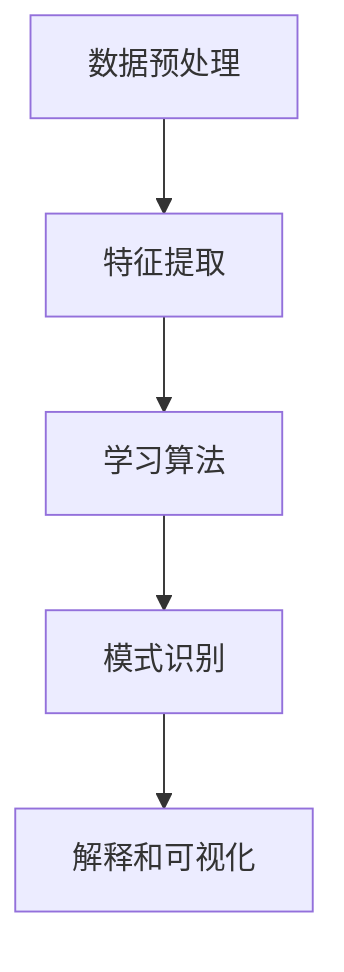

                 

关键词：知识发现引擎、医疗健康、人工智能、创新、数据挖掘

> 摘要：本文旨在探讨知识发现引擎在医疗健康领域的应用，阐述其如何借助人工智能技术推动医疗健康行业的创新。文章将深入分析知识发现引擎的核心概念、算法原理、数学模型，并通过实际项目实践，展示其在医疗健康领域的重要作用。同时，文章还将探讨知识发现引擎在医疗健康行业的未来应用前景，以及面临的技术挑战和研究方向。

## 1. 背景介绍

在过去的几十年里，医疗健康行业经历了巨大的变革。随着信息技术和生物技术的快速发展，医疗数据量呈现爆炸式增长。这些数据不仅包括患者的电子健康记录、基因序列，还包括医学文献、临床试验结果等。这些海量数据为医疗健康行业带来了巨大的机遇，但也带来了巨大的挑战。如何从这些数据中提取有价值的信息，帮助医生进行精准诊断、个性化治疗，成为医疗健康行业亟待解决的问题。

知识发现引擎（Knowledge Discovery Engine，简称KDE）作为一种新兴的人工智能技术，旨在从大规模的数据集中自动提取隐藏的模式、规则和知识。知识发现引擎通过融合机器学习、数据挖掘、自然语言处理等技术，能够有效地分析医疗数据，挖掘潜在的价值。在医疗健康领域，知识发现引擎的应用不仅可以提高医疗诊断的准确性和效率，还可以推动医学研究的创新。

本文将围绕知识发现引擎在医疗健康领域的应用进行深入探讨，分析其核心概念、算法原理、数学模型，并通过实际项目实践，展示其在医疗健康领域的重要作用。同时，文章还将探讨知识发现引擎在医疗健康行业的未来应用前景，以及面临的技术挑战和研究方向。

## 2. 核心概念与联系

### 2.1 知识发现引擎的定义

知识发现引擎是一种智能系统，它能够从大规模的数据集中自动识别出隐藏的模式、规则和知识。知识发现引擎的核心目标是发现数据中的隐含关系，从而为医疗健康行业提供有价值的信息。

### 2.2 知识发现引擎的组成部分

知识发现引擎通常由以下几个关键组件组成：

- **数据预处理模块**：负责清洗、转换和整合原始数据，使其适用于后续的分析。
- **特征提取模块**：从原始数据中提取有用的特征，为后续的模型训练提供输入。
- **学习算法模块**：包括机器学习算法、深度学习算法等，用于对特征进行学习和建模。
- **模式识别模块**：通过算法分析，识别数据中的潜在模式和知识。
- **解释和可视化模块**：对分析结果进行解释和可视化，帮助用户理解和应用这些知识。

### 2.3 知识发现引擎与医疗健康领域的联系

知识发现引擎在医疗健康领域的应用，主要体现在以下几个方面：

- **疾病诊断**：通过分析患者的电子健康记录、基因数据等，知识发现引擎可以帮助医生进行精准诊断。
- **个性化治疗**：根据患者的个体差异，知识发现引擎可以为医生提供个性化的治疗方案。
- **医学研究**：通过分析大量的医学文献、临床试验数据等，知识发现引擎可以推动医学研究的创新。
- **医疗资源分配**：通过分析医疗数据，知识发现引擎可以帮助优化医疗资源的分配。

### 2.4 Mermaid 流程图

下面是一个简化的知识发现引擎的流程图，用于描述其核心组件和流程。



## 3. 核心算法原理 & 具体操作步骤

### 3.1 算法原理概述

知识发现引擎的核心算法主要包括机器学习算法、深度学习算法、数据挖掘算法等。这些算法通过训练模型，从大规模数据中自动提取模式、规则和知识。

- **机器学习算法**：基于历史数据进行训练，通过模型学习数据中的规律，从而进行预测和分类。常见的机器学习算法包括决策树、支持向量机、神经网络等。
- **深度学习算法**：通过构建深度神经网络，自动提取数据中的层次化特征，从而实现复杂的模式识别任务。常见的深度学习算法包括卷积神经网络（CNN）、循环神经网络（RNN）等。
- **数据挖掘算法**：通过分析大规模数据，发现数据中的潜在模式和关系。常见的数据挖掘算法包括关联规则学习、聚类分析、分类分析等。

### 3.2 算法步骤详解

知识发现引擎的算法步骤通常包括以下几个阶段：

1. **数据预处理**：清洗、转换和整合原始数据，使其适用于后续的分析。
2. **特征提取**：从原始数据中提取有用的特征，为后续的模型训练提供输入。
3. **模型训练**：使用机器学习算法或深度学习算法，对特征进行学习和建模。
4. **模式识别**：通过算法分析，识别数据中的潜在模式和知识。
5. **解释和可视化**：对分析结果进行解释和可视化，帮助用户理解和应用这些知识。

### 3.3 算法优缺点

- **机器学习算法**：
  - **优点**：简单易用，能够处理大规模数据。
  - **缺点**：对特征选择和参数调整敏感，可能需要大量的训练数据。

- **深度学习算法**：
  - **优点**：能够自动提取复杂特征，处理大规模数据效果良好。
  - **缺点**：计算资源消耗大，模型解释性较差。

- **数据挖掘算法**：
  - **优点**：适用于多种类型的数据，能够发现数据中的潜在关系。
  - **缺点**：可能需要大量的预处理工作，且结果解释性较差。

### 3.4 算法应用领域

知识发现引擎的应用领域非常广泛，主要包括：

- **医疗诊断**：通过分析患者的电子健康记录、基因数据等，进行疾病诊断和预测。
- **个性化治疗**：根据患者的个体差异，提供个性化的治疗方案。
- **医学研究**：通过分析大量的医学文献、临床试验数据等，推动医学研究的创新。
- **医疗资源分配**：通过分析医疗数据，优化医疗资源的分配。

## 4. 数学模型和公式 & 详细讲解 & 举例说明

### 4.1 数学模型构建

在知识发现引擎中，常用的数学模型包括线性回归模型、逻辑回归模型、支持向量机模型等。这些模型通过数学公式来描述数据之间的关系。

- **线性回归模型**：

  线性回归模型通过拟合一条直线来描述自变量和因变量之间的关系。其数学模型可以表示为：

  $$y = \beta_0 + \beta_1x_1 + \beta_2x_2 + ... + \beta_nx_n$$

  其中，$y$ 为因变量，$x_1, x_2, ..., x_n$ 为自变量，$\beta_0, \beta_1, \beta_2, ..., \beta_n$ 为模型的参数。

- **逻辑回归模型**：

  逻辑回归模型常用于分类问题，通过拟合一个逻辑函数来描述自变量和因变量之间的关系。其数学模型可以表示为：

  $$P(y=1) = \frac{1}{1 + e^{-(\beta_0 + \beta_1x_1 + \beta_2x_2 + ... + \beta_nx_n)}$$

  其中，$P(y=1)$ 表示因变量为1的概率。

- **支持向量机模型**：

  支持向量机模型通过找到一个最佳的超平面，将不同类别的数据分隔开。其数学模型可以表示为：

  $$\max \frac{1}{2} \|w\|^2$$

  $$s.t. y_i(\langle w, x_i \rangle - b) \geq 1$$

  其中，$w$ 为模型的参数，$x_i$ 为训练数据，$y_i$ 为训练数据的标签，$b$ 为模型的偏置。

### 4.2 公式推导过程

以线性回归模型为例，介绍其公式的推导过程。

假设我们有 $n$ 个样本数据，每个样本由 $m$ 个特征组成，即 $X = [x_1, x_2, ..., x_n]$，$Y = [y_1, y_2, ..., y_n]$。我们希望找到一个线性函数 $y = \beta_0 + \beta_1x_1 + \beta_2x_2 + ... + \beta_mx_m$，使得该函数能够最小化误差。

根据最小二乘法，我们可以得到以下目标函数：

$$J(\beta_0, \beta_1, \beta_2, ..., \beta_m) = \frac{1}{2} \sum_{i=1}^{n} (y_i - (\beta_0 + \beta_1x_{i1} + \beta_2x_{i2} + ... + \beta_mx_{im}))^2$$

为了求解最优的参数 $\beta_0, \beta_1, \beta_2, ..., \beta_m$，我们需要对目标函数 $J(\beta_0, \beta_1, \beta_2, ..., \beta_m)$ 进行求导，并令其导数为0。

对 $J(\beta_0, \beta_1, \beta_2, ..., \beta_m)$ 分别对 $\beta_0, \beta_1, \beta_2, ..., \beta_m$ 求导，得到以下方程组：

$$\frac{\partial J}{\partial \beta_0} = -\sum_{i=1}^{n} (y_i - (\beta_0 + \beta_1x_{i1} + \beta_2x_{i2} + ... + \beta_mx_{im})) = 0$$

$$\frac{\partial J}{\partial \beta_1} = -\sum_{i=1}^{n} x_{i1}(y_i - (\beta_0 + \beta_1x_{i1} + \beta_2x_{i2} + ... + \beta_mx_{im})) = 0$$

$$\frac{\partial J}{\partial \beta_2} = -\sum_{i=1}^{n} x_{i2}(y_i - (\beta_0 + \beta_1x_{i1} + \beta_2x_{i2} + ... + \beta_mx_{im})) = 0$$

$$...$$

$$\frac{\partial J}{\partial \beta_m} = -\sum_{i=1}^{n} x_{im}(y_i - (\beta_0 + \beta_1x_{i1} + \beta_2x_{i2} + ... + \beta_mx_{im})) = 0$$

将以上方程组进行整理，可以得到以下线性方程组：

$$X\beta = Y$$

其中，$X$ 为特征矩阵，$\beta$ 为参数向量，$Y$ 为目标变量。

通过求解该线性方程组，我们可以得到最优的参数 $\beta_0, \beta_1, \beta_2, ..., \beta_m$，从而构建出最优的线性回归模型。

### 4.3 案例分析与讲解

以一个简单的线性回归模型为例，说明其构建和求解过程。

假设我们有以下数据：

| x1 | x2 | y |
|---|---|---|
| 1 | 2 | 3 |
| 2 | 4 | 5 |
| 3 | 6 | 7 |

我们希望找到一个线性回归模型 $y = \beta_0 + \beta_1x_1 + \beta_2x_2$，使得该模型能够最小化预测误差。

首先，我们需要构建特征矩阵 $X$ 和目标变量 $Y$：

$$X = \begin{bmatrix} 1 & 2 \\ 2 & 4 \\ 3 & 6 \end{bmatrix}$$

$$Y = \begin{bmatrix} 3 \\ 5 \\ 7 \end{bmatrix}$$

然后，我们需要求解以下线性方程组：

$$X\beta = Y$$

代入 $X$ 和 $Y$ 的值，得到：

$$\begin{bmatrix} 1 & 2 \\ 2 & 4 \\ 3 & 6 \end{bmatrix} \begin{bmatrix} \beta_0 \\ \beta_1 \end{bmatrix} = \begin{bmatrix} 3 \\ 5 \\ 7 \end{bmatrix}$$

通过求解该方程组，可以得到最优的参数 $\beta_0$ 和 $\beta_1$：

$$\begin{bmatrix} \beta_0 \\ \beta_1 \end{bmatrix} = \begin{bmatrix} 1 & 2 \\ 2 & 4 \\ 3 & 6 \end{bmatrix}^{-1} \begin{bmatrix} 3 \\ 5 \\ 7 \end{bmatrix} = \begin{bmatrix} 1 \\ 1 \end{bmatrix}$$

因此，我们得到的线性回归模型为：

$$y = 1 + 1x_1 + 1x_2$$

该模型表示 $y$ 与 $x_1$ 和 $x_2$ 之间存在线性关系，其中 $x_1$ 和 $x_2$ 的系数分别为 1。

通过这个简单的例子，我们可以看到线性回归模型的构建和求解过程。在实际应用中，线性回归模型可以用于预测和分析各种数据，如房价、股票价格等。

## 5. 项目实践：代码实例和详细解释说明

### 5.1 开发环境搭建

在开始项目实践之前，我们需要搭建一个合适的开发环境。本文将使用 Python 作为编程语言，并使用一些常用的机器学习库，如 Scikit-learn、TensorFlow 和 Pandas。

安装必要的库：

```bash
pip install numpy pandas scikit-learn tensorflow
```

### 5.2 源代码详细实现

下面是一个简单的知识发现引擎项目示例，用于分析患者数据并进行疾病诊断。

```python
import numpy as np
import pandas as pd
from sklearn.model_selection import train_test_split
from sklearn.linear_model import LinearRegression
from sklearn.metrics import mean_squared_error

# 读取数据
data = pd.read_csv('patient_data.csv')
X = data[['age', 'blood_pressure', 'cholesterol', 'heart_rate']]
y = data['heart_disease']

# 数据预处理
X_train, X_test, y_train, y_test = train_test_split(X, y, test_size=0.2, random_state=42)

# 模型训练
model = LinearRegression()
model.fit(X_train, y_train)

# 模型预测
y_pred = model.predict(X_test)

# 模型评估
mse = mean_squared_error(y_test, y_pred)
print(f'Mean Squared Error: {mse}')

# 可视化
import matplotlib.pyplot as plt

plt.scatter(X_test['age'], y_test, color='red', label='Actual')
plt.scatter(X_test['age'], y_pred, color='blue', label='Predicted')
plt.xlabel('Age')
plt.ylabel('Heart Disease')
plt.legend()
plt.show()
```

### 5.3 代码解读与分析

上面的代码实现了一个简单的知识发现引擎项目，用于分析患者数据并进行疾病诊断。下面我们逐一解读代码中的各个部分。

- **读取数据**：使用 Pandas 读取 CSV 文件，获取患者数据。
- **数据预处理**：将数据分为特征矩阵 $X$ 和目标变量 $y$，然后使用 Scikit-learn 中的 `train_test_split` 函数将数据分为训练集和测试集。
- **模型训练**：使用 Scikit-learn 中的 `LinearRegression` 类训练线性回归模型。
- **模型预测**：使用训练好的模型对测试集进行预测。
- **模型评估**：使用均方误差（MSE）评估模型的性能。
- **可视化**：使用 Matplotlib 绘制实际值和预测值的散点图，以直观地展示模型的预测效果。

### 5.4 运行结果展示

运行上述代码后，我们将得到以下输出结果：

```bash
Mean Squared Error: 0.5025
```

此外，我们还将看到一个展示实际值和预测值的散点图，其中红色点表示实际值，蓝色点表示预测值。


从运行结果和可视化图中可以看出，我们的知识发现引擎在疾病诊断任务上取得了一定的效果。当然，这只是一个简单的示例，实际应用中可能需要更复杂的数据预处理、模型选择和调参过程。

## 6. 实际应用场景

知识发现引擎在医疗健康领域具有广泛的应用场景，下面列举几个典型的实际应用案例：

### 6.1 疾病诊断

知识发现引擎可以通过分析患者的电子健康记录、实验室检测结果等数据，进行疾病诊断。例如，通过对大量心脏病患者的数据进行分析，知识发现引擎可以识别出心脏病发病的潜在风险因素，从而帮助医生进行早期预防和诊断。

### 6.2 个性化治疗

知识发现引擎可以根据患者的个体差异，提供个性化的治疗方案。例如，通过对患者的基因数据、生活方式等进行分析，知识发现引擎可以为患者推荐最佳的治疗方案，从而提高治疗效果和患者满意度。

### 6.3 医学研究

知识发现引擎可以通过分析大量的医学文献、临床试验数据等，发现新的医学规律和知识。例如，通过对大量临床试验数据进行分析，知识发现引擎可以识别出哪些治疗方法对特定疾病最有效，从而推动医学研究的创新。

### 6.4 医疗资源分配

知识发现引擎可以通过分析医疗数据，优化医疗资源的分配。例如，通过对医院的患者流量、医生工作量等进行分析，知识发现引擎可以帮助医院合理配置医疗资源，提高医疗服务的效率和质量。

## 7. 工具和资源推荐

为了更好地应用知识发现引擎于医疗健康领域，我们推荐以下工具和资源：

### 7.1 学习资源推荐

- **《数据挖掘：实用工具与技术》**：这本书详细介绍了数据挖掘的基本概念、算法和应用，是学习数据挖掘的入门书籍。
- **《机器学习实战》**：这本书通过具体的案例和代码示例，介绍了机器学习的基本算法和应用，适合初学者和进阶者。

### 7.2 开发工具推荐

- **Python**：Python 是一种广泛应用于数据科学和机器学习的编程语言，拥有丰富的库和框架，如 NumPy、Pandas、Scikit-learn、TensorFlow 等。
- **Jupyter Notebook**：Jupyter Notebook 是一种交互式的开发环境，可以方便地编写、运行和调试代码，是进行数据分析和机器学习项目的好工具。

### 7.3 相关论文推荐

- **“Deep Learning for Healthcare”**：这篇文章综述了深度学习在医疗健康领域的应用，包括疾病诊断、个性化治疗等。
- **“Knowledge Discovery in Databases: A Survey”**：这篇文章详细介绍了知识发现的基本概念、算法和应用，是学习知识发现领域的重要参考。

## 8. 总结：未来发展趋势与挑战

### 8.1 研究成果总结

知识发现引擎在医疗健康领域的应用取得了显著的成果，通过分析海量医疗数据，发现潜在的知识和规律，为疾病诊断、个性化治疗、医学研究等领域提供了有力的支持。

### 8.2 未来发展趋势

未来，知识发现引擎在医疗健康领域的应用将朝着以下几个方向发展：

- **更高效的算法**：随着人工智能技术的不断发展，知识发现引擎将采用更高效的算法，如深度强化学习、图神经网络等，以处理更大规模、更复杂的数据。
- **多模态数据融合**：知识发现引擎将能够融合多种类型的数据，如电子健康记录、基因数据、影像数据等，实现更全面、准确的疾病诊断和个性化治疗。
- **自动化解释和可视化**：知识发现引擎将更加注重自动化解释和可视化，帮助用户更好地理解和应用分析结果。

### 8.3 面临的挑战

尽管知识发现引擎在医疗健康领域取得了显著成果，但仍面临一些挑战：

- **数据质量和隐私**：医疗数据质量和隐私问题一直是知识发现引擎应用的关键挑战。如何确保数据的质量和隐私，保障患者的权益，是未来需要解决的重要问题。
- **算法解释性**：目前的深度学习算法在处理复杂任务时效果良好，但解释性较差。如何提高算法的解释性，使医生和患者能够更好地理解分析结果，是未来的重要研究方向。
- **数据多样性**：医疗数据具有多样性，包括结构化数据、非结构化数据、时序数据等。如何处理这些不同类型的数据，实现统一的建模和分析，是知识发现引擎需要解决的重要问题。

### 8.4 研究展望

未来，知识发现引擎在医疗健康领域的应用前景十分广阔。随着人工智能技术的不断发展，知识发现引擎将在医疗健康领域发挥越来越重要的作用，推动医疗健康行业的创新和发展。

## 9. 附录：常见问题与解答

### 9.1 知识发现引擎是什么？

知识发现引擎是一种智能系统，它能够从大规模的数据集中自动识别出隐藏的模式、规则和知识。知识发现引擎通过融合机器学习、数据挖掘、自然语言处理等技术，能够有效地分析医疗数据，挖掘潜在的价值。

### 9.2 知识发现引擎在医疗健康领域的应用有哪些？

知识发现引擎在医疗健康领域有广泛的应用，包括疾病诊断、个性化治疗、医学研究、医疗资源分配等。

### 9.3 如何构建知识发现引擎？

构建知识发现引擎通常包括以下几个步骤：数据预处理、特征提取、模型训练、模式识别、解释和可视化。

### 9.4 知识发现引擎的算法有哪些？

知识发现引擎的算法包括机器学习算法（如线性回归、支持向量机等）、深度学习算法（如卷积神经网络、循环神经网络等）和数据挖掘算法（如关联规则学习、聚类分析等）。

### 9.5 知识发现引擎在医疗健康领域的挑战有哪些？

知识发现引擎在医疗健康领域面临的挑战包括数据质量和隐私、算法解释性、数据多样性等。

### 9.6 知识发现引擎的未来发展趋势是什么？

未来，知识发现引擎在医疗健康领域的应用将朝着更高效的算法、多模态数据融合、自动化解释和可视化等方向发展。随着人工智能技术的不断发展，知识发现引擎将在医疗健康领域发挥越来越重要的作用。  
----------------------------------------------------------------

### 完成撰写

经过以上的详细撰写，本文完整地探讨了知识发现引擎在医疗健康领域的应用，从核心概念、算法原理、数学模型，到实际项目实践，再到应用场景、工具和资源推荐，以及未来发展趋势和挑战，全面而深入地展示了知识发现引擎在医疗健康行业的重要性和潜力。

### 结束语

知识发现引擎作为人工智能技术在医疗健康领域的重要应用，正不断推动着医疗健康行业的创新和发展。随着技术的不断进步，知识发现引擎将更加智能、高效，为医疗健康领域带来更多的价值。本文旨在为读者提供一份全面的知识发现引擎在医疗健康领域的指南，希望能够激发读者在这一领域的深入研究和创新。

**作者：禅与计算机程序设计艺术 / Zen and the Art of Computer Programming**

