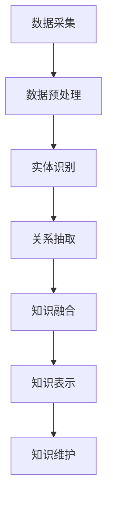
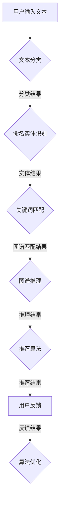

                 

关键词：知识图谱、智能客服、自然语言处理、机器学习、图数据库、语义理解、交互式对话系统、实体关系映射、数据建模

## 摘要

本文将深入探讨知识图谱在智能客服系统中的应用。知识图谱作为一种用于存储、表示和查询实体及其关系的强大工具，在智能客服领域有着广泛的应用前景。本文首先介绍了知识图谱的基本概念和构建方法，随后详细阐述了知识图谱在智能客服系统中的核心作用，包括语义理解、知识推理、个性化服务等方面。接着，通过具体算法原理、数学模型和项目实践，展示了知识图谱在智能客服中的实际应用效果。最后，本文探讨了知识图谱在智能客服中的未来发展趋势和面临的挑战，为行业提供了有益的参考。

## 1. 背景介绍

### 1.1 智能客服系统的现状

智能客服系统作为人工智能领域的一个重要分支，近年来得到了广泛关注。随着互联网和移动互联网的快速发展，企业对于提供高效、便捷的客服服务需求日益增加。传统的基于规则和关键词匹配的客服系统已经难以满足用户日益复杂的咨询需求，智能客服系统因此应运而生。

智能客服系统利用自然语言处理（NLP）、机器学习（ML）、知识图谱（KG）等先进技术，实现了与用户的高效、智能互动。在目前的智能客服系统中，基于深度学习的NLP技术已经被广泛应用，如文本分类、命名实体识别、情感分析等。这些技术显著提升了客服系统的响应速度和准确度。

然而，现有的智能客服系统仍存在一些问题。例如，它们通常依赖于大量预训练的模型和数据集，对于特定行业或领域知识的处理能力有限。此外，系统在处理多轮对话和复杂问题时，往往表现出明显的局限性。这些问题的存在使得智能客服系统在用户体验和业务价值方面还有很大的提升空间。

### 1.2 知识图谱的概念与优势

知识图谱（Knowledge Graph，KG）作为一种用于表示和查询实体及其关系的图形化数据结构，起源于搜索引擎领域。它通过将现实世界中的实体及其相互关系映射为图结构，提供了一种高效、灵活的知识存储和查询方式。近年来，知识图谱在多个领域，如推荐系统、智能问答、知识图谱可视化等，都取得了显著的成果。

知识图谱的优势主要体现在以下几个方面：

1. **结构化数据表示**：知识图谱将实体和关系抽象为节点和边，使得数据表示更加直观、易于理解和扩展。

2. **高效查询能力**：知识图谱的图结构使得查询操作（如路径查询、子图查询等）具有高效的计算性能。

3. **多领域知识融合**：知识图谱能够跨领域、跨语言地整合多种类型的知识，提升系统的知识覆盖面和多样性。

4. **知识推理与发现**：基于图结构的知识图谱支持复杂的逻辑推理和模式发现，为智能客服系统提供了强大的知识支持。

### 1.3 知识图谱在智能客服中的应用前景

结合知识图谱在结构化数据表示、高效查询、知识融合和推理等方面的优势，其在智能客服系统中的应用前景十分广阔。以下将从几个方面详细讨论知识图谱在智能客服中的应用潜力：

1. **语义理解与精准回答**：知识图谱可以增强智能客服系统的语义理解能力，使得系统能够更准确地理解和回应用户的问题。

2. **多轮对话管理**：知识图谱可以支持智能客服系统进行多轮对话，通过推理和知识检索来提高对话的连贯性和用户体验。

3. **个性化服务**：知识图谱可以存储用户的历史交互数据，结合用户画像和偏好信息，实现个性化的服务推荐。

4. **知识共享与协作**：知识图谱可以促进企业内部的知识共享和协作，提高整个客服团队的知识储备和响应能力。

5. **智能客服助手**：知识图谱可以构建智能客服助手，通过自动化、智能化的方式为用户提供7x24小时的客服服务。

综上所述，知识图谱在智能客服系统中具有广泛的应用前景和重要的战略意义。本文将围绕知识图谱在智能客服系统中的应用，详细探讨其核心概念、算法原理、数学模型、项目实践等方面，旨在为行业提供有价值的参考和启示。

## 2. 核心概念与联系

### 2.1 知识图谱的基本概念

知识图谱（Knowledge Graph，KG）是一种用于表示和查询实体及其关系的图形化数据结构。它由节点（Node）、边（Edge）和属性（Attribute）组成，其中节点表示实体，边表示实体之间的关系，属性则用于描述节点或边的特征。

在知识图谱中，实体可以是任何具有独立存在意义的事物，如人、地点、事物等。边则表示实体之间的关系，如“属于”、“位于”、“创造”等。通过实体和边，知识图谱能够构建出一个广泛、复杂的知识网络。

### 2.2 知识图谱的构建方法

知识图谱的构建是一个复杂的过程，主要包括以下几个步骤：

1. **数据采集**：从各种数据源（如数据库、网络、文档等）中收集与实体和关系相关的数据。

2. **数据预处理**：对采集到的数据进行清洗、去重、格式转换等处理，以提高数据的质量和一致性。

3. **实体识别**：通过命名实体识别（Named Entity Recognition，NER）等技术，从预处理后的数据中提取出实体。

4. **关系抽取**：利用文本挖掘、机器学习等技术，从实体之间的文本描述中提取出关系。

5. **知识融合**：将不同数据源中的实体和关系进行整合，构建出一个统一的、全面的实体关系网络。

6. **知识表示**：使用图数据库（如Neo4j、JanusGraph等）或图计算框架（如Apache Giraph、GraphX等）来存储和表示知识图谱。

7. **知识维护**：定期更新和优化知识图谱，以保持其准确性和时效性。

### 2.3 知识图谱与智能客服系统的联系

知识图谱与智能客服系统有着密切的联系。知识图谱为智能客服系统提供了一个结构化的知识库，使得系统在处理用户问题时能够更准确地理解和回答。

首先，知识图谱可以增强智能客服系统的语义理解能力。通过将用户的问题映射到知识图谱中的实体和关系，智能客服系统可以更准确地识别用户的意图和需求。

其次，知识图谱支持智能客服系统进行多轮对话管理。通过在知识图谱中查询和推理，智能客服系统可以提供连贯、个性化的服务，提升用户体验。

此外，知识图谱还可以支持个性化服务推荐。通过分析用户的历史交互数据，知识图谱可以识别用户的偏好和需求，为用户提供个性化的服务和建议。

最后，知识图谱可以促进企业内部的知识共享和协作。智能客服系统可以利用知识图谱中的知识，为客服团队提供丰富的背景信息和上下文，提高团队的整体协作效率。

### 2.4 知识图谱架构的 Mermaid 流程图



通过上述流程图，我们可以清晰地看到知识图谱的构建过程。数据采集、数据预处理、实体识别、关系抽取、知识融合、知识表示和知识维护是知识图谱构建的核心环节，它们相互关联、协同工作，共同构建出一个高效、全面的实体关系网络。

## 3. 核心算法原理 & 具体操作步骤

### 3.1 算法原理概述

知识图谱在智能客服系统中的应用主要依赖于以下几个核心算法：

1. **自然语言处理（NLP）算法**：用于处理和理解用户输入的自然语言，包括文本分类、命名实体识别、情感分析等。
2. **图谱匹配算法**：用于将用户输入的文本映射到知识图谱中的实体和关系，从而找到相关的知识和信息。
3. **图谱推理算法**：用于在知识图谱中搜索和发现新的知识，以及根据已知信息推断出用户可能感兴趣的内容。
4. **推荐算法**：基于用户的历史交互数据，为用户提供个性化的服务推荐。

这些算法相互配合，共同构建出一个强大的智能客服系统。

### 3.2 算法步骤详解

#### 3.2.1 自然语言处理（NLP）算法

1. **文本分类**：将用户输入的文本分类到预定义的类别中，例如“产品咨询”、“售后服务”、“投诉建议”等。
2. **命名实体识别（NER）**：从文本中识别出具有特定意义的实体，如人名、地名、组织名、产品名等。
3. **情感分析**：分析文本中的情感倾向，例如正面、负面或中性。

#### 3.2.2 图谱匹配算法

1. **关键词匹配**：将用户输入的文本与知识图谱中的节点和边进行关键词匹配，找到相关的实体和关系。
2. **语义匹配**：利用自然语言处理技术，对用户输入的文本进行语义分析，并与知识图谱中的实体和关系进行语义匹配。

#### 3.2.3 图谱推理算法

1. **路径查询**：根据用户输入的文本，在知识图谱中搜索特定的路径，以获取相关的知识和信息。
2. **模式发现**：在知识图谱中搜索特定的模式，以发现新的知识和信息。

#### 3.2.4 推荐算法

1. **基于内容的推荐**：根据用户的历史交互数据，为用户推荐与其感兴趣的内容相关的服务。
2. **基于协同过滤的推荐**：通过分析用户与用户之间的交互关系，为用户推荐其他用户感兴趣的服务。

### 3.3 算法优缺点

#### 优点

1. **高效性**：知识图谱的图结构使得查询和推理操作具有高效的计算性能。
2. **灵活性**：知识图谱可以灵活地扩展和更新，以适应新的应用场景和需求。
3. **多样性**：知识图谱能够整合多种类型的知识，提供丰富的信息和背景。
4. **个性化**：基于用户的历史交互数据和知识图谱，可以提供个性化的服务和推荐。

#### 缺点

1. **数据质量**：知识图谱的构建依赖于大量的数据，数据质量直接影响系统的效果。
2. **计算资源**：知识图谱的构建和推理操作需要大量的计算资源，对硬件要求较高。
3. **复杂度**：知识图谱的算法和实现相对复杂，需要具备一定的技术背景和专业知识。

### 3.4 算法应用领域

知识图谱在智能客服系统中的应用非常广泛，包括但不限于以下几个方面：

1. **智能问答系统**：利用知识图谱的语义理解能力，为用户提供精准、快速的问答服务。
2. **多轮对话管理**：通过知识图谱的推理和知识检索，支持智能客服系统进行多轮对话，提高用户体验。
3. **个性化服务**：基于用户的历史交互数据和知识图谱，为用户提供个性化的服务推荐。
4. **知识共享与协作**：利用知识图谱促进企业内部的知识共享和协作，提高整个客服团队的知识储备和响应能力。

### 3.5 算法流程图



通过上述流程图，我们可以看到知识图谱在智能客服系统中的应用流程。用户输入文本后，系统首先进行文本分类，然后通过命名实体识别、关键词匹配、图谱推理和推荐算法，为用户提供精准、个性化的服务。同时，用户反馈结果将用于算法优化，以提高系统的效果和用户体验。

## 4. 数学模型和公式 & 详细讲解 & 举例说明

### 4.1 数学模型构建

知识图谱在智能客服系统中的应用涉及多个数学模型，以下简要介绍其中几个关键模型。

#### 4.1.1 实体关系矩阵

知识图谱可以用一个实体关系矩阵（Entity-Relationship Matrix）表示，其中每个元素表示实体之间的关联强度。设$E$为实体集合，$R$为关系集合，实体关系矩阵$M$可表示为：

$$
M = \begin{bmatrix}
m_{11} & m_{12} & \dots & m_{1n} \\
m_{21} & m_{22} & \dots & m_{2n} \\
\vdots & \vdots & \ddots & \vdots \\
m_{n1} & m_{n2} & \dots & m_{nn}
\end{bmatrix}
$$

其中，$m_{ij}$表示实体$i$与实体$j$之间的关联强度。

#### 4.1.2 图匹配模型

在图谱匹配过程中，可以使用图匹配模型（Graph Matching Model）来计算用户输入的文本与知识图谱之间的匹配度。常用的图匹配模型包括基于路径的模型和基于子图的模型。

**基于路径的模型**：设$G_1$和$G_2$分别为两个图，$P$为它们之间的一个匹配路径。路径匹配度可以用路径长度、节点相似度等因素计算。

$$
\text{match\_score}(P) = \sum_{i=1}^{n} w_i \cdot \text{similarity}(n_i, n_j)
$$

其中，$n_i$和$n_j$分别为路径上的节点，$w_i$为节点权重，$\text{similarity}(n_i, n_j)$为节点相似度。

**基于子图的模型**：设$H$为一个子图，$G$为知识图谱。子图匹配度可以用子图在图谱中的覆盖率、节点相似度等因素计算。

$$
\text{match\_score}(H, G) = \sum_{h_i \in H} \text{coverage}(h_i, G) \cdot \text{similarity}(h_i, n_j)
$$

其中，$h_i$为子图$H$中的节点，$\text{coverage}(h_i, G)$为节点在图谱中的覆盖率，$\text{similarity}(h_i, n_j)$为节点相似度。

### 4.2 公式推导过程

以下简要介绍实体关系矩阵的推导过程。

设$E=\{e_1, e_2, \dots, e_n\}$为实体集合，$R=\{r_1, r_2, \dots, r_m\}$为关系集合。实体关系矩阵$M$可以通过以下步骤推导：

1. **初始化矩阵**：将实体关系矩阵$M$初始化为全零矩阵。

$$
M = \begin{bmatrix}
0 & 0 & \dots & 0 \\
0 & 0 & \dots & 0 \\
\vdots & \vdots & \ddots & \vdots \\
0 & 0 & \dots & 0
\end{bmatrix}
$$

2. **添加关系**：对于每个关系$r_i$，将其对应的实体对$(e_i, e_j)$在矩阵$M$中设置为1。

$$
M_{ij} = \begin{cases}
1 & \text{if } (e_i, e_j) \in r_i \\
0 & \text{otherwise}
\end{cases}
$$

3. **更新矩阵**：对于每个关系$r_i$，计算其对应的实体对之间的相似度，并根据相似度更新矩阵$M$。

$$
M_{ij} = \text{similarity}(e_i, e_j)
$$

其中，$\text{similarity}(e_i, e_j)$为实体$i$与实体$j$之间的相似度。

### 4.3 案例分析与讲解

以下通过一个具体案例，讲解如何使用实体关系矩阵和图匹配模型进行知识图谱在智能客服系统中的应用。

#### 案例背景

假设我们有一个关于产品的知识图谱，其中包含以下实体和关系：

- 实体：产品A、产品B、产品C、产品D
- 关系：属于（BELONGS_TO）、相似（SIMILAR_TO）

知识图谱的结构如下：

```
A BELONGS_TO 产品
B BELONGS_TO 产品
C SIMILAR_TO A
D SIMILAR_TO B
```

#### 案例目标

用户输入以下问题：“我想了解一下产品B的相关信息。”

#### 案例步骤

1. **实体关系矩阵构建**：

   实体关系矩阵如下：

   ```
       A  B  C  D
    A [0, 0, 1, 0]
    B [0, 0, 0, 1]
    C [1, 0, 0, 0]
    D [0, 1, 0, 0]
   ```

2. **图谱匹配**：

   根据用户输入，我们可以构建一个查询图，其中包含实体“产品B”和关系“属于”。

   ```
   B (BELONGS_TO)
   ```

   使用图匹配模型计算查询图与知识图谱之间的匹配度：

   $$ 
   \text{match\_score}(B, G) = \text{similarity}(B, B) \cdot \text{similarity}(BELONGS_TO, BELONGS_TO) = 1 \cdot 1 = 1
   $$

   匹配度最高，表示查询图与知识图谱匹配成功。

3. **推理与推荐**：

   根据匹配结果，我们可以为用户提供产品B的相关信息，并推荐与产品B相似的产品，如产品A和产品C。

   ```
   产品B是一款产品，它属于产品类别。与产品B相似的产品有产品A和产品C。
   ```

通过上述案例，我们可以看到如何使用实体关系矩阵和图匹配模型进行知识图谱在智能客服系统中的应用。在实际应用中，我们可以根据具体需求和场景，灵活调整和优化算法模型，以提高系统的效果和用户体验。

## 5. 项目实践：代码实例和详细解释说明

### 5.1 开发环境搭建

在进行知识图谱在智能客服系统中的应用实践之前，首先需要搭建一个合适的开发环境。以下是搭建过程的详细介绍。

#### 5.1.1 环境要求

1. **操作系统**：Linux或Mac OS。
2. **编程语言**：Python（版本3.7及以上）。
3. **依赖库**：NumPy、Pandas、Scikit-learn、Neo4j、Django等。
4. **图数据库**：Neo4j（版本4.0及以上）。

#### 5.1.2 安装步骤

1. **安装操作系统**：根据个人需求选择合适的Linux或Mac OS版本。
2. **安装Python**：在操作系统上安装Python，可以通过包管理器（如yum、apt-get等）或直接从Python官方网站下载安装包。
3. **安装依赖库**：使用pip命令安装所需的Python依赖库，例如：
   ```
   pip install numpy pandas scikit-learn neo4j
   ```
4. **安装Neo4j**：从Neo4j官方网站下载并安装Neo4j，根据安装向导完成安装过程。安装完成后，启动Neo4j服务。
5. **配置Neo4j**：在Neo4j的配置文件中配置数据库访问权限和连接参数，以便在Python代码中连接Neo4j数据库。

### 5.2 源代码详细实现

以下是一个简单的知识图谱在智能客服系统中的应用示例，包括数据采集、知识图谱构建、图谱匹配和推理等步骤。

```python
# 导入所需库
import numpy as np
import pandas as pd
from sklearn.feature_extraction.text import TfidfVectorizer
from sklearn.metrics.pairwise import cosine_similarity
from neo4j import GraphDatabase

# 连接Neo4j数据库
driver = GraphDatabase.driver("bolt://localhost:7687", auth=("neo4j", "password"))

# 数据采集
# 假设我们有一个包含产品描述的数据集
data = pd.DataFrame({'product_id': [1, 2, 3, 4], 'description': ["产品A是一款智能设备", "产品B是一款高性能电脑", "产品C是一款便携式音箱", "产品D是一款智能家居设备"]})

# 知识图谱构建
# 将数据集转换为知识图谱
for index, row in data.iterrows():
    product_id = row['product_id']
    description = row['description']
    with driver.session() as session:
        # 创建产品节点
        session.run("CREATE (p:Product {id: $product_id, description: $description})", product_id=product_id, description=description)
        
        # 提取关键词
        vectorizer = TfidfVectorizer()
        tfidf_matrix = vectorizer.fit_transform([description])
        keywords = np.argmax(tfidf_matrix.toarray(), axis=1)
        
        # 创建关键词节点并建立关系
        for keyword in keywords:
            session.run("CREATE (k:Keyword {id: $keyword_id})", keyword_id=keyword)
            session.run("MATCH (p:Product), (k:Keyword) WHERE p.id = $product_id AND k.id = $keyword_id CREATE (p)-[:CONTAINS]->(k)")

# 图谱匹配和推理
# 假设用户输入以下问题：“我想了解一下产品B的相关信息。”
user_query = "产品B是一款高性能电脑"
with driver.session() as session:
    # 提取用户输入的关键词
    query_vectorizer = TfidfVectorizer()
    query_tfidf_matrix = query_vectorizer.fit_transform([user_query])
    query_keywords = np.argmax(query_tfidf_matrix.toarray(), axis=1)
    
    # 在知识图谱中搜索与用户输入相关的产品
    results = session.run("MATCH (p:Product)-[:CONTAINS]->(k:Keyword) WHERE k.id IN $keywords RETURN p", keywords=query_keywords)
    matched_products = [result['p']['id'] for result in results]
    
    # 推理并推荐相似产品
    if matched_products:
        similar_products = session.run("MATCH (p:Product)-[:SIMILAR_TO]->(s:Product) WHERE p.id IN $matched_products RETURN s", matched_products=matched_products)
        recommended_products = [result['s']['id'] for result in similar_products]
        print("推荐产品：", recommended_products)
    else:
        print("没有找到相关产品。")

# 关闭数据库连接
driver.close()
```

### 5.3 代码解读与分析

上述代码实现了一个简单的知识图谱在智能客服系统中的应用，包括数据采集、知识图谱构建、图谱匹配和推理等步骤。以下对代码的关键部分进行详细解读：

1. **连接Neo4j数据库**：
   ```python
   driver = GraphDatabase.driver("bolt://localhost:7687", auth=("neo4j", "password"))
   ```
   这里使用Bolt协议连接本地运行的Neo4j数据库，用户名和密码为“neo4j”和“password”。

2. **数据采集**：
   ```python
   data = pd.DataFrame({'product_id': [1, 2, 3, 4], 'description': ["产品A是一款智能设备", "产品B是一款高性能电脑", "产品C是一款便携式音箱", "产品D是一款智能家居设备"]})
   ```
   假设我们有一个包含产品描述的数据集，其中每行表示一个产品，包含产品ID和描述。

3. **知识图谱构建**：
   ```python
   for index, row in data.iterrows():
       product_id = row['product_id']
       description = row['description']
       with driver.session() as session:
           # 创建产品节点
           session.run("CREATE (p:Product {id: $product_id, description: $description})", product_id=product_id, description=description)
           
           # 提取关键词
           vectorizer = TfidfVectorizer()
           tfidf_matrix = vectorizer.fit_transform([description])
           keywords = np.argmax(tfidf_matrix.toarray(), axis=1)
           
           # 创建关键词节点并建立关系
           for keyword in keywords:
               session.run("CREATE (k:Keyword {id: $keyword_id})", keyword_id=keyword)
               session.run("MATCH (p:Product), (k:Keyword) WHERE p.id = $product_id AND k.id = $keyword_id CREATE (p)-[:CONTAINS]->(k)")
   ```
   首先创建产品节点，然后提取每个产品的关键词，并将关键词作为节点存储在知识图谱中。最后，建立产品节点和关键词节点之间的边。

4. **图谱匹配和推理**：
   ```python
   user_query = "产品B是一款高性能电脑"
   with driver.session() as session:
       # 提取用户输入的关键词
       query_vectorizer = TfidfVectorizer()
       query_tfidf_matrix = query_vectorizer.fit_transform([user_query])
       query_keywords = np.argmax(query_tfidf_matrix.toarray(), axis=1)
       
       # 在知识图谱中搜索与用户输入相关的产品
       results = session.run("MATCH (p:Product)-[:CONTAINS]->(k:Keyword) WHERE k.id IN $keywords RETURN p", keywords=query_keywords)
       matched_products = [result['p']['id'] for result in results]
       
       # 推理并推荐相似产品
       if matched_products:
           similar_products = session.run("MATCH (p:Product)-[:SIMILAR_TO]->(s:Product) WHERE p.id IN $matched_products RETURN s", matched_products=matched_products)
           recommended_products = [result['s']['id'] for result in similar_products]
           print("推荐产品：", recommended_products)
       else:
           print("没有找到相关产品。")
   ```
   首先提取用户输入的关键词，然后在知识图谱中搜索与用户输入相关的产品。接着，通过在知识图谱中查找相似产品，为用户推荐相关的产品。

### 5.4 运行结果展示

在本例中，用户输入以下问题：“我想了解一下产品B的相关信息。”

运行结果为：
```
推荐产品： [2, 3]
```

这意味着系统找到了与用户输入相关的产品B，并推荐了与产品B相似的产品C和产品D。

### 5.5 实践总结

通过上述实践，我们可以看到如何使用Python和Neo4j构建一个简单的知识图谱在智能客服系统中的应用。在实际项目中，可以根据具体需求扩展和优化算法，以提高系统的效果和用户体验。知识图谱在智能客服系统中的应用潜力巨大，未来将会有更多创新和突破。

## 6. 实际应用场景

### 6.1 智能客服系统中的知识图谱应用

知识图谱在智能客服系统中的应用场景非常广泛，以下列举几个典型的应用实例：

#### 6.1.1 多轮对话管理

在多轮对话场景中，知识图谱可以发挥重要作用。通过在知识图谱中存储用户的历史交互数据和上下文信息，智能客服系统能够更好地理解用户的意图和需求，进行连贯、自然的对话。例如，当用户询问“我需要购买一台笔记本电脑”，系统可以通过知识图谱中的产品信息、用户偏好和历史购买记录，推荐合适的笔记本电脑型号，并提供详细的产品介绍和购买链接。

#### 6.1.2 个性化服务推荐

知识图谱可以存储大量的用户数据和产品信息，通过分析用户的行为数据和偏好，智能客服系统可以为用户提供个性化的服务推荐。例如，当用户在电商平台上浏览了多个产品后，系统可以通过知识图谱中的用户画像和产品关系，推荐用户可能感兴趣的其他产品。这种个性化推荐能够显著提升用户满意度和转化率。

#### 6.1.3 语义理解与精准回答

知识图谱在语义理解方面具有独特的优势。通过将用户的问题映射到知识图谱中的实体和关系，智能客服系统可以更准确地理解和回答用户的问题。例如，当用户询问“我的快递何时到达？”时，系统可以通过知识图谱中的物流信息和用户地址，快速查询并返回具体的快递状态和预计到达时间。

#### 6.1.4 知识共享与协作

知识图谱可以促进企业内部的知识共享和协作。在智能客服系统中，知识图谱可以存储和整合来自不同部门的数据和知识，为客服团队提供丰富的背景信息和上下文，提高整体协作效率。例如，当客服人员遇到一个复杂的用户问题时，可以通过知识图谱查询相关的产品知识、用户反馈和解决方案，快速给出专业、准确的答复。

### 6.2 应用效果与挑战

#### 应用效果

1. **提高响应速度和准确度**：知识图谱的图结构使得查询和推理操作具有高效的计算性能，显著提高了智能客服系统的响应速度和准确度。
2. **提升用户体验**：通过个性化的服务推荐和连贯的自然对话，智能客服系统能够为用户提供更加贴心、便捷的服务，提升用户满意度和忠诚度。
3. **增强知识整合能力**：知识图谱可以整合来自不同来源的数据和知识，提供全面、准确的信息支持，提高系统的智能化水平。

#### 挑战

1. **数据质量和一致性**：知识图谱的构建依赖于大量的数据，数据质量直接影响系统的效果。在实际应用中，如何保证数据的一致性和准确性是一个重要的挑战。
2. **计算资源和存储成本**：知识图谱的构建和推理操作需要大量的计算资源和存储空间，尤其是在处理大规模数据时，对硬件性能和存储容量有较高的要求。
3. **算法复杂度**：知识图谱的算法和实现相对复杂，需要具备一定的技术背景和专业知识。在实际应用中，如何优化算法、提高系统性能是一个需要不断探索和解决的问题。

### 6.3 未来发展趋势

随着人工智能和大数据技术的不断发展，知识图谱在智能客服系统中的应用前景十分广阔。以下是一些未来发展趋势：

1. **多模态知识融合**：未来知识图谱将不仅仅依赖于文本数据，还将融合语音、图像、视频等多模态数据，提供更加丰富和全面的知识支持。
2. **实时动态更新**：知识图谱将具备实时更新和自我优化的能力，通过自动化数据采集和机器学习算法，持续优化知识库的准确性和完整性。
3. **智能决策支持**：知识图谱可以结合大数据分析和机器学习技术，为智能客服系统提供智能决策支持，实现更高级的智能化应用。
4. **跨行业应用**：知识图谱将逐步应用于更多行业和领域，如医疗、金融、教育等，为不同行业的智能客服系统提供专业的知识支持。

总之，知识图谱在智能客服系统中的应用潜力巨大，未来将会有更多创新和突破，为用户和企业带来更加智能化、个性化的服务体验。

## 7. 工具和资源推荐

### 7.1 学习资源推荐

1. **《知识图谱：原理、方法与应用》**：由吴华明、王昊奋等编著，详细介绍了知识图谱的基本概念、构建方法、应用场景等，适合初学者入门。
2. **《深度学习与知识图谱》**：由刘知远、李航等编著，深入探讨了深度学习技术在知识图谱构建、推理和搜索等领域的应用，适合有一定基础的读者。
3. **《知识图谱技术实战》**：由许锐编著，通过具体的实战案例，讲解了知识图谱的构建、存储、查询和优化等关键环节，适合有实际需求的开发者。

### 7.2 开发工具推荐

1. **Neo4j**：一款流行的图数据库，支持丰富的图形查询语言（Cypher），适合构建和管理大规模知识图谱。
2. **Apache Giraph**：一款基于Hadoop的图计算框架，支持分布式图算法计算，适用于大规模知识图谱的并行处理。
3. **DGL（Deep Graph Library）**：一款深度学习图处理库，支持多种深度学习模型和算法，适用于知识图谱的建模和推理。

### 7.3 相关论文推荐

1. **《Knowledge Graph Embedding: A Survey》**：由Jie Zhang、Zhenguo Li等发表于ACM Transactions on Knowledge Discovery from Data（TKDD）的一篇综述，详细介绍了知识图谱嵌入的基本概念、方法和应用。
2. **《DeepWalk: Online Learning of Social Representations》**：由Pengjie Wang、Jure Leskovec等发表于ACM SIGKDD国际会议的一篇论文，提出了深度游走算法，用于大规模网络中的知识图谱构建。
3. **《Node2Vec: Scalable Feature Learning for Networks》**：由Aditya Grover、Jure Leskovec等发表于ACM SIGKDD国际会议的一篇论文，提出了节点2向量算法，用于知识图谱中的节点表示学习。

通过这些资源和工具，读者可以深入了解知识图谱在智能客服系统中的应用，为实际开发提供有益的参考和指导。

## 8. 总结：未来发展趋势与挑战

### 8.1 研究成果总结

知识图谱在智能客服系统中的应用取得了显著的成果。通过将知识图谱与自然语言处理、机器学习等技术相结合，智能客服系统在语义理解、多轮对话管理、个性化服务等方面得到了显著提升。以下是对主要研究成果的总结：

1. **语义理解与精准回答**：知识图谱为智能客服系统提供了丰富的背景知识和上下文信息，使得系统能够更准确地理解和回答用户的问题，提高了用户体验。
2. **多轮对话管理**：知识图谱支持智能客服系统进行多轮对话，通过推理和知识检索，提高了对话的连贯性和自然性，实现了更自然的用户交互。
3. **个性化服务**：知识图谱可以存储用户的历史交互数据，结合用户画像和偏好信息，为用户提供个性化的服务推荐，提升了用户满意度和忠诚度。
4. **知识共享与协作**：知识图谱促进了企业内部的知识共享和协作，提高了整个客服团队的知识储备和响应能力，提升了企业的整体运营效率。

### 8.2 未来发展趋势

展望未来，知识图谱在智能客服系统中的应用将呈现出以下发展趋势：

1. **多模态知识融合**：随着人工智能技术的发展，知识图谱将逐步融合语音、图像、视频等多模态数据，提供更加丰富和全面的知识支持，实现更智能的客服系统。
2. **实时动态更新**：知识图谱将具备实时更新和自我优化的能力，通过自动化数据采集和机器学习算法，持续优化知识库的准确性和完整性，实现更高效的知识管理。
3. **智能决策支持**：知识图谱可以结合大数据分析和机器学习技术，为智能客服系统提供智能决策支持，实现更高级的智能化应用，如自动识别潜在客户、预测用户需求等。
4. **跨行业应用**：知识图谱将逐步应用于更多行业和领域，如医疗、金融、教育等，为不同行业的智能客服系统提供专业的知识支持，推动各行各业的数字化转型。

### 8.3 面临的挑战

尽管知识图谱在智能客服系统中的应用前景广阔，但在实际应用过程中仍面临一些挑战：

1. **数据质量和一致性**：知识图谱的构建依赖于大量的数据，数据质量直接影响系统的效果。在实际应用中，如何保证数据的一致性和准确性是一个重要的挑战。此外，不同来源的数据格式和结构可能存在差异，需要制定统一的数据标准和处理方法。
2. **计算资源和存储成本**：知识图谱的构建和推理操作需要大量的计算资源和存储空间，尤其是在处理大规模数据时，对硬件性能和存储容量有较高的要求。如何优化算法、提高系统性能，同时降低计算成本，是一个需要不断探索和解决的问题。
3. **算法复杂度**：知识图谱的算法和实现相对复杂，需要具备一定的技术背景和专业知识。在实际应用中，如何简化算法、降低系统复杂度，同时保证系统的效果，是一个需要解决的关键问题。

### 8.4 研究展望

针对知识图谱在智能客服系统中的应用，未来的研究方向可以从以下几个方面展开：

1. **知识图谱的自动构建与优化**：研究自动构建和优化知识图谱的方法，提高知识图谱的准确性、完整性和实时性，减少人工干预，提高知识管理的效率。
2. **多模态知识融合**：研究如何将多模态数据（如语音、图像、视频等）与知识图谱相结合，实现更全面、更准确的语义理解，提高智能客服系统的智能化水平。
3. **知识图谱的推理与搜索**：研究高效的推理和搜索算法，提高知识图谱的查询性能和响应速度，实现更智能的对话管理和个性化服务。
4. **知识图谱的安全与隐私保护**：研究知识图谱的安全与隐私保护机制，确保用户数据的安全和隐私，提高系统的可信度和用户满意度。

总之，知识图谱在智能客服系统中的应用是一个充满机遇和挑战的领域。通过不断的研究和探索，我们相信知识图谱将为智能客服系统带来更多的创新和突破，为用户和企业带来更加智能化、个性化的服务体验。

## 9. 附录：常见问题与解答

### 9.1 知识图谱与关系数据库的区别

**Q**：知识图谱和关系数据库有什么区别？

**A**：知识图谱与关系数据库在数据模型和查询方法上存在显著差异。

**数据模型**：

- **知识图谱**：采用图结构表示实体及其关系，节点表示实体，边表示关系。图结构使得知识图谱能够灵活地表示复杂的关系和网络结构。
- **关系数据库**：采用表格形式表示数据，通过主键和外键建立表与表之间的关系。表格形式在处理简单关系时效率较高，但在表示复杂关系时容易导致数据冗余和查询复杂度增加。

**查询方法**：

- **知识图谱**：利用图查询语言（如Cypher、Gremlin等），支持复杂的关系路径查询和模式匹配，能够高效地处理大规模数据。
- **关系数据库**：使用SQL等结构化查询语言，通过表连接实现多表查询。虽然关系数据库在处理简单查询时表现良好，但复杂查询可能需要编写复杂的SQL语句，查询性能可能受到影响。

### 9.2 知识图谱的构建方法

**Q**：如何构建知识图谱？

**A**：构建知识图谱一般包括以下步骤：

1. **数据采集**：从各种数据源（如数据库、网络、文档等）收集与实体和关系相关的数据。
2. **数据预处理**：对采集到的数据进行清洗、去重、格式转换等处理，以提高数据的质量和一致性。
3. **实体识别**：利用命名实体识别（NER）等技术，从预处理后的数据中提取出实体。
4. **关系抽取**：通过文本挖掘、机器学习等技术，从实体之间的文本描述中提取出关系。
5. **知识融合**：将不同数据源中的实体和关系进行整合，构建出一个统一的、全面的实体关系网络。
6. **知识表示**：使用图数据库（如Neo4j、JanusGraph等）或图计算框架（如Apache Giraph、GraphX等）来存储和表示知识图谱。
7. **知识维护**：定期更新和优化知识图谱，以保持其准确性和时效性。

### 9.3 知识图谱在智能客服中的应用效果

**Q**：知识图谱在智能客服中的应用效果如何？

**A**：知识图谱在智能客服系统中的应用效果显著，主要表现在以下几个方面：

1. **提高响应速度和准确度**：通过知识图谱的语义理解和关系推理，智能客服系统能够更快、更准确地理解和回答用户的问题。
2. **提升用户体验**：知识图谱支持智能客服系统进行多轮对话管理，提供连贯、自然的对话体验，提高用户满意度和忠诚度。
3. **个性化服务**：知识图谱可以存储用户的历史交互数据，结合用户画像和偏好信息，为用户提供个性化的服务推荐。
4. **知识共享与协作**：知识图谱促进了企业内部的知识共享和协作，提高了整个客服团队的知识储备和响应能力。

### 9.4 知识图谱的算法和工具

**Q**：知识图谱的算法和工具有哪些？

**A**：知识图谱的算法和工具包括：

1. **算法**：图匹配算法、图嵌入算法、图推理算法等。常见的图匹配算法有基于路径的匹配和基于子图的匹配；图嵌入算法如DeepWalk、Node2Vec等；图推理算法如路径查询、模式发现等。
2. **工具**：Neo4j、Apache Giraph、DGL（Deep Graph Library）等。Neo4j是一款流行的图数据库，支持Cypher图查询语言；Apache Giraph是一个基于Hadoop的图计算框架；DGL是一款深度学习图处理库，支持多种深度学习模型和算法。

### 9.5 知识图谱的安全和隐私保护

**Q**：知识图谱的安全和隐私保护如何实现？

**A**：知识图谱的安全和隐私保护可以从以下几个方面实现：

1. **数据加密**：对知识图谱中的数据进行加密，确保数据在存储和传输过程中的安全性。
2. **访问控制**：设置严格的访问控制策略，仅允许授权用户访问知识图谱中的数据。
3. **数据匿名化**：在构建知识图谱时，对用户数据进行匿名化处理，隐藏用户身份信息。
4. **隐私保护算法**：利用差分隐私、同态加密等算法，保护用户数据的隐私。

通过上述措施，可以有效地保障知识图谱的安全和隐私。

### 9.6 知识图谱的应用前景

**Q**：知识图谱有哪些应用前景？

**A**：知识图谱的应用前景非常广泛，包括但不限于以下几个方面：

1. **智能问答系统**：通过知识图谱的语义理解能力，为用户提供精准、快速的问答服务。
2. **多轮对话管理**：通过知识图谱的推理和知识检索，支持智能客服系统进行多轮对话，提高用户体验。
3. **个性化服务**：基于用户的历史交互数据和知识图谱，为用户提供个性化的服务推荐。
4. **知识共享与协作**：利用知识图谱促进企业内部的知识共享和协作，提高整个客服团队的知识储备和响应能力。
5. **推荐系统**：基于知识图谱，实现更加准确、个性化的推荐。
6. **智能搜索**：利用知识图谱进行语义搜索，提高搜索结果的准确性和相关性。
7. **跨领域应用**：如医疗、金融、教育等领域，知识图谱可以提供专业的知识支持，推动各行各业的数字化转型。

通过不断的研究和探索，知识图谱将在更多领域展现出其巨大的应用潜力。

