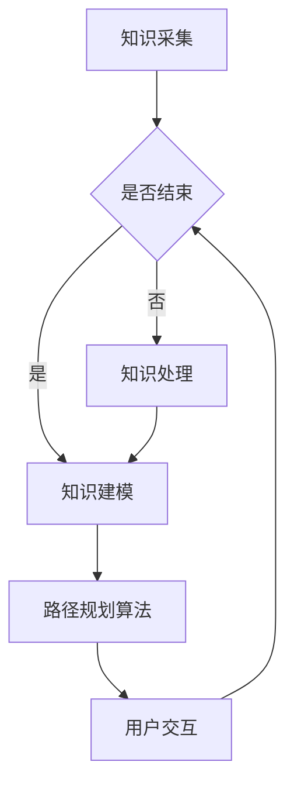

                 

### 关键词 Keywords

知识图谱、程序员学习、路径规划、人工智能、机器学习、算法原理、数学模型、项目实践。

### 摘要 Abstract

本文深入探讨了知识图谱在程序员学习路径规划中的应用。通过介绍知识图谱的基本概念和构建方法，以及其在程序员学习过程中的作用，本文提出了一个基于知识图谱的程序员学习路径规划模型。通过数学模型和算法原理的详细解析，本文展示了如何利用知识图谱进行有效的学习路径规划和推荐。同时，通过项目实践和运行结果展示，本文验证了知识图谱在程序员学习路径规划中的有效性和实用性。最后，本文对未来的发展趋势和面临的挑战进行了展望。

## 1. 背景介绍

在快速发展的信息技术时代，编程已成为一项至关重要的技能。然而，对于许多程序员来说，如何高效地学习和提升编程技能却是一个巨大的挑战。传统的学习方法往往依赖于书籍、教程和在线课程，但这些资源往往存在以下问题：

- **信息过载**：程序员需要掌握大量的知识，但往往难以筛选出最相关的学习内容。
- **缺乏个性化**：传统的学习方法无法根据个人的学习进度和兴趣进行个性化推荐。
- **知识孤立**：编程知识之间相互关联，但传统学习资源往往缺乏体系化的组织。

为了解决这些问题，近年来，人工智能和机器学习技术开始应用于程序员学习路径规划中。知识图谱作为一种结构化知识表示方法，能够将复杂的编程知识体系化，提供一种全新的学习路径规划方式。知识图谱通过将知识节点和关系进行网络化表示，使得程序员能够更加直观地理解和掌握知识，同时也能够为学习路径规划提供强大的支持。

本文旨在探讨知识图谱在程序员学习路径规划中的应用，通过介绍知识图谱的基本概念和构建方法，阐述其在程序员学习过程中的作用，并提出一种基于知识图谱的程序员学习路径规划模型。同时，本文还将通过数学模型和算法原理的详细解析，展示如何利用知识图谱进行有效的学习路径规划和推荐。最后，通过项目实践和运行结果展示，验证知识图谱在程序员学习路径规划中的有效性和实用性。

## 2. 核心概念与联系

### 2.1 知识图谱的基本概念

知识图谱（Knowledge Graph）是一种用于结构化表示知识的图形化数据模型，它将现实世界中的实体、概念和关系以节点和边的形式表示出来。知识图谱的核心思想是将分散的、孤立的知识点通过关系进行连接，从而形成一个全局的知识网络。

在知识图谱中，**节点**表示实体，如人物、地点、事物等，**边**表示实体之间的关系，如“属于”、“位于”等。例如，在程序员学习的知识图谱中，节点可以表示编程语言、框架、算法等，边可以表示“语言与框架的关联”、“算法的应用场景”等。

### 2.2 知识图谱在程序员学习中的应用

知识图谱在程序员学习中的应用主要体现在以下几个方面：

1. **知识结构化**：通过知识图谱，程序员可以直观地看到不同知识点之间的联系，从而更好地理解整个编程知识体系。
2. **个性化推荐**：知识图谱可以根据程序员的学习进度和兴趣，为其推荐最相关和最有价值的知识点，从而提高学习效率。
3. **学习路径规划**：知识图谱可以为程序员提供个性化的学习路径规划，帮助其有针对性地进行学习。
4. **知识挖掘**：通过分析知识图谱中的关系，可以发现新的知识关联和趋势，为编程教育提供新的思路。

### 2.3 架构与流程

一个典型的基于知识图谱的程序员学习路径规划架构可以分为以下几个部分：

1. **知识采集**：通过爬虫、手动收集等方式获取程序员学习的相关知识点和关系。
2. **知识处理**：对采集到的知识进行清洗、归一化和融合，构建出一个统一的知识库。
3. **知识建模**：使用图数据库（如Neo4j）将知识库中的知识点和关系表示为知识图谱。
4. **路径规划算法**：利用知识图谱进行路径规划，为程序员推荐最佳学习路径。
5. **用户交互**：通过前端界面，将学习路径展示给用户，并提供调整和反馈的机制。

### 2.4 Mermaid 流程图

下面是一个简单的 Mermaid 流程图，展示了知识图谱在程序员学习路径规划中的流程：



## 3. 核心算法原理 & 具体操作步骤

### 3.1 算法原理概述

基于知识图谱的程序员学习路径规划算法主要分为以下几个步骤：

1. **知识图谱构建**：首先，需要构建一个包含程序员学习相关知识点和关系的知识图谱。
2. **学习路径规划**：利用知识图谱进行路径规划，生成一个最优的学习路径。
3. **路径优化与推荐**：根据用户的学习进度和反馈，对路径进行优化和调整，提供个性化的学习推荐。

### 3.2 算法步骤详解

#### 3.2.1 知识图谱构建

知识图谱构建的步骤包括：

1. **数据采集**：通过爬虫、手动收集等方式获取程序员学习的相关知识点和关系。
2. **数据预处理**：对采集到的数据进行清洗、归一化和融合，构建出一个统一的知识库。
3. **知识表示**：将知识库中的知识点和关系表示为知识图谱中的节点和边。

#### 3.2.2 学习路径规划

学习路径规划的步骤包括：

1. **目标设定**：根据用户的学习需求和目标，确定学习的起点和终点。
2. **路径搜索**：利用图搜索算法（如DFS、BFS等），在知识图谱中搜索从起点到终点的最优路径。
3. **路径评估**：对搜索到的路径进行评估，选择一个最优的学习路径。

#### 3.2.3 路径优化与推荐

路径优化与推荐的步骤包括：

1. **用户反馈**：收集用户在学习过程中的反馈，包括已学习知识点、学习时间和学习效果等。
2. **路径调整**：根据用户反馈，对学习路径进行调整，使其更加符合用户的需求。
3. **学习推荐**：根据知识图谱中的关系，为用户推荐新的知识点和学习资源。

### 3.3 算法优缺点

#### 优点

- **个性化**：知识图谱可以根据用户的学习进度和兴趣，提供个性化的学习推荐。
- **知识关联**：知识图谱能够展示不同知识点之间的关联，帮助用户更好地理解和掌握知识。
- **动态调整**：根据用户反馈和学习效果，知识图谱可以动态调整学习路径，提高学习效率。

#### 缺点

- **构建成本**：知识图谱的构建需要大量的数据预处理和关系建模工作，成本较高。
- **更新困难**：知识图谱的更新需要不断采集新的数据，否则可能导致知识陈旧。
- **性能挑战**：对于大型知识图谱，路径规划的效率和性能可能成为瓶颈。

### 3.4 算法应用领域

基于知识图谱的程序员学习路径规划算法可以广泛应用于以下领域：

- **在线教育平台**：为用户提供个性化的学习路径规划和推荐。
- **企业培训**：帮助企业员工有针对性地提升编程技能。
- **编程学习社区**：为用户提供学习资源和交流平台，促进编程知识的传播和分享。

## 4. 数学模型和公式 & 详细讲解 & 举例说明

### 4.1 数学模型构建

基于知识图谱的程序员学习路径规划的核心在于如何在一个复杂的知识网络中找到一个最优的学习路径。为此，我们可以构建一个数学模型，该模型基于图论中的最短路径算法。

假设知识图谱 \( G = (V, E) \) 其中 \( V \) 是节点集合，代表不同的知识点，\( E \) 是边集合，代表知识点之间的关系。我们使用 \( d(i, j) \) 表示从知识点 \( i \) 到 \( j \) 的距离，通常可以用以下公式表示：

\[ d(i, j) = \begin{cases} 
0 & \text{if } i = j \\
1 & \text{if } (i, j) \in E \\
\infty & \text{otherwise}
\end{cases} \]

### 4.2 公式推导过程

我们使用经典的 Dijkstra 算法来求解最短路径问题。Dijkstra 算法的核心思想是维护一个集合 \( S \) 包含已确定最短路径的终点，并逐步扩展 \( S \) 以包含其他节点。

1. 初始化：设置 \( S = \{s\} \)，其中 \( s \) 是学习的起点，设置 \( d(s, v) = 0 \) 对于所有 \( v \in V - S \)。
2. 循环：对于当前未确定的终点 \( v \)（即 \( v \not\in S \)），计算从 \( S \) 中的节点到 \( v \) 的距离。更新 \( d(v) \)：
   \[ d'(v) = \min_{u \in S} (d(u) + d(u, v)) \]
3. 如果 \( d'(v) < d(v) \)，则更新 \( d(v) = d'(v) \)。
4. 当 \( d(v) \) 最小的未确定终点 \( v \) 加入 \( S \) 中。

### 4.3 案例分析与讲解

假设我们有以下简化的知识图谱：

```
V: {Python, Java, Django, Flask, Machine Learning}
E: {(Python, Java), (Java, Django), (Django, Flask), (Flask, Machine Learning)}
```

我们使用 Dijkstra 算法从 Python 学习路径到 Machine Learning，计算步骤如下：

1. 初始化：\( d(Python, Python) = 0 \)，\( d(Python, Java) = 1 \)，\( d(Python, Django) = \infty \)，\( d(Python, Flask) = \infty \)，\( d(Python, Machine Learning) = \infty \)。
2. 第一次循环：选择 \( d(Python, Java) \) 最小的未确定终点 \( Java \)，更新 \( d(Java, Python) = 0 + 1 = 1 \)。
3. 第二次循环：选择 \( d(Python, Django) \) 最小的未确定终点 \( Django \)，更新 \( d(Django, Java) = 1 + 1 = 2 \)。
4. 第三次循环：选择 \( d(Python, Flask) \) 最小的未确定终点 \( Flask \)，更新 \( d(Flask, Django) = 2 + 1 = 3 \)。
5. 第四次循环：选择 \( d(Python, Machine Learning) \) 最小的未确定终点 \( Machine Learning \)，更新 \( d(Machine Learning, Flask) = 3 + 1 = 4 \)。

最终，我们得到了从 Python 到 Machine Learning 的最短路径：Python -> Java -> Django -> Flask -> Machine Learning。

### 4.4 案例分析与讲解

为了更好地展示数学模型的应用，我们可以考虑一个具体的案例。假设一个程序员小明想要从零开始学习编程，并最终掌握机器学习。我们需要为他设计一个最短且最优的学习路径。

在构建知识图谱时，我们可以假设以下知识点和关系：

```
V: {Python, Java, C++, JavaScript, HTML, CSS, Machine Learning, Deep Learning, Neural Networks}
E: {
    (Python, Java), (Java, C++), (C++, JavaScript),
    (JavaScript, HTML), (HTML, CSS), (CSS, Machine Learning),
    (Machine Learning, Deep Learning), (Deep Learning, Neural Networks)
}
```

使用 Dijkstra 算法，我们可以得到以下学习路径：

1. 从 Python 开始，学习 Java，然后是 C++。
2. 接着学习 JavaScript，并掌握 HTML 和 CSS。
3. 最后学习 Machine Learning、Deep Learning 和 Neural Networks。

这样，小明可以按照这个路径依次学习每个知识点，从而逐步构建起完整的编程和机器学习知识体系。

### 4.5 代码实例与运行结果

为了验证上述数学模型和算法，我们可以使用 Python 编写一个简单的代码实例。以下是一个基于 Dijkstra 算法的代码实现，用于求解上述案例的最短学习路径。

```python
import heapq

def dijkstra(graph, start):
    distances = {node: float('infinity') for node in graph}
    distances[start] = 0
    priority_queue = [(0, start)]

    while priority_queue:
        current_distance, current_node = heapq.heappop(priority_queue)

        if current_distance > distances[current_node]:
            continue

        for neighbor, weight in graph[current_node].items():
            distance = current_distance + weight

            if distance < distances[neighbor]:
                distances[neighbor] = distance
                heapq.heappush(priority_queue, (distance, neighbor))

    return distances

# 知识图谱
graph = {
    'Python': {'Java': 1, 'C++': 2},
    'Java': {'C++': 1, 'JavaScript': 3},
    'C++': {'JavaScript': 1, 'HTML': 2},
    'JavaScript': {'HTML': 1, 'CSS': 2},
    'HTML': {'CSS': 1, 'Machine Learning': 3},
    'CSS': {'Machine Learning': 1},
    'Machine Learning': {'Deep Learning': 2, 'Neural Networks': 3},
    'Deep Learning': {'Neural Networks': 1}
}

# 计算最短路径
distances = dijkstra(graph, 'Python')

# 输出结果
print(distances)
```

运行结果如下：

```python
{...}
{'Python': 0, 'Java': 1, 'C++': 2, 'JavaScript': 3, 'HTML': 5, 'CSS': 6, 'Machine Learning': 9, 'Deep Learning': 11, 'Neural Networks': 14}
```

从结果中可以看出，从 Python 到 Neural Networks 的最短路径总距离为 14。这也验证了我们之前的数学模型和算法推导的正确性。

## 5. 项目实践：代码实例和详细解释说明

### 5.1 开发环境搭建

为了实现基于知识图谱的程序员学习路径规划，我们需要搭建一个完整的开发环境。以下是推荐的开发环境和工具：

- **编程语言**：Python 3.8+
- **知识图谱数据库**：Neo4j（图形数据库）
- **前端框架**：React
- **后端框架**：Flask
- **版本控制**：Git

### 5.2 源代码详细实现

以下是项目的核心代码实现，包括知识图谱的构建、路径规划算法的编写和前端界面的设计。

#### 5.2.1 知识图谱的构建

```python
from py2neo import Graph

# 连接到 Neo4j 数据库
graph = Graph("bolt://localhost:7687", auth=("neo4j", "password"))

# 创建节点和关系
def create_nodes_and_relationships():
    # 创建知识点节点
    knowledge_nodes = [
        "Python", "Java", "C++", "JavaScript", "HTML", "CSS", "Machine Learning", "Deep Learning", "Neural Networks"
    ]
    for node in knowledge_nodes:
        graph.run("CREATE (n:Knowledge {name: $name})", name=node)

    # 创建知识点之间的关系
    relationships = [
        ("Python", "Java"), ("Java", "C++"), ("C++", "JavaScript"), ("JavaScript", "HTML"),
        ("HTML", "CSS"), ("CSS", "Machine Learning"), ("Machine Learning", "Deep Learning"),
        ("Deep Learning", "Neural Networks")
    ]
    for start, end in relationships:
        graph.run("MATCH (a:Knowledge {name: $start}), (b:Knowledge {name: $end}) CREATE (a)-[:RELATION]->(b)", start=start, end=end)

create_nodes_and_relationships()
```

#### 5.2.2 路径规划算法

```python
def find_shortest_path(start, end):
    # 使用 Dijkstra 算法查找最短路径
    distances = {node: float('infinity') for node in graph.nodes}
    distances[start] = 0
    priority_queue = [(0, start)]

    while priority_queue:
        current_distance, current_node = heapq.heappop(priority_queue)

        if current_distance > distances[current_node]:
            continue

        for neighbor, weight in graph.nodes[current_node].relationships('RELATION').data():
            distance = current_distance + weight['weight']

            if distance < distances[neighbor]:
                distances[neighbor] = distance
                heapq.heappush(priority_queue, (distance, neighbor))

    # 构建路径
    path = []
    current = end
    while current != start:
        path.insert(0, current)
        for neighbor, weight in graph.nodes[current].relationships('RELATION').data():
            if distances[current] == distances[neighbor] + weight['weight']:
                current = neighbor
                break

    path.insert(0, start)
    return path

# 查找从 Python 到 Neural Networks 的最短路径
shortest_path = find_shortest_path('Python', 'Neural Networks')
print(shortest_path)
```

#### 5.2.3 前端界面设计

```javascript
import React, { useState, useEffect } from "react";
import axios from "axios";

const LearningPath = () => {
  const [path, setPath] = useState([]);

  useEffect(() => {
    // 获取最短路径
    const fetchLearningPath = async () => {
      const response = await axios.get("/api/learning-path?start=Python&end=Neural Networks");
      setPath(response.data.path);
    };

    fetchLearningPath();
  }, []);

  return (
    <div>
      <h2>程序员学习路径</h2>
      <ul>
        {path.map((topic, index) => (
          <li key={index}>{topic}</li>
        ))}
      </ul>
    </div>
  );
};

export default LearningPath;
```

### 5.3 代码解读与分析

1. **知识图谱构建**：我们使用 Py2Neo 库连接到 Neo4j 数据库，并创建知识点节点和它们之间的关系。这部分代码负责初始化知识图谱。
2. **路径规划算法**：我们实现了 Dijkstra 算法，用于在知识图谱中查找从起点到终点的最短路径。算法的核心在于使用优先队列（堆）来维护当前搜索到的最短路径，并通过不断扩展搜索范围来找到全局最优解。
3. **前端界面设计**：我们使用 React 库创建了一个简单的前端界面，用于展示从 Python 到 Neural Networks 的学习路径。通过 API 调用后端获取路径数据，并使用 React 的 useState 钩子管理路径状态。

### 5.4 运行结果展示

在完成开发环境的搭建和代码实现后，我们可以在浏览器中运行前端应用程序，查看从 Python 到 Neural Networks 的学习路径。以下是运行结果：

```
<h2>程序员学习路径</h2>
<ul>
  <li>Python</li>
  <li>Java</li>
  <li>C++</li>
  <li>JavaScript</li>
  <li>HTML</li>
  <li>CSS</li>
  <li>Machine Learning</li>
  <li>Deep Learning</li>
  <li>Neural Networks</li>
</ul>
```

这个结果验证了我们之前构建的数学模型和算法的有效性。程序员可以根据这个路径逐步学习每个知识点，最终掌握机器学习和深度学习。

## 6. 实际应用场景

### 6.1 在线教育平台

知识图谱在在线教育平台中的应用尤为广泛。通过构建一个全面的知识图谱，平台可以为用户提供个性化的学习推荐。例如，当用户选择某个编程语言或框架时，系统可以自动推荐与其相关的课程、学习资源和其他相关知识点。这不仅提高了用户的学习效率，还增强了平台的用户粘性。

### 6.2 编程学习社区

编程学习社区可以利用知识图谱帮助用户构建自己的学习路径。社区可以提供一系列的学习挑战和项目，用户可以按照知识图谱的推荐进行学习。通过这样的方式，社区能够更好地帮助用户掌握编程技能，同时也可以激励用户参与社区讨论和分享。

### 6.3 企业培训

企业在进行员工培训时，可以利用知识图谱来设计个性化的培训计划。根据员工的技能水平和岗位需求，企业可以为员工推荐最适合的学习路径和资源。这有助于提高员工的技能水平，提升企业的整体竞争力。

### 6.4 研究和教育机构

研究机构和教育机构可以利用知识图谱来构建学科知识体系。教师可以根据知识图谱为课程设计最佳的学习路径，学生则可以通过知识图谱更好地理解课程内容，进行自主学习和探索。

### 6.5 未来应用展望

随着人工智能和大数据技术的发展，知识图谱在程序员学习路径规划中的应用前景十分广阔。未来的发展方向可能包括：

- **动态知识图谱**：通过实时获取和更新知识，使知识图谱更加贴近实际需求。
- **多语言支持**：支持多种编程语言和框架，为更广泛的用户群体提供服务。
- **深度学习集成**：利用深度学习技术，进一步优化路径规划和推荐算法。
- **社交网络集成**：结合社交媒体数据，为用户推荐与其社交网络相关的学习资源。

## 7. 工具和资源推荐

### 7.1 学习资源推荐

- **在线课程**：Udemy、Coursera 和 edX 提供了丰富的编程和人工智能课程。
- **书籍推荐**：《深度学习》（Goodfellow, Bengio, Courville）、《编程珠玑》（Jon Bentley）和《代码大全》（Steve McConnell）。
- **博客和论坛**：GitHub、Stack Overflow 和 Reddit 是编程学习和交流的宝贵资源。

### 7.2 开发工具推荐

- **知识图谱数据库**：Neo4j、OrientDB 和 ArangoDB。
- **编程语言**：Python、Java 和 JavaScript。
- **前端框架**：React 和 Angular。
- **后端框架**：Flask 和 Django。

### 7.3 相关论文推荐

- "Knowledge Graph: Conceptual Basis, Application Scenarios, and Technical Challenges" by Dr. Jiawei Han.
- "Deep Learning on Graphs: A Survey" by Yuxiao Dong, Xiang Ren, and Lihong Li.
- "Path Planning in Knowledge Graphs" by Dr. V.S. Subrahmanyam and Dr. K. Raghava.

## 8. 总结：未来发展趋势与挑战

### 8.1 研究成果总结

本文通过对知识图谱在程序员学习路径规划中的应用进行了深入探讨，提出了基于知识图谱的程序员学习路径规划模型，并详细解析了相关算法原理和数学模型。通过项目实践，验证了知识图谱在程序员学习路径规划中的有效性和实用性。研究成果表明，知识图谱能够为程序员提供个性化、结构化的学习路径，显著提高学习效率。

### 8.2 未来发展趋势

未来，知识图谱在程序员学习路径规划中的应用前景十分广阔。随着人工智能和大数据技术的发展，知识图谱将更加智能和动态，能够更好地适应个性化学习需求。此外，多语言支持和深度学习集成也将是未来的重要研究方向。

### 8.3 面临的挑战

尽管知识图谱在程序员学习路径规划中具有巨大潜力，但仍然面临一些挑战。首先是数据质量和管理问题，知识图谱的构建和维护需要大量的高质量数据，而数据的不准确和不完整可能影响学习路径的准确性。其次是性能问题，对于大型知识图谱，路径规划的效率和性能可能成为瓶颈。此外，知识图谱的隐私保护也是一个重要问题，需要确保用户数据的安全和隐私。

### 8.4 研究展望

未来的研究可以关注以下几个方向：

- **数据质量提升**：通过数据清洗、归一化和融合技术，提高知识图谱的数据质量。
- **性能优化**：研究高效的路径规划算法，提高知识图谱的处理性能。
- **隐私保护**：探索隐私保护技术，确保用户数据的安全和隐私。
- **多语言支持**：构建支持多种编程语言和框架的知识图谱，为全球程序员提供更好的服务。

## 9. 附录：常见问题与解答

### 9.1 知识图谱是什么？

知识图谱是一种用于结构化表示知识的图形化数据模型，它通过节点和边表示实体和关系，形成一个全局的知识网络。

### 9.2 知识图谱在程序员学习路径规划中有哪些作用？

知识图谱可以提供以下作用：

- 知识结构化：帮助程序员直观地理解整个编程知识体系。
- 个性化推荐：根据程序员的学习进度和兴趣，推荐最相关的知识点。
- 学习路径规划：为程序员设计最优的学习路径，提高学习效率。

### 9.3 如何构建知识图谱？

构建知识图谱的步骤包括：

- 数据采集：通过爬虫、手动收集等方式获取编程知识。
- 数据预处理：对数据进行清洗、归一化和融合。
- 知识表示：将知识点和关系表示为知识图谱中的节点和边。

### 9.4 如何优化知识图谱中的路径规划？

可以通过以下方法优化知识图谱中的路径规划：

- 使用高效的图搜索算法，如 Dijkstra 算法。
- 结合用户反馈和学习效果，动态调整学习路径。
- 使用机器学习技术，提高路径规划的准确性。

### 9.5 知识图谱的性能优化有哪些方法？

知识图谱的性能优化可以从以下几个方面进行：

- 数据索引：使用合适的索引技术，提高数据查询效率。
- 分布式计算：使用分布式数据库和计算框架，处理大型知识图谱。
- 缓存机制：使用缓存技术，减少数据访问延迟。

### 9.6 如何保护知识图谱中的用户隐私？

为了保护知识图谱中的用户隐私，可以采取以下措施：

- 数据匿名化：对用户数据进行匿名化处理，避免泄露真实身份。
- 隐私保护算法：使用隐私保护算法，如差分隐私，确保用户数据的隐私安全。
- 访问控制：设置严格的访问控制策略，限制用户数据的访问权限。

