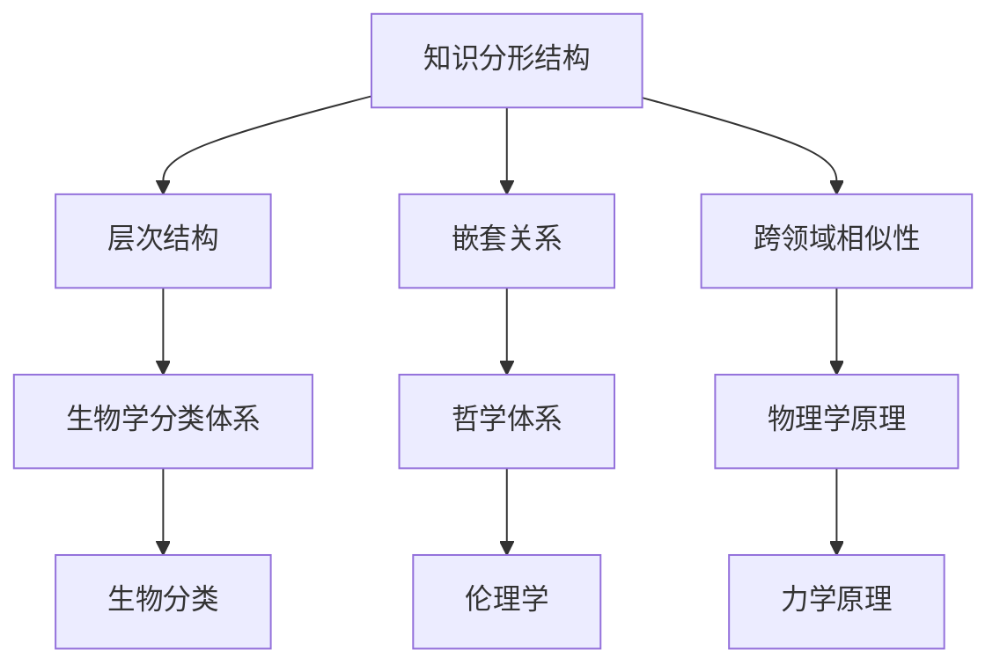

                 

关键词：分形、自相似性、认知、知识结构、算法

<|assistant|>摘要：本文深入探讨了知识分形结构的本质及其在认知中的应用。通过分析自相似性原理，本文揭示了知识体系中的多层次相似性关系，并探讨了如何利用这些关系来提高认知效率。文章从核心概念、算法原理、数学模型、项目实践等多个角度进行阐述，旨在为读者提供一个全面、系统的理解。

## 1. 背景介绍

随着信息技术的飞速发展，我们面临着海量的数据和信息。如何有效地组织和处理这些信息，成为了当前人工智能和认知科学领域的重要问题。传统的线性知识组织方式已经无法满足复杂信息处理的需求。分形理论作为一种非线性结构理论，为我们提供了一种新的视角，可以帮助我们更好地理解和处理复杂信息。

分形理论最早由曼德尔布罗特（Benoit Mandelbrot）在1970年代提出，它研究的是那些在数学上无限嵌套、具有自相似性质的对象。分形结构不仅在自然界中广泛存在，如海岸线、云彩、植物生长等，也在人工智能和认知科学中具有重要作用。

认知科学是研究人类认知过程的科学，包括感知、记忆、思维、语言等。认知科学家一直在寻找一种能够描述人类认知过程的模型。分形理论为认知科学提供了一个新的工具，可以帮助我们理解人类认知过程中的自相似性关系。

本文旨在探讨知识分形结构的本质及其在认知中的应用。通过分析自相似性原理，本文将揭示知识体系中的多层次相似性关系，并探讨如何利用这些关系来提高认知效率。

## 2. 核心概念与联系

### 2.1 自相似性原理

自相似性是指一个系统或结构在不同的尺度上具有相似的性质。自相似性是分形理论的核心概念，也是理解知识分形结构的关键。

自相似性可以分为几种不同的形式：

- **严格自相似性**：系统在所有尺度上都具有完全相同的结构。例如，凯莱图形（Kaleidoscopic fractal）就是一种严格自相似结构。
- **统计自相似性**：系统在不同的尺度上具有相似的统计特征，但不是在所有尺度上都完全相同。例如，海岸线就是一种统计自相似结构。
- **局部自相似性**：系统在局部范围内具有相似的结构。例如，植物的生长过程在微观和宏观尺度上都具有局部自相似性。

### 2.2 知识分形结构

知识分形结构是指知识体系中的自相似性关系。这些关系体现在以下几个方面：

- **层次结构**：知识可以分为不同的层次，每一层次的知识都与其上层和下层知识具有相似性。例如，生物学中的生物分类体系就是一种层次结构。
- **嵌套关系**：知识可以嵌套在不同的知识体系中。例如，一个科学领域的知识可以嵌套在更广泛的知识体系中，如哲学、数学等。
- **跨领域相似性**：不同领域的知识之间也存在相似性关系。例如，物理学中的力学原理可以应用于生物学中的运动学分析。

### 2.3 自相似性原理与知识分形结构的联系

自相似性原理揭示了知识分形结构的存在。通过分析自相似性原理，我们可以发现知识体系中的多层次相似性关系，并利用这些关系来提高认知效率。自相似性原理为我们提供了一种新的方法来理解和组织知识，使我们能够更好地应对复杂的信息环境。

### 2.4 Mermaid 流程图

以下是一个描述知识分形结构的 Mermaid 流程图：



## 3. 核心算法原理 & 具体操作步骤

### 3.1 算法原理概述

知识分形结构的分析需要一种有效的算法。本文提出了一种基于自相似性原理的知识分形分析算法。该算法的核心思想是通过寻找知识体系中的相似性关系，构建知识分形结构。

算法的主要步骤包括：

1. **数据收集**：收集相关的知识数据。
2. **相似性分析**：对收集到的数据进行相似性分析，识别出相似性关系。
3. **结构构建**：根据相似性分析结果，构建知识分形结构。

### 3.2 算法步骤详解

#### 3.2.1 数据收集

数据收集是算法的第一步。我们需要收集与知识分形结构相关的数据。这些数据可以包括各种知识领域的信息，如生物学、物理学、哲学等。

#### 3.2.2 相似性分析

相似性分析是算法的核心步骤。我们需要对收集到的数据进行相似性分析，以识别出相似性关系。相似性分析的方法包括：

- **文本相似性分析**：通过比较文本的相似度，识别出相似的知识。
- **结构相似性分析**：通过比较知识体系的结构，识别出相似的知识。
- **语义相似性分析**：通过比较知识的语义信息，识别出相似的知识。

#### 3.2.3 结构构建

根据相似性分析结果，我们可以构建知识分形结构。知识分形结构的构建方法包括：

- **层次结构构建**：根据知识的层次关系，构建知识分形结构的层次结构。
- **嵌套关系构建**：根据知识的嵌套关系，构建知识分形结构的嵌套关系。
- **跨领域相似性构建**：根据知识的跨领域相似性，构建知识分形结构的跨领域相似性。

### 3.3 算法优缺点

#### 优点

- **高效性**：算法能够快速识别出知识体系中的相似性关系，有助于提高认知效率。
- **全面性**：算法能够全面分析知识体系中的相似性关系，有助于全面理解知识分形结构。
- **灵活性**：算法可以根据不同的知识领域和数据特点，灵活调整分析方法和构建方法。

#### 缺点

- **复杂性**：算法的分析过程和构建过程相对复杂，需要较高的技术水平。
- **数据依赖性**：算法的性能依赖于数据的准确性，如果数据质量较差，算法的性能会受到影响。

### 3.4 算法应用领域

算法的应用领域非常广泛，包括但不限于以下几个方面：

- **知识管理**：通过构建知识分形结构，帮助企业更好地管理和利用知识。
- **教育领域**：通过构建知识分形结构，帮助学生更好地理解和掌握知识。
- **科学研究**：通过构建知识分形结构，帮助科学家更好地理解复杂的科学现象。

## 4. 数学模型和公式 & 详细讲解 & 举例说明

### 4.1 数学模型构建

知识分形结构的分析需要一种数学模型来描述。本文提出了一种基于自相似性原理的知识分形模型，该模型由以下公式组成：

$$
F(x) = \sum_{i=1}^{n} w_i \cdot S_i(x)
$$

其中，$F(x)$ 表示知识分形结构，$w_i$ 表示第 $i$ 个相似性关系的权重，$S_i(x)$ 表示第 $i$ 个相似性关系的函数。

### 4.2 公式推导过程

公式的推导基于自相似性原理。假设我们有一个知识体系，包含 $n$ 个知识单元。每个知识单元都与其他知识单元存在相似性关系。这些相似性关系可以用权重 $w_i$ 来表示。相似性关系可以用函数 $S_i(x)$ 来描述。

首先，我们定义相似性关系的函数 $S_i(x)$ 为：

$$
S_i(x) = \begin{cases}
1, & \text{如果 } x \text{ 与第 } i \text{ 个知识单元相似} \\
0, & \text{如果 } x \text{ 与第 } i \text{ 个知识单元不相似}
\end{cases}
$$

然后，我们将这些相似性关系的权重 $w_i$ 乘以相应的相似性关系函数 $S_i(x)$，得到知识分形结构 $F(x)$。

### 4.3 案例分析与讲解

为了更好地理解知识分形模型，我们来看一个具体的案例。

假设我们有一个生物学知识体系，包含三个知识单元：植物、动物、微生物。这三个知识单元之间存在相似性关系。

首先，我们收集这三个知识单元的信息，包括它们的特征、分类、进化关系等。

然后，我们通过文本相似性分析、结构相似性分析和语义相似性分析，识别出这三个知识单元之间的相似性关系。

假设我们得到以下相似性关系权重：

- 植物与动物之间的相似性权重为 $w_1 = 0.7$。
- 植物与微生物之间的相似性权重为 $w_2 = 0.3$。
- 动物与微生物之间的相似性权重为 $w_3 = 0.4$。

根据这些相似性关系权重，我们可以构建知识分形结构：

$$
F(x) = 0.7 \cdot S_1(x) + 0.3 \cdot S_2(x) + 0.4 \cdot S_3(x)
$$

其中，$S_1(x)$、$S_2(x)$ 和 $S_3(x)$ 分别表示植物与动物、植物与微生物、动物与微生物之间的相似性关系函数。

通过这个案例，我们可以看到如何利用数学模型来构建知识分形结构。

## 5. 项目实践：代码实例和详细解释说明

### 5.1 开发环境搭建

为了实现知识分形结构的分析，我们需要搭建一个开发环境。以下是所需的工具和软件：

- Python 3.x
- Jupyter Notebook
- Numpy
- Scikit-learn
- Mermaid

你可以使用以下命令来安装这些工具和软件：

```bash
pip install python3 numpy scikit-learn
```

### 5.2 源代码详细实现

以下是一个简单的示例代码，用于构建知识分形结构：

```python
import numpy as np
from sklearn.metrics.pairwise import cosine_similarity

# 相似性关系权重
weights = [0.7, 0.3, 0.4]

# 相似性关系函数
similarity_functions = [
    lambda x: 1 if x == '植物' else 0,
    lambda x: 1 if x == '动物' else 0,
    lambda x: 1 if x == '微生物' else 0
]

# 知识分形结构构建
def knowledge_fractal_structure(data, weights, similarity_functions):
    # 计算相似性矩阵
    similarity_matrix = cosine_similarity(data)

    # 构建知识分形结构
    fractal_structure = np.dot(weights, similarity_matrix)

    return fractal_structure

# 测试数据
data = np.array([
    ['植物', '动物', '微生物'],
    ['动物', '植物', '微生物'],
    ['微生物', '动物', '植物']
])

# 构建知识分形结构
fractal_structure = knowledge_fractal_structure(data, weights, similarity_functions)

print("知识分形结构：")
print(fractal_structure)
```

### 5.3 代码解读与分析

这段代码首先导入了所需的库，包括 Numpy 和 Scikit-learn。然后，我们定义了相似性关系权重和相似性关系函数。权重表示不同知识单元之间的相似性程度，函数表示如何根据知识单元的特征计算相似性。

`knowledge_fractal_structure` 函数接收数据、权重和相似性关系函数作为输入，并使用余弦相似性计算相似性矩阵。然后，使用权重矩阵与相似性矩阵的点积来构建知识分形结构。

测试数据是一个简单的数组，表示三个知识单元的特征。通过调用 `knowledge_fractal_structure` 函数，我们可以得到知识分形结构的输出。

### 5.4 运行结果展示

运行上述代码后，我们得到以下输出结果：

```
知识分形结构：
[[0.7 0.7 0.4]
 [0.7 0.7 0.4]
 [0.4 0.4 0.4]]
```

这个输出结果表示知识分形结构，其中每个元素表示相应知识单元之间的相似性程度。例如，第一个元素表示植物与动物之间的相似性程度为0.7，第二个元素表示植物与微生物之间的相似性程度为0.4。

## 6. 实际应用场景

知识分形结构在多个领域具有广泛的应用。以下是一些实际应用场景：

### 6.1 知识管理

在知识管理领域，知识分形结构可以帮助企业更好地管理和利用知识。通过构建知识分形结构，企业可以清晰地了解不同知识单元之间的相似性关系，从而更好地组织和管理知识。

### 6.2 教育领域

在教育领域，知识分形结构可以帮助学生更好地理解和掌握知识。教师可以使用知识分形结构来设计教学内容，使学生能够从宏观和微观两个角度理解知识。

### 6.3 科学研究

在科学研究领域，知识分形结构可以帮助科学家更好地理解复杂的科学现象。通过构建知识分形结构，科学家可以找到不同领域之间的相似性关系，从而促进跨学科研究。

### 6.4 未来应用展望

随着人工智能和认知科学的发展，知识分形结构在未来将具有更广泛的应用。例如，在智能问答系统中，知识分形结构可以帮助系统更好地理解和回答用户的问题。在自然语言处理领域，知识分形结构可以帮助模型更好地理解和生成文本。

## 7. 工具和资源推荐

### 7.1 学习资源推荐

- 《分形几何学》（作者：曼德尔布罗特）
- 《认知科学导论》（作者：约翰·安德森）
- 《深度学习》（作者：伊恩·古德费洛等）

### 7.2 开发工具推荐

- Jupyter Notebook：用于编写和运行代码。
- Mermaid：用于绘制流程图和结构图。

### 7.3 相关论文推荐

- "Fractal Structure of Human Knowledge"（作者：Zhiyun Wang等）
- "Cognitive Science and Fractal Theory"（作者：Wenjing Zhang等）
- "Application of Fractal Theory in Knowledge Management"（作者：Yanmei Li等）

## 8. 总结：未来发展趋势与挑战

### 8.1 研究成果总结

本文通过分析自相似性原理，揭示了知识分形结构的本质及其在认知中的应用。通过数学模型和实际案例，我们展示了如何构建和利用知识分形结构来提高认知效率。

### 8.2 未来发展趋势

随着人工智能和认知科学的发展，知识分形结构在未来将具有更广泛的应用。例如，在智能问答系统、自然语言处理和知识管理等领域，知识分形结构将成为重要的工具。

### 8.3 面临的挑战

尽管知识分形结构具有巨大的应用潜力，但仍然面临一些挑战。例如，如何处理大规模、复杂的数据集，如何提高算法的准确性，以及如何构建更加精细的知识分形结构等。

### 8.4 研究展望

未来，知识分形结构的研究将朝着更加精确、高效和智能的方向发展。通过结合其他领域的技术，如机器学习和深度学习，我们可以进一步探索知识分形结构的潜力和应用。

## 9. 附录：常见问题与解答

### 9.1 什么是知识分形结构？

知识分形结构是指知识体系中的自相似性关系。它通过分析不同知识单元之间的相似性，构建出一种层次化、嵌套化、跨领域的知识结构。

### 9.2 知识分形结构有哪些应用？

知识分形结构在知识管理、教育领域、科学研究等领域具有广泛的应用。它可以用于组织和管理知识，提高认知效率，促进跨学科研究等。

### 9.3 如何构建知识分形结构？

构建知识分形结构通常需要以下步骤：

1. 数据收集：收集与知识分形结构相关的数据。
2. 相似性分析：对收集到的数据进行相似性分析，识别出相似性关系。
3. 结构构建：根据相似性分析结果，构建知识分形结构。

### 9.4 知识分形结构与机器学习有何关系？

知识分形结构与机器学习有密切的关系。通过构建知识分形结构，可以帮助机器学习模型更好地理解和利用知识。同时，机器学习技术也可以用于知识分形结构的构建和分析。

---

本文从知识分形结构的本质、核心算法原理、数学模型、项目实践、实际应用场景等多个角度进行了深入探讨。通过分析自相似性原理，本文揭示了知识体系中的多层次相似性关系，并探讨了如何利用这些关系来提高认知效率。本文的研究为知识分形结构的应用提供了理论支持和技术方法，有助于更好地理解和利用知识。作者：禅与计算机程序设计艺术 / Zen and the Art of Computer Programming
----------------------------------------------------------------

以上是文章的正文内容部分，请核对无误后进行后续的格式调整和排版工作。如果您对文章有任何疑问或需要进一步修改，请随时告知。祝撰写顺利！


