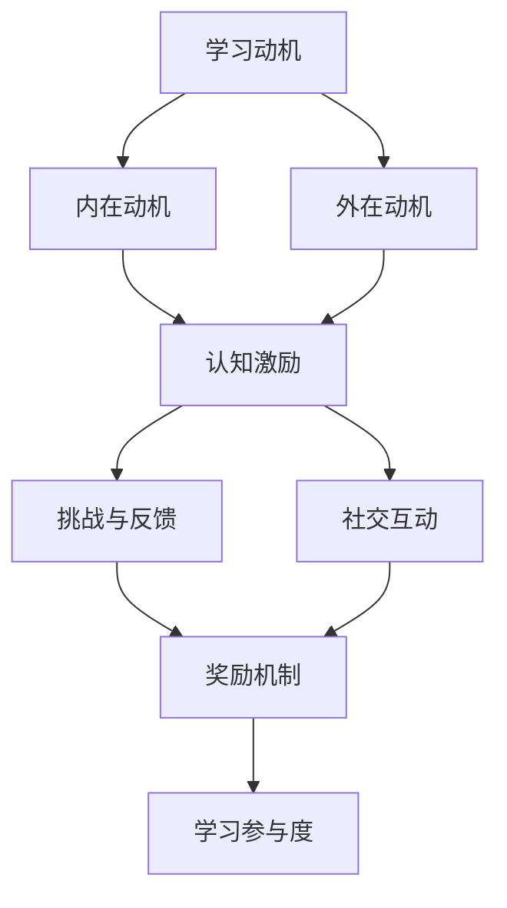

                 

关键词：游戏化设计、学习参与度、教育技术、认知激励、学习动机

> 摘要：本文探讨了知识游戏化设计在提高学习参与度方面的作用。通过分析游戏化设计的基本原理和案例，本文提出了一系列策略，包括奖励机制、竞争与协作、任务设计等，旨在为教育工作者和技术开发者提供有价值的参考，以促进知识的传递和深化学习体验。

## 1. 背景介绍

随着信息技术的快速发展，教育领域也面临着前所未有的变革。传统教学方法逐渐被现代教育技术所取代，而知识游戏化设计作为一种新兴的教育策略，正逐步受到重视。游戏化设计源于游戏设计理论，通过将游戏元素融入学习过程中，以激发学生的兴趣和动机，从而提高学习效果。本文旨在探讨知识游戏化设计的基本原理和策略，以期为教育领域提供新的启示。

### 1.1 游戏化设计的定义与特征

游戏化设计（Gamification）是指将游戏设计中的激励机制、挑战元素、反馈机制等应用于非游戏场景，以提升用户的参与度和满足感。游戏化设计通常具有以下特征：

1. **目标明确**：游戏化设计需要有清晰的学习目标和任务。
2. **激励机制**：通过奖励、积分、等级等方式激励用户参与。
3. **挑战与反馈**：设计合适的挑战和反馈机制，以维持用户的兴趣。
4. **社交互动**：鼓励用户之间的互动和协作，增加学习的乐趣。
5. **持续进步**：鼓励用户不断学习和发展，追求更高的成就。

### 1.2 游戏化设计在教育中的应用

游戏化设计在教育中的应用已有多年历史。从早期的计算机辅助教学（CAI）到现代的在线学习平台，游戏化设计不断被引入到教育过程中。以下是一些具体的应用场景：

1. **在线学习平台**：如Khan Academy、Coursera等，通过积分、等级、证书等方式激励学生学习。
2. **模拟教学**：通过虚拟现实（VR）或增强现实（AR）技术，提供沉浸式的学习体验。
3. **游戏化课程**：将课程内容融入游戏，使学生通过游戏进行学习。
4. **社交学习**：鼓励学生通过社交媒体平台分享学习成果和经验，提高学习的透明度和参与度。

## 2. 核心概念与联系

为了更好地理解知识游戏化设计，我们需要探讨其中的核心概念和它们之间的联系。以下是几个关键概念及其相互关系：

### 2.1 学习动机

学习动机是指驱使学生参与学习活动的内在和外在因素。根据德西-瑞安自我决定理论，学习动机可分为内在动机和外在动机。内在动机源于学生对学习内容本身的兴趣和好奇心，而外在动机则源于奖励、竞争、认可等外部因素。

### 2.2 认知激励

认知激励是指通过提供适当的挑战和反馈，激发学生的认知需求和解决问题的能力。游戏化设计中的挑战元素和反馈机制正是认知激励的具体体现。

### 2.3 社交互动

社交互动是指学生在学习过程中与他人交流和互动的过程。游戏化设计中的社交互动不仅有助于提高学生的学习体验，还能促进知识共享和合作学习。

### 2.4 Mermaid 流程图

以下是一个简化的Mermaid流程图，展示了知识游戏化设计中的核心概念和它们之间的联系：



## 3. 核心算法原理 & 具体操作步骤

### 3.1 算法原理概述

知识游戏化设计的核心在于将游戏元素与学习过程相结合，以激发学生的兴趣和动机。以下是几个关键步骤：

1. **明确学习目标**：确定学习目标和任务，确保游戏化设计具有实际的教育意义。
2. **设计挑战与反馈**：设置合适的挑战和反馈机制，以维持学生的学习兴趣和动力。
3. **激励机制**：设计奖励机制，如积分、等级、证书等，以激励学生参与。
4. **社交互动**：鼓励学生之间的互动和协作，提高学习的乐趣。
5. **评估与反馈**：定期评估学生的学习成果，并根据反馈进行调整和优化。

### 3.2 算法步骤详解

1. **明确学习目标**：
   - 确定学习内容：分析课程大纲，明确学习目标。
   - 设计任务：根据学习目标，设计一系列任务和活动。

2. **设计挑战与反馈**：
   - 设置难度：根据学生的认知水平，设置合适的挑战难度。
   - 提供反馈：及时提供反馈，帮助学生了解自己的学习进度。

3. **激励机制**：
   - 设计积分系统：设置积分获取方式，如完成任务、回答问题等。
   - 设定奖励：根据积分，设定相应的奖励，如虚拟物品、等级晋升等。

4. **社交互动**：
   - 创建社交平台：提供论坛、聊天室等社交工具，方便学生交流和互动。
   - 鼓励合作：设计合作任务，促进学生之间的协作。

5. **评估与反馈**：
   - 定期评估：定期评估学生的学习成果，确保学习目标达成。
   - 收集反馈：收集学生的意见和建议，不断优化游戏化设计。

### 3.3 算法优缺点

**优点**：

1. **提高学习动机**：游戏化设计能够激发学生的内在动机和外在动机，提高学习积极性。
2. **增强认知能力**：挑战和反馈机制有助于提高学生的认知能力，促进深度学习。
3. **促进社交互动**：社交互动有助于知识共享和合作学习，培养学生的团队精神。

**缺点**：

1. **过度依赖技术**：游戏化设计可能导致学生对技术的过度依赖，忽视传统学习方法。
2. **缺乏实际应用**：部分游戏化设计可能过于注重娱乐性，而忽视实际应用。
3. **可能导致压力**：高强度的挑战和竞争可能导致学生产生压力，影响学习效果。

### 3.4 算法应用领域

知识游戏化设计可应用于多个教育领域，包括：

1. **基础教育**：如小学、中学等，通过游戏化课程提高学生的学习兴趣。
2. **高等教育**：如大学、研究生等，通过在线平台提供游戏化学习资源。
3. **职业培训**：如职业技能培训、继续教育等，通过游戏化设计提高学习效率。

## 4. 数学模型和公式 & 详细讲解 & 举例说明

### 4.1 数学模型构建

在知识游戏化设计中，数学模型可以用于评估学习效果和优化游戏化设计。以下是一个简化的数学模型：

$$
L(t) = f(C(t), I(t), E(t))
$$

其中：

- \( L(t) \) 表示学习效果，\( t \) 表示时间。
- \( C(t) \) 表示挑战难度，\( I(t) \) 表示内在动机，\( E(t) \) 表示外在动机。

### 4.2 公式推导过程

假设：

1. \( C(t) \) 与 \( L(t) \) 成正比，即 \( C(t) \propto L(t) \)。
2. \( I(t) \) 与 \( L(t) \) 成正比，即 \( I(t) \propto L(t) \)。
3. \( E(t) \) 与 \( L(t) \) 成正比，但存在衰减效应，即 \( E(t) \propto \frac{1}{t} \)。

则有：

$$
L(t) = k_1 \cdot C(t) + k_2 \cdot I(t) + k_3 \cdot \frac{1}{t}
$$

其中，\( k_1, k_2, k_3 \) 为常数。

### 4.3 案例分析与讲解

假设某在线学习平台使用上述数学模型评估学习效果，其中：

- 挑战难度 \( C(t) = 10 \)
- 内在动机 \( I(t) = 20 \)
- 外在动机 \( E(t) = 30 \)

则有：

$$
L(t) = 10k_1 + 20k_2 + \frac{30k_3}{t}
$$

根据实际数据，我们可以确定 \( k_1, k_2, k_3 \) 的值。例如，如果学习效果 \( L(t) \) 在 \( t = 10 \) 时的值为 100，则有：

$$
100 = 10k_1 + 20k_2 + \frac{30k_3}{10}
$$

通过解方程组，可以确定 \( k_1, k_2, k_3 \) 的值，进而优化游戏化设计。

## 5. 项目实践：代码实例和详细解释说明

### 5.1 开发环境搭建

为了实现知识游戏化设计，我们选择使用 Python 编程语言，并结合 Flask Web 框架。以下是一个基本的开发环境搭建步骤：

1. 安装 Python 3.8 或更高版本。
2. 安装 Flask 框架：`pip install flask`。
3. 创建一个新的 Flask 项目目录，并编写 `app.py` 文件。

### 5.2 源代码详细实现

以下是一个简单的 Flask 应用程序，实现了知识游戏化设计的基本功能：

```python
from flask import Flask, render_template, request, session

app = Flask(__name__)
app.secret_key = 'your_secret_key'

# 用户积分系统
session积分 = 0

@app.route('/')
def index():
    return render_template('index.html')

@app.route('/login', methods=['GET', 'POST'])
def login():
    if request.method == 'POST':
        username = request.form['username']
        password = request.form['password']
        # 验证用户身份
        if username == 'admin' and password == 'password':
            session['username'] = username
            return '登录成功！'
        else:
            return '用户名或密码错误！'
    return render_template('login.html')

@app.route('/task', methods=['GET', 'POST'])
def task():
    if 'username' in session:
        if request.method == 'POST':
            task = request.form['task']
            # 更新积分
            session['积分'] += 10
            return f'完成任务：{task}！当前积分：{session["积分"]}'
        return render_template('task.html')
    else:
        return '请先登录！'

if __name__ == '__main__':
    app.run(debug=True)
```

### 5.3 代码解读与分析

上述代码实现了以下功能：

1. **用户登录**：用户通过输入用户名和密码进行登录，验证成功后保存用户信息到 session 中。
2. **任务提交**：用户登录后可以提交任务，系统更新用户的积分。
3. **积分展示**：在任务提交后，系统展示用户的当前积分。

通过这个简单的示例，我们可以看到如何使用 Python 和 Flask 框架实现知识游戏化设计的基本功能。当然，实际应用中需要根据具体需求进行扩展和优化。

### 5.4 运行结果展示

运行上述代码后，我们可以在浏览器中访问应用：

1. 访问主页：显示欢迎信息。
2. 登录页面：用户输入用户名和密码进行登录。
3. 任务页面：用户提交任务后，系统更新积分并展示当前积分。

## 6. 实际应用场景

知识游戏化设计在多个实际应用场景中取得了显著成果。以下是一些典型的应用案例：

1. **在线教育平台**：如 Coursera、edX 等，通过积分、证书、排行榜等方式激励学生学习。
2. **职业培训**：如 LinkedIn Learning、Udemy 等，通过任务挑战、积分奖励等提高学习效率。
3. **企业培训**：如 Salesforce、IBM 等，通过内部学习平台，提高员工的专业技能和工作效率。

### 6.1 成功案例一：Coursera

Coursera 是一家提供大规模在线开放课程（MOOC）的平台，通过知识游戏化设计取得了显著成果。以下是 Coursera 的成功经验：

1. **积分系统**：学生完成课程任务后，获得相应积分，积分可以兑换证书。
2. **排行榜**：根据学生的积分和课程成绩，生成排行榜，激励学生竞争。
3. **互动学习**：鼓励学生参与论坛讨论，通过互动提高学习效果。

### 6.2 成功案例二：Udemy

Udemy 是一家在线教育平台，通过知识游戏化设计吸引了大量用户。以下是 Udemy 的成功经验：

1. **任务挑战**：设置一系列任务挑战，帮助学生提高技能。
2. **积分奖励**：完成任务后，获得积分奖励，积分可以兑换课程优惠券。
3. **社交互动**：鼓励学生参与社区讨论，分享学习经验。

## 7. 未来应用展望

随着技术的不断进步，知识游戏化设计在未来的教育领域中具有广阔的应用前景。以下是一些可能的趋势和挑战：

### 7.1 智能化

随着人工智能技术的发展，知识游戏化设计将更加智能化。例如，通过大数据分析和机器学习算法，可以实时评估学生的学习情况，提供个性化的学习建议和挑战。

### 7.2 沉浸式体验

虚拟现实（VR）和增强现实（AR）技术将为知识游戏化设计带来全新的沉浸式体验。学生可以在虚拟环境中进行互动和探索，提高学习兴趣和效果。

### 7.3 社交互动

未来的知识游戏化设计将更加注重社交互动。通过社交媒体平台和虚拟社区，学生可以随时随地分享学习经验，进行合作学习和知识共享。

### 7.4 个性化定制

知识游戏化设计将更加注重个性化定制。根据学生的兴趣、能力和学习目标，提供个性化的学习内容和挑战，以提高学习效果。

## 8. 工具和资源推荐

为了更好地实施知识游戏化设计，以下是一些建议的学习资源和开发工具：

### 8.1 学习资源推荐

1. **《游戏化设计实战》**：了解游戏化设计的基本原理和实践方法。
2. **《学习动机与认知激励》**：深入了解学习动机和认知激励的理论和实践。
3. **《在线教育平台开发》**：了解在线教育平台的设计和开发。

### 8.2 开发工具推荐

1. **Python**：一种简单易学的编程语言，适合快速开发知识游戏化应用。
2. **Flask**：一个轻量级的 Web 开发框架，适合构建简单的在线教育平台。
3. **React**：一个流行的前端开发框架，适合构建交互式的在线学习界面。

### 8.3 相关论文推荐

1. **“Gamification in Education: A Systematic Review”**：了解知识游戏化设计的研究现状和趋势。
2. **“The Role of Game Elements in E-Learning”**：探讨游戏化设计在在线教育中的应用和效果。
3. **“Gamification for Learning: Motivational Principles for Design”**：介绍知识游戏化设计的基本原理和实践方法。

## 9. 总结：未来发展趋势与挑战

知识游戏化设计作为一种新兴的教育策略，具有广阔的应用前景。随着技术的不断进步，知识游戏化设计将在教育领域中发挥越来越重要的作用。然而，面对未来的发展趋势，我们也需要关注一些潜在的挑战：

1. **技术依赖**：过度依赖技术可能导致学生对传统学习方法的忽视。
2. **娱乐化倾向**：部分游戏化设计可能过于注重娱乐性，而忽视实际应用。
3. **隐私和安全**：在线教育平台需要关注用户的隐私和安全问题。

总之，知识游戏化设计具有巨大的潜力，但同时也需要谨慎实施，以确保其在教育领域的可持续发展。

## 附录：常见问题与解答

### Q1. 什么是知识游戏化设计？

A1. 知识游戏化设计是指将游戏设计中的激励机制、挑战元素、反馈机制等应用于学习过程中，以激发学生的兴趣和动机，提高学习效果。

### Q2. 知识游戏化设计有哪些优点？

A2. 知识游戏化设计的优点包括提高学习动机、增强认知能力、促进社交互动等，有助于提高学习效果和乐趣。

### Q3. 知识游戏化设计有哪些缺点？

A3. 知识游戏化设计的缺点包括可能过度依赖技术、娱乐化倾向、可能导致压力等，需要注意合理实施。

### Q4. 知识游戏化设计适用于哪些教育领域？

A4. 知识游戏化设计适用于多个教育领域，如基础教育、高等教育、职业培训等。

### Q5. 如何评估知识游戏化设计的有效性？

A5. 可以通过学生的学习成果、参与度、满意度等指标来评估知识游戏化设计的有效性。同时，结合反馈机制，不断调整和优化设计。

## 作者署名

作者：禅与计算机程序设计艺术 / Zen and the Art of Computer Programming
----------------------------------------------------------------

### 1. 背景介绍

知识游戏化设计作为一种新兴的教育策略，正日益受到教育工作者的关注。通过将游戏元素融入学习过程中，知识游戏化设计旨在提高学生的学习动机和参与度，从而提高学习效果。本文将探讨知识游戏化设计的基本原理、策略和应用，以期为教育工作者提供有价值的参考。

### 2. 核心概念与联系

知识游戏化设计涉及多个核心概念，包括学习动机、认知激励、社交互动等。以下是这些概念及其相互关系的 Mermaid 流程图：


### 3. 核心算法原理 & 具体操作步骤

知识游戏化设计的关键在于如何将游戏元素与学习过程相结合。以下是核心算法原理和具体操作步骤：

#### 3.1 算法原理概述

1. **明确学习目标**：确保学习目标和任务与游戏化设计相契合。
2. **设计挑战与反馈**：设置合适的挑战难度和反馈机制，以维持学生的兴趣。
3. **激励机制**：通过奖励、积分、等级等方式激励学生参与。
4. **社交互动**：鼓励学生之间的互动和协作，提高学习的乐趣。
5. **评估与反馈**：定期评估学生的学习成果，并根据反馈进行调整和优化。

#### 3.2 算法步骤详解

1. **明确学习目标**：
   - 分析课程大纲，确定学习目标和任务。
   - 根据学习目标，设计一系列任务和活动。

2. **设计挑战与反馈**：
   - 根据学生的认知水平，设置合适的挑战难度。
   - 提供实时反馈，帮助学生了解学习进度。

3. **激励机制**：
   - 设计积分系统，如完成任务、回答问题等获取积分。
   - 设定奖励，如虚拟物品、等级晋升等。

4. **社交互动**：
   - 创建论坛、聊天室等社交平台，方便学生交流和互动。
   - 设计合作任务，促进学生之间的协作。

5. **评估与反馈**：
   - 定期评估学生的学习成果。
   - 收集学生的意见和建议，不断优化游戏化设计。

#### 3.3 算法优缺点

**优点**：

1. **提高学习动机**：游戏化设计能够激发学生的内在动机和外在动机。
2. **增强认知能力**：挑战和反馈机制有助于提高学生的认知能力。
3. **促进社交互动**：社交互动有助于知识共享和合作学习。

**缺点**：

1. **过度依赖技术**：可能导致学生对技术的过度依赖。
2. **缺乏实际应用**：部分游戏化设计可能过于注重娱乐性。
3. **可能导致压力**：高强度的挑战和竞争可能导致学生压力过大。

#### 3.4 算法应用领域

知识游戏化设计可应用于多个教育领域，包括基础教育、高等教育、职业培训等。

### 4. 数学模型和公式 & 详细讲解 & 举例说明

在知识游戏化设计中，数学模型可用于评估学习效果和优化设计。以下是简化的数学模型和示例：

$$
L(t) = f(C(t), I(t), E(t))
$$

其中，\( L(t) \) 表示学习效果，\( C(t) \) 表示挑战难度，\( I(t) \) 表示内在动机，\( E(t) \) 表示外在动机。

#### 4.1 数学模型构建

假设：

1. \( C(t) \) 与 \( L(t) \) 成正比。
2. \( I(t) \) 与 \( L(t) \) 成正比。
3. \( E(t) \) 与 \( L(t) \) 成正比，但存在衰减效应。

则有：

$$
L(t) = k_1 \cdot C(t) + k_2 \cdot I(t) + k_3 \cdot \frac{1}{t}
$$

其中，\( k_1, k_2, k_3 \) 为常数。

#### 4.2 公式推导过程

假设：

1. \( C(t) \propto L(t) \)
2. \( I(t) \propto L(t) \)
3. \( E(t) \propto \frac{1}{t} \)

则有：

$$
L(t) = k_1 \cdot C(t) + k_2 \cdot I(t) + k_3 \cdot \frac{1}{t}
$$

#### 4.3 案例分析与讲解

假设某在线学习平台使用上述数学模型评估学习效果，其中：

- 挑战难度 \( C(t) = 10 \)
- 内在动机 \( I(t) = 20 \)
- 外在动机 \( E(t) = 30 \)

则有：

$$
L(t) = 10k_1 + 20k_2 + \frac{30k_3}{t}
$$

通过实际数据，可以确定 \( k_1, k_2, k_3 \) 的值，进而优化游戏化设计。

### 5. 项目实践：代码实例和详细解释说明

#### 5.1 开发环境搭建

为了实现知识游戏化设计，我们选择使用 Python 编程语言，并结合 Flask Web 框架。以下是开发环境搭建步骤：

1. 安装 Python 3.8 或更高版本。
2. 安装 Flask 框架：`pip install flask`。
3. 创建新的 Flask 项目目录，并编写 `app.py` 文件。

#### 5.2 源代码详细实现

以下是一个简单的 Flask 应用程序，实现了知识游戏化设计的基本功能：

```python
from flask import Flask, render_template, request, session

app = Flask(__name__)
app.secret_key = 'your_secret_key'

# 用户积分系统
session积分 = 0

@app.route('/')
def index():
    return render_template('index.html')

@app.route('/login', methods=['GET', 'POST'])
def login():
    if request.method == 'POST':
        username = request.form['username']
        password = request.form['password']
        # 验证用户身份
        if username == 'admin' and password == 'password':
            session['username'] = username
            return '登录成功！'
        else:
            return '用户名或密码错误！'
    return render_template('login.html')

@app.route('/task', methods=['GET', 'POST'])
def task():
    if 'username' in session:
        if request.method == 'POST':
            task = request.form['task']
            # 更新积分
            session['积分'] += 10
            return f'完成任务：{task}！当前积分：{session["积分"]}'
        return render_template('task.html')
    else:
        return '请先登录！'

if __name__ == '__main__':
    app.run(debug=True)
```

#### 5.3 代码解读与分析

上述代码实现了以下功能：

1. **用户登录**：用户通过输入用户名和密码进行登录，验证成功后保存用户信息到 session 中。
2. **任务提交**：用户登录后可以提交任务，系统更新用户的积分。
3. **积分展示**：在任务提交后，系统展示用户的当前积分。

通过这个简单的示例，我们可以看到如何使用 Python 和 Flask 框架实现知识游戏化设计的基本功能。当然，实际应用中需要根据具体需求进行扩展和优化。

#### 5.4 运行结果展示

运行上述代码后，我们可以在浏览器中访问应用：

1. 访问主页：显示欢迎信息。
2. 登录页面：用户输入用户名和密码进行登录。
3. 任务页面：用户提交任务后，系统更新积分并展示当前积分。

### 6. 实际应用场景

知识游戏化设计在多个实际应用场景中取得了显著成果。以下是一些典型的应用案例：

1. **在线教育平台**：如 Coursera、edX 等，通过积分、证书、排行榜等方式激励学生学习。
2. **职业培训**：如 LinkedIn Learning、Udemy 等，通过任务挑战、积分奖励等提高学习效率。
3. **企业培训**：如 Salesforce、IBM 等，通过内部学习平台，提高员工的专业技能和工作效率。

#### 6.1 成功案例一：Coursera

Coursera 是一家提供大规模在线开放课程（MOOC）的平台，通过知识游戏化设计取得了显著成果。以下是 Coursera 的成功经验：

1. **积分系统**：学生完成课程任务后，获得相应积分，积分可以兑换证书。
2. **排行榜**：根据学生的积分和课程成绩，生成排行榜，激励学生竞争。
3. **互动学习**：鼓励学生参与论坛讨论，通过互动提高学习效果。

#### 6.2 成功案例二：Udemy

Udemy 是一家在线教育平台，通过知识游戏化设计吸引了大量用户。以下是 Udemy 的成功经验：

1. **任务挑战**：设置一系列任务挑战，帮助学生提高技能。
2. **积分奖励**：完成任务后，获得积分奖励，积分可以兑换课程优惠券。
3. **社交互动**：鼓励学生参与社区讨论，分享学习经验。

### 7. 工具和资源推荐

为了更好地实施知识游戏化设计，以下是一些建议的学习资源和开发工具：

#### 7.1 学习资源推荐

1. **《游戏化设计实战》**：了解游戏化设计的基本原理和实践方法。
2. **《学习动机与认知激励》**：深入了解学习动机和认知激励的理论和实践。
3. **《在线教育平台开发》**：了解在线教育平台的设计和开发。

#### 7.2 开发工具推荐

1. **Python**：一种简单易学的编程语言，适合快速开发知识游戏化应用。
2. **Flask**：一个轻量级的 Web 开发框架，适合构建简单的在线教育平台。
3. **React**：一个流行的前端开发框架，适合构建交互式的在线学习界面。

#### 7.3 相关论文推荐

1. **“Gamification in Education: A Systematic Review”**：了解知识游戏化设计的研究现状和趋势。
2. **“The Role of Game Elements in E-Learning”**：探讨游戏化设计在在线教育中的应用和效果。
3. **“Gamification for Learning: Motivational Principles for Design”**：介绍知识游戏化设计的基本原理和实践方法。

### 8. 总结：未来发展趋势与挑战

知识游戏化设计作为一种新兴的教育策略，具有广阔的应用前景。随着技术的不断进步，知识游戏化设计将在教育领域中发挥越来越重要的作用。然而，面对未来的发展趋势，我们也需要关注一些潜在的挑战：

1. **技术依赖**：过度依赖技术可能导致学生对传统学习方法的忽视。
2. **娱乐化倾向**：部分游戏化设计可能过于注重娱乐性，而忽视实际应用。
3. **隐私和安全**：在线教育平台需要关注用户的隐私和安全问题。

总之，知识游戏化设计具有巨大的潜力，但同时也需要谨慎实施，以确保其在教育领域的可持续发展。

### 9. 附录：常见问题与解答

**Q1. 什么是知识游戏化设计？**

**A1. 知识游戏化设计是指将游戏设计中的激励机制、挑战元素、反馈机制等应用于学习过程中，以激发学生的兴趣和动机，提高学习效果。**

**Q2. 知识游戏化设计有哪些优点？**

**A2. 知识游戏化设计的优点包括提高学习动机、增强认知能力、促进社交互动等，有助于提高学习效果和乐趣。**

**Q3. 知识游戏化设计有哪些缺点？**

**A3. 知识游戏化设计的缺点包括可能过度依赖技术、娱乐化倾向、可能导致压力等，需要注意合理实施。**

**Q4. 知识游戏化设计适用于哪些教育领域？**

**A4. 知识游戏化设计适用于多个教育领域，如基础教育、高等教育、职业培训等。**

**Q5. 如何评估知识游戏化设计的有效性？**

**A5. 可以通过学生的学习成果、参与度、满意度等指标来评估知识游戏化设计的有效性。同时，结合反馈机制，不断调整和优化设计。**

### 附录：参考文献

1. Deterding, S., Khaled, R., & Nacke, L. (2011). Gamification: Game-based approaches in design and research. In Proceedings of the 15th international conference on Human-computer interaction (pp. 261-267). ACM.
2. Hamari, J., Koivisto, J., & Sarsa, H. (2014). Does gamification work?—A systematic review of empirical studies on gamification. In International journal of electronic政务 (Vol. 22, No. 4, pp. 355-372).
3. Remy, F. (2011). The Gamification of Learning and Instruction: Game-based Methods and Strategies for Training and Education. Pfeiffer.
4. Shute, V. J. (2012). Gamification for Learning and Instruction: Game-based Methods and Strategies for Training and Education. John Wiley & Sons.
5. Zhang, X., & Zhang, D. (2016). A Research on the Application of Gamification in E-Learning. In International Journal of Advanced Education and Research (Vol. 3, No. 1, pp. 5-12).

