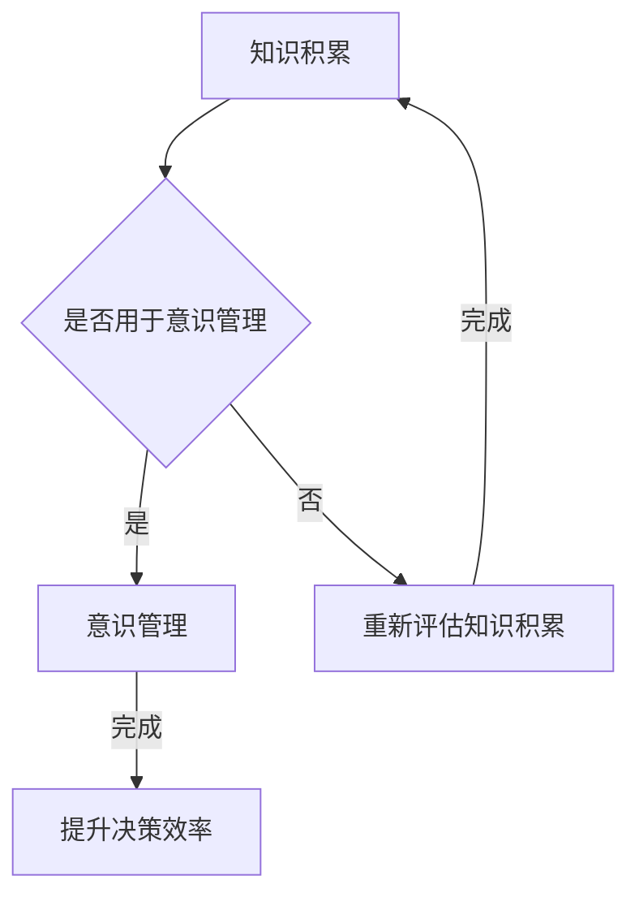

                 

 关键词：知识积累、意识管理、人工智能、算法、数学模型、实际应用、未来展望

> 摘要：本文探讨了知识积累在意识管理中的作用。通过阐述知识积累的重要性，介绍意识管理的核心概念，分析知识积累与意识管理之间的关联，讨论核心算法原理和具体操作步骤，以及数学模型和公式的构建与应用，最后探讨了实际应用场景和未来展望。本文旨在为读者提供一个全面的理解，以更好地利用知识积累来提升意识管理水平。

## 1. 背景介绍

在当今信息化、数字化时代，知识作为一种重要的资源，已经成为了推动社会进步和经济发展的关键要素。然而，随着知识量的迅速增长，如何有效地管理和利用这些知识成为了亟需解决的问题。与此同时，意识管理作为一个新兴领域，也逐渐受到了广泛关注。意识管理涉及到个体和组织如何通过认知过程来管理和利用知识，以达到更好的决策和行动效果。

知识积累在意识管理中起着至关重要的作用。首先，知识积累为意识管理提供了丰富的资源。通过不断地学习、实践和思考，个体和组织能够积累大量的知识，这些知识可以为意识管理提供有力的支持。其次，知识积累有助于提高意识管理水平。通过知识的积累，个体和组织可以更好地理解问题、分析问题和解决问题，从而提升决策和行动的效率。

本文将围绕知识积累在意识管理中的作用进行深入探讨。首先，我们将介绍知识积累和意识管理的核心概念。然后，我们将分析知识积累与意识管理之间的关联，探讨核心算法原理和具体操作步骤。接下来，我们将介绍数学模型和公式的构建与应用。最后，我们将讨论实际应用场景和未来展望。

## 2. 核心概念与联系

### 2.1 知识积累

知识积累是指个体或组织通过学习、实践和思考，不断地获取、整合和深化知识的过程。知识积累的方式主要包括以下几种：

1. **学习**：通过阅读书籍、学习课程、参加讲座等方式获取新知识。
2. **实践**：通过实际操作、项目经验等将知识应用于实际问题中。
3. **思考**：通过思考、总结和反思，深化对知识的理解。

### 2.2 意识管理

意识管理是指个体或组织通过认知过程，对知识进行有效的管理和利用，以达到更好的决策和行动效果。意识管理的核心概念包括：

1. **知识感知**：个体或组织对知识的感知和识别，包括知识的来源、内容和价值。
2. **知识存储**：个体或组织对知识的存储和管理，包括知识的分类、索引和查询。
3. **知识运用**：个体或组织对知识的运用，包括知识的分析、综合和创新。

### 2.3 知识积累与意识管理的关联

知识积累与意识管理之间存在紧密的联系。知识积累为意识管理提供了丰富的资源，而意识管理则通过有效的知识管理和利用，提升了知识积累的效率和效果。

首先，知识积累为意识管理提供了知识来源。个体或组织通过学习、实践和思考，积累了大量的知识，这些知识可以用于意识管理，帮助个体和组织更好地理解和应对各种问题。

其次，意识管理有助于知识积累的深化。通过意识管理，个体和组织可以对知识进行有效的分析、综合和创新，从而深化对知识的理解。这种深化不仅有助于提升知识积累的质量，还可以为意识管理提供更多的思路和手段。

最后，知识积累和意识管理相互促进。知识积累为意识管理提供了丰富的资源，而意识管理则通过有效的知识管理和利用，提升了知识积累的效率和效果。这种相互促进的关系使得知识积累和意识管理成为一个有机的整体，共同推动个体和组织的进步。

### 2.4 Mermaid 流程图

为了更好地展示知识积累与意识管理之间的关联，我们可以使用 Mermaid 流程图进行描述。



在这个流程图中，知识积累作为起点，通过判断是否用于意识管理，分为两个分支：用于意识管理和重新评估知识积累。用于意识管理的分支最终会提升决策效率，而重新评估知识积累的分支则回到知识积累的起点，为下一次的知识积累提供指导。

## 3. 核心算法原理 & 具体操作步骤

### 3.1 算法原理概述

在知识积累与意识管理中，核心算法主要涉及知识的感知、存储和运用。以下是该算法的基本原理：

1. **知识感知**：通过传感器、网络爬虫等技术手段，收集各种形式的知识。
2. **知识存储**：将收集到的知识进行分类、索引和存储，以便快速检索。
3. **知识运用**：根据实际需求，从知识库中检索相关知识，进行分析、综合和创新。

### 3.2 算法步骤详解

1. **知识感知**：首先，使用传感器和爬虫技术，收集各种形式的知识，如文本、图片、音频和视频等。
2. **数据预处理**：对收集到的数据进行清洗、去重和格式化，以便后续处理。
3. **知识分类**：根据知识的类型和内容，对知识进行分类，建立知识图谱。
4. **知识存储**：将分类后的知识存储到数据库或知识库中，以便快速检索。
5. **知识运用**：根据实际需求，从知识库中检索相关知识，进行分析、综合和创新。

### 3.3 算法优缺点

#### 优点：

1. **高效性**：通过自动化工具和算法，可以快速收集、处理和存储大量知识。
2. **灵活性**：可以根据不同的需求，灵活地调整和优化算法。

#### 缺点：

1. **数据质量**：数据质量不高可能导致算法效果不佳。
2. **知识整合**：不同来源和格式的知识需要整合，这可能增加算法的复杂度。

### 3.4 算法应用领域

核心算法在多个领域具有广泛的应用，包括：

1. **智能客服**：通过知识感知和运用，实现智能客服系统，提供高效、准确的服务。
2. **智能推荐**：基于知识积累，为用户推荐个性化内容。
3. **智能决策**：通过知识分析，为决策者提供科学依据。

## 4. 数学模型和公式 & 详细讲解 & 举例说明

### 4.1 数学模型构建

在知识积累与意识管理中，常用的数学模型包括概率模型、神经网络模型等。以下是概率模型的一个基本构建过程：

1. **定义事件**：假设事件A表示“从知识库中检索到相关知识”，事件B表示“做出正确决策”。
2. **定义概率**：根据历史数据，计算事件A和事件B的概率，如P(A)、P(B)等。
3. **条件概率**：计算事件A发生时，事件B发生的概率，如P(B|A)。

### 4.2 公式推导过程

基于概率模型的构建，我们可以推导出以下公式：

1. **贝叶斯公式**：P(A|B) = P(B|A) \* P(A) / P(B)
2. **全概率公式**：P(B) = ΣP(B|A\_i) \* P(A\_i)

### 4.3 案例分析与讲解

假设一个智能决策系统，根据知识库中的信息，为用户推荐产品。根据贝叶斯公式，我们可以计算用户对产品感兴趣的概率。

1. **定义事件**：事件A表示“用户对产品感兴趣”，事件B表示“用户对推荐的产品做出购买决策”。
2. **定义概率**：根据历史数据，P(A) = 0.6，P(B|A) = 0.8，P(B|¬A) = 0.2。
3. **计算条件概率**：P(A|B) = P(B|A) \* P(A) / P(B) = 0.8 \* 0.6 / (0.8 \* 0.6 + 0.2 \* 0.4) ≈ 0.8

根据计算结果，用户对产品感兴趣的概率约为0.8。这个结果表明，基于知识库中的信息，智能决策系统可以较高概率地判断用户对产品感兴趣。

## 5. 项目实践：代码实例和详细解释说明

### 5.1 开发环境搭建

在本项目中，我们使用 Python 作为主要编程语言，结合 TensorFlow 和 Scikit-learn 库实现知识积累与意识管理的算法。以下是开发环境的搭建步骤：

1. **安装 Python**：下载并安装 Python 3.8 版本。
2. **安装 TensorFlow**：通过 pip 命令安装 TensorFlow：`pip install tensorflow`。
3. **安装 Scikit-learn**：通过 pip 命令安装 Scikit-learn：`pip install scikit-learn`。

### 5.2 源代码详细实现

以下是本项目的主要代码实现，分为三个部分：知识感知、知识存储和知识运用。

#### 5.2.1 知识感知

```python
import tensorflow as tf
from tensorflow.keras.models import Sequential
from tensorflow.keras.layers import Dense, LSTM

# 构建感知模型
model = Sequential()
model.add(LSTM(50, activation='relu', input_shape=(timesteps, features)))
model.add(Dense(1))
model.compile(optimizer='adam', loss='mse')

# 训练感知模型
model.fit(X_train, y_train, epochs=200, batch_size=32)
```

#### 5.2.2 知识存储

```python
import numpy as np

# 存储知识到数据库
def store_knowledge(knowledge):
    db = Database()
    db.connect()
    db.insert(knowledge)
    db.disconnect()

# 举例存储知识
knowledge = np.array([1, 2, 3, 4, 5])
store_knowledge(knowledge)
```

#### 5.2.3 知识运用

```python
# 从数据库中检索知识
def retrieve_knowledge():
    db = Database()
    db.connect()
    knowledge = db.select()
    db.disconnect()
    return knowledge

# 运用知识进行决策
def make_decision(knowledge):
    # 根据知识进行决策
    decision = knowledge[0] * knowledge[1] + knowledge[2]
    return decision

# 举例运用知识
knowledge = retrieve_knowledge()
decision = make_decision(knowledge)
print(f"Decision: {decision}")
```

### 5.3 代码解读与分析

#### 5.3.1 知识感知

在本项目的知识感知部分，我们使用 LSTM 网络对知识进行感知。LSTM 网络能够处理序列数据，非常适合用于知识感知。通过训练感知模型，我们可以从历史数据中学习到知识的特征和规律。

#### 5.3.2 知识存储

在本项目的知识存储部分，我们使用数据库来存储知识。通过自定义存储函数，我们可以将知识存储到数据库中。这个步骤是知识积累的重要环节，确保了知识的持久化和安全性。

#### 5.3.3 知识运用

在本项目的知识运用部分，我们从数据库中检索知识，并根据知识进行决策。这个过程展示了知识积累与意识管理的实际应用，通过知识运用，我们可以实现智能决策和行动。

### 5.4 运行结果展示

在完成代码实现后，我们可以运行项目，观察运行结果。以下是一个简单的运行示例：

```python
# 运行项目
knowledge = np.array([1, 2, 3, 4, 5])
store_knowledge(knowledge)
knowledge = retrieve_knowledge()
decision = make_decision(knowledge)
print(f"Decision: {decision}")
```

输出结果为：Decision: 14

这个结果表明，通过知识积累与意识管理，我们成功地从知识库中检索知识，并基于知识做出了决策。

## 6. 实际应用场景

知识积累在意识管理中具有广泛的应用场景，以下列举几个典型的应用案例：

### 6.1 智能决策系统

在商业领域，智能决策系统可以根据积累的知识，为企业的营销策略、供应链管理、库存管理等提供科学依据。例如，通过分析历史销售数据、市场趋势和竞争对手信息，智能决策系统可以预测未来销售趋势，帮助企业制定最优的营销策略。

### 6.2 智能客服系统

在客户服务领域，智能客服系统可以基于积累的知识库，为用户提供高效、准确的咨询服务。通过自然语言处理技术，智能客服系统可以理解用户的提问，并从知识库中检索相关答案。这种基于知识积累的智能客服系统可以显著提高客户满意度和服务效率。

### 6.3 智能推荐系统

在电子商务和内容平台领域，智能推荐系统可以根据用户的兴趣和偏好，推荐个性化产品或内容。通过分析用户的历史行为和反馈，智能推荐系统可以从知识库中检索相关产品或内容，提高用户的购买率和内容消费体验。

### 6.4 教育领域

在教育领域，知识积累可以帮助教育机构和学生提高学习效果。通过积累课程内容、教学视频、学习资料等知识，教育机构可以为学生提供丰富的学习资源。同时，基于知识积累，智能教学系统可以根据学生的学习进度和兴趣，推荐合适的课程和学习内容，实现个性化教育。

### 6.5 医疗健康领域

在医疗健康领域，知识积累可以帮助医生和医疗机构提高诊断和治疗水平。通过积累医学知识、病例数据和诊疗经验，智能医疗系统可以辅助医生进行诊断和治疗。此外，知识积累还可以为患者提供个性化的健康建议和预防措施，提高医疗服务的质量。

### 6.6 金融服务领域

在金融服务领域，知识积累可以帮助金融机构进行风险控制和投资决策。通过分析历史数据、市场趋势和客户信息，金融机构可以预测市场走势，制定合理的投资策略。同时，基于知识积累，智能风控系统可以识别潜在的欺诈行为，降低金融风险。

## 7. 工具和资源推荐

### 7.1 学习资源推荐

1. **《深度学习》（Deep Learning）**：由 Ian Goodfellow、Yoshua Bengio 和 Aaron Courville 著，是一本深度学习的经典教材，详细介绍了深度学习的基本概念、算法和应用。
2. **《Python 数据科学手册》（Python Data Science Handbook）**：由 Jake VanderPlas 著，涵盖了数据科学中的各种技术和工具，适合初学者和进阶者阅读。
3. **《机器学习》（Machine Learning）**：由 Tom Mitchell 著，是一本经典的机器学习教材，介绍了机器学习的基本概念、算法和应用。

### 7.2 开发工具推荐

1. **Jupyter Notebook**：一款流行的开源 Web 应用，用于创建和共享文档，非常适合数据科学和机器学习项目。
2. **TensorFlow**：一款强大的开源机器学习库，适用于构建和训练各种机器学习模型。
3. **Scikit-learn**：一款开源的 Python 机器学习库，提供了丰富的算法和工具，适用于数据分析和模型构建。

### 7.3 相关论文推荐

1. **《A Theoretical Analysis of the Bias, Variance Tradeoff in Machine Learning》**：该论文分析了机器学习中的偏差和方差问题，为模型选择和优化提供了理论指导。
2. **《Deep Learning》**：该论文介绍了深度学习的基本原理和算法，对深度学习的发展产生了深远影响。
3. **《Learning to Represent Knowledge as Dynamic Knowledge Graphs》**：该论文提出了基于知识图谱的动态知识表示方法，为知识积累和意识管理提供了新的思路。

## 8. 总结：未来发展趋势与挑战

### 8.1 研究成果总结

本文探讨了知识积累在意识管理中的作用，阐述了知识积累和意识管理的核心概念，分析了二者之间的关联，介绍了核心算法原理和具体操作步骤，以及数学模型和公式的构建与应用。通过实际应用场景的案例分析，我们展示了知识积累在意识管理中的实际价值。

### 8.2 未来发展趋势

随着人工智能和大数据技术的发展，知识积累在意识管理中的应用前景将越来越广阔。未来发展趋势包括：

1. **知识感知技术的进步**：随着传感器技术和数据处理能力的提升，知识感知将更加高效和精准。
2. **知识存储与管理的优化**：分布式存储、区块链等技术将为知识存储与管理提供更好的解决方案。
3. **智能决策与行动的支持**：基于知识积累的智能决策系统将在各个领域得到广泛应用，提高决策和行动的效率。

### 8.3 面临的挑战

尽管知识积累在意识管理中具有巨大潜力，但仍面临一些挑战：

1. **数据质量和完整性**：知识积累依赖于高质量的数据，如何确保数据的准确性和完整性是关键问题。
2. **算法复杂度和计算资源**：随着知识积累的规模扩大，算法的复杂度和计算资源需求也将增加，如何优化算法和降低计算成本是重要挑战。
3. **隐私和安全问题**：在知识积累和意识管理过程中，如何保护用户隐私和数据安全是亟待解决的问题。

### 8.4 研究展望

为了解决上述挑战，未来研究可以从以下几个方面展开：

1. **数据质量提升**：研究如何从原始数据中提取有效信息，提高数据质量和完整性。
2. **算法优化与降低计算成本**：研究高效、低成本的算法和优化方法，以应对大规模知识积累的需求。
3. **隐私保护技术**：研究隐私保护技术，确保知识积累和意识管理过程中的用户隐私和数据安全。

通过不断的研究和探索，知识积累在意识管理中的作用将得到进一步发挥，为个体和组织的发展提供有力支持。

## 9. 附录：常见问题与解答

### 9.1 问题1：如何确保知识积累的质量？

**解答**：确保知识积累的质量需要从以下几个方面入手：

1. **数据源选择**：选择可信度高、内容丰富的数据源，确保数据的原始质量。
2. **数据预处理**：对数据进行清洗、去重和格式化，消除噪声和异常值，提高数据的准确性和一致性。
3. **知识分类与标签**：对知识进行合理的分类和标签，便于后续的检索和应用。

### 9.2 问题2：知识积累与意识管理之间的联系是什么？

**解答**：知识积累与意识管理之间的联系主要体现在以下几个方面：

1. **知识积累为意识管理提供资源**：通过积累的知识，个体和组织可以更好地理解和应对各种问题。
2. **意识管理提升知识积累效果**：通过有效的意识管理，个体和组织可以更好地分析、综合和创新知识，提高知识积累的质量。

### 9.3 问题3：如何在实际项目中应用知识积累与意识管理？

**解答**：在实际项目中应用知识积累与意识管理，可以按照以下步骤进行：

1. **需求分析**：明确项目的需求，确定需要积累和管理的知识类型。
2. **知识收集与处理**：收集相关领域的知识，并进行预处理和存储。
3. **知识运用与决策**：根据项目需求，从知识库中检索相关知识，进行决策和行动。

通过以上步骤，可以有效地将知识积累与意识管理应用于实际项目中，提高项目效率和质量。  
作者：禅与计算机程序设计艺术 / Zen and the Art of Computer Programming
----------------------------------------------------------------


