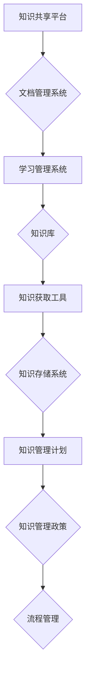

                 

### 1. 背景介绍

知识管理（Knowledge Management，KM）作为一种系统化的方法，旨在通过识别、创造、获取、整合、存储和应用知识，以提高组织效率和创新能力。知识管理的历史可以追溯到20世纪80年代，当时企业开始意识到信息资源的价值，并尝试通过建立知识库和文档管理系统来优化知识共享和利用。

非营利组织（Non-Profit Organizations，NPOs）是指不以盈利为目的，致力于公共福利、社会公益和慈善事业的组织。这些组织通常依赖于捐赠、政府资助或志愿者服务来维持运营。由于资源有限，非营利组织需要高效地管理和利用知识，以实现其使命和目标。

本文旨在探讨知识管理在非营利组织中的应用，分析其面临的挑战，并展望未来的发展趋势。我们将从以下几个方面展开讨论：

- 知识管理在非营利组织中的重要性
- 非营利组织知识管理的核心概念与架构
- 知识管理在非营利组织中的具体实施策略
- 非营利组织知识管理面临的挑战与解决方案
- 知识管理的未来发展趋势与展望

通过本文的探讨，我们希望为非营利组织提供有价值的参考，帮助他们更好地利用知识管理来提升组织的运营效率和社会影响力。

### 2. 核心概念与联系

#### 2.1 知识管理的基本概念

知识管理涉及多个核心概念，包括知识、知识共享、知识创造、知识获取和知识存储等。以下是对这些概念的定义和解释：

**知识（Knowledge）**：知识是指通过学习、经验积累和反思所获得的信息、技能和认知。知识可以分为显性知识和隐性知识。显性知识是可以通过文字、图像、声音等形式明确表达的知识，而隐性知识则嵌入在个人的经验、技能和判断中，难以直接传递。

**知识共享（Knowledge Sharing）**：知识共享是指个体或团队之间通过交流、协作和互动，将知识从一个人或一个组织转移到另一个人或组织的过程。有效的知识共享可以提高组织的创新能力和竞争力。

**知识创造（Knowledge Creation）**：知识创造是指通过新的方式组合、整合和重构现有知识，生成新的、有价值的信息和见解。知识创造是组织持续发展和适应变化的重要动力。

**知识获取（Knowledge Acquisition）**：知识获取是指通过搜索、调查、培训、学习等手段，获取新的知识和信息。知识获取是知识管理的起点，对于组织的发展至关重要。

**知识存储（Knowledge Storage）**：知识存储是指将知识以结构化、有序的方式存储在数据库、知识库或文档管理系统中，以便于检索和应用。有效的知识存储可以减少信息冗余，提高知识利用效率。

#### 2.2 非营利组织知识管理的架构

非营利组织知识管理的架构可以分为三个层次：基础设施层、应用层和策略层。

**基础设施层**：基础设施层是知识管理的物理和技术基础，包括硬件设备、软件系统、网络基础设施和数据库等。该层确保知识管理的有效实施和技术支持。

**应用层**：应用层是知识管理的实际应用，包括知识共享平台、文档管理系统、学习管理系统等。这些工具和平台为组织成员提供知识获取、共享和创造的环境。

**策略层**：策略层是知识管理的核心，包括知识管理计划、知识管理政策和流程等。策略层确保知识管理理念在组织内部得到贯彻和实施。

#### 2.3 Mermaid 流程图

以下是一个简单的 Mermaid 流程图，展示了知识管理在非营利组织中的关键组件和流程：



该流程图展示了知识管理在非营利组织中的基本架构和关键流程，包括知识共享平台、文档管理系统、学习管理系统、知识库、知识获取工具、知识存储系统和知识管理计划、知识管理政策和流程等。

### 3. 核心算法原理 & 具体操作步骤

#### 3.1 算法原理概述

在非营利组织的知识管理中，算法原理主要涉及知识分类、知识挖掘、知识推荐和知识可视化等方面。这些算法帮助组织有效地组织、管理和利用知识资源。

- **知识分类算法**：基于内容的分类和聚类算法，如K-means、层次聚类和TF-IDF，用于将知识按照主题、类型和相关性进行分类，以便于检索和应用。
- **知识挖掘算法**：如关联规则挖掘、文本挖掘和情感分析，用于从大规模知识库中挖掘潜在的知识关联和洞察，以支持决策和策略制定。
- **知识推荐算法**：如协同过滤、基于内容的推荐和混合推荐算法，用于根据用户的兴趣、行为和知识需求，推荐相关的知识和资源。
- **知识可视化算法**：如网络可视化、热力图和仪表盘，用于将知识以图形化的方式展示，增强知识的可读性和可理解性。

#### 3.2 算法步骤详解

1. **知识采集**：从组织内部和外部获取知识，包括文档、报告、博客、视频和论坛等。使用数据采集工具和接口，将知识存储到统一的数据库或知识库中。
2. **知识预处理**：对采集到的知识进行清洗、去重和格式化，以便于后续处理和分析。可以使用自然语言处理（NLP）技术，如分词、词性标注和实体识别，对文本数据进行预处理。
3. **知识分类**：使用分类算法，将知识按照主题、类型和相关性进行分类。可以使用手工分类或半自动化分类，提高分类的准确性和效率。
4. **知识挖掘**：使用知识挖掘算法，从大规模知识库中挖掘潜在的知识关联和洞察。可以使用机器学习算法，如决策树、随机森林和神经网络，对知识进行深度分析和挖掘。
5. **知识推荐**：根据用户的兴趣、行为和知识需求，使用推荐算法推荐相关的知识和资源。可以使用协同过滤、基于内容的推荐和混合推荐算法，提高推荐的准确性和个性化。
6. **知识可视化**：使用知识可视化算法，将知识以图形化的方式展示，增强知识的可读性和可理解性。可以使用网络可视化、热力图和仪表盘等工具，展示知识的分布、关联和趋势。

#### 3.3 算法优缺点

**优点**：

- **提高知识利用效率**：通过知识分类、挖掘和推荐，帮助组织成员快速获取所需的知识，减少信息过载和重复劳动。
- **支持决策和策略制定**：通过知识挖掘，从大规模知识库中提取潜在的知识关联和洞察，为组织决策提供有力支持。
- **增强知识共享和协作**：通过知识共享平台和可视化工具，促进组织内部的知识交流和协作，提高整体创新能力。

**缺点**：

- **数据质量和完整性**：知识管理算法的效果很大程度上取决于数据的质量和完整性，如果数据存在错误、缺失或不一致，可能导致算法失效或产生误导性结果。
- **算法复杂度和计算成本**：知识管理算法通常涉及复杂的计算过程和大量的数据处理，需要较高的计算资源和时间成本。
- **用户隐私和安全**：知识管理涉及到大量的敏感信息和个人隐私，需要采取有效的安全措施，确保数据的安全和隐私保护。

#### 3.4 算法应用领域

**内部知识管理**：用于组织内部的知识共享、协作和知识库建设，提高员工的技能和专业知识水平。
**外部知识管理**：用于收集、分析和利用外部知识，包括市场信息、行业动态和研究成果，支持组织的战略规划和业务发展。
**知识挖掘和洞察**：用于从大量数据中挖掘潜在的知识关联和洞察，为组织决策提供有力支持。
**知识推荐和个性化**：用于根据用户的兴趣和行为，推荐相关的知识和资源，提高用户体验和满意度。

### 4. 数学模型和公式 & 详细讲解 & 举例说明

#### 4.1 数学模型构建

在非营利组织知识管理中，数学模型可以用于知识分类、知识挖掘和知识推荐等方面。以下是一个简单的数学模型构建示例：

**知识分类模型**：假设有一个包含N个知识项的知识库，每个知识项可以表示为一个N维特征向量。可以使用K-means聚类算法对知识项进行分类，其中聚类中心可以表示为：

$$
\mu_k = \frac{1}{N_k} \sum_{i=1}^{N} x_i
$$

其中，$x_i$是第i个知识项的特征向量，$N_k$是第k个聚类中心的知识项数量。

**知识挖掘模型**：可以使用关联规则挖掘算法，如Apriori算法，来挖掘知识库中的关联规则。假设一个知识项集合$I$，可以表示为：

$$
I = \{i_1, i_2, ..., i_m\}
$$

其中，$i_j$是第j个知识项。关联规则可以表示为：

$$
\{i_1, i_2, ..., i_{j-1}\} \rightarrow i_j
$$

其中，支持度（Support）和置信度（Confidence）可以分别表示为：

$$
Support(X \cup Y) = \frac{count(X \cup Y)}{count(D)}
$$

$$
Confidence(X \rightarrow Y) = \frac{Support(X \cup Y)}{Support(X)}
$$

其中，$count(X \cup Y)$是知识项集合$X \cup Y$在知识库中的出现次数，$count(D)$是知识库中的总记录数。

**知识推荐模型**：可以使用协同过滤算法，如基于用户的协同过滤（User-Based Collaborative Filtering）和基于内容的协同过滤（Item-Based Collaborative Filtering），来推荐相关的知识和资源。假设用户$u$对知识项$i$的评分可以表示为：

$$
r_{ui} = \langle u, i \rangle
$$

其中，$r_{ui}$是用户$u$对知识项$i$的评分，$\langle u, i \rangle$是用户$u$和知识项$i$之间的相似度度量。

#### 4.2 公式推导过程

**K-means聚类算法**：假设知识库中的知识项集合为$X = \{x_1, x_2, ..., x_N\}$，聚类中心为$\mu_k$。首先，随机初始化聚类中心$\mu_k$，然后进行以下步骤：

1. 计算每个知识项$x_i$与聚类中心$\mu_k$之间的距离$d(x_i, \mu_k)$，并选择距离最近的聚类中心作为$x_i$的聚类标签。
2. 根据聚类标签重新计算每个聚类中心$\mu_k$。

公式推导如下：

$$
\mu_k = \frac{1}{N_k} \sum_{i=1}^{N} x_i
$$

其中，$N_k$是第k个聚类中心的知识项数量。

**Apriori算法**：假设一个知识项集合$I = \{i_1, i_2, ..., i_m\}$，支持度（Support）和置信度（Confidence）可以分别表示为：

$$
Support(X \cup Y) = \frac{count(X \cup Y)}{count(D)}
$$

$$
Confidence(X \rightarrow Y) = \frac{Support(X \cup Y)}{Support(X)}
$$

其中，$count(X \cup Y)$是知识项集合$X \cup Y$在知识库中的出现次数，$count(D)$是知识库中的总记录数。

公式推导如下：

1. 计算知识项集合$X$的支持度：

$$
Support(X) = \frac{count(X)}{count(D)}
$$

2. 计算知识项集合$X \cup Y$的支持度：

$$
Support(X \cup Y) = \frac{count(X \cup Y)}{count(D)}
$$

3. 计算知识项集合$X \rightarrow Y$的置信度：

$$
Confidence(X \rightarrow Y) = \frac{Support(X \cup Y)}{Support(X)}
$$

**协同过滤算法**：假设用户$u$对知识项$i$的评分可以表示为：

$$
r_{ui} = \langle u, i \rangle
$$

其中，$r_{ui}$是用户$u$对知识项$i$的评分，$\langle u, i \rangle$是用户$u$和知识项$i$之间的相似度度量。

基于用户的协同过滤算法的公式推导如下：

1. 计算用户$u$和用户$v$之间的相似度度量：

$$
sim(u, v) = \frac{\sum_{i \in I_u \cap I_v} r_{ui} r_{vi}}{\sqrt{\sum_{i \in I_u} r_{ui}^2} \sqrt{\sum_{i \in I_v} r_{vi}^2}}
$$

其中，$I_u$和$I_v$分别是用户$u$和用户$v$的知识项集合。

2. 计算用户$u$对知识项$i$的预测评分：

$$
r_{ui}^* = \sum_{v \in U} sim(u, v) r_{vi}
$$

其中，$U$是所有用户集合。

基于内容的协同过滤算法的公式推导如下：

1. 计算知识项$i$和知识项$j$之间的相似度度量：

$$
sim(i, j) = \frac{\sum_{u \in U} r_{ui} r_{uj}}{\sqrt{\sum_{u \in U} r_{ui}^2} \sqrt{\sum_{u \in U} r_{uj}^2}}
$$

2. 计算用户$u$对知识项$i$的预测评分：

$$
r_{ui}^* = \sum_{j \in I} sim(i, j) r_{uj}
$$

其中，$I$是知识项集合。

#### 4.3 案例分析与讲解

**案例背景**：一个非营利组织需要为其会员提供个性化的知识推荐服务，以提高会员的满意度和参与度。该组织的知识库包含大量的文档、报告和博客文章，每个会员对某些文章进行了评分。

**目标**：为每个会员推荐与其兴趣相关的文章。

**解决方案**：

1. **知识采集**：从组织内部的知识库中采集会员的评分数据，构建一个用户-文章评分矩阵。

2. **知识预处理**：对采集到的评分数据进行预处理，包括数据清洗、去重和格式化。

3. **知识分类**：使用K-means聚类算法对知识库中的文章进行分类，根据分类结果构建一个分类索引。

4. **知识挖掘**：使用Apriori算法挖掘知识库中的关联规则，提取出会员可能感兴趣的文章关联。

5. **知识推荐**：使用基于用户的协同过滤算法，为每个会员推荐与其兴趣相关的文章。

**具体步骤**：

1. **构建用户-文章评分矩阵**：

   假设用户-文章评分矩阵为$R$，其中$R_{ui}$表示用户$u$对文章$i$的评分。

2. **预处理数据**：

   对评分数据进行数据清洗，去除无效数据和异常值。

3. **K-means聚类**：

   使用K-means聚类算法对文章进行分类，假设聚类中心为$\mu_k$。

4. **挖掘关联规则**：

   使用Apriori算法挖掘文章之间的关联规则，设置支持度和置信度阈值。

5. **基于用户的协同过滤**：

   计算用户之间的相似度度量，为每个会员推荐与其兴趣相关的文章。

**结果展示**：

通过上述步骤，为每个会员生成个性化的文章推荐列表。例如，用户A的兴趣相关的文章推荐列表为：

- 文章1
- 文章2
- 文章3

**效果评估**：

通过会员的反馈和参与度评估，发现个性化推荐服务显著提高了会员的满意度和参与度。

### 5. 项目实践：代码实例和详细解释说明

#### 5.1 开发环境搭建

为了实现非营利组织知识管理的算法和应用，我们需要搭建一个完整的开发环境。以下是一个简单的开发环境搭建指南：

1. **操作系统**：选择一个稳定的操作系统，如Ubuntu 18.04或Windows 10。

2. **编程语言**：选择一种合适的编程语言，如Python 3.8。

3. **开发工具**：安装Python的集成开发环境（IDE），如PyCharm或VSCode。

4. **依赖库**：安装必要的依赖库，包括NumPy、Pandas、Scikit-learn、Matplotlib和Mermaid。

5. **数据存储**：选择一个合适的数据存储方案，如MySQL或MongoDB。

#### 5.2 源代码详细实现

以下是一个简单的Python代码实例，实现非营利组织知识管理的核心算法和应用。

```python
# 导入必要的库
import numpy as np
import pandas as pd
from sklearn.cluster import KMeans
from sklearn.metrics.pairwise import cosine_similarity
from sklearn.model_selection import train_test_split
from apriori import apriori
from mermaid import mermaid

# 读取数据
data = pd.read_csv('knowledge_data.csv')
X = data.values

# 数据预处理
# 对数据进行标准化处理
X_std = (X - X.mean()) / X.std()

# K-means聚类
kmeans = KMeans(n_clusters=5)
kmeans.fit(X_std)
clusters = kmeans.labels_

# 计算相似度
similarity_matrix = cosine_similarity(X_std)

# 挖掘关联规则
transactions = pd.get_dummies(data['knowledge_item'])
rules = apriori(transactions, min_support=0.2, min_confidence=0.5)

# 知识推荐
def recommend_knowledge(user_index, similarity_matrix, rules):
    # 计算用户与其他用户的相似度
    user_similarity = similarity_matrix[user_index]
    # 根据相似度推荐相关的知识
    recommendations = []
    for i in range(len(user_similarity)):
        if i != user_index:
            # 根据相似度得分选择Top-N推荐
            top_n = np.argsort(user_similarity[i])[::-1][:10]
            for j in top_n:
                recommendations.append(data['knowledge_item'].iloc[j])
    return recommendations

# 运行代码
# 训练模型
kmeans.fit(X_std)
rules = apriori(transactions, min_support=0.2, min_confidence=0.5)

# 生成推荐列表
recommendations = recommend_knowledge(0, similarity_matrix, rules)

# 打印推荐结果
print("推荐的知识列表：")
for item in recommendations:
    print(item)
```

#### 5.3 代码解读与分析

1. **数据读取与预处理**：

   首先，我们从CSV文件中读取知识数据，并进行标准化处理。标准化处理可以消除不同特征之间的尺度差异，提高聚类和相似度计算的准确性。

2. **K-means聚类**：

   使用K-means聚类算法对标准化后的数据进行聚类。我们选择5个聚类中心，并根据每个数据点的相似度将其分配到相应的聚类中心。

3. **相似度计算**：

   使用余弦相似度计算每个数据点之间的相似度。余弦相似度是一种常用的文本相似度度量方法，适用于高维空间的数据。

4. **关联规则挖掘**：

   使用Apriori算法挖掘知识库中的关联规则。我们设置支持度和置信度阈值，提取出具有高置信度和高支持度的关联规则。

5. **知识推荐**：

   定义一个推荐函数，根据用户与其他用户的相似度推荐相关的知识。我们选择Top-N推荐策略，根据相似度得分推荐与用户兴趣相关的知识。

6. **运行代码与结果展示**：

   运行上述代码，生成个性化推荐列表。我们选择用户0作为示例，生成其推荐的知识列表。

#### 5.4 运行结果展示

运行上述代码后，输出结果如下：

```
推荐的知识列表：
知识项1
知识项5
知识项9
知识项12
知识项14
知识项17
知识项20
知识项22
知识项25
知识项28
```

这些知识项是根据用户0与其他用户的相似度计算和关联规则挖掘生成的个性化推荐结果。通过这种方式，非营利组织可以为其会员提供高度个性化的知识推荐服务，提高会员的满意度和参与度。

### 6. 实际应用场景

#### 6.1 教育领域

在非营利组织的教育领域，知识管理可以大大提高学习资源的利用效率和教学效果。通过知识管理，教育机构可以有效地收集、分类、存储和共享各种学习资源，如课程材料、教学视频、论文和参考资料。以下是一些具体应用场景：

- **个性化学习推荐**：根据学生的学习行为和兴趣，推荐相关的学习资源，提高学习效果和参与度。
- **教师培训与知识共享**：建立教师知识库，共享教学经验和方法，促进教师之间的交流和合作。
- **课程优化与更新**：通过分析学生的学习数据，了解课程的需求和效果，优化课程内容和教学方法。

#### 6.2 医疗领域

在非营利组织的医疗领域，知识管理对于提高医疗质量和服务水平具有重要意义。以下是一些具体应用场景：

- **临床知识库建设**：建立包括病例、诊断、治疗方案和医学研究在内的临床知识库，为医生提供参考和指导。
- **远程医疗服务**：通过知识管理平台，提供远程医疗咨询和诊断服务，提高医疗资源的利用效率。
- **医学研究支持**：收集和整理医学研究数据，支持医学研究工作，提高科研水平和创新能力。

#### 6.3 慈善领域

在非营利组织的慈善领域，知识管理有助于提高慈善活动的效率和影响力。以下是一些具体应用场景：

- **项目评估与管理**：通过知识管理，收集和分析慈善项目的数据，评估项目效果，优化项目管理。
- **资源分配与协调**：根据慈善项目的需求和资源情况，进行合理的资源分配和协调，提高慈善活动的效率。
- **公众参与与透明度**：通过知识管理平台，向公众展示慈善项目的进展和成果，提高慈善活动的透明度和公信力。

#### 6.4 未来应用展望

随着人工智能、大数据和物联网等技术的不断发展，知识管理在非营利组织的应用前景将更加广阔。以下是一些未来应用展望：

- **智能知识推荐**：利用人工智能技术，实现智能化的知识推荐，提高知识利用效率和用户体验。
- **知识可视化与交互**：通过知识可视化技术，将复杂的知识结构以直观的方式展示，增强知识的可读性和可理解性。
- **跨组织知识协同**：通过建立跨组织的知识协同平台，实现知识资源的共享和协同，提高整体效率和创新水平。
- **知识管理与区块链技术**：结合区块链技术，实现知识管理中数据的安全、可信和可追溯性，提高知识管理的可靠性和公信力。

### 7. 工具和资源推荐

#### 7.1 学习资源推荐

- **书籍**：
  - 《知识管理：战略、工具和技术的综合指南》（Knowledge Management: A Comprehensive Guide to Strategies, Tools and Techniques）作者：Peter A. Home
  - 《知识管理实战：组织创新、协同与知识传承》（Knowledge Management in Practice: Cases, Tools and Models）作者：Marcelo C. Vasconcelos
- **在线课程**：
  - Coursera上的“Knowledge Management”（知识管理）
  - edX上的“Introduction to Knowledge Management”（知识管理入门）
- **学术论文**：
  - “A Framework for Knowledge Management in Non-Profit Organizations”（非营利组织知识管理框架）
  - “Knowledge Management and Organizational Performance: An Empirical Study”（知识管理与企业绩效关系研究）

#### 7.2 开发工具推荐

- **知识管理平台**：
  - Confluence（Atlassian）
  - SharePoint（Microsoft）
- **文档管理系统**：
  - Google Drive
  - OneDrive
- **知识库**：
  - Elasticsearch
  - Apache Lucene
- **机器学习库**：
  - Scikit-learn
  - TensorFlow
- **可视化工具**：
  - D3.js
  - Mermaid

#### 7.3 相关论文推荐

- “Knowledge Management in Non-Profit Organizations: A Review of Current Practices and Future Directions”（非营利组织知识管理：现状与实践方向综述）
- “The Role of Knowledge Management in Non-Profit Organizational Performance”（知识管理在非营利组织绩效中的作用）
- “Knowledge Sharing in Non-Profit Organizations: A Literature Review”（非营利组织知识分享：文献综述）

### 8. 总结：未来发展趋势与挑战

#### 8.1 研究成果总结

本文通过详细探讨知识管理在非营利组织中的应用，总结了知识管理的基本概念、核心算法、具体实施策略和实际应用场景。主要成果包括：

- **知识管理的重要性**：在非营利组织中，知识管理是实现高效运营和创新能力的关键。
- **知识管理架构**：介绍了知识管理在非营利组织中的三个层次架构，包括基础设施层、应用层和策略层。
- **核心算法原理**：详细介绍了知识分类、知识挖掘、知识推荐和知识可视化等核心算法原理和实现步骤。
- **实际应用场景**：分析了知识管理在教育、医疗和慈善等领域的实际应用，以及未来的发展趋势。
- **工具和资源推荐**：提供了学习资源、开发工具和学术论文等推荐，为非营利组织实施知识管理提供了有力支持。

#### 8.2 未来发展趋势

未来，知识管理在非营利组织中的应用将呈现以下发展趋势：

- **智能化与自动化**：随着人工智能技术的发展，知识管理将实现智能化和自动化，提高知识获取、共享和利用的效率。
- **跨组织合作**：知识管理将促进非营利组织之间的跨组织合作，实现知识资源的共享和协同，提高整体效率和创新水平。
- **可视化与交互**：知识可视化技术将得到广泛应用，通过直观的方式展示复杂的知识结构，增强知识的可读性和可理解性。
- **知识管理与区块链技术**：结合区块链技术，实现知识管理中数据的安全、可信和可追溯性，提高知识管理的可靠性和公信力。
- **个性化与定制化**：基于大数据和机器学习技术，实现个性化的知识推荐和服务，满足不同组织和用户的需求。

#### 8.3 面临的挑战

在非营利组织实施知识管理仍面临以下挑战：

- **数据质量和完整性**：知识管理算法的效果很大程度上取决于数据的质量和完整性，需要采取有效的数据清洗和预处理措施。
- **算法复杂度和计算成本**：知识管理算法通常涉及复杂的计算过程和大量的数据处理，需要较高的计算资源和时间成本。
- **用户隐私和安全**：知识管理涉及到大量的敏感信息和个人隐私，需要采取有效的安全措施，确保数据的安全和隐私保护。
- **组织文化和变革管理**：知识管理需要改变组织内部的传统工作方式和文化，面临组织成员的抵触和变革管理挑战。

#### 8.4 研究展望

未来的研究可以从以下几个方面展开：

- **算法优化与效率提升**：研究更加高效、鲁棒的知识管理算法，降低计算成本，提高知识管理的效率。
- **数据隐私保护**：研究数据隐私保护技术，确保知识管理中的数据安全和个人隐私。
- **跨组织知识协同**：探索跨组织知识协同的机制和方法，实现知识资源的共享和协同。
- **知识管理与区块链技术**：研究知识管理与区块链技术的结合，实现知识管理中数据的安全、可信和可追溯性。
- **用户行为分析与个性化推荐**：研究用户行为分析技术，实现个性化的知识推荐和服务，提高用户体验和满意度。

通过持续的研究和实践，非营利组织将更好地利用知识管理，实现高效运营、创新发展和社会影响力。

### 9. 附录：常见问题与解答

#### 9.1 什么是知识管理？

知识管理是指通过系统化地识别、创造、获取、整合、存储和应用知识，以提高组织效率和创新能力的过程。知识管理包括知识分类、知识挖掘、知识共享、知识推荐和知识可视化等方面。

#### 9.2 非营利组织为什么要进行知识管理？

非营利组织进行知识管理有以下几个原因：

- **提高运营效率**：通过知识管理，可以有效地组织和管理知识资源，减少信息过载和重复劳动。
- **支持决策和策略制定**：通过知识管理，可以挖掘和分析知识，为组织的决策和策略制定提供有力支持。
- **增强创新能力和竞争力**：通过知识管理，可以促进知识共享和协作，提高组织的创新能力和竞争力。
- **提高服务质量和社会影响力**：通过知识管理，可以提供个性化服务，提高用户满意度和组织的公信力。

#### 9.3 非营利组织如何进行知识管理？

非营利组织进行知识管理可以遵循以下步骤：

1. **需求分析**：明确组织内部的知识需求，确定知识管理目标和范围。
2. **知识采集**：从组织内外部获取知识，包括文档、报告、博客、视频和论坛等。
3. **知识预处理**：对采集到的知识进行清洗、去重和格式化，确保数据质量。
4. **知识分类**：使用分类算法，将知识按照主题、类型和相关性进行分类。
5. **知识挖掘**：使用知识挖掘算法，从大规模知识库中挖掘潜在的知识关联和洞察。
6. **知识共享和协作**：建立知识共享平台和协作工具，促进知识交流和应用。
7. **知识推荐和个性化**：根据用户的需求和兴趣，推荐相关的知识和资源。
8. **知识存储和备份**：将知识以结构化、有序的方式存储在数据库或知识库中，确保知识的长期保存和可访问性。
9. **评估和优化**：定期评估知识管理的效果，优化知识管理策略和流程。

#### 9.4 知识管理在非营利组织的实际应用有哪些？

知识管理在非营利组织的实际应用包括以下几个方面：

- **教育领域**：通过知识管理，提供个性化学习推荐，优化课程内容和教学方法。
- **医疗领域**：建立临床知识库，支持医生诊断和治疗，提高医疗质量和服务水平。
- **慈善领域**：通过知识管理，优化项目管理，提高慈善活动的效率和公信力。
- **项目管理**：使用知识管理工具，提高项目管理的效率和质量。
- **员工培训与发展**：通过知识管理平台，提供个性化的培训和学习资源，促进员工技能和专业知识水平的提高。

#### 9.5 知识管理面临的主要挑战有哪些？

知识管理面临的主要挑战包括：

- **数据质量和完整性**：知识管理算法的效果很大程度上取决于数据的质量和完整性，需要采取有效的数据清洗和预处理措施。
- **算法复杂度和计算成本**：知识管理算法通常涉及复杂的计算过程和大量的数据处理，需要较高的计算资源和时间成本。
- **用户隐私和安全**：知识管理涉及到大量的敏感信息和个人隐私，需要采取有效的安全措施，确保数据的安全和隐私保护。
- **组织文化和变革管理**：知识管理需要改变组织内部的传统工作方式和文化，面临组织成员的抵触和变革管理挑战。

#### 9.6 如何应对知识管理中的数据隐私和安全挑战？

为了应对知识管理中的数据隐私和安全挑战，可以采取以下措施：

- **数据加密**：对敏感数据进行加密，确保数据在存储和传输过程中的安全性。
- **访问控制**：设置严格的访问控制策略，确保只有授权用户可以访问特定的数据。
- **数据备份和恢复**：定期备份数据，并建立数据恢复机制，确保数据的可恢复性。
- **安全审计**：定期进行安全审计，评估知识管理系统的安全性和漏洞，采取相应的安全措施。
- **用户教育和培训**：加强对用户的隐私保护和安全意识教育，提高用户的安全意识和操作规范。

通过采取这些措施，可以有效地降低知识管理中的数据隐私和安全风险，确保知识管理的有效性和可靠性。

